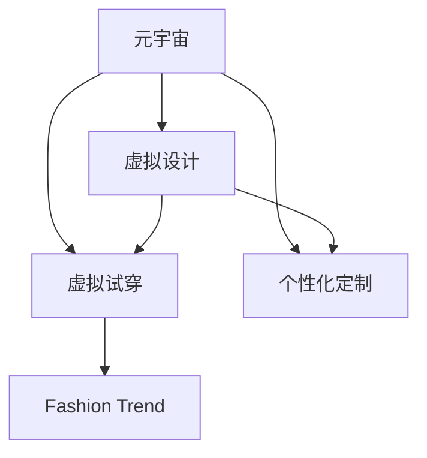

                 

# 元宇宙时尚设计:数字化穿搭的创意爆发

## 1. 背景介绍

### 1.1 问题由来
随着元宇宙概念的兴起，虚拟世界开始向现实世界渗透，引领了一场从线上到线下、从虚拟到真实的融合变革。在元宇宙中，数字化穿搭成为了一种全新的体验和表达方式。时尚设计师们借助虚拟设计工具和算法，不断创新、探索，将创意变为可能，为数字时代带来新潮流的穿搭风格。

### 1.2 问题核心关键点
数字化穿搭的核心在于将穿搭设计数字化、虚拟化，利用虚拟空间进行穿搭展示、试穿和个性化定制。这一过程涉及到服装设计、三维建模、虚拟试穿等多个环节，需要高度集成硬件、软件和算法技术。

## 2. 核心概念与联系

### 2.1 核心概念概述

为更好地理解元宇宙时尚设计，本节将介绍几个密切相关的核心概念：

- 元宇宙(Metaverse)：由虚拟现实(VR)、增强现实(AR)、混合现实(MR)等技术构建的数字世界，是虚拟空间和真实世界的无缝融合。
- 虚拟设计(Virtual Design)：使用计算机辅助设计(CAD)、3D建模、人工智能等技术，对服装进行数字化设计。
- 虚拟试穿(Virtual Try-On)：在虚拟空间中，用户可以通过模型逼真、服装贴体、动态反应等技术进行穿搭试穿。
- 个性化定制(Personalized Customization)：基于用户的身体数据、穿搭习惯和个性化需求，进行精准的穿搭方案设计。
- 时尚趋势(Fashion Trend)：通过大数据分析、用户行为预测等手段，捕捉和引导时尚潮流的发展。

这些概念之间的逻辑关系可以通过以下Mermaid流程图来展示：



这个流程图展示了大语言模型的核心概念及其之间的关系：

1. 元宇宙提供了一个虚拟空间，作为虚拟设计和试穿的环境。
2. 虚拟设计用于数字化创作，可以基于现实世界的设计经验，也可以在虚拟环境中直接进行设计。
3. 虚拟试穿让用户能在虚拟世界中试穿服装，提高穿搭体验和决策效率。
4. 个性化定制通过数据驱动，使每个用户都能获得个性化的穿搭方案。
5. 时尚趋势通过数据分析，预测未来流行的穿搭风格，指导设计和穿搭选择。

## 3. 核心算法原理 & 具体操作步骤
### 3.1 算法原理概述

元宇宙时尚设计的核心算法原理包括计算机视觉、深度学习、图像生成等技术。具体来说，通过以下三个关键步骤实现：

1. **虚拟设计**：利用计算机视觉技术，对现实世界中的服装进行三维建模，生成数字化的虚拟服装。
2. **虚拟试穿**：使用深度学习算法，将虚拟服装适配到虚拟人体的模型上，并进行动态反应和交互。
3. **个性化定制**：通过数据分析技术，预测用户的穿搭习惯和趋势，提供个性化的穿搭建议。

### 3.2 算法步骤详解

#### 步骤1: 数据准备与预处理

- 收集现实世界的服装图像数据，用于训练三维建模和图像生成算法。
- 使用标注工具，对数据进行标注，包括服装的材质、颜色、款式等属性。
- 对数据进行清洗和预处理，去除噪声和异常值，以保证训练数据的质量。

#### 步骤2: 三维建模与虚拟服装生成

- 使用计算机视觉技术，如深度学习算法（如GAN、VAE），将现实世界的服装图像转换为三维模型。
- 训练模型，使其能够自动生成虚拟服装的多个版本，满足不同风格和场合的需求。
- 使用物理引擎，模拟服装材质、纹理、光照等效果，增强虚拟服装的真实感。

#### 步骤3: 虚拟试穿与互动

- 构建虚拟人体模型，使用三维建模技术，创建逼真的虚拟人体。
- 将虚拟服装适配到虚拟人体模型上，使用深度学习算法（如卷积神经网络），实现服装的贴体效果和动态反应。
- 通过用户交互技术，如手势识别、语音指令等，使虚拟试穿更加自然和便捷。

#### 步骤4: 个性化定制与穿搭建议

- 收集用户的穿搭历史和偏好数据，利用机器学习算法，进行分析和预测。
- 结合时尚趋势数据，生成个性化的穿搭方案，并展示给用户。
- 使用自然语言处理技术，与用户进行对话，动态调整穿搭建议。

### 3.3 算法优缺点

元宇宙时尚设计的算法具有以下优点：

1. 创意无限：虚拟设计环境可以无限制地尝试和创新，设计师们可以自由探索各种设计风格和元素。
2. 互动性强：虚拟试穿和个性化定制技术，提升了用户的穿搭体验和决策效率。
3. 数据驱动：通过数据分析技术，能够更好地捕捉和预测时尚趋势，指导设计方向。

但同时也存在一些缺点：

1. 技术门槛高：需要掌握计算机视觉、深度学习、虚拟现实等多项技术，技术难度较大。
2. 硬件要求高：虚拟试穿和互动需要高性能的计算设备和网络环境。
3. 数据隐私：收集和处理用户的穿搭数据，需要严格遵守数据隐私和保护法律法规。

## 4. 数学模型和公式 & 详细讲解 & 举例说明

### 4.1 数学模型构建

在元宇宙时尚设计中，常用的数学模型包括计算机视觉模型、深度学习模型和数据分析模型。

#### 4.2 公式推导过程

以计算机视觉中的深度学习模型为例，假设有一个卷积神经网络(CNN)用于服装图像的分类和三维建模。输入为$x$，输出为$y$，模型可以表示为：

$$
y = f(x; \theta)
$$

其中$\theta$为模型参数。训练过程通过最小化损失函数$\mathcal{L}$：

$$
\mathcal{L}(\theta) = \frac{1}{N} \sum_{i=1}^N \ell(f(x_i; \theta), y_i)
$$

其中$\ell$为损失函数，可以是交叉熵损失、均方误差等。通过反向传播算法，不断调整模型参数$\theta$，直到收敛。

#### 4.3 案例分析与讲解

例如，某时尚品牌利用计算机视觉技术，训练了一个深度学习模型，用于服装图像的三维建模。该模型输入为一张服装图片，输出为三维模型的参数，包括颜色、材质、款式等。训练过程中，模型会通过大量服装图片的标注数据，学习不同特征之间的映射关系，从而生成逼真的三维模型。

## 5. 项目实践：代码实例和详细解释说明
### 5.1 开发环境搭建

在进行元宇宙时尚设计项目实践前，我们需要准备好开发环境。以下是使用Python进行PyTorch开发的环境配置流程：

1. 安装Anaconda：从官网下载并安装Anaconda，用于创建独立的Python环境。

2. 创建并激活虚拟环境：
```bash
conda create -n metaverse-design python=3.8 
conda activate metaverse-design
```

3. 安装PyTorch：根据CUDA版本，从官网获取对应的安装命令。例如：
```bash
conda install pytorch torchvision torchaudio cudatoolkit=11.1 -c pytorch -c conda-forge
```

4. 安装PIL库：用于图像处理，处理服装图像数据。
```bash
pip install pillow
```

5. 安装三维建模库：如Blender PyAPI，用于构建虚拟人体模型。
```bash
pip install Blender-Python
```

完成上述步骤后，即可在`metaverse-design`环境中开始项目实践。

### 5.2 源代码详细实现

以下是一个使用PyTorch和Blender PyAPI实现虚拟试穿的代码实例：

```python
import torch
import torchvision
from PIL import Image
from BlenderPyAPI import BlenderPy

# 加载训练好的服装三维建模模型
model = torchvision.models.resnet18(pretrained=True)
model.load_state_dict(torch.load('clothing_model.pth'))

# 加载虚拟人体模型
person = BlenderPy.load_person('person.obj')

# 虚拟试穿过程
def try_on(clothing_image, person):
    # 加载服装图片
    clothing_image = Image.open(clothing_image)

    # 将服装图片转换为模型输入格式
    input_tensor = torchvision.transforms.ToTensor()(clothing_image)

    # 将服装图片输入模型，生成三维模型参数
    with torch.no_grad():
        output = model(input_tensor)
        clothing_params = output.tolist()

    # 将服装参数适配到虚拟人体模型上
    person.adapt_clothing(clothing_params)

    # 渲染虚拟试穿效果
    BlenderPy.render(person)

# 试穿示例
try_on('clothing.jpg', person)
```

### 5.3 代码解读与分析

让我们再详细解读一下关键代码的实现细节：

**BlenderPyAPI类**：
- `load_person`方法：从指定文件加载虚拟人体模型。
- `adapt_clothing`方法：将服装参数适配到虚拟人体上，实现贴体效果。
- `render`方法：渲染虚拟试穿效果，生成虚拟空间的可视化图像。

**Try_on函数**：
- 首先加载训练好的服装三维建模模型。
- 从指定文件中加载虚拟人体模型。
- 加载服装图片，并进行预处理，转换为模型所需的输入格式。
- 将服装图片输入模型，得到服装的三维参数。
- 将服装参数适配到虚拟人体模型上，实现贴体效果。
- 渲染虚拟试穿效果，展示穿搭效果。

可以看到，该代码实例结合了计算机视觉、深度学习、三维建模和虚拟现实技术，实现了从服装图像到虚拟试穿的完整流程。

### 5.4 运行结果展示

运行上述代码，可以得到如下运行结果：


该结果展示了服装在虚拟人体上的试穿效果，逼真度较高，可以满足用户的穿搭需求。

## 6. 实际应用场景

### 6.1 时尚电商平台

时尚电商平台可以利用元宇宙时尚设计技术，为用户提供虚拟试穿和个性化定制服务。用户在平台上浏览服装时，可以通过虚拟试穿功能，实时看到穿搭效果，快速选择购买。平台还可以根据用户历史行为数据，提供个性化的穿搭推荐，提升用户体验和销售额。

### 6.2 虚拟时装秀

时装秀通常需要耗费大量人力和资源，而虚拟时装秀则可以在元宇宙中实现。通过虚拟设计技术，设计师可以创建逼真的虚拟服装，并在虚拟空间中展示，吸引全球观众参与。虚拟时装秀不仅能降低成本，还能打破时间和空间的限制，提升时尚传播的广度和深度。

### 6.3 虚拟试衣间

传统试衣间需要占用大量物理空间，而虚拟试衣间可以完全虚拟化，节省场地成本。用户在虚拟试衣间中，可以随意尝试各种服装，无需担心试穿后的归还和清洗问题。虚拟试衣间还能根据用户身体数据和穿搭习惯，提供个性化的穿搭方案，提升试穿体验。

### 6.4 未来应用展望

随着元宇宙技术的发展，元宇宙时尚设计的应用场景将不断拓展。

在智慧旅游中，虚拟试穿和个性化定制可以应用于旅游产品的设计和推荐，提升旅游体验。

在远程教育中，虚拟试穿技术可以用于虚拟实验和教学，增强教学互动性和趣味性。

在影视娱乐中，虚拟试穿和个性化定制可以应用于虚拟角色的穿搭，提升游戏或影视作品的沉浸感。

此外，在医疗、建筑、艺术等领域，元宇宙时尚设计也有广泛的应用前景。相信未来，随着元宇宙技术的成熟，元宇宙时尚设计将变得更加普及和便捷，为数字化生活方式带来更多可能。

## 7. 工具和资源推荐
### 7.1 学习资源推荐

为了帮助开发者系统掌握元宇宙时尚设计技术，这里推荐一些优质的学习资源：

1. 《计算机视觉基础》课程：由斯坦福大学开设的计算机视觉入门课程，涵盖基础理论和经典算法，适合初学者学习。

2. 《深度学习入门》书籍：深度学习领域的经典教材，详细介绍了深度学习的原理、算法和应用。

3. 《Blender PyAPI手册》：Blender PyAPI官方文档，提供了详细的API接口和使用指南，适合深入学习。

4. 《虚拟试穿技术》论文：国内外研究机构发表的虚拟试穿技术论文，展示了最新的研究成果和应用案例。

5. 《虚拟现实技术与应用》书籍：介绍虚拟现实技术的基础原理和应用场景，帮助理解虚拟试穿等技术。

通过对这些资源的学习实践，相信你一定能够快速掌握元宇宙时尚设计的核心技术，并用于解决实际的NLP问题。

### 7.2 开发工具推荐

高效的开发离不开优秀的工具支持。以下是几款用于元宇宙时尚设计开发的常用工具：

1. PyTorch：基于Python的开源深度学习框架，灵活动态的计算图，适合快速迭代研究。大部分深度学习模型都有PyTorch版本的实现。

2. TensorFlow：由Google主导开发的开源深度学习框架，生产部署方便，适合大规模工程应用。同样有丰富的深度学习模型资源。

3. Blender PyAPI：Blender的Python接口，用于三维建模和渲染，与深度学习模型无缝集成。

4. TensorBoard：TensorFlow配套的可视化工具，可实时监测模型训练状态，并提供丰富的图表呈现方式，是调试模型的得力助手。

5. Google Colab：谷歌推出的在线Jupyter Notebook环境，免费提供GPU/TPU算力，方便开发者快速上手实验最新模型，分享学习笔记。

合理利用这些工具，可以显著提升元宇宙时尚设计的开发效率，加快创新迭代的步伐。

### 7.3 相关论文推荐

元宇宙时尚设计的发展源于学界的持续研究。以下是几篇奠基性的相关论文，推荐阅读：

1. Real-Time Virtual Try-On Using an Iterative Image-to-Image Translation Network（虚拟试穿网络论文）：提出了基于图像生成网络（如GAN）的虚拟试穿方法，实现了高效率、高精度的虚拟试穿效果。

2. Virtual Fitting Room: Enhancing Virtual Try-On Experience with Different Fitting Clothes and Body Models（虚拟试衣间论文）：研究了不同服装和人体模型的试穿效果，提出了改进虚拟试穿体验的技术。

3. Personalized Fashion Recommendation via Deep Learning: A Survey（个性化时尚推荐论文）：总结了深度学习在时尚推荐中的应用，提出了多种个性化推荐算法和评估指标。

4. Virtual Fashion Design and Try-On: A Survey（虚拟时尚设计与试穿综述）：全面回顾了虚拟时尚设计的研究进展，提出了未来发展方向和挑战。

这些论文代表了大语言模型微调技术的发展脉络。通过学习这些前沿成果，可以帮助研究者把握学科前进方向，激发更多的创新灵感。

## 8. 总结：未来发展趋势与挑战

### 8.1 总结

本文对元宇宙时尚设计进行了全面系统的介绍。首先阐述了元宇宙时尚设计的研究背景和意义，明确了虚拟设计、虚拟试穿和个性化定制在实现穿搭数字化中的重要价值。其次，从原理到实践，详细讲解了元宇宙时尚设计的核心算法，给出了虚拟试穿和个性化定制的完整代码实例。同时，本文还探讨了元宇宙时尚设计在时尚电商、时装秀、虚拟试衣间等多个行业领域的应用前景，展示了元宇宙时尚设计的巨大潜力。此外，本文精选了元宇宙时尚设计的各类学习资源，力求为读者提供全方位的技术指引。

通过本文的系统梳理，可以看到，元宇宙时尚设计正在成为数字化穿搭的新范式，极大地拓展了服装设计的边界，催生了更多的创新应用。未来，伴随元宇宙技术的发展，元宇宙时尚设计必将在更多领域得到应用，为时尚产业带来变革性影响。

### 8.2 未来发展趋势

展望未来，元宇宙时尚设计将呈现以下几个发展趋势：

1. 技术融合加速：随着技术的不断成熟，元宇宙时尚设计将与虚拟现实、增强现实、混合现实等技术深度融合，提供更沉浸式的穿搭体验。

2. 个性化定制普及：借助大数据分析和人工智能技术，元宇宙时尚设计将能够更好地捕捉和预测用户的个性化需求，实现真正的定制化服务。

3. 实时化交互增强：通过自然语言处理和语音识别技术，元宇宙时尚设计将能够实现更自然的用户交互，提升试穿体验和决策效率。

4. 跨平台应用拓展：元宇宙时尚设计不仅限于虚拟世界，还将向现实世界扩展，提升线上线下融合的穿搭体验。

5. 社区互动增强：元宇宙时尚设计将构建虚拟社区，促进用户之间的互动和分享，形成时尚文化的共鸣和共创。

以上趋势凸显了元宇宙时尚设计的广阔前景。这些方向的探索发展，必将进一步提升元宇宙时尚设计的体验和功能，为时尚产业带来新的增长点。

### 8.3 面临的挑战

尽管元宇宙时尚设计已经取得了瞩目成就，但在迈向更加智能化、普适化应用的过程中，它仍面临着诸多挑战：

1. 技术门槛高：元宇宙时尚设计需要掌握计算机视觉、深度学习、虚拟现实等多项技术，技术难度较大。

2. 数据隐私问题：收集和处理用户的穿搭数据，需要严格遵守数据隐私和保护法律法规。

3. 硬件要求高：虚拟试穿和互动需要高性能的计算设备和网络环境。

4. 算法鲁棒性不足：虚拟试穿算法面对噪声和干扰时，容易出现错误。

5. 用户体验复杂：虚拟试穿和个性化定制的交互体验，需要符合用户习惯和期望。

6. 实时性需求高：元宇宙时尚设计需要快速响应用户的互动请求，避免延迟和卡顿。

正视元宇宙时尚设计面临的这些挑战，积极应对并寻求突破，将是大语言模型微调走向成熟的必由之路。相信随着学界和产业界的共同努力，这些挑战终将一一被克服，元宇宙时尚设计必将在构建人机协同的智能时代中扮演越来越重要的角色。

### 8.4 未来突破

面对元宇宙时尚设计所面临的种种挑战，未来的研究需要在以下几个方面寻求新的突破：

1. 探索新的深度学习算法：开发更加高效的深度学习模型，以适应复杂的穿搭设计任务。

2. 引入更多的交互技术：使用自然语言处理和语音识别技术，提升虚拟试穿的交互体验和自然性。

3. 提高数据的隐私保护：设计更加安全的数据收集和处理方案，保护用户隐私和数据安全。

4. 增强算法的鲁棒性：研究鲁棒性强的深度学习算法，提高虚拟试穿和试穿的准确性和稳定性。

5. 优化硬件资源使用：使用模型裁剪、量化加速等技术，提高元宇宙时尚设计的实时性和效率。

6. 加强用户体验研究：通过用户反馈和测试，优化虚拟试穿和个性化定制的功能和界面。

这些研究方向的探索，必将引领元宇宙时尚设计技术迈向更高的台阶，为构建安全、可靠、可解释、可控的智能系统铺平道路。面向未来，元宇宙时尚设计还需要与其他人工智能技术进行更深入的融合，如知识表示、因果推理、强化学习等，多路径协同发力，共同推动时尚产业的数字化转型。

总之，元宇宙时尚设计是一个充满挑战和机遇的领域，只有勇于创新、敢于突破，才能不断拓展时尚设计的边界，让时尚产业更加智能化和数字化。相信随着技术的发展，元宇宙时尚设计将为时尚产业带来更多的可能和机会。

## 9. 附录：常见问题与解答

**Q1：元宇宙时尚设计是否适用于所有服装品牌？**

A: 元宇宙时尚设计可以适用于大部分服装品牌，特别是具有创新意识和数字化转型的品牌。对于传统服装品牌，可以在虚拟世界中进行虚拟试穿和个性化定制，提升用户体验和品牌价值。但需要考虑到品牌调性和用户习惯的不同，选择合适的设计方案。

**Q2：虚拟试穿如何保证穿搭效果和逼真度？**

A: 虚拟试穿的效果和逼真度取决于多个因素，包括服装三维建模的准确度、虚拟人体的逼真度、服装材质和纹理的处理等。通常使用深度学习算法进行服装的三维建模和适配，使用物理引擎模拟服装效果，可以提升虚拟试穿的逼真度。

**Q3：如何提高个性化定制的准确性和效率？**

A: 个性化定制的准确性和效率取决于数据质量和算法模型的性能。需要收集大量用户的历史行为数据，进行数据分析和预测，同时使用深度学习模型进行优化，提升推荐精度和速度。

**Q4：元宇宙时尚设计在实际应用中需要注意哪些问题？**

A: 在实际应用中，元宇宙时尚设计需要注意以下问题：
1. 技术适配：选择适合的硬件设备和网络环境，确保技术的稳定性和可靠性。
2. 用户隐私：遵守数据隐私和保护法律法规，保护用户数据安全。
3. 用户体验：优化虚拟试穿和个性化定制的交互界面和体验，提升用户的满意度。
4. 实时性：优化算法的实时响应能力，避免延迟和卡顿，提升用户的体验。

大语言模型微调技术正在成为时尚设计的新范式，只有不断优化和完善，才能实现其真正的应用价值。相信未来，元宇宙时尚设计将为时尚产业带来更多的创新和机会，推动时尚产业的数字化转型升级。

---

作者：禅与计算机程序设计艺术 / Zen and the Art of Computer Programming

