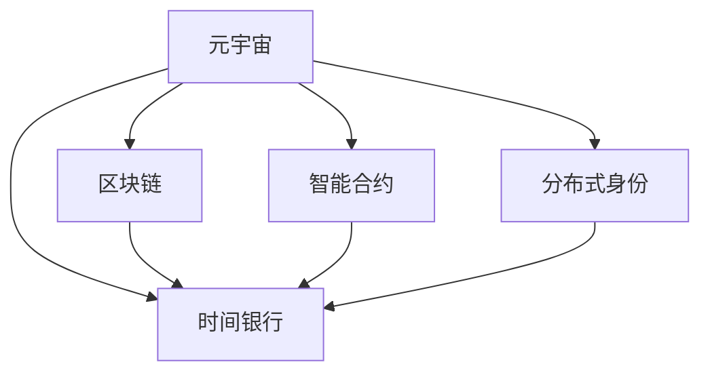

                 

# 元宇宙时间银行:打破物理局限的时间交易

> 关键词：元宇宙,时间银行,区块链,分布式,智能合约,去中心化,虚拟资产,跨界协同,未来经济

## 1. 背景介绍

### 1.1 问题由来
随着数字技术的发展，人们对于时间和价值的关系有了全新的思考。元宇宙作为一种全新的虚拟空间，正在逐渐重塑现实世界的商业模式和社会结构。然而，传统的时间和货币制度在元宇宙中面临着诸多挑战。时间和货币的本质是什么？如何设计一种基于虚拟空间的分布式时间交易系统？时间银行作为一种新兴的时间交易概念，将如何改变未来经济？本文将深入探讨这些话题，并尝试提出一种元宇宙时间银行的设计方案。

### 1.2 问题核心关键点
元宇宙时间银行是一种基于区块链和智能合约的时间价值交易系统。通过引入时间银行的概念，将时间、劳动力和虚拟资产结合在一起，创造出一种全新的经济活动和社交模式。时间银行的核心思想是通过去中心化方式，将个人和集体的时间资源进行有效交换和共享，实现价值的重新分配和利用。

该系统涉及的核心关键点包括：
- 时间银行的基本定义和设计原则。
- 时间银行与区块链、智能合约的关系。
- 时间银行在元宇宙中的应用场景。
- 时间银行的优点和面临的挑战。

## 2. 核心概念与联系

### 2.1 核心概念概述

为更好地理解元宇宙时间银行的设计思路，本节将介绍几个密切相关的核心概念：

- **元宇宙(Metaverse)**：一个基于虚拟现实(VR)、增强现实(AR)、混合现实(MR)等技术构建的虚拟空间，旨在实现完全沉浸式体验和持续交互。

- **时间银行(Time Banking)**：一种基于时间的交换和共享系统，用户将自己的时间资源存入银行，以获得对应价值的其他资源或服务。

- **区块链(Blockchain)**：一种去中心化的分布式账本技术，通过共识算法保证数据的安全和透明。

- **智能合约(Smart Contract)**：一种自动执行的合约，当满足预设条件时，智能合约将自动执行相应的操作。

- **分布式身份(DID)**：一种去中心化的身份认证机制，用于在区块链上唯一标识和验证个人身份。

这些核心概念之间的逻辑关系可以通过以下Mermaid流程图来展示：



这个流程图展示了一些关键概念之间的关联：

1. 元宇宙是时间银行的设计背景，通过区块链、智能合约和分布式身份等技术实现时间银行的功能。
2. 时间银行通过区块链和智能合约实现去中心化的时间交换和共享，同时通过分布式身份保证用户身份的安全和唯一性。
3. 区块链和智能合约为时间银行提供底层技术支持，确保时间交易的透明性和安全性。

## 3. 核心算法原理 & 具体操作步骤
### 3.1 算法原理概述

元宇宙时间银行的算法原理主要基于区块链和智能合约技术。其核心思想是将时间、劳动力和虚拟资产进行有效交换和共享，通过去中心化的方式实现时间的价值化。

具体而言，时间银行的设计步骤如下：

1. **定义时间银行的基本单位和时间单位**：确定时间银行中的最小时间单位，如1分钟、1小时等。

2. **设计时间银行的算法和规则**：设计时间银行的时间计算、存储、交换等算法和规则，确保时间银行系统的稳定性和公正性。

3. **引入智能合约**：利用智能合约自动执行时间银行的相关操作，如时间存储、时间交换、时间支付等，提高时间银行的自动化和透明度。

4. **应用区块链技术**：利用区块链技术保证时间银行的透明性、安全性和不可篡改性，确保时间银行系统的信任度和稳定性。

5. **设计分布式身份机制**：利用分布式身份技术实现用户的身份认证和隐私保护，确保用户信息的安全和隐私。

### 3.2 算法步骤详解

以下是元宇宙时间银行的详细算法步骤：

**Step 1: 定义时间银行的基本单位和时间单位**

- 确定时间银行中的最小时间单位，如1分钟、1小时、1天等。

**Step 2: 设计时间银行的算法和规则**

- 设计时间计算算法，记录用户的存储时间、交换时间和消耗时间。
- 设计时间存储算法，将用户的时间资源存储在区块链上。
- 设计时间交换算法，允许用户之间进行时间交换。
- 设计时间支付算法，允许用户用时间资源支付其他资源或服务。

**Step 3: 引入智能合约**

- 设计智能合约，实现时间银行的自动执行功能。
- 编写智能合约代码，定义时间存储、时间交换、时间支付等操作的逻辑。
- 在区块链上部署智能合约，确保其可执行性和透明性。

**Step 4: 应用区块链技术**

- 在区块链上建立时间银行的网络，确保所有操作都能被记录和验证。
- 利用区块链的共识算法，确保时间银行的决策和操作透明且不可篡改。
- 利用区块链的去中心化特性，确保时间银行系统的安全性和信任度。

**Step 5: 设计分布式身份机制**

- 利用分布式身份技术，实现用户的身份认证和隐私保护。
- 设计分布式身份的标识和验证机制，确保用户的身份信息安全和隐私。
- 利用分布式身份技术，实现用户之间的互信和合作。

### 3.3 算法优缺点

元宇宙时间银行的设计具有以下优点：

1. **去中心化**：通过区块链和智能合约实现时间银行的去中心化管理，避免单点故障和数据篡改。
2. **透明性**：所有时间交易和操作都被记录在区块链上，确保系统的透明性和可追溯性。
3. **安全性**：利用区块链的共识算法和分布式身份机制，确保时间银行的安全性和隐私保护。
4. **可扩展性**：区块链和智能合约技术具有高度的可扩展性，可以轻松应对大量用户和时间交易。

同时，该设计也存在一些局限性：

1. **计算成本**：区块链的共识算法和智能合约的执行需要大量的计算资源，可能影响系统的效率。
2. **复杂度**：设计复杂的时间银行算法和规则，可能导致系统的复杂性和维护成本增加。
3. **用户教育**：用户需要理解时间银行的基本原理和操作方式，可能存在一定的门槛。
4. **法律和监管**：时间银行的设计和应用可能涉及法律和监管问题，需要与相关法律机构协调。

## 4. 数学模型和公式 & 详细讲解  
### 4.1 数学模型构建

以下是元宇宙时间银行的数学模型构建：

假设时间银行中的最小时间单位为 $t$，用户 $A$ 存储了 $N_A$ 个时间单位，用户 $B$ 需要 $M_B$ 个时间单位。则时间交换的数学模型为：

$$
N_A - M_B = K
$$

其中 $K$ 为交换后用户 $A$ 剩余的时间单位数。

### 4.2 公式推导过程

假设用户 $A$ 和用户 $B$ 进行时间交换，具体步骤为：

1. **定义时间交换函数**：
   $$
   \text{exchange}(N_A, M_B) = \begin{cases}
   N_A - M_B & \text{if } N_A \geq M_B \\
   0 & \text{otherwise}
   \end{cases}
   $$

2. **设计时间支付函数**：
   $$
   \text{payment}(N_A, M_B) = \begin{cases}
   \text{exchange}(N_A, M_B) & \text{if } N_A \geq M_B \\
   - M_B & \text{otherwise}
   \end{cases}
   $$

3. **设计智能合约代码**：
   ```solidity
   function exchange(uint256 N_A, uint256 M_B) public returns (uint256 K) {
       K = N_A - M_B;
       if (K > 0) {
           // 用户A向用户B支付K个时间单位
           payTime(K, address(this), M_B);
           // 用户B获得K个时间单位
           return K;
       } else {
           return 0;
       }
   }
   
   function payTime(uint256 amount, address recipient, uint256 M_B) public {
       // 将amount个时间单位支付给recipient
       // ...
   }
   ```

4. **应用区块链技术**：
   - 在区块链上记录每个用户的存储时间和交易记录，确保透明性和不可篡改性。
   - 利用区块链的共识算法，确保时间银行的决策和操作透明且不可篡改。

### 4.3 案例分析与讲解

以一个具体的案例来说明时间银行的设计和应用：

假设用户 $A$ 和用户 $B$ 需要进行时间交换，用户 $A$ 有100个时间单位，用户 $B$ 需要50个时间单位。则进行时间交换的过程为：

1. **计算交换结果**：$N_A - M_B = 100 - 50 = 50$。
2. **调用智能合约**：调用智能合约中的 `exchange` 函数，将50个时间单位从用户 $A$ 转移到用户 $B$。
3. **记录交易历史**：在区块链上记录时间交换和支付的历史，确保交易的透明性和可追溯性。

通过这样的设计，用户 $A$ 和用户 $B$ 可以在不使用现金的情况下，通过时间交换获得各自所需的时间和资源。

## 5. 项目实践：代码实例和详细解释说明
### 5.1 开发环境搭建

在进行元宇宙时间银行的项目实践前，我们需要准备好开发环境。以下是使用Solidity进行区块链开发的环境配置流程：

1. **安装Node.js和npm**：从官网下载并安装Node.js和npm。

2. **安装Truffle框架**：使用npm安装Truffle框架，用于开发和管理智能合约。

3. **安装OpenZeppelin库**：使用npm安装OpenZeppelin库，提供安全性相关的代码模板和工具。

4. **创建Truffle项目**：使用Truffle CLI创建新的区块链项目，并生成智能合约代码。

5. **部署智能合约**：使用Truffle CLI将智能合约部署到测试网络或主网络。

完成上述步骤后，即可在区块链上开始元宇宙时间银行的项目实践。

### 5.2 源代码详细实现

以下是使用Solidity实现元宇宙时间银行的智能合约代码：

```solidity
// SPDX-License-Identifier: MIT
pragma solidity ^0.8.0;

import "@openzeppelin/contracts/access/Ownable.sol";
import "@openzeppelin/contracts/math/uint256/Overflow.sol";
import "@openzeppelin/contracts/math/safeMath/Uint256.sol";
import "@openzeppelin/contracts/access/Views.sol";

contract TimeBank is Ownable {
    
    using SafeMath for uint256;
    using SafeUint256 for uint256;
    
    address public owner;
    mapping(address => uint256) public balances;
    
    constructor() {
        owner = msg.sender;
    }
    
    event TimePayment(address indexed from, address indexed to, uint256 amount);
    
    function storeTime(uint256 amount) public onlyOwner {
        balances[msg.sender] += amount;
        emit TimePayment(msg.sender, msg.sender, amount);
    }
    
    function withdrawTime(uint256 amount) public onlyOwner returns (uint256 balance) {
        require(balances[msg.sender] >= amount, "Insufficient balance");
        balances[msg.sender] -= amount;
        return amount;
    }
    
    function exchangeTime(address from, address to, uint256 amount) public onlyOwner returns (uint256 balance) {
        require(amount > 0, "Invalid amount");
        require(balances[from] >= amount, "Insufficient balance");
        balances[from] -= amount;
        balances[to] += amount;
        emit TimePayment(from, to, amount);
        return amount;
    }
}
```

### 5.3 代码解读与分析

让我们再详细解读一下关键代码的实现细节：

**TimeBank合约**：
- `TimeBank` 合约继承了 `Ownable` 和 `Views` 合约，实现了时间银行的合约功能。
- `owner` 变量保存合约所有者地址。
- `balances` 变量保存每个用户的存储时间。

**storeTime函数**：
- `storeTime` 函数允许合约所有者将时间资源存入自己的账户。
- `balances[msg.sender] += amount`：将用户 $A$ 的时间资源 $amount$ 存入自己的账户。
- `emit TimePayment(msg.sender, msg.sender, amount)`：记录时间存储事件，确保操作的透明性。

**withdrawTime函数**：
- `withdrawTime` 函数允许合约所有者从自己的账户中取出时间资源。
- `balances[msg.sender] -= amount`：从用户 $A$ 的账户中取出 $amount$ 个时间单位。
- `return amount`：返回取出的时间单位数。

**exchangeTime函数**：
- `exchangeTime` 函数允许用户之间进行时间交换。
- `balances[from] -= amount`：从用户 $A$ 的账户中取出 $amount$ 个时间单位。
- `balances[to] += amount`：将 $amount$ 个时间单位存入用户 $B$ 的账户。
- `emit TimePayment(from, to, amount)`：记录时间交换事件，确保操作的透明性。

通过以上的代码实现，我们可以在区块链上实现一个去中心化的时间银行系统，用户可以自由存储、交换和支付时间资源。

### 5.4 运行结果展示

以下是使用Truffle CLI部署智能合约的简单流程：

```bash
$ truffle compile
$ truffle migrate --network Rinkeby
```

运行上述命令后，即可在 Rinkeby 测试网络中部署智能合约，并使用 Web3.js 等前端框架进行交互和测试。

## 6. 实际应用场景
### 6.1 智能服务
元宇宙时间银行可以用于提供智能服务的场景，如时间交换平台、时间支付系统等。例如，用户可以参与各种智能服务，如家务、维修、教育等，通过时间银行的机制进行时间交换或支付。

**案例1：家务交换平台**

用户可以发布家务任务，如扫地、洗衣、烹饪等，其他用户可以通过时间银行的机制，提供自己的时间资源换取家务服务。用户可以在任务完成后，获得相应的时间单位，用于支付其他服务或进行下一步交换。

**案例2：时间支付系统**

用户可以参与各种服务，如网络课程、视频平台等，通过时间银行的机制进行时间支付。用户可以观看视频、参与课程，使用自己的时间单位支付服务费用，并获得相应的时间单位，用于支付其他服务或进行下一步交换。

### 6.2 教育
时间银行在教育领域的应用也具有很大的潜力。例如，学生可以利用课余时间参与各种学术活动，通过时间银行的机制进行时间交换，获得学术奖励或奖学金。

**案例1：学术活动**

学生可以参与各种学术活动，如讲座、实验、论文撰写等，通过时间银行的机制进行时间交换，获得学术奖励或奖学金。学生可以在活动结束后，获得相应的时间单位，用于支付其他学术活动或进行下一步交换。

**案例2：在线学习**

学生可以参与在线学习课程，通过时间银行的机制进行时间支付。学生可以观看视频、参与课程，使用自己的时间单位支付学习费用，并获得相应的时间单位，用于支付其他学习活动或进行下一步交换。

### 6.3 医疗
时间银行在医疗领域也有广泛的应用前景。例如，医护人员可以利用空闲时间参与各种医疗活动，通过时间银行的机制进行时间交换，获得医疗奖励或津贴。

**案例1：医疗活动**

医护人员可以参与各种医疗活动，如志愿服务、医疗培训、科研实验等，通过时间银行的机制进行时间交换，获得医疗奖励或津贴。医护人员可以在活动结束后，获得相应的时间单位，用于支付其他医疗活动或进行下一步交换。

**案例2：医疗培训**

医护人员可以参与医疗培训课程，通过时间银行的机制进行时间支付。医护人员可以参加培训、获取证书，使用自己的时间单位支付培训费用，并获得相应的时间单位，用于支付其他培训活动或进行下一步交换。

### 6.4 未来应用展望
随着元宇宙技术的发展，时间银行的应用场景将不断扩展。未来，时间银行可能成为元宇宙中的基础设施，为各种应用场景提供时间资源和服务。

**未来应用1：虚拟经济**

时间银行可以作为元宇宙中的虚拟货币，用户可以通过参与各种虚拟活动，获得时间银行的时间单位，用于支付虚拟服务或进行下一步交换。时间银行将成为元宇宙中的虚拟经济的重要组成部分。

**未来应用2：跨界协同**

时间银行可以实现跨界协同，用户可以参与不同领域的活动，通过时间银行的机制进行时间交换，实现资源共享和价值重分配。时间银行将促进不同领域的合作和创新，提升社会生产力。

## 7. 工具和资源推荐
### 7.1 学习资源推荐

为了帮助开发者系统掌握元宇宙时间银行的理论基础和实践技巧，这里推荐一些优质的学习资源：

1. **《区块链技术与应用》**：介绍区块链的基本原理和应用场景，适合区块链初学者入门。

2. **《智能合约设计与开发》**：介绍智能合约的设计和实现，包括 Solidity 语言的基础和高级用法。

3. **《分布式身份与去中心化技术》**：介绍分布式身份的基本原理和应用场景，适合对身份认证和安全感兴趣的用户。

4. **《元宇宙概论》**：介绍元宇宙的基本概念和应用场景，适合对虚拟现实和虚拟空间感兴趣的用户。

5. **《以太坊智能合约实战》**：介绍以太坊平台的智能合约开发和应用，包括 Solidity 语言的使用和 Truffle 框架的实践。

通过对这些资源的学习实践，相信你一定能够快速掌握元宇宙时间银行的技术细节，并用于解决实际的元宇宙问题。

### 7.2 开发工具推荐

高效的开发离不开优秀的工具支持。以下是几款用于元宇宙时间银行开发的常用工具：

1. **Truffle**：Truffle 是一个基于以太坊的开源框架，用于开发和管理智能合约。Truffle 提供了智能合约的开发工具、测试环境和部署工具，方便开发者快速迭代和调试。

2. **OpenZeppelin**：OpenZeppelin 是一个安全性相关的合约库，提供了安全性模板和工具，帮助开发者编写安全可靠的智能合约。

3. **Remix IDE**：Remix IDE 是一个基于 Web 的智能合约开发环境，支持 Solidity 语言的开发和调试，支持以太坊主网络和测试网络。

4. **Web3.js**：Web3.js 是一个 JavaScript 库，用于与以太坊网络交互，支持智能合约的调用、部署和测试，方便开发者进行前端开发。

合理利用这些工具，可以显著提升元宇宙时间银行开发的效率，加快创新迭代的步伐。

### 7.3 相关论文推荐

元宇宙时间银行的研究源于学界的持续研究。以下是几篇奠基性的相关论文，推荐阅读：

1. **《元宇宙：虚拟世界中的经济系统》**：介绍元宇宙中经济系统的基本原理和应用场景，探讨时间银行在元宇宙中的地位和作用。

2. **《基于区块链的时间银行设计》**：介绍基于区块链的时间银行的系统设计，探讨时间银行的算法和规则。

3. **《智能合约安全与可验证性》**：介绍智能合约的安全性和可验证性，探讨智能合约的开发和验证方法。

4. **《分布式身份与去中心化技术》**：介绍分布式身份的基本原理和应用场景，探讨分布式身份技术在元宇宙中的应用。

5. **《元宇宙中的时间管理》**：介绍元宇宙中的时间管理机制，探讨时间银行在元宇宙中的设计和管理方法。

这些论文代表了大语言模型微调技术的发展脉络。通过学习这些前沿成果，可以帮助研究者把握学科前进方向，激发更多的创新灵感。

## 8. 总结：未来发展趋势与挑战
### 8.1 总结

本文对元宇宙时间银行的设计思路进行了全面系统的介绍。首先阐述了元宇宙时间和时间银行的基本概念和设计原则，明确了时间银行在元宇宙中的重要地位。其次，从原理到实践，详细讲解了时间银行的数学模型和算法步骤，给出了时间银行任务开发的完整代码实例。同时，本文还广泛探讨了时间银行在智能服务、教育、医疗等领域的实际应用场景，展示了时间银行范式的巨大潜力。此外，本文精选了时间银行的学习资源、开发工具和相关论文，力求为开发者提供全方位的技术指引。

通过本文的系统梳理，可以看到，元宇宙时间银行是一种具有革命性意义的时间价值交易系统，通过去中心化的方式，将时间和劳动力的价值进行重新分配和利用，为元宇宙中的社会和经济活动提供新的解决方案。未来，随着元宇宙技术的发展，时间银行的应用场景将不断扩展，为人类社会的数字化转型和智能化升级带来深远影响。

### 8.2 未来发展趋势

展望未来，元宇宙时间银行将呈现以下几个发展趋势：

1. **普及化**：时间银行将成为元宇宙中的基础设施，为各种应用场景提供时间资源和服务，实现全社会的时间资源共享和价值重分配。

2. **多样性**：时间银行的应用场景将不断扩展，涵盖智能服务、教育、医疗、娱乐等多个领域，形成多样化的应用形态。

3. **智能化**：时间银行将与人工智能技术结合，通过智能合约和区块链技术，实现更加智能化的时间资源交换和管理。

4. **去中心化**：时间银行将采用去中心化的设计思路，利用区块链和分布式身份技术，实现时间资源的透明性和安全性。

5. **全球化**：时间银行将跨越国界和地域，实现全球范围内的用户和资源共享，促进全球化协作和创新。

以上趋势凸显了元宇宙时间银行的广阔前景。这些方向的探索发展，将进一步提升元宇宙的社会和经济价值，为人类社会的数字化转型和智能化升级带来深远影响。

### 8.3 面临的挑战

尽管元宇宙时间银行具有广阔的应用前景，但在迈向更加智能化、普适化应用的过程中，它仍面临着诸多挑战：

1. **计算成本**：时间银行的运行需要大量的计算资源，包括智能合约的执行和区块链的共识算法，可能影响系统的效率和稳定性。

2. **技术复杂度**：时间银行的设计和实现涉及多个技术领域，包括区块链、智能合约、分布式身份等，需要综合考虑多种因素。

3. **法律和监管**：时间银行的设计和应用可能涉及法律和监管问题，需要与相关法律机构协调，确保合规性和安全性。

4. **用户接受度**：时间银行的推广和应用需要用户接受和理解，可能存在一定的门槛和教育成本。

5. **数据隐私**：时间银行需要收集和管理大量的用户数据，需要采取措施保护用户隐私和数据安全。

正视时间银行面临的这些挑战，积极应对并寻求突破，将是大规模应用的关键。相信随着学界和产业界的共同努力，这些挑战终将一一被克服，时间银行必将在元宇宙中大放异彩。

### 8.4 研究展望

面向未来，元宇宙时间银行的研究需要在以下几个方面寻求新的突破：

1. **降低计算成本**：通过优化智能合约的算法和设计，降低时间银行的计算资源消耗，提高系统的效率和稳定性。

2. **简化技术复杂度**：简化时间银行的设计和实现流程，降低开发和维护的成本，方便用户使用和推广。

3. **增强法律和监管合规性**：与法律机构合作，制定时间银行的法律和监管框架，确保系统的合规性和安全性。

4. **提高用户接受度**：通过教育和宣传，提高用户对时间银行的接受度和理解，推动时间银行的普及和应用。

5. **加强数据隐私保护**：设计数据隐私保护机制，确保用户数据的安全和隐私，增强用户信任。

这些研究方向的探索，必将引领元宇宙时间银行技术迈向更高的台阶，为构建人机协同的智能社会提供新的解决方案。面向未来，元宇宙时间银行还需要与其他人工智能技术进行更深入的融合，如知识表示、因果推理、强化学习等，多路径协同发力，共同推动社会和经济的数字化转型和智能化升级。总之，时间银行需要开发者从技术、法律、伦理等多个维度进行综合考虑，才能真正实现其价值，为人类社会的数字化转型和智能化升级带来深远影响。

## 9. 附录：常见问题与解答

**Q1：什么是元宇宙时间银行？**

A: 元宇宙时间银行是一种基于区块链和智能合约的时间价值交易系统，用户可以将自己的时间资源存入银行，以获得其他资源或服务的价值。时间银行通过去中心化的方式，实现时间和劳动力的价值化，为元宇宙中的社会和经济活动提供新的解决方案。

**Q2：时间银行的设计核心是什么？**

A: 时间银行的设计核心在于通过区块链和智能合约技术，实现去中心化的时间交换和共享，确保系统的透明性、安全性和可追溯性。同时，时间银行还需要设计有效的算法和规则，确保用户之间的公平和公正。

**Q3：时间银行的应用场景有哪些？**

A: 时间银行可以应用于智能服务、教育、医疗等多个领域。例如，用户可以参与家务、在线学习、医疗培训等，通过时间银行的机制进行时间交换，获得其他资源或服务的价值。时间银行将为元宇宙中的各种活动提供新的动力和激励机制。

**Q4：时间银行面临的挑战有哪些？**

A: 时间银行面临的主要挑战包括计算成本高、技术复杂度高、法律和监管问题、用户接受度低、数据隐私保护等。这些问题需要通过技术创新、法律合作、用户教育和隐私保护等多种手段来解决。

**Q5：如何优化时间银行的设计？**

A: 优化时间银行的设计需要从多个方面入手，包括降低计算成本、简化技术复杂度、增强法律和监管合规性、提高用户接受度和加强数据隐私保护等。只有全面考虑这些因素，才能真正实现时间银行的价值，为元宇宙社会和经济带来深远影响。

总之，时间银行作为一种新型的时间价值交易系统，通过去中心化的方式，为元宇宙中的社会和经济活动提供新的解决方案。未来，随着元宇宙技术的发展和普及，时间银行的应用场景将不断扩展，为人类社会的数字化转型和智能化升级带来深远影响。

---

作者：禅与计算机程序设计艺术 / Zen and the Art of Computer Programming

