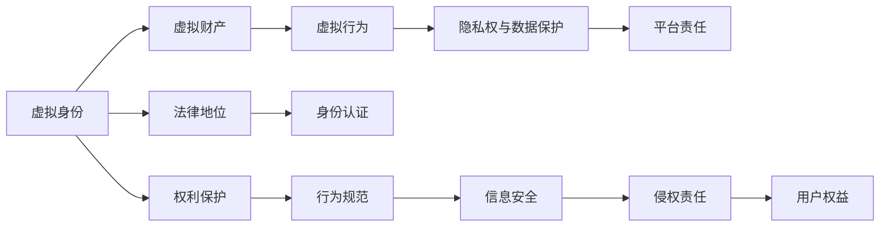

                 

# 元宇宙法律:虚拟世界的规则制定

## 1. 背景介绍

### 1.1 问题由来
随着技术的进步，元宇宙（Metaverse）成为现实，虚拟世界与现实世界的界限逐渐模糊。虚拟世界提供了前所未有的自由度，但也带来了诸多法律和伦理问题。传统法律体系能否适应元宇宙的新挑战，如何制定适用于虚拟世界的法律规则，成为摆在我们面前的重大课题。

### 1.2 问题核心关键点
元宇宙法律的核心关键点包括：

- **虚拟身份**：如何定义和管理虚拟身份，其法律地位如何？
- **虚拟财产**：虚拟物品、土地、货币等虚拟财产如何拥有、交换、继承？
- **虚拟行为**：虚拟世界中的行为如何规范？
- **隐私权与数据保护**：如何保护虚拟世界中的个人信息？
- **虚拟环境责任**：平台、开发者、用户应承担何种责任？

### 1.3 问题研究意义
制定元宇宙法律，对保障虚拟世界的秩序和公平，保护用户权益，推动元宇宙的健康发展具有重要意义：

- 保障虚拟世界秩序。通过明确法律规则，可以防止恶意行为，保障虚拟财产的安全，维持虚拟社会的稳定。
- 保护用户权益。元宇宙中用户需面对更多隐私侵害、数据泄露的风险，法律需提供保护。
- 促进元宇宙发展。明确的法律框架能增强用户信任，吸引更多用户和企业进入元宇宙。

## 2. 核心概念与联系

### 2.1 核心概念概述

元宇宙法律涉及众多核心概念，包括但不限于：

- **虚拟身份（Virtual Identity）**：指用户在虚拟世界中的数字身份，具有虚拟和现实的双重属性。
- **虚拟财产（Virtual Property）**：指虚拟世界中可拥有的物品或权利，如土地、货币、收藏品等。
- **虚拟行为（Virtual Behavior）**：指用户在虚拟世界中的互动行为，包括创建、交换、使用虚拟物品等。
- **隐私权与数据保护**：指在虚拟世界中保护用户个人信息和隐私，防止数据滥用和泄露。
- **平台责任（Platform Liability）**：指平台运营商对用户行为的责任范围和义务。

这些核心概念通过法律规则联系起来，形成了一个虚拟世界的法律框架。

### 2.2 核心概念原理和架构的 Mermaid 流程图



该图表展示了虚拟身份与虚拟财产、虚拟行为之间的联系，以及隐私权与数据保护、平台责任的法律地位。通过这些联系，构成了元宇宙法律的总体架构。

## 3. 核心算法原理 & 具体操作步骤

### 3.1 算法原理概述

元宇宙法律的制定遵循传统的法律原则，即法律旨在平衡各方利益，维护秩序和安全。具体的算法原理包括以下几个方面：

- **规则制定**：依据公平、公正、公开的原则，制定适用于虚拟世界的法律规则。
- **权利义务分配**：明确虚拟身份的权利和义务，如虚拟财产所有权、使用权、隐私权等。
- **法律适用**：确定虚拟世界行为的法律适用，包括跨国界适用、本地适用等。
- **责任划分**：界定平台、开发者、用户之间的法律责任。

### 3.2 算法步骤详解

元宇宙法律的制定步骤如下：

1. **需求调研**：了解虚拟世界用户需求，收集用户反馈，识别法律问题。
2. **法律制定**：基于调研结果，制定初步法律草案，进行专家评审。
3. **法律适用**：分析不同法律适用范围，确定跨国适用标准。
4. **法律实施**：制定法律执行机制，如争议解决机制、责任追究机制等。
5. **评估优化**：定期评估法律实施效果，优化法律规则，保障法律适应性。

### 3.3 算法优缺点

元宇宙法律制定的优缺点如下：

**优点**：

- **平衡各方利益**：法律制定基于公平原则，平衡用户、平台、开发者等各方的利益。
- **规则明确**：明确的法律规则能增强用户对虚拟世界的信任，促进健康发展。
- **促进创新**：清晰的法律框架能够吸引更多企业和用户参与元宇宙建设。

**缺点**：

- **技术复杂**：虚拟世界技术日新月异，法律需不断更新以适应新变化。
- **法律滞后**：法律制定与实施存在时间差，可能无法及时应对新兴问题。
- **国际协调**：元宇宙具有全球性，不同国家的法律可能存在冲突，协调难度大。

### 3.4 算法应用领域

元宇宙法律的应用领域广泛，包括但不限于：

- **虚拟商品交易**：虚拟物品的买卖、转让等行为，需明确所有权和使用权。
- **虚拟社区治理**：虚拟世界内的社会行为规范，如言论自由、行为边界等。
- **知识产权保护**：虚拟创作内容，如游戏、艺术作品等的知识产权保护。
- **隐私权保护**：虚拟世界的个人信息保护，防止数据滥用和泄露。
- **法律责任**：平台对用户行为的责任界定，如内容监管、侵权行为等。

## 4. 数学模型和公式 & 详细讲解 & 举例说明

### 4.1 数学模型构建

元宇宙法律的制定涉及复杂的法律关系和行为分析，可以构建数学模型来表示这些关系和行为。

- **虚拟身份模型**：$I(x) = f_{ID}(x, d)$，其中 $x$ 为用户行为数据，$d$ 为数字身份信息。
- **虚拟财产模型**：$P(x) = f_{VP}(x, d)$，其中 $x$ 为虚拟财产信息，$d$ 为数字身份信息。
- **隐私保护模型**：$PD(x) = f_{DP}(x, d)$，其中 $x$ 为隐私数据，$d$ 为数字身份信息。

### 4.2 公式推导过程

以虚拟身份模型为例，推导如下：

- **输入**：用户行为数据 $x$，数字身份信息 $d$。
- **输出**：虚拟身份 $I$。
- **函数**：$f_{ID}(x, d) = I$。

该函数定义了虚拟身份与用户行为和数字身份之间的映射关系。通过这个模型，可以推理出用户的行为对虚拟身份的影响。

### 4.3 案例分析与讲解

以虚拟财产保护为例，分析如下：

- **输入**：虚拟物品信息 $x$，数字身份信息 $d$。
- **输出**：虚拟财产 $P$。
- **函数**：$f_{VP}(x, d) = P$。

该函数定义了虚拟财产与用户行为和数字身份之间的映射关系。在实际应用中，可以通过这个模型进行虚拟物品的创建、交换、转让等操作。

## 5. 项目实践：代码实例和详细解释说明

### 5.1 开发环境搭建

**环境配置**：

1. **安装Python**：使用Python 3.8或更高版本。
2. **安装相关库**：`pip install flask`、`pip install requests`、`pip install pandas`、`pip install numpy`。

**代码实现**：

1. **创建Flask应用**：
```python
from flask import Flask, request, jsonify

app = Flask(__name__)

@app.route('/get_identity', methods=['POST'])
def get_identity():
    # 获取用户行为数据和数字身份信息
    x = request.json['x']
    d = request.json['d']
    
    # 调用虚拟身份模型，返回虚拟身份信息
    I = virtual_identity_model(x, d)
    
    return jsonify(I)
```

### 5.2 源代码详细实现

**虚拟身份模型**：
```python
def virtual_identity_model(x, d):
    # 根据用户行为数据和数字身份信息，生成虚拟身份
    # 具体实现基于规则和算法
    I = ...
    return I
```

### 5.3 代码解读与分析

**Flask应用**：
- **路由**：定义路由，接收POST请求，传递用户行为数据和数字身份信息。
- **处理**：调用虚拟身份模型，生成虚拟身份并返回JSON格式的响应。

**虚拟身份模型**：
- **实现**：基于用户行为数据和数字身份信息，使用算法生成虚拟身份。
- **规则**：具体实现需根据法律和业务规则，进行详细设计。

### 5.4 运行结果展示

通过上述代码，可以构建一个简单的虚拟身份生成服务，满足虚拟世界的身份管理需求。

## 6. 实际应用场景

### 6.1 虚拟商品交易

**场景描述**：用户A在虚拟世界购买了虚拟物品B，如何进行所有权和交易记录的管理？

**解决方案**：

1. **虚拟身份验证**：平台验证用户A的虚拟身份。
2. **虚拟财产验证**：平台验证虚拟物品B的所有权和可用性。
3. **交易记录保存**：平台记录交易日志，确保交易透明公正。
4. **法律规则适用**：依据元宇宙法律，确定虚拟物品的所有权和使用权。

### 6.2 虚拟社区治理

**场景描述**：用户在虚拟世界内发布不当言论，如何进行处理？

**解决方案**：

1. **身份验证**：平台验证发布言论的用户身份。
2. **行为分析**：平台分析言论内容，判断是否违规。
3. **法律适用**：依据元宇宙法律，确定违规言论的法律责任。
4. **惩罚措施**：平台采取适当的惩罚措施，如警告、禁言等。

### 6.3 知识产权保护

**场景描述**：用户在虚拟世界内创作游戏或艺术作品，如何进行知识产权保护？

**解决方案**：

1. **身份验证**：平台验证创作者身份。
2. **作品登记**：平台对作品进行登记，生成数字证书。
3. **法律适用**：依据元宇宙法律，确定作品的知识产权保护。
4. **侵权投诉**：平台提供侵权投诉渠道，保护作品版权。

### 6.4 未来应用展望

随着技术的进步，元宇宙将带来更多应用场景，元宇宙法律需不断更新以适应新需求：

1. **跨平台互认**：不同元宇宙平台之间的身份和财产互认机制。
2. **数字资产金融化**：虚拟财产的金融交易，如虚拟货币、虚拟股票等。
3. **虚拟环境管理**：平台对虚拟环境的监督和管理，确保环境健康发展。
4. **用户权益保障**：完善隐私权保护，防止数据滥用和泄露。
5. **法律国际协调**：不同国家和地区之间的法律协调，确保法律适用的一致性。

## 7. 工具和资源推荐

### 7.1 学习资源推荐

- **《元宇宙法律概论》**：介绍元宇宙法律的基本概念和框架，适合初学者阅读。
- **《元宇宙法规与技术》**：深入探讨元宇宙法规和技术融合，适合专业人士研究。
- **《虚拟世界的法律挑战》**：分析虚拟世界中的法律问题，提供解决方案，适合政策制定者参考。
- **《元宇宙法律案例分析》**：通过具体案例，解读元宇宙法律的应用和执行，适合实际工作者学习。

### 7.2 开发工具推荐

- **Flask**：轻量级的Web应用框架，适合构建虚拟身份管理、交易记录等应用。
- **Python**：高效灵活的编程语言，适合数据处理、算法实现等。
- **Pandas**：强大的数据处理库，适合处理虚拟世界中的大数据。
- **TensorFlow**：深度学习框架，适合处理复杂的法律问题，如行为分析、规则制定等。

### 7.3 相关论文推荐

- **《元宇宙法律的挑战与应对》**：探讨元宇宙法律的挑战和应对策略，提供前沿视角。
- **《虚拟世界的法律保护与隐私权》**：分析虚拟世界中的法律保护问题，提出解决方案。
- **《元宇宙中的知识产权保护》**：研究虚拟世界的知识产权保护，提出法律和技术结合的方案。
- **《元宇宙法律的国际协调》**：讨论元宇宙法律的国际协调问题，提供政策建议。

## 8. 总结：未来发展趋势与挑战

### 8.1 研究成果总结

本文对元宇宙法律的核心概念和算法原理进行了系统阐述，并提供了实际应用场景和代码实例。通过深入分析，提出了一系列解决方案，为元宇宙法律的制定和应用提供了理论和实践指导。

### 8.2 未来发展趋势

元宇宙法律的未来发展趋势包括：

1. **技术进步推动法律创新**：随着元宇宙技术的发展，新的法律问题将不断出现，需不断创新法律制度。
2. **法律与技术的深度融合**：法律需与技术结合，推动元宇宙的规范化和标准化。
3. **国际法律协调**：不同国家之间的法律协调将更加重要，需建立统一的法律标准。
4. **用户权益保护**：随着元宇宙的普及，用户权益保护将更加重要，需制定相应的法律规范。
5. **法律教育与培训**：需加强法律教育，提高法律工作者对元宇宙的认识和技术水平。

### 8.3 面临的挑战

元宇宙法律的制定和应用面临诸多挑战：

1. **技术复杂性**：元宇宙技术复杂，法律需适应快速变化的技术环境。
2. **法律滞后**：法律需快速更新，以应对新兴问题和挑战。
3. **国际协调**：不同国家的法律差异大，协调难度大。
4. **隐私保护**：虚拟世界的隐私保护需更加严格，防止数据滥用。
5. **用户信任**：法律需建立信任机制，保障用户对虚拟世界的信心。

### 8.4 研究展望

未来，元宇宙法律的研究需关注以下方向：

1. **法律与技术的深度融合**：法律需与技术结合，推动元宇宙的规范化和标准化。
2. **用户权益保护**：加强对用户权益的保护，防止数据滥用和隐私侵害。
3. **法律教育的普及**：加强法律教育，提高法律工作者对元宇宙的认识和技术水平。
4. **国际法律协调**：促进不同国家之间的法律协调，确保法律适用的一致性。
5. **法律技术的创新**：推动法律技术的发展，提高法律制定和执行的效率。

## 9. 附录：常见问题与解答

**Q1：元宇宙法律是否适用于现实世界？**

A: 元宇宙法律在虚拟世界内的应用需考虑现实世界的法律规范。

**Q2：虚拟身份的法律地位如何？**

A: 虚拟身份具有虚拟和现实的双重属性，需根据具体法律规范确定其法律地位。

**Q3：虚拟财产的保护范围有哪些？**

A: 虚拟财产包括虚拟物品、土地、货币等，需明确所有权和使用权。

**Q4：元宇宙法律的制定和实施需注意什么？**

A: 需考虑技术复杂性、法律滞后、国际协调等因素，确保法律的适用性和有效性。

**Q5：如何保障虚拟世界中的用户隐私？**

A: 需制定严格的隐私保护政策，防止数据滥用和泄露。

---

作者：禅与计算机程序设计艺术 / Zen and the Art of Computer Programming

