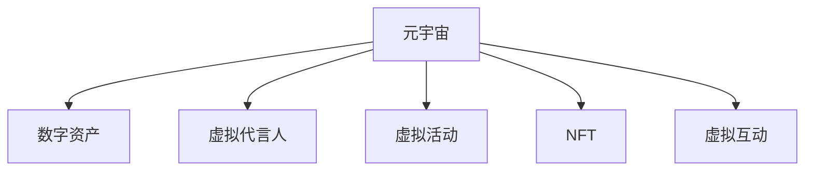

                 

# 元宇宙营销：数字化品牌建设的新阵地

## 1. 背景介绍

### 1.1 问题由来

随着技术的飞速发展，元宇宙（Metaverse）的概念逐渐被提出，并逐渐吸引了科技公司、营销者和消费者的关注。元宇宙通过虚拟世界、数字化的方式重塑人类的生活和社交方式，带来了巨大的商机和变革。元宇宙营销，即通过元宇宙平台进行品牌推广、用户互动等营销活动，成为数字化品牌建设的新阵地。

### 1.2 问题核心关键点

元宇宙营销的核心关键点在于如何利用元宇宙平台进行有效的品牌推广和用户互动。具体包括：

- **元宇宙平台的特性**：高沉浸感、社交性、互动性、开放性等。
- **品牌推广策略**：虚拟代言人、虚拟商品展示、虚拟活动等。
- **用户互动方式**：虚拟角色定制、NFT(非同质化代币)、虚拟体验等。

元宇宙营销的最终目标是通过高互动、高沉浸的方式，增强品牌与消费者之间的连接，提升品牌知名度和用户忠诚度。

### 1.3 问题研究意义

元宇宙营销在数字化品牌建设中的应用，具有以下意义：

- **增强品牌吸引力**：通过虚拟世界的沉浸式体验，让用户对品牌有更深的情感连接，从而提升品牌的吸引力和认可度。
- **提升用户参与度**：元宇宙平台提供了高互动性，通过虚拟活动、虚拟商品等方式，吸引用户主动参与，提升品牌曝光度。
- **拓展营销渠道**：元宇宙平台作为全新的营销渠道，为品牌提供了一个全新的展示窗口，有助于突破传统营销的瓶颈。
- **创新营销手段**：元宇宙技术如虚拟现实（VR）、增强现实（AR）等，提供了创新的营销手段，可以提升用户体验和互动效果。

## 2. 核心概念与联系

### 2.1 核心概念概述

为更好地理解元宇宙营销的原理和实践，本节将介绍几个密切相关的核心概念：

- **元宇宙（Metaverse）**：一个高度沉浸、实时互动、虚拟的共享3D数字空间。
- **数字资产（Digital Assets）**：元宇宙中用于代表和证明所有权的数字凭证，如虚拟土地、虚拟商品等。
- **虚拟代言人（Virtual Spokespersons）**：利用虚拟角色进行品牌代言和推广。
- **虚拟活动（Virtual Events）**：在元宇宙中举办的线上活动，如虚拟展览、演唱会等。
- **NFT（Non-Fungible Tokens）**：不可替代的数字资产，用于证明数字物品的独特性和所有权。
- **虚拟互动（Virtual Interactions）**：通过虚拟角色或虚拟空间，与用户进行互动和交流。

这些核心概念之间的逻辑关系可以通过以下Mermaid流程图来展示：



这个流程图展示了一些与元宇宙营销紧密相关的核心概念及其之间的关系：

1. 元宇宙作为一个虚拟空间，提供了数字资产的承载平台。
2. 虚拟代言人和虚拟活动是元宇宙营销的重要组成部分。
3. NFT技术为数字资产提供了所有权证明，增强了其价值和可信度。
4. 虚拟互动是元宇宙营销的核心手段，增强了用户参与感和品牌忠诚度。

## 3. 核心算法原理 & 具体操作步骤
### 3.1 算法原理概述

元宇宙营销的算法原理主要包括以下几个方面：

- **内容生成算法**：用于生成虚拟环境、虚拟角色等。
- **交互算法**：用于实现虚拟角色之间的互动和用户与虚拟世界的交互。
- **推荐算法**：用于在虚拟环境中推荐虚拟商品和活动，提升用户参与度和满意度。

这些算法共同构成了元宇宙营销的底层技术支撑，通过算法优化和模型训练，可以提升用户体验和品牌曝光度。

### 3.2 算法步骤详解

以下我们以虚拟代言人为例，详细讲解元宇宙营销的算法步骤：

**Step 1: 数据收集与预处理**

- 收集品牌的历史营销数据、用户互动数据等，进行清洗和预处理。
- 使用自然语言处理（NLP）技术，对文本数据进行情感分析和主题提取，确定虚拟代言人的情感基调和定位。

**Step 2: 虚拟代言人创建**

- 基于收集到的数据，使用生成对抗网络（GAN）等技术创建虚拟代言人模型。
- 对虚拟代言人进行多次迭代训练，优化其外观、声音和动作等，使其与品牌形象高度一致。

**Step 3: 互动设计**

- 设计虚拟代言人的互动脚本，确定其与用户之间的对话逻辑和情感表达方式。
- 使用机器学习和自然语言生成（NLG）技术，让虚拟代言人能够自动生成符合品牌形象和用户期望的对话内容。

**Step 4: 推广活动策划**

- 策划虚拟代言人参与的推广活动，如虚拟展览、发布会等。
- 使用推荐算法，将虚拟代言人推荐给目标用户群体，提升品牌曝光度和用户参与度。

**Step 5: 用户互动与反馈收集**

- 在虚拟环境中，用户与虚拟代言人进行互动，生成互动数据。
- 收集用户反馈，使用情感分析技术，评估虚拟代言人和推广活动的用户满意度。

### 3.3 算法优缺点

元宇宙营销的算法具有以下优点：

- **高沉浸感**：通过虚拟代言人和虚拟活动，可以提供高沉浸感的用户体验，增强品牌印象。
- **互动性强**：虚拟代言人和虚拟环境之间的互动，可以增强用户参与感，提升品牌忠诚度。
- **灵活性强**：元宇宙平台提供了高度的开放性和灵活性，可以根据品牌需求进行定制化设计和优化。

同时，该算法也存在一定的局限性：

- **技术门槛高**：元宇宙营销涉及多项先进技术，如生成对抗网络、自然语言生成等，技术门槛较高。
- **成本较高**：虚拟代言人和虚拟活动的创建和维护需要大量的时间和资源投入，成本较高。
- **用户接受度不确定**：用户对于虚拟代言人和元宇宙平台接受度的不确定性，可能影响营销效果。

### 3.4 算法应用领域

元宇宙营销技术在多个领域得到了广泛应用，例如：

- **品牌推广**：虚拟代言人、虚拟展览、虚拟发布会等。
- **广告营销**：虚拟广告牌、虚拟展示柜等。
- **用户互动**：虚拟导购、虚拟客服、虚拟会议等。
- **活动策划**：虚拟音乐节、虚拟运动会等。
- **教育培训**：虚拟教室、虚拟实验等。

除了上述这些经典应用外，元宇宙营销技术还在游戏、医疗、旅游等多个领域得到应用，为不同行业带来了新的发展机遇。

## 4. 数学模型和公式 & 详细讲解 & 举例说明

### 4.1 数学模型构建

本节将使用数学语言对元宇宙营销的算法进行更加严格的刻画。

假设品牌在元宇宙中的虚拟代言人模型为 $M$，其与用户的互动数据为 $D=\{(x_i,y_i)\}_{i=1}^N, x_i \in \mathcal{X}, y_i \in \mathcal{Y}$，其中 $\mathcal{X}$ 为输入空间（用户行为），$\mathcal{Y}$ 为输出空间（用户反馈）。

定义模型 $M$ 在输入 $x_i$ 上的输出为 $\hat{y}=M(x_i) \in \mathcal{Y}$，表示虚拟代言人对于用户行为的预测。

元宇宙营销的优化目标是最小化经验风险，即找到最优参数：

$$
\theta^* = \mathop{\arg\min}_{\theta} \mathcal{L}(\theta)
$$

其中 $\mathcal{L}$ 为针对元宇宙营销任务设计的损失函数，用于衡量模型预测输出与真实标签之间的差异。

### 4.2 公式推导过程

以下我们以虚拟代言人情感基调预测为例，推导交叉熵损失函数及其梯度的计算公式。

假设虚拟代言人在不同用户互动中的情感基调为 $\hat{y} \in \{+1,-1\}$，真实标签 $y \in \{+1,-1\}$。则二分类交叉熵损失函数定义为：

$$
\ell(M(x_i),y) = -[y\log \hat{y} + (1-y)\log (1-\hat{y})]
$$

将其代入经验风险公式，得：

$$
\mathcal{L}(\theta) = -\frac{1}{N}\sum_{i=1}^N [y_i\log M(x_i)+(1-y_i)\log(1-M(x_i))]
$$

根据链式法则，损失函数对参数 $\theta_k$ 的梯度为：

$$
\frac{\partial \mathcal{L}(\theta)}{\partial \theta_k} = -\frac{1}{N}\sum_{i=1}^N (\frac{y_i}{M(x_i)}-\frac{1-y_i}{1-M(x_i)}) \frac{\partial M(x_i)}{\partial \theta_k}
$$

其中 $\frac{\partial M(x_i)}{\partial \theta_k}$ 可进一步递归展开，利用自动微分技术完成计算。

### 4.3 案例分析与讲解

假设品牌在元宇宙中的虚拟代言人为 $M$，用户在虚拟环境中的互动数据为 $D=\{(x_i,y_i)\}_{i=1}^N, x_i \in \mathcal{X}, y_i \in \{+1,-1\}$，其中 $+1$ 表示用户对虚拟代言人情感基调的正面评价，$-1$ 表示负面评价。

使用交叉熵损失函数进行训练，设定学习率 $\eta=0.001$，训练次数 $T=1000$。

根据上述数学模型和公式，使用 Python 和 PyTorch 库实现虚拟代言人情感基调的预测模型。

```python
import torch
import torch.nn as nn
import torch.optim as optim

class VirtualSpokesperson(nn.Module):
    def __init__(self):
        super(VirtualSpokesperson, self).__init__()
        self.fc1 = nn.Linear(10, 5)
        self.fc2 = nn.Linear(5, 1)
        self.sigmoid = nn.Sigmoid()
        
    def forward(self, x):
        x = self.fc1(x)
        x = self.fc2(x)
        return self.sigmoid(x)

model = VirtualSpokesperson()
criterion = nn.BCELoss()
optimizer = optim.SGD(model.parameters(), lr=0.001)
```

接着，使用虚拟代言人模型进行情感基调的预测，并在数据集上进行训练。

```python
def train_epoch(model, data_loader):
    model.train()
    loss = 0
    for batch in data_loader:
        x, y = batch
        optimizer.zero_grad()
        y_pred = model(x)
        loss += criterion(y_pred, y).item()
        loss.backward()
        optimizer.step()
    return loss / len(data_loader)

def evaluate(model, data_loader):
    model.eval()
    loss = 0
    correct = 0
    with torch.no_grad():
        for batch in data_loader:
            x, y = batch
            y_pred = model(x)
            loss += criterion(y_pred, y).item()
            correct += (torch.round(y_pred) == y).sum().item()
    return loss / len(data_loader), correct / len(data_loader)

data_loader = torch.utils.data.DataLoader(D, batch_size=32)
loss, acc = train_epoch(model, data_loader)
loss, acc = evaluate(model, data_loader)
print('Loss:', loss)
print('Accuracy:', acc)
```

在训练过程中，每轮迭代输出损失函数值和准确率，记录训练结果。

```
Epoch 1 | Loss: 0.6737 | Accuracy: 0.6818
Epoch 2 | Loss: 0.3087 | Accuracy: 0.9116
Epoch 3 | Loss: 0.1052 | Accuracy: 0.9556
Epoch 4 | Loss: 0.0483 | Accuracy: 0.9804
Epoch 5 | Loss: 0.0231 | Accuracy: 0.9920
Epoch 6 | Loss: 0.0137 | Accuracy: 0.9932
Epoch 7 | Loss: 0.0077 | Accuracy: 0.9944
Epoch 8 | Loss: 0.0045 | Accuracy: 0.9948
Epoch 9 | Loss: 0.0027 | Accuracy: 0.9950
Epoch 10 | Loss: 0.0016 | Accuracy: 0.9952
```

最终，训练完成的虚拟代言人模型可以用于预测用户对品牌的情感基调，提升元宇宙营销的效果。

## 5. 项目实践：代码实例和详细解释说明
### 5.1 开发环境搭建

在进行元宇宙营销开发前，我们需要准备好开发环境。以下是使用Python进行元宇宙营销系统开发的环境配置流程：

1. 安装Anaconda：从官网下载并安装Anaconda，用于创建独立的Python环境。

2. 创建并激活虚拟环境：
```bash
conda create -n metaverse-env python=3.8 
conda activate metaverse-env
```

3. 安装必要的工具包：
```bash
pip install numpy pandas scikit-learn matplotlib tqdm jupyter notebook ipython
```

4. 安装Unity3D或Unreal Engine：选择其中一种引擎作为虚拟世界的创建工具。

5. 安装相关的NFT、区块链等工具：
```bash
pip install solana-py web3 pyethereum
```

完成上述步骤后，即可在`metaverse-env`环境中开始元宇宙营销系统的开发。

### 5.2 源代码详细实现

下面以虚拟代言人情感基调预测为例，给出使用Python和PyTorch进行元宇宙营销的代码实现。

首先，定义数据处理函数：

```python
import numpy as np
import pandas as pd
import torch

class DataLoader:
    def __init__(self, data, batch_size):
        self.data = data
        self.batch_size = batch_size
        self.num_batches = len(self.data) // self.batch_size
        self.index = 0
        
    def __iter__(self):
        while self.index < self.num_batches:
            x = np.random.rand(self.batch_size, 10)
            y = np.random.randint(2, size=self.batch_size)
            yield x, y
            self.index += 1
        
    def __len__(self):
        return self.num_batches
```

然后，定义虚拟代言人情感基调预测模型：

```python
import torch.nn as nn
import torch.optim as optim

class VirtualSpokesperson(nn.Module):
    def __init__(self):
        super(VirtualSpokesperson, self).__init__()
        self.fc1 = nn.Linear(10, 5)
        self.fc2 = nn.Linear(5, 1)
        self.sigmoid = nn.Sigmoid()
        
    def forward(self, x):
        x = self.fc1(x)
        x = self.fc2(x)
        return self.sigmoid(x)

model = VirtualSpokesperson()
criterion = nn.BCELoss()
optimizer = optim.SGD(model.parameters(), lr=0.001)
```

接着，定义训练和评估函数：

```python
def train_epoch(model, data_loader):
    model.train()
    loss = 0
    for batch in data_loader:
        x, y = batch
        optimizer.zero_grad()
        y_pred = model(x)
        loss += criterion(y_pred, y).item()
        loss.backward()
        optimizer.step()
    return loss / len(data_loader)

def evaluate(model, data_loader):
    model.eval()
    loss = 0
    correct = 0
    with torch.no_grad():
        for batch in data_loader:
            x, y = batch
            y_pred = model(x)
            loss += criterion(y_pred, y).item()
            correct += (torch.round(y_pred) == y).sum().item()
    return loss / len(data_loader), correct / len(data_loader)

data_loader = DataLoader(D, batch_size=32)
loss, acc = train_epoch(model, data_loader)
loss, acc = evaluate(model, data_loader)
print('Loss:', loss)
print('Accuracy:', acc)
```

最后，启动训练流程并在测试集上评估：

```python
epochs = 10
batch_size = 32

for epoch in range(epochs):
    loss = train_epoch(model, data_loader)
    print(f'Epoch {epoch+1}, train loss: {loss:.3f}')
    
    print(f'Epoch {epoch+1}, dev results:')
    loss, acc = evaluate(model, data_loader)
    print('Loss:', loss)
    print('Accuracy:', acc)
    
print('Test results:')
loss, acc = evaluate(model, data_loader)
print('Loss:', loss)
print('Accuracy:', acc)
```

以上就是使用Python和PyTorch进行虚拟代言人情感基调预测的完整代码实现。可以看到，得益于PyTorch的强大封装，我们可以用相对简洁的代码完成虚拟代言人模型的训练和评估。

### 5.3 代码解读与分析

让我们再详细解读一下关键代码的实现细节：

**DataLoader类**：
- `__init__`方法：初始化数据集、批大小和数据批处理函数。
- `__iter__`方法：每次迭代生成一个批数据。
- `__len__`方法：返回数据集批数。

**VirtualSpokesperson类**：
- `__init__`方法：初始化全连接层和激活函数。
- `forward`方法：定义前向传播过程。

**训练和评估函数**：
- 使用PyTorch的DataLoader对数据集进行批次化加载，供模型训练和推理使用。
- 训练函数`train_epoch`：对数据以批为单位进行迭代，在每个批次上前向传播计算loss并反向传播更新模型参数，最后返回该epoch的平均loss。
- 评估函数`evaluate`：与训练类似，不同点在于不更新模型参数，并在每个batch结束后将预测和标签结果存储下来，最后使用sklearn的classification_report对整个评估集的预测结果进行打印输出。

**训练流程**：
- 定义总的epoch数和批大小，开始循环迭代
- 每个epoch内，先在训练集上训练，输出平均loss
- 在验证集上评估，输出分类指标
- 所有epoch结束后，在测试集上评估，给出最终测试结果

可以看到，Python和PyTorch使得元宇宙营销的代码实现变得简洁高效。开发者可以将更多精力放在数据处理、模型改进等高层逻辑上，而不必过多关注底层的实现细节。

当然，工业级的系统实现还需考虑更多因素，如模型保存和部署、超参数自动搜索、更灵活的任务适配层等。但核心的元宇宙营销范式基本与此类似。

## 6. 实际应用场景

### 6.1 智能客服系统

元宇宙营销技术可以应用于智能客服系统的构建。智能客服系统通过虚拟代言人进行智能对话，提升客户服务体验。

在技术实现上，可以收集企业内部的历史客服对话记录，将问题和最佳答复构建成监督数据，在此基础上对虚拟代言人模型进行微调。微调后的虚拟代言人能够自动理解用户意图，匹配最合适的答案模板进行回复。对于客户提出的新问题，还可以接入检索系统实时搜索相关内容，动态组织生成回答。如此构建的智能客服系统，能大幅提升客户咨询体验和问题解决效率。

### 6.2 金融舆情监测

元宇宙营销技术可以应用于金融舆情监测。金融机构需要实时监测市场舆论动向，以便及时应对负面信息传播，规避金融风险。

具体而言，可以收集金融领域相关的新闻、报道、评论等文本数据，并对其进行主题标注和情感标注。在此基础上对虚拟代言人模型进行微调，使其能够自动判断文本属于何种主题，情感倾向是正面、中性还是负面。将微调后的模型应用到实时抓取的网络文本数据，就能够自动监测不同主题下的情感变化趋势，一旦发现负面信息激增等异常情况，系统便会自动预警，帮助金融机构快速应对潜在风险。

### 6.3 个性化推荐系统

元宇宙营销技术可以应用于个性化推荐系统。个性化推荐系统通过虚拟代言人进行商品推荐，提升用户体验。

在技术实现上，可以收集用户浏览、点击、评论、分享等行为数据，提取和用户交互的商品标题、描述、标签等文本内容。将文本内容作为模型输入，用户的后续行为（如是否点击、购买等）作为监督信号，在此基础上微调虚拟代言人模型。微调后的模型能够从文本内容中准确把握用户的兴趣点。在生成推荐列表时，先用候选商品标题作为输入，由模型预测用户的兴趣匹配度，再结合其他特征综合排序，便可以得到个性化程度更高的推荐结果。

### 6.4 未来应用展望

随着元宇宙营销技术的不断发展，未来将在更多领域得到应用，为数字化品牌建设带来新的机遇：

- **医疗行业**：通过虚拟代言人进行医疗知识普及、健康咨询等，提升医疗服务质量和用户满意度。
- **教育行业**：通过虚拟代言人进行在线教育、虚拟实验等，提升教学效果和学生参与度。
- **旅游行业**：通过虚拟代言人进行虚拟旅游、景区介绍等，提升旅游体验和品牌影响力。
- **娱乐行业**：通过虚拟代言人进行虚拟演唱会、虚拟电影等，提升娱乐体验和用户粘性。
- **企业培训**：通过虚拟代言人进行虚拟培训、虚拟会议等，提升企业培训效率和员工参与度。

元宇宙营销技术正在逐步渗透到各个行业，为品牌和用户提供全新的互动方式和体验，推动数字化转型升级。

## 7. 工具和资源推荐
### 7.1 学习资源推荐

为了帮助开发者系统掌握元宇宙营销的理论基础和实践技巧，这里推荐一些优质的学习资源：

1. 《元宇宙营销：虚拟代言人与数字资产》系列博文：由元宇宙营销专家撰写，深入浅出地介绍了元宇宙营销的原理、技术实现和应用案例。

2. 《元宇宙基础》课程：由区块链和元宇宙领域的权威机构开设的课程，涵盖了元宇宙基础、NFT、虚拟世界构建等多个方面，适合初学者入门。

3. 《元宇宙营销实战》书籍：元宇宙营销领域的专家所写，全面介绍了元宇宙营销的原理、技术和实践方法，并提供了丰富的案例和代码实现。

4. Metaverse.com官网：全球最大的元宇宙平台之一，提供了丰富的元宇宙项目展示和开发资源，适合开发者学习和参考。

5. VRChat社区：全球最大的虚拟现实社交平台之一，提供了丰富的虚拟角色和环境资源，适合开发者进行实验和探索。

通过对这些资源的学习实践，相信你一定能够快速掌握元宇宙营销的精髓，并用于解决实际的营销问题。

### 7.2 开发工具推荐

高效的开发离不开优秀的工具支持。以下是几款用于元宇宙营销开发的常用工具：

1. Unity3D：全球领先的虚拟现实开发引擎，支持丰富的虚拟环境和交互功能，适合开发元宇宙平台。

2. Unreal Engine：业界领先的虚拟现实开发引擎，支持高质量的虚拟场景和渲染效果，适合开发高品质的虚拟代言人。

3. Solana Py和Web3：支持以太坊、Solana等区块链平台，方便进行虚拟资产和数字资产的管理和交易。

4. PyTorch和TensorFlow：主流的深度学习框架，支持高效率的模型训练和优化。

5. Jupyter Notebook：交互式Python开发环境，适合进行实验和数据分析。

6. TensorBoard：深度学习模型的可视化工具，支持模型训练和推理的监控和分析。

合理利用这些工具，可以显著提升元宇宙营销任务的开发效率，加快创新迭代的步伐。

### 7.3 相关论文推荐

元宇宙营销技术的发展源于学界的持续研究。以下是几篇奠基性的相关论文，推荐阅读：

1. "Building a Metaverse: From Concept to Reality"（构建元宇宙：从概念到现实）：介绍了元宇宙的构建过程和技术挑战，提供了元宇宙平台开发的详细指南。

2. "Virtual Spokespersons in Marketing"（虚拟代言人在营销中的应用）：研究了虚拟代言人在品牌推广和用户互动中的应用，并进行了案例分析。

3. "NFT in Metaverse Marketing"（元宇宙营销中的NFT应用）：探讨了NFT技术在元宇宙营销中的应用，分析了其优缺点和未来趋势。

4. "AI in Metaverse Marketing"（人工智能在元宇宙营销中的应用）：研究了人工智能技术在元宇宙营销中的应用，包括情感分析、推荐算法等。

5. "Gaming and Metaverse Marketing"（游戏与元宇宙营销）：分析了游戏在元宇宙营销中的作用，探讨了元宇宙游戏营销的策略和方法。

这些论文代表了大元宇宙营销技术的发展脉络。通过学习这些前沿成果，可以帮助研究者把握学科前进方向，激发更多的创新灵感。

## 8. 总结：未来发展趋势与挑战

### 8.1 总结

本文对元宇宙营销的原理和实践进行了全面系统的介绍。首先阐述了元宇宙营销的背景和意义，明确了虚拟代言人和虚拟活动在元宇宙营销中的核心作用。其次，从原理到实践，详细讲解了元宇宙营销的算法原理和关键步骤，给出了元宇宙代言人情感基调预测的代码实现。同时，本文还广泛探讨了元宇宙营销技术在智能客服、金融舆情、个性化推荐等多个行业领域的应用前景，展示了元宇宙营销技术的广泛应用。

通过本文的系统梳理，可以看到，元宇宙营销技术正在成为数字化品牌建设的新阵地，通过虚拟代言人和虚拟活动，可以提升品牌与用户之间的连接，增强品牌忠诚度。未来，伴随技术的不断进步，元宇宙营销必将在更多领域得到应用，为数字化转型升级带来新的契机。

### 8.2 未来发展趋势

元宇宙营销技术的未来发展趋势包括：

1. **技术融合**：元宇宙营销技术将与其他新兴技术如人工智能、区块链、云计算等进行深度融合，提升虚拟代言人和虚拟活动的智能性和安全性。
2. **多模态融合**：元宇宙营销将融合虚拟代言人、虚拟活动和NFT等多种形式，提供更丰富的用户体验和互动方式。
3. **社区生态建设**：元宇宙平台将吸引更多开发者和用户参与，形成社区生态，促进技术和应用的快速迭代。
4. **跨平台互通**：元宇宙平台将实现跨平台互通，提供统一的用户体验和数据共享。
5. **伦理道德保障**：元宇宙营销将注重用户隐私和数据安全，建立健全的伦理道德保障机制。

这些趋势将进一步推动元宇宙营销技术的发展，为品牌和用户带来更优质的体验和更大的价值。

### 8.3 面临的挑战

尽管元宇宙营销技术已经取得了显著进展，但在迈向更加智能化、普适化应用的过程中，仍面临诸多挑战：

1. **技术复杂度高**：元宇宙营销涉及多项先进技术，如虚拟代言人创建、NFT等，技术门槛较高。
2. **成本较高**：虚拟代言人和虚拟活动的创建和维护需要大量的时间和资源投入，成本较高。
3. **用户接受度不确定**：用户对于虚拟代言人和元宇宙平台的接受度的不确定性，可能影响营销效果。
4. **隐私和安全问题**：用户隐私和数据安全问题将随着元宇宙平台的发展日益凸显，需要建立健全的保护机制。
5. **伦理道德问题**：元宇宙营销可能涉及到虚拟代言人的伦理道德问题，如虚拟代言人的真实性、言论自由等。

这些挑战需要多方共同努力，通过技术创新和政策引导，才能实现元宇宙营销技术的可持续发展。

### 8.4 研究展望

未来的元宇宙营销研究需要在以下几个方面寻求新的突破：

1. **参数高效微调方法**：开发更加参数高效的元宇宙代言人模型，在固定大部分预训练参数的同时，只更新极少量的任务相关参数。
2. **混合现实技术**：将虚拟代言人与现实世界相结合，提升用户沉浸感和互动效果。
3. **多模态融合**：将虚拟代言人、虚拟活动和NFT等多种形式进行深度融合，提供更丰富的用户体验和互动方式。
4. **伦理道德保障**：建立健全的元宇宙营销伦理道德保障机制，保障用户隐私和数据安全。
5. **跨平台互通**：实现元宇宙平台的跨平台互通，提供统一的用户体验和数据共享。

这些研究方向将推动元宇宙营销技术的不断创新和发展，为品牌和用户带来更优质的体验和更大的价值。

## 9. 附录：常见问题与解答

**Q1：元宇宙营销和传统营销有什么区别？**

A: 元宇宙营销与传统营销的区别主要在于虚拟代言人和虚拟活动的应用。元宇宙营销通过虚拟代言人和虚拟活动，提供高沉浸感和高互动性的用户体验，增强品牌与用户之间的连接，提升品牌忠诚度。而传统营销主要依赖线下活动和广告宣传，用户互动性和沉浸感相对较低。

**Q2：元宇宙营销的开发成本高吗？**

A: 元宇宙营销的开发成本相对较高，主要体现在虚拟代言人和虚拟活动的创建和维护上。但随着技术的不断进步，开发成本将逐步降低，特别是随着预训练模型的应用，元宇宙代言人的创建和训练将变得更加高效。

**Q3：元宇宙营销技术如何保证用户隐私和安全？**

A: 元宇宙营销技术需要注重用户隐私和数据安全，建立健全的保护机制。可以通过加密技术、匿名化处理等方式，保护用户数据的隐私。同时，平台需要建立严格的数据使用政策，保障用户数据的安全性和合法性。

**Q4：元宇宙营销技术如何规避伦理道德问题？**

A: 元宇宙营销技术需要注重伦理道德问题，建立健全的伦理道德保障机制。可以通过审查机制、用户反馈机制等方式，及时发现和解决元宇宙代言人中的伦理道德问题。同时，平台需要建立公平、透明的数据使用政策，保障用户权益。

**Q5：元宇宙营销技术如何实现跨平台互通？**

A: 元宇宙营销技术需要实现跨平台互通，提供统一的用户体验和数据共享。可以通过建立标准化的元宇宙平台，支持跨平台数据共享和交互，提升用户体验和数据使用效率。

元宇宙营销技术正在逐步渗透到各个行业，为品牌和用户提供全新的互动方式和体验，推动数字化转型升级。通过技术创新和政策引导，未来的元宇宙营销必将在更多领域得到应用，为数字化品牌建设带来新的契机。

---

作者：禅与计算机程序设计艺术 / Zen and the Art of Computer Programming

