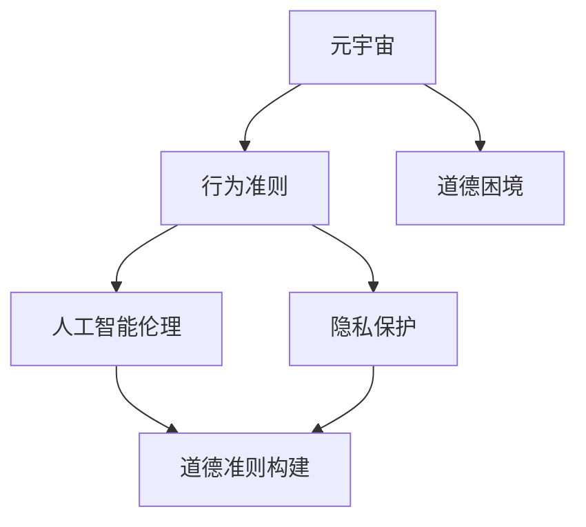

                 

# 元宇宙道德困境:虚拟世界行为准则的哲学思考

> 关键词：元宇宙,虚拟世界,行为准则,道德困境,哲学思考,人工智能伦理

## 1. 背景介绍

### 1.1 问题由来
随着虚拟现实技术的发展和普及，元宇宙（Metaverse）作为虚拟世界的全新形态，正逐渐从科幻概念变为现实。元宇宙作为由数字、算法构建的虚拟空间，其核心特征是具有高度的交互性、沉浸感和虚拟体验。人们在元宇宙中可以自由探索、社交、创造、交互，形成与现实世界平行的另一个“人生”。

然而，虚拟世界中的行为规范、伦理道德、隐私保护等问题也随之凸显。如何在虚拟空间中构建合理的行为准则，确保虚拟行为的正当性，成为亟待解决的重要课题。

### 1.2 问题核心关键点
元宇宙中的道德困境主要集中在以下几个方面：

1. **行为规范的模糊性**：由于虚拟世界的多样性和复杂性，现有的道德标准难以完全适应，行为规范的模糊性导致道德判断的困难。
2. **隐私保护的挑战**：用户在元宇宙中生成的数据、行为记录等，如何确保其隐私不被滥用，成为数据保护的重要议题。
3. **虚拟行为的界限**：虚拟世界中的行为是否与现实世界等同？如何界定虚拟行为和现实行为的差异与重叠？
4. **伦理道德的冲突**：虚拟行为可能与现实世界中的伦理道德产生冲突，如暴力、欺诈等行为在虚拟世界中的普遍存在，如何处理这类冲突？
5. **责任与权利的归属**：在虚拟世界中的行为，其责任和权利归属问题尚未明确，涉及法律、技术、伦理等多个层面。

### 1.3 问题研究意义
研究元宇宙中的道德困境，对于构建健康、安全的虚拟环境，保障用户权益，促进元宇宙的健康发展具有重要意义。

1. **促进虚拟世界规范化**：制定合理的道德准则，确保虚拟世界行为的正当性和规范性，避免滥用和不当行为。
2. **增强用户信任和接受度**：通过明确的行为规范，提升用户对元宇宙的信任和接受度，增强用户粘性和参与度。
3. **推动法律与伦理的发展**：在虚拟世界行为准则的研究过程中，法律和伦理也在不断演进，为现实世界相关领域提供参考。
4. **保障用户隐私与安全**：确保用户在虚拟世界中的数据和行为不被滥用，提升用户隐私保护水平。
5. **探索人工智能伦理的新边界**：元宇宙作为AI伦理的新应用场景，探讨其在虚拟世界中的道德困境，有助于推动AI伦理的发展。

## 2. 核心概念与联系

### 2.1 核心概念概述

为了更好地理解元宇宙中的道德困境，我们需要介绍几个核心概念及其相互关系：

- **元宇宙（Metaverse）**：由数字和算法构建的虚拟世界，具有高度的交互性、沉浸感和虚拟体验。
- **行为准则（Code of Conduct）**：在虚拟世界中构建的规则和规范，指导用户行为，确保行为的正当性和规范性。
- **道德困境（Ethical Dilemma）**：在虚拟世界中所面临的两难选择，如个人自由与集体利益、技术发展与伦理约束等。
- **人工智能伦理（AI Ethics）**：涉及AI技术开发、应用中的伦理问题，包括隐私、责任、公正、安全性等。
- **隐私保护（Privacy Protection）**：保障用户数据和行为的隐私不被滥用，确保用户权益。

这些概念之间有着紧密的联系。元宇宙中的行为准则与现实世界的道德准则相互影响，而在人工智能伦理框架下，隐私保护和行为规范的制定尤为重要。

### 2.2 核心概念原理和架构的 Mermaid 流程图



这个流程图展示了元宇宙、行为准则、道德困境、人工智能伦理、隐私保护之间的逻辑关系：

1. 元宇宙是行为准则和道德困境的研究背景，行为准则和道德困境为元宇宙中的行为提供规范和指导。
2. 人工智能伦理框架下，隐私保护成为制定行为准则的重要考量因素。
3. 行为准则构建与隐私保护、道德困境处理紧密相关。

## 3. 核心算法原理 & 具体操作步骤

### 3.1 算法原理概述

元宇宙中的道德困境处理，可以借鉴人工智能伦理中的原则和方法，通过模型化的方式进行研究和解决。以下是对关键概念和算法的介绍：

- **原则性算法（Principle-based Algorithm）**：通过明确的行为准则，指导用户行为，确保行为的道德正当性。
- **模型化算法（Model-based Algorithm）**：构建道德困境的模型，通过算法进行分析和解决，如规则推理、博弈论、决策树等。
- **数据驱动算法（Data-driven Algorithm）**：利用大数据和机器学习技术，对用户行为进行分析和预测，动态调整行为准则。

### 3.2 算法步骤详解

#### 3.2.1 行为准则构建

1. **识别关键行为**：明确虚拟世界中可能产生道德困境的行为，如暴力、欺诈、不当言论等。
2. **制定行为规范**：基于现实世界的道德标准，制定相应的行为规范，如禁止暴力、保护隐私、尊重他人等。
3. **制定违规处理机制**：对违规行为设定惩罚措施，如警告、限制功能、封禁账号等。

#### 3.2.2 道德困境处理

1. **定义道德困境**：明确不同情境下的道德困境，如个人自由与集体利益冲突、技术发展与伦理约束等。
2. **应用模型化算法**：通过规则推理、博弈论等模型，对道德困境进行分析，提供可能的解决方案。
3. **数据驱动优化**：利用大数据和机器学习技术，动态调整行为准则和处理机制，确保适应性。

#### 3.2.3 隐私保护策略

1. **数据匿名化**：对用户数据进行匿名化处理，防止数据被滥用。
2. **访问控制**：设定严格的访问控制机制，确保只有授权人员才能访问敏感数据。
3. **数据加密**：对用户数据进行加密处理，防止数据泄露。
4. **隐私协议**：制定透明的隐私协议，告知用户数据的使用情况和保护措施。

### 3.3 算法优缺点

#### 3.3.1 优点

1. **系统化和规范化**：通过明确的行为准则和处理机制，确保虚拟世界行为的规范性和系统性。
2. **灵活性和适应性**：利用大数据和机器学习技术，动态调整行为准则和处理机制，确保适应性。
3. **透明度和公正性**：制定透明的隐私协议和处理机制，确保用户的知情权和选择权。

#### 3.3.2 缺点

1. **复杂性高**：行为准则的制定和道德困境的处理需要多学科知识的结合，涉及法律、伦理、技术等多个层面。
2. **技术依赖**：数据驱动算法和模型化算法依赖于大数据和复杂模型，可能存在技术实现难度高的问题。
3. **伦理挑战**：行为准则和道德困境处理过程中，可能面临伦理和价值观的冲突，需要不断调整和完善。

### 3.4 算法应用领域

元宇宙中的道德困境处理算法，可以在多个领域得到应用：

- **社交平台**：如元宇宙中的社交网络，制定合理的行为准则，确保用户行为的正当性。
- **游戏平台**：如虚拟游戏环境，设定合理的规则和惩罚机制，防止不当行为。
- **教育平台**：如虚拟学习环境，制定合理的行为规范，确保教育资源的公平和公正。
- **商业平台**：如虚拟市场，确保交易公平和安全，防止欺诈和不当行为。

## 4. 数学模型和公式 & 详细讲解 & 举例说明

### 4.1 数学模型构建

在元宇宙中的道德困境处理中，可以构建以下数学模型：

- **行为准则模型**：$C = (P, R, H)$，其中 $P$ 为行为准则集合，$R$ 为违规行为，$H$ 为违规处理机制。
- **道德困境模型**：$D = (S, O, C)$，其中 $S$ 为情境集合，$O$ 为选择集合，$C$ 为行为准则集合。
- **隐私保护模型**：$P = (D, A, E)$，其中 $D$ 为数据集合，$A$ 为访问控制机制，$E$ 为加密算法。

### 4.2 公式推导过程

#### 4.2.1 行为准则模型

$$
C = (P, R, H)
$$

其中 $P$ 为行为准则集合，$R$ 为违规行为，$H$ 为违规处理机制。例如，$P = \{禁止暴力, 保护隐私, 尊重他人\}$，$R = \{暴力, 盗窃, 欺诈\}$，$H = \{警告, 限制功能, 封禁账号\}$。

#### 4.2.2 道德困境模型

$$
D = (S, O, C)
$$

其中 $S$ 为情境集合，$O$ 为选择集合，$C$ 为行为准则集合。例如，$S = \{社交网络, 虚拟游戏, 教育平台\}$，$O = \{遵守准则, 违规行为\}$，$C = \{保护隐私, 禁止欺诈\}$。

#### 4.2.3 隐私保护模型

$$
P = (D, A, E)
$$

其中 $D$ 为数据集合，$A$ 为访问控制机制，$E$ 为加密算法。例如，$D = \{用户ID, 浏览记录, 交易记录\}$，$A = \{权限控制, 身份验证\}$，$E = \{AES加密, 哈希算法\}$。

### 4.3 案例分析与讲解

#### 4.3.1 案例一：社交平台中的道德困境处理

某社交平台中，用户A因不满用户B的言论，在平台中公开辱骂用户B。平台应用规则推理算法，将用户A的行为标记为违规，并给予警告处罚。

1. **识别关键行为**：用户在平台中的公开辱骂行为。
2. **制定行为规范**：平台规定，公开辱骂他人属于违规行为。
3. **违规处理机制**：对违规用户给予警告、限制功能等处罚。
4. **应用模型化算法**：利用规则推理算法，对用户A的行为进行判断和处理。

#### 4.3.2 案例二：虚拟游戏环境中的隐私保护

某虚拟游戏平台中，玩家X可以随意查看其他玩家Y的浏览记录和交易记录。平台应用数据驱动算法，对玩家X的行为进行监控和限制。

1. **识别关键行为**：玩家X查看其他玩家Y的隐私数据。
2. **制定行为规范**：平台规定，未经授权不得查看他人隐私数据。
3. **隐私保护策略**：数据匿名化、加密处理、访问控制等。
4. **应用数据驱动算法**：利用大数据和机器学习技术，对玩家X的行为进行监控和限制。

## 5. 项目实践：代码实例和详细解释说明

### 5.1 开发环境搭建

在项目实践中，需要使用Python和相关的AI伦理库进行开发。以下是开发环境搭建的步骤：

1. **安装Python**：使用Anaconda安装最新版本的Python。
2. **安装相关库**：安装pandas、numpy、scikit-learn、transformers等AI伦理库。
3. **安装元宇宙模拟工具**：使用Unity、Unreal Engine等游戏引擎搭建元宇宙模拟环境。

### 5.2 源代码详细实现

#### 5.2.1 行为准则构建

```python
import pandas as pd

# 定义行为准则集合
P = {'禁止暴力', '保护隐私', '尊重他人'}

# 定义违规行为集合
R = {'暴力', '盗窃', '欺诈'}

# 定义违规处理机制
H = {'警告', '限制功能', '封禁账号'}

# 生成行为准则表
data = pd.DataFrame({
    '行为准则': P,
    '违规行为': R,
    '违规处理': H
})
data.to_csv('行为准则表.csv', index=False)
```

#### 5.2.2 道德困境处理

```python
import numpy as np

# 定义情境集合
S = ['社交网络', '虚拟游戏', '教育平台']

# 定义选择集合
O = ['遵守准则', '违规行为']

# 定义行为准则集合
C = {'保护隐私', '禁止欺诈'}

# 生成道德困境表
data = pd.DataFrame({
    '情境': S,
    '选择': O,
    '行为准则': C
})
data.to_csv('道德困境表.csv', index=False)
```

### 5.3 代码解读与分析

#### 5.3.1 行为准则构建

通过Python的pandas库，将行为准则集合、违规行为集合和违规处理机制存入CSV文件，方便后续的读取和使用。

#### 5.3.2 道德困境处理

同样通过Python的pandas库，将情境集合、选择集合和行为准则集合存入CSV文件，方便后续的读取和使用。

### 5.4 运行结果展示

运行上述代码后，分别生成行为准则表和道德困境表，可以用于后续的规则推理和道德困境处理。

## 6. 实际应用场景

### 6.1 社交平台

在社交平台中，行为准则和道德困境处理尤为重要。平台可以构建虚拟行为准则模型，对用户行为进行监控和处理，确保平台秩序和用户权益。

#### 6.1.1 应用实例

某社交平台中，用户A因不满用户B的言论，在平台中公开辱骂用户B。平台应用规则推理算法，将用户A的行为标记为违规，并给予警告处罚。

1. **识别关键行为**：用户在平台中的公开辱骂行为。
2. **制定行为规范**：平台规定，公开辱骂他人属于违规行为。
3. **违规处理机制**：对违规用户给予警告、限制功能等处罚。
4. **应用模型化算法**：利用规则推理算法，对用户A的行为进行判断和处理。

### 6.2 虚拟游戏环境

在虚拟游戏环境中，隐私保护和道德困境处理是关键。平台可以构建数据驱动模型，对玩家行为进行监控和限制，确保游戏环境的公平和安全。

#### 6.2.1 应用实例

某虚拟游戏平台中，玩家X可以随意查看其他玩家Y的浏览记录和交易记录。平台应用数据驱动算法，对玩家X的行为进行监控和限制。

1. **识别关键行为**：玩家X查看其他玩家Y的隐私数据。
2. **制定行为规范**：平台规定，未经授权不得查看他人隐私数据。
3. **隐私保护策略**：数据匿名化、加密处理、访问控制等。
4. **应用数据驱动算法**：利用大数据和机器学习技术，对玩家X的行为进行监控和限制。

### 6.3 教育平台

在教育平台中，行为准则和道德困境处理同样重要。平台可以构建行为准则模型，对学生行为进行监控和处理，确保教育资源的公平和公正。

#### 6.3.1 应用实例

某在线教育平台中，学生X在讨论区发布不当言论，导致其他学生被激怒。平台应用规则推理算法，将学生X的行为标记为违规，并给予警告处罚。

1. **识别关键行为**：学生在讨论区发布不当言论。
2. **制定行为规范**：平台规定，不当言论属于违规行为。
3. **违规处理机制**：对违规学生给予警告、限制功能等处罚。
4. **应用模型化算法**：利用规则推理算法，对学生X的行为进行判断和处理。

## 7. 工具和资源推荐

### 7.1 学习资源推荐

为了帮助开发者掌握元宇宙中的道德困境处理技术，这里推荐一些优质的学习资源：

1. **《元宇宙伦理与技术》**：介绍元宇宙中的伦理困境和处理技术，适合入门学习。
2. **《人工智能伦理》**：全面介绍人工智能伦理的各个方面，包括隐私、责任、公正等，适合深入研究。
3. **《虚拟世界行为准则》**：详细探讨虚拟世界中的行为规范和伦理问题，适合实战应用。

### 7.2 开发工具推荐

以下是几款用于元宇宙道德困境处理开发的常用工具：

1. **Python**：广泛使用的AI开发语言，具有强大的数据分析和模型构建能力。
2. **Anaconda**：提供虚拟环境管理功能，方便多个版本的Python共存。
3. **Unity**：著名的游戏引擎，支持虚拟现实和元宇宙的开发。
4. **Unreal Engine**：另一款强大的游戏引擎，支持虚拟现实和元宇宙的开发。

### 7.3 相关论文推荐

以下是几篇奠基性的相关论文，推荐阅读：

1. **《元宇宙伦理困境与解决方案》**：探讨元宇宙中的伦理困境及其解决方案，为实际应用提供理论支持。
2. **《虚拟世界行为规范研究》**：研究虚拟世界中的行为规范，为构建行为准则提供参考。
3. **《人工智能伦理困境与应对策略》**：探讨AI伦理中的困境和应对策略，为元宇宙中的伦理处理提供参考。

## 8. 总结：未来发展趋势与挑战

### 8.1 总结

本文对元宇宙中的道德困境处理进行了全面系统的介绍。首先阐述了元宇宙行为准则的构建、道德困境的处理和隐私保护的重要性，明确了行为准则和道德困境处理在虚拟世界中的必要性。其次，从原理到实践，详细讲解了元宇宙行为准则和道德困境处理的数学模型和算法步骤，给出了行为准则构建和道德困境处理的完整代码实例。同时，本文还广泛探讨了行为准则和道德困境处理在社交平台、虚拟游戏、教育平台等多个行业领域的应用前景，展示了行为准则和道德困境处理范式的广泛适用性。

通过本文的系统梳理，可以看到，元宇宙中的道德困境处理技术正在成为虚拟世界的重要基础，极大地提升了虚拟世界的规范性和安全性。未来，伴随技术的发展和应用的深入，行为准则和道德困境处理将进一步成熟和完善，为元宇宙的持续健康发展提供保障。

### 8.2 未来发展趋势

展望未来，元宇宙中的道德困境处理技术将呈现以下几个发展趋势：

1. **多学科融合**：元宇宙中的道德困境处理将涉及法律、伦理、技术等多个学科，未来需要进一步融合多学科知识，提供更全面、深入的解决方案。
2. **智能算法应用**：利用人工智能算法，构建智能化的行为准则和道德困境处理模型，提高处理效率和准确性。
3. **跨平台协同**：不同平台之间的协同处理将成为趋势，通过标准化的行为准则和道德规范，提升跨平台交互的规范性和公正性。
4. **隐私保护创新**：隐私保护技术将不断创新，结合区块链、加密技术等，确保用户数据的隐私和安全。
5. **伦理模型优化**：利用伦理模型优化算法，对道德困境进行动态调整和优化，提升模型的适应性和公平性。

### 8.3 面临的挑战

尽管元宇宙中的道德困境处理技术已经取得了一定进展，但在迈向更加智能化、普适化应用的过程中，仍面临诸多挑战：

1. **伦理标准统一**：不同平台、不同地区对伦理标准可能存在差异，如何制定统一的伦理标准是一个难题。
2. **技术实现复杂**：行为准则和道德困境处理涉及多学科知识，技术实现复杂，存在技术难度高的挑战。
3. **隐私保护难度大**：虚拟世界中的隐私保护技术还不够成熟，如何在保护隐私的同时，确保用户数据的有效利用，是一个重要的挑战。
4. **伦理冲突频发**：虚拟世界中的伦理困境复杂多变，如何处理伦理冲突，是一个长期的挑战。
5. **用户接受度低**：用户在虚拟世界中的行为规范和隐私保护可能与现实世界不同，如何提升用户接受度，是一个重要的挑战。

### 8.4 研究展望

未来，元宇宙中的道德困境处理技术还需要在以下几个方面寻求新的突破：

1. **伦理标准统一**：通过多平台协同、国际合作，制定统一的伦理标准，确保道德困境处理的公正性和一致性。
2. **技术创新突破**：结合区块链、加密技术等前沿技术，提升隐私保护和行为规范的实现效果。
3. **智能算法优化**：利用AI算法，构建更智能、更高效的道德困境处理模型，提高处理效率和公平性。
4. **跨学科融合**：结合法律、伦理、技术等多个学科，提供更全面、更深入的解决方案。
5. **用户教育引导**：加强对用户的伦理教育和引导，提升用户对虚拟世界行为规范的认知和接受度。

这些研究方向和突破，将为元宇宙中的道德困境处理技术提供更多的可能性，推动虚拟世界向更加健康、安全、规范的方向发展。

## 9. 附录：常见问题与解答

### 9.1 问题一：元宇宙中的行为准则和现实世界中的行为准则有何不同？

**解答**：元宇宙中的行为准则和现实世界中的行为准则有相似之处，但也有不同之处。相似之处在于，两者都是规范行为的标准，确保行为的正当性和规范性。不同之处在于，元宇宙中的行为准则需要考虑虚拟世界的多样性和复杂性，其灵活性和适应性更高。此外，元宇宙中的行为准则还需要考虑隐私保护和数据安全等问题。

### 9.2 问题二：如何处理元宇宙中的道德困境？

**解答**：元宇宙中的道德困境处理可以借鉴人工智能伦理中的原则和方法，通过模型化的方式进行研究和解决。首先，明确道德困境的情境、选择和行为准则，构建道德困境模型。然后，应用规则推理、博弈论等模型，对道德困境进行分析，提供可能的解决方案。最后，利用大数据和机器学习技术，动态调整行为准则和处理机制，确保适应性。

### 9.3 问题三：如何保障用户隐私在元宇宙中的安全？

**解答**：保障用户隐私在元宇宙中的安全，需要从数据匿名化、加密处理、访问控制等方面入手。首先，对用户数据进行匿名化处理，防止数据被滥用。其次，利用加密技术，对用户数据进行保护。最后，设定严格的访问控制机制，确保只有授权人员才能访问敏感数据。

---

作者：禅与计算机程序设计艺术 / Zen and the Art of Computer Programming

