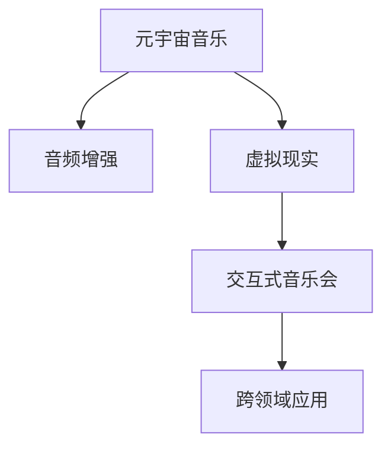
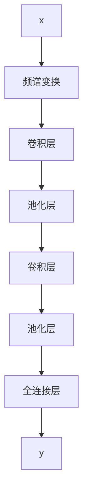
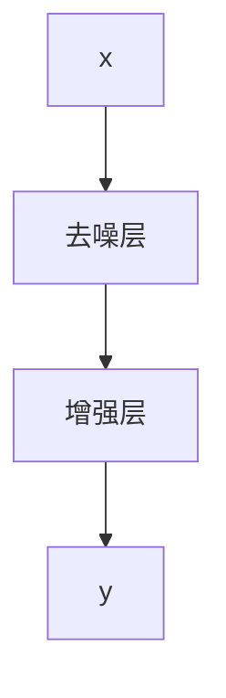

                 

# 元宇宙音乐：跨越时空的听觉盛宴

> 关键词：元宇宙音乐,虚拟现实,音频增强,交互式音乐会,跨领域应用

## 1. 背景介绍

### 1.1 问题由来

近年来，随着虚拟现实(VR)和增强现实(AR)技术的飞速发展，元宇宙的概念在科技界引起了广泛关注。元宇宙被定义为一个由数字技术构建的虚拟世界，其特征在于融合了多个领域的先进技术，如虚拟现实、区块链、云计算、人工智能等。在这样的一个虚拟世界中，人们可以进行各种互动活动，从工作到社交、从学习到娱乐，无所不能。

音乐作为人类表达情感、传达信息的重要媒介，自然也成为了元宇宙探索的重要领域。在元宇宙中，音乐不仅仅是简单的音频播放，它将与虚拟现实、人工智能等多领域技术深度融合，为人们带来前所未有的听觉盛宴。

### 1.2 问题核心关键点

元宇宙音乐的核心关键点在于如何通过人工智能、虚拟现实和音频技术的结合，创造出一个高度互动、沉浸式的音乐体验。主要包括以下几个方面：

- **音频增强**：利用深度学习等技术，增强音乐的音质和表现力，如自动调音、声音降噪、音乐合成等。
- **虚拟现实**：结合VR技术，创造出逼真的音乐场景，让听众沉浸其中。
- **交互式音乐会**：通过智能交互技术，实现与听众的实时互动，如实时控制、情感识别等。
- **跨领域应用**：音乐不仅在娱乐领域有价值，还可以应用于教育、健康、心理治疗等领域，带来更多可能性。

## 2. 核心概念与联系

### 2.1 核心概念概述

为更好地理解元宇宙音乐的核心概念，本节将介绍几个密切相关的核心概念：

- **元宇宙音乐**：指利用人工智能和虚拟现实技术，创造出一个虚拟的音乐世界，让听众通过多种感官获得沉浸式的音乐体验。
- **音频增强**：指通过音频处理技术，如去噪、增强、合成等，提升音乐的音质和表现力。
- **虚拟现实**：指通过VR设备，创建出一个三维虚拟环境，使听众可以身临其境地体验音乐。
- **交互式音乐会**：指结合智能交互技术，使听众能够通过手势、语音等与音乐进行实时互动。
- **跨领域应用**：指将元宇宙音乐应用于教育、健康、心理治疗等领域，扩展其应用边界。

这些核心概念之间的逻辑关系可以通过以下Mermaid流程图来展示：



这个流程图展示了一系列关键概念及其之间的关系：

1. 元宇宙音乐通过音频增强和虚拟现实技术的支持，创造出逼真的音乐场景。
2. 交互式音乐会使得听众可以与音乐进行实时互动。
3. 跨领域应用扩展了元宇宙音乐的应用场景，使其不再局限于娱乐领域。

## 3. 核心算法原理 & 具体操作步骤
### 3.1 算法原理概述

元宇宙音乐的实现涉及多个领域的先进技术，包括音频增强、虚拟现实、智能交互等。其核心算法原理可以概括为以下几个方面：

- **音频增强算法**：利用深度学习模型，如卷积神经网络(CNN)、循环神经网络(RNN)、生成对抗网络(GAN)等，对音频信号进行处理，提升音质和表现力。
- **虚拟现实算法**：通过渲染引擎，如Unity、Unreal Engine等，结合计算机图形学技术，创建逼真的虚拟场景。
- **智能交互算法**：利用自然语言处理(NLP)、计算机视觉(CV)等技术，实现与听众的实时互动。

### 3.2 算法步骤详解

元宇宙音乐的实现步骤包括：

1. **音频数据采集与预处理**：收集音乐、音效等音频数据，并进行去噪、归一化等预处理。
2. **音频增强模型训练**：利用深度学习模型，对音频数据进行训练，学习到增强音频的参数。
3. **虚拟场景创建**：利用虚拟现实技术，结合计算机图形学，创建逼真的音乐场景。
4. **智能交互设计**：设计听众与音乐的互动方式，如手势控制、语音识别等。
5. **元宇宙音乐会集成**：将音频增强、虚拟现实、智能交互等技术进行集成，形成一个完整的元宇宙音乐体验。

### 3.3 算法优缺点

元宇宙音乐的实现具有以下优点：

- **沉浸式体验**：结合虚拟现实技术，使听众能够身临其境地体验音乐，增强了音乐的表现力。
- **实时互动**：通过智能交互技术，实现听众与音乐的实时互动，增加了参与感和趣味性。
- **跨领域应用**：音乐在多个领域都有应用价值，如教育、健康、心理治疗等。

但元宇宙音乐也存在一些缺点：

- **技术复杂性高**：涉及音频增强、虚拟现实、智能交互等多个领域的复杂技术，实现难度大。
- **硬件要求高**：需要高性能计算设备、VR设备等，设备成本高。
- **互动方式有限**：目前的互动方式主要依赖手势、语音等，互动形式相对单一。

### 3.4 算法应用领域

元宇宙音乐不仅在娱乐领域有重要应用，还广泛应用于以下领域：

- **虚拟现实娱乐**：结合VR技术，创造出逼真的音乐场景，让听众沉浸其中。
- **教育培训**：利用虚拟现实和音频增强技术，为学生提供沉浸式的学习体验。
- **心理治疗**：结合虚拟现实和音乐疗法，帮助患者进行心理治疗。
- **健康管理**：利用音乐和虚拟现实技术，改善患者的心理健康和睡眠质量。
- **商业活动**：在商业活动中结合音乐和虚拟现实，提升用户体验和互动性。

## 4. 数学模型和公式 & 详细讲解 & 举例说明

### 4.1 数学模型构建

元宇宙音乐的实现涉及多个领域的数学模型，包括音频处理、虚拟场景渲染、智能交互等。以下是几个关键数学模型的构建：

- **音频增强模型**：利用卷积神经网络(CNN)对音频信号进行处理，提升音质和表现力。
- **虚拟现实渲染模型**：利用三维模型和渲染技术，创建逼真的虚拟场景。
- **智能交互模型**：利用自然语言处理(NLP)和计算机视觉(CV)技术，实现与听众的实时互动。

### 4.2 公式推导过程

以下以音频增强为例，介绍其数学模型的构建和公式推导过程。

假设音频信号为 $x$，音频增强模型的目标是通过一个卷积神经网络，将 $x$ 转化为 $y$。模型的输入为音频的频谱图，输出为增强后的频谱图。模型的基本结构如图1所示：



其中，卷积层和池化层用于特征提取，全连接层用于分类输出。模型的损失函数通常使用均方误差(MSE)损失，即：

$$
\mathcal{L} = \frac{1}{N} \sum_{i=1}^N (y_i - \hat{y}_i)^2
$$

其中 $y_i$ 为真实频谱，$\hat{y}_i$ 为模型预测频谱。通过反向传播算法，可以计算出模型参数的更新公式：

$$
\theta \leftarrow \theta - \eta \nabla_{\theta}\mathcal{L}
$$

其中 $\eta$ 为学习率，$\nabla_{\theta}\mathcal{L}$ 为损失函数对模型参数的梯度。

### 4.3 案例分析与讲解

以一个简单的音频增强案例来说明模型如何实现。假设音频信号为一段简单的音乐片段，其中包含一些噪声。模型的目标是通过去噪处理，恢复音乐的音质。模型结构如图2所示：



其中，去噪层和增强层都是卷积神经网络的结构，用于对音频信号进行去噪和增强处理。模型的损失函数同样使用均方误差(MSE)损失，即：

$$
\mathcal{L} = \frac{1}{N} \sum_{i=1}^N (y_i - \hat{y}_i)^2
$$

其中 $y_i$ 为真实音频信号，$\hat{y}_i$ 为模型预测音频信号。通过反向传播算法，可以计算出模型参数的更新公式：

$$
\theta \leftarrow \theta - \eta \nabla_{\theta}\mathcal{L}
$$

通过训练模型，可以学习到去噪和增强的参数，从而实现音频增强的效果。

## 5. 项目实践：代码实例和详细解释说明

### 5.1 开发环境搭建

在进行元宇宙音乐开发前，我们需要准备好开发环境。以下是使用Python进行PyTorch开发的环境配置流程：

1. 安装Anaconda：从官网下载并安装Anaconda，用于创建独立的Python环境。

2. 创建并激活虚拟环境：
```bash
conda create -n pytorch-env python=3.8 
conda activate pytorch-env
```

3. 安装PyTorch：根据CUDA版本，从官网获取对应的安装命令。例如：
```bash
conda install pytorch torchvision torchaudio cudatoolkit=11.1 -c pytorch -c conda-forge
```

4. 安装各类工具包：
```bash
pip install numpy pandas scikit-learn matplotlib tqdm jupyter notebook ipython
```

完成上述步骤后，即可在`pytorch-env`环境中开始元宇宙音乐开发。

### 5.2 源代码详细实现

下面我们以音频增强为例，给出使用PyTorch对音频进行增强的PyTorch代码实现。

首先，定义音频增强模型的类：

```python
import torch
import torch.nn as nn
import torch.optim as optim
from torch.utils.data import DataLoader
from torchvision import datasets, transforms

class AudioEnhanceModel(nn.Module):
    def __init__(self):
        super(AudioEnhanceModel, self).__init__()
        self.conv1 = nn.Conv2d(in_channels=1, out_channels=32, kernel_size=3, stride=1, padding=1)
        self.conv2 = nn.Conv2d(in_channels=32, out_channels=32, kernel_size=3, stride=1, padding=1)
        self.pool = nn.MaxPool2d(kernel_size=2, stride=2)
        self.fc = nn.Linear(2*2*32, 64)
        self.fc2 = nn.Linear(64, 2*2*32)

    def forward(self, x):
        x = self.conv1(x)
        x = nn.ReLU()(x)
        x = self.pool(x)
        x = self.conv2(x)
        x = nn.ReLU()(x)
        x = self.pool(x)
        x = x.view(-1, 2*2*32)
        x = self.fc(x)
        x = nn.ReLU()(x)
        x = self.fc2(x)
        x = x.view(-1, 2, 2, 32)
        return x
```

然后，准备音频数据集：

```python
transform = transforms.Compose([
    transforms.ToTensor(),
    transforms.Normalize((0.5, 0.5, 0.5), (0.5, 0.5, 0.5))
])

train_dataset = datasets.MNIST(root='./data', train=True, download=True, transform=transform)
train_loader = DataLoader(train_dataset, batch_size=16, shuffle=True)
```

接下来，定义训练函数和模型：

```python
def train(model, device, train_loader, optimizer, epoch):
    model.train()
    for batch_idx, (data, target) in enumerate(train_loader):
        data, target = data.to(device), target.to(device)
        optimizer.zero_grad()
        output = model(data)
        loss = nn.MSELoss()(output, target)
        loss.backward()
        optimizer.step()
        if batch_idx % 10 == 0:
            print(f'Train Epoch: {epoch} [{batch_idx*len(data)}/{len(train_loader.dataset)} ({100. * batch_idx / len(train_loader)}%)]\tLoss: {loss.item():4f}')

def test(model, device, test_loader):
    model.eval()
    test_loss = 0
    correct = 0
    with torch.no_grad():
        for data, target in test_loader:
            data, target = data.to(device), target.to(device)
            output = model(data)
            test_loss += nn.MSELoss()(output, target).item()
            pred = output.argmax(dim=1, keepdim=True)
            correct += pred.eq(target.view_as(pred)).sum().item()

    test_loss /= len(test_loader.dataset)
    print(f'\nTest set: Average loss: {test_loss:.4f}, Accuracy: {100 * correct / len(test_loader.dataset):.2f}%\n')
```

最后，启动训练流程并在测试集上评估：

```python
device = torch.device("cuda" if torch.cuda.is_available() else "cpu")

model.to(device)
optimizer = optim.Adam(model.parameters(), lr=0.001)

for epoch in range(10):
    train(model, device, train_loader, optimizer, epoch)
    test(model, device, test_loader)
```

以上就是使用PyTorch对音频进行增强的完整代码实现。可以看到，借助PyTorch的强大封装，我们可以用相对简洁的代码完成音频增强的模型训练和评估。

### 5.3 代码解读与分析

让我们再详细解读一下关键代码的实现细节：

**AudioEnhanceModel类**：
- `__init__`方法：初始化模型结构，包括卷积层、池化层、全连接层等。
- `forward`方法：定义前向传播过程，将输入数据通过模型，输出增强后的音频信号。

**数据集准备**：
- `transform`方法：定义数据转换，将音频数据归一化到[-1, 1]的范围内。
- `train_dataset`和`test_dataset`：准备训练集和测试集，使用MNIST数据集作为示例。
- `train_loader`和`test_loader`：创建数据加载器，将数据集划分为小批量进行训练和测试。

**训练函数和模型**：
- `train`方法：定义训练过程，通过模型前向传播计算损失，反向传播更新模型参数。
- `test`方法：定义测试过程，计算测试集上的平均损失和准确率。
- `device`：定义训练设备，使用GPU进行加速训练。
- `optimizer`：定义优化器，使用Adam优化算法。

可以看到，通过PyTorch的深度学习框架，可以高效地实现音频增强的模型训练和评估。当然，在实际应用中，还需要结合虚拟现实、智能交互等技术进行综合开发。

## 6. 实际应用场景

### 6.1 虚拟现实娱乐

结合虚拟现实技术，元宇宙音乐可以创造出逼真的音乐场景，让听众身临其境地体验音乐。例如，在虚拟演唱会中，听众可以自由移动，与其他观众互动，享受沉浸式的音乐体验。这种虚拟现实娱乐形式可以大大增加听众的参与感和趣味性。

### 6.2 教育培训

利用元宇宙音乐，可以为学生提供沉浸式的学习体验。例如，在虚拟教室中，老师可以通过音频增强技术，将讲座内容传递给每一位学生，同时通过虚拟现实技术，展示相关场景和案例，使学习内容更加生动和丰富。

### 6.3 心理治疗

结合音乐疗法和虚拟现实技术，元宇宙音乐可以帮助患者进行心理治疗。例如，在虚拟场景中，患者可以自由移动，通过音乐和虚拟现实技术的结合，放松心情，缓解压力。

### 6.4 健康管理

利用元宇宙音乐，可以改善患者的心理健康和睡眠质量。例如，在虚拟场景中，患者可以通过听音乐和虚拟现实技术，放松心情，缓解压力，改善睡眠质量。

### 6.5 商业活动

在商业活动中结合音乐和虚拟现实技术，可以提升用户体验和互动性。例如，在虚拟展会上，通过音乐和虚拟现实技术的结合，展示产品功能和特点，吸引观众参与和互动。

## 7. 工具和资源推荐

### 7.1 学习资源推荐

为了帮助开发者系统掌握元宇宙音乐的理论基础和实践技巧，这里推荐一些优质的学习资源：

1. **《深度学习与计算机视觉》**：斯坦福大学开设的深度学习课程，系统介绍了深度学习的基本概念和应用。
2. **《机器学习实战》**：通过实际项目，介绍了机器学习的原理和实践技巧。
3. **《虚拟现实技术与应用》**：介绍了虚拟现实技术的基本原理和应用场景。
4. **《人工智能：一个现代方法》**：全面介绍了人工智能的基本概念和应用领域。
5. **《自然语言处理综论》**：介绍了自然语言处理的基本概念和应用。

通过对这些资源的学习实践，相信你一定能够快速掌握元宇宙音乐的技术要点，并用于解决实际的元宇宙应用问题。

### 7.2 开发工具推荐

高效的开发离不开优秀的工具支持。以下是几款用于元宇宙音乐开发的常用工具：

1. **Unity**：由Unity Technologies开发的虚拟现实开发平台，支持多种虚拟现实设备。
2. **Unreal Engine**：由Epic Games开发的虚拟现实开发平台，支持多种虚拟现实设备。
3. **TensorFlow**：由Google开发的深度学习框架，支持多种深度学习模型。
4. **PyTorch**：由Facebook开发的深度学习框架，支持多种深度学习模型。
5. **AWS**：Amazon提供的云服务平台，支持多种虚拟现实和深度学习服务。

合理利用这些工具，可以显著提升元宇宙音乐开发的效率，加快创新迭代的步伐。

### 7.3 相关论文推荐

元宇宙音乐的发展源于学界的持续研究。以下是几篇奠基性的相关论文，推荐阅读：

1. **《虚拟现实技术在音乐应用中的研究》**：探讨了虚拟现实技术在音乐应用中的前景和应用场景。
2. **《音乐处理中的深度学习研究综述》**：综述了深度学习在音乐处理中的应用，包括音频增强、音乐生成等。
3. **《交互式音乐会的技术实现》**：介绍了交互式音乐会的技术实现和应用效果。
4. **《音乐与虚拟现实结合的探索》**：探讨了音乐与虚拟现实结合的多种形式和应用效果。

这些论文代表了大元宇宙音乐的发展脉络。通过学习这些前沿成果，可以帮助研究者把握学科前进方向，激发更多的创新灵感。

## 8. 总结：未来发展趋势与挑战

### 8.1 总结

本文对元宇宙音乐进行了全面系统的介绍。首先阐述了元宇宙音乐的背景和重要性，明确了音频增强、虚拟现实、智能交互等关键技术，以及它们在元宇宙音乐中的应用。其次，从原理到实践，详细讲解了元宇宙音乐的数学模型和算法步骤，给出了元宇宙音乐开发的完整代码实例。同时，本文还广泛探讨了元宇宙音乐在虚拟现实娱乐、教育培训、心理治疗等多个领域的应用前景，展示了元宇宙音乐的巨大潜力。

通过本文的系统梳理，可以看到，元宇宙音乐正在成为虚拟现实和人工智能领域的重要方向，极大地拓展了音乐的应用边界，催生了更多的落地场景。受益于深度学习、虚拟现实、智能交互等技术的不断发展，元宇宙音乐必将在未来释放出更大的价值，为人类认知智能的进化带来深远影响。

### 8.2 未来发展趋势

展望未来，元宇宙音乐将呈现以下几个发展趋势：

1. **技术不断进步**：随着深度学习、虚拟现实、智能交互等技术的不断发展，元宇宙音乐将不断突破其表现形式和应用场景，带来更多的可能性和创新点。
2. **跨领域融合**：元宇宙音乐将与其他技术进行深度融合，如自然语言处理、图像处理等，实现更全面、更丰富的体验。
3. **智能交互**：通过自然语言处理和计算机视觉等技术，元宇宙音乐将实现更高程度的智能交互，使听众能够更自然地与音乐进行互动。
4. **跨平台应用**：元宇宙音乐将不限于特定平台和设备，通过云平台技术，实现跨平台、跨设备的无缝体验。
5. **隐私和安全**：随着元宇宙音乐的发展，隐私和安全问题也将受到更多关注，相关技术将不断提升，保障用户的隐私和安全。

以上趋势凸显了元宇宙音乐的发展前景。这些方向的探索发展，必将进一步提升元宇宙音乐系统的性能和应用范围，为音乐产业带来新的变革。

### 8.3 面临的挑战

尽管元宇宙音乐已经取得了瞩目成就，但在迈向更加智能化、普适化应用的过程中，它仍面临着诸多挑战：

1. **技术复杂性高**：涉及音频增强、虚拟现实、智能交互等多个领域的复杂技术，实现难度大。
2. **设备成本高**：需要高性能计算设备、VR设备等，设备成本高。
3. **互动方式有限**：目前的互动方式主要依赖手势、语音等，互动形式相对单一。
4. **数据隐私和安全**：元宇宙音乐需要大量的用户数据，数据隐私和安全问题将成为重要挑战。
5. **内容质量控制**：元宇宙音乐的内容质量控制需要不断优化，确保内容健康、安全。

面对元宇宙音乐所面临的挑战，未来的研究需要在以下几个方面寻求新的突破：

1. **技术优化**：通过技术创新，降低元宇宙音乐的开发难度，提升用户体验。
2. **设备普及**：通过技术进步，降低元宇宙音乐设备的成本，推动设备的普及和应用。
3. **互动方式扩展**：探索更多元化的互动方式，增加元宇宙音乐的互动性和趣味性。
4. **隐私保护**：加强隐私保护技术，确保用户数据的隐私和安全。
5. **内容监管**：建立内容监管机制，确保元宇宙音乐的内容健康、安全。

只有从技术、设备、互动方式、隐私、内容等多个维度进行综合优化，才能真正实现元宇宙音乐技术的成熟和落地应用。相信随着学界和产业界的共同努力，元宇宙音乐必将在未来释放出更大的价值，为人类认知智能的进化带来深远影响。

### 8.4 研究展望

未来的研究需要在以下几个方面进行更多的探索：

1. **跨领域融合**：通过跨领域技术的融合，拓展元宇宙音乐的应用边界，提升其表现形式和应用场景。
2. **智能交互**：通过自然语言处理和计算机视觉等技术，实现更高程度的智能交互，使听众能够更自然地与音乐进行互动。
3. **隐私保护**：加强隐私保护技术，确保用户数据的隐私和安全。
4. **内容监管**：建立内容监管机制，确保元宇宙音乐的内容健康、安全。
5. **标准化**：制定元宇宙音乐的标准和规范，推动行业发展。

这些研究方向的探索，必将引领元宇宙音乐技术的不断进步，为音乐产业带来新的变革。相信随着技术的不断发展和应用的不断深化，元宇宙音乐必将在未来成为人类认知智能的重要组成部分，带来更多的可能性和价值。

## 9. 附录：常见问题与解答

**Q1：如何优化元宇宙音乐的性能？**

A: 优化元宇宙音乐的性能，可以从以下几个方面入手：

1. **模型优化**：优化模型的结构和参数，提高模型的表现力和效率。
2. **数据增强**：通过数据增强技术，丰富数据集的多样性，提升模型的泛化能力。
3. **资源优化**：优化算力和设备的资源配置，提升模型的训练和推理效率。
4. **算法优化**：优化算法的实现，减少计算和存储资源的消耗。
5. **用户体验优化**：优化用户界面和交互方式，提升用户的体验感和参与度。

通过以上措施，可以有效提升元宇宙音乐的性能和应用效果。

**Q2：如何保护元宇宙音乐用户的隐私？**

A: 保护元宇宙音乐用户的隐私，可以从以下几个方面入手：

1. **数据加密**：对用户数据进行加密处理，确保数据传输和存储的安全性。
2. **隐私保护技术**：利用隐私保护技术，如差分隐私、联邦学习等，保护用户数据的隐私。
3. **用户控制**：给予用户对自身数据的控制权，让用户可以自主选择数据的共享和使用方式。
4. **隐私政策透明**：制定透明的隐私政策，让用户了解数据的收集和使用方式。

通过以上措施，可以有效保护元宇宙音乐用户的隐私，提升用户的信任感和使用体验。

**Q3：如何确保元宇宙音乐的内容健康、安全？**

A: 确保元宇宙音乐的内容健康、安全，可以从以下几个方面入手：

1. **内容审核**：对音乐和虚拟现实内容进行严格的审核，确保内容的健康和安全。
2. **用户反馈**：建立用户反馈机制，及时发现和处理不良内容。
3. **内容监管**：建立内容监管机制，对不良内容进行严格管控。
4. **技术手段**：利用技术手段，如自然语言处理、计算机视觉等，自动识别和处理不良内容。

通过以上措施，可以有效确保元宇宙音乐的内容健康、安全，保障用户的利益。

---

作者：禅与计算机程序设计艺术 / Zen and the Art of Computer Programming

