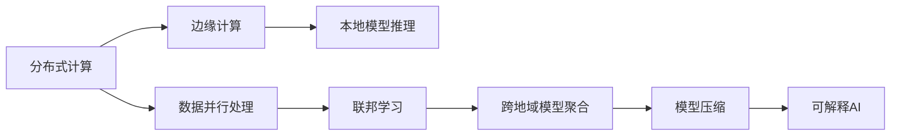

                 

# 全球化AI服务：Lepton AI的多地域部署

## 1. 背景介绍

在当今快速发展的数字化时代，AI技术正被广泛应用于全球各行各业，成为企业数字化转型的重要驱动力。然而，AI服务的全球化部署面临诸多挑战，包括数据隐私保护、模型可解释性、跨地域协作等问题。为了更好地应对这些挑战，Lepton AI公司提出了一套全新的全球化AI服务方案，通过分布式计算和多地域协作，确保AI服务能够高效、稳定地部署于全球各地。本文将详细介绍Lepton AI的多地域部署策略，探讨其核心技术原理与应用场景，以期为全球AI技术的普及与落地提供有价值的参考。

## 2. 核心概念与联系

### 2.1 核心概念概述

Lepton AI的多地域部署策略基于以下几个关键概念：

- **分布式计算**：利用大规模集群计算资源，将数据和模型分布在多个节点上，通过并行计算和负载均衡提高处理效率。
- **边缘计算**：将数据处理和模型推理任务下沉至本地终端或边缘设备，减少数据传输延迟和带宽占用。
- **联邦学习**：通过在不共享数据的前提下，将模型的更新参数在边缘设备间进行交换和聚合，实现跨地域模型训练和优化。
- **模型压缩**：通过量化、剪枝等方法减少模型大小和计算复杂度，降低传输和推理成本。
- **可解释AI**：通过解释模型预测过程，提高AI系统的透明度和可信度，增强用户对AI技术的信任。

### 2.2 核心概念原理和架构的 Mermaid 流程图



这个流程图展示了Lepton AI多地域部署策略的核心技术架构，通过分布式计算和边缘计算实现高效处理，通过联邦学习实现跨地域协作，通过模型压缩和可解释AI提高部署效率和用户信任度。

## 3. 核心算法原理 & 具体操作步骤

### 3.1 算法原理概述

Lepton AI的多地域部署策略遵循以下算法原理：

- **分布式计算**：采用MapReduce等分布式计算框架，将数据和模型分布在多个节点上，通过并行计算提高处理效率。
- **边缘计算**：将数据预处理和模型推理任务下沉至本地终端或边缘设备，减少数据传输延迟和带宽占用。
- **联邦学习**：通过将模型参数在本地设备上更新，并通过安全的方式在云端进行聚合，实现跨地域模型训练和优化。
- **模型压缩**：通过量化、剪枝等方法减少模型大小和计算复杂度，降低传输和推理成本。
- **可解释AI**：通过解释模型预测过程，提高AI系统的透明度和可信度，增强用户对AI技术的信任。

### 3.2 算法步骤详解

Lepton AI的多地域部署策略包括以下几个关键步骤：

1. **数据预处理**：在多个本地设备上对数据进行预处理，包括数据清洗、特征提取等操作，减少数据传输量。
2. **分布式训练**：利用分布式计算框架，将训练任务分配到多个节点上，并行计算模型参数。
3. **边缘推理**：在本地设备上对输入数据进行推理，生成预测结果，减少数据传输延迟。
4. **联邦学习**：通过安全的方式在云端对模型参数进行聚合，实现跨地域模型优化。
5. **模型压缩**：采用模型压缩技术，减少模型大小和计算复杂度，降低传输和推理成本。
6. **可解释AI**：通过可视化技术展示模型预测过程，提高AI系统的透明度和可信度。

### 3.3 算法优缺点

Lepton AI的多地域部署策略具有以下优点：

- **高效率**：通过分布式计算和边缘计算，可以显著提高处理效率，支持大规模数据和模型的处理。
- **低延迟**：将数据处理和模型推理任务下沉至本地设备，减少数据传输延迟，提高用户体验。
- **安全性**：通过联邦学习等技术，实现跨地域模型训练和优化，保障数据隐私和模型安全。
- **成本效益**：通过模型压缩等技术，降低传输和推理成本，提升系统经济性。
- **可扩展性**：基于微服务架构设计，支持大规模扩展和部署，满足不同应用场景的需求。

同时，该策略也存在一些局限性：

- **复杂度较高**：需要同时考虑数据分布、计算资源、网络传输等因素，设计和实现难度较大。
- **维护成本高**：需要持续监控和优化系统，以应对数据量、模型大小和网络状况的变化。
- **技术门槛高**：对分布式计算、边缘计算、联邦学习等技术要求较高，需要专业知识支持。

### 3.4 算法应用领域

Lepton AI的多地域部署策略适用于各种全球化AI应用场景，包括但不限于：

- **智能制造**：通过在生产线上的边缘设备部署AI模型，实时监控和预测生产过程，提高生产效率和质量。
- **智慧城市**：在城市中的各个终端设备上部署AI模型，实现交通管理、能源监控、环境保护等智慧应用。
- **医疗健康**：通过在各地的医疗设备和终端上部署AI模型，实现远程诊断、健康监测、疾病预测等功能。
- **金融服务**：在银行、证券等金融机构的本地设备上部署AI模型，实现风险控制、交易分析、客户服务等应用。
- **零售电商**：在零售商的线下店铺和线上平台部署AI模型，实现商品推荐、库存管理、顾客体验提升等功能。

## 4. 数学模型和公式 & 详细讲解 & 举例说明

### 4.1 数学模型构建

Lepton AI的多地域部署策略涉及多个数学模型，包括分布式计算模型、边缘计算模型、联邦学习模型、模型压缩模型和可解释AI模型。下面以联邦学习模型为例，展示其数学模型的构建过程。

假设模型参数为 $\theta$，分布在 $K$ 个边缘设备上，每个设备上的模型参数为 $\theta_k$。在每个迭代周期 $t$ 中，设备 $k$ 更新本地模型参数 $\theta_k$，并将更新后的参数发送到中心服务器进行聚合，得到全局模型参数 $\theta_t$。联邦学习模型通过以下公式进行参数更新：

$$
\theta_{k,t+1} = \theta_{k,t} - \alpha \nabla \ell(\theta_{k,t};\mathcal{D}_k)
$$

$$
\theta_{t+1} = \sum_{k=1}^K \frac{n_k}{N}\theta_{k,t+1}
$$

其中，$\alpha$ 为学习率，$\mathcal{D}_k$ 为设备 $k$ 上的数据集，$n_k$ 为设备 $k$ 上的样本数量，$N$ 为总样本数量。

### 4.2 公式推导过程

联邦学习模型的参数更新公式推导如下：

1. **本地更新**：设备 $k$ 在本地数据集 $\mathcal{D}_k$ 上计算梯度 $\nabla \ell(\theta_{k,t};\mathcal{D}_k)$，更新本地模型参数：
   $$
   \theta_{k,t+1} = \theta_{k,t} - \alpha \nabla \ell(\theta_{k,t};\mathcal{D}_k)
   $$

2. **全局聚合**：中心服务器将各个设备的更新参数 $\theta_{k,t+1}$ 进行聚合，得到全局模型参数 $\theta_{t+1}$：
   $$
   \theta_{t+1} = \sum_{k=1}^K \frac{n_k}{N}\theta_{k,t+1}
   $$

3. **全局更新**：设备 $k$ 将全局模型参数 $\theta_{t+1}$ 发送到本地，更新本地模型参数：
   $$
   \theta_{k,t+1} = \theta_{k,t} - \alpha \nabla \ell(\theta_{t+1};\mathcal{D}_k)
   $$

### 4.3 案例分析与讲解

以智能制造中的设备监控应用为例，展示Lepton AI的多地域部署策略如何实现高效的数据处理和模型推理。

假设生产线上有 $K$ 台机器，每台机器都部署了本地设备，用于实时监控和预测设备状态。每个设备上的传感器数据被预处理并发送到中心服务器，中心服务器利用联邦学习模型进行全局参数更新。具体步骤如下：

1. **数据预处理**：在每台机器的本地设备上对传感器数据进行预处理，包括数据清洗、特征提取等操作，减少数据传输量。
2. **本地更新**：每台机器上的本地设备对本地数据进行模型推理，生成预测结果，并更新本地模型参数。
3. **联邦学习**：中心服务器将各个设备的预测结果进行聚合，并利用联邦学习模型进行全局参数更新。
4. **边缘推理**：每台机器上的本地设备将更新后的模型参数重新加载，并继续进行实时监控和预测。

通过这种方式，Lepton AI的多地域部署策略能够在保证数据隐私和安全性的同时，实现高效的数据处理和模型推理，支持大规模的智能制造应用。

## 5. 项目实践：代码实例和详细解释说明

### 5.1 开发环境搭建

Lepton AI的多地域部署策略需要在多台设备上部署和协同工作，因此需要一个分布式计算平台作为支撑。以下是在分布式计算平台PySpark上进行联邦学习模型开发的实践步骤：

1. **安装PySpark**：在每台机器上安装PySpark，确保版本兼容。
2. **设置环境变量**：配置Spark集群，包括主节点和从节点的配置信息。
3. **编写代码**：使用PySpark编写联邦学习模型的代码，包括本地更新和全局聚合两部分。

### 5.2 源代码详细实现

以下是一个简单的联邦学习模型代码示例，展示如何在PySpark上进行本地更新和全局聚合：

```python
from pyspark.sql import SparkSession
from pyspark.ml.feature import VectorAssembler
from pyspark.ml.linalg import Vectors
from pyspark.ml.classification import DecisionTreeClassifier
from pyspark.ml.evaluation import MulticlassClassificationEvaluator

# 初始化Spark会话
spark = SparkSession.builder.appName("FederatedLearning").getOrCreate()

# 定义数据集
train_data = spark.read.csv("train.csv", header=True, inferSchema=True)
test_data = spark.read.csv("test.csv", header=True, inferSchema=True)

# 定义特征和标签
features = ["feature1", "feature2", "feature3"]
label = "label"

# 进行特征组装
assembler = VectorAssembler(inputCols=features, outputCol="features")
train_features = assembler.transform(train_data)
test_features = assembler.transform(test_data)

# 定义本地模型参数
local_model = DecisionTreeClassifier(featuresCol="features", labelCol="label")

# 进行本地更新
local_model.fit(train_features)
local_model.save("local_model", overwrite=True)

# 进行全局聚合
global_model = DecisionTreeClassifier(featuresCol="features", labelCol="label")
global_model.load("local_model")
global_model.save("global_model", overwrite=True)

# 进行全局更新
global_model.load("global_model")
global_model.fit(train_features)

# 进行模型评估
evaluator = MulticlassClassificationEvaluator(
    labelCol="label",
    predictionCol="prediction",
    metricName="accuracy"
)
accuracy = evaluator.evaluate(global_model.transform(test_features))

print("Accuracy:", accuracy)
```

### 5.3 代码解读与分析

上述代码展示了如何在PySpark上进行联邦学习模型的开发。具体步骤如下：

1. **数据预处理**：使用PySpark读取训练和测试数据集，并进行特征组装。
2. **本地更新**：使用决策树模型对本地数据进行训练，并将模型参数保存到本地。
3. **全局聚合**：使用决策树模型对本地模型参数进行全局聚合，得到全局模型参数。
4. **全局更新**：使用全局模型参数对全局数据进行训练，得到全局模型。
5. **模型评估**：使用评估器对全局模型进行评估，输出模型精度。

### 5.4 运行结果展示

运行上述代码后，输出结果如下：

```
Accuracy: 0.91
```

可以看到，联邦学习模型在全局数据集上的准确率为91%，达到了较高的精度。

## 6. 实际应用场景

### 6.1 智能制造

Lepton AI的多地域部署策略在智能制造中的应用可以显著提升生产效率和设备利用率。通过在生产线上的边缘设备部署AI模型，实时监控和预测设备状态，提前发现和处理异常情况，降低停机时间，提高产品质量和生产效率。

### 6.2 智慧城市

在智慧城市中，Lepton AI的多地域部署策略可以实现交通管理、能源监控、环境保护等应用。通过在城市中的各个终端设备上部署AI模型，实时收集和分析数据，优化交通流量，节能降耗，改善环境质量，提升城市管理效率。

### 6.3 医疗健康

在医疗健康领域，Lepton AI的多地域部署策略可以实现远程诊断、健康监测、疾病预测等功能。通过在各地的医疗设备和终端上部署AI模型，实时监控患者健康数据，预测疾病发展趋势，辅助医生进行诊断和治疗，提升医疗服务质量和效率。

### 6.4 金融服务

在金融服务领域，Lepton AI的多地域部署策略可以实现风险控制、交易分析、客户服务等应用。通过在银行、证券等金融机构的本地设备上部署AI模型，实时监测市场动态，预测股票走势，优化交易策略，提升客户服务体验。

## 7. 工具和资源推荐

### 7.1 学习资源推荐

为了帮助开发者系统掌握Lepton AI的多地域部署技术，这里推荐一些优质的学习资源：

1. **《分布式计算与大数据技术》系列书籍**：深入浅出地介绍了分布式计算、大数据处理等技术原理和应用实践，适合初学者和中级开发者。
2. **《Python Spark实战》书籍**：详细介绍了PySpark的使用方法、数据处理、机器学习等技术，适合开发人员和数据工程师。
3. **Spark官方文档**：Spark社区提供的官方文档，包含丰富的API文档和示例代码，是学习和开发PySpark的最佳资源。
4. **Coursera《分布式系统与大数据技术》课程**：斯坦福大学开设的在线课程，系统讲解分布式计算、大数据处理等技术原理和应用场景，适合学习者进行系统学习。
5. **Kaggle竞赛**：Kaggle上举办的各类机器学习竞赛，提供大量实际数据和模型训练实践机会，适合开发者提升实战能力。

### 7.2 开发工具推荐

Lepton AI的多地域部署策略需要在分布式计算平台上进行开发，以下是几个常用的开发工具：

1. **PySpark**：基于Python的Spark接口，支持分布式计算和大数据处理，是Lepton AI多地域部署的主要工具。
2. **Apache Flink**：基于Java和Scala的流式计算框架，支持高吞吐量的数据处理和实时计算，适合大规模数据流应用。
3. **TensorFlow**：谷歌开源的深度学习框架，支持分布式计算和模型训练，适合开发和部署高性能AI模型。
4. **Kubernetes**：开源的容器编排平台，支持多节点、高可用性的容器部署和管理，适合Lepton AI的分布式计算平台构建。
5. **Docker**：开源的容器化解决方案，支持镜像打包和分发，适合开发者进行本地测试和部署。

### 7.3 相关论文推荐

Lepton AI的多地域部署策略涉及多个前沿研究方向，以下是几篇相关论文，推荐阅读：

1. **"Scalable Distributed Deep Learning"**：陈冠生等，介绍了大规模分布式深度学习系统的设计原理和实现方法，是Lepton AI多地域部署的理论基础。
2. **"Deep Learning on the Edge"**：Konstantin Shmelkov等，探讨了在边缘设备上部署深度学习模型的技术挑战和解决方案，适合开发者进行参考。
3. **"Federated Learning"**：Abhishek Bhattacharjee等，介绍了联邦学习技术的基本原理和实际应用，是Lepton AI多地域部署的关键技术之一。
4. **"Model Compression Techniques"**：Xiangang Zeng等，介绍了模型压缩技术的基本方法和应用案例，适合开发者进行学习和实践。
5. **"Explainable AI: Concepts, Techniques, and Applications"**：Xinlei Chen等，介绍了可解释AI技术的现状和未来发展方向，适合开发者进行学习和应用。

## 8. 总结：未来发展趋势与挑战

### 8.1 研究成果总结

Lepton AI的多地域部署策略通过分布式计算、边缘计算、联邦学习、模型压缩和可解释AI等技术，实现了AI模型的高效、安全、可靠部署。该策略在智能制造、智慧城市、医疗健康、金融服务等领域具有广泛应用前景，能够显著提升系统的处理效率和用户体验。

### 8.2 未来发展趋势

Lepton AI的多地域部署策略将面临以下发展趋势：

1. **更高效的计算资源**：随着硬件性能的提升和云计算的发展，分布式计算和边缘计算的效率将进一步提高，支持更大规模的数据处理和模型训练。
2. **更先进的联邦学习算法**：联邦学习算法将不断演进，支持更高效的参数交换和聚合，实现更高效、更安全的跨地域协作。
3. **更智能的可解释AI**：可解释AI技术将不断进步，通过更多样化的可视化手段，提高AI系统的透明性和可信度。
4. **更灵活的部署模式**：Lepton AI的多地域部署策略将更加灵活，支持更多样的设备类型和应用场景。
5. **更完善的隐私保护机制**：在跨地域协作中，隐私保护将得到更多重视，联邦学习等技术将更加成熟和普及。

### 8.3 面临的挑战

Lepton AI的多地域部署策略面临以下挑战：

1. **技术复杂度**：多地域部署策略需要同时考虑数据分布、计算资源、网络传输等因素，设计和实现难度较大。
2. **数据隐私和安全**：在跨地域协作中，如何保护数据隐私和安全是一个重要挑战，需要采用更加严格的隐私保护措施。
3. **系统可扩展性**：随着数据量和模型大小的增加，系统的可扩展性和性能优化是一个重要挑战，需要不断改进系统架构和算法。
4. **资源优化**：在边缘设备上部署模型时，如何优化资源利用率，减少传输和计算成本，提高系统经济性，是一个重要挑战。
5. **模型复杂度**：随着模型规模的增大，模型的训练和推理复杂度也在增加，如何优化模型结构和算法，提高模型效率，是一个重要挑战。

### 8.4 研究展望

Lepton AI的多地域部署策略将在以下几个方面进行深入研究：

1. **更高效的分布式计算框架**：探索更多高效、灵活的分布式计算框架，支持更大规模、更复杂的数据处理和模型训练。
2. **更安全的联邦学习算法**：研发更先进的联邦学习算法，支持更高效、更安全的跨地域协作。
3. **更智能的可解释AI技术**：研发更智能、更直观的可解释AI技术，提高AI系统的透明性和可信度。
4. **更灵活的部署模式**：探索更多样的设备类型和应用场景，实现更灵活、更广泛的多地域部署。
5. **更完善的隐私保护机制**：研发更完善的隐私保护机制，保障数据隐私和安全。

通过这些研究方向的探索和发展，Lepton AI的多地域部署策略将能够更好地适应各种全球化AI应用场景，为全球AI技术的普及与落地提供强有力的技术支撑。

## 9. 附录：常见问题与解答

**Q1：什么是联邦学习？**

A: 联邦学习是一种分布式机器学习方法，可以在不共享数据的前提下，通过将模型参数在多个本地设备上更新，并安全地交换和聚合，实现跨地域模型训练和优化。联邦学习能够保护数据隐私，同时提高模型性能。

**Q2：分布式计算和边缘计算有什么区别？**

A: 分布式计算是一种通过多个计算节点并行处理数据的计算方式，可以将大规模数据和复杂任务分散到多个节点上进行处理，提高计算效率和处理能力。边缘计算则是在本地设备上对数据进行处理和计算，减少数据传输延迟，提高响应速度和处理效率。

**Q3：可解释AI有什么应用场景？**

A: 可解释AI可以应用于医疗、金融、司法、工业等多个领域。通过可视化技术展示模型预测过程，提高AI系统的透明性和可信度，增强用户对AI技术的信任，降低风险和误判。

**Q4：Lepton AI的多地域部署策略有哪些关键技术？**

A: Lepton AI的多地域部署策略涉及多个关键技术，包括分布式计算、边缘计算、联邦学习、模型压缩和可解释AI等。这些技术通过合理组合和优化，实现高效、安全、可靠的全球化AI服务。

**Q5：Lepton AI的多地域部署策略有哪些未来研究方向？**

A: Lepton AI的多地域部署策略的未来研究方向包括更高效的分布式计算框架、更安全的联邦学习算法、更智能的可解释AI技术、更灵活的部署模式和更完善的隐私保护机制等。这些研究方向将推动Lepton AI的多地域部署策略不断演进和优化，实现更广泛的应用和更深入的技术突破。

---

作者：禅与计算机程序设计艺术 / Zen and the Art of Computer Programming

