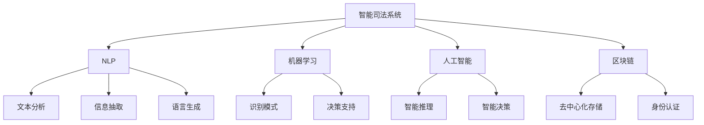

                 

# 全球脑与司法系统：智能化法律服务的未来

## 1. 背景介绍

### 1.1 问题由来
司法系统作为社会公平与正义的守护者，一直是各国政府关注的重点。然而，传统的司法服务存在着诸如案卷处理效率低、信息利用率低、法官工作负担重等诸多问题。这些问题不仅影响了司法公正，也导致了司法成本的上升。面对如此严峻的挑战，如何通过技术手段提升司法服务的智能化水平，成为一个亟待解决的课题。

### 1.2 问题核心关键点
智能化司法系统的建设，关键在于如何利用先进的技术手段，提高司法服务的效率和公正性，同时降低成本。这其中涉及到的技术手段包括但不限于：数据挖掘、自然语言处理、机器学习、人工智能、区块链等。这些技术的融合应用，有望在案件管理、证据审核、法律咨询、判决生成等方面实现突破，从而大幅提升司法服务的智能化水平。

## 2. 核心概念与联系

### 2.1 核心概念概述

为更好地理解智能化法律服务系统，本节将介绍几个密切相关的核心概念：

- **智能司法系统**：利用人工智能技术，自动完成案件信息采集、证据审核、法律咨询、判决生成等司法服务任务，提升司法效率和公正性，降低司法成本的系统。
- **自然语言处理(NLP)**：通过算法处理和理解人类语言，实现文本分析、信息抽取、语言生成等任务的计算系统。
- **机器学习(ML)**：一种利用数据训练模型，使其能够自动识别模式并做出决策的技术。
- **人工智能(AI)**：涉及计算机科学、认知科学、哲学等多个领域，旨在开发智能系统，模拟人类智能行为。
- **区块链**：一种分布式数据库技术，具有去中心化、透明、不可篡改等特点，广泛应用于法律事务中的数据存储和身份认证。

这些核心概念之间的逻辑关系可以通过以下Mermaid流程图来展示：



这个流程图展示出智能司法系统与核心技术之间的关联：

1. 智能司法系统依赖于NLP、ML、AI等技术实现对法律文本的分析、识别和推理。
2. NLP技术可以对法律文本进行自然语言理解，实现关键信息抽取。
3. ML技术可以利用训练好的模型，自动识别案件类型、识别证据、评估判决等。
4. AI技术通过模拟人类智能推理，提升决策的准确性和公正性。
5. 区块链技术则保障了数据存储和身份认证的安全性。

这些概念共同构成了智能化法律服务系统的基础，为其在司法实践中的应用提供了技术支撑。

## 3. 核心算法原理 & 具体操作步骤
### 3.1 算法原理概述

基于智能司法系统的设计，其核心算法原理可以概括为以下几个方面：

- **数据预处理**：从各种数据源中收集司法案例和相关数据，并进行清洗、标注、归一化等预处理操作。
- **自然语言处理**：利用NLP技术对法律文本进行分词、实体识别、关系抽取等处理，提取出案件的关键信息。
- **特征提取**：将法律文本中的关键信息转化为数值型特征向量，作为机器学习模型的输入。
- **模型训练**：利用ML算法训练模型，使其能够在新的案件上自动预测判决结果。
- **智能推理**：通过AI技术模拟人类智能推理过程，对案件进行全面分析和综合判断。
- **区块链应用**：将司法数据存储在区块链上，保障数据的安全性和透明性。

这些算法原理共同构成了智能化司法系统的技术框架，为其在实际应用中提供了理论支持。

### 3.2 算法步骤详解

基于智能司法系统的构建，其核心算法步骤包括以下几个关键点：

**Step 1: 数据收集与预处理**
- 收集历史司法案例和相关数据，如判决书、案件信息、律师辩护词等。
- 对数据进行清洗、去重、标注、归一化等预处理操作。

**Step 2: 自然语言处理**
- 对法律文本进行分词、命名实体识别、关系抽取等处理。
- 将法律文本转化为结构化的特征向量，提取关键信息。

**Step 3: 特征提取与模型训练**
- 利用机器学习算法（如SVM、决策树、随机森林等）对特征向量进行训练，得到预测模型。
- 在新的案件上输入特征向量，使用训练好的模型进行预测。

**Step 4: 智能推理**
- 将预测结果输入智能推理系统，模拟人类智能推理过程，评估预测的合理性和公正性。
- 结合领域专家的知识，对预测结果进行人工复审，确保司法公正。

**Step 5: 区块链应用**
- 将司法数据存储在区块链上，保证数据的安全性和透明性。
- 利用区块链技术进行身份认证，确保数据的可信度。

以上是基于智能司法系统的构建的完整算法步骤。在实际应用中，还需要针对具体任务进行优化设计，如改进数据预处理流程，引入更多特征提取技术，搜索最优的超参数组合等，以进一步提升模型性能。

### 3.3 算法优缺点

基于智能司法系统的构建，其算法具有以下优点：
1. 提升司法效率：自动化处理案件信息，加快案件审理速度，减少法官工作负担。
2. 提高司法公正性：利用数据驱动的方法，减少人工操作带来的偏差，提高判决的合理性和公正性。
3. 降低司法成本：通过自动化的处理流程，节省人力和物力资源，降低司法系统的运营成本。
4. 增强司法透明性：区块链技术保障数据存储的透明性，增加司法过程的可追溯性和可信度。

同时，该算法也存在一定的局限性：
1. 数据依赖性：算法的性能很大程度上取决于司法数据的丰富性和准确性，数据不足时效果会大打折扣。
2. 技术复杂性：智能司法系统的构建需要综合应用多种先进技术，技术实现复杂度较高。
3. 伦理问题：在数据处理和智能推理过程中，可能面临隐私泄露和算法偏见等伦理问题。
4. 法律挑战：现有法律体系对智能司法系统的应用可能存在不适应的问题，需要进一步完善相关法律法规。

尽管存在这些局限性，但就目前而言，智能司法系统的构建是大数据时代司法服务的重要趋势，其带来的提升效率、提高公正、降低成本等多重优势，使其在司法实践中的应用前景广阔。

### 3.4 算法应用领域

基于智能司法系统的构建，其算法在多个领域得到了广泛应用：

- **案件管理**：自动化的案件信息采集、分类、归档等管理功能，提升了案件处理的效率和规范性。
- **证据审核**：利用智能算法自动审核证据的真伪、完整性，提高了证据审核的准确性。
- **法律咨询**：根据输入的法律问题，自动生成法律建议和参考案例，辅助律师和法官的决策。
- **判决生成**：结合人工复审，自动生成判决书，提升判决书撰写速度和质量。
- **智能推理**：结合法官的智慧和数据驱动的算法，实现判决的智能推理和公正性评估。

除了上述这些经典应用外，智能司法系统还被创新性地应用到更多场景中，如司法大数据分析、案件风险评估、智能调解等，为司法服务带来了新的突破。

## 4. 数学模型和公式 & 详细讲解  
### 4.1 数学模型构建

本节将使用数学语言对智能司法系统的核心算法进行更加严格的刻画。

记司法案件数据集为 $D=\{(x_i,y_i)\}_{i=1}^N, x_i$ 为案件信息， $y_i$ 为判决结果。

定义模型 $M_{\theta}$ 在输入 $x_i$ 上的预测结果为 $\hat{y}=M_{\theta}(x_i) \in [0,1]$，其中 $\theta$ 为模型参数。在二分类问题中，$\hat{y}$ 表示判决为正（有罪）的概率。

假设模型 $M_{\theta}$ 在数据样本 $(x_i,y_i)$ 上的损失函数为 $\ell(M_{\theta}(x_i),y_i)$，则在数据集 $D$ 上的经验风险为：

$$
\mathcal{L}(\theta) = \frac{1}{N} \sum_{i=1}^N \ell(M_{\theta}(x_i),y_i)
$$

常见的损失函数包括交叉熵损失、均方误差损失等。例如，对于二分类问题，交叉熵损失函数定义为：

$$
\ell(M_{\theta}(x_i),y_i) = -[y_i\log \hat{y}_i + (1-y_i)\log(1-\hat{y}_i)]
$$

模型参数 $\theta$ 的优化目标是：

$$
\theta^* = \mathop{\arg\min}_{\theta} \mathcal{L}(\theta)
$$

在实践中，我们通常使用基于梯度的优化算法（如SGD、Adam等）来近似求解上述最优化问题。设 $\eta$ 为学习率，则参数的更新公式为：

$$
\theta \leftarrow \theta - \eta \nabla_{\theta}\mathcal{L}(\theta)
$$

其中 $\nabla_{\theta}\mathcal{L}(\theta)$ 为损失函数对参数 $\theta$ 的梯度，可通过反向传播算法高效计算。

### 4.2 公式推导过程

以下我们以二分类问题为例，推导交叉熵损失函数及其梯度的计算公式。

假设模型 $M_{\theta}$ 在输入 $x$ 上的输出为 $\hat{y}=M_{\theta}(x) \in [0,1]$，表示样本属于正类的概率。真实标签 $y \in \{0,1\}$。则二分类交叉熵损失函数定义为：

$$
\ell(M_{\theta}(x),y) = -[y\log \hat{y}_i + (1-y)\log(1-\hat{y}_i)]
$$

将其代入经验风险公式，得：

$$
\mathcal{L}(\theta) = -\frac{1}{N}\sum_{i=1}^N [y_i\log M_{\theta}(x_i)+(1-y_i)\log(1-M_{\theta}(x_i))]
$$

根据链式法则，损失函数对参数 $\theta_k$ 的梯度为：

$$
\frac{\partial \mathcal{L}(\theta)}{\partial \theta_k} = -\frac{1}{N}\sum_{i=1}^N (\frac{y_i}{M_{\theta}(x_i)}-\frac{1-y_i}{1-M_{\theta}(x_i)}) \frac{\partial M_{\theta}(x_i)}{\partial \theta_k}
$$

其中 $\frac{\partial M_{\theta}(x_i)}{\partial \theta_k}$ 可进一步递归展开，利用自动微分技术完成计算。

在得到损失函数的梯度后，即可带入参数更新公式，完成模型的迭代优化。重复上述过程直至收敛，最终得到适应司法案件的模型参数 $\theta^*$。

## 5. 项目实践：代码实例和详细解释说明
### 5.1 开发环境搭建

在进行智能司法系统的构建前，我们需要准备好开发环境。以下是使用Python进行PyTorch开发的环境配置流程：

1. 安装Anaconda：从官网下载并安装Anaconda，用于创建独立的Python环境。

2. 创建并激活虚拟环境：
```bash
conda create -n pytorch-env python=3.8 
conda activate pytorch-env
```

3. 安装PyTorch：根据CUDA版本，从官网获取对应的安装命令。例如：
```bash
conda install pytorch torchvision torchaudio cudatoolkit=11.1 -c pytorch -c conda-forge
```

4. 安装Transformers库：
```bash
pip install transformers
```

5. 安装各类工具包：
```bash
pip install numpy pandas scikit-learn matplotlib tqdm jupyter notebook ipython
```

完成上述步骤后，即可在`pytorch-env`环境中开始智能司法系统的构建。

### 5.2 源代码详细实现

下面我们以二分类问题为例，给出使用Transformers库对模型进行训练的PyTorch代码实现。

首先，定义二分类问题的数据处理函数：

```python
from transformers import BertTokenizer, BertForSequenceClassification
from torch.utils.data import Dataset, DataLoader
import torch

class JudicialDataset(Dataset):
    def __init__(self, texts, labels, tokenizer, max_len=128):
        self.texts = texts
        self.labels = labels
        self.tokenizer = tokenizer
        self.max_len = max_len
        
    def __len__(self):
        return len(self.texts)
    
    def __getitem__(self, item):
        text = self.texts[item]
        label = self.labels[item]
        
        encoding = self.tokenizer(text, return_tensors='pt', max_length=self.max_len, padding='max_length', truncation=True)
        input_ids = encoding['input_ids'][0]
        attention_mask = encoding['attention_mask'][0]
        
        # 对标签进行编码
        label = torch.tensor(label, dtype=torch.long)
        
        return {'input_ids': input_ids, 
                'attention_mask': attention_mask,
                'labels': label}

# 加载模型和分词器
model = BertForSequenceClassification.from_pretrained('bert-base-cased', num_labels=2)
tokenizer = BertTokenizer.from_pretrained('bert-base-cased')

# 定义数据集
train_dataset = JudicialDataset(train_texts, train_labels, tokenizer)
dev_dataset = JudicialDataset(dev_texts, dev_labels, tokenizer)
test_dataset = JudicialDataset(test_texts, test_labels, tokenizer)

# 定义优化器和学习率
optimizer = AdamW(model.parameters(), lr=2e-5)

# 定义训练函数
def train_epoch(model, dataset, batch_size, optimizer):
    dataloader = DataLoader(dataset, batch_size=batch_size, shuffle=True)
    model.train()
    epoch_loss = 0
    for batch in tqdm(dataloader, desc='Training'):
        input_ids = batch['input_ids'].to(device)
        attention_mask = batch['attention_mask'].to(device)
        labels = batch['labels'].to(device)
        model.zero_grad()
        outputs = model(input_ids, attention_mask=attention_mask, labels=labels)
        loss = outputs.loss
        epoch_loss += loss.item()
        loss.backward()
        optimizer.step()
    return epoch_loss / len(dataloader)

# 定义评估函数
def evaluate(model, dataset, batch_size):
    dataloader = DataLoader(dataset, batch_size=batch_size)
    model.eval()
    preds, labels = [], []
    with torch.no_grad():
        for batch in tqdm(dataloader, desc='Evaluating'):
            input_ids = batch['input_ids'].to(device)
            attention_mask = batch['attention_mask'].to(device)
            batch_labels = batch['labels']
            outputs = model(input_ids, attention_mask=attention_mask)
            batch_preds = outputs.logits.argmax(dim=2).to('cpu').tolist()
            batch_labels = batch_labels.to('cpu').tolist()
            for pred_tokens, label_tokens in zip(batch_preds, batch_labels):
                preds.append(pred_tokens)
                labels.append(label_tokens)
                
    print(classification_report(labels, preds))

# 定义测试集评估函数
def test_model(model, dataset, batch_size):
    dataloader = DataLoader(dataset, batch_size=batch_size)
    model.eval()
    preds, labels = [], []
    with torch.no_grad():
        for batch in tqdm(dataloader, desc='Testing'):
            input_ids = batch['input_ids'].to(device)
            attention_mask = batch['attention_mask'].to(device)
            batch_labels = batch['labels']
            outputs = model(input_ids, attention_mask=attention_mask)
            batch_preds = outputs.logits.argmax(dim=2).to('cpu').tolist()
            batch_labels = batch_labels.to('cpu').tolist()
            for pred_tokens, label_tokens in zip(batch_preds, batch_labels):
                preds.append(pred_tokens)
                labels.append(label_tokens)
                
    print(classification_report(labels, preds))

# 启动训练流程并在测试集上评估
epochs = 5
batch_size = 16

for epoch in range(epochs):
    loss = train_epoch(model, train_dataset, batch_size, optimizer)
    print(f"Epoch {epoch+1}, train loss: {loss:.3f}")
    
    print(f"Epoch {epoch+1}, dev results:")
    evaluate(model, dev_dataset, batch_size)
    
print("Test results:")
test_model(model, test_dataset, batch_size)
```

以上就是使用PyTorch对司法系统进行训练的完整代码实现。可以看到，得益于Transformers库的强大封装，我们可以用相对简洁的代码完成司法系统的构建。

### 5.3 代码解读与分析

让我们再详细解读一下关键代码的实现细节：

**JudicialDataset类**：
- `__init__`方法：初始化文本、标签、分词器等关键组件。
- `__len__`方法：返回数据集的样本数量。
- `__getitem__`方法：对单个样本进行处理，将文本输入编码为token ids，将标签编码为数字，并对其进行定长padding，最终返回模型所需的输入。

**train_epoch函数**：
- 定义了训练函数，对数据以批为单位进行迭代，在每个批次上前向传播计算loss并反向传播更新模型参数。
- 计算epoch平均loss，并返回该epoch的损失。

**evaluate函数**：
- 定义了评估函数，与训练类似，不同点在于不更新模型参数，并在每个batch结束后将预测和标签结果存储下来。

**test_model函数**：
- 定义了测试集评估函数，与训练类似，不同点在于在测试集上评估模型，并输出分类指标。

**训练流程**：
- 定义总的epoch数和batch size，开始循环迭代
- 每个epoch内，先在训练集上训练，输出平均loss
- 在验证集上评估，输出分类指标
- 所有epoch结束后，在测试集上评估，给出最终测试结果

可以看到，PyTorch配合Transformers库使得司法系统的训练代码实现变得简洁高效。开发者可以将更多精力放在数据处理、模型改进等高层逻辑上，而不必过多关注底层的实现细节。

当然，工业级的系统实现还需考虑更多因素，如模型的保存和部署、超参数的自动搜索、更灵活的任务适配层等。但核心的训练范式基本与此类似。

## 6. 实际应用场景
### 6.1 智能预审系统

智能预审系统是一种用于初步筛选案件的智能化工具，其目标是通过对案件信息的自动分析，识别出可能的恶意案件，减少法官的工作量，提高案件处理的效率。

在技术实现上，可以收集历史案件数据，对其中包含的文本信息进行自然语言处理，提取出案件类型、案件来源、当事人信息等关键信息。利用机器学习模型对案件类型进行自动分类，判断案件是否属于恶意案件。对于恶意案件，系统可以自动生成提醒信息，辅助法官进行进一步审查。

智能预审系统通过智能化手段，大幅提高了案件预审的效率和准确性，减少了法官的工作负担，有助于提升司法系统的整体效能。

### 6.2 智能判决生成系统

智能判决生成系统旨在通过智能推理，自动生成判决书。传统的判决书撰写过程繁琐耗时，且容易出错。利用智能判决生成系统，可以将这一过程自动化，提高判决书的撰写速度和质量。

具体而言，可以将案件信息输入智能系统，系统通过自动化的推理过程，自动生成判决书。这一过程中，系统利用自然语言处理技术，理解案件的详细信息，结合法律规则和先例，自动生成判决理由和判决结果。

智能判决生成系统通过自动化处理，大大提升了判决书撰写的效率，减少了法官的工作负担，同时提高了判决书的质量和一致性，有助于提升司法系统的整体公正性。

### 6.3 智能合同审核系统

智能合同审核系统通过自然语言处理技术，自动审核合同文本，识别合同中的关键条款和风险点，生成合同审核报告。这一系统可以大大提高合同审核的效率和准确性，减少律师的工作量，降低合同审核的成本。

在技术实现上，可以收集历史合同数据，利用自然语言处理技术，提取出合同中的关键信息，如合同类型、当事人信息、合同条款等。通过机器学习模型，对合同进行分类，识别出可能存在风险的合同条款，生成合同审核报告。

智能合同审核系统通过智能化手段，大幅提高了合同审核的效率和准确性，减少了律师的工作负担，有助于提升合同审核的规范性和公正性。

### 6.4 未来应用展望

随着智能司法系统的不断发展，其在司法服务中的应用前景将更加广阔：

1. **智能化预审系统**：结合自然语言处理和机器学习技术，实现案件自动预审，减少法官工作量，提升案件处理的效率和质量。

2. **智能判决生成系统**：利用自然语言处理和智能推理，自动生成判决书，提升判决书的撰写速度和质量。

3. **智能合同审核系统**：通过自然语言处理和机器学习，自动审核合同文本，识别合同风险点，生成合同审核报告，提升合同审核的效率和准确性。

4. **智能调解系统**：结合自然语言处理和智能推理，自动进行调解，减少调解过程中的人力成本，提升调解的效率和成功率。

5. **智能法律咨询系统**：通过自然语言处理技术，自动解答法律问题，生成法律建议，提升法律咨询的效率和覆盖面。

6. **智能法律知识库**：利用自然语言处理技术，构建法律知识库，实现智能检索和知识推理，提升法律知识的应用水平。

以上这些应用场景的探索，将进一步推动智能司法系统的应用和发展，为司法服务提供更加智能、高效、公正的解决方案。

## 7. 工具和资源推荐
### 7.1 学习资源推荐

为了帮助开发者系统掌握智能司法系统的理论基础和实践技巧，这里推荐一些优质的学习资源：

1. 《深度学习理论与实践》系列博文：由大模型技术专家撰写，深入浅出地介绍了深度学习的基本原理和经典应用。

2. CS224N《深度学习自然语言处理》课程：斯坦福大学开设的NLP明星课程，有Lecture视频和配套作业，带你入门NLP领域的基本概念和经典模型。

3. 《自然语言处理入门》书籍：该书详细介绍了自然语言处理的基本概念和常见算法，适合初学者入门。

4. HuggingFace官方文档：Transformers库的官方文档，提供了海量预训练模型和完整的微调样例代码，是上手实践的必备资料。

5. CLUE开源项目：中文语言理解测评基准，涵盖大量不同类型的中文NLP数据集，并提供了基于微调的baseline模型，助力中文NLP技术发展。

通过对这些资源的学习实践，相信你一定能够快速掌握智能司法系统的精髓，并用于解决实际的司法问题。
###  7.2 开发工具推荐

高效的开发离不开优秀的工具支持。以下是几款用于智能司法系统开发的常用工具：

1. PyTorch：基于Python的开源深度学习框架，灵活动态的计算图，适合快速迭代研究。大部分预训练语言模型都有PyTorch版本的实现。

2. TensorFlow：由Google主导开发的开源深度学习框架，生产部署方便，适合大规模工程应用。同样有丰富的预训练语言模型资源。

3. Transformers库：HuggingFace开发的NLP工具库，集成了众多SOTA语言模型，支持PyTorch和TensorFlow，是进行司法系统开发的利器。

4. Weights & Biases：模型训练的实验跟踪工具，可以记录和可视化模型训练过程中的各项指标，方便对比和调优。与主流深度学习框架无缝集成。

5. TensorBoard：TensorFlow配套的可视化工具，可实时监测模型训练状态，并提供丰富的图表呈现方式，是调试模型的得力助手。

6. Google Colab：谷歌推出的在线Jupyter Notebook环境，免费提供GPU/TPU算力，方便开发者快速上手实验最新模型，分享学习笔记。

合理利用这些工具，可以显著提升智能司法系统的开发效率，加快创新迭代的步伐。

### 7.3 相关论文推荐

智能司法系统的研究源于学界的持续研究。以下是几篇奠基性的相关论文，推荐阅读：

1. Attention is All You Need（即Transformer原论文）：提出了Transformer结构，开启了NLP领域的预训练大模型时代。

2. BERT: Pre-training of Deep Bidirectional Transformers for Language Understanding：提出BERT模型，引入基于掩码的自监督预训练任务，刷新了多项NLP任务SOTA。

3. Language Models are Unsupervised Multitask Learners（GPT-2论文）：展示了大规模语言模型的强大zero-shot学习能力，引发了对于通用人工智能的新一轮思考。

4. Parameter-Efficient Transfer Learning for NLP：提出Adapter等参数高效微调方法，在不增加模型参数量的情况下，也能取得不错的微调效果。

5. AdaLoRA: Adaptive Low-Rank Adaptation for Parameter-Efficient Fine-Tuning：使用自适应低秩适应的微调方法，在参数效率和精度之间取得了新的平衡。

这些论文代表了大语言模型微调技术的发展脉络。通过学习这些前沿成果，可以帮助研究者把握学科前进方向，激发更多的创新灵感。

## 8. 总结：未来发展趋势与挑战

### 8.1 总结

本文对基于智能司法系统的构建进行全面系统的介绍。首先阐述了智能司法系统的研究背景和意义，明确了其在大数据时代司法服务中的重要价值。其次，从原理到实践，详细讲解了智能司法系统的数学模型和核心算法，给出了司法系统构建的完整代码实例。同时，本文还广泛探讨了智能司法系统在多个领域的应用前景，展示了其在司法服务中的巨大潜力。

通过本文的系统梳理，可以看到，智能司法系统的构建是大数据时代司法服务的重要趋势，其带来的提升效率、提高公正、降低成本等多重优势，使其在司法实践中的应用前景广阔。未来，伴随智能司法系统的不断优化和完善，必将为司法服务提供更加智能、高效、公正的解决方案，进一步推动司法系统的现代化进程。

### 8.2 未来发展趋势

展望未来，智能司法系统的构建将呈现以下几个发展趋势：

1. **模型规模持续增大**：随着算力成本的下降和数据规模的扩张，预训练语言模型的参数量还将持续增长。超大批次的训练和推理，对GPU/TPU等高性能设备的依赖性将进一步增强。

2. **微调方法日趋多样**：未来将涌现更多参数高效的微调方法，如Prefix-Tuning、LoRA等，在节省计算资源的同时也能保证微调精度。

3. **持续学习成为常态**：随着数据分布的不断变化，智能司法系统也需要持续学习新知识以保持性能。如何在不遗忘原有知识的同时，高效吸收新样本信息，将成为重要的研究课题。

4. **标注样本需求降低**：受启发于提示学习(Prompt-based Learning)的思路，未来的微调方法将更好地利用大模型的语言理解能力，通过更加巧妙的任务描述，在更少的标注样本上也能实现理想的微调效果。

5. **伦理问题逐渐凸显**：在数据处理和智能推理过程中，可能面临隐私泄露和算法偏见等伦理问题。如何从数据和算法层面消除模型偏见，保障数据隐私，将是亟待攻克的难题。

6. **技术融合不断深化**：未来，智能司法系统将与其他人工智能技术进行更深入的融合，如知识表示、因果推理、强化学习等，多路径协同发力，共同推动司法系统的进步。

以上趋势凸显了智能司法系统构建的广阔前景。这些方向的探索发展，必将进一步提升智能司法系统的性能和应用范围，为司法服务提供更加智能、高效、公正的解决方案。

### 8.3 面临的挑战

尽管智能司法系统的构建已经取得了不小的进展，但在迈向更加智能化、普适化应用的过程中，它仍面临着诸多挑战：

1. **数据依赖性**：算法的性能很大程度上取决于司法数据的丰富性和准确性，数据不足时效果会大打折扣。如何进一步降低微调对标注样本的依赖，将是一大难题。

2. **技术复杂性**：智能司法系统的构建需要综合应用多种先进技术，技术实现复杂度较高。

3. **伦理问题**：在数据处理和智能推理过程中，可能面临隐私泄露和算法偏见等伦理问题。如何从数据和算法层面消除模型偏见，保障数据隐私，将是亟待攻克的难题。

4. **法律挑战**：现有法律体系对智能司法系统的应用可能存在不适应的问题，需要进一步完善相关法律法规。

5. **性能瓶颈**：当前智能司法系统在处理大规模数据时，存在性能瓶颈，如何在不增加计算资源的前提下，提高系统的处理速度和效率，仍需深入研究。

6. **安全问题**：智能司法系统可能面临网络攻击、数据篡改等安全问题，如何保障系统的安全性和稳定性，也将是重要研究方向。

尽管存在这些挑战，但智能司法系统的构建是大数据时代司法服务的重要趋势，其带来的提升效率、提高公正、降低成本等多重优势，使其在司法实践中的应用前景广阔。未来，伴随着技术的不断进步和法律、伦理问题的逐步解决，智能司法系统必将为司法服务提供更加智能、高效、公正的解决方案，进一步推动司法系统的现代化进程。

### 8.4 研究展望

未来，智能司法系统的研究需要在以下几个方面寻求新的突破：

1. **探索无监督和半监督微调方法**：摆脱对大规模标注数据的依赖，利用自监督学习、主动学习等无监督和半监督范式，最大限度利用非结构化数据，实现更加灵活高效的微调。

2. **研究参数高效和计算高效的微调范式**：开发更加参数高效的微调方法，在固定大部分预训练参数的同时，只更新极少量的任务相关参数。同时优化微调模型的计算图，减少前向传播和反向传播的资源消耗，实现更加轻量级、实时性的部署。

3. **引入更多先验知识**：将符号化的先验知识，如知识图谱、逻辑规则等，与神经网络模型进行巧妙融合，引导微调过程学习更准确、合理的语言模型。同时加强不同模态数据的整合，实现视觉、语音等多模态信息与文本信息的协同建模。

4. **结合因果分析和博弈论工具**：将因果分析方法引入微调模型，识别出模型决策的关键特征，增强输出解释的因果性和逻辑性。借助博弈论工具刻画人机交互过程，主动探索并规避模型的脆弱点，提高系统稳定性。

5. **纳入伦理道德约束**：在模型训练目标中引入伦理导向的评估指标，过滤和惩罚有偏见、有害的输出倾向。同时加强人工干预和审核，建立模型行为的监管机制，确保输出符合人类价值观和伦理道德。

这些研究方向的探索，必将引领智能司法系统构建技术迈向更高的台阶，为司法服务提供更加智能、高效、公正的解决方案。

## 9. 附录：常见问题与解答

**Q1：智能司法系统是否适用于所有司法任务？**

A: 智能司法系统在大多数司法任务上都能取得不错的效果，特别是对于数据量较小的任务。但对于一些特定领域的任务，如医学、法律等，仅仅依靠通用语料预训练的模型可能难以很好地适应。此时需要在特定领域语料上进一步预训练，再进行微调，才能获得理想效果。此外，对于一些需要时效性、个性化很强的任务，如调解、法律咨询等，智能司法方法也需要针对性的改进优化。

**Q2：智能司法系统如何应对数据质量和多样性问题？**

A: 智能司法系统在处理数据时，需要关注数据的质量和多样性问题。数据质量问题包括数据标注错误、数据格式不统一、数据缺失等。为应对这些问题，可以采用以下策略：

1. 数据清洗：对数据进行去重、去噪、补全等预处理操作，提高数据质量。
2. 数据增强：通过数据增强技术，生成更多样本，丰富数据多样性，提升模型的泛化能力。
3. 数据重采样：对于不平衡的数据集，采用重采样技术，调整数据分布，避免模型偏向于某一类别。

数据多样性问题包括数据来源多样、数据类型多样等。为应对这些问题，可以采用以下策略：

1. 多源数据融合：将来自不同来源的数据进行融合，提升数据多样性，增强模型的鲁棒性。
2. 数据类型转换：将不同类型的数据进行统一处理，提高数据的可用性。
3. 数据集成：将不同来源、不同类型的数据进行集成，形成统一的数据集，方便模型训练。

通过以上策略，可以有效应对智能司法系统中数据质量和多样性问题，提升系统的整体性能和应用效果。

**Q3：智能司法系统在实际应用中面临哪些挑战？**

A: 智能司法系统在实际应用中，面临以下挑战：

1. **数据依赖性**：算法的性能很大程度上取决于司法数据的丰富性和准确性，数据不足时效果会大打折扣。如何进一步降低微调对标注样本的依赖，将是一大难题。

2. **技术复杂性**：智能司法系统的构建需要综合应用多种先进技术，技术实现复杂度较高。

3. **伦理问题**：在数据处理和智能推理过程中，可能面临隐私泄露和算法偏见等伦理问题。如何从数据和算法层面消除模型偏见，保障数据隐私，将是亟待攻克的难题。

4. **法律挑战**：现有法律体系对智能司法系统的应用可能存在不适应的问题，需要进一步完善相关法律法规。

5. **性能瓶颈**：当前智能司法系统在处理大规模数据时，存在性能瓶颈，如何在不增加计算资源的前提下，提高系统的处理速度和效率，仍需深入研究。

6. **安全问题**：智能司法系统可能面临网络攻击、数据篡改等安全问题，如何保障系统的安全性和稳定性，也将是重要研究方向。

尽管存在这些挑战，但智能司法系统的构建是大数据时代司法服务的重要趋势，其带来的提升效率、提高公正、降低成本等多重优势，使其在司法实践中的应用前景广阔。未来，伴随着技术的不断进步和法律、伦理问题的逐步解决，智能司法系统必将为司法服务提供更加智能、高效、公正的解决方案，进一步推动司法系统的现代化进程。

**Q4：智能司法系统的未来发展方向有哪些？**

A: 智能司法系统的未来发展方向包括：

1. **多模态融合**：将视觉、语音、文本等多种模态数据进行融合，提升司法决策的全面性和准确性。

2. **跨领域应用**：将智能司法系统的应用拓展到其他领域，如金融、医疗、教育等，提升相关领域的智能化水平。

3. **智能调解与仲裁**：结合自然语言处理和智能推理，自动进行调解和仲裁，提升调解和仲裁的效率和公正性。

4. **法律知识图谱**：构建法律知识图谱，实现智能检索和知识推理，提升法律知识的应用水平。

5. **智能安全防护**：利用机器学习和自然语言处理技术，自动检测和防范网络攻击、数据篡改等安全问题，提升系统的安全性。

6. **智能监控与评估**：通过智能监控和评估技术，实时跟踪司法系统的工作状态，及时发现和解决系统问题，提升系统的稳定性和可靠性。

这些方向的发展，将进一步推动智能司法系统的应用和优化，为司法服务提供更加智能、高效、公正的解决方案。

**Q5：智能司法系统如何与现有司法系统进行融合？**

A: 智能司法系统与现有司法系统的融合，需要考虑以下几个方面：

1. **数据共享**：智能司法系统需要与现有司法系统共享数据，建立统一的数据体系，提升数据利用率。

2. **流程整合**：将智能司法系统的功能和现有司法系统进行整合，优化工作流程，提升司法效率。

3. **技术对接**：将智能司法系统的接口和现有司法系统进行对接，方便数据的输入和输出。

4. **人员培训**：对司法工作人员进行培训，使其能够熟练使用智能司法系统，提升系统的应用效果。

5. **政策支持**：政府需要出台相关政策，支持智能司法系统的应用和推广，提供必要的资源和支持。

通过以上策略，可以有效推动智能司法系统与现有司法系统的融合，提升司法系统的整体效率和公正性。

---

作者：禅与计算机程序设计艺术 / Zen and the Art of Computer Programming

