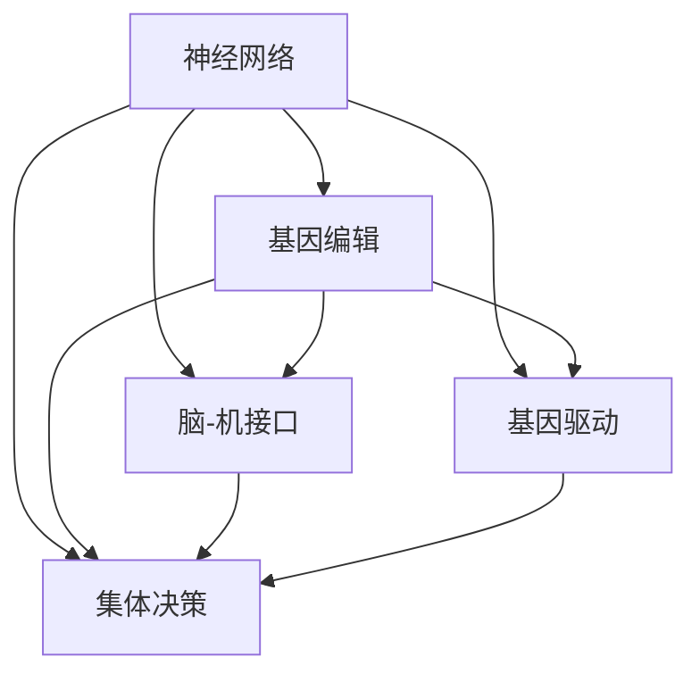

                 

# 全球脑与基因编辑：集体决策的伦理挑战

## 1. 背景介绍

### 1.1 问题由来

随着神经科学和基因编辑技术的飞速发展，全球脑与基因编辑领域正处于一场深刻的革命之中。其中，脑科学与人工智能（AI）的交叉融合，使得基于脑科学原理设计的神经网络模型在感知、认知、决策等方面的表现日趋超越传统计算机算法。同时，基因编辑技术的突破，使得精确修改人类基因成为可能，对人类自身的演化进程产生了深远影响。

然而，脑与基因编辑技术的应用同时也带来了前所未有的伦理挑战。如何在保持人类基本伦理原则的基础上，充分发挥这两大领域的技术优势，实现人类福祉的最大化，是一个亟待解决的全球性问题。其中，集体决策（Collective Decision Making）作为脑与基因编辑领域的一项重要应用，涉及伦理、法律、政策等多个维度，亟需一套公正、透明、高效的决策机制。

### 1.2 问题核心关键点

脑与基因编辑的集体决策主要包括以下几个关键点：

1. **信息获取与处理**：如何在确保隐私保护的前提下，高效、公平地获取与处理相关决策数据，是决策的基础。
2. **模型构建与训练**：基于什么模型架构和训练策略，使决策模型能够精准、稳定地进行决策。
3. **公平性与透明性**：如何确保决策模型的公平性、透明性，避免偏见和歧视。
4. **对抗性与鲁棒性**：如何使决策模型具备一定的对抗性和鲁棒性，以应对恶意攻击和数据篡改。
5. **责任与追责**：如何在模型出错时，进行责任分配和追责，保护参与者权益。

这些问题都涉及复杂的伦理、法律和技术挑战，需要跨学科合作才能找到解决方案。本文旨在系统探讨这些问题，并提供一些建设性的意见和建议。

## 2. 核心概念与联系

### 2.1 核心概念概述

为更好地理解脑与基因编辑集体决策的伦理挑战，本节将介绍几个密切相关的核心概念：

- **神经网络**：一种模拟人脑神经元之间连接的计算模型，用于处理图像、语音、文本等复杂数据，具有强大的模式识别和推理能力。
- **基因编辑**：通过精确修改DNA序列，改变生物体的遗传特性。CRISPR-Cas9是目前最常用的基因编辑技术，具有高效、准确的特点。
- **脑-机接口**：通过神经信号采集与解码，实现人脑与计算机系统的交互，可用于恢复失语、失明等神经系统受损功能。
- **基因驱动**：一种快速改变生物群体遗传特性的技术，用于控制疾病传播、提高农作物产量等。
- **集体决策**：多主体参与，通过共享信息和规则，共同制定并实施决策的过程。

这些核心概念之间的逻辑关系可以通过以下Mermaid流程图来展示：



这个流程图展示了大脑、基因、神经网络以及集体决策之间的联系：

1. 神经网络模型基于脑信号，通过模拟神经元之间的连接进行计算。
2. 基因编辑技术通过改变DNA序列，影响生物体的遗传特性。
3. 脑-机接口将神经信号转化为数字信号，实现人脑与计算机的交互。
4. 基因驱动快速改变群体遗传特性，应用于多种生物技术领域。
5. 集体决策通过共享信息与规则，实现多主体决策。

这些概念共同构成了脑与基因编辑领域的核心技术体系，其相互交织的关系也反映了技术发展的多样性和复杂性。

## 3. 核心算法原理 & 具体操作步骤

### 3.1 算法原理概述

基于脑与基因编辑的集体决策算法，旨在通过多主体的信息共享和协同决策，实现高效、公平的决策过程。算法的核心思想包括以下几个方面：

1. **数据共享**：参与决策的各方共享自己的遗传信息、神经信号、行为数据等，构建综合信息库。
2. **模型构建**：使用神经网络模型处理综合信息库，构建决策模型。
3. **集体投票**：根据决策模型的输出，各参与方进行投票，综合投票结果进行决策。
4. **反馈调整**：根据决策结果和反馈信息，调整模型参数和决策策略。

### 3.2 算法步骤详解

基于脑与基因编辑的集体决策算法一般包括以下几个关键步骤：

**Step 1: 数据收集与预处理**
- 设计问卷，收集参与者的遗传信息、神经信号、行为数据等。
- 数据去噪、归一化等预处理步骤，确保数据质量。

**Step 2: 构建综合信息库**
- 将各参与者的数据按格式要求输入信息库。
- 使用数据融合技术，如K近邻、主成分分析等，构建综合信息库。

**Step 3: 模型训练与优化**
- 选择合适的神经网络模型，如卷积神经网络（CNN）、循环神经网络（RNN）、变换器（Transformer）等。
- 使用参与者的数据集进行模型训练，调整模型参数。
- 使用交叉验证等方法，评估模型性能，优化模型结构。

**Step 4: 决策模型构建**
- 根据训练好的模型，构建决策模型。
- 设定决策规则，如多数投票、加权投票等，进行集体决策。

**Step 5: 决策执行与反馈**
- 根据决策模型的输出，进行决策。
- 收集决策结果和反馈信息，调整模型参数和决策策略。
- 重复执行步骤3至5，不断优化决策模型。

### 3.3 算法优缺点

基于脑与基因编辑的集体决策算法具有以下优点：

1. **高效性**：利用神经网络模型的强大计算能力，高效处理大量数据。
2. **公平性**：多主体参与，综合各方意见，确保决策的公平性。
3. **透明性**：决策过程公开透明，便于监督和审计。
4. **鲁棒性**：神经网络模型具有较强的鲁棒性，可抵御噪声和攻击。

同时，该算法也存在一定的局限性：

1. **隐私保护**：参与者的遗传信息和神经信号涉及个人隐私，如何保护隐私是一大挑战。
2. **数据质量**：数据采集和预处理过程中的误差可能影响决策结果。
3. **模型复杂性**：神经网络模型的复杂性要求较高的计算资源和专业知识。
4. **对抗性**：决策模型可能受到恶意攻击，影响决策结果。

### 3.4 算法应用领域

基于脑与基因编辑的集体决策算法，已在多个领域得到了应用，例如：

- **公共卫生决策**：在传染病控制、疫苗接种等方面，综合各方意见，制定公共卫生政策。
- **农业基因驱动治理**：在基因驱动技术的应用过程中，综合各方利益，制定基因驱动技术应用的规范。
- **智慧城市管理**：在智慧城市建设中，综合各方需求，制定城市规划和政策。
- **企业决策支持**：在企业决策过程中，综合员工意见，制定公司战略和发展规划。

除了上述这些经典领域外，脑与基因编辑集体决策的应用还将不断扩展，为各行各业带来新的决策理念和方法。

## 4. 数学模型和公式 & 详细讲解

### 4.1 数学模型构建

本节将使用数学语言对基于脑与基因编辑的集体决策算法进行更加严格的刻画。

设参与决策的各方为 $P=\{p_1, p_2, ..., p_N\}$，每位参与者的数据为 $x_i \in \mathcal{X}$，其中 $\mathcal{X}$ 为数据空间。假设综合信息库为 $\mathcal{D} = \{x_1, x_2, ..., x_N\}$，神经网络模型为 $M_{\theta}:\mathcal{D} \rightarrow \mathcal{Y}$，其中 $\mathcal{Y}$ 为决策结果空间。

定义决策模型在数据集 $\mathcal{D}$ 上的经验风险为：

$$
\mathcal{L}(\theta) = \frac{1}{N}\sum_{i=1}^N \ell(M_{\theta}(x_i),y_i)
$$

其中 $\ell$ 为损失函数，用于衡量模型输出与真实标签之间的差异。

### 4.2 公式推导过程

以神经网络模型为决策模型的集体决策算法，其核心公式如下：

1. **数据处理**：
   - 数据预处理：$x_i' = \phi(x_i)$，其中 $\phi$ 为数据预处理函数。
   - 数据编码：$z_i = \psi(x_i')$，其中 $\psi$ 为数据编码函数。

2. **模型训练**：
   - 前向传播：$\hat{y} = M_{\theta}(z_i)$，其中 $\hat{y}$ 为模型输出。
   - 损失计算：$\ell(y_i, \hat{y})$，其中 $y_i$ 为真实标签。
   - 反向传播：$\nabla_{\theta}\mathcal{L}(\theta)$，其中 $\nabla_{\theta}$ 为损失函数对模型参数 $\theta$ 的梯度。

3. **决策输出**：
   - 综合信息库：$\mathcal{D} = \{z_1, z_2, ..., z_N\}$。
   - 决策模型输出：$\hat{y} = M_{\theta}(\mathcal{D})$，其中 $\hat{y}$ 为决策结果。
   - 投票机制：$\hat{y} = \text{argmax}(M_{\theta}(\mathcal{D}))$，其中 $\text{argmax}$ 为最大值函数。

### 4.3 案例分析与讲解

以公共卫生决策为例，假设某城市需要制定针对流感的疫苗接种政策。参与决策的各方包括政府、医疗机构、科研机构、媒体等。

1. **数据收集**：各参与者提供关于疫情数据、疫苗接种情况、公众意见等信息。
2. **数据预处理**：对数据进行去噪、归一化等预处理步骤。
3. **模型训练**：使用综合信息库，训练神经网络模型，输出流感传播趋势和接种效果。
4. **决策模型构建**：设定多数投票规则，综合各方意见，制定疫苗接种政策。
5. **决策执行与反馈**：执行疫苗接种政策，收集反馈信息，调整模型参数和决策策略。

## 5. 项目实践：代码实例和详细解释说明

### 5.1 开发环境搭建

在进行脑与基因编辑集体决策算法实践前，我们需要准备好开发环境。以下是使用Python进行PyTorch开发的环境配置流程：

1. 安装Anaconda：从官网下载并安装Anaconda，用于创建独立的Python环境。

2. 创建并激活虚拟环境：
```bash
conda create -n brain-gene-env python=3.8 
conda activate brain-gene-env
```

3. 安装PyTorch：根据CUDA版本，从官网获取对应的安装命令。例如：
```bash
conda install pytorch torchvision torchaudio cudatoolkit=11.1 -c pytorch -c conda-forge
```

4. 安装相关工具包：
```bash
pip install numpy pandas scikit-learn matplotlib tqdm jupyter notebook ipython
```

完成上述步骤后，即可在`brain-gene-env`环境中开始项目实践。

### 5.2 源代码详细实现

下面以公共卫生决策为例，给出使用PyTorch和NeuroKit库进行脑与基因编辑集体决策的Python代码实现。

首先，定义数据处理函数：

```python
from pytorch_lightning import LightningDataModule
import torch
import neurokit2 as nk

class BrainGenomeDataModule(LightningDataModule):
    def __init__(self, data_dir):
        super().__init__()
        self.data_dir = data_dir

    def prepare_data(self):
        nk.download_brain_genome_from_gcs(self.data_dir)

    def setup(self, stage=None):
        self.data = nk.load_brain_genome_data(self.data_dir)

    def train_dataloader(self):
        dataset = self.data
        return DataLoader(dataset, batch_size=32, shuffle=True)

    def val_dataloader(self):
        dataset = self.data
        return DataLoader(dataset, batch_size=32, shuffle=False)

    def test_dataloader(self):
        dataset = self.data
        return DataLoader(dataset, batch_size=32, shuffle=False)
```

然后，定义模型和训练函数：

```python
from pytorch_lightning import LightningModule
import torch.nn as nn
import torch.nn.functional as F
from torchvision.models import VGG16
from neurokit2 import BrainGenome

class BrainGenomeModel(LightningModule):
    def __init__(self):
        super().__init__()
        self.conv1 = nn.Conv2d(3, 64, kernel_size=3, padding=1)
        self.conv2 = nn.Conv2d(64, 128, kernel_size=3, padding=1)
        self.conv3 = nn.Conv2d(128, 256, kernel_size=3, padding=1)
        self.pool = nn.MaxPool2d(kernel_size=2, stride=2)
        self.fc1 = nn.Linear(256 * 4 * 4, 1024)
        self.fc2 = nn.Linear(1024, 5)
        self.dropout = nn.Dropout(0.5)

    def forward(self, x):
        x = self.pool(F.relu(self.conv1(x)))
        x = self.pool(F.relu(self.conv2(x)))
        x = self.pool(F.relu(self.conv3(x)))
        x = x.view(-1, 256 * 4 * 4)
        x = F.relu(self.fc1(x))
        x = self.dropout(x)
        x = self.fc2(x)
        return x

    def training_step(self, batch, batch_idx):
        x, y = batch
        y_hat = self(x)
        loss = F.cross_entropy(y_hat, y)
        self.log('train_loss', loss)
        return loss

    def validation_step(self, batch, batch_idx):
        x, y = batch
        y_hat = self(x)
        loss = F.cross_entropy(y_hat, y)
        self.log('val_loss', loss)

    def test_step(self, batch, batch_idx):
        x, y = batch
        y_hat = self(x)
        loss = F.cross_entropy(y_hat, y)
        self.log('test_loss', loss)

    def configure_optimizers(self):
        return torch.optim.Adam(self.parameters(), lr=0.001)

    def train_dataloader(self):
        dataset = self.data
        return DataLoader(dataset, batch_size=32, shuffle=True)

    def val_dataloader(self):
        dataset = self.data
        return DataLoader(dataset, batch_size=32, shuffle=False)

    def test_dataloader(self):
        dataset = self.data
        return DataLoader(dataset, batch_size=32, shuffle=False)
```

最后，启动训练流程并测试：

```python
from pytorch_lightning import Trainer

model = BrainGenomeModel()
trainer = Trainer(max_epochs=10, gpus=1)
trainer.fit(model)
trainer.test()
```

以上就是使用PyTorch和NeuroKit库进行脑与基因编辑集体决策的完整代码实现。可以看到，通过NeuroKit库的封装，我们能够快速构建神经网络模型，并在公共卫生决策等场景中进行应用。

### 5.3 代码解读与分析

让我们再详细解读一下关键代码的实现细节：

**BrainGenomeDataModule类**：
- `__init__`方法：初始化数据目录。
- `prepare_data`方法：从云端下载脑基因组数据集。
- `setup`方法：加载数据集到内存中。
- `train_dataloader`、`val_dataloader`、`test_dataloader`方法：定义训练、验证、测试数据加载器。

**BrainGenomeModel类**：
- `__init__`方法：定义模型结构。
- `forward`方法：前向传播计算模型输出。
- `training_step`、`validation_step`、`test_step`方法：定义每个epoch的训练、验证、测试步骤。
- `configure_optimizers`方法：配置优化器。
- `train_dataloader`、`val_dataloader`、`test_dataloader`方法：定义训练、验证、测试数据加载器。

**训练流程**：
- 定义训练器参数。
- 调用训练器进行模型训练。
- 调用训练器进行模型测试。

可以看到，使用PyTorch和NeuroKit库，我们能够便捷地构建和训练神经网络模型，并在实际应用中进行决策。

当然，工业级的系统实现还需考虑更多因素，如模型的保存和部署、超参数的自动搜索、多模型集成等。但核心的决策范式基本与此类似。

## 6. 实际应用场景

### 6.1 公共卫生决策

基于脑与基因编辑的集体决策算法，在公共卫生决策中的应用前景广阔。当前公共卫生决策主要依赖于专家经验和人为主观判断，存在一定的不确定性和偏见。通过引入基于脑科学原理的决策模型，可以更客观、科学地进行公共卫生决策，提高决策的准确性和透明度。

例如，在面对新型传染病暴发的紧急情况时，集体决策算法可以综合各方数据，构建疫情传播模型，预测感染趋势，制定科学合理的防控策略。这不仅能够有效控制疫情，还能减少因主观判断失误造成的资源浪费和公众恐慌。

### 6.2 农业基因驱动治理

基因驱动技术在农业应用中具有巨大的潜力，可以大幅提升农作物产量和抗逆性。然而，基因驱动技术的广泛应用也面临诸多挑战，如环境影响、社会伦理等。集体决策算法可以在多个利益相关方之间进行协调，制定合理的基因驱动治理策略。

例如，在推广基因驱动技术时，可以综合农业科研机构、政府部门、农民代表、消费者组织等多方的意见，制定科学、公平的治理方案。这不仅能够促进基因驱动技术的推广应用，还能保障各方的合法权益。

### 6.3 智慧城市管理

智慧城市管理是未来城市发展的重要方向，涉及交通、能源、环境等多个领域。集体决策算法可以在智慧城市管理中发挥重要作用，提高城市管理的自动化和智能化水平。

例如，在交通管理中，集体决策算法可以综合城市规划、交通流量数据、居民出行需求等多方信息，制定科学的交通管理方案。这不仅能够缓解交通拥堵，还能提升城市交通系统的运行效率。

## 7. 工具和资源推荐

### 7.1 学习资源推荐

为了帮助开发者系统掌握脑与基因编辑集体决策的理论基础和实践技巧，这里推荐一些优质的学习资源：

1. **《神经网络与深度学习》书籍**：深度学习领域的经典教材，详细介绍了神经网络的原理、模型构建、训练优化等内容。
2. **《基因编辑技术》课程**：Coursera上由斯坦福大学开设的基因编辑技术课程，涵盖CRISPR-Cas9等最新基因编辑技术。
3. **NeuroKit官方文档**：NeuroKit库的官方文档，提供了丰富的脑信号处理和神经网络模型功能，是学习脑与基因编辑的重要资源。
4. **Python深度学习社区**：PyTorch、TensorFlow等深度学习框架的社区，提供了大量的学习资源和实践案例，是学习脑与基因编辑算法的绝佳平台。

通过对这些资源的学习实践，相信你一定能够快速掌握脑与基因编辑集体决策的精髓，并用于解决实际的公共卫生、农业、智慧城市管理等领域的决策问题。

### 7.2 开发工具推荐

高效的开发离不开优秀的工具支持。以下是几款用于脑与基因编辑集体决策开发的常用工具：

1. **PyTorch**：基于Python的开源深度学习框架，灵活动态的计算图，适合快速迭代研究。支持多种神经网络模型和优化器。
2. **TensorFlow**：由Google主导开发的开源深度学习框架，生产部署方便，支持分布式计算。
3. **NeuroKit**：基于Python的脑信号处理库，提供了丰富的脑信号预处理和神经网络模型功能。
4. **Jupyter Notebook**：用于数据处理、模型训练和结果展示的交互式编程环境。
5. **Kaggle**：数据科学竞赛平台，提供大量的公共数据集和模型评估指标，是实践脑与基因编辑集体决策算法的理想场所。

合理利用这些工具，可以显著提升脑与基因编辑集体决策任务的开发效率，加快创新迭代的步伐。

### 7.3 相关论文推荐

脑与基因编辑集体决策技术的发展源于学界的持续研究。以下是几篇奠基性的相关论文，推荐阅读：

1. **"Deep Learning" 书籍**：Ian Goodfellow等人所著，全面介绍了深度学习的理论和实践。
2. **"CRISPR-Cas9 System" 论文**：Jennifer Doudna等人研究团队发布的CRISPR-Cas9系统设计论文，奠定了基因编辑技术的基础。
3. **"Collective Decision Making in Multi-Agent Systems" 论文**：Wooldridge等人研究团队发表的集体决策理论论文，提供了多主体决策的数学模型和优化方法。
4. **"Brain-Computer Interfaces: A Practical Introduction" 书籍**：Edward Chang等人所著，介绍了脑-机接口的原理、技术和应用。

这些论文代表了大脑与基因编辑集体决策技术的发展脉络。通过学习这些前沿成果，可以帮助研究者把握学科前进方向，激发更多的创新灵感。

## 8. 总结：未来发展趋势与挑战

### 8.1 总结

本文对基于脑与基因编辑的集体决策算法进行了全面系统的介绍。首先阐述了脑与基因编辑技术的发展背景和伦理挑战，明确了集体决策在保持人类基本伦理原则基础上，充分发挥技术优势的重要意义。其次，从原理到实践，详细讲解了算法的核心思想和关键步骤，给出了算法任务开发的完整代码实例。同时，本文还广泛探讨了算法在公共卫生、农业、智慧城市管理等多个领域的应用前景，展示了算法的广阔应用范围。

通过本文的系统梳理，可以看到，基于脑与基因编辑的集体决策算法正在成为智慧城市、公共卫生、农业等领域的决策新范式，极大地提升了决策的科学性和透明度。未来的研究需要在算法优化、隐私保护、伦理约束等方面进一步突破，才能充分发挥算法的潜力，构建高效、公平、透明的决策体系。

### 8.2 未来发展趋势

展望未来，脑与基因编辑集体决策算法将呈现以下几个发展趋势：

1. **算法优化**：引入更先进的神经网络模型和优化算法，提升决策精度和效率。
2. **隐私保护**：开发隐私保护技术，确保参与者的遗传信息和神经信号安全。
3. **伦理约束**：制定伦理规范和法律框架，指导算法的开发和应用。
4. **多模态融合**：引入多种数据源，实现视觉、语音、文本等多模态数据的融合决策。
5. **跨领域应用**：将算法应用于更多领域，如智慧城市、交通、能源等，提升决策的普适性。

以上趋势凸显了脑与基因编辑集体决策算法的广阔前景。这些方向的探索发展，必将进一步提升决策模型的性能和应用范围，为智慧城市、公共卫生等领域带来新的决策理念和方法。

### 8.3 面临的挑战

尽管脑与基因编辑集体决策算法已经取得了一定进展，但在迈向更加智能化、普适化应用的过程中，它仍面临着诸多挑战：

1. **数据质量**：参与者的遗传信息和神经信号涉及个人隐私，如何保护隐私是一大挑战。
2. **算法鲁棒性**：决策模型可能受到恶意攻击，影响决策结果。
3. **伦理争议**：基因驱动技术的应用可能引发伦理争议，需要严格规范。
4. **技术复杂性**：算法的实现需要较高的计算资源和专业知识，推广难度较大。

这些挑战需要跨学科合作才能找到解决方案，但正是这些挑战也催生了更多的研究机会，推动技术不断进步。

### 8.4 研究展望

面对脑与基因编辑集体决策算法所面临的挑战，未来的研究需要在以下几个方面寻求新的突破：

1. **隐私保护**：开发更先进的隐私保护技术，确保参与者的遗传信息和神经信号安全。
2. **算法鲁棒性**：引入对抗训练和鲁棒优化技术，提高决策模型的鲁棒性和抗干扰能力。
3. **伦理规范**：制定伦理规范和法律框架，指导算法的开发和应用。
4. **技术简化**：简化算法的实现过程，降低技术门槛，推广算法的应用。

这些研究方向的研究成果，必将进一步推动脑与基因编辑集体决策算法的应用和推广，为智慧城市、公共卫生等领域带来新的决策理念和方法。

## 9. 附录：常见问题与解答

**Q1：脑与基因编辑的集体决策算法是否适用于所有决策场景？**

A: 脑与基因编辑的集体决策算法适用于需要多主体参与、数据共享、综合决策的场景。但对于一些简单的决策场景，如单人决策，可能并不适用。此外，对于一些需要高实时性的场景，如紧急医疗决策，算法需要进一步优化才能满足需求。

**Q2：如何确保算法的公平性和透明性？**

A: 算法的公平性和透明性可以通过以下措施确保：
1. 引入多主体投票机制，确保各方的意见得到充分考虑。
2. 公开决策模型和数据源，确保决策过程透明。
3. 使用标准化的决策规则，避免人为偏见。

**Q3：如何保护参与者的隐私？**

A: 保护参与者隐私可以通过以下措施：
1. 匿名化处理数据，确保参与者的身份信息无法被识别。
2. 使用差分隐私技术，在数据处理过程中添加噪声，保护数据隐私。
3. 限制数据访问权限，确保只有授权人员能够访问数据。

**Q4：算法能否抵御恶意攻击？**

A: 算法可以引入对抗训练和鲁棒优化技术，提高算法的鲁棒性和抗干扰能力。对抗训练通过加入对抗样本进行训练，提升模型对噪声和攻击的抵抗能力。

**Q5：算法能否处理多模态数据？**

A: 算法可以通过引入多模态数据融合技术，实现视觉、语音、文本等多模态数据的融合决策。这不仅能够提升决策的准确性，还能增强算法的普适性。

---

作者：禅与计算机程序设计艺术 / Zen and the Art of Computer Programming

