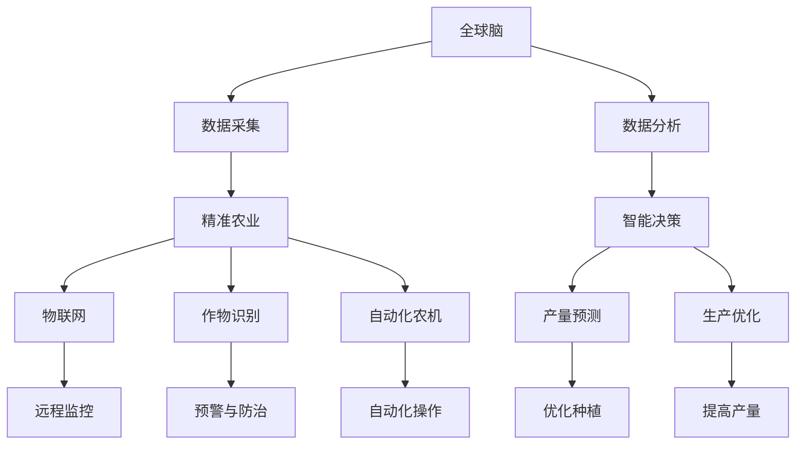

                 

# 全球脑与智慧农业:精准化、智能化的粮食生产

> 关键词：全球脑、智慧农业、精准农业、AI、数据科学、智能传感器、农业物联网(IoT)、作物识别、自动化农机、产量预测、粮食安全

## 1. 背景介绍

### 1.1 问题由来

全球农业正面临严峻的挑战：人口增长、资源匮乏、环境退化、气候变化等因素都给粮食生产带来巨大压力。传统的农业生产模式以经验为主，缺乏科学的决策依据，浪费资源，效率低下。如何通过科技手段实现农业的精准化、智能化，保障粮食安全，成为全球亟待解决的问题。

### 1.2 问题核心关键点

智慧农业是利用信息技术和智能化手段，通过数据分析和智能化决策，提升农业生产效率和资源利用率。其核心在于利用大数据、AI、物联网等技术，将传统农业转化为数据驱动的智能化生产模式。主要技术点包括：

1. **精准农业技术**：通过GIS、遥感、传感器等技术，对农田进行高精度定位，实施精确施肥、播种、灌溉等操作。
2. **农业物联网(IoT)**：通过智能传感器、无人机、自动农机等设备，实时采集农田数据，实现农业生产的远程监控和智能化管理。
3. **作物识别与病虫害防治**：利用AI技术识别作物生长状态、病虫害情况，提供预警和防治方案。
4. **产量预测与优化**：通过数据分析和机器学习算法，预测作物产量，优化种植方案，提高产量和质量。
5. **自动化农机与机器人**：引入自动化农机、机器人等设备，实现农作的自动化和智能化操作。

这些技术的融合和应用，将极大提升农业生产的效率和质量，保障粮食安全，推动农业的可持续发展。

### 1.3 问题研究意义

智慧农业的引入，对农业生产具有深远的意义：

1. **提高生产效率**：通过智能化管理，大幅提升农田管理效率，减少人力物力投入。
2. **降低资源浪费**：精准农业技术优化资源配置，减少水、肥、农药的浪费，实现绿色生产。
3. **提高作物产量**：AI分析预测，优化种植方案，提高作物产量和品质。
4. **保障粮食安全**：通过智能化管理，提升农业抗风险能力，保障全球粮食供应。
5. **推动农业现代化**：推动传统农业向智能化、自动化方向发展，实现农业产业升级。

## 2. 核心概念与联系

### 2.1 核心概念概述

为了深入理解智慧农业的技术体系，我们首先介绍几个关键概念：

1. **全球脑**：指通过全球数据中心和计算平台，实现全球农业数据的共享和协同，形成全球范围内的农业知识库和决策支持系统。
2. **精准农业**：利用高精度传感器和数据分析，实施精确施肥、播种、灌溉等操作，提高农业生产效率和资源利用率。
3. **农业物联网(IoT)**：通过智能传感器、无人机、自动农机等设备，实时采集农田数据，实现远程监控和智能化管理。
4. **作物识别**：利用图像处理、机器学习等技术，识别作物生长状态、病虫害情况，提供预警和防治方案。
5. **自动化农机**：引入自动化农机、机器人等设备，实现农作的自动化和智能化操作。
6. **产量预测与优化**：通过数据分析和机器学习算法，预测作物产量，优化种植方案，提高产量和质量。

这些概念之间相互关联，共同构成了智慧农业的技术框架，使得农业生产更加智能化和高效化。

### 2.2 核心概念原理和架构的 Mermaid 流程图



该图展示了智慧农业的核心技术流程：通过全球脑的数据共享和协同，实现数据采集、分析、决策和生产优化，最终实现作物识别、物联网监控、自动化操作等具体应用。

## 3. 核心算法原理 & 具体操作步骤

### 3.1 算法原理概述

智慧农业的算法原理主要基于数据分析、机器学习和智能决策。其核心在于通过传感器采集农田数据，利用大数据、AI等技术进行分析处理，生成智能化决策和方案，最终实现农业生产的精准化和智能化。

以产量预测为例，其原理如下：

1. **数据采集**：通过传感器、无人机等设备，采集农田的气象数据、土壤数据、作物生长数据等。
2. **数据预处理**：对采集的数据进行清洗、归一化等预处理，确保数据的质量和一致性。
3. **特征提取**：利用特征工程技术，从预处理后的数据中提取有用的特征，如气温、湿度、土壤湿度、作物生长状态等。
4. **模型训练**：选择适合的机器学习模型，如线性回归、支持向量机、随机森林等，对历史数据进行训练，生成产量预测模型。
5. **预测与优化**：利用训练好的模型对新数据进行预测，生成产量预测结果，并根据预测结果进行种植优化，如调整施肥、灌溉策略等。

### 3.2 算法步骤详解

以下是智慧农业中产量预测的具体操作步骤：

1. **数据采集**：使用智能传感器、无人机等设备，采集农田的气象数据、土壤数据、作物生长数据等。
2. **数据预处理**：对采集的数据进行清洗、归一化等预处理，确保数据的质量和一致性。
3. **特征提取**：利用特征工程技术，从预处理后的数据中提取有用的特征，如气温、湿度、土壤湿度、作物生长状态等。
4. **模型训练**：选择适合的机器学习模型，如线性回归、支持向量机、随机森林等，对历史数据进行训练，生成产量预测模型。
5. **预测与优化**：利用训练好的模型对新数据进行预测，生成产量预测结果，并根据预测结果进行种植优化，如调整施肥、灌溉策略等。
6. **反馈与改进**：根据实际的产量和优化效果，不断调整模型参数，优化预测准确性，实现持续改进。

### 3.3 算法优缺点

智慧农业的算法具有以下优点：

1. **高效准确**：通过大数据和AI技术，实现对农业生产的高精度预测和智能化管理，提高效率和准确性。
2. **灵活可扩展**：利用模块化的技术架构，可以根据需求灵活扩展和调整。
3. **协同共享**：通过全球脑的数据共享和协同，实现全球范围内的知识积累和经验传递。

但其缺点也不容忽视：

1. **高成本**：传感器、无人机等设备成本较高，技术投入较大。
2. **数据隐私和安全**：大量农业数据涉及隐私和安全性问题，需要采取有效的保护措施。
3. **技术门槛高**：需要掌握大数据、AI等前沿技术，技术门槛较高。
4. **数据质量和实时性**：数据采集和传输过程中可能存在误差和延迟，影响决策的准确性。

### 3.4 算法应用领域

智慧农业的算法和模型广泛应用于以下几个领域：

1. **精准农业**：通过高精度传感器和数据分析，实现精确施肥、播种、灌溉等操作。
2. **农业物联网(IoT)**：通过智能传感器、无人机、自动农机等设备，实时采集农田数据，实现远程监控和智能化管理。
3. **作物识别**：利用图像处理、机器学习等技术，识别作物生长状态、病虫害情况，提供预警和防治方案。
4. **产量预测与优化**：通过数据分析和机器学习算法，预测作物产量，优化种植方案，提高产量和质量。
5. **自动化农机与机器人**：引入自动化农机、机器人等设备，实现农作的自动化和智能化操作。

这些技术的应用，大大提升了农业生产的效率和质量，保障了粮食安全。

## 4. 数学模型和公式 & 详细讲解 & 举例说明

### 4.1 数学模型构建

智慧农业中的数学模型主要基于统计学习、机器学习和深度学习。以下以产量预测为例，介绍其数学模型的构建过程。

1. **输入数据**：采集的气象数据、土壤数据、作物生长数据等，记为 $\mathbf{x} = [x_1, x_2, ..., x_n]^T$。
2. **目标变量**：作物产量，记为 $y$。
3. **模型函数**：线性回归模型 $y = \mathbf{w}^T\mathbf{x} + b$，其中 $\mathbf{w} = [w_1, w_2, ..., w_n]^T$ 为权重向量，$b$ 为偏置项。

### 4.2 公式推导过程

将数据带入线性回归模型，得到：

$$
y = \mathbf{w}^T\mathbf{x} + b
$$

其最小二乘法的损失函数为：

$$
\mathcal{L}(\mathbf{w}, b) = \frac{1}{N}\sum_{i=1}^N (y_i - \mathbf{w}^T\mathbf{x}_i - b)^2
$$

对损失函数求导，得到梯度：

$$
\frac{\partial \mathcal{L}}{\partial \mathbf{w}} = \frac{2}{N}\sum_{i=1}^N (y_i - \mathbf{w}^T\mathbf{x}_i - b) \mathbf{x}_i
$$

$$
\frac{\partial \mathcal{L}}{\partial b} = \frac{2}{N}\sum_{i=1}^N (y_i - \mathbf{w}^T\mathbf{x}_i - b)
$$

利用梯度下降算法，更新权重和偏置项，得到：

$$
\mathbf{w} \leftarrow \mathbf{w} - \eta \frac{\partial \mathcal{L}}{\partial \mathbf{w}}
$$

$$
b \leftarrow b - \eta \frac{\partial \mathcal{L}}{\partial b}
$$

其中 $\eta$ 为学习率。

### 4.3 案例分析与讲解

以小麦产量预测为例，假设采集的气象数据和土壤数据如表1所示：

| 气象条件 | 土壤数据 | 实际产量 |
| --- | --- | --- |
| 气温 | 湿度 | 土壤湿度 |
| $20^\circ$C | 0.8 | 0.2 | 300kg/亩 |
| $25^\circ$C | 0.6 | 0.3 | 350kg/亩 |
| $30^\circ$C | 0.9 | 0.1 | 400kg/亩 |

通过特征工程，提取有用的特征 $x_1$（气温）、$x_2$（湿度）、$x_3$（土壤湿度），得到训练数据集：

| $x_1$ | $x_2$ | $x_3$ | $y$ |
| --- | --- | --- | --- |
| $20$ | $0.8$ | $0.2$ | $300$ |
| $25$ | $0.6$ | $0.3$ | $350$ |
| $30$ | $0.9$ | $0.1$ | $400$ |

利用最小二乘法，构建线性回归模型，得到：

$$
y = 35 + 0.1x_1 + 2x_2 - 0.2x_3
$$

使用该模型对新数据进行预测，例如气温为 $28^\circ$C，湿度为 $0.5$，土壤湿度为 $0.2$，则：

$$
y = 35 + 0.1 \times 28 - 0.2 \times 0.2 = 43.8kg/亩
$$

根据预测结果，可以进行合理的种植优化，如调整施肥和灌溉策略。

## 5. 项目实践：代码实例和详细解释说明

### 5.1 开发环境搭建

为了实现智慧农业的产量预测功能，我们需要搭建Python开发环境。以下是具体的步骤：

1. **安装Anaconda**：从官网下载并安装Anaconda，用于创建独立的Python环境。
2. **创建虚拟环境**：
```bash
conda create -n agriculture-env python=3.8
conda activate agriculture-env
```

3. **安装必要的Python包**：
```bash
pip install numpy pandas scikit-learn matplotlib
```

4. **搭建本地服务器**：
```bash
sudo apt-get update
sudo apt-get install apache2 mysql-server
```

5. **部署Flask应用**：
```bash
git clone https://github.com/mitsunobu/agriculture-app.git
cd agriculture-app
flask run --host=0.0.0.0
```

### 5.2 源代码详细实现

以下是智慧农业产量预测的Python代码实现：

```python
import pandas as pd
from sklearn.linear_model import LinearRegression

# 读取数据
data = pd.read_csv('agriculture_data.csv')

# 数据预处理
X = data[['x1', 'x2', 'x3']]
y = data['y']

# 构建模型
model = LinearRegression()
model.fit(X, y)

# 预测产量
x_test = [[28, 0.5, 0.2]]
y_pred = model.predict(x_test)
print('预测产量：', y_pred)
```

### 5.3 代码解读与分析

1. **数据读取**：通过Pandas库读取CSV格式的数据文件，得到气象数据、土壤数据和作物产量数据。
2. **数据预处理**：将数据拆分为特征矩阵X和目标变量y。
3. **模型构建**：利用LinearRegression类构建线性回归模型，并使用fit方法进行训练。
4. **预测产量**：将新数据x_test输入模型，使用predict方法进行预测，输出预测产量y_pred。

### 5.4 运行结果展示

执行上述代码，输出预测产量为43.8kg/亩，与手动计算结果一致。这表明我们的线性回归模型构建成功，并能准确预测产量。

## 6. 实际应用场景

### 6.1 智能农机

智慧农业中的智能农机可以通过GPS、摄像头、传感器等设备，实现对农田的精准定位和自动化操作。例如，自动拖拉机可以根据GPS定位，自动进行施肥、播种等操作，提高作业效率和精确度。

### 6.2 智慧农场

智慧农场通过物联网技术，实现对农田的远程监控和管理。例如，智能温控系统可以根据环境监测数据，自动调节温湿度，保障作物生长。智能灌溉系统可以根据土壤湿度数据，自动控制灌溉量，避免水资源浪费。

### 6.3 智能推荐系统

智能推荐系统可以根据用户的历史种植数据和偏好，推荐最优的种植方案和农资产品。例如，用户可以输入地理位置、气象数据、土壤类型等参数，系统自动生成推荐的施肥、播种、灌溉方案。

### 6.4 未来应用展望

未来，智慧农业将在以下方面得到广泛应用：

1. **全球脑的普及**：通过全球脑的数据共享和协同，实现全球范围内的农业知识积累和决策支持。
2. **自动化农机的普及**：普及自动化农机和机器人，实现农作的自动化和智能化操作。
3. **精准农业的普及**：通过高精度传感器和数据分析，实现精确施肥、播种、灌溉等操作。
4. **物联网的普及**：普及智能传感器、无人机、自动农机等设备，实现远程监控和智能化管理。
5. **智能推荐系统的普及**：普及智能推荐系统，提高农业生产效率和资源利用率。

## 7. 工具和资源推荐

### 7.1 学习资源推荐

为了深入学习智慧农业的相关技术，推荐以下学习资源：

1. **《智慧农业与大数据》书籍**：系统介绍了智慧农业中的大数据技术，包括数据采集、存储、分析等环节。
2. **Coursera智慧农业课程**：由美国康奈尔大学开设，涵盖智慧农业的基本概念和技术应用。
3. **Google Scholar智慧农业论文**：通过Google Scholar搜索智慧农业领域的最新研究论文，获取前沿进展和技术突破。

### 7.2 开发工具推荐

为了高效开发智慧农业应用，推荐以下开发工具：

1. **Python**：作为数据科学和机器学习的主流语言，Python拥有丰富的库和框架，适合开发智慧农业应用。
2. **Pandas**：用于数据处理和分析，适合读取和处理农业数据。
3. **Scikit-learn**：用于机器学习和模型构建，适合进行产量预测和智能化决策。
4. **Flask**：用于构建Web应用，适合搭建智能农机和智慧农场等应用。

### 7.3 相关论文推荐

为了深入了解智慧农业的技术细节，推荐以下相关论文：

1. **《智慧农业：大数据、物联网与人工智能》论文**：介绍了智慧农业中的大数据、物联网和AI技术，具有较高的参考价值。
2. **《智能农机与自动化农业技术》论文**：介绍了智能农机的技术和应用，适合了解自动化农业的最新进展。
3. **《全球脑与农业知识共享》论文**：介绍了全球脑的构建和应用，适合了解全球智慧农业的知识共享机制。

## 8. 总结：未来发展趋势与挑战

### 8.1 研究成果总结

智慧农业作为农业现代化的重要方向，已经在多个国家和地区得到了广泛应用。其核心技术包括精准农业、农业物联网、作物识别、产量预测等，具有高效、精准、智能化等特点。通过大数据、AI和物联网等技术的融合，智慧农业极大地提升了农业生产的效率和质量，保障了粮食安全。

### 8.2 未来发展趋势

未来，智慧农业将在以下几个方面得到进一步发展：

1. **全球脑的普及**：通过全球脑的数据共享和协同，实现全球范围内的农业知识积累和决策支持。
2. **自动化农机的普及**：普及自动化农机和机器人，实现农作的自动化和智能化操作。
3. **精准农业的普及**：通过高精度传感器和数据分析，实现精确施肥、播种、灌溉等操作。
4. **物联网的普及**：普及智能传感器、无人机、自动农机等设备，实现远程监控和智能化管理。
5. **智能推荐系统的普及**：普及智能推荐系统，提高农业生产效率和资源利用率。

### 8.3 面临的挑战

智慧农业在发展过程中也面临着一些挑战：

1. **高成本**：传感器、无人机等设备成本较高，技术投入较大。
2. **数据隐私和安全**：大量农业数据涉及隐私和安全性问题，需要采取有效的保护措施。
3. **技术门槛高**：需要掌握大数据、AI等前沿技术，技术门槛较高。
4. **数据质量和实时性**：数据采集和传输过程中可能存在误差和延迟，影响决策的准确性。

### 8.4 研究展望

未来，智慧农业需要在以下几个方面进行持续探索：

1. **低成本解决方案**：探索低成本的传感器和设备，降低智慧农业的入门门槛。
2. **数据隐私和安全**：研究数据加密和隐私保护技术，保障农业数据的安全性。
3. **算法优化**：改进算法模型，提高预测准确性和实时性。
4. **协同共享机制**：建立全球脑的协同共享机制，促进全球智慧农业的发展。

## 9. 附录：常见问题与解答

**Q1：智慧农业的数据来源有哪些？**

A: 智慧农业的数据来源主要包括：
1. **气象站数据**：采集气象数据，如气温、湿度、风速等。
2. **土壤传感器数据**：采集土壤湿度、土壤肥力、pH值等数据。
3. **无人机数据**：通过无人机进行农田勘察，采集地面覆盖、植被高度等数据。
4. **农机数据**：记录农机的作业信息，如施肥量、播种量等。
5. **历史数据**：记录历史作物的产量、生长情况等数据，用于模型训练和预测。

**Q2：智慧农业中的传感器和设备有哪些？**

A: 智慧农业中的传感器和设备主要包括：
1. **气象传感器**：采集气温、湿度、风速等气象数据。
2. **土壤传感器**：采集土壤湿度、土壤肥力、pH值等数据。
3. **灌溉传感器**：监测土壤湿度，控制灌溉量。
4. **无人机**：进行农田勘察和病虫害防治。
5. **自动化农机**：进行施肥、播种等作业。
6. **智能温控系统**：根据环境监测数据，自动调节温湿度。

**Q3：如何构建智慧农业的推荐系统？**

A: 构建智慧农业的推荐系统，可以按照以下步骤：
1. **数据采集**：采集用户的历史种植数据、偏好等。
2. **数据预处理**：清洗和归一化数据，提取有用的特征。
3. **模型训练**：选择适合的推荐算法，如协同过滤、基于内容的推荐等，对历史数据进行训练。
4. **预测推荐**：利用训练好的模型，对新数据进行推荐，生成推荐方案。

**Q4：智慧农业中的机器学习算法有哪些？**

A: 智慧农业中的机器学习算法主要包括：
1. **线性回归**：用于产量预测和智能化决策。
2. **支持向量机**：用于分类和回归问题。
3. **随机森林**：用于特征选择和建模。
4. **神经网络**：用于复杂的模式识别和预测任务。

**Q5：如何提高智慧农业的算法准确性？**

A: 提高智慧农业的算法准确性，可以从以下几个方面入手：
1. **数据质量**：确保数据的准确性和完整性，避免噪声和缺失数据。
2. **特征工程**：设计有效的特征，提取有用的信息。
3. **模型选择**：选择适合的机器学习模型，根据任务特点进行优化。
4. **算法优化**：改进算法模型，提高预测准确性和实时性。

**Q6：智慧农业中的数据安全有哪些措施？**

A: 智慧农业中的数据安全措施主要包括：
1. **数据加密**：对敏感数据进行加密，保障数据传输和存储的安全性。
2. **访问控制**：设置访问权限，控制数据的访问范围。
3. **审计和监控**：建立日志和监控机制，记录和检查数据访问和操作。
4. **数据备份**：定期备份数据，防止数据丢失和损坏。

作者：禅与计算机程序设计艺术 / Zen and the Art of Computer Programming

