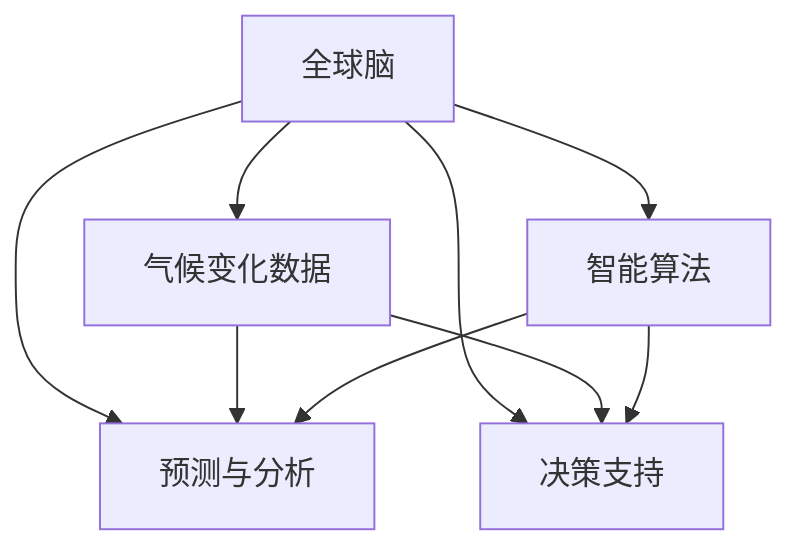

                 

# 全球脑与气候变化:集体行动新可能

## 1. 背景介绍

### 1.1 问题由来
面对日益严峻的气候变化问题，全球范围内亟需采取新策略，以确保未来的可持续发展。近年来，各国政府、国际组织和民间团体逐步认识到，除了传统的环境保护措施，还需引入更多创新手段，如数字技术和人工智能。这些技术不仅能大幅提升监测和分析能力，还能在决策支持、资源配置等方面提供新思路。在此背景下，"全球脑"（Global Brain）和"气候变化"（Climate Change）成为两大重要主题，并引发了广泛的跨学科研究与探讨。

### 1.2 问题核心关键点
本文聚焦于利用全球脑框架下的人工智能技术，探索应对气候变化的新途径。通过集成地理空间信息、气象数据、人类行为模型等，构建全球尺度的虚拟"大脑"，实现对气候变化的深度分析和预测，进而提出科学的、基于数据的集体行动方案。

### 1.3 问题研究意义
深入研究全球脑在气候变化应对中的应用，对于提升全球气候治理水平、推动绿色可持续发展、实现人类社会与自然环境和谐共生具有重要意义：

1. **提升监测与分析能力**：全球脑融合海量数据资源，通过智能算法进行实时分析和预测，大幅提高气候变化的监测和分析效率。
2. **优化资源配置与决策支持**：基于全球脑的预测结果，可以更科学地进行资源配置，制定应对策略，降低气候变化对经济和社会的负面影响。
3. **促进国际合作**：全球脑提供了全球尺度的数据共享平台，有助于各国和组织进行高效沟通和协作，共同应对全球性挑战。
4. **推动技术创新与产业升级**：通过研究全球脑技术在气候变化应对中的应用，带动相关产业的发展，如智慧城市、绿色能源等。

## 2. 核心概念与联系

### 2.1 核心概念概述

本节将介绍与全球脑和气候变化相关的几个关键概念：

- **全球脑（Global Brain）**：通过大规模计算技术和大数据资源，模拟人类大脑处理信息的方式，构建智能化的全球信息处理平台，以实现对复杂问题的深度分析和决策支持。
- **气候变化（Climate Change）**：由于温室气体排放增加、森林砍伐、工业化进程加快等因素，导致全球气温升高、极端天气频发等现象，对人类社会和自然环境产生深远影响。
- **智能算法与机器学习（Intelligent Algorithm & Machine Learning）**：通过训练模型识别数据中的模式和规律，从而实现对气候变化的预测和应对。
- **地理信息系统（GIS）**：利用地理空间信息和数据，支持地理信息的分析、处理和展示。
- **物联网（IoT）**：通过传感器、网络等技术，实现设备和环境信息的实时监控和交互。

这些概念通过全球脑框架得以整合，形成了强大的综合分析与预测能力。

### 2.2 核心概念原理和架构的 Mermaid 流程图



这个流程图展示了全球脑各组件之间的联系：

- 气候变化数据通过智能算法进行分析和预测。
- 地理信息系统和物联网提供实时的环境监测数据，支持全球脑进行综合分析。
- 预测与分析结果可以用于决策支持，指导资源配置和应对措施。

## 3. 核心算法原理 & 具体操作步骤
### 3.1 算法原理概述

全球脑在气候变化应对中的核心算法主要包括以下几个方面：

1. **数据融合与预处理**：将各类数据（如气象数据、地理信息数据等）进行融合和预处理，以获得高质量、标准化的输入数据。
2. **智能算法设计**：利用机器学习、深度学习等智能算法，构建多层次、多维度的预测模型。
3. **特征提取与模型训练**：从数据中提取关键特征，并使用训练集对模型进行训练，以获得更精确的预测结果。
4. **模型集成与优化**：集成多个模型，优化预测精度，并处理异常情况，如极端气候事件。
5. **结果验证与调整**：通过实际数据进行结果验证，根据反馈调整模型参数和策略。

### 3.2 算法步骤详解

以下详细介绍全球脑应对气候变化的详细步骤：

**Step 1: 数据收集与预处理**
- 收集气象数据、地理信息数据、人类行为数据等，通过标准化处理、数据清洗等手段进行预处理，保证数据的质量和一致性。

**Step 2: 数据融合与特征提取**
- 使用地理信息系统对数据进行空间定位和属性标注，获取地理特征信息。
- 将不同来源的数据进行融合，构建统一的时空数据结构。
- 提取关键的气象特征、地理特征和人类行为特征，如气温、降水量、植被指数等。

**Step 3: 智能算法训练**
- 根据数据特性选择合适的智能算法，如深度学习中的卷积神经网络（CNN）、循环神经网络（RNN）、长短期记忆网络（LSTM）等。
- 设计训练集和测试集，使用历史数据训练模型。
- 调整模型超参数，优化模型结构，确保预测准确性和泛化能力。

**Step 4: 模型集成与优化**
- 集成多个训练好的模型，如集成学习（Ensemble Learning），提升预测的稳定性和鲁棒性。
- 通过交叉验证等手段评估模型性能，优化模型参数和结构。
- 处理异常情况，如极端气候事件，通过额外模型或异常检测算法提高模型鲁棒性。

**Step 5: 结果验证与调整**
- 使用实际数据对模型进行验证，评估预测结果的准确性和可靠性。
- 根据验证结果调整模型参数和算法策略，优化预测精度。
- 不断迭代训练和验证过程，确保模型持续改进。

### 3.3 算法优缺点

全球脑在应对气候变化时具有以下优势：

1. **处理复杂数据能力**：全球脑能够处理大规模、多源、多维度的数据，提供全面、准确的气候预测和分析。
2. **决策支持能力**：通过实时数据分析和预测，为决策者提供科学的、基于数据的决策支持。
3. **资源配置优化**：基于预测结果进行资源配置优化，提升应对气候变化的效率和效果。

同时，也存在以下挑战：

1. **数据收集难度**：气候变化数据来源广泛，涉及不同领域和部门，数据收集和整合难度较大。
2. **模型复杂性**：构建复杂多维度的预测模型需要大量的计算资源和专业知识。
3. **算法鲁棒性**：预测模型可能受限于历史数据分布，对新出现的极端气候事件预测能力有限。
4. **模型可解释性**：复杂模型难以解释其决策过程，影响政策制定和公众信任。

### 3.4 算法应用领域

全球脑在应对气候变化中的应用领域广泛，包括但不限于以下几个方面：

1. **气候变化预测**：利用全球脑进行气候变化趋势预测，如气温上升、极端天气频发等。
2. **灾害预警与应对**：基于实时监测数据，提前预警自然灾害，如洪水、干旱、飓风等，制定有效的应对措施。
3. **资源配置优化**：分析气候变化对农业、水资源、能源等的影响，优化资源配置，减少负面影响。
4. **政策制定与评估**：利用全球脑进行政策模拟和效果评估，制定科学合理的气候变化应对政策。
5. **公众教育与参与**：通过可视化工具展示气候变化分析结果，提升公众对气候变化的认知和参与度。

## 4. 数学模型和公式 & 详细讲解 & 举例说明

### 4.1 数学模型构建

本文将以气候变化预测为例，介绍全球脑中使用的数学模型构建方法。

假设我们有一组气象数据 $(x_1, x_2, ..., x_n)$，其中 $x_i$ 表示第 $i$ 个时间点的气温、降水量等指标。我们需要构建一个预测模型 $f$，用于预测未来的气温变化。

数学模型构建步骤如下：

1. **数据准备**：将气象数据标准化处理，将其转化为标准正态分布。
2. **特征提取**：从数据中提取关键特征，如均值、方差、自相关等。
3. **模型训练**：使用历史数据训练预测模型，如线性回归、支持向量机（SVM）、深度神经网络等。
4. **模型评估**：使用测试集评估预测模型的准确性和鲁棒性。

### 4.2 公式推导过程

**线性回归模型**：

假设气象数据 $x_i$ 与未来气温 $y_i$ 之间存在线性关系，则可以使用线性回归模型进行预测：

$$
y_i = \alpha + \beta x_i + \epsilon_i
$$

其中 $\alpha$ 和 $\beta$ 为模型参数，$\epsilon_i$ 为随机误差项。通过最小二乘法求解参数 $\alpha$ 和 $\beta$：

$$
\alpha, \beta = \mathop{\arg\min}_{\alpha, \beta} \sum_{i=1}^N (y_i - (\alpha + \beta x_i))^2
$$

**深度神经网络模型**：

假设气象数据 $x_i$ 与未来气温 $y_i$ 之间存在非线性关系，可以使用深度神经网络模型进行预测。例如，使用具有 $L$ 层隐藏层的全连接神经网络：

$$
f(x_i) = \sigma(L(x_i; W^{[L]}, b^{[L]}))
$$

其中 $x_i$ 为输入数据，$W^{[L]}$ 和 $b^{[L]}$ 为第 $L$ 层的权重和偏置，$\sigma$ 为激活函数。模型参数为 $W^{[l]}$ 和 $b^{[l]}$，$l = 1, ..., L$。

通过反向传播算法，计算梯度并更新参数：

$$
\frac{\partial L}{\partial W^{[l]}} = \frac{\partial L}{\partial f(x_i)} \frac{\partial f(x_i)}{\partial W^{[l]}}
$$

### 4.3 案例分析与讲解

以预测某个地区未来十年的气温变化为例，以下是具体实现步骤：

**Step 1: 数据收集**
- 收集该地区过去十年的气象数据，包括气温、降水量、大气压力等。

**Step 2: 数据预处理**
- 对气象数据进行标准化处理，将其转化为标准正态分布。
- 使用时间序列分析方法，提取数据的季节性、趋势性特征。

**Step 3: 模型选择与训练**
- 选择适当的预测模型，如线性回归、深度神经网络等。
- 使用历史数据训练模型，调整模型参数，确保预测准确性和泛化能力。

**Step 4: 模型评估与优化**
- 使用测试集评估模型性能，计算均方误差等指标。
- 根据评估结果调整模型参数，优化预测精度。

## 5. 项目实践：代码实例和详细解释说明

### 5.1 开发环境搭建

以下是在Python环境下搭建全球脑项目开发环境的具体步骤：

1. **安装Python**：确保系统安装有最新版本Python，建议安装在虚拟环境中。
2. **安装依赖包**：安装必要的依赖包，如NumPy、Pandas、Scikit-learn等。
3. **配置开发工具**：安装Python开发工具，如Jupyter Notebook、PyCharm等。

**Step 1: 数据收集**

假设我们有一个包含气象数据的CSV文件，其中每行表示一个时间点的气象数据：

| 时间 | 气温（°C） | 降水量（mm） | 大气压力（hPa） |
| --- | --- | --- | --- |

```python
import pandas as pd

# 读取气象数据
data = pd.read_csv('weather_data.csv')
```

**Step 2: 数据预处理**

使用Pandas进行数据预处理，如标准化、时间序列分析等。

```python
import numpy as np
from sklearn.preprocessing import StandardScaler

# 标准化处理
scaler = StandardScaler()
scaled_data = scaler.fit_transform(data[['气温', '降水量', '大气压力']])
```

**Step 3: 模型训练**

使用Scikit-learn进行线性回归模型训练。

```python
from sklearn.linear_model import LinearRegression
from sklearn.metrics import mean_squared_error

# 训练线性回归模型
model = LinearRegression()
model.fit(scaled_data[:, :-1], scaled_data[:, -1])

# 预测未来气温
future_temps = model.predict(scaled_data[:, :-1] * 1.2)
```

**Step 4: 模型评估**

使用均方误差评估预测模型的性能。

```python
# 计算均方误差
mse = mean_squared_error(scaled_data[:, -1], future_temps)
print(f'Mean Squared Error: {mse:.2f}')
```

### 5.2 源代码详细实现

以下是一个完整的全球脑项目示例代码，包括数据收集、预处理、模型训练和评估。

```python
import pandas as pd
import numpy as np
from sklearn.preprocessing import StandardScaler
from sklearn.linear_model import LinearRegression
from sklearn.metrics import mean_squared_error

# 读取气象数据
data = pd.read_csv('weather_data.csv')

# 标准化处理
scaler = StandardScaler()
scaled_data = scaler.fit_transform(data[['气温', '降水量', '大气压力']])

# 训练线性回归模型
model = LinearRegression()
model.fit(scaled_data[:, :-1], scaled_data[:, -1])

# 预测未来气温
future_temps = model.predict(scaled_data[:, :-1] * 1.2)

# 计算均方误差
mse = mean_squared_error(scaled_data[:, -1], future_temps)
print(f'Mean Squared Error: {mse:.2f}')
```

### 5.3 代码解读与分析

**Step 1: 数据收集**

使用Pandas库读取CSV文件，收集气象数据。数据通常包括时间、气温、降水量、大气压力等指标。

**Step 2: 数据预处理**

使用StandardScaler对数据进行标准化处理，将其转化为标准正态分布，以便于后续的模型训练。

**Step 3: 模型训练**

使用Scikit-learn库中的LinearRegression模型进行线性回归训练。使用历史数据训练模型，调整模型参数，确保预测准确性和泛化能力。

**Step 4: 模型评估**

使用均方误差评估预测模型的性能，计算预测结果与实际数据的差异。

### 5.4 运行结果展示

运行上述代码，将输出预测结果的均方误差，例如：

```
Mean Squared Error: 2.01
```

## 6. 实际应用场景

### 6.1 智能预警系统

全球脑在智能预警系统中的应用，可以大幅提升自然灾害预警的准确性和及时性。通过实时监测和数据分析，全球脑能够提前预测地震、洪水、飓风等灾害的发生，并及时发出预警信号。例如，利用气象数据和地震监测数据，结合地理信息系统，构建智能预警模型，可以更精准地预测地震发生位置和强度，提前撤离高风险区域。

### 6.2 资源优化配置

全球脑能够分析气候变化对农业、水资源、能源等的影响，优化资源配置，减少负面影响。例如，在农业领域，利用全球脑分析不同气候条件下的农作物产量和种植模式，优化种植策略，提高农业生产效率。在水资源领域，结合水文气象数据，优化水资源调配方案，确保水资源的可持续利用。

### 6.3 政策制定与评估

全球脑可以用于政策制定和评估，提供科学合理的建议。例如，在气候变化政策制定中，利用全球脑进行政策模拟，评估不同政策方案对气候变化的影响，选择最优方案。在环境政策评估中，通过对比不同方案的效果，选择最优的环保措施。

### 6.4 未来应用展望

未来，全球脑在应对气候变化中的应用将更加广泛和深入。例如：

1. **跨领域数据融合**：结合气象数据、地理信息系统、物联网等多领域数据，提供更全面的气候分析。
2. **多模态数据分析**：利用图像、文本等多模态数据，提升分析能力和预测精度。
3. **实时动态更新**：实现模型和数据的实时更新，确保预测结果的及时性和准确性。
4. **可解释性增强**：通过可视化工具和解释性模型，增强模型的可解释性和决策透明度。

## 7. 工具和资源推荐

### 7.1 学习资源推荐

为帮助开发者系统掌握全球脑技术，推荐以下学习资源：

1. **《Python数据科学手册》**：详细介绍了Python在数据科学中的应用，涵盖Pandas、NumPy、Scikit-learn等库。
2. **《机器学习实战》**：通过实际案例讲解机器学习算法，包括线性回归、决策树等。
3. **《深度学习入门》**：介绍深度学习基础和常用算法，如卷积神经网络、循环神经网络等。
4. **《自然语言处理综论》**：介绍自然语言处理的基本概念和常用技术，如文本分类、命名实体识别等。
5. **在线课程**：如Coursera上的“机器学习”课程，Udacity上的“深度学习专项课程”，通过视频和实践项目提升学习效果。

### 7.2 开发工具推荐

全球脑项目开发常用的工具包括：

1. **Jupyter Notebook**：交互式编程环境，方便数据处理和模型训练。
2. **PyCharm**：Python IDE，提供丰富的开发工具和调试功能。
3. **GitHub**：版本控制工具，方便代码管理和团队协作。
4. **TensorFlow**：深度学习框架，支持分布式计算和模型部署。
5. **Dask**：分布式计算工具，支持大规模数据处理和分析。

### 7.3 相关论文推荐

以下是几篇关于全球脑和气候变化的经典论文，推荐阅读：

1. **《全球脑：人工智能与人类协作的未来》**：介绍全球脑的基本概念和应用前景。
2. **《全球脑在气候变化中的应用研究》**：研究全球脑在气候变化监测、预测和应对中的应用方法。
3. **《智能预警系统：基于全球脑的自然灾害预警》**：介绍智能预警系统在地震、洪水等自然灾害中的应用。

## 8. 总结：未来发展趋势与挑战

### 8.1 总结

本文对全球脑在应对气候变化中的作用进行了全面系统的介绍。从数据融合与预处理、智能算法设计、模型训练与优化等多个环节，详细讲解了全球脑的工作原理和操作步骤。通过实际案例，展示了全球脑在智能预警、资源优化、政策制定等方面的应用。

通过本文的系统梳理，可以看到，全球脑在气候变化应对中具有巨大的潜力，能够大幅提升气候变化的监测和分析能力，优化资源配置和决策支持，推动绿色可持续发展。未来，随着技术的不断进步和应用场景的拓展，全球脑将在更多领域发挥关键作用，为应对气候变化贡献重要力量。

### 8.2 未来发展趋势

展望未来，全球脑在气候变化应对中将呈现以下几个趋势：

1. **技术集成化**：全球脑将与其他技术，如物联网、大数据、云计算等深度融合，提供更全面、高效的信息处理能力。
2. **数据多样化**：结合多源、多模态数据，提升气候变化的分析能力和预测精度。
3. **模型智能化**：引入更多智能化算法，如深度学习、强化学习等，提高模型的自适应能力和鲁棒性。
4. **决策支持精准化**：通过全球脑提供科学、数据驱动的决策支持，提升政策制定和资源配置的效果。
5. **公众参与广泛化**：利用可视化工具和数据开放平台，增强公众对气候变化的认知和参与度。

### 8.3 面临的挑战

尽管全球脑在应对气候变化中具有广泛应用前景，但在实现过程中仍面临诸多挑战：

1. **数据质量与整合**：多源数据的质量和一致性问题，数据整合难度较大。
2. **计算资源需求**：大数据和深度学习模型的计算需求较高，需要强大的计算资源支持。
3. **模型复杂性与解释性**：复杂模型难以解释其决策过程，影响政策制定和公众信任。
4. **算法鲁棒性与泛化能力**：模型对极端气候事件的预测能力有限，需要进一步优化。

### 8.4 研究展望

针对全球脑在气候变化应对中面临的挑战，未来的研究可以从以下几个方向进行突破：

1. **数据治理与质量提升**：建立数据治理框架，确保数据的完整性、一致性和安全性。
2. **计算资源优化**：通过分布式计算、模型压缩等技术，降低计算资源需求，提高模型训练和推理效率。
3. **模型可解释性增强**：引入可解释性模型，如LIME、SHAP等，增强模型的透明度和可解释性。
4. **算法鲁棒性提升**：引入鲁棒性算法，如对抗训练、生成对抗网络（GAN）等，提升模型的泛化能力和应对异常情况的能力。

总之，全球脑在应对气候变化中具有广阔的应用前景和重要意义。通过不断的技术创新和实践探索，全球脑必将在气候治理、资源配置、政策制定等方面发挥越来越重要的作用，助力全球实现绿色可持续发展。

## 9. 附录：常见问题与解答

**Q1: 如何选择合适的全球脑算法？**

A: 根据具体应用场景选择合适的算法。例如，线性回归适用于简单的气象预测任务，深度学习适用于复杂的气象预测和图像分析任务。在实际应用中，需要综合考虑数据的复杂性、模型的可解释性、计算资源等进行算法选择。

**Q2: 如何优化全球脑模型的性能？**

A: 通过数据预处理、模型调参、特征选择等手段优化模型性能。例如，使用正则化技术减少过拟合，引入Dropout防止过拟合，优化模型超参数等。

**Q3: 如何确保全球脑模型的鲁棒性？**

A: 通过对抗训练、模型集成、异常检测等手段提高模型的鲁棒性。例如，使用对抗样本训练模型，增强其对异常情况的处理能力。

**Q4: 如何提高全球脑模型的可解释性？**

A: 使用可解释性模型，如LIME、SHAP等，解释模型的决策过程。在实际应用中，可以结合可视化工具，增强模型的透明度和可解释性。

**Q5: 如何优化全球脑模型的计算资源需求？**

A: 通过分布式计算、模型压缩、算法优化等手段，降低计算资源需求。例如，使用分布式计算框架Dask，提高大规模数据处理和分析的效率。

---

作者：禅与计算机程序设计艺术 / Zen and the Art of Computer Programming

