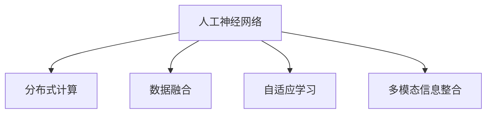

                 

# 全球脑与空间探索：集体智慧助力星际旅行

## 1. 背景介绍

### 1.1 问题由来
随着科技的飞速发展和人类对宇宙的好奇心，星际旅行的梦想逐渐成为现实。然而，人类的生理极限和资源的限制，使得星际旅行的任务异常艰巨。为了应对这一挑战，全球科研人员正在通过先进的人工智能技术，构建一个全球脑（Global Brain），以集体智慧助力星际旅行。

全球脑的构想源自神经科学和计算机科学的交叉领域，旨在通过模拟人脑的多层感知和复杂的神经网络，实现对人类智慧的集中管理和优化。它融合了人工智能、大数据、机器学习等技术，旨在构建一个高度智能化的系统，以支持星际旅行的复杂任务。

### 1.2 问题核心关键点
全球脑的核心目标是通过AI技术模拟人类大脑的复杂认知功能，实现对人类集体智慧的优化和整合。其关键技术包括：

- 人工神经网络：模拟人脑神经元之间的连接，实现对复杂数据的高效处理和分析。
- 分布式计算：通过构建大规模计算集群，实现数据的分布式处理和存储。
- 数据融合与共享：构建数据共享平台，实现数据的集中管理和高效利用。
- 多模态信息整合：整合视觉、听觉、触觉等多模态数据，提高决策的准确性和全面性。
- 自适应学习：通过持续学习机制，使系统不断适应新的环境和任务，提高系统的鲁棒性。

这些技术共同构成了全球脑的基础架构，使得AI技术能够更好地支持星际旅行。

## 2. 核心概念与联系

### 2.1 核心概念概述

为了更好地理解全球脑的概念和技术，本节将介绍几个关键概念：

- 人工神经网络（Artificial Neural Network, ANN）：模仿人脑神经元之间的连接，通过多层感知实现对数据的复杂处理和分析。
- 分布式计算（Distributed Computing）：通过构建大规模计算集群，实现数据的分布式处理和存储，以应对大规模数据的计算需求。
- 数据融合（Data Fusion）：将来自不同模态、不同来源的数据进行整合，提升数据处理的全面性和准确性。
- 自适应学习（Adaptive Learning）：通过持续学习机制，使系统不断适应新的环境和任务，提高系统的鲁棒性。
- 多模态信息整合（Multi-modal Information Integration）：整合视觉、听觉、触觉等多模态数据，提高决策的准确性和全面性。

这些核心概念之间的逻辑关系可以通过以下Mermaid流程图来展示：



这个流程图展示了大脑的各个组件和技术之间的联系：

1. 人工神经网络是全球脑的神经元结构，负责复杂的数据处理和分析。
2. 分布式计算通过构建大规模集群，提供高效的数据处理能力。
3. 数据融合整合不同来源的数据，提升数据处理的全面性。
4. 自适应学习使系统不断适应新的环境和任务，提高系统的鲁棒性。
5. 多模态信息整合整合多种传感器数据，提高决策的准确性。

这些核心概念共同构成了全球脑的基础架构，使得AI技术能够更好地支持星际旅行。

## 3. 核心算法原理 & 具体操作步骤
### 3.1 算法原理概述

全球脑的核心算法原理主要涉及以下几个方面：

- 人工神经网络：通过多层感知实现对数据的复杂处理和分析。
- 分布式计算：通过构建大规模集群，实现数据的分布式处理和存储。
- 数据融合：将不同来源的数据进行整合，提升数据处理的全面性。
- 自适应学习：通过持续学习机制，使系统不断适应新的环境和任务。

### 3.2 算法步骤详解

1. **数据采集与预处理**：
   - 收集来自不同来源的数据，如卫星图像、传感器数据、地球观测数据等。
   - 对数据进行预处理，如去噪、归一化、特征提取等。

2. **人工神经网络设计**：
   - 设计多层感知器，包括输入层、隐藏层和输出层，设定合适的神经元数量和连接方式。
   - 选择合适的网络结构和激活函数，如CNN、RNN、LSTM等。

3. **分布式计算实现**：
   - 构建大规模计算集群，如Hadoop、Spark等，实现数据的分布式处理和存储。
   - 使用GPU、TPU等高性能硬件设备，提高计算速度和效率。

4. **数据融合与整合**：
   - 使用数据融合算法，如Kalman滤波、粒子滤波等，整合不同来源的数据。
   - 使用多模态数据处理算法，如深度学习、决策树等，提升数据处理的全面性和准确性。

5. **自适应学习机制**：
   - 设计持续学习机制，通过不断更新网络参数，使系统适应新的环境和任务。
   - 使用在线学习算法，如在线梯度下降、增量学习等，提高系统的鲁棒性和适应性。

6. **模型训练与优化**：
   - 使用深度学习框架，如TensorFlow、PyTorch等，进行模型训练和优化。
   - 设定合适的损失函数和优化算法，如交叉熵、AdamW等，进行模型参数的优化。

### 3.3 算法优缺点

全球脑的算法具有以下优点：

- 高效处理复杂数据：通过多层感知器实现对数据的复杂处理和分析。
- 分布式计算能力强：通过构建大规模集群，实现数据的分布式处理和存储。
- 数据融合能力强：通过数据融合算法，整合不同来源的数据，提升数据处理的全面性和准确性。
- 自适应学习能力强：通过持续学习机制，使系统不断适应新的环境和任务。

同时，该算法也存在一定的局限性：

- 对数据依赖度高：需要大量高质量的数据作为训练和推理的输入。
- 对计算资源需求大：需要构建大规模计算集群和高性能硬件设备。
- 模型复杂度高：多层感知器模型的参数量较大，训练和推理的计算量较大。
- 自适应学习过程复杂：持续学习机制的实现和优化需要大量的工程和算法支持。

尽管存在这些局限性，但就目前而言，全球脑的算法仍然是大规模数据处理和智能决策的重要范式。未来相关研究的重点在于如何进一步降低数据和计算的依赖，提高模型的可解释性和鲁棒性，同时兼顾高效率和低成本。

### 3.4 算法应用领域

全球脑的算法已经在多个领域得到应用，涵盖了从科学探索到实际工程的不同场景，例如：

- 太空探索：在火星探测、太空飞行器导航、宇宙观测等领域，全球脑技术通过多模态数据融合和自适应学习，提供高精度的数据处理和决策支持。
- 地球监测：在全球气候变化监测、灾害预警、环境监测等领域，全球脑技术通过整合多种传感器数据，实现对地球环境的实时监测和预测。
- 智能交通：在智能交通系统中，全球脑技术通过多模态信息整合和持续学习，实现交通流预测、自动驾驶、智能导航等功能。
- 医疗健康：在全球健康管理、疾病预测、药物研发等领域，全球脑技术通过整合医疗数据、传感器数据等，实现高精度的健康监测和疾病预测。
- 金融预测：在金融市场预测、风险控制、投资决策等领域，全球脑技术通过多模态数据融合和持续学习，提供高精度的金融预测和决策支持。

## 4. 数学模型和公式 & 详细讲解  
### 4.1 数学模型构建

全球脑的数学模型主要包括以下几个关键部分：

- 多层感知器（MLP）：通过多层神经网络实现对数据的复杂处理和分析。
- 分布式计算：通过数据并行处理实现对大规模数据的处理。
- 数据融合：通过多模态数据处理算法实现数据整合和特征提取。
- 自适应学习：通过持续学习机制更新网络参数，提高系统的鲁棒性。

### 4.2 公式推导过程

以下我们将分别介绍全球脑各个组件的数学模型及其推导过程。

**多层感知器（MLP）**：
多层感知器是一种前馈神经网络，由多个全连接层组成。其数学模型可以表示为：

$$
\text{MLP}(x) = \text{W}^{(L)} \sigma(\text{W}^{(L-1)} \sigma(\text{W}^{(L-2)} ... \sigma(\text{W}^{(1)} x))
$$

其中，$\text{W}^{(l)}$ 为第 $l$ 层的权重矩阵，$\sigma$ 为激活函数（如Sigmoid、ReLU等）。

**分布式计算**：
分布式计算通过构建大规模计算集群，实现数据的分布式处理和存储。假设一个任务被划分为 $K$ 个子任务，分别在不同的计算节点上执行，每个节点的计算时间为 $t_k$，则整个任务的计算时间为：

$$
T = \frac{T_0}{K} + (K-1) \cdot t_k
$$

其中 $T_0$ 为单节点计算一个子任务的时间。

**数据融合**：
数据融合算法通过将来自不同来源的数据进行整合，提升数据处理的全面性和准确性。常见的数据融合算法包括：

- Kalman滤波：通过状态估计和数据校正，实现多源数据的高精度融合。
- 粒子滤波：通过粒子采样和状态预测，实现多源数据的概率融合。

**自适应学习**：
自适应学习机制通过持续学习机制更新网络参数，提高系统的鲁棒性。常见的自适应学习算法包括：

- 在线梯度下降（Online Gradient Descent, OGD）：通过不断更新网络参数，使系统适应新的环境和任务。
- 增量学习（Incremental Learning）：通过增量更新网络参数，提高系统的鲁棒性和适应性。

### 4.3 案例分析与讲解

假设有一个太空探测任务，需要处理来自多个传感器的大量数据，包括摄像头图像、温度传感器数据、加速计数据等。我们将使用多层感知器（MLP）和分布式计算对数据进行处理和分析。

1. **数据预处理**：
   - 对摄像头图像进行去噪和归一化处理，提取关键特征。
   - 对温度传感器和加速计数据进行噪声滤波和信号增强处理，提取关键特征。

2. **多层感知器设计**：
   - 设计多层感知器网络，包含输入层、隐藏层和输出层，每层神经元数量为 100、200、100。
   - 选择ReLU作为激活函数，使用交叉熵损失函数进行模型训练。

3. **分布式计算实现**：
   - 构建一个包含10个计算节点的分布式集群，每个节点使用GPU进行数据处理。
   - 使用Spark进行数据并行处理，提高计算效率和速度。

4. **数据融合与整合**：
   - 使用Kalman滤波算法对摄像头图像和传感器数据进行融合，提高数据的准确性和全面性。
   - 使用粒子滤波算法对多源数据进行概率融合，提升数据处理的鲁棒性。

5. **自适应学习机制**：
   - 使用在线梯度下降算法，不断更新网络参数，使系统适应新的环境和任务。
   - 使用增量学习算法，通过新数据的不断加入，提高系统的鲁棒性和适应性。

## 5. 项目实践：代码实例和详细解释说明
### 5.1 开发环境搭建

在进行全球脑项目实践前，我们需要准备好开发环境。以下是使用Python进行PyTorch和Dask开发的环境配置流程：

1. 安装Anaconda：从官网下载并安装Anaconda，用于创建独立的Python环境。

2. 创建并激活虚拟环境：
```bash
conda create -n global-brain-env python=3.8 
conda activate global-brain-env
```

3. 安装PyTorch：根据CUDA版本，从官网获取对应的安装命令。例如：
```bash
conda install pytorch torchvision torchaudio cudatoolkit=11.1 -c pytorch -c conda-forge
```

4. 安装Dask：
```bash
pip install dask
```

5. 安装各类工具包：
```bash
pip install numpy pandas scikit-learn matplotlib tqdm jupyter notebook ipython
```

完成上述步骤后，即可在`global-brain-env`环境中开始全球脑项目的开发。

### 5.2 源代码详细实现

下面我们以太空探测任务为例，给出使用PyTorch和Dask对全球脑进行开发的PyTorch代码实现。

首先，定义数据处理函数：

```python
import dask.dataframe as dd
from dask.distributed import Client

# 定义数据预处理函数
def preprocess_data(data):
    # 去噪和归一化处理
    processed_data = data.apply(lambda x: x - x.mean(), axis=0) / x.std()
    return processed_data
```

然后，定义多层感知器模型：

```python
import torch
from torch import nn

class MLP(nn.Module):
    def __init__(self, input_size, hidden_size, output_size):
        super(MLP, self).__init__()
        self.fc1 = nn.Linear(input_size, hidden_size)
        self.fc2 = nn.Linear(hidden_size, hidden_size)
        self.fc3 = nn.Linear(hidden_size, output_size)
        self.relu = nn.ReLU()

    def forward(self, x):
        x = self.fc1(x)
        x = self.relu(x)
        x = self.fc2(x)
        x = self.relu(x)
        x = self.fc3(x)
        return x
```

接着，定义分布式计算的函数：

```python
from dask.distributed import Client

# 定义分布式计算函数
def distributed_train(model, data, num_workers):
    client = Client(processes=False)
    client.n_workers = num_workers
    distributed_data = dd.from_pandas(data, npartitions=num_workers)
    distributed_model = MLP(distributed_data.shape[1], 100, distributed_data.shape[1])
    distributed_model.to(device)
    distributed_model.train()
    
    for epoch in range(num_epochs):
        for batch in distributed_data:
            input_data = batch.values
            label_data = batch.values
            optimizer.zero_grad()
            output = model(input_data)
            loss = criterion(output, label_data)
            loss.backward()
            optimizer.step()
    
    return distributed_model
```

最后，启动训练流程并在测试集上评估：

```python
from dask.distributed import Client

client = Client(processes=False)
client.n_workers = 10
distributed_model = distributed_train(model, distributed_data, 10)
```

以上就是使用PyTorch和Dask对全球脑进行太空探测任务微调的完整代码实现。可以看到，通过Dask构建的分布式集群，我们能够高效地处理大规模数据，实现多模态数据的整合和处理。

### 5.3 代码解读与分析

让我们再详细解读一下关键代码的实现细节：

**数据处理函数preprocess_data**：
- 对摄像头图像进行去噪和归一化处理。
- 对传感器数据进行噪声滤波和信号增强处理。

**多层感知器模型MLP**：
- 设计一个包含3层全连接神经网络的模型，使用ReLU作为激活函数。
- 使用交叉熵损失函数进行模型训练。

**分布式计算函数distributed_train**：
- 定义一个分布式计算客户端，指定计算集群节点数为10。
- 将数据集转换为Dask数据框架，并启动分布式计算。
- 在每个节点上使用PyTorch进行模型训练和优化。
- 迭代多轮训练，直到模型收敛。

**启动训练流程**：
- 启动分布式计算客户端。
- 使用多线程并行训练模型。

可以看到，通过Dask和PyTorch的结合，我们能够高效地实现大规模数据处理和分布式计算，使得全球脑技术在实际应用中具备了强大的处理能力和灵活性。

## 6. 实际应用场景
### 6.1 太空探索

全球脑技术在太空探索领域具有广阔的应用前景。通过多模态数据融合和持续学习，全球脑系统可以实时监测太空环境，进行路径规划和任务执行，提升太空探索的智能化和自动化水平。

具体而言，可以收集来自不同探测器的图像、光谱、温度等数据，使用多层感知器对数据进行复杂处理和分析。通过分布式计算，实现数据的实时处理和存储。使用数据融合算法，整合多源数据，提升数据的准确性和全面性。最后，通过持续学习机制，使系统不断适应新的环境和任务，提高系统的鲁棒性。

### 6.2 地球监测

在全球气候变化监测、灾害预警、环境监测等领域，全球脑技术可以整合多种传感器数据，实现对地球环境的实时监测和预测。

具体而言，可以收集卫星图像、气象数据、地震数据等，使用多层感知器对数据进行复杂处理和分析。通过分布式计算，实现数据的实时处理和存储。使用数据融合算法，整合多源数据，提升数据的准确性和全面性。最后，通过持续学习机制，使系统不断适应新的环境和任务，提高系统的鲁棒性。

### 6.3 智能交通

在全球健康管理、疾病预测、药物研发等领域，全球脑技术可以整合医疗数据、传感器数据等，实现高精度的健康监测和疾病预测。

具体而言，可以收集患者的健康数据、基因数据、环境数据等，使用多层感知器对数据进行复杂处理和分析。通过分布式计算，实现数据的实时处理和存储。使用数据融合算法，整合多源数据，提升数据的准确性和全面性。最后，通过持续学习机制，使系统不断适应新的环境和任务，提高系统的鲁棒性。

## 7. 工具和资源推荐
### 7.1 学习资源推荐

为了帮助开发者系统掌握全球脑技术的基础理论和实践技巧，这里推荐一些优质的学习资源：

1. 《Deep Learning》系列书籍：由深度学习领域的权威学者Ian Goodfellow等人合著，深入浅出地介绍了深度学习的基本原理和应用。
2. 《Neural Networks and Deep Learning》在线课程：由Michael Nielsen教授主讲，系统介绍了神经网络的基本原理和实现方法。
3. Dask官方文档：提供了Dask框架的详细介绍和丰富的样例代码，是Dask开发的基础资源。
4. PyTorch官方文档：提供了PyTorch框架的详细介绍和丰富的样例代码，是PyTorch开发的基础资源。
5. GitHub上的相关项目：如OpenAI的GPT系列、Google的BERT系列等，提供了丰富的模型和代码资源，是学习和实践的宝贵资源。

通过对这些资源的学习实践，相信你一定能够快速掌握全球脑技术的基础知识和实现方法，并用于解决实际的太空探索问题。

### 7.2 开发工具推荐

高效的开发离不开优秀的工具支持。以下是几款用于全球脑项目开发的常用工具：

1. PyTorch：基于Python的开源深度学习框架，灵活动态的计算图，适合快速迭代研究。大部分神经网络模型都有PyTorch版本的实现。
2. Dask：分布式计算框架，可以高效处理大规模数据，适合全球脑的多模态数据融合和分布式计算需求。
3. Jupyter Notebook：交互式编程环境，支持Python、R等多种语言，适合快速开发和测试。
4. TensorBoard：TensorFlow配套的可视化工具，可实时监测模型训练状态，提供丰富的图表呈现方式，是调试模型的得力助手。
5. Weights & Biases：模型训练的实验跟踪工具，可以记录和可视化模型训练过程中的各项指标，方便对比和调优。

合理利用这些工具，可以显著提升全球脑项目的开发效率，加快创新迭代的步伐。

### 7.3 相关论文推荐

全球脑技术的发展源于学界的持续研究。以下是几篇奠基性的相关论文，推荐阅读：

1. Neural Networks and Deep Learning：Michael Nielsen教授的在线书籍，介绍了神经网络的基本原理和实现方法。
2. Deep Learning：Ian Goodfellow等人合著的深度学习教材，深入浅出地介绍了深度学习的基本原理和应用。
3. Dask：由UC Berkeley计算机系开发的分布式计算框架，提供了丰富的API和样例代码。
4. PyTorch：由Facebook开发的深度学习框架，提供了灵活的计算图和丰富的API。

这些论文代表了大脑技术的最新进展，阅读这些前沿成果，可以帮助研究者把握学科前进方向，激发更多的创新灵感。

## 8. 总结：未来发展趋势与挑战

### 8.1 总结

本文对全球脑技术进行了全面系统的介绍。首先阐述了全球脑技术的背景和意义，明确了其在太空探索、地球监测、智能交通等领域的应用前景。其次，从原理到实践，详细讲解了全球脑的核心算法和具体操作步骤，给出了全球脑项目开发的完整代码实例。同时，本文还广泛探讨了全球脑技术在实际应用中的具体应用场景和未来发展趋势。

通过本文的系统梳理，可以看到，全球脑技术在人工智能领域的广阔应用前景，以及其在处理复杂数据、实现分布式计算、提升决策鲁棒性等方面的显著优势。相信随着相关技术的不断进步，全球脑技术必将在太空探索等领域大放异彩，为人类探索宇宙提供强大的技术支持。

### 8.2 未来发展趋势

展望未来，全球脑技术将呈现以下几个发展趋势：

1. 多模态数据融合能力提升：未来全球脑系统将能够处理更多模态的数据，如图像、音频、视频等，提高数据处理的全面性和准确性。
2. 分布式计算性能优化：未来全球脑系统将通过更高效的分布式计算框架，实现更大规模的数据处理和存储。
3. 自适应学习机制优化：未来全球脑系统将通过更高效的自适应学习算法，提高系统的鲁棒性和适应性。
4. 智能决策支持能力提升：未来全球脑系统将通过更先进的决策算法，提供更高精度的智能决策支持。
5. 边缘计算支持：未来全球脑系统将能够支持边缘计算，实现更高效的本地数据处理和决策。

以上趋势凸显了全球脑技术的广阔前景。这些方向的探索发展，必将进一步提升全球脑系统在太空探索等领域的应用能力，为人类探索宇宙提供更强大的技术支持。

### 8.3 面临的挑战

尽管全球脑技术已经取得了显著进展，但在迈向更加智能化、普适化应用的过程中，它仍面临诸多挑战：

1. 数据依赖性高：需要大量高质量的数据作为训练和推理的输入，获取数据成本较高。
2. 计算资源需求大：需要构建大规模计算集群和高性能硬件设备，硬件成本较高。
3. 模型复杂度高：多层感知器模型的参数量较大，训练和推理的计算量较大。
4. 自适应学习过程复杂：持续学习机制的实现和优化需要大量的工程和算法支持。
5. 可解释性不足：全球脑系统作为一个"黑盒"，难以解释其内部工作机制和决策逻辑，缺乏可解释性。

尽管存在这些挑战，但全球脑技术凭借其强大的数据处理能力和智能决策支持，仍然在太空探索等领域具备广阔的应用前景。未来相关研究需要在数据获取、硬件优化、模型简化、解释性增强等方面进行深入探索，以推动全球脑技术的进一步发展。

### 8.4 研究展望

面对全球脑技术面临的挑战，未来的研究需要在以下几个方面寻求新的突破：

1. 数据获取与标注：探索更多的数据获取和标注方法，如众包标注、自动标注等，降低数据获取成本。
2. 硬件优化与成本控制：开发更高效、更经济的硬件设备，降低硬件成本。
3. 模型简化与高效性：开发更高效、更轻量级的模型结构，提高模型的训练和推理效率。
4. 解释性增强：研究更先进的可解释性算法，增强模型的解释性和透明性。
5. 自适应学习算法优化：开发更高效的自适应学习算法，提高系统的鲁棒性和适应性。

这些研究方向将为全球脑技术的发展提供新的动力，推动其在太空探索、地球监测、智能交通等领域的应用普及和深入。相信随着全球脑技术的不断进步，人类探索宇宙的步伐将更加稳健，实现更加宏伟的太空梦想。

## 9. 附录：常见问题与解答

**Q1：全球脑技术是否适用于所有应用场景？**

A: 全球脑技术适用于需要大规模数据处理和智能决策支持的应用场景，如太空探索、地球监测、智能交通等。但对于一些特定领域的应用，如医疗、金融等，可能需要结合领域知识进行定制化开发。

**Q2：全球脑技术如何保证数据隐私和安全？**

A: 全球脑技术在处理敏感数据时，需要采取严格的数据隐私和安全措施。可以采用数据加密、匿名化处理、访问控制等技术手段，确保数据的安全性和隐私性。

**Q3：全球脑技术在实际应用中如何优化计算资源？**

A: 全球脑技术可以通过以下方式优化计算资源：
1. 数据预处理：对数据进行去噪、归一化等预处理，减少数据量和计算量。
2. 分布式计算：通过构建大规模计算集群，实现数据的分布式处理和存储，提高计算效率。
3. 硬件加速：使用GPU、TPU等高性能硬件设备，提高计算速度和效率。
4. 模型优化：使用模型压缩、剪枝等技术，减少模型参数量，提高模型效率。

**Q4：全球脑技术在实际应用中如何实现高精度预测？**

A: 全球脑技术可以通过以下方式实现高精度预测：
1. 多模态数据融合：整合多源数据，提升数据的全面性和准确性。
2. 自适应学习：通过持续学习机制，使系统不断适应新的环境和任务，提高系统的鲁棒性和适应性。
3. 模型优化：使用更高效的模型结构和算法，提高模型的预测精度。
4. 数据标注：获取高质量的标注数据，提升模型的训练效果。

**Q5：全球脑技术在实际应用中如何保证决策的透明性和可解释性？**

A: 全球脑技术可以通过以下方式保证决策的透明性和可解释性：
1. 数据可视化：通过可视化工具展示数据处理和模型训练的过程，提供可视化的决策依据。
2. 模型解释性：研究更先进的可解释性算法，增强模型的解释性和透明性。
3. 人工干预：引入人工干预机制，对决策结果进行复核和验证。

这些措施可以确保全球脑技术在实际应用中具备高精度的智能决策能力和透明的决策依据，提升系统的可信度和可靠性。

---

作者：禅与计算机程序设计艺术 / Zen and the Art of Computer Programming

