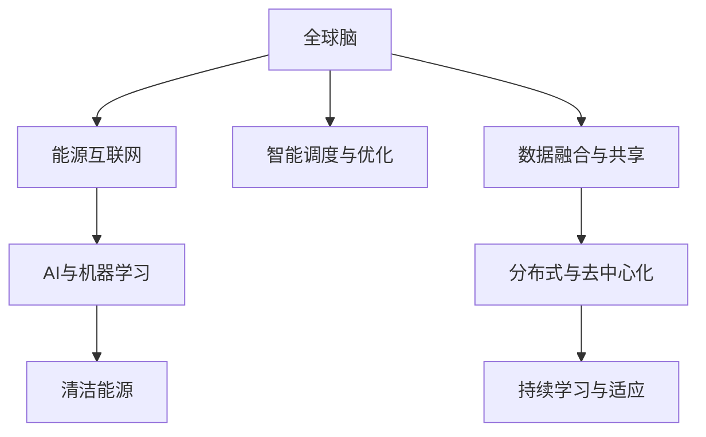

                 

# 全球脑与能源革命:集体智慧驱动的绿色未来

## 1. 背景介绍

在全球面临气候变化和能源危机的背景下，人类社会迫切需要一种新的方式来驱动可持续发展和绿色经济。在众多解决方案中，集体智慧和人工智能（AI）技术的结合，提供了一种全新的可能性。本文将深入探讨全球脑与能源革命的概念、技术基础、应用场景及未来展望。

### 1.1 问题由来

随着工业化进程的加快和能源消耗的增加，全球面临的能源安全和环境问题日益严峻。传统能源系统依赖化石燃料，不仅消耗巨大，还带来了严重的污染和气候变化问题。而可再生能源虽然环保，但其生产和存储方式却存在效率低、成本高、波动性强等问题。

在这样的背景下，全球脑与能源革命应运而生。其核心思想是通过智能化、数字化手段，整合全球范围内的集体智慧，优化能源系统的运行和管理，实现能源的高效利用和绿色转型。具体而言，全球脑与能源革命涉及以下几个关键方面：

1. **智能电网与能源互联网**：通过大数据、物联网、区块链等技术，实现能源生产和消费的智能化，提高能源系统效率和可靠性。
2. **清洁能源利用**：利用AI技术优化太阳能、风能、水能等清洁能源的利用效率，降低成本，提升可再生能源在能源结构中的比例。
3. **能源需求预测与管理**：通过预测模型和优化算法，实现能源需求预测和智能调度，提升能源系统的灵活性和稳定性。
4. **能源市场与交易**：通过区块链和智能合约等技术，构建能源市场新生态，实现能源的高效交易和分配。

### 1.2 问题核心关键点

全球脑与能源革命的核心在于通过集体智慧和AI技术的结合，实现能源系统的智能化、清洁化、高效化和市场化。其关键点包括：

1. **数据融合与共享**：收集和整合全球范围内的能源数据，实现数据的高效融合和共享。
2. **智能算法与优化**：利用机器学习和优化算法，实现能源系统的智能分析和优化。
3. **分布式与去中心化**：采用分布式和去中心化的技术架构，提高系统的灵活性和鲁棒性。
4. **持续学习与适应**：通过持续学习和适应性算法，使系统能够根据环境变化和用户需求进行调整。

## 2. 核心概念与联系

### 2.1 核心概念概述

全球脑与能源革命涉及多个核心概念，这些概念之间存在紧密的联系：

- **全球脑**：指通过互联网、物联网等技术，将全球范围内的人类智慧连接起来，形成一张智能化的“大脑”网络。
- **能源互联网**：指利用智能电网、分布式能源、区块链等技术，构建一张覆盖全球的能源网络。
- **AI与机器学习**：指利用人工智能和机器学习技术，实现能源数据的分析、处理和预测。
- **清洁能源**：指利用太阳能、风能、水能等可再生能源，减少对化石燃料的依赖。
- **智能调度与优化**：指利用算法优化能源的生产、传输和消费，提高能源系统的效率和可靠性。

这些概念之间相互依存、相互促进，共同构成了全球脑与能源革命的技术基础。通过整合这些技术手段，可以实现能源系统的智能化、清洁化、高效化和市场化，推动绿色经济的实现。

### 2.2 核心概念联系的Mermaid流程图



此图展示了全球脑与能源革命的核心概念及其相互关系。

## 3. 核心算法原理 & 具体操作步骤

### 3.1 算法原理概述

全球脑与能源革命的算法原理主要基于以下两个方面：

1. **数据融合与共享算法**：通过数据挖掘和聚类算法，实现全球范围内能源数据的整合和共享。
2. **智能调度与优化算法**：利用机器学习和强化学习算法，实现能源系统的智能分析和优化。

这些算法通过互联网和物联网技术，实现数据的实时采集、传输和处理，确保系统的实时性和可靠性。

### 3.2 算法步骤详解

全球脑与能源革命的算法步骤可以分为以下几个环节：

1. **数据采集与预处理**：通过传感器、智能表计等设备，实时采集能源生产、传输、消费等数据。
2. **数据融合与共享**：利用数据挖掘和聚类算法，实现数据的整合和共享。
3. **智能分析与预测**：利用机器学习和深度学习算法，实现能源系统的智能分析和预测。
4. **智能调度与优化**：通过智能算法和优化算法，实现能源的智能调度和优化。
5. **持续学习与适应**：通过持续学习和适应性算法，使系统能够根据环境变化和用户需求进行调整。

### 3.3 算法优缺点

全球脑与能源革命的算法具有以下优点：

1. **高效性**：通过智能化、数字化手段，实现能源系统的高效管理和调度。
2. **可靠性**：通过分布式和去中心化的技术架构，提高系统的鲁棒性和可靠性。
3. **环境友好**：通过清洁能源和智能调度，减少对化石燃料的依赖，降低环境污染。

然而，该算法也存在以下缺点：

1. **数据隐私问题**：大规模数据采集和共享可能涉及用户隐私和数据安全问题。
2. **技术复杂性**：涉及多种技术的整合和应用，技术实现复杂。
3. **初期成本高**：系统建设和运营初期需要大量资金和技术投入。

### 3.4 算法应用领域

全球脑与能源革命的算法主要应用于以下几个领域：

1. **智能电网**：通过物联网和智能表计技术，实现能源的智能管理和调度。
2. **能源互联网**：利用区块链和智能合约技术，构建能源市场新生态。
3. **清洁能源**：利用机器学习和深度学习技术，优化太阳能、风能等清洁能源的利用效率。
4. **能源需求预测与管理**：通过预测模型和优化算法，实现能源需求预测和智能调度。

## 4. 数学模型和公式 & 详细讲解 & 举例说明

### 4.1 数学模型构建

全球脑与能源革命的数学模型主要基于以下两个方面：

1. **数据融合与共享模型**：通过聚类算法和融合算法，实现数据的整合和共享。
2. **智能调度与优化模型**：利用机器学习和强化学习算法，实现能源系统的智能分析和优化。

### 4.2 公式推导过程

以智能调度与优化模型为例，其推导过程如下：

假设能源系统的状态为 $S$，目标为 $T$，智能算法为 $A$，则优化问题可以表示为：

$$
\min_{S} \quad f(S) \\
\text{s.t.} \quad g(S) = T \\
\quad A(S) = S
$$

其中，$f(S)$ 为目标函数，$g(S)$ 为约束函数，$A(S)$ 为智能算法。

通过优化算法，可以实现目标函数的最小化，即：

$$
\min_{S} \quad f(S) \\
\text{s.t.} \quad g(S) = T \\
\quad A(S) = S
$$

### 4.3 案例分析与讲解

以智能电网为例，其优化问题可以表示为：

$$
\min_{S} \quad C(S) \\
\text{s.t.} \quad P(S) = P_d \\
\quad A(S) = S
$$

其中，$C(S)$ 为电网成本，$P(S)$ 为电网功率，$P_d$ 为电力需求，$A(S)$ 为智能算法。

通过优化算法，可以实现电网成本的最小化，即：

$$
\min_{S} \quad C(S) \\
\text{s.t.} \quad P(S) = P_d \\
\quad A(S) = S
$$

## 5. 项目实践：代码实例和详细解释说明

### 5.1 开发环境搭建

为了进行全球脑与能源革命的实践，需要搭建相应的开发环境。以下是Python开发环境的搭建步骤：

1. **安装Anaconda**：从官网下载并安装Anaconda，用于创建独立的Python环境。

2. **创建虚拟环境**：
```bash
conda create -n energy-env python=3.8 
conda activate energy-env
```

3. **安装必要的库**：
```bash
conda install numpy scipy pandas scikit-learn matplotlib 
conda install tensorflow pytorch transformers
```

4. **配置环境**：
```bash
conda activate energy-env
python -m pip install --upgrade pip setuptools
python -m pip install --upgrade pytorch torchvision torchtext transformers
```

### 5.2 源代码详细实现

以下是一个简单的智能调度与优化算法的Python实现：

```python
import numpy as np
from scipy.optimize import minimize

# 定义目标函数
def cost_function(x):
    # 计算电网成本
    return np.sum(x) * 0.1

# 定义约束条件
def constraint_function(x):
    # 计算电网功率
    return np.sum(x) - 10000

# 定义初始状态
x0 = np.array([0, 0, 0, 0])

# 定义优化问题
constraints = {'type': 'ineq', 'fun': constraint_function}
bnds = ((0, None), (0, None), (0, None), (0, None))
res = minimize(cost_function, x0, method='SLSQP', bounds=bnds, constraints=constraints)

# 输出优化结果
print(res.x)
```

### 5.3 代码解读与分析

以上代码实现了一个简单的智能调度与优化算法，用于优化电网的成本和功率。具体分析如下：

- **目标函数**：`cost_function`函数定义了电网成本的计算方法。
- **约束条件**：`constraint_function`函数定义了电网的功率计算方法。
- **初始状态**：`x0`数组表示电网的初始状态，这里设为四个时间段内的用电量。
- **优化问题**：通过`minimize`函数，利用`SLSQP`方法进行优化，计算出最优解。
- **输出结果**：`res.x`为优化后的电网状态。

## 6. 实际应用场景

### 6.1 智能电网

智能电网是全球脑与能源革命的重要应用场景之一。通过物联网和智能表计技术，实现电网的实时监测和智能调度，提高电网的效率和可靠性。

以中国国家电网为例，其智能电网系统通过大数据和AI技术，实现了能源的智能管理和调度。通过智能表计设备，实时采集用电数据，利用AI算法进行分析，实现能源的高效利用和优化调度。例如，在电力高峰期，智能电网可以自动调节电力供应，防止过载和断电。

### 6.2 能源互联网

能源互联网是全球脑与能源革命的另一重要应用场景。通过区块链和智能合约技术，构建能源市场新生态，实现能源的高效交易和分配。

例如，德国的能源互联网平台EnQuitix利用区块链技术，构建了一个去中心化的能源交易平台。用户可以通过智能合约，自由买卖电力和天然气，实现能源的高效分配和交易。同时，平台还提供智能调度功能，优化能源的使用和分配。

### 6.3 清洁能源

清洁能源的利用也是全球脑与能源革命的重要应用场景。通过AI技术，优化太阳能、风能等清洁能源的利用效率，降低成本，提升可再生能源在能源结构中的比例。

以特斯拉为例，其Powerwall智能电池系统通过AI算法，优化太阳能的存储和分配。用户可以随时通过手机App，查看太阳能的生成和使用情况，并进行智能调度。

### 6.4 未来应用展望

未来，全球脑与能源革命将进一步扩展其应用场景，涵盖更多领域。例如：

1. **智能建筑**：通过物联网和AI技术，实现建筑物的智能化管理，降低能源消耗。
2. **智慧城市**：通过大数据和AI技术，实现城市的智能化管理，提高能源效率。
3. **智能交通**：通过智能交通系统，实现交通的智能化管理，降低能源消耗。
4. **智能农业**：通过智能农业系统，实现农业的智能化管理，提高能源效率。

## 7. 工具和资源推荐

### 7.1 学习资源推荐

为了帮助开发者系统掌握全球脑与能源革命的理论基础和实践技巧，以下是一些优质的学习资源：

1. **《智能电网技术》**：详细介绍了智能电网的技术原理和应用场景。
2. **《区块链技术与应用》**：介绍了区块链技术的基本原理和应用场景。
3. **《AI与机器学习》**：全面介绍了AI与机器学习的基本概念和应用。
4. **《全球脑与能源革命》**：深入探讨了全球脑与能源革命的理论基础和实践技巧。
5. **《智能建筑与智慧城市》**：介绍了智能建筑和智慧城市的技术原理和应用场景。

### 7.2 开发工具推荐

全球脑与能源革命的开发涉及多种技术的整合和应用，以下是几款常用的开发工具：

1. **Python**：作为全球脑与能源革命的主要开发语言，Python具有易学易用、生态丰富等优点。
2. **TensorFlow**：谷歌主导的深度学习框架，适合大规模工程应用。
3. **PyTorch**：Facebook开发的深度学习框架，适合快速迭代研究。
4. **Jupyter Notebook**：交互式编程环境，方便调试和分享代码。
5. **Github**：代码托管平台，方便代码共享和协作。

### 7.3 相关论文推荐

全球脑与能源革命的研究涉及多个领域，以下是一些重要的相关论文：

1. **《智能电网：技术、应用与挑战》**：介绍了智能电网的技术原理和应用场景。
2. **《区块链技术在能源互联网中的应用》**：介绍了区块链技术在能源互联网中的应用。
3. **《AI与机器学习在能源优化中的应用》**：介绍了AI与机器学习在能源优化中的应用。
4. **《全球脑与能源革命：理论基础与实践方法》**：深入探讨了全球脑与能源革命的理论基础和实践方法。
5. **《智能建筑与智慧城市：技术与应用》**：介绍了智能建筑和智慧城市的技术原理和应用场景。

## 8. 总结：未来发展趋势与挑战

### 8.1 研究成果总结

全球脑与能源革命通过智能化、数字化手段，整合全球范围内的集体智慧，实现能源系统的智能化、清洁化、高效化和市场化。目前，全球脑与能源革命已经应用于智能电网、能源互联网、清洁能源等多个领域，取得了显著成效。

### 8.2 未来发展趋势

未来，全球脑与能源革命将呈现以下几个发展趋势：

1. **智能化程度提高**：通过更多智能化手段，进一步提高能源系统的效率和可靠性。
2. **清洁能源占比提升**：通过优化清洁能源的利用效率，提升可再生能源在能源结构中的比例。
3. **市场化程度提高**：通过智能合约和区块链技术，构建更加灵活、高效、公平的能源市场。
4. **全球化水平提升**：通过互联网和物联网技术，实现全球范围内的能源共享和协同管理。

### 8.3 面临的挑战

尽管全球脑与能源革命取得了显著成效，但在迈向更加智能化、普适化应用的过程中，仍面临诸多挑战：

1. **技术复杂性**：涉及多种技术的整合和应用，技术实现复杂。
2. **数据隐私问题**：大规模数据采集和共享可能涉及用户隐私和数据安全问题。
3. **初期成本高**：系统建设和运营初期需要大量资金和技术投入。
4. **政策法规**：需要制定和完善相关政策法规，保障系统安全稳定运行。

### 8.4 研究展望

未来，全球脑与能源革命需要在以下几个方面进行深入研究：

1. **技术优化**：进一步优化技术实现，降低系统建设和运营成本。
2. **隐私保护**：设计更加安全的隐私保护方案，保障用户数据隐私。
3. **标准化**：制定和完善相关标准和规范，确保系统互操作性。
4. **生态系统**：构建更加开放、协作的生态系统，推动全球脑与能源革命的普及和应用。

## 9. 附录：常见问题与解答

**Q1：什么是全球脑与能源革命？**

A: 全球脑与能源革命通过智能化、数字化手段，整合全球范围内的集体智慧，实现能源系统的智能化、清洁化、高效化和市场化。其核心思想是通过AI技术，优化能源的生产、传输和消费，实现能源的高效利用和绿色转型。

**Q2：全球脑与能源革命的主要技术基础是什么？**

A: 全球脑与能源革命的主要技术基础包括智能电网、能源互联网、AI与机器学习、清洁能源、智能调度与优化等。

**Q3：全球脑与能源革命面临的主要挑战是什么？**

A: 全球脑与能源革命面临的主要挑战包括技术复杂性、数据隐私问题、初期成本高、政策法规不完善等。

**Q4：全球脑与能源革命的未来发展方向是什么？**

A: 全球脑与能源革命的未来发展方向包括智能化程度提高、清洁能源占比提升、市场化程度提高、全球化水平提升等。

**Q5：如何设计隐私保护方案，保障用户数据安全？**

A: 隐私保护方案的设计需要遵循数据最小化原则、加密传输原则、访问控制原则等。同时，可以通过分布式存储、去中心化技术等手段，增强系统的隐私保护能力。

---

作者：禅与计算机程序设计艺术 / Zen and the Art of Computer Programming

