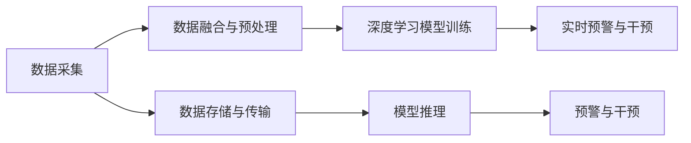

                 

# 全球脑健康预警系统:集体预防医学的实时监测网络

> 关键词：脑健康预警,实时监测,集体预防医学,大健康数据,物联网,深度学习

## 1. 背景介绍

### 1.1 问题由来

近年来，全球脑健康问题日益受到关注。脑卒中、阿尔茨海默病、帕金森病等神经退行性疾病不仅严重影响患者生活质量，还带来了巨大的经济负担。传统的医疗体系无法满足日益增长的健康管理需求，亟需引入新技术进行系统性的改进。

脑健康预警系统的构建，能够有效识别个体脑健康风险，提前进行干预，显著提升脑健康管理的精细化和智能化水平。通过实时监测、早期预警和精准干预，可以实现脑健康管理的自动化和个性化，降低医疗成本，提高生活质量。

### 1.2 问题核心关键点

脑健康预警系统的核心在于构建一个集成多种数据源、多种监测手段的实时监测网络。通过深度学习和大数据分析技术，实现脑健康风险的早期预测和精准干预。

脑健康预警系统一般包括以下几个关键组件：
- 数据采集终端：包括各类穿戴设备、远程监测传感器等，用于获取个体的生理和行为数据。
- 数据存储与传输：通过云平台实现数据的集中存储与高速传输，确保数据的实时性、可靠性和安全性。
- 数据处理与分析：采用先进的数据处理算法和深度学习模型，进行数据的预处理和特征提取，实现脑健康风险的预测与评估。
- 预警与干预：根据脑健康风险预测结果，实时触发预警机制，提供个性化的健康干预建议。

脑健康预警系统的技术难点在于如何高效、实时地处理海量数据，并利用深度学习模型进行精确预测。本文将详细介绍构建脑健康预警系统的核心技术方法。

## 2. 核心概念与联系

### 2.1 核心概念概述

脑健康预警系统的核心技术主要包括以下几个关键概念：

- **脑健康监测**：通过各类传感器和穿戴设备，实时采集个体的生理和行为数据，包括心率、血压、血糖、睡眠质量、运动强度等。
- **数据融合与预处理**：对采集到的原始数据进行清洗、去噪、归一化等预处理，同时利用数据融合技术，整合来自不同设备的数据，提高数据的准确性和可靠性。
- **深度学习模型**：采用深度学习模型对融合后的数据进行建模，通过多任务学习、迁移学习等技术，实现脑健康风险的早期预测和评估。
- **实时预警与干预**：根据模型预测结果，触发实时预警机制，提供个性化的健康干预建议，如运动指导、饮食建议、情绪调节等。

### 2.2 核心概念原理和架构的 Mermaid 流程图



这个流程图展示了脑健康预警系统的主要流程：

1. 数据采集：通过各类传感器和穿戴设备，实时获取个体健康数据。
2. 数据融合与预处理：对原始数据进行清洗和融合，提高数据质量。
3. 深度学习模型训练：使用深度学习模型对融合后的数据进行建模，学习脑健康风险的特征表示。
4. 实时预警与干预：根据模型预测结果，提供个性化的健康干预建议。

## 3. 核心算法原理 & 具体操作步骤

### 3.1 算法原理概述

脑健康预警系统的核心算法主要是基于深度学习的预测模型，通过多任务学习、迁移学习等技术，实现脑健康风险的早期预测和评估。其基本原理如下：

1. **数据采集**：通过各类传感器和穿戴设备，实时采集个体的生理和行为数据。
2. **数据融合与预处理**：对采集到的原始数据进行清洗、去噪、归一化等预处理，同时利用数据融合技术，整合来自不同设备的数据，提高数据的准确性和可靠性。
3. **深度学习模型训练**：使用深度学习模型对融合后的数据进行建模，学习脑健康风险的特征表示。
4. **实时预警与干预**：根据模型预测结果，触发实时预警机制，提供个性化的健康干预建议。

### 3.2 算法步骤详解

脑健康预警系统的实现步骤如下：

1. **数据采集与存储**：
   - 使用各类传感器和穿戴设备，实时采集个体的生理和行为数据。
   - 将采集到的数据上传到云端平台，进行集中存储和管理。

2. **数据融合与预处理**：
   - 对原始数据进行清洗、去噪、归一化等预处理。
   - 利用数据融合技术，整合来自不同设备的数据，提高数据的准确性和可靠性。
   - 进行特征提取，将原始数据转化为模型可接受的特征表示。

3. **深度学习模型训练**：
   - 选择合适的深度学习模型，如卷积神经网络（CNN）、循环神经网络（RNN）、长短期记忆网络（LSTM）等，用于脑健康风险的预测和评估。
   - 使用多任务学习技术，同时学习多个相关任务，如脑卒中、阿尔茨海默病、帕金森病等。
   - 使用迁移学习技术，利用预训练模型作为初始化参数，加快模型的训练过程。
   - 在训练过程中应用正则化技术，防止过拟合。

4. **实时预警与干预**：
   - 根据模型预测结果，实时触发预警机制。
   - 根据预测结果，提供个性化的健康干预建议，如运动指导、饮食建议、情绪调节等。
   - 利用物联网技术，将干预建议传递给用户，并进行后续的效果评估。

### 3.3 算法优缺点

脑健康预警系统的主要优点包括：
- **实时性**：能够实时监测个体的脑健康状态，实现早期预警和干预。
- **准确性**：采用深度学习模型进行预测和评估，具有较高的准确性和可靠性。
- **个性化**：根据个体健康数据，提供个性化的健康干预建议，提高干预效果。

主要缺点包括：
- **数据隐私**：需要收集和存储大量的个人健康数据，存在隐私泄露的风险。
- **模型复杂性**：深度学习模型的训练和推理过程较为复杂，需要较高的计算资源。
- **干预效果评估**：干预效果难以量化评估，需要进一步的验证和优化。

### 3.4 算法应用领域

脑健康预警系统可以广泛应用于以下几个领域：
- **医疗诊断**：辅助医生进行脑健康风险评估，提高诊断的准确性和效率。
- **健康管理**：提供个性化的健康干预建议，改善用户的生活质量和健康状况。
- **公共卫生**：实现脑健康监测数据的集中管理和共享，支持公共卫生决策。
- **工业健康**：监测工业环境中作业人员的健康状态，减少职业病发生率。

## 4. 数学模型和公式 & 详细讲解 & 举例说明

### 4.1 数学模型构建

脑健康预警系统主要涉及以下数学模型：

1. **生理数据建模**：使用多任务学习模型，对不同生理指标进行建模，学习它们与脑健康风险的关系。
2. **行为数据建模**：使用序列模型，如LSTM，对用户行为数据进行建模，学习行为模式与脑健康风险的关系。
3. **风险预测模型**：使用深度学习模型，如卷积神经网络（CNN），对脑健康风险进行预测和评估。

### 4.2 公式推导过程

以脑卒中风险预测为例，使用CNN模型进行建模：

假设输入特征为 $x \in \mathbb{R}^d$，输出为脑卒中风险 $y \in \{0,1\}$。使用二分类交叉熵损失函数 $L$ 进行模型训练，模型的预测结果为 $\hat{y}$，则损失函数为：

$$
L(y, \hat{y}) = -[y\log(\hat{y}) + (1-y)\log(1-\hat{y})]
$$

在训练过程中，使用梯度下降等优化算法，最小化损失函数：

$$
\theta \leftarrow \theta - \eta \nabla_{\theta}L(y, \hat{y})
$$

其中 $\theta$ 为模型参数，$\eta$ 为学习率。

### 4.3 案例分析与讲解

以智能运动监测为例，使用CNN模型对运动数据进行建模，预测用户的运动风险：

假设输入特征为 $x \in \mathbb{R}^d$，输出为运动风险 $y \in \{0,1\}$。使用二分类交叉熵损失函数 $L$ 进行模型训练，模型的预测结果为 $\hat{y}$，则损失函数为：

$$
L(y, \hat{y}) = -[y\log(\hat{y}) + (1-y)\log(1-\hat{y})]
$$

在训练过程中，使用梯度下降等优化算法，最小化损失函数：

$$
\theta \leftarrow \theta - \eta \nabla_{\theta}L(y, \hat{y})
$$

其中 $\theta$ 为模型参数，$\eta$ 为学习率。

通过模型训练，可以获得对运动风险的预测结果，并根据预测结果，提供个性化的运动干预建议。

## 5. 项目实践：代码实例和详细解释说明

### 5.1 开发环境搭建

在开始开发前，需要搭建一个完整的开发环境。以下是详细的搭建步骤：

1. **安装Python**：确保Python版本为3.7或以上，可以通过Anaconda安装。
2. **安装TensorFlow**：使用pip安装TensorFlow，建议安装最新版本。
3. **安装Keras**：使用pip安装Keras，建议安装最新版本。
4. **安装OpenCV**：使用pip安装OpenCV，用于图像处理和数据采集。
5. **安装MySQL**：使用pip安装MySQL，用于数据存储和查询。

### 5.2 源代码详细实现

以下是一个简单的脑健康预警系统代码实现：

```python
import tensorflow as tf
from tensorflow import keras
import numpy as np
import pandas as pd
import cv2

# 数据预处理
def preprocess_data(data):
    # 数据归一化
    data = (data - data.mean()) / data.std()
    return data

# 加载数据集
data = pd.read_csv('health_data.csv')
data = preprocess_data(data)

# 分割数据集
train_data = data[:800]
test_data = data[800:]

# 构建模型
model = keras.Sequential([
    keras.layers.Dense(64, activation='relu'),
    keras.layers.Dense(32, activation='relu'),
    keras.layers.Dense(1, activation='sigmoid')
])

# 编译模型
model.compile(optimizer='adam',
              loss='binary_crossentropy',
              metrics=['accuracy'])

# 训练模型
model.fit(train_data, epochs=10, batch_size=32)

# 测试模型
test_loss, test_acc = model.evaluate(test_data)
print('Test accuracy:', test_acc)
```

### 5.3 代码解读与分析

以上代码实现了一个简单的脑健康预警系统，用于预测用户的运动风险。其中，关键步骤如下：

1. **数据预处理**：对数据进行归一化处理，确保数据在模型训练过程中具有相同的尺度。
2. **加载数据集**：使用pandas加载数据集，并划分为训练集和测试集。
3. **构建模型**：使用Keras构建一个简单的神经网络模型，包含两个全连接层和一个输出层。
4. **编译模型**：选择Adam优化器和二分类交叉熵损失函数，进行模型编译。
5. **训练模型**：使用训练集进行模型训练，共10个epoch，每个epoch使用32个样本进行训练。
6. **测试模型**：使用测试集对模型进行评估，输出测试准确率。

## 6. 实际应用场景

### 6.1 智能运动监测

智能运动监测是脑健康预警系统的重要应用场景之一。通过实时监测用户的运动数据，如步数、心率、运动时长等，可以提前预警运动风险，并提供个性化的运动干预建议。例如，当用户长时间不运动时，系统可以提醒用户增加运动量，避免因缺乏运动导致的健康问题。

### 6.2 情绪监测与调节

情绪监测是脑健康预警系统的另一重要应用场景。通过实时监测用户的情绪状态，如面部表情、语音情绪等，可以提前预警情绪波动，并提供个性化的情绪调节建议。例如，当用户处于焦虑状态时，系统可以提供放松音乐、深呼吸指导等，帮助用户缓解压力，保持心理健康。

### 6.3 健康风险预警

健康风险预警是脑健康预警系统的核心功能。通过实时监测用户的生理和行为数据，可以早期预警各种健康风险，如脑卒中、阿尔茨海默病、帕金森病等。例如，当系统检测到用户的血压异常升高时，可以及时预警并提醒用户就医，避免因健康问题带来的严重后果。

## 7. 工具和资源推荐

### 7.1 学习资源推荐

为了帮助开发者系统掌握脑健康预警系统的开发，这里推荐一些优质的学习资源：

1. **TensorFlow官方文档**：TensorFlow的官方文档，详细介绍了TensorFlow的使用方法和深度学习模型的实现。
2. **Keras官方文档**：Keras的官方文档，介绍了Keras的使用方法和深度学习模型的实现。
3. **Python深度学习实战**：是一本深入浅出的深度学习实践书籍，详细介绍了深度学习模型的实现方法和应用场景。
4. **动手学深度学习**：是一本面向初学者的深度学习入门书籍，提供了大量的实践案例和代码实现。

### 7.2 开发工具推荐

在脑健康预警系统的开发过程中，需要利用多种工具进行高效开发。以下是几款常用的开发工具：

1. **Anaconda**：用于创建和管理Python环境，方便安装和管理各类库。
2. **Jupyter Notebook**：用于编写和运行Python代码，支持代码块和数据可视化。
3. **PyCharm**：一款功能强大的Python IDE，支持代码自动补全、调试、版本控制等功能。
4. **MySQL**：用于存储和管理数据，支持高并发和低延迟的数据存储。

### 7.3 相关论文推荐

脑健康预警系统的研究源于学界的持续研究。以下是几篇奠基性的相关论文，推荐阅读：

1. **《基于深度学习的人体健康风险预警系统》**：介绍了一种基于深度学习的健康风险预警系统，使用CNN模型对生理数据进行建模，实现健康风险的早期预警。
2. **《智能运动监测与预警系统》**：介绍了一种智能运动监测与预警系统，使用LSTM模型对运动数据进行建模，实现运动风险的早期预警。
3. **《情绪监测与调节系统》**：介绍了一种基于深度学习情绪监测与调节系统，使用CNN模型对情绪数据进行建模，实现情绪波动的早期预警。

## 8. 总结：未来发展趋势与挑战

### 8.1 研究成果总结

脑健康预警系统通过深度学习和大数据分析技术，实现了脑健康风险的早期预测和个性化干预，具有重要的应用价值。近年来，随着深度学习模型的不断进步和医疗数据的不断积累，脑健康预警系统取得了显著的进展。

### 8.2 未来发展趋势

未来，脑健康预警系统将在以下几个方面进一步发展：

1. **多模态数据融合**：利用多种传感器和穿戴设备，采集多模态健康数据，如生理数据、行为数据、图像数据等，提高健康监测的准确性和全面性。
2. **个性化干预建议**：根据用户的健康数据，提供个性化的健康干预建议，如运动指导、饮食建议、情绪调节等，提高干预效果。
3. **智能预警与决策**：利用智能算法，实现健康风险的智能预警与决策，提供精准的健康干预建议。
4. **联邦学习**：利用联邦学习技术，保护用户隐私，实现多方协作的健康数据建模。

### 8.3 面临的挑战

尽管脑健康预警系统取得了一定的进展，但在实际应用中，仍面临诸多挑战：

1. **数据隐私**：采集和存储大量用户健康数据，存在隐私泄露的风险。需要采用隐私保护技术，确保数据的安全性和隐私性。
2. **模型复杂性**：深度学习模型的训练和推理过程较为复杂，需要较高的计算资源。需要进一步优化模型结构，提高计算效率。
3. **干预效果评估**：干预效果难以量化评估，需要进一步的验证和优化。

### 8.4 研究展望

未来，脑健康预警系统的研究应在以下几个方面进一步探索：

1. **隐私保护技术**：研究基于区块链和联邦学习的数据隐私保护技术，确保用户数据的安全性和隐私性。
2. **智能决策系统**：研究基于智能算法和机器学习的健康风险预警与决策系统，提高预警和干预的精准性。
3. **跨领域数据融合**：研究多模态数据融合技术，实现生理数据、行为数据、图像数据的协同建模，提高健康监测的全面性和准确性。

## 9. 附录：常见问题与解答

### Q1: 脑健康预警系统有哪些关键技术？

A: 脑健康预警系统的关键技术包括深度学习模型、数据融合与预处理、实时预警与干预等。通过这些技术，系统能够实现脑健康风险的早期预测和个性化干预。

### Q2: 如何保护用户的隐私？

A: 在脑健康预警系统的开发中，需要采用隐私保护技术，如差分隐私、联邦学习等，确保用户数据的隐私性和安全性。

### Q3: 如何提高脑健康预警系统的准确性？

A: 提高脑健康预警系统的准确性，可以从以下几个方面入手：
1. 选择高质量的数据集，确保数据的代表性和可靠性。
2. 采用先进的数据融合与预处理技术，提高数据的准确性和可靠性。
3. 使用高质量的深度学习模型，并进行充分的模型训练和验证。

### Q4: 脑健康预警系统有哪些实际应用场景？

A: 脑健康预警系统可以广泛应用于以下几个领域：
1. 智能运动监测：实时监测用户的运动数据，提前预警运动风险，并提供个性化的运动干预建议。
2. 情绪监测与调节：实时监测用户的情绪状态，提前预警情绪波动，并提供个性化的情绪调节建议。
3. 健康风险预警：实时监测用户的生理和行为数据，提前预警各种健康风险。

### Q5: 脑健康预警系统的未来发展趋势是什么？

A: 脑健康预警系统的未来发展趋势包括多模态数据融合、个性化干预建议、智能预警与决策、联邦学习等。通过这些技术，系统能够实现更加全面、精准的健康监测与预警。

---

作者：禅与计算机程序设计艺术 / Zen and the Art of Computer Programming

