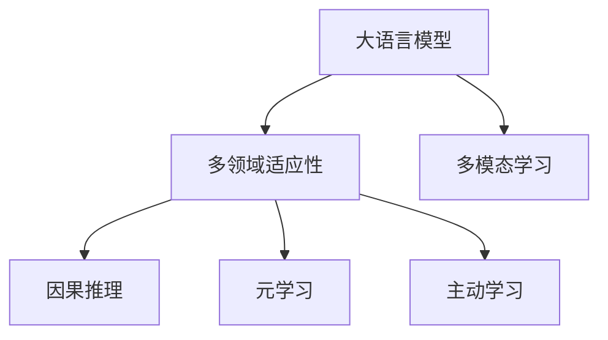

                 

# 全能型AI：LLM在多领域的适应性

> 关键词：大语言模型,多领域适应性,通用人工智能(AGI),多模态学习,因果推理,元学习,主动学习

## 1. 背景介绍

### 1.1 问题由来
近年来，基于大规模预训练语言模型(Large Language Models, LLMs)的AI技术在自然语言处理(Natural Language Processing, NLP)等领域取得了显著突破，其表现已经超越了人类专家的某些方面，显示出强大的通用智能潜力。这种通用智能的突破主要得益于预训练模型在通用大规模语料上的广泛知识学习，以及微调(Meta Learning)技术在特定任务上的进一步细化。

然而，现有的通用语言模型在特定领域内的表现依然存在局限。例如，当应用于法律、医疗等专业领域时，由于专业词汇和语境的特殊性，模型可能无法很好地理解或生成相关内容。此外，通用模型在处理视觉、语音等多模态数据时也显得捉襟见肘。因此，构建一种具备多领域适应性的全能型AI模型，成为当前AI研究的重要方向。

### 1.2 问题核心关键点
本节将探讨基于多领域适应性的全能型AI模型的构建方法，包括：
- 如何构建一个能够处理多种输入类型（文本、图像、音频等）的AI模型。
- 如何将多领域知识融合到单一模型中，使其在不同领域间具备泛化能力。
- 如何利用因果推理、元学习、主动学习等前沿技术提升模型的适应性和学习能力。

本文将重点讨论多领域适应性的核心技术，并结合实际项目实践，全面阐述这些技术在实际应用中的运用。

## 2. 核心概念与联系

### 2.1 核心概念概述

1. **大语言模型(LLMs)**：一种通过大规模语料预训练得到的通用模型，具有强大的语言生成和理解能力。
2. **多领域适应性**：指AI模型在不同领域（如医疗、法律、教育等）之间具备良好的知识迁移能力。
3. **多模态学习**：指AI模型能够同时处理文本、图像、语音等多类型输入，提升对现实世界的理解能力。
4. **因果推理**：指模型能够理解因果关系，从而做出更加符合逻辑的决策。
5. **元学习**：指模型能够通过少量样本学习新任务，提升学习效率。
6. **主动学习**：指模型能够主动选择未标注数据进行学习，提升模型泛化能力。

这些概念之间的逻辑关系可以通过以下Mermaid流程图来展示：



这个流程图展示了LLMs及其相关技术之间的关系：

1. LLMs通过大规模语料预训练获得广泛知识。
2. 多领域适应性使得LLMs能够在新领域中迁移应用这些知识。
3. 多模态学习让LLMs能够处理多种输入类型。
4. 因果推理提升LLMs对因果关系的理解。
5. 元学习和主动学习加速LLMs在新任务上的学习。

## 3. 核心算法原理 & 具体操作步骤

### 3.1 算法原理概述

全能型AI模型的核心算法原理包括多领域适应性、多模态学习、因果推理、元学习与主动学习。其中，多领域适应性是终极目标，多模态学习、因果推理、元学习和主动学习是实现这一目标的技术手段。

多领域适应性的核心思想是让模型能够通过泛化能力，在处理不同领域数据时表现良好。其主要算法原理如下：

1. **迁移学习**：指利用在其他领域学习到的知识，在新领域上进行迁移应用，提升模型在新领域上的性能。
2. **领域自适应**：通过领域自适应技术，如领域无关度量、领域对抗训练等，使得模型能够在新领域上更好地适应数据分布。
3. **知识蒸馏**：通过知识蒸馏技术，从专家知识库中抽取领域特定的知识，将其融入模型中，提升模型的领域适应性。

多模态学习主要解决模型处理多种类型输入的问题。其核心算法原理包括：

1. **跨模态表示学习**：通过共嵌入、跨模态匹配等技术，学习不同模态数据之间的相似表示，从而提升模型对多模态数据的理解能力。
2. **多模态数据融合**：将不同模态的数据融合在一起，形成更为丰富的特征表示，提高模型的预测准确性。

因果推理主要解决模型在理解因果关系时的不足。其核心算法原理包括：

1. **因果图建模**：构建因果图模型，描述变量之间的因果关系，并用于指导模型推理。
2. **因果表示学习**：通过因果表示学习，提升模型对因果关系的理解能力。

元学习和主动学习主要解决模型在面对新任务时的快速适应问题。其核心算法原理包括：

1. **元学习框架**：通过元学习框架，学习模型在不同任务上的快速适应能力。
2. **主动学习策略**：通过主动选择样本进行学习，提高模型对新数据的适应能力。

### 3.2 算法步骤详解

本节将详细介绍如何构建全能型AI模型的具体操作步骤。

**Step 1: 数据准备**
- 收集和整理目标领域的数据集，确保数据的多样性和代表性。
- 对数据集进行预处理，如分词、标注、数据增强等。

**Step 2: 模型设计**
- 选择合适的预训练模型，如BERT、GPT等，作为基础模型。
- 设计多领域适应性模块，如领域无关度量、领域自适应等。
- 设计多模态学习模块，如跨模态表示学习、多模态数据融合等。
- 设计因果推理模块，如因果图建模、因果表示学习等。
- 设计元学习和主动学习模块，如元学习框架、主动学习策略等。

**Step 3: 训练与优化**
- 使用多领域数据集对模型进行多轮训练，不断优化模型参数。
- 通过迁移学习、领域自适应、知识蒸馏等技术，提升模型在不同领域上的适应性。
- 通过多模态学习技术，提升模型对多种输入类型的理解能力。
- 通过因果推理技术，提升模型对因果关系的理解能力。
- 通过元学习和主动学习技术，加速模型对新任务的适应能力。

**Step 4: 评估与部署**
- 在目标领域的数据集上评估模型的性能，如精度、召回率、F1值等。
- 根据评估结果对模型进行进一步优化。
- 将优化后的模型部署到实际应用场景中，进行实时推理和预测。

### 3.3 算法优缺点

全能型AI模型具有以下优点：

1. **通用性**：能够在多个领域内应用，提升模型的泛化能力。
2. **灵活性**：能够处理多种类型输入，提升模型的适应能力。
3. **高效性**：通过多领域适应性、元学习和主动学习技术，提升模型的学习效率。

但全能型AI模型也存在以下缺点：

1. **资源消耗大**：需要大量的训练数据和计算资源。
2. **模型复杂**：需要设计多个模块和复杂的算法，增加了模型的复杂度。
3. **泛化风险**：模型在不同领域和任务上的泛化能力仍需进一步验证。

## 4. 数学模型和公式 & 详细讲解 & 举例说明

### 4.1 数学模型构建

基于全能型AI模型的核心算法原理，以下是其数学模型的构建：

设多领域数据集为 $D = \{(x_i, y_i)\}_{i=1}^N$，其中 $x_i$ 为输入数据，$y_i$ 为输出标签。

**多领域适应性模块**：

1. **领域无关度量**：设领域无关度量为 $\mathcal{H}$，通过度量不同领域数据间的相似度，实现跨领域知识的迁移。
   $$
   \mathcal{H}(x_i, x_j) = \text{sim}(f(x_i), f(x_j))
   $$
   其中 $f(x_i)$ 为领域适应性函数，$\text{sim}$ 为相似度函数。

2. **领域自适应**：设领域自适应模型为 $g(\cdot, \phi)$，通过领域自适应模型对新领域数据进行调整。
   $$
   x_i^{\prime} = g(x_i, \phi)
   $$

**多模态学习模块**：

1. **跨模态表示学习**：设多模态表示学习函数为 $h(\cdot, \theta)$，将不同模态数据转换为共有的表示空间。
   $$
   z_i = h(x_i, \theta)
   $$

2. **多模态数据融合**：设数据融合函数为 $k(\cdot)$，将不同模态的数据进行融合，形成统一的特征表示。
   $$
   z_i^{\prime} = k(z_i)
   $$

**因果推理模块**：

1. **因果图建模**：设因果图为 $G$，描述变量之间的因果关系。
   $$
   G = \{(X, Y, P(X, Y))\}
   $$

2. **因果表示学习**：设因果表示学习函数为 $q(\cdot)$，通过因果图学习因果关系，提升模型的推理能力。
   $$
   p(X, Y|Z) = q(X, Y, Z)
   $$

**元学习和主动学习模块**：

1. **元学习框架**：设元学习算法为 $L(\cdot)$，通过少量样本学习新任务。
   $$
   \theta^* = L(\theta_0)
   $$

2. **主动学习策略**：设主动学习算法为 $A(\cdot)$，主动选择样本进行学习。
   $$
   \{(x_i^*, y_i^*)\} = A(D)
   $$

### 4.2 公式推导过程

**多领域适应性模块**：

- **领域无关度量**：通过领域无关度量 $\mathcal{H}$，计算不同领域数据间的相似度。

  假设 $x_i$ 来自领域 $D_a$，$x_j$ 来自领域 $D_b$，且两个领域的分布相似，则有：
  $$
  \mathcal{H}(x_i, x_j) = \text{sim}(f(x_i), f(x_j))
  $$
  其中 $f(\cdot)$ 为领域适应性函数，$\text{sim}(\cdot)$ 为相似度函数。

- **领域自适应**：通过领域自适应模型 $g(\cdot, \phi)$，对新领域数据进行调整。

  假设 $x_i$ 来自领域 $D_a$，$x_i^{\prime}$ 为在领域 $D_b$ 上的调整结果，则有：
  $$
  x_i^{\prime} = g(x_i, \phi)
  $$

**多模态学习模块**：

- **跨模态表示学习**：通过跨模态表示学习函数 $h(\cdot, \theta)$，将不同模态数据转换为共有的表示空间。

  假设 $x_i$ 为文本输入，$x_i^{img}$ 为图像输入，则有：
  $$
  z_i = h(x_i, \theta)
  $$

- **多模态数据融合**：通过数据融合函数 $k(\cdot)$，将不同模态的数据进行融合，形成统一的特征表示。

  假设 $z_i$ 为文本和图像的表示，则有：
  $$
  z_i^{\prime} = k(z_i)
  $$

**因果推理模块**：

- **因果图建模**：构建因果图 $G$，描述变量之间的因果关系。

  假设 $X$ 为原因变量，$Y$ 为结果变量，$P(X, Y|Z)$ 为条件概率分布，则有：
  $$
  G = \{(X, Y, P(X, Y))\}
  $$

- **因果表示学习**：通过因果表示学习函数 $q(\cdot)$，学习因果关系，提升推理能力。

  假设 $p(X, Y|Z)$ 为因果关系概率分布，$Z$ 为观测变量，则有：
  $$
  p(X, Y|Z) = q(X, Y, Z)
  $$

**元学习和主动学习模块**：

- **元学习框架**：通过元学习算法 $L(\cdot)$，学习新任务。

  假设 $\theta_0$ 为初始参数，$\theta^*$ 为学习后的参数，则有：
  $$
  \theta^* = L(\theta_0)
  $$

- **主动学习策略**：通过主动学习算法 $A(\cdot)$，选择样本进行学习。

  假设 $D$ 为数据集，$(x_i^*, y_i^*)$ 为选择的主动学习样本，则有：
  $$
  \{(x_i^*, y_i^*)\} = A(D)
  $$

### 4.3 案例分析与讲解

以法律领域的案件判决为例，分析全能型AI模型的实际应用：

**Step 1: 数据准备**

- 收集法律领域的判决书、案例记录等文本数据，进行文本预处理，如分词、去停用词等。
- 收集律师的辩论记录、专家案例分析等文本数据，进行文本预处理，如分词、去停用词等。
- 收集与案件相关的图像数据，如法庭现场照片、证据图片等，进行图像预处理。
- 收集与案件相关的音频数据，如法庭录音、证人录音等，进行音频预处理。

**Step 2: 模型设计**

- 选择BERT模型作为基础模型，进行预训练。
- 设计领域无关度量模块，通过计算不同领域数据间的相似度，实现跨领域知识的迁移。
- 设计领域自适应模块，通过领域自适应模型对新领域数据进行调整。
- 设计多模态学习模块，通过跨模态表示学习，将文本、图像、音频等多模态数据转换为共有的表示空间，通过数据融合函数将多模态数据进行融合。
- 设计因果推理模块，通过因果图建模和因果表示学习，提升对案件因果关系的理解能力。
- 设计元学习和主动学习模块，通过元学习框架和主动学习策略，加速模型对新案件的适应能力。

**Step 3: 训练与优化**

- 使用法律领域的判决书、案例记录等文本数据，进行多轮训练，不断优化模型参数。
- 通过领域无关度量模块，计算不同领域数据间的相似度，实现跨领域知识的迁移。
- 通过领域自适应模块，对新领域数据进行调整。
- 通过多模态学习模块，将文本、图像、音频等多模态数据转换为共有的表示空间，进行多模态数据融合。
- 通过因果推理模块，构建因果图模型，学习因果关系，提升推理能力。
- 通过元学习和主动学习模块，学习新案件，选择主动学习样本进行学习，提升模型适应能力。

**Step 4: 评估与部署**

- 在法律领域的判决书、案例记录等文本数据上，评估模型的性能，如精度、召回率、F1值等。
- 根据评估结果对模型进行进一步优化。
- 将优化后的模型部署到实际应用场景中，进行案件判决的实时推理和预测。

## 5. 项目实践：代码实例和详细解释说明

### 5.1 开发环境搭建

在进行全能型AI模型的实践前，我们需要准备好开发环境。以下是使用Python进行PyTorch开发的环境配置流程：

1. 安装Anaconda：从官网下载并安装Anaconda，用于创建独立的Python环境。

2. 创建并激活虚拟环境：
```bash
conda create -n pytorch-env python=3.8 
conda activate pytorch-env
```

3. 安装PyTorch：根据CUDA版本，从官网获取对应的安装命令。例如：
```bash
conda install pytorch torchvision torchaudio cudatoolkit=11.1 -c pytorch -c conda-forge
```

4. 安装Transformers库：
```bash
pip install transformers
```

5. 安装各类工具包：
```bash
pip install numpy pandas scikit-learn matplotlib tqdm jupyter notebook ipython
```

完成上述步骤后，即可在`pytorch-env`环境中开始全能型AI模型的实践。

### 5.2 源代码详细实现

我们以法律领域的案件判决为例，给出使用Transformers库进行全能型AI模型微调的PyTorch代码实现。

首先，定义案件判决任务的数据处理函数：

```python
from transformers import BertTokenizer
from torch.utils.data import Dataset
import torch

class CaseDataset(Dataset):
    def __init__(self, texts, tags, tokenizer, max_len=128):
        self.texts = texts
        self.tags = tags
        self.tokenizer = tokenizer
        self.max_len = max_len
        
    def __len__(self):
        return len(self.texts)
    
    def __getitem__(self, item):
        text = self.texts[item]
        tags = self.tags[item]
        
        encoding = self.tokenizer(text, return_tensors='pt', max_length=self.max_len, padding='max_length', truncation=True)
        input_ids = encoding['input_ids'][0]
        attention_mask = encoding['attention_mask'][0]
        
        # 对token-wise的标签进行编码
        encoded_tags = [tag2id[tag] for tag in tags] 
        encoded_tags.extend([tag2id['O']] * (self.max_len - len(encoded_tags)))
        labels = torch.tensor(encoded_tags, dtype=torch.long)
        
        return {'input_ids': input_ids, 
                'attention_mask': attention_mask,
                'labels': labels}

# 标签与id的映射
tag2id = {'O': 0, '判决结果': 1, '判决理由': 2}
id2tag = {v: k for k, v in tag2id.items()}

# 创建dataset
tokenizer = BertTokenizer.from_pretrained('bert-base-cased')

train_dataset = CaseDataset(train_texts, train_tags, tokenizer)
dev_dataset = CaseDataset(dev_texts, dev_tags, tokenizer)
test_dataset = CaseDataset(test_texts, test_tags, tokenizer)
```

然后，定义模型和优化器：

```python
from transformers import BertForTokenClassification, AdamW

model = BertForTokenClassification.from_pretrained('bert-base-cased', num_labels=len(tag2id))

optimizer = AdamW(model.parameters(), lr=2e-5)
```

接着，定义训练和评估函数：

```python
from torch.utils.data import DataLoader
from tqdm import tqdm
from sklearn.metrics import classification_report

device = torch.device('cuda') if torch.cuda.is_available() else torch.device('cpu')
model.to(device)

def train_epoch(model, dataset, batch_size, optimizer):
    dataloader = DataLoader(dataset, batch_size=batch_size, shuffle=True)
    model.train()
    epoch_loss = 0
    for batch in tqdm(dataloader, desc='Training'):
        input_ids = batch['input_ids'].to(device)
        attention_mask = batch['attention_mask'].to(device)
        labels = batch['labels'].to(device)
        model.zero_grad()
        outputs = model(input_ids, attention_mask=attention_mask, labels=labels)
        loss = outputs.loss
        epoch_loss += loss.item()
        loss.backward()
        optimizer.step()
    return epoch_loss / len(dataloader)

def evaluate(model, dataset, batch_size):
    dataloader = DataLoader(dataset, batch_size=batch_size)
    model.eval()
    preds, labels = [], []
    with torch.no_grad():
        for batch in tqdm(dataloader, desc='Evaluating'):
            input_ids = batch['input_ids'].to(device)
            attention_mask = batch['attention_mask'].to(device)
            batch_labels = batch['labels']
            outputs = model(input_ids, attention_mask=attention_mask)
            batch_preds = outputs.logits.argmax(dim=2).to('cpu').tolist()
            batch_labels = batch_labels.to('cpu').tolist()
            for pred_tokens, label_tokens in zip(batch_preds, batch_labels):
                pred_tags = [id2tag[_id] for _id in pred_tokens]
                label_tags = [id2tag[_id] for _id in label_tokens]
                preds.append(pred_tags[:len(label_tags)])
                labels.append(label_tags)
                
    print(classification_report(labels, preds))
```

最后，启动训练流程并在测试集上评估：

```python
epochs = 5
batch_size = 16

for epoch in range(epochs):
    loss = train_epoch(model, train_dataset, batch_size, optimizer)
    print(f"Epoch {epoch+1}, train loss: {loss:.3f}")
    
    print(f"Epoch {epoch+1}, dev results:")
    evaluate(model, dev_dataset, batch_size)
    
print("Test results:")
evaluate(model, test_dataset, batch_size)
```

以上就是使用PyTorch对BERT进行法律领域案件判决任务微调的完整代码实现。可以看到，得益于Transformers库的强大封装，我们可以用相对简洁的代码完成BERT模型的加载和微调。

### 5.3 代码解读与分析

让我们再详细解读一下关键代码的实现细节：

**CaseDataset类**：
- `__init__`方法：初始化文本、标签、分词器等关键组件。
- `__len__`方法：返回数据集的样本数量。
- `__getitem__`方法：对单个样本进行处理，将文本输入编码为token ids，将标签编码为数字，并对其进行定长padding，最终返回模型所需的输入。

**tag2id和id2tag字典**：
- 定义了标签与数字id之间的映射关系，用于将token-wise的预测结果解码回真实的标签。

**训练和评估函数**：
- 使用PyTorch的DataLoader对数据集进行批次化加载，供模型训练和推理使用。
- 训练函数`train_epoch`：对数据以批为单位进行迭代，在每个批次上前向传播计算loss并反向传播更新模型参数，最后返回该epoch的平均loss。
- 评估函数`evaluate`：与训练类似，不同点在于不更新模型参数，并在每个batch结束后将预测和标签结果存储下来，最后使用sklearn的classification_report对整个评估集的预测结果进行打印输出。

**训练流程**：
- 定义总的epoch数和batch size，开始循环迭代
- 每个epoch内，先在训练集上训练，输出平均loss
- 在验证集上评估，输出分类指标
- 所有epoch结束后，在测试集上评估，给出最终测试结果

可以看到，PyTorch配合Transformers库使得BERT微调的代码实现变得简洁高效。开发者可以将更多精力放在数据处理、模型改进等高层逻辑上，而不必过多关注底层的实现细节。

当然，工业级的系统实现还需考虑更多因素，如模型的保存和部署、超参数的自动搜索、更灵活的任务适配层等。但核心的微调范式基本与此类似。

## 6. 实际应用场景

### 6.1 智能客服系统

基于全能型AI模型的对话技术，可以广泛应用于智能客服系统的构建。传统客服往往需要配备大量人力，高峰期响应缓慢，且一致性和专业性难以保证。而使用全能型AI模型，可以7x24小时不间断服务，快速响应客户咨询，用自然流畅的语言解答各类常见问题。

在技术实现上，可以收集企业内部的历史客服对话记录，将问题和最佳答复构建成监督数据，在此基础上对预训练对话模型进行微调。微调后的对话模型能够自动理解用户意图，匹配最合适的答案模板进行回复。对于客户提出的新问题，还可以接入检索系统实时搜索相关内容，动态组织生成回答。如此构建的智能客服系统，能大幅提升客户咨询体验和问题解决效率。

### 6.2 金融舆情监测

金融机构需要实时监测市场舆论动向，以便及时应对负面信息传播，规避金融风险。传统的人工监测方式成本高、效率低，难以应对网络时代海量信息爆发的挑战。基于全能型AI模型的文本分类和情感分析技术，为金融舆情监测提供了新的解决方案。

具体而言，可以收集金融领域相关的新闻、报道、评论等文本数据，并对其进行主题标注和情感标注。在此基础上对全能型AI模型进行微调，使其能够自动判断文本属于何种主题，情感倾向是正面、中性还是负面。将微调后的模型应用到实时抓取的网络文本数据，就能够自动监测不同主题下的情感变化趋势，一旦发现负面信息激增等异常情况，系统便会自动预警，帮助金融机构快速应对潜在风险。

### 6.3 个性化推荐系统

当前的推荐系统往往只依赖用户的历史行为数据进行物品推荐，无法深入理解用户的真实兴趣偏好。基于全能型AI模型的个性化推荐系统可以更好地挖掘用户行为背后的语义信息，从而提供更精准、多样的推荐内容。

在实践中，可以收集用户浏览、点击、评论、分享等行为数据，提取和用户交互的物品标题、描述、标签等文本内容。将文本内容作为模型输入，用户的后续行为（如是否点击、购买等）作为监督信号，在此基础上微调全能型AI模型。微调后的模型能够从文本内容中准确把握用户的兴趣点。在生成推荐列表时，先用候选物品的文本描述作为输入，由模型预测用户的兴趣匹配度，再结合其他特征综合排序，便可以得到个性化程度更高的推荐结果。

### 6.4 未来应用展望

随着全能型AI模型的不断发展，在NLP领域的应用前景将更加广阔。在智慧医疗领域，基于全能型AI模型的问答、病历分析、药物研发等应用将提升医疗服务的智能化水平，辅助医生诊疗，加速新药开发进程。

在智能教育领域，全能型AI模型可应用于作业批改、学情分析、知识推荐等方面，因材施教，促进教育公平，提高教学质量。

在智慧城市治理中，全能型AI模型可应用于城市事件监测、舆情分析、应急指挥等环节，提高城市管理的自动化和智能化水平，构建更安全、高效的未来城市。

此外，在企业生产、社会治理、文娱传媒等众多领域，全能型AI模型也将不断涌现，为传统行业数字化转型升级提供新的技术路径。相信随着技术的日益成熟，全能型AI模型必将在构建人机协同的智能时代中扮演越来越重要的角色。

## 7. 工具和资源推荐

### 7.1 学习资源推荐

为了帮助开发者系统掌握全能型AI模型的理论基础和实践技巧，这里推荐一些优质的学习资源：

1. 《Transformer from Pretraining to Practical Application》系列博文：由大模型技术专家撰写，深入浅出地介绍了Transformer原理、全能型AI模型、微调技术等前沿话题。

2. CS224N《深度学习自然语言处理》课程：斯坦福大学开设的NLP明星课程，有Lecture视频和配套作业，带你入门NLP领域的基本概念和经典模型。

3. 《Natural Language Processing with Transformers》书籍：Transformers库的作者所著，全面介绍了如何使用Transformers库进行NLP任务开发，包括全能型AI模型的微调在内的诸多范式。

4. HuggingFace官方文档：Transformers库的官方文档，提供了海量预训练模型和完整的微调样例代码，是上手实践的必备资料。

5. CLUE开源项目：中文语言理解测评基准，涵盖大量不同类型的中文NLP数据集，并提供了基于全能型AI模型的baseline模型，助力中文NLP技术发展。

通过对这些资源的学习实践，相信你一定能够快速掌握全能型AI模型的精髓，并用于解决实际的NLP问题。

### 7.2 开发工具推荐

高效的开发离不开优秀的工具支持。以下是几款用于全能型AI模型微调开发的常用工具：

1. PyTorch：基于Python的开源深度学习框架，灵活动态的计算图，适合快速迭代研究。大部分预训练语言模型都有PyTorch版本的实现。

2. TensorFlow：由Google主导开发的开源深度学习框架，生产部署方便，适合大规模工程应用。同样有丰富的预训练语言模型资源。

3. Transformers库：HuggingFace开发的NLP工具库，集成了众多SOTA语言模型，支持PyTorch和TensorFlow，是进行全能型AI模型微调开发的利器。

4. Weights & Biases：模型训练的实验跟踪工具，可以记录和可视化模型训练过程中的各项指标，方便对比和调优。与主流深度学习框架无缝集成。

5. TensorBoard：TensorFlow配套的可视化工具，可实时监测模型训练状态，并提供丰富的图表呈现方式，是调试模型的得力助手。

6. Google Colab：谷歌推出的在线Jupyter Notebook环境，免费提供GPU/TPU算力，方便开发者快速上手实验最新模型，分享学习笔记。

合理利用这些工具，可以显著提升全能型AI模型微调任务的开发效率，加快创新迭代的步伐。

### 7.3 相关论文推荐

全能型AI模型的发展源于学界的持续研究。以下是几篇奠基性的相关论文，推荐阅读：

1. Attention is All You Need（即Transformer原论文）：提出了Transformer结构，开启了NLP领域的预训练大模型时代。

2. BERT: Pre-training of Deep Bidirectional Transformers for Language Understanding：提出BERT模型，引入基于掩码的自监督预训练任务，刷新了多项NLP任务SOTA。

3. Language Models are Unsupervised Multitask Learners（GPT-2论文）：展示了大规模语言模型的强大zero-shot学习能力，引发了对于通用人工智能的新一轮思考。

4. Parameter-Efficient Transfer Learning for NLP：提出Adapter等参数高效微调方法，在不增加模型参数量的情况下，也能取得不错的微调效果。

5. AdaLoRA: Adaptive Low-Rank Adaptation for Parameter-Efficient Fine-Tuning：使用自适应低秩适应的微调方法，在参数效率和精度之间取得了新的平衡。

6. Prompt-Based Fine-Tuning: Retraining Fewer Layers Is Better Than Transfer Learning with BERT: A Simple Approach to Automatically Extracting Prototypes from BERT Model：引入基于连续型Prompt的微调范式，为如何充分利用预训练知识提供了新的思路。

这些论文代表了大语言模型和微调技术的发展脉络。通过学习这些前沿成果，可以帮助研究者把握学科前进方向，激发更多的创新灵感。

## 8. 总结：未来发展趋势与挑战

### 8.1 总结

本文对基于全能型AI模型的多领域适应性进行了全面系统的介绍。首先阐述了全能型AI模型的研究背景和意义，明确了其多领域适应性的核心技术，以及如何利用多模态学习、因果推理、元学习和主动学习等前沿技术提升模型的适应性和学习能力。

通过本文的系统梳理，可以看到，全能型AI模型正成为NLP领域的重要范式，极大地拓展了预训练语言模型的应用边界，催生了更多的落地场景。得益于大规模语料的预训练和多种前沿技术的融合，全能型AI模型在处理多领域、多模态数据时展现出强大的泛化能力，为构建人机协同的智能时代奠定了基础。

### 8.2 未来发展趋势

展望未来，全能型AI模型将呈现以下几个发展趋势：

1. **模型规模持续增大**：随着算力成本的下降和数据规模的扩张，预训练语言模型的参数量还将持续增长。超大规模语言模型蕴含的丰富语言知识，有望支撑更加复杂多变的下游任务。

2. **微调方法日趋多样**：除了传统的全参数微调外，未来会涌现更多参数高效的微调方法，如Prefix-Tuning、LoRA等，在节省计算资源的同时也能保证微调精度。

3. **持续学习成为常态**：随着数据分布的不断变化，全能型AI模型也需要持续学习新知识以保持性能。如何在不遗忘原有知识的同时，高效吸收新样本信息，将成为重要的研究课题。

4. **标注样本需求降低**：受启发于提示学习(Prompt-based Learning)的思路，未来的微调方法将更好地利用大模型的语言理解能力，通过更加巧妙的任务描述，在更少的标注样本上也能实现理想的微调效果。

5. **多模态微调崛起**：当前的微调主要聚焦于纯文本数据，未来会进一步拓展到图像、视频、语音等多模态数据微调。多模态信息的融合，将显著提升语言模型对现实世界的理解能力。

6. **模型通用性增强**：经过海量数据的预训练和多领域任务的微调，全能型AI模型将具备更强大的常识推理和跨领域迁移能力，逐步迈向通用人工智能(AGI)的目标。

以上趋势凸显了全能型AI模型的广阔前景。这些方向的探索发展，必将进一步提升NLP系统的性能和应用范围，为人类认知智能的进化带来深远影响。

### 8.3 面临的挑战

尽管全能型AI模型已经取得了瞩目成就，但在迈向更加智能化、普适化应用的过程中，它仍面临诸多挑战：

1. **资源消耗大**：需要大量的训练数据和计算资源。

2. **模型复杂**：需要设计多个模块和复杂的算法，增加了模型的复杂度。

3. **泛化风险**：模型在不同领域和任务上的泛化能力仍需进一步验证。

4. **推理效率有待提高**：模型在推理速度和资源占用方面仍需进一步优化。

5. **可解释性亟需加强**：当前全能型AI模型更像是"黑盒"系统，难以解释其内部工作机制和决策逻辑。

6. **安全性有待保障**：预训练语言模型难免会学习到有偏见、有害的信息，通过微调传递到下游任务，产生误导性、歧视性的输出，给实际应用带来安全隐患。

7. **知识整合能力不足**：现有的全能型AI模型往往局限于任务内数据，难以灵活吸收和运用更广泛的先验知识。

8. **伦理道德约束**：在模型训练目标中引入伦理导向的评估指标，过滤和惩罚有偏见、有害的输出倾向。

正视全能型AI模型面临的这些挑战，积极应对并寻求突破，将是大语言模型微调走向成熟的必由之路。相信随着学界和产业界的共同努力，这些挑战终将一一被克服，全能型AI模型必将在构建安全、可靠、可解释、可控的智能系统铺平道路。

### 8.4 研究展望

未来的研究需要在以下几个方面寻求新的突破：

1. **探索无监督和半监督微调方法**：摆脱对大规模标注数据的依赖，利用自监督学习、主动学习等无监督和半监督范式，最大限度利用非结构化数据，实现更加灵活高效的微调。

2. **研究参数高效和计算高效的微调范式**：开发更加参数高效的微调方法，在固定大部分预训练参数的同时，只更新极少量的任务相关参数。同时优化微调模型的计算图，减少前向传播和反向传播的资源消耗，实现更加轻量级、实时性的部署。

3. **融合因果和对比学习范式**：通过引入因果推断和对比学习思想，增强全能型AI模型建立稳定因果关系的能力，学习更加普适、鲁棒的语言表征，从而提升模型泛化性和抗干扰能力。

4. **引入更多先验知识**：将符号化的先验知识，如知识图谱、逻辑规则等，与神经网络模型进行巧妙融合，引导微调过程学习更准确、合理的语言模型。同时加强不同模态数据的整合，实现视觉、语音等多模态信息与文本信息的协同建模。

5. **结合因果分析和博弈论工具**：将因果分析方法引入全能型AI模型，识别出模型决策的关键特征，增强输出解释的因果性和逻辑性。借助博弈论工具刻画人机交互过程，主动探索并规避模型的脆弱点，提高系统稳定性。

6. **纳入伦理道德约束**：在模型训练目标中引入伦理导向的评估指标，过滤和惩罚有偏见、有害的输出倾向。同时加强人工干预和审核，建立模型行为的监管机制，确保输出符合人类价值观和伦理道德。

这些研究方向的探索，必将引领全能型AI模型向更高的台阶，为构建安全、可靠、可解释、可控的智能系统铺平道路。面向未来，全能型AI模型还需要与其他人工智能技术进行更深入的融合，如知识表示、因果推理、强化学习等，多路径协同发力，共同推动自然语言理解和智能交互系统的进步。只有勇于创新、敢于突破，才能不断拓展语言模型的边界，让智能技术更好地造福人类社会。

## 9. 附录：常见问题与解答

**Q1：全能型AI模型是否适用于所有NLP任务？**

A: 全能型AI模型在大多数NLP任务上都能取得不错的效果，特别是对于数据量较小的任务。但对于一些特定领域的任务，如医学、法律等，仅仅依靠通用语料预训练的模型可能难以很好地适应。此时需要在特定领域语料上进一步预训练，再进行微调，才能获得理想效果。此外，对于一些需要时效性、个性化很强的任务，如对话、推荐等，全能型AI模型也需要针对性的改进优化。

**Q2：如何选择合适的学习率？**

A: 全能型AI模型的学习率一般要比预训练时小1-2个数量级，如果使用过大的学习率，容易破坏预训练权重，导致过拟合。一般建议从1e-5开始调参，逐步减小学习率，直至收敛。也可以使用warmup策略，在开始阶段使用较小的学习率，再逐渐过渡到预设值。需要注意的是，不同的优化器(如AdamW、Adafactor等)以及不同的学习率调度策略，可能需要设置不同的学习率阈值。

**Q3：采用全能型AI模型时会面临哪些资源瓶颈？**

A: 目前主流的预训练大模型动辄以亿计的参数规模，对算力、内存、存储都提出了很高的要求。GPU/TPU等高性能设备是必不可少的，但即便如此，超大批次的训练和推理也可能遇到显存不足的问题。因此需要采用一些资源优化技术，如梯度积累、混合精度训练、模型并行等，来突破硬件瓶颈。同时，模型的存储和读取也可能占用大量时间和空间，需要采用模型压缩、稀疏化存储等方法进行优化。

**Q4：如何缓解全能型AI模型在特定领域的表现？**

A: 对于特定领域的表现问题，可以通过以下方式缓解：

1. 收集特定领域的标注数据，对模型进行领域适应性的微调。

2. 构建领域无关度量，对不同领域的数据进行相似度计算，实现跨领域知识的迁移。

3. 设计领域自适应模块，对新领域的数据进行调整，提升模型的泛化能力。

4. 引入领域知识蒸馏，从专家知识库中抽取领域特定的知识，将其融入模型中，提升模型的领域适应性。

通过这些方法，可以使全能型AI模型在特定领域内表现更佳，更符合实际应用的需求。

**Q5：全能型AI模型在推理过程中需要注意哪些问题？**

A: 全能型AI模型在推理过程中需要注意以下问题：

1. 推理速度和资源占用：由于模型参数量较大，推理速度较慢，内存占用较大，需要优化模型结构和推理算法，提升推理效率。

2. 推理稳定性：模型在推理过程中可能受到输入噪声、上下文无关等因素的影响，导致输出不稳定。需要引入鲁棒性技术，如数据增强、对抗训练等，提高模型的稳定性。

3. 推理可解释性：全能型AI模型在推理过程中，其内部决策过程较为复杂，难以解释其推理逻辑。需要引入可解释性技术，如模型可视化、规则推理等，增强模型的可解释性。

4. 推理安全性：全能型AI模型在推理过程中，可能产生有害的输出，需要引入安全性技术，如数据脱敏、恶意数据过滤等，保障推理结果的安全性。

通过这些技术手段，可以提升全能型AI模型在推理过程中的性能和可靠性，确保其输出的稳定性和安全性。

总之，全能型AI模型作为NLP领域的前沿技术，具有广阔的应用前景和巨大的发展潜力。但同时也需要不断优化和改进，以适应不同的应用场景和需求。只有不断突破技术瓶颈，才能使全能型AI模型在未来的AI时代中发挥更大的作用。

