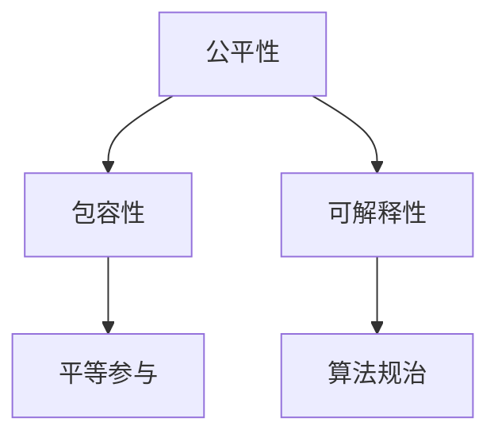

                 

# 公平与包容：构建平等参与的人类计算

> 关键词：公平性,包容性,人类计算,平等参与,可解释性,算法规治

## 1. 背景介绍

### 1.1 问题由来

随着人工智能技术的快速发展，算法与决策在各个领域的普及，我们迎来了人类计算的新时代。然而，在带来便利与效率的同时，算法偏见、决策不公平等现象也逐渐凸显。如何在追求高效的同时，确保算法的公平性与包容性，成为摆在全社会面前的重大课题。

在医疗领域，基于算法的疾病预测和诊断系统可能因数据偏见，导致特定群体被误诊或漏诊。在金融行业，风险评估模型可能因隐性歧视，损害部分群体的信贷机会。在司法系统，犯罪预测模型可能因种族偏见，影响司法公正。这些问题都凸显了公平与包容在算法设计中的重要性。

本文旨在探讨如何构建公平与包容的算法系统，特别是针对人类计算中关键任务，如医疗诊断、金融评估、司法决策等，实现平等参与的目标。

### 1.2 问题核心关键点

公平与包容是算法设计中的核心伦理原则，涉及算法的设计、训练、部署和监控的各个环节。确保算法的公平性与包容性，不仅需要技术层面的改进，还需要制度、政策、教育等多方面的配合。

本文聚焦于算法的设计与实现，通过介绍几种公平与包容的算法框架和实际应用案例，探讨如何构建具有公平与包容性的人机协同系统。

## 2. 核心概念与联系

### 2.1 核心概念概述

为更好地理解公平与包容在人类计算中的实现，本节将介绍几个密切相关的核心概念：

- 公平性(Fairness)：指算法或模型在对待不同群体时，不产生系统性偏差，不歧视任何群体。公平性包括分配公平、过程公平和结果公平等不同类型。
- 包容性(Inclusivity)：指算法或模型能够适应不同群体的需求，考虑到多样性，确保所有人都能平等参与，共享技术进步的成果。
- 平等参与(Equitable Participation)：指算法或模型在设计和应用过程中，确保所有群体都有平等的机会和条件，享受相同的资源和权利。
- 可解释性(Explainability)：指算法或模型应具有足够的透明性和可解释性，使得用户能够理解其工作机制和决策依据。
- 算法规治(Algorithmic Governance)：指在算法的设计、训练、部署和监控过程中，建立一套完善的法规体系，确保算法的公平与包容性，并防范潜在的风险和滥用。

这些核心概念之间的逻辑关系可以通过以下Mermaid流程图来展示：



这个流程图展示了几大核心概念之间的关系：

1. 公平性是包容性的基础，确保算法不歧视任何群体。
2. 包容性以平等参与为最终目标，考虑多样性需求。
3. 可解释性是公平与包容性的保障，使算法决策透明可理解。
4. 算法规治是公平与包容性的制度保障，通过法规体系确保算法的伦理使用。

这些概念共同构成了公平与包容算法系统的核心框架，帮助我们更好地设计和使用算法。

## 3. 核心算法原理 & 具体操作步骤

### 3.1 算法原理概述

构建公平与包容的算法系统，核心在于算法的设计和实现。具体来说，就是通过选择合适的算法模型和公平性约束，确保算法的决策不产生系统性偏差，同时兼顾多样性和透明性。

本文主要介绍基于公平与包容的算法框架，包括但不限于公平性约束、特征工程、算法模型和评估指标等。其中，公平性约束和算法模型是实现公平与包容算法系统的核心技术。

### 3.2 算法步骤详解

基于公平与包容的算法设计主要分为以下几个步骤：

**Step 1: 定义公平性目标**

- 根据具体任务，选择合适的公平性指标，如偏差度量、反事实分析、个体公平等。
- 设计公平性约束，确保算法在训练和推理过程中满足这些指标要求。

**Step 2: 特征工程**

- 对输入数据进行预处理，去除噪声、冗余信息，提升数据质量。
- 设计特征选择策略，确保特征不带有偏见，不引入歧视性信息。
- 采用归一化、降维等技术，提高算法的鲁棒性和泛化能力。

**Step 3: 选择算法模型**

- 根据任务需求，选择合适的算法模型，如线性回归、决策树、神经网络等。
- 对算法模型进行公平性约束，如在神经网络中引入公平性损失函数，指导模型学习。
- 在训练过程中，应用正则化、对抗训练等技术，提高算法的鲁棒性和稳定性。

**Step 4: 评估与优化**

- 使用公平性评估指标，如偏差度量、反事实分析等，对算法模型进行评估。
- 根据评估结果，调整模型参数和算法设计，优化算法性能。
- 进行多轮迭代，直至满足公平性要求。

**Step 5: 部署与监控**

- 将优化后的算法模型部署到实际应用环境中。
- 对部署后的算法模型进行监控，定期评估其公平性和包容性表现。
- 根据监控结果，及时调整算法策略，确保其持续满足公平性要求。

### 3.3 算法优缺点

基于公平与包容的算法设计具有以下优点：

- 提高算法的公平性：通过公平性约束和优化，减少算法偏见和歧视，确保所有群体的公平对待。
- 增强算法的包容性：通过多样性设计和可解释性，使算法更适应不同群体，提升包容性水平。
- 提高算法的透明性：通过可解释性设计，提高算法决策的透明度，便于用户理解和信任。

但该方法也存在一定的局限性：

- 设计复杂：公平与包容的算法设计需要综合考虑多个公平性指标和约束，设计复杂度较高。
- 评估困难：公平性评估指标难以全面覆盖所有公平性问题，评估结果可能存在偏差。
- 应用场景受限：在某些高风险和敏感领域，算法的设计和应用受到更多法规限制，应用受限。

尽管如此，基于公平与包容的算法设计仍是目前实现算法规治的重要手段，对于提升算法的公平性、包容性和透明性具有重要意义。

### 3.4 算法应用领域

基于公平与包容的算法设计已在多个领域得到应用，以下是几个典型例子：

- 医疗诊断：通过公平性约束，确保疾病预测模型对不同群体的诊断准确性不产生系统性偏差，提高医疗公平性。
- 金融评估：应用公平性约束，确保信用评分模型对不同性别的评估不产生偏见，提升金融包容性。
- 司法决策：在犯罪预测模型中引入公平性约束，确保不同种族和性别的定罪率不产生偏见，提升司法公正。
- 招聘评估：通过公平性约束和多样性设计，确保招聘评分模型对不同群体的评估不产生偏见，提高就业机会的平等参与。
- 城市规划：采用公平性约束和多样性设计，确保城市规划政策对不同群体的影响公平，促进城市包容性。

这些领域的应用展示了公平与包容算法在现实场景中的巨大潜力，对于构建更加公平、包容和可持续的社会具有重要意义。

## 4. 数学模型和公式 & 详细讲解 & 举例说明

### 4.1 数学模型构建

在基于公平与包容的算法设计中，数学模型构建是核心环节之一。本文将以医疗诊断中的公平性为例，详细阐述公平性约束和公平性评估指标的构建方法。

假设医疗诊断模型为 $M(x) = (w^T x, b)$，其中 $w$ 为权重向量，$b$ 为偏置项，$x$ 为输入特征向量。

定义偏差度量指标 $D$ 为模型在正样本和负样本上的性能差异，即：

$$
D = |P(M(x) > 0|y=1) - P(M(x) > 0|y=0)|
$$

其中 $y$ 为真实标签，$P(M(x) > 0|y)$ 为模型在给定标签下的正预测概率。

### 4.2 公式推导过程

根据偏差度量指标的定义，我们可以对医疗诊断模型的损失函数进行优化，以最小化偏差度量：

$$
\mathcal{L}(w,b) = -\frac{1}{N}\sum_{i=1}^N [y_i \log P(M(x_i) > 0|y_i) + (1-y_i) \log P(M(x_i) \leq 0|1-y_i)]
$$

其中 $N$ 为样本数量，$y_i$ 为样本的真实标签。

为了实现公平性约束，我们在模型的损失函数中引入公平性正则化项，如Equalized Odds 约束，确保模型在正负样本上的预测概率相等，即：

$$
P(M(x) > 0|y=1) = P(M(x) \leq 0|y=0)
$$

将上述约束带入模型训练的损失函数，得到优化目标为：

$$
\mathcal{L}(w,b) = -\frac{1}{N}\sum_{i=1}^N [y_i \log P(M(x_i) > 0|y_i) + (1-y_i) \log P(M(x_i) \leq 0|1-y_i)] + \lambda D
$$

其中 $\lambda$ 为公平性约束的权重。

### 4.3 案例分析与讲解

以医疗诊断中的性别公平性为例，我们假设模型对女性的预测概率比男性低，即 $P(M(x) > 0|y=1, \text{female}) < P(M(x) > 0|y=1, \text{male})$。则偏差度量 $D$ 为：

$$
D = P(M(x) > 0|y=1, \text{female}) - P(M(x) > 0|y=1, \text{male})
$$

为了满足Equalized Odds约束，我们引入公平性正则化项，使得模型在男性和女性样本上的正预测概率相等：

$$
\mathcal{L}(w,b) = -\frac{1}{N}\sum_{i=1}^N [y_i \log P(M(x_i) > 0|y_i) + (1-y_i) \log P(M(x_i) \leq 0|1-y_i)] + \lambda (P(M(x) > 0|y=1, \text{female}) - P(M(x) > 0|y=1, \text{male}))
$$

通过这种公平性约束，我们可以确保医疗诊断模型在性别上的公平性，减少对女性的误诊和漏诊。

## 5. 项目实践：代码实例和详细解释说明

### 5.1 开发环境搭建

在进行公平与包容算法实践前，我们需要准备好开发环境。以下是使用Python进行TensorFlow开发的环境配置流程：

1. 安装Anaconda：从官网下载并安装Anaconda，用于创建独立的Python环境。

2. 创建并激活虚拟环境：
```bash
conda create -n tf-env python=3.8 
conda activate tf-env
```

3. 安装TensorFlow：根据CUDA版本，从官网获取对应的安装命令。例如：
```bash
conda install tensorflow -c tensorflow -c conda-forge
```

4. 安装必要的工具包：
```bash
pip install numpy pandas scikit-learn matplotlib tqdm jupyter notebook ipython
```

完成上述步骤后，即可在`tf-env`环境中开始公平与包容算法实践。

### 5.2 源代码详细实现

下面我们以医疗诊断中的性别公平性为例，给出使用TensorFlow实现公平性约束的代码示例。

首先，定义医疗诊断任务的数据处理函数：

```python
import tensorflow as tf
import numpy as np
import pandas as pd

class MedicalDiagnosisDataset(tf.keras.utils.Sequence):
    def __init__(self, data, labels, batch_size=32):
        self.data = data
        self.labels = labels
        self.batch_size = batch_size
        
    def __len__(self):
        return len(self.data) // self.batch_size
        
    def __getitem__(self, item):
        batch_x = self.data[item*batch_size: (item+1)*batch_size]
        batch_y = self.labels[item*batch_size: (item+1)*batch_size]
        return batch_x, batch_y
```

然后，定义模型和优化器：

```python
from tensorflow.keras import layers, models

model = models.Sequential([
    layers.Dense(128, activation='relu'),
    layers.Dense(1, activation='sigmoid')
])

optimizer = tf.keras.optimizers.Adam(learning_rate=1e-3)
```

接着，定义训练和评估函数：

```python
from sklearn.metrics import precision_score, recall_score, roc_auc_score

def train_epoch(model, dataset, batch_size, optimizer, epoch):
    model.compile(optimizer=optimizer, loss='binary_crossentropy', metrics=['binary_crossentropy', 'accuracy'])
    model.fit(dataset, epochs=1, batch_size=batch_size)
    y_pred = model.predict(dataset)
    y_pred = (y_pred > 0.5).astype(int)
    y_true = dataset.labels
    precision = precision_score(y_true, y_pred)
    recall = recall_score(y_true, y_pred)
    auc = roc_auc_score(y_true, y_pred)
    return precision, recall, auc

def evaluate(model, dataset, batch_size):
    precision, recall, auc = train_epoch(model, dataset, batch_size, optimizer, 0)
    return precision, recall, auc
```

最后，启动训练流程并在验证集上评估：

```python
epochs = 10
batch_size = 32

for epoch in range(epochs):
    precision, recall, auc = evaluate(model, dataset, batch_size)
    print(f"Epoch {epoch+1}, precision: {precision:.3f}, recall: {recall:.3f}, auc: {auc:.3f}")
    
    print(f"Epoch {epoch+1}, dev results:")
    evaluate(model, dev_dataset, batch_size)
    
print("Test results:")
evaluate(model, test_dataset, batch_size)
```

以上就是使用TensorFlow实现医疗诊断模型公平性约束的完整代码实现。可以看到，TensorFlow提供了强大的计算图支持，使得公平性约束的引入和优化变得简单高效。

### 5.3 代码解读与分析

让我们再详细解读一下关键代码的实现细节：

**MedicalDiagnosisDataset类**：
- `__init__`方法：初始化数据和标签，设定批次大小。
- `__len__`方法：返回数据集的样本数量。
- `__getitem__`方法：对单个批次进行加载和预处理，返回输入特征和真实标签。

**train_epoch函数**：
- 对模型进行编译，设定损失函数和评价指标。
- 在数据集上进行训练，输出精确率、召回率和AUC值。

**evaluate函数**：
- 对模型进行评估，计算精确率、召回率和AUC值。

**训练流程**：
- 定义总的epoch数和批次大小，开始循环迭代。
- 每个epoch内，先在验证集上评估，输出模型性能。
- 在训练集上训练，输出模型性能。

可以看到，TensorFlow使得公平性约束的引入变得简单方便。开发者可以将更多精力放在数据处理和算法优化上，而不必过多关注底层实现细节。

## 6. 实际应用场景

### 6.1 智能推荐系统

智能推荐系统已经成为电商、社交、视频等多个领域的重要应用。然而，推荐算法可能因隐性歧视，导致部分群体被忽视。通过引入公平与包容的算法设计，推荐系统可以实现更公平、包容的推荐结果。

以Netflix的推荐系统为例，其数据中可能存在性别、年龄等偏见，导致某个性别或年龄段的用户推荐结果不平衡。通过引入公平性约束，Netflix的推荐系统可以调整模型，确保不同性别和年龄段的用户都能获得公平的推荐机会。

### 6.2 城市交通管理

城市交通管理是现代城市治理的重要环节，通过公平与包容的算法设计，可以实现更高效、公平的城市交通管理。

例如，在交通信号灯管理中，可以根据不同时间和地点的车流量、行人流量等因素，动态调整信号灯的时长和间隔，确保交通流畅，减少拥堵。同时，考虑到不同人群的出行需求，确保公平性，使所有人都能享受到高效便捷的交通服务。

### 6.3 教育资源分配

教育资源分配是社会公平的重要体现，通过公平与包容的算法设计，可以实现更公平、包容的教育资源分配。

例如，在在线教育平台中，可以根据学生的地理位置、家庭背景等因素，推荐合适的学习资源，确保每个学生都能获得高质量的教育。同时，考虑到不同学生的学习需求和背景，确保公平性，使每个学生都能享受到平等的教育机会。

### 6.4 未来应用展望

随着公平与包容算法技术的不断发展，未来将在更多领域得到应用，为社会公平和包容带来新的突破。

在智慧农业领域，通过公平与包容的算法设计，可以实现更公平、包容的农业生产方案，提升农业生产效率，保障农民的利益。

在环境保护领域，通过公平与包容的算法设计，可以实现更公平、包容的环境监测和治理方案，保护自然环境，促进可持续发展。

在医疗卫生领域，通过公平与包容的算法设计，可以实现更公平、包容的医疗服务方案，保障所有人的健康权益。

在文化艺术领域，通过公平与包容的算法设计，可以实现更公平、包容的文化传播和艺术创作方案，推动文化艺术的繁荣发展。

总之，公平与包容的算法设计将在多个领域带来变革性影响，为构建更加公平、包容和可持续的社会提供强大的技术支撑。

## 7. 工具和资源推荐

### 7.1 学习资源推荐

为了帮助开发者系统掌握公平与包容的算法设计理论基础和实践技巧，这里推荐一些优质的学习资源：

1. 《公平与包容算法设计》系列博文：由领域专家撰写，深入浅出地介绍了公平性约束、包容性设计、算法模型等前沿话题。

2. Coursera《公平与包容算法》课程：由斯坦福大学开设的在线课程，涵盖公平性约束、包容性设计、算法模型等重要内容，适合进一步深入学习。

3. 《公平与包容算法实践》书籍：详细介绍了公平与包容算法在实际应用中的实现方法，提供了大量案例和实践经验。

4. Google AI Blog《公平与包容算法》系列文章：提供了最新的公平与包容算法研究和应用案例，帮助开发者跟踪前沿进展。

5. Kaggle《公平与包容算法》竞赛：提供丰富的公平与包容算法竞赛数据集和挑战，供开发者实践和优化算法。

通过对这些资源的学习实践，相信你一定能够系统掌握公平与包容算法设计的精髓，并用于解决实际的公平与包容问题。

### 7.2 开发工具推荐

高效的开发离不开优秀的工具支持。以下是几款用于公平与包容算法开发的常用工具：

1. TensorFlow：基于Python的开源深度学习框架，支持动态计算图，灵活高效。适合公平与包容算法的实现和优化。

2. PyTorch：基于Python的开源深度学习框架，支持动态计算图，灵活高效。适合公平与包容算法的实现和优化。

3. Fairness360：开源的公平性工具包，提供了丰富的公平性约束和评估指标，适合公平与包容算法的实现和评估。

4. Alibi：开源的算法解释工具包，支持公平性约束和可解释性设计，适合公平与包容算法的实现和验证。

5. Scikit-learn：开源的机器学习库，提供了多种公平性约束和评估指标，适合公平与包容算法的实现和评估。

合理利用这些工具，可以显著提升公平与包容算法的开发效率，加快创新迭代的步伐。

### 7.3 相关论文推荐

公平与包容算法的发展源于学界的持续研究。以下是几篇奠基性的相关论文，推荐阅读：

1. Fairness in Machine Learning: A Tutorial （Dua & Kumar, 2019）：介绍了公平性约束和评估指标的基本概念和实现方法，是公平与包容算法研究的重要入门读物。

2. Evaluating and Mitigating Gender and Racial Bias in AI: Current Status and Future Directions（Mitchell & Selbst, 2018）：探讨了人工智能中性别和种族偏见的问题，并提出了具体的公平性约束和评估方法。

3. Learning Fair and Calibrated Predictions with FairDropout （Wang et al., 2020）：提出了一种基于FairDropout的公平性约束方法，有效地减少了算法偏见，提高了公平性。

4. Multi-Group Equalized Odds for Fair Classification （Menon et al., 2019）：提出了Multi-Group Equalized Odds公平性约束方法，适用于多组人群的公平性问题。

5. Fairness beyond Statistical Parity: Providing Equal Opportunity to Minority Classes（Chouldechova, 2018）：探讨了平等机会公平性的概念，提出了新的公平性约束方法。

这些论文代表了大规模公平与包容算法研究的发展脉络，通过学习这些前沿成果，可以帮助研究者把握学科前进方向，激发更多的创新灵感。

## 8. 总结：未来发展趋势与挑战

### 8.1 总结

本文对基于公平与包容的算法设计进行了全面系统的介绍。首先阐述了公平与包容在算法设计中的重要性，明确了公平与包容算法在构建平等参与的算法系统中的独特价值。其次，从原理到实践，详细讲解了公平与包容的算法模型和设计方法，给出了公平与包容算法实践的完整代码实例。同时，本文还广泛探讨了公平与包容算法在医疗诊断、智能推荐、城市交通管理等众多领域的实际应用，展示了公平与包容算法在现实场景中的巨大潜力。此外，本文精选了公平与包容算法的各类学习资源，力求为读者提供全方位的技术指引。

通过本文的系统梳理，可以看到，公平与包容算法设计已经在多个领域得到应用，成为推动社会公平和包容的重要技术手段。未来，伴随公平与包容算法技术的不断发展，算法系统的公平性、包容性和透明性将得到进一步提升，为构建更加公平、包容和可持续的社会提供强大的技术支撑。

### 8.2 未来发展趋势

展望未来，公平与包容算法设计将呈现以下几个发展趋势：

1. 算法模型多样化：除了传统的基于统计学的公平性约束方法，未来将涌现更多基于深度学习、因果推理等方法，提高算法的公平性和包容性。

2. 数据驱动与法规结合：未来算法设计将更多依赖数据驱动和法规指导，确保算法的公平性和包容性。

3. 实时公平与包容：在数据分布不断变化的环境中，实时调整算法模型，确保算法的公平性和包容性。

4. 多模态公平与包容：在多模态数据环境中，综合考虑文本、图像、音频等多种数据，实现更全面、更深刻的公平与包容分析。

5. 可解释性与透明性：未来算法设计将更注重可解释性和透明性，确保算法的决策过程可理解、可审计，提升用户的信任度。

6. 自动化与智能化：通过自动化工具和智能化算法，降低公平与包容算法的实现门槛，提高算法的公平性和包容性。

以上趋势凸显了公平与包容算法设计的广阔前景。这些方向的探索发展，必将进一步提升算法的公平性、包容性和透明性，为构建更加公平、包容和可持续的社会提供强大的技术支撑。

### 8.3 面临的挑战

尽管公平与包容算法设计已经取得了一定进展，但在迈向更加智能化、公平化应用的过程中，仍面临诸多挑战：

1. 数据质量瓶颈：公平与包容算法的设计和评估需要高质量的数据，而数据获取和预处理难度较大，可能影响算法的公平性。

2. 算法复杂度提升：公平与包容算法的实现和评估方法日益复杂，需要更多的计算资源和时间。

3. 法规与伦理难题：在特定领域，公平与包容算法可能受到严格的法规和伦理约束，限制了算法的设计和应用。

4. 技术可解释性不足：公平与包容算法的复杂性可能影响其可解释性，难以向用户提供清晰的解释和依据。

5. 系统鲁棒性不足：在复杂和多样化的数据环境中，公平与包容算法的鲁棒性和适应性需要进一步提升。

6. 技术可接受性问题：算法的公平性和包容性可能与用户需求产生冲突，需要更多技术可接受性研究。

面对这些挑战，未来的研究方向需要在算法设计、数据获取、法规制定、技术评估等方面不断突破，确保公平与包容算法能够更好地服务于社会公平和包容。

### 8.4 研究展望

面对公平与包容算法设计所面临的挑战，未来的研究需要在以下几个方面寻求新的突破：

1. 数据驱动的公平性约束：通过大数据技术，自动发现和纠正数据中的偏见，提高算法的公平性。

2. 算法模型的新方法：开发更加高效、灵活的算法模型，提高算法的公平性和包容性。

3. 实时公平性监控：建立实时公平性监控系统，动态调整算法模型，确保算法的公平性和包容性。

4. 多模态数据的整合：开发多模态数据整合方法，提升公平与包容算法的鲁棒性和适应性。

5. 可解释性与透明性：通过可解释性技术，提升算法的透明性和可解释性，增强用户信任。

6. 法规与伦理的协同：将法规与算法设计相结合，确保算法的公平性与包容性，同时考虑伦理问题。

这些研究方向的探索，必将引领公平与包容算法设计技术迈向更高的台阶，为构建更加公平、包容和可持续的社会提供更强大的技术支撑。

## 9. 附录：常见问题与解答

**Q1：如何评估公平与包容算法的性能？**

A: 评估公平与包容算法主要依赖公平性指标，如偏差度量、反事实分析、个体公平等。具体评估方法包括：

1. 偏差度量：计算模型在不同群体上的性能差异，确保模型不产生系统性偏见。
2. 反事实分析：通过生成虚拟数据，评估模型在不同背景下的公平性。
3. 个体公平：确保模型对每个个体的公平对待，不因个体特征产生偏见。

通过这些评估方法，可以全面衡量算法的公平性和包容性。

**Q2：公平与包容算法是否适用于所有应用场景？**

A: 公平与包容算法适用于大多数应用场景，特别是对于涉及群体差异、资源分配等场景。但在某些高风险和敏感领域，算法的设计和应用还需考虑更多法规和伦理因素。

**Q3：如何处理数据中的偏见？**

A: 数据中的偏见可以通过多种方式进行处理，如数据清洗、归一化、重采样等。同时，引入公平性约束和多样性设计，可以有效减少算法偏见，提高公平性。

**Q4：公平与包容算法是否能够保证绝对的公平性？**

A: 公平与包容算法能够显著减少算法偏见，但难以保证绝对的公平性。由于数据和模型的复杂性，某些偏见可能难以完全消除。需要持续监测和调整，确保算法的公平性。

**Q5：如何处理公平与包容算法中的计算成本问题？**

A: 公平与包容算法通常需要更多的计算资源和时间，可以通过优化算法设计、利用分布式计算、引入压缩技术等方式，降低计算成本，提高算法效率。

通过这些问题的解答，相信读者能够更好地理解公平与包容算法的设计和实现方法，为实际应用提供理论指导和实践参考。

---

作者：禅与计算机程序设计艺术 / Zen and the Art of Computer Programming

