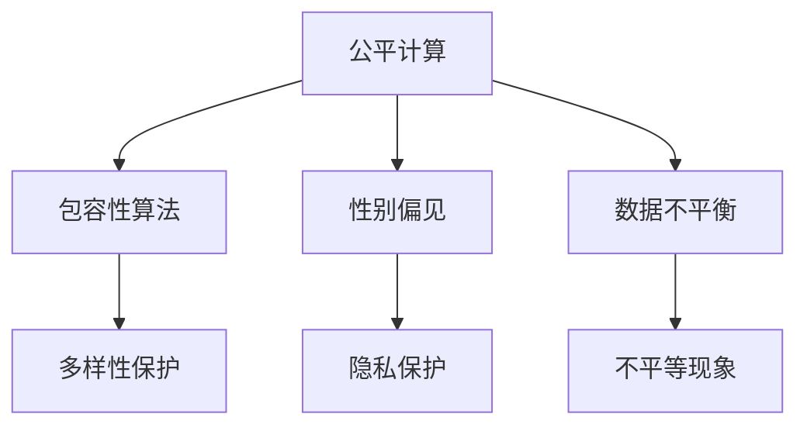

                 

# 公平与包容：构建平等参与的人类计算环境

> 关键词：公平计算, 包容性算法, 性别偏见, 多样性保护, 隐私保护, 人类计算环境

## 1. 背景介绍

在数字化快速发展的今天，计算技术与人们的生活越来越紧密地联系在一起。无论是科学研究、商业决策还是日常社交，计算工具都在提供强大的支持。然而，计算环境的公平与包容性问题日益凸显。技术偏见、数据不平衡、隐私侵害等问题正成为制约公平计算发展的瓶颈。如何在技术创新的同时，确保所有人都能平等参与计算环境，实现技术发展成果的普惠共享，是计算领域必须面对的重要课题。

### 1.1 问题由来

近年来，人工智能（AI）和大数据技术的发展在带来巨大经济效益的同时，也暴露出一些严重的公平与包容性问题。以AI应用为例，一些模型在性别、种族、年龄等方面的偏见备受诟病。例如，面部识别技术在肤色较深的少数族裔女性中的识别错误率显著高于其他群体。这种偏见不仅损害了特定群体的权益，也削弱了AI技术的社会认可度。在医疗、招聘、金融等关键领域，这种偏见甚至可能导致严重后果，引发社会关注和争议。

此外，数据不平衡、隐私保护等问题也亟需关注。数据分布不均可能导致模型在少数群体上性能不佳，隐私泄漏则可能导致个人数据被滥用。如何在保证数据质量的同时，保护用户隐私，构建一个公平、包容、安全的计算环境，是大数据时代计算技术发展面临的重大挑战。

## 2. 核心概念与联系

### 2.1 核心概念概述

为更好地理解公平计算和包容性算法，本节将介绍几个密切相关的核心概念：

- **公平计算（Fair Computing）**：指通过技术手段确保计算环境中的数据、算法等资源在不同群体间公平分配和访问，避免因技术偏见和数据不平衡导致的不平等现象。公平计算不仅关注结果公平，更强调过程公平和透明性。

- **包容性算法（Inclusive Algorithms）**：指在设计、训练和应用算法过程中，确保算法对不同群体具有平等的适用性和包容性。通过引入多样性、公平性、透明性等原则，算法能够避免对特定群体的歧视，提升算法的公平性。

- **性别偏见（Gender Bias）**：指在数据、算法和计算环境中存在的对性别的不公平对待，如性别歧视、性别刻板印象等。性别偏见可能导致算法的输出结果对特定性别群体不公平。

- **多样性保护（Diversity Protection）**：指在数据、算法和计算环境中，确保多样性元素的保留和表达。多样性保护旨在减少偏见和歧视，促进不同群体的平等参与。

- **隐私保护（Privacy Protection）**：指在数据处理和算法应用过程中，确保用户隐私不被侵犯，保障用户数据的安全性和匿名性。隐私保护是实现公平计算的重要前提。

这些核心概念之间的逻辑关系可以通过以下Mermaid流程图来展示：



这个流程图展示了一系列公平计算和包容性算法相关的核心概念及其之间的关系：

1. 公平计算通过确保数据和算法的公平性，避免性别偏见和其他不平等现象的发生。
2. 包容性算法通过引入多样性保护和隐私保护，进一步提升公平计算的效果。
3. 性别偏见和不平等现象是公平计算需要解决的重要问题。
4. 多样性保护和隐私保护是实现公平计算的前提条件。

这些概念共同构成了公平计算和包容性算法的理论基础，为其在实际应用中提供了重要指引。

## 3. 核心算法原理 & 具体操作步骤
### 3.1 算法原理概述

公平计算和包容性算法的核心思想是通过技术手段，确保计算环境中的资源分配和算法应用对所有群体公平、无偏见。其基本流程包括：

1. **数据公平性评估**：对训练数据进行公平性评估，识别数据中可能存在的偏见和歧视。
2. **算法设计调整**：在设计算法时引入多样性、公平性和透明性原则，避免算法对特定群体的歧视。
3. **数据增强与扩充**：通过数据增强和扩充，平衡数据分布，提升算法在少数群体上的性能。
4. **算法性能优化**：在算法训练和应用过程中，采用公平性约束和隐私保护措施，提升算法性能和安全性。

### 3.2 算法步骤详解

以下是基于公平计算和包容性算法的详细步骤：

**Step 1: 数据公平性评估**

- 收集数据：从不同来源收集数据，确保数据的多样性和代表性。
- 数据预处理：进行数据清洗、去噪和标准化，减少数据偏见和噪声。
- 偏见识别：使用统计方法和机器学习算法，识别数据中的性别偏见、种族偏见等。
- 偏见度量：通过计算偏见度量指标（如偏见方差、平均敏感度等），量化数据中的偏见程度。
- 结果报告：输出偏见识别和度量结果，供后续设计和优化使用。

**Step 2: 算法设计调整**

- 多样化数据集：设计多样化数据集，确保模型能够覆盖不同群体的特点。
- 公平性约束：在设计算法时，引入公平性约束，确保算法对所有群体的公平性。
- 包容性原则：在算法设计中，引入多样性、透明性和可解释性等原则，提升算法包容性。
- 试验验证：通过实验和测试，评估算法在多样性保护和隐私保护方面的表现。

**Step 3: 数据增强与扩充**

- 数据增强：通过数据增强技术，如数据扩充、数据合成等，丰富数据集的多样性。
- 数据扩充：使用数据扩充技术，如生成对抗网络（GAN）、回译等，增加少数群体的数据量。
- 数据再平衡：通过再平衡技术，调整数据分布，确保不同群体数据量的平衡。
- 数据标注：对增强和扩充后的数据进行标注，确保数据的质量和准确性。

**Step 4: 算法性能优化**

- 公平性约束：在算法训练过程中，使用公平性约束，确保算法对所有群体的公平性。
- 隐私保护：在算法应用过程中，采用隐私保护措施，如差分隐私、联邦学习等，保护用户隐私。
- 模型评估：通过公平性评估和隐私保护评估，确保算法在公平性和隐私保护方面的表现。
- 持续优化：在算法应用过程中，持续收集反馈数据，优化算法性能和公平性。

### 3.3 算法优缺点

公平计算和包容性算法的优点包括：

- 提升公平性：通过数据公平性评估和算法设计调整，有效减少算法偏见，提升算法的公平性。
- 增强包容性：通过多样性保护和隐私保护，确保不同群体能够平等参与计算环境。
- 实现透明性：通过公平性约束和可解释性原则，提升算法的透明性和可理解性。

其缺点包括：

- 数据依赖性：数据公平性评估和算法设计调整依赖于高质量、多样化的数据，获取数据成本高。
- 技术复杂性：公平计算和包容性算法需要复杂的技术手段，实现难度大。
- 隐私保护挑战：在保证隐私保护的同时，提升算法性能，需要进一步的研究和探索。

尽管存在这些局限性，但就目前而言，公平计算和包容性算法仍是大数据和人工智能应用的重要方向。未来相关研究的重点在于如何进一步降低数据依赖性，提高算法透明性和可解释性，同时兼顾隐私保护和算法性能。

### 3.4 算法应用领域

公平计算和包容性算法已经在多个领域得到了广泛应用，例如：

- **医疗诊断**：在医疗数据中引入公平性约束，确保算法对不同种族和性别的公平性。
- **金融风控**：在金融贷款、信用评分等应用中，通过多样性保护和隐私保护，避免性别偏见。
- **教育评估**：在学生评估和课程推荐中，采用包容性算法，提升算法对不同群体的适用性。
- **司法判决**：在司法判决中，引入公平性约束，确保算法对不同性别的公平性。
- **社交媒体**：在社交媒体内容审核中，通过隐私保护和多样性保护，避免算法对特定群体的歧视。

除了上述这些经典应用外，公平计算和包容性算法也被创新性地应用到更多场景中，如城市规划、环境保护、智慧农业等，为社会治理和经济发展提供了新的技术支持。

## 4. 数学模型和公式 & 详细讲解  
### 4.1 数学模型构建

本节将使用数学语言对公平计算和包容性算法的核心模型进行详细讲解。

假设有一个二分类任务，训练数据集为 $D = \{(x_i, y_i)\}_{i=1}^N$，其中 $x_i$ 为输入特征，$y_i$ 为标签，$y \in \{0, 1\}$。模型的输出为 $M(x)$，其中 $M$ 为模型参数。模型的公平性度量指标为 $\Delta$，表示模型对不同群体的公平性差距。

公平性度量指标的计算公式为：

$$
\Delta = \frac{1}{N} \sum_{i=1}^N |\mathbb{P}(y=1|x=x_i, y_i=0) - \mathbb{P}(y=1|x=x_i, y_i=1)|
$$

其中 $\mathbb{P}$ 表示概率。当 $\Delta=0$ 时，表示模型对不同群体的公平性相等。

### 4.2 公式推导过程

以下我们以二分类任务为例，推导公平性约束和隐私保护约束的数学模型。

**公平性约束**：

在二分类任务中，假设模型的预测概率为 $p(y=1|x)$。公平性约束要求模型对所有群体的公平性相等，即：

$$
\mathbb{E}_{x_i \sim D} [p(y=1|x=x_i)] = \frac{1}{2}
$$

对于数据集 $D$ 中的任意 $x_i$，期望概率应等于 $0.5$，即模型在所有群体上的预测概率分布应相等。

**隐私保护约束**：

隐私保护约束要求模型在保护用户隐私的同时，仍能获得较好的性能。一种常用的隐私保护技术是差分隐私（Differential Privacy, DP），其定义如下：

$$
\mathbb{P}(y=1|x=x_i) \leq \exp(\epsilon) \cdot \mathbb{P}(y=1|x=x_j)
$$

其中 $\epsilon$ 为隐私参数，表示隐私保护的强度。差分隐私保证在单个样本的加入或去除对模型预测结果的影响不超过 $\epsilon$。

### 4.3 案例分析与讲解

**案例分析**：

假设有一个招聘网站，需要对候选人的简历进行筛选。简历数据中包含性别、年龄、教育背景等信息。网站使用一个二分类模型 $M(x)$ 判断候选人是否适合某岗位，其中 $x$ 为简历特征，$y$ 为筛选结果。

**讲解**：

1. **数据公平性评估**：首先对简历数据进行公平性评估，识别其中可能存在的性别偏见。
2. **算法设计调整**：设计一个包容性算法，引入性别公平性约束，确保模型对男性和女性候选人的公平性。
3. **数据增强与扩充**：对少数群体的简历数据进行增强和扩充，平衡数据分布。
4. **算法性能优化**：在算法训练过程中，使用差分隐私约束，保护用户隐私。

## 5. 项目实践：代码实例和详细解释说明
### 5.1 开发环境搭建

在进行公平计算和包容性算法实践前，我们需要准备好开发环境。以下是使用Python进行Scikit-learn开发的开发环境配置流程：

1. 安装Anaconda：从官网下载并安装Anaconda，用于创建独立的Python环境。

2. 创建并激活虚拟环境：
```bash
conda create -n fairness-env python=3.8 
conda activate fairness-env
```

3. 安装Scikit-learn：
```bash
conda install scikit-learn
```

4. 安装相关工具包：
```bash
pip install numpy pandas matplotlib seaborn statsmodels tqdm joblib
```

完成上述步骤后，即可在`fairness-env`环境中开始公平计算和包容性算法实践。

### 5.2 源代码详细实现

这里以一个简单的性别公平性评估为例，使用Scikit-learn库进行Python代码实现。

首先，定义性别公平性评估函数：

```python
from sklearn.metrics import confusion_matrix

def gender_fairness(y_true, y_pred):
    # 计算混淆矩阵
    cm = confusion_matrix(y_true, y_pred)
    
    # 计算性别公平性
    fairness = (cm[1, 1] + cm[0, 0]) / (cm[0, 0] + cm[1, 1] + cm[0, 1] + cm[1, 0])
    
    return fairness
```

然后，定义数据集和模型：

```python
import numpy as np
from sklearn.linear_model import LogisticRegression

# 模拟性别公平性数据集
X = np.array([[0, 1], [1, 1], [1, 0], [0, 0]])
y = np.array([0, 1, 1, 0])

# 定义逻辑回归模型
model = LogisticRegression()

# 拟合模型
model.fit(X, y)
```

最后，评估模型的性别公平性：

```python
# 预测结果
y_pred = model.predict(X)

# 评估公平性
fairness = gender_fairness(y, y_pred)
print("Gender fairness score:", fairness)
```

以上就是使用Scikit-learn库对逻辑回归模型进行性别公平性评估的完整代码实现。可以看到，通过引入公平性评估函数，我们可以在模型训练过程中，实时监测和优化模型的公平性表现。

### 5.3 代码解读与分析

让我们再详细解读一下关键代码的实现细节：

**gender_fairness函数**：
- 计算混淆矩阵：通过调用Scikit-learn的混淆矩阵函数，计算真实标签和预测标签的混淆矩阵。
- 计算公平性：根据混淆矩阵，计算性别公平性，即男性和女性预测正确的样本数之和除以总样本数。

**数据集和模型**：
- 模拟数据集：使用numpy生成一个简单的二分类数据集，其中包含性别信息。
- 定义模型：使用Scikit-learn的逻辑回归模型进行训练和预测。

**公平性评估**：
- 预测结果：通过模型拟合和预测，获取预测结果。
- 评估公平性：调用gender_fairness函数，计算性别公平性得分。

在实际应用中，公平计算和包容性算法还需要更多技术和工具的支持，如多样性保护工具、隐私保护算法等。但核心的公平性评估思想和实现流程可以沿用上述示例。

## 6. 实际应用场景
### 6.1 医疗诊断

在医疗领域，公平计算和包容性算法可以显著提升诊断系统的公平性，避免因种族、性别等因素导致的诊断偏见。例如，在癌症诊断中，不同群体对癌症的易感性不同，而目前的医疗影像系统可能对某些群体的诊断效果不佳。通过引入公平性约束和隐私保护措施，构建包容性诊断算法，可以有效减少偏见，提升诊断系统的公平性和可靠性。

### 6.2 金融风控

在金融领域，公平计算和包容性算法可以用于贷款审批、信用评分等应用，避免因性别、年龄等因素导致的偏见。例如，在贷款审批中，算法应确保不同性别的申请人获得公平的信贷机会。通过多样性保护和隐私保护，构建包容性风控模型，可以有效提升系统的公平性和安全性。

### 6.3 教育评估

在教育领域，公平计算和包容性算法可以用于学生评估和课程推荐，提升算法的包容性。例如，在学生评估中，算法应确保不同群体的学生获得公平的评估机会。通过多样性保护和隐私保护，构建包容性评估模型，可以有效提升系统的公平性和可解释性。

### 6.4 未来应用展望

随着公平计算和包容性算法的不断发展，其在更多领域的应用前景广阔：

1. **智慧城市**：在智慧城市治理中，公平计算和包容性算法可以用于交通规划、环境保护、城市安全等应用，提升城市的公平性和包容性。
2. **环境保护**：在环境保护领域，公平计算和包容性算法可以用于环境监测、资源分配等应用，确保不同群体的环境权益。
3. **智慧农业**：在智慧农业中，公平计算和包容性算法可以用于作物病虫害预测、农业资源分配等应用，提升农业的公平性和可持续性。
4. **公共卫生**：在公共卫生领域，公平计算和包容性算法可以用于疫情预测、医疗资源分配等应用，提升公共卫生的公平性和可控性。
5. **社会治理**：在社会治理中，公平计算和包容性算法可以用于社会稳定、社区管理等应用，提升社会治理的公平性和透明性。

未来，公平计算和包容性算法将在更多领域得到应用，为社会公平和包容性发展提供强大的技术支撑。

## 7. 工具和资源推荐
### 7.1 学习资源推荐

为了帮助开发者系统掌握公平计算和包容性算法的理论基础和实践技巧，这里推荐一些优质的学习资源：

1. 《公平机器学习》书籍：全面介绍了公平计算和包容性算法的理论基础和实践应用，适合深入学习。
2. 公平机器学习课程：Coursera和edX等在线平台提供的多门公平机器学习课程，涵盖公平性评估、算法设计、数据扩充等内容。
3. 论文和博客：KDD、ICML等顶级会议和期刊上的多篇相关论文，以及社区博客和讲演，提供丰富的学习材料。
4. 开源工具和库：HuggingFace、Scikit-learn等开源工具和库，提供了丰富的公平计算和包容性算法实现和应用示例。

通过对这些资源的学习实践，相信你一定能够快速掌握公平计算和包容性算法的精髓，并用于解决实际的公平问题。

### 7.2 开发工具推荐

高效的开发离不开优秀的工具支持。以下是几款用于公平计算和包容性算法开发的常用工具：

1. Python：简单易学，生态丰富，适合公平计算和包容性算法开发。
2. Scikit-learn：常用的机器学习库，提供了丰富的公平性评估和算法实现。
3. TensorFlow：强大的深度学习框架，支持多样性保护和隐私保护等应用。
4. Keras：基于TensorFlow的高级API，适合快速开发公平计算和包容性算法。
5. Jupyter Notebook：交互式开发环境，适合数据处理和算法实验。

合理利用这些工具，可以显著提升公平计算和包容性算法开发效率，加快创新迭代的步伐。

### 7.3 相关论文推荐

公平计算和包容性算法的研究源于学界的持续研究。以下是几篇奠基性的相关论文，推荐阅读：

1. Fairness as a Constraint on Optimization and Sampling (FAIR)：提出了在优化和采样过程中引入公平性约束的方法，为公平计算提供了理论基础。
2. Inclusive Machine Learning：介绍了包容性机器学习的应用和挑战，提供了大量实践案例。
3. Fairness Induction for Deep Learning Models：研究了在深度学习模型中引入公平性约束的方法，提供了多种实现策略。
4. Privacy-Preserving Deep Learning for Fair Machine Learning：探讨了在隐私保护的前提下，实现公平机器学习的方法，提供了丰富的算法实现。
5. Fairness-Aware Deep Learning for Social Media Analytics：研究了在社交媒体分析中实现公平性约束的方法，提供了多种应用场景。

这些论文代表了大数据和人工智能领域在公平计算和包容性算法方面的最新进展。通过学习这些前沿成果，可以帮助研究者把握学科前进方向，激发更多的创新灵感。

## 8. 总结：未来发展趋势与挑战
### 8.1 研究成果总结

本文对公平计算和包容性算法进行了全面系统的介绍。首先阐述了公平计算和包容性算法的研究背景和意义，明确了其在提升算法公平性和包容性方面的独特价值。其次，从原理到实践，详细讲解了公平计算和包容性算法的数学模型和关键步骤，给出了公平计算和包容性算法开发的完整代码实例。同时，本文还广泛探讨了公平计算和包容性算法在医疗、金融、教育等众多领域的应用前景，展示了公平计算和包容性算法的发展潜力。

通过本文的系统梳理，可以看到，公平计算和包容性算法在数据公平性评估、算法设计调整、数据增强与扩充、算法性能优化等方面，提供了有效的技术手段，有助于构建平等参与的人类计算环境。公平计算和包容性算法的实践，将为社会公平和包容性发展提供强大的技术支撑。

### 8.2 未来发展趋势

展望未来，公平计算和包容性算法将呈现以下几个发展趋势：

1. **技术多样化**：未来将涌现更多多样化的公平计算和包容性算法，如多样性保护算法、隐私保护算法等，满足不同领域和场景的需求。
2. **数据自动化**：通过自动化数据生成和增强技术，提高数据质量和多样性，减少数据依赖性。
3. **模型可解释性**：提高算法的可解释性，增强公平性和透明性，提升算法的可信度和可接受性。
4. **伦理和社会规范**：将伦理和社会规范纳入公平计算和包容性算法的设计和评估，确保算法符合社会价值观。
5. **跨学科融合**：与其他学科（如心理学、社会学）结合，提升公平计算和包容性算法的社会学意义和应用效果。
6. **全球标准化**：制定公平计算和包容性算法的国际标准和规范，推动全球公平计算的普及和应用。

以上趋势凸显了公平计算和包容性算法的广阔前景。这些方向的探索发展，必将进一步提升计算环境的公平性，促进社会公平和包容性发展。

### 8.3 面临的挑战

尽管公平计算和包容性算法已经取得了瞩目成就，但在迈向更加智能化、普适化应用的过程中，它仍面临着诸多挑战：

1. **数据获取成本**：高质量、多样化的数据获取成本高，特别是在长尾应用场景中。如何降低数据依赖性，提高数据质量，是公平计算面临的重要挑战。
2. **技术复杂性**：公平计算和包容性算法需要复杂的技术手段，实现难度大。如何简化技术流程，降低实现门槛，是未来的研究方向。
3. **隐私保护与算法性能**：在保护用户隐私的同时，提升算法性能，需要进一步的研究和探索。如何平衡隐私保护和算法性能，是公平计算的重要课题。
4. **模型可解释性**：算法的可解释性欠缺，难以解释其内部工作机制和决策逻辑。如何赋予算法更强的可解释性，是未来需要解决的关键问题。
5. **跨领域应用**：在不同领域和场景中，公平计算和包容性算法的适用性和效果可能不同。如何构建通用的公平计算框架，是未来的重要研究方向。
6. **社会接受度**：公平计算和包容性算法的推广和应用，需要社会各界的理解和支持。如何提高算法在社会各界的接受度和认可度，是公平计算的重要挑战。

正视公平计算和包容性算法面临的这些挑战，积极应对并寻求突破，将是大数据和人工智能技术发展的重要方向。相信随着学界和产业界的共同努力，这些挑战终将一一被克服，公平计算和包容性算法必将在构建平等参与的人类计算环境中发挥重要作用。

### 8.4 研究展望

面对公平计算和包容性算法所面临的种种挑战，未来的研究需要在以下几个方面寻求新的突破：

1. **无监督和半监督学习**：摆脱对大规模标注数据的依赖，利用无监督和半监督学习，提高算法的公平性和泛化能力。
2. **多任务学习**：在多任务学习中引入公平性和包容性约束，提升算法在多样性任务上的表现。
3. **跨领域数据融合**：在不同领域和场景中，融合多种数据源和信息，构建更全面、准确的公平计算和包容性算法。
4. **隐私保护技术创新**：结合差分隐私、联邦学习等技术，提升隐私保护效果，同时提高算法性能。
5. **伦理和社会规范**：将伦理和社会规范纳入公平计算和包容性算法的设计和评估，确保算法符合社会价值观和法律法规。
6. **自动化公平性评估**：开发自动化公平性评估工具，提高公平计算的效率和效果，降低人工成本。
7. **可解释性增强**：提高算法的可解释性，增强算法的透明性和可接受性，提升社会信任度。

这些研究方向的探索，必将引领公平计算和包容性算法技术迈向更高的台阶，为构建安全、可靠、可解释、可控的智能系统铺平道路。面向未来，公平计算和包容性算法需要与其他人工智能技术进行更深入的融合，如知识表示、因果推理、强化学习等，多路径协同发力，共同推动自然语言理解和智能交互系统的进步。只有勇于创新、敢于突破，才能不断拓展公平计算和包容性算法的边界，让智能技术更好地造福人类社会。

## 9. 附录：常见问题与解答

**Q1：公平计算和包容性算法如何确保算法的公平性？**

A: 公平计算和包容性算法通过数据公平性评估、算法设计调整、数据增强与扩充、算法性能优化等步骤，确保算法的公平性。具体来说，数据公平性评估用于识别数据中可能存在的偏见和歧视，算法设计调整用于引入多样性、公平性和透明性原则，数据增强与扩充用于平衡数据分布，算法性能优化用于确保算法在保护用户隐私的同时，仍能获得较好的性能。通过这些步骤，可以有效减少算法偏见，提升算法的公平性。

**Q2：如何实现算法的包容性？**

A: 算法的包容性通过引入多样性保护和隐私保护等原则，确保算法对不同群体具有平等的适用性和包容性。具体来说，多样性保护指在数据和算法中保留和表达多样性元素，避免对特定群体的歧视。隐私保护指在算法应用过程中，采用差分隐私、联邦学习等技术，保护用户隐私。通过这些手段，算法可以更好地满足不同群体的需求，提升算法的包容性。

**Q3：公平计算和包容性算法如何处理隐私保护问题？**

A: 公平计算和包容性算法在处理隐私保护问题时，通常采用差分隐私、联邦学习等技术。差分隐私通过在算法中引入噪声，确保在单个样本的加入或去除对模型预测结果的影响不超过隐私参数 $\epsilon$。联邦学习通过分布式训练，将数据分布在多个节点上进行模型训练，避免了数据集中存储的风险。通过这些技术，公平计算和包容性算法可以在保护用户隐私的同时，实现公平性和包容性。

**Q4：公平计算和包容性算法在实际应用中需要注意哪些问题？**

A: 公平计算和包容性算法在实际应用中需要注意以下几个问题：
1. **数据质量**：高质量、多样化的数据是公平计算和包容性算法的前提，需要在数据收集和处理过程中确保数据质量。
2. **算法设计**：在设计算法时，需要引入公平性约束和隐私保护等原则，避免算法偏见和歧视。
3. **技术实现**：公平计算和包容性算法需要复杂的技术手段，需要在实现过程中考虑算法的可解释性、可扩展性和可维护性。
4. **模型评估**：在算法应用过程中，需要持续监测和评估算法性能和公平性，及时调整算法参数和策略。
5. **社会接受度**：公平计算和包容性算法的推广和应用，需要社会各界的理解和支持，需要在算法设计中考虑社会接受度。

这些问题的有效处理，将有助于公平计算和包容性算法在实际应用中发挥最大的价值。

**Q5：公平计算和包容性算法在未来还有哪些发展方向？**

A: 公平计算和包容性算法在未来还有以下发展方向：
1. **跨学科融合**：与其他学科（如心理学、社会学）结合，提升算法的社会学意义和应用效果。
2. **隐私保护技术创新**：结合差分隐私、联邦学习等技术，提升隐私保护效果，同时提高算法性能。
3. **自动化公平性评估**：开发自动化公平性评估工具，提高公平计算的效率和效果，降低人工成本。
4. **可解释性增强**：提高算法的可解释性，增强算法的透明性和可接受性，提升社会信任度。
5. **跨领域数据融合**：在不同领域和场景中，融合多种数据源和信息，构建更全面、准确的公平计算和包容性算法。
6. **伦理和社会规范**：将伦理和社会规范纳入公平计算和包容性算法的设计和评估，确保算法符合社会价值观和法律法规。

这些研究方向将进一步推动公平计算和包容性算法的进步，为构建平等参与的人类计算环境提供强大的技术支撑。

---

作者：禅与计算机程序设计艺术 / Zen and the Art of Computer Programming

