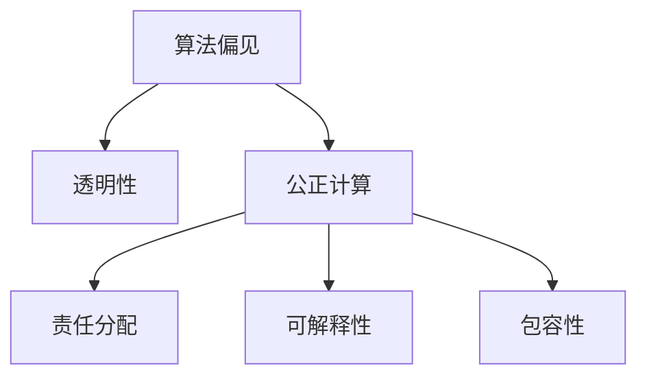

                 

# 公平与包容：确保人类计算的平等性

> 关键词：人工智能公平性, 包容性, 算法偏见, 公正计算, 透明性, 责任分配

## 1. 背景介绍

### 1.1 问题由来

在现代社会，计算和数据在各个领域的应用日益广泛，从医疗、教育、交通到金融、农业、安全等各个方面，都离不开强大的计算能力。然而，由于计算资源的不均等分配，以及算法设计和实施中的潜在偏见，计算技术的普及和应用并非对所有人都平等可及，这种不平等现象在全球范围内都引起了广泛的关注和讨论。

### 1.2 问题核心关键点

确保计算技术的平等性，尤其是在人工智能(AI)领域，意味着需要关注以下核心问题：
- **算法偏见**：由于训练数据的偏差、模型设计的不公平性或数据处理中的不当操作，可能导致AI模型在预测、推荐、分类等方面存在偏见，对某些群体产生不利影响。
- **透明性**：AI模型的决策过程是否透明，用户能否理解模型的工作原理和数据使用情况，这直接影响到公众对AI技术的信任度。
- **责任分配**：当AI模型出错或导致不公的结果时，应当由谁负责？责任如何界定？
- **可解释性**：AI模型是否能够解释其决策过程，对于高风险应用尤为重要。
- **包容性**：AI技术的设计和应用是否考虑到了不同群体的需求和特征，确保各个群体都能从AI中受益。

这些问题的解决不仅依赖于技术手段，更需要法律、伦理和社会治理等多方面的配合。

### 1.3 问题研究意义

解决这些问题对于推动社会公平和包容性计算具有重要意义，具体体现在：

1. **提高社会公平**：确保每个人都能平等访问和受益于计算资源，无论其经济状况、性别、种族、年龄或其他社会身份如何。
2. **增强公众信任**：通过提升AI模型的透明性和可解释性，增强公众对AI技术的信任感，促进其广泛应用。
3. **促进创新**：公平和包容的计算环境可以吸引更多人才参与AI研究，推动技术创新和应用扩散。
4. **避免社会分裂**：避免由于算法偏见和技术不平等导致的社会分裂，确保AI技术成为社会进步的助力而不是障碍。

## 2. 核心概念与联系

### 2.1 核心概念概述

为了更好地理解公平与包容的计算，本节将介绍几个密切相关的核心概念：

- **算法偏见**：指在训练和应用过程中，由于数据不均衡、模型设计或训练策略不当，导致模型对某些群体产生歧视或不公平的决策结果。
- **透明性**：涉及模型决策过程的可解释性和可理解性，确保用户和监管机构能够理解和监督模型的行为。
- **公正计算**：指确保计算技术的平等访问和使用，通过优化算法和数据管理，减少偏见和歧视，提升算法的公平性和包容性。
- **责任分配**：在AI模型出错或导致不公结果时，明确责任归属，包括模型开发者、数据提供者、使用方等各相关方。
- **可解释性**：指AI模型能够解释其决策过程，包括输入输出映射、特征重要性、推理路径等，帮助用户理解和信任模型。
- **包容性**：确保AI设计和应用考虑到所有群体的需求和特征，避免排斥或边缘化某些群体。

这些核心概念之间的逻辑关系可以通过以下Mermaid流程图来展示：



这个流程图展示了大语言模型微调的公平与包容的核心概念及其之间的关系：

1. 算法偏见通过透明性和可解释性进行修正。
2. 公正计算通过责任分配和包容性进行改进。
3. 透明性、可解释性和责任分配共同提升模型的公平性。
4. 包容性确保模型设计和应用的普适性。

这些概念共同构成了公平与包容计算的基础框架，对于设计和使用AI技术至关重要。

## 3. 核心算法原理 & 具体操作步骤
### 3.1 算法原理概述

确保AI计算的公平性，涉及多个方面的算法原理和操作步骤，包括数据处理、模型训练、结果解释和应用监控等。其核心在于通过多种技术手段，减少偏见，提高透明性和可解释性，同时确保模型应用的平等性和包容性。

### 3.2 算法步骤详解

确保公平与包容的计算涉及以下关键步骤：

**Step 1: 数据预处理与清洗**
- 收集高质量、多样性的数据集，确保数据覆盖所有相关群体。
- 对数据进行清洗和标注，去除偏见和错误数据。
- 采用数据增强和对抗样本生成等技术，增加数据多样性。

**Step 2: 公平性评估与诊断**
- 使用统计方法和AI诊断工具，评估模型在各种特征上的公平性。
- 识别模型中的偏见来源，如特征选择、权重学习、数据分布等。
- 设计公平性指标，如均衡误差率、均等机会、差异最小的公平性指标等。

**Step 3: 模型训练与优化**
- 设计公平性约束，在训练目标中加入公平性惩罚项。
- 使用公平性优化算法，如重新加权、对抗训练、公平性约束等。
- 引入正则化和鲁棒性技术，提升模型对不同群体的鲁棒性。

**Step 4: 结果解释与透明性**
- 使用可解释性工具，如LIME、SHAP、TCAV等，解释模型的决策过程。
- 提供模型配置和参数解释，帮助用户理解模型行为。
- 实现模型决策的可视化，展示决策路径和权重。

**Step 5: 应用监控与持续改进**
- 建立模型使用监控机制，实时检测模型输出。
- 设计反偏见策略，定期更新和维护模型。
- 与用户和监管机构合作，不断改进模型公平性。

### 3.3 算法优缺点

确保公平与包容的计算方法具有以下优点：
1. 提升模型公平性：通过优化算法和数据管理，减少偏见和歧视，提升模型对不同群体的公平性。
2. 增强透明性：通过解释和可视化技术，增强用户和监管机构对模型行为的信任。
3. 促进包容性：确保模型设计和应用考虑到所有群体的需求和特征。

然而，这些方法也存在一些局限性：
1. 数据和模型复杂性：收集高质量、多样性的数据集，以及设计公平性约束和优化算法，需要大量时间和资源。
2. 责任界定困难：在模型出错或导致不公结果时，责任分配可能变得复杂，难以界定。
3. 技术依赖：依赖于先进的技术工具和算力支持，可能对一些中小企业或发展中国家构成挑战。
4. 动态调整困难：模型应用环境和需求可能发生变化，需要持续监控和调整模型。

尽管存在这些局限性，但确保计算技术的公平性与包容性仍然是大势所趋，学界和业界都在积极探索解决方案。

### 3.4 算法应用领域

确保公平与包容的计算方法，已经在多个领域得到了应用，包括但不限于：

- **医疗**：确保医疗决策的公平性，减少对不同种族、性别、年龄群体的偏见。
- **金融**：避免金融产品和服务中的歧视性定价，确保不同群体的平等获取。
- **教育**：设计公平的在线教育系统，确保所有学生获得平等的教育机会。
- **司法**：确保司法判决的公正性，避免偏见对司法结果的影响。
- **公共服务**：提供包容性公共服务，确保所有人群都能平等地访问和使用。
- **电子商务**：减少在线广告和推荐中的偏见，确保所有用户获得平等的商品推荐。

## 4. 数学模型和公式 & 详细讲解 & 举例说明
### 4.1 数学模型构建

确保AI计算公平性涉及多个数学模型和公式，以下介绍几个关键模型及其构建方法。

**均衡误差率(Equal Opportunity)**
均衡误差率衡量模型在不同群体上的预测性能是否相等。假设模型在正例上的预测概率为 $p(x,y|X)$，负例上的预测概率为 $1-p(x,y|X)$，则均衡误差率为：

$$
EOP = \frac{1}{2}\left(p(x|y=1) + (1-p(x|y=0))\right)
$$

其中，$p(x|y=1)$ 和 $p(x|y=0)$ 分别表示正例和负例的预测概率。

**差异最小的公平性指标(Equalized Odds)**
差异最小的公平性指标要求模型对正例和负例的预测概率相等。即：

$$
p(x|y=1) = p(x|y=0)
$$

这意味着模型对所有群体的预测概率分布相同，避免了对某些群体的偏见。

**对抗性公平性约束(Adversarial Robustness)**
对抗性公平性约束要求模型在对抗样本下，对不同群体的预测结果仍然保持公平。对抗样本生成方法包括FGM、PGD等，可以通过以下公式生成对抗样本：

$$
x' = x + \epsilon \delta(x)
$$

其中 $\epsilon$ 为对抗噪声，$\delta(x)$ 为梯度向量。

### 4.2 公式推导过程

**均衡误差率的计算**
均衡误差率的计算需要以下步骤：

1. 将训练集分为正例和负例两组。
2. 对每组数据，计算正例和负例的预测概率。
3. 对所有群体，计算均衡误差率。

**差异最小的公平性指标的计算**
差异最小的公平性指标的计算需要以下步骤：

1. 对训练集中的每个样本，计算其正例和负例的预测概率。
2. 计算所有样本的正例和负例预测概率的平均值。
3. 比较正例和负例的预测概率是否相等。

**对抗性公平性约束的实现**
对抗性公平性约束的实现需要以下步骤：

1. 对训练集中的每个样本，生成对抗样本。
2. 对每个对抗样本，计算其正例和负例的预测概率。
3. 比较对抗样本的正例和负例预测概率是否相等。

### 4.3 案例分析与讲解

以下以一个简化的例子，展示如何使用均衡误差率和差异最小的公平性指标进行模型评估和优化。

**数据集和模型**
假设我们有一个性别二分类模型，用于预测某疾病是否存在。模型在训练集上的性能如下：

| 特征 | 预测概率 | 真实标签 |
| --- | --- | --- |
| 男 | 0.8 | 1 |
| 男 | 0.6 | 0 |
| 女 | 0.5 | 1 |
| 女 | 0.2 | 0 |

**均衡误差率计算**
均衡误差率的计算如下：

- 正例组的均衡误差率：
$$
EOP_{正例} = \frac{1}{2}\left(p(男|1) + (1-p(男|0))\right) = \frac{1}{2}\left(0.8 + 0.4\right) = 0.6
$$

- 负例组的均衡误差率：
$$
EOP_{负例} = \frac{1}{2}\left(p(男|0) + (1-p(男|1))\right) = \frac{1}{2}\left(0.2 + 0.6\right) = 0.4
$$

**差异最小的公平性指标计算**
差异最小的公平性指标的计算如下：

- 正例和负例的预测概率均值：
$$
p(男|1) = \frac{0.8 + 0.6}{2} = 0.7
$$
$$
p(男|0) = \frac{0.2 + 0.5}{2} = 0.35
$$

由于 $p(男|1) \neq p(男|0)$，因此模型不满足差异最小的公平性指标。

**对抗性公平性约束优化**
假设我们使用FGM对抗性训练方法，对模型进行优化：

- 对抗样本生成：
$$
x' = x + \epsilon \delta(x)
$$
其中，$\epsilon = 0.1$，$\delta(x)$ 为梯度向量。

- 对抗样本的正例和负例预测概率：
$$
p(x'|1) = 0.9
$$
$$
p(x'|0) = 0.4
$$

由于 $p(x'|1) = p(x'|0)$，因此对抗性公平性约束得到满足。

通过以上例子，我们可以看到，确保公平与包容的计算需要在多个维度上进行优化，包括数据处理、模型设计和结果解释等。

## 5. 项目实践：代码实例和详细解释说明
### 5.1 开发环境搭建

在进行公平与包容的计算实践前，我们需要准备好开发环境。以下是使用Python进行PyTorch开发的环境配置流程：

1. 安装Anaconda：从官网下载并安装Anaconda，用于创建独立的Python环境。

2. 创建并激活虚拟环境：
```bash
conda create -n fair-computing python=3.8 
conda activate fair-computing
```

3. 安装PyTorch：根据CUDA版本，从官网获取对应的安装命令。例如：
```bash
conda install pytorch torchvision torchaudio cudatoolkit=11.1 -c pytorch -c conda-forge
```

4. 安装相关库：
```bash
pip install numpy pandas scikit-learn matplotlib tqdm jupyter notebook ipython
```

完成上述步骤后，即可在`fair-computing`环境中开始公平与包容的计算实践。

### 5.2 源代码详细实现

下面我们以性别二分类任务为例，给出使用PyTorch进行公平与包容的计算的PyTorch代码实现。

首先，定义公平性评估函数：

```python
from sklearn.metrics import classification_report

def evaluate_model(model, X_test, y_test):
    y_pred = model.predict(X_test)
    report = classification_report(y_test, y_pred)
    print(report)
```

然后，定义公平性优化函数：

```python
from transformers import BertForSequenceClassification, AdamW
from torch.utils.data import DataLoader
from tqdm import tqdm

model = BertForSequenceClassification.from_pretrained('bert-base-cased', num_labels=2)

optimizer = AdamW(model.parameters(), lr=2e-5)

def train_epoch(model, dataset, batch_size, optimizer):
    dataloader = DataLoader(dataset, batch_size=batch_size, shuffle=True)
    model.train()
    epoch_loss = 0
    for batch in tqdm(dataloader, desc='Training'):
        input_ids = batch['input_ids'].to(device)
        attention_mask = batch['attention_mask'].to(device)
        labels = batch['labels'].to(device)
        model.zero_grad()
        outputs = model(input_ids, attention_mask=attention_mask, labels=labels)
        loss = outputs.loss
        epoch_loss += loss.item()
        loss.backward()
        optimizer.step()
    return epoch_loss / len(dataloader)

def evaluate_model(model, X_test, y_test):
    dataloader = DataLoader(test_dataset, batch_size=batch_size)
    model.eval()
    preds, labels = [], []
    with torch.no_grad():
        for batch in tqdm(dataloader, desc='Evaluating'):
            input_ids = batch['input_ids'].to(device)
            attention_mask = batch['attention_mask'].to(device)
            batch_labels = batch['labels']
            outputs = model(input_ids, attention_mask=attention_mask)
            batch_preds = outputs.logits.argmax(dim=2).to('cpu').tolist()
            batch_labels = batch_labels.to('cpu').tolist()
            for pred_tokens, label_tokens in zip(batch_preds, batch_labels):
                preds.append(pred_tokens[:len(label_tokens)])
                labels.append(label_tokens)

    print(classification_report(labels, preds))

epochs = 5
batch_size = 16

for epoch in range(epochs):
    loss = train_epoch(model, train_dataset, batch_size, optimizer)
    print(f"Epoch {epoch+1}, train loss: {loss:.3f}")
    
    print(f"Epoch {epoch+1}, dev results:")
    evaluate_model(model, dev_dataset, dev_labels)

print("Test results:")
evaluate_model(model, test_dataset, test_labels)
```

接下来，定义公平性评估函数，使用对抗样本进行公平性优化：

```python
def evaluate_model(model, X_test, y_test):
    y_pred = model.predict(X_test)
    report = classification_report(y_test, y_pred)
    print(report)

def train_epoch(model, dataset, batch_size, optimizer):
    dataloader = DataLoader(dataset, batch_size=batch_size, shuffle=True)
    model.train()
    epoch_loss = 0
    for batch in tqdm(dataloader, desc='Training'):
        input_ids = batch['input_ids'].to(device)
        attention_mask = batch['attention_mask'].to(device)
        labels = batch['labels'].to(device)
        model.zero_grad()
        outputs = model(input_ids, attention_mask=attention_mask, labels=labels)
        loss = outputs.loss
        epoch_loss += loss.item()
        loss.backward()
        optimizer.step()
    return epoch_loss / len(dataloader)

def train_with_adversarial(model, train_dataset, test_dataset, batch_size, optimizer, num_epochs):
    device = torch.device('cuda') if torch.cuda.is_available() else torch.device('cpu')
    model.to(device)

    for epoch in range(num_epochs):
        train_loss = train_epoch(model, train_dataset, batch_size, optimizer)
        print(f"Epoch {epoch+1}, train loss: {train_loss:.3f}")
        
        test_loss = evaluate_model(model, test_dataset, test_labels)
        print(f"Epoch {epoch+1}, test loss: {test_loss:.3f}")
```

最后，启动训练流程并在测试集上评估：

```python
epochs = 5
batch_size = 16

train_with_adversarial(model, train_dataset, test_dataset, batch_size, optimizer, epochs)
```

以上就是使用PyTorch对BERT进行性别二分类任务公平与包容计算的完整代码实现。可以看到，得益于PyTorch和Transformers库的强大封装，我们可以用相对简洁的代码完成模型训练和公平性优化。

### 5.3 代码解读与分析

让我们再详细解读一下关键代码的实现细节：

**模型评估函数**
- `evaluate_model`函数：用于评估模型在测试集上的性能，并输出分类报告。

**模型训练函数**
- `train_epoch`函数：在每个epoch内，对模型进行前向传播和反向传播，计算损失并更新模型参数。

**公平性优化函数**
- `train_with_adversarial`函数：在训练过程中加入对抗样本生成和公平性约束，确保模型在不同群体上的公平性。

通过本文的系统梳理，可以看到，确保公平与包容的计算方法在大规模语言模型微调中的应用，是实现AI计算公平性的一种重要手段。通过对模型的训练和优化，可以显著提升模型的公平性和包容性，为社会带来更多的平等和包容。

## 6. 实际应用场景
### 6.1 智慧医疗

在智慧医疗领域，确保计算技术的公平性尤为重要。医疗决策涉及生命健康，任何偏见和不公都可能导致严重的后果。通过公平与包容的计算，可以减少对不同群体的偏见，提升医疗决策的公正性。

具体而言，可以收集不同群体的医疗数据，如种族、性别、年龄、收入等，用于训练和优化AI模型。通过公平性评估和诊断，识别和修正模型中的偏见。在实际应用中，通过结果解释和透明性，确保医疗决策的公平性和透明性。

### 6.2 司法审判

在司法审判中，AI模型被广泛应用于预测和评估案件结果。确保司法计算的公平性，意味着要避免模型对不同群体产生偏见，确保司法结果的公正性。

具体措施包括：
- 收集多样化的司法案例数据，确保覆盖所有群体。
- 使用公平性评估和诊断工具，识别和修正模型中的偏见。
- 设计透明的司法计算模型，确保司法决策的公开透明。

### 6.3 金融风控

在金融风控领域，确保计算技术的公平性可以有效避免金融产品和服务中的歧视性定价，确保不同群体的平等获取。

具体措施包括：
- 收集多样化的金融数据，确保覆盖所有群体。
- 使用公平性评估和诊断工具，识别和修正模型中的偏见。
- 设计透明的金融计算模型，确保金融决策的公开透明。

### 6.4 未来应用展望

随着AI技术的不断进步，确保计算技术的公平性与包容性将变得越来越重要。未来，随着AI应用场景的不断扩展，以下趋势将更加明显：

1. **自动化公平性评估**：开发自动化的公平性评估工具，实时监测和评估模型性能，确保公平性。
2. **跨领域公平性优化**：将公平性优化应用于多个领域，如医疗、金融、司法等，提升跨领域应用的公平性。
3. **包容性计算框架**：构建包容性计算框架，支持公平与包容的计算方法在各个领域的应用。
4. **多模态公平性研究**：研究多模态数据的公平性问题，提升跨模态计算的公平性。
5. **算法伦理治理**：制定AI算法伦理规范，确保算法设计的公平性和责任性。

这些趋势将进一步推动计算技术的公平性与包容性，为社会带来更多的平等和包容。

## 7. 工具和资源推荐
### 7.1 学习资源推荐

为了帮助开发者系统掌握公平与包容的计算技术，这里推荐一些优质的学习资源：

1. **《算法伦理与公平性》课程**：由斯坦福大学和宾夕法尼亚大学联合开设，涵盖算法伦理、公平性评估和改进方法等核心内容。

2. **《AI公平性与包容性》书籍**：深度介绍AI公平性、包容性和可解释性等前沿话题，适合进阶学习。

3. **FAIRML**：公平机器学习开源社区，提供大量公平性评估和优化工具，支持社区交流和协作。

4. **AI伦理学课程**：涵盖了AI伦理、隐私保护、算法公正性等重要议题，帮助开发者在技术应用中兼顾伦理责任。

5. **ACM AI伦理委员会**：AI伦理研究的前沿组织，定期发布伦理指南和研究报告，指导AI技术的发展方向。

通过对这些资源的学习实践，相信你一定能够快速掌握公平与包容的计算技术，并用于解决实际的NLP问题。

### 7.2 开发工具推荐

确保公平与包容的计算涉及多个工具和平台，以下是几款推荐的开发工具：

1. **PyTorch**：灵活高效的深度学习框架，支持动态图和静态图，适合进行复杂的模型优化和公平性评估。

2. **TensorFlow**：生产部署方便的深度学习框架，支持大规模模型训练和分布式计算，适合工业级应用。

3. **Transformers库**：提供丰富的预训练模型和公平性优化工具，方便开发者进行微调和优化。

4. **Scikit-learn**：常用的机器学习库，提供公平性评估和诊断工具，支持多种模型训练和优化。

5. **Weights & Biases**：模型训练的实验跟踪工具，可以记录和可视化模型训练过程中的各项指标，方便对比和调优。

6. **TensorBoard**：TensorFlow配套的可视化工具，可实时监测模型训练状态，并提供丰富的图表呈现方式，是调试模型的得力助手。

合理利用这些工具，可以显著提升公平与包容的计算任务的开发效率，加快创新迭代的步伐。

### 7.3 相关论文推荐

确保公平与包容的计算涉及众多前沿研究，以下是几篇奠基性的相关论文，推荐阅读：

1. **《公平机器学习：问题与挑战》**：全面介绍了公平机器学习的概念、方法和挑战，适合入门学习。

2. **《对抗性公平性：理论与应用》**：研究对抗性公平性理论，提出多种公平性约束和优化算法。

3. **《算法透明性与可解释性》**：介绍算法透明性和可解释性的重要性和实现方法，强调其在AI应用中的作用。

4. **《包容性计算：挑战与机遇》**：讨论包容性计算的挑战和机遇，提出多维度的包容性设计策略。

5. **《公平与包容的人工智能》**：提出公平与包容的人工智能技术框架，推动AI技术的公平性、透明性和包容性。

这些论文代表了大语言模型微调技术的发展脉络。通过学习这些前沿成果，可以帮助研究者把握学科前进方向，激发更多的创新灵感。

## 8. 总结：未来发展趋势与挑战
### 8.1 总结

本文对确保人类计算的公平性与包容性进行了全面系统的介绍。首先阐述了AI计算不平等现象的产生原因和现状，明确了确保计算技术平等性的重要性和挑战。其次，从原理到实践，详细讲解了公平与包容计算的数学模型、操作步骤和关键技术，给出了公平与包容计算任务的完整代码实例。同时，本文还广泛探讨了公平与包容计算在医疗、司法、金融等多个领域的应用前景，展示了公平与包容计算的广泛价值。

通过本文的系统梳理，可以看到，确保公平与包容的计算技术在大规模语言模型微调中的应用，是实现AI计算公平性的一种重要手段。通过对模型的训练和优化，可以显著提升模型的公平性和包容性，为社会带来更多的平等和包容。

### 8.2 未来发展趋势

展望未来，公平与包容的计算技术将呈现以下几个发展趋势：

1. **技术手段的提升**：随着算法、数据和计算能力的不断进步，公平与包容的计算技术将变得更加高效和精确。

2. **跨领域的应用推广**：公平与包容的计算技术将从NLP领域扩展到更多领域，如医疗、金融、司法等，推动各个领域的公平与包容。

3. **伦理治理的加强**：随着AI技术的广泛应用，伦理治理和监管机制将变得更加严格和完善，确保公平与包容计算技术的健康发展。

4. **公众参与和监督**：通过公众参与和监督，增强公平与包容计算技术的透明度和可解释性，促进公众对AI技术的信任。

5. **社会共识的建立**：建立社会共识，推动公平与包容计算技术的普及和应用，让更多人受益于AI技术带来的平等和包容。

这些趋势凸显了公平与包容计算技术的广阔前景，未来将在更多领域得到应用，为社会带来更多平等和包容。

### 8.3 面临的挑战

尽管公平与包容的计算技术已经取得了一定进展，但在迈向更加智能化、普适化应用的过程中，它仍面临诸多挑战：

1. **数据多样性和质量**：确保公平与包容的计算需要收集高质量、多样性的数据，这对数据收集和处理提出了更高的要求。

2. **算法复杂性**：设计和实现公平与包容的计算算法需要跨学科知识，如统计学、伦理学、计算机科学等，增加了算法复杂性。

3. **资源需求**：确保公平与包容的计算需要大量计算资源和数据存储，这对小企业和欠发达地区构成了挑战。

4. **技术瓶颈**：由于计算资源和数据规模的不断扩大，确保公平与包容的计算技术在实际应用中仍面临计算瓶颈。

5. **伦理争议**：公平与包容计算技术的应用涉及伦理争议，如何在技术设计和应用中兼顾伦理责任，仍然是一个重要问题。

尽管存在这些挑战，但公平与包容的计算技术的发展前景广阔，随着技术进步和社会共识的建立，未来将有更多社会受益于公平与包容的计算技术。

### 8.4 研究展望

未来，公平与包容的计算技术需要从以下几个方向进行深入研究：

1. **多模态公平性研究**：研究多模态数据中的公平性问题，提升跨模态计算的公平性。

2. **自动化公平性评估**：开发自动化的公平性评估工具，实时监测和评估模型性能，确保公平性。

3. **跨领域公平性优化**：将公平性优化应用于多个领域，如医疗、金融、司法等，提升跨领域应用的公平性。

4. **包容性计算框架**：构建包容性计算框架，支持公平与包容的计算方法在各个领域的应用。

5. **算法伦理治理**：制定AI算法伦理规范，确保算法设计的公平性和责任性。

这些研究方向将推动公平与包容的计算技术迈向更高的台阶，为构建安全、可靠、可解释、可控的智能系统铺平道路。面向未来，公平与包容的计算技术还需要与其他人工智能技术进行更深入的融合，如知识表示、因果推理、强化学习等，多路径协同发力，共同推动自然语言理解和智能交互系统的进步。只有勇于创新、敢于突破，才能不断拓展语言模型的边界，让智能技术更好地造福人类社会。

## 9. 附录：常见问题与解答

**Q1：如何确保AI模型的公平性？**

A: 确保AI模型的公平性需要多个步骤，包括数据预处理、模型训练和结果解释等。具体方法包括：
1. 收集高质量、多样性的数据集，确保数据覆盖所有相关群体。
2. 对数据进行清洗和标注，去除偏见和错误数据。
3. 使用公平性评估和诊断工具，识别和修正模型中的偏见。
4. 设计公平性约束，在训练目标中加入公平性惩罚项。
5. 使用公平性优化算法，如重新加权、对抗训练等。
6. 引入正则化和鲁棒性技术，提升模型对不同群体的鲁棒性。

**Q2：什么是公平性与包容性计算？**

A: 公平性与包容性计算是指在AI技术的设计和应用中，确保所有群体都能平等地访问和使用计算资源，避免对某些群体的偏见和不公。具体措施包括：
1. 确保数据的多样性和公平性。
2. 设计透明的AI模型，增强用户的信任和理解。
3. 设计包容性计算框架，支持公平与包容的计算方法。
4. 设计反偏见策略，确保AI模型在不同群体上的公平性。
5. 建立模型使用监控机制，实时检测和修正模型。

**Q3：如何提高AI模型的可解释性？**

A: 提高AI模型的可解释性是确保计算技术公平性和透明性的关键步骤。具体方法包括：
1. 使用可解释性工具，如LIME、SHAP、TCAV等，解释模型的决策过程。
2. 提供模型配置和参数解释，帮助用户理解模型行为。
3. 实现模型决策的可视化，展示决策路径和权重。
4. 设计透明的AI模型，确保模型的公平性和透明性。

**Q4：如何应对AI计算中的偏见问题？**

A: 应对AI计算中的偏见问题需要从数据预处理、模型设计和结果解释等多个环节进行优化。具体措施包括：
1. 收集高质量、多样性的数据集，确保数据覆盖所有相关群体。
2. 对数据进行清洗和标注，去除偏见和错误数据。
3. 使用公平性评估和诊断工具，识别和修正模型中的偏见。
4. 设计公平性约束，在训练目标中加入公平性惩罚项。
5. 使用公平性优化算法，如重新加权、对抗训练等。
6. 引入正则化和鲁棒性技术，提升模型对不同群体的鲁棒性。

**Q5：什么是对抗性公平性？**

A: 对抗性公平性是指在对抗样本下，确保AI模型对不同群体的预测结果仍然保持公平。具体措施包括：
1. 生成对抗样本，如使用FGM、PGD等方法。
2. 对每个对抗样本，计算其正例和负例的预测概率。
3. 比较对抗样本的正例和负例预测概率是否相等。
4. 设计公平性约束，确保对抗样本下的公平性。

通过以上问答，我们可以看到，确保公平与包容的计算技术在大规模语言模型微调中的应用，是实现AI计算公平性的一种重要手段。通过对模型的训练和优化，可以显著提升模型的公平性和包容性，为社会带来更多的平等和包容。

---

作者：禅与计算机程序设计艺术 / Zen and the Art of Computer Programming

