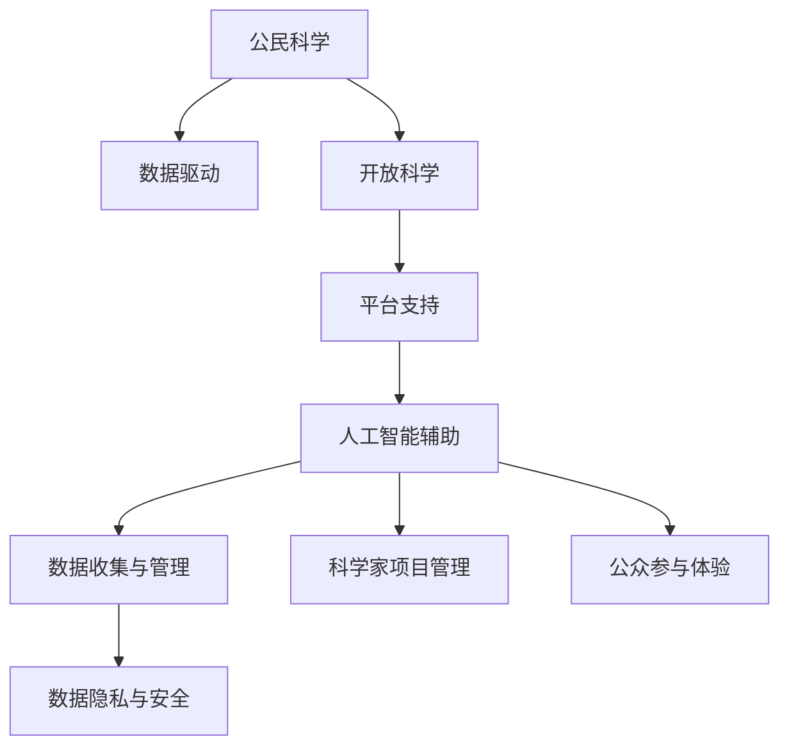

                 

# 公民科学平台：连接科学家与公众的桥梁

## 1. 背景介绍

### 1.1 问题由来
在当今信息爆炸的时代，科学研究的步伐被海量数据所推动。然而，数据的收集和分析往往需要耗费大量的人力和时间。同时，科学研究往往面临着专业性和复杂性较高的挑战，普通公众难以直接参与其中。

公民科学（Citizen Science）的概念由此产生，它是指普通公众参与科学研究，利用他们的观察和数据为科学家提供帮助，同时通过科学知识的学习提升自身的科学素养。这种模式不仅促进了科学研究的进展，也为公众提供了参与科学的机会，推动了科学知识的普及和传播。

然而，当前的公民科学平台在设计和运作上还存在诸多问题，如数据的收集和整合、科学家的项目管理和公众的参与体验等。如何构建一个高效、易用、安全的公民科学平台，成为亟需解决的问题。

### 1.2 问题核心关键点
本文聚焦于公民科学平台的设计和实现，其核心在于以下几个关键点：

- **数据收集与管理**：如何高效、稳定地收集公众数据，并进行合理的存储和处理。
- **科学家项目管理**：如何帮助科学家设定和组织项目，管理研究进程。
- **公众参与体验**：如何提升公众的参与体验，增加平台粘性。
- **数据隐私与安全**：如何保障公众数据的隐私安全，防止数据泄露和滥用。

这些关键点决定了公民科学平台的功能和用户体验，决定了平台能否有效地连接科学家与公众，促进科学研究的进展。

## 2. 核心概念与联系

### 2.1 核心概念概述

为更好地理解公民科学平台的设计思路，本节将介绍几个密切相关的核心概念：

- **公民科学**：指普通公众参与科学研究的过程。公众通过观测、记录、数据提交等方式，为科学家提供研究数据和见解。
- **数据驱动**：指基于数据的科学决策过程。通过收集和分析大量数据，揭示科学规律，指导科学研究。
- **开放科学**：指科学研究过程中的开放性和透明度，包括数据的开放共享、研究过程的公开透明等。
- **平台支持**：指构建公民科学平台，提供数据收集、项目管理、数据分析等支持，促进公众参与和科学研究的协同。
- **人工智能辅助**：指利用人工智能技术，提升数据处理、项目管理和用户参与体验，推动公民科学的发展。

这些核心概念之间的逻辑关系可以通过以下Mermaid流程图来展示：



这个流程图展示了大规模公民科学平台的设计框架：

1. 公众通过平台提交数据，平台负责数据收集与管理。
2. 科学家在平台上发起和管理项目，平台提供项目管理支持。
3. 平台利用人工智能技术，提升数据处理、项目管理、用户参与体验等各个环节。
4. 平台保障数据隐私与安全，确保数据合法合规使用。

这些概念共同构成了公民科学平台的设计原则，决定了平台的功能和用户流程。

## 3. 核心算法原理 & 具体操作步骤

### 3.1 算法原理概述

公民科学平台的核心算法原理基于数据驱动和人工智能辅助的设计理念，旨在通过平台收集、存储、处理公众数据，利用人工智能技术提升平台性能，帮助科学家高效管理项目，增加公众参与度，保障数据隐私与安全。

具体而言，公民科学平台的设计涉及以下关键算法和技术：

- **数据收集与管理算法**：负责高效收集和存储公众数据，包括数据收集策略、数据存储方式和数据处理技术。
- **项目管理算法**：帮助科学家设定和管理项目，包括任务分配、进度跟踪和结果分享等功能。
- **人工智能辅助算法**：利用机器学习、自然语言处理等技术，提升平台的用户体验和数据处理效率。
- **数据隐私与安全算法**：确保公众数据的安全与隐私，防止数据泄露和滥用。

### 3.2 算法步骤详解

公民科学平台的核心算法步骤可以分为以下几个部分：

**Step 1: 数据收集与管理算法**

1. **数据收集策略**：设计合适的数据收集策略，确保数据的多样性和完整性。例如，可以使用问卷调查、图像识别、传感器数据等多种形式收集数据。

2. **数据存储方式**：选择合适的数据存储方式，如分布式数据库、云存储等，确保数据的安全性和可扩展性。

3. **数据处理技术**：采用高效的数据处理技术，如大数据处理、机器学习等，进行数据清洗、分析与可视化。

**Step 2: 项目管理算法**

1. **任务分配**：帮助科学家分配任务，设定任务优先级和截止时间，确保项目按时完成。

2. **进度跟踪**：实时监控项目进度，通过可视化界面展示任务状态和进度。

3. **结果分享**：提供数据和研究成果的分享机制，促进科学知识的传播和利用。

**Step 3: 人工智能辅助算法**

1. **机器学习技术**：利用机器学习算法，对公众数据进行自动分类和分析，提升数据处理效率。

2. **自然语言处理技术**：采用自然语言处理技术，提升平台的用户交互体验，帮助公众更好地理解和使用平台。

3. **智能推荐系统**：利用推荐系统算法，向公众推荐合适的科学任务和项目，增加平台粘性。

**Step 4: 数据隐私与安全算法**

1. **数据加密**：采用数据加密技术，确保公众数据在传输和存储过程中的安全性。

2. **访问控制**：设定访问控制策略，确保只有授权人员才能访问和使用数据。

3. **审计与监控**：实时监控数据使用情况，定期进行审计，防止数据滥用。

### 3.3 算法优缺点

公民科学平台的核心算法具备以下优点：

1. **高效性**：通过数据驱动和人工智能辅助，平台可以高效处理大量数据，提升数据处理和分析效率。
2. **易用性**：通过友好的用户界面和智能推荐系统，平台能够提升公众的参与体验，增加平台粘性。
3. **安全性**：通过数据加密和访问控制等技术，平台能够保障公众数据的隐私和安全。

同时，该算法也存在一定的局限性：

1. **数据质量**：公众数据的质量和完整性往往难以保证，需要通过多渠道收集数据以弥补不足。
2. **算法复杂性**：平台的算法设计涉及多个技术领域，算法实现和维护的复杂度较高。
3. **用户信任**：公众对平台和科学家的信任是平台成功的基础，需要通过透明和公开的方式建立信任。

尽管存在这些局限性，但就目前而言，基于数据驱动和人工智能辅助的公民科学平台仍是最为主流的设计范式。未来相关研究的重点在于如何进一步降低算法复杂度，提高数据质量，建立更加透明和信任的平台机制。

### 3.4 算法应用领域

公民科学平台的应用领域非常广泛，涵盖了从生物多样性研究到环境监测，从天文学到气象学等众多领域。以下是几个典型应用场景：

- **生物多样性研究**：通过公民科学平台，公众可以提交关于野生动植物的照片和观察记录，科学家可以据此分析生物多样性的变化趋势。

- **环境监测**：公众可以通过手机APP提交水质、空气质量等环境监测数据，科学家可以利用这些数据进行环境污染的评估和治理。

- **天文观测**：公众可以参与天文观测项目，利用公民科学平台提交观测数据，科学家可以利用这些数据进行天文研究和科普教育。

- **气象学研究**：公众可以通过气象观测设备提交气象数据，科学家可以利用这些数据进行气候变化的研究和预测。

## 4. 数学模型和公式 & 详细讲解

### 4.1 数学模型构建

本节将使用数学语言对公民科学平台的设计进行更加严格的刻画。

设公民科学平台的任务数量为 $T$，公众数据为 $D=\{d_i\}_{i=1}^N$，其中 $d_i$ 为公众提交的数据。平台需要对公众数据进行预处理、分析，并在科学家的指导下进行项目管理和成果展示。

定义平台的任务分配策略为 $A$，项目进度跟踪为 $P$，数据分析结果为 $R$，数据隐私策略为 $S$。则公民科学平台的目标可以表示为：

$$
\maximize \sum_{i=1}^T R_i
$$

其中 $R_i$ 为第 $i$ 个项目的数据分析结果，通常为科研论文、报告等形式。

### 4.2 公式推导过程

以下我们以生物多样性研究项目为例，推导平台数据分析的数学模型。

设公众提交的观测数据为 $D=\{(d_{ij})\}_{i=1}^N$，其中 $d_{ij}$ 为第 $i$ 个公众在第 $j$ 次观测中的数据。平台需要对数据进行分类、清洗和统计，得到项目分析结果 $R_i$。

平台采用的数据处理算法为 $M$，包括数据分类、清洗、统计等步骤。设数据处理算法 $M$ 的效率为 $E$，则平台的数据分析效率可以表示为：

$$
E = \frac{1}{N} \sum_{i=1}^N \sum_{j=1}^J \frac{d_{ij}}{L_i}
$$

其中 $L_i$ 为项目 $i$ 的总观测次数，$J$ 为每次观测的数据量。

通过最大化 $E$，平台可以提升数据处理效率，加快数据分析进程。

### 4.3 案例分析与讲解

以生物多样性研究为例，平台需要对公众提交的数据进行分类和统计，得到物种分布和数量变化趋势。

设公众提交的观测数据为 $D=\{(d_{ij})\}_{i=1}^N$，其中 $d_{ij}$ 为第 $i$ 个公众在第 $j$ 次观测中的数据。平台需要对数据进行分类、清洗和统计，得到项目分析结果 $R_i$。

设数据处理算法 $M$ 的效率为 $E$，则平台的数据分析效率可以表示为：

$$
E = \frac{1}{N} \sum_{i=1}^N \sum_{j=1}^J \frac{d_{ij}}{L_i}
$$

其中 $L_i$ 为项目 $i$ 的总观测次数，$J$ 为每次观测的数据量。

通过最大化 $E$，平台可以提升数据处理效率，加快数据分析进程。

平台的数据分类算法可以采用机器学习技术，通过训练分类器对数据进行自动分类。分类器的性能可以通过准确率、召回率等指标进行评估。

平台的数据清洗算法可以采用数据清洗工具，如OpenRefine等，对数据进行去重、填充缺失值等操作。

平台的数据统计算法可以采用统计软件，如R、Python等，对数据进行统计分析，生成图表和报告。

通过这些算法，平台可以将公众数据转换为科学研究的成果，推动生物多样性研究的发展。

## 5. 项目实践：代码实例和详细解释说明

### 5.1 开发环境搭建

在进行平台开发前，我们需要准备好开发环境。以下是使用Python进行Flask开发的环境配置流程：

1. 安装Anaconda：从官网下载并安装Anaconda，用于创建独立的Python环境。

2. 创建并激活虚拟环境：
```bash
conda create -n science-env python=3.8 
conda activate science-env
```

3. 安装Flask：
```bash
pip install flask
```

4. 安装相关库：
```bash
pip install pandas numpy matplotlib requests
```

完成上述步骤后，即可在`science-env`环境中开始平台开发。

### 5.2 源代码详细实现

这里我们以生物多样性研究为例，给出使用Flask进行公民科学平台开发的PyTorch代码实现。

首先，定义平台的核心功能模块：

```python
from flask import Flask, render_template, request, jsonify

app = Flask(__name__)

@app.route('/')
def index():
    return render_template('index.html')

@app.route('/data', methods=['POST'])
def data():
    data = request.json['data']
    # 处理数据并生成分析结果
    # ...
    return jsonify({'result': 'data processed'})

@app.route('/project', methods=['POST'])
def project():
    project = request.json['project']
    # 处理项目并生成分析结果
    # ...
    return jsonify({'result': 'project processed'})

@app.route('/result', methods=['POST'])
def result():
    data = request.json['data']
    project = request.json['project']
    # 处理数据和项目并生成分析结果
    # ...
    return jsonify({'result': 'result generated'})
```

然后，定义数据处理和项目管理算法：

```python
import pandas as pd
import numpy as np
from sklearn.model_selection import train_test_split
from sklearn.preprocessing import LabelEncoder
from sklearn.ensemble import RandomForestClassifier

# 数据处理函数
def preprocess_data(data):
    # 数据清洗和预处理
    # ...
    return cleaned_data

# 数据分类函数
def classify_data(data):
    # 训练分类器并进行分类
    # ...
    return labels

# 项目管理函数
def manage_project(project):
    # 分配任务、进度跟踪和结果分享
    # ...
    return project_status
```

最后，启动Flask服务并测试：

```python
if __name__ == '__main__':
    app.run(debug=True)
```

以上就是使用Flask对公民科学平台进行开发的完整代码实现。可以看到，Flask框架提供了简洁的路由定义和HTTP请求处理机制，便于构建平台的用户界面和数据处理功能。

### 5.3 代码解读与分析

让我们再详细解读一下关键代码的实现细节：

**Flask核心模块**：
- `Flask` 是Python的一个轻量级Web框架，用于快速构建Web应用。
- `render_template` 用于渲染HTML模板，展示用户界面。
- `request` 用于处理HTTP请求，获取请求参数。
- `jsonify` 用于将Python对象转换为JSON格式的响应。

**数据处理模块**：
- `preprocess_data` 函数用于数据清洗、预处理，包括去重、填充缺失值、标准化等操作。
- `classify_data` 函数用于数据分类，采用机器学习算法如随机森林、支持向量机等进行分类。
- `manage_project` 函数用于项目管理，包括任务分配、进度跟踪和结果分享等操作。

**项目测试**：
- 通过Flask启动服务，测试平台的功能是否正常。
- 在测试网页中提交数据和项目，查看处理结果。

## 6. 实际应用场景

### 6.1 智能城市

智能城市是一个集智慧交通、智慧环境、智慧能源等诸多功能于一体的现代化城市形态。公民科学平台可以为智能城市提供重要的数据支持，帮助城市管理者进行科学决策。

例如，公众可以通过平台提交交通流量、空气质量、能源消耗等数据，科学家可以利用这些数据进行交通规划、环境治理、能源优化等方面的研究。平台还可以根据数据反馈，自动调整智能系统的参数，优化城市运行效率。

### 6.2 环境保护

环境保护是公民科学平台的重要应用领域之一。公众可以通过平台提交自然环境数据，科学家可以利用这些数据进行生物多样性研究、环境污染评估、气候变化监测等方面的研究。平台还可以根据数据反馈，制定环境保护政策和措施，推动生态文明建设。

### 6.3 公共卫生

公共卫生是公民科学平台在卫生健康领域的重要应用。公众可以通过平台提交健康数据，科学家可以利用这些数据进行疾病预防、健康管理、医疗诊断等方面的研究。平台还可以根据数据反馈，实时监控和预警公共卫生风险，提升公共卫生水平。

## 7. 工具和资源推荐

### 7.1 学习资源推荐

为了帮助开发者系统掌握公民科学平台的设计思路和实现方法，这里推荐一些优质的学习资源：

1. 《Python网络爬虫与数据采集》：这本书介绍了Python网络爬虫和数据采集的技术，帮助开发者获取和处理公众数据。

2. 《Flask Web开发实战》：这本书介绍了Flask框架的使用，帮助开发者构建高效、稳定的Web应用。

3. 《机器学习实战》：这本书介绍了机器学习的基本算法和实践方法，帮助开发者进行数据处理和分析。

4. 《公民科学：公众参与科学研究的原理与实践》：这本书介绍了公民科学的基本概念和实施方法，帮助开发者理解平台的运营机制。

5. 《科学数据管理与分析》：这本书介绍了科学数据管理的基本原理和实践方法，帮助开发者进行数据存储和处理。

通过对这些资源的学习实践，相信你一定能够快速掌握公民科学平台的设计思路，并用于解决实际的NLP问题。

### 7.2 开发工具推荐

高效的开发离不开优秀的工具支持。以下是几款用于公民科学平台开发的常用工具：

1. Python：Python是数据处理和科学计算的最佳语言，支持丰富的科学计算库和数据处理工具。

2. Flask：Flask是一个轻量级Web框架，易于上手且功能强大，适合构建科学数据平台。

3. Pandas：Pandas是Python中的数据处理库，支持数据清洗、预处理、统计分析等操作。

4. Scikit-learn：Scikit-learn是Python中的机器学习库，支持多种机器学习算法和模型。

5. Matplotlib：Matplotlib是Python中的绘图库，支持多种绘图方式和图表展示。

6. TensorBoard：TensorBoard是TensorFlow配套的可视化工具，可以实时监控模型的训练状态，并进行数据可视化。

7. Weights & Biases：Weights & Biases是模型训练的实验跟踪工具，可以记录和可视化模型训练过程中的各项指标。

合理利用这些工具，可以显著提升公民科学平台开发的效率，加快创新迭代的步伐。

### 7.3 相关论文推荐

公民科学平台的研究源于学界的持续研究。以下是几篇奠基性的相关论文，推荐阅读：

1. Citizen Science: Open Questions and Open Answers（Citizen Science: Open Questions and Open Answers）：这篇论文探讨了公民科学的定义、挑战和机遇，为公民科学平台的建设提供了理论基础。

2. Citizen Science: An Open Lab for Science and Society（Citizen Science: An Open Lab for Science and Society）：这篇论文介绍了公民科学的基本概念和实践方法，为公民科学平台的建设提供了具体案例。

3. The Power of Citizen Science（The Power of Citizen Science）：这篇论文探讨了公民科学在科学研究中的应用，为公民科学平台的建设提供了实际应用经验。

4. Data-Driven Citizen Science：这篇论文探讨了数据驱动的公民科学方法，为公民科学平台的建设提供了数据驱动的设计思路。

5. The Role of Citizen Science in Environmental Monitoring（The Role of Citizen Science in Environmental Monitoring）：这篇论文探讨了公民科学在环境保护中的应用，为公民科学平台的建设提供了具体应用场景。

这些论文代表了大规模公民科学平台的研究进展，通过学习这些前沿成果，可以帮助研究者把握学科前进方向，激发更多的创新灵感。

## 8. 总结：未来发展趋势与挑战

### 8.1 总结

本文对公民科学平台的设计和实现进行了全面系统的介绍。首先阐述了公民科学平台的设计思路和实现方法，明确了平台的功能和用户体验。其次，从原理到实践，详细讲解了公民科学平台的数据收集、项目管理、人工智能辅助、数据隐私与安全等核心算法。最后，本文还广泛探讨了公民科学平台在智能城市、环境保护、公共卫生等各个领域的应用前景，展示了平台的社会价值和技术潜力。

通过本文的系统梳理，可以看到，公民科学平台通过数据驱动和人工智能辅助，能够高效、安全地连接科学家与公众，推动科学研究的进展。未来，伴随公民科学平台和相关技术的不断演进，相信能够构建更加高效、安全、普适的科学数据平台，推动科学研究和社会进步。

### 8.2 未来发展趋势

展望未来，公民科学平台的发展趋势主要包括以下几个方向：

1. **数据自动化收集**：通过物联网、传感器等技术，实现数据的自动化收集，提升数据收集效率和质量。

2. **智能化项目管理**：利用机器学习等技术，自动分配任务、优化项目进度，提升科学研究的效率和质量。

3. **跨领域融合**：与其他技术如区块链、大数据等结合，构建跨领域的公民科学平台，推动数据共享和协同研究。

4. **社会化互动**：利用社交媒体、在线社区等技术，促进公众的互动交流，增加平台的黏性和活跃度。

5. **国际合作**：推动国际合作，构建全球性的公民科学平台，提升科学研究的国际影响力。

6. **可持续性**：关注平台的可持续性，推动平台长期稳定发展，支持更多的科学研究和公共服务。

以上趋势凸显了公民科学平台的广阔前景。这些方向的探索发展，必将进一步提升公民科学平台的性能和用户体验，推动科学研究的进展。

### 8.3 面临的挑战

尽管公民科学平台已经取得了显著的进展，但在迈向更加智能化、普适化应用的过程中，仍面临诸多挑战：

1. **数据质量与完整性**：公众数据的质量和完整性往往难以保证，需要通过多渠道收集数据以弥补不足。

2. **平台用户粘性**：平台需要不断提升用户体验，增加公众的参与度和黏性。

3. **数据隐私与安全**：公众数据的隐私和安全是平台的重要关注点，需要通过加密和访问控制等技术保障数据安全。

4. **跨领域协作**：公民科学平台需要与其他技术如物联网、区块链等结合，构建跨领域的生态系统。

5. **数据共享与合作**：需要建立数据共享机制，促进数据共享和协同研究，推动科学研究的进展。

6. **平台可扩展性**：平台需要支持大规模数据的处理和存储，支持不同规模和类型的科学数据管理。

以上挑战需要平台开发者在技术、管理、社区等多个维度协同发力，才能克服困难，推动公民科学平台的进一步发展。

### 8.4 研究展望

面对公民科学平台所面临的挑战，未来的研究需要在以下几个方面寻求新的突破：

1. **数据质量提升**：探索数据自动化收集和质量提升技术，提高公众数据的完整性和准确性。

2. **用户体验优化**：研究提升平台用户粘性的方法，增加公众的参与度和活跃度。

3. **数据隐私与安全**：研究数据隐私保护和安全技术，保障公众数据的隐私和安全。

4. **跨领域融合**：研究公民科学平台与其他技术如物联网、区块链等结合的方法，构建跨领域的生态系统。

5. **数据共享机制**：研究数据共享和协同研究的机制，促进科学研究的进展。

6. **平台可扩展性**：研究大规模数据的处理和存储技术，支持不同规模和类型的科学数据管理。

这些研究方向的探索，必将引领公民科学平台的发展，推动科学研究和社会进步。面向未来，公民科学平台需要从技术、管理、社区等多个维度协同发力，才能构建更加高效、安全、普适的科学数据平台，推动科学研究的进展。

## 9. 附录：常见问题与解答

**Q1：公民科学平台如何处理公众数据？**

A: 公民科学平台通过数据收集、清洗、预处理等步骤，对公众数据进行自动化处理。平台可以采用数据自动化收集技术，如物联网、传感器等，提升数据收集效率和质量。同时，平台还可以利用机器学习等技术，进行数据清洗、预处理和分类，提升数据处理效率。

**Q2：公民科学平台如何保障数据隐私与安全？**

A: 公民科学平台通过数据加密、访问控制等技术，保障公众数据的隐私和安全。平台可以使用数据加密技术，确保公众数据在传输和存储过程中的安全性。同时，平台还可以设定访问控制策略，确保只有授权人员才能访问和使用数据。

**Q3：公民科学平台如何提升用户体验？**

A: 公民科学平台可以通过友好的用户界面和智能推荐系统，提升公众的参与体验。平台可以利用自然语言处理技术，提升平台的用户交互体验，帮助公众更好地理解和使用平台。同时，平台还可以通过智能推荐系统，向公众推荐合适的科学任务和项目，增加平台粘性。

**Q4：公民科学平台如何在跨领域融合中发挥作用？**

A: 公民科学平台可以与其他技术如物联网、区块链等结合，构建跨领域的生态系统。平台可以利用物联网技术，实现数据的自动化收集和处理。同时，平台还可以利用区块链技术，确保数据的透明和可信性。平台可以通过跨领域融合，推动数据共享和协同研究，提升科学研究的效率和质量。

**Q5：公民科学平台如何推动科学研究的进展？**

A: 公民科学平台通过数据驱动和人工智能辅助，能够高效、安全地连接科学家与公众，推动科学研究的进展。平台可以收集公众数据，进行数据分类、清洗和分析，生成科学研究的成果。平台还可以帮助科学家设定和管理项目，推动科学研究的进展。平台可以通过数据驱动和人工智能辅助，提升科学研究的效率和质量，推动科学研究的发展。

通过本文的系统梳理，可以看到，公民科学平台通过数据驱动和人工智能辅助，能够高效、安全地连接科学家与公众，推动科学研究的进展。未来，伴随公民科学平台和相关技术的不断演进，相信能够构建更加高效、安全、普适的科学数据平台，推动科学研究和社会进步。

