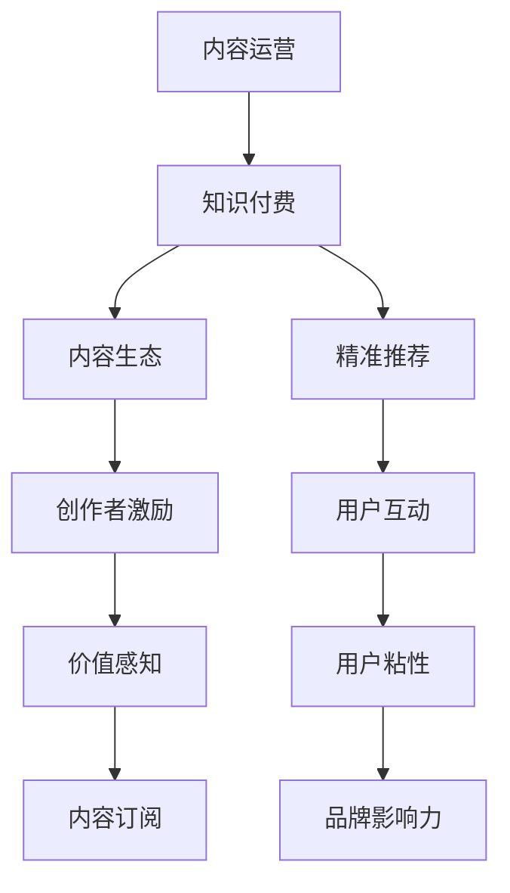

                 

# 内容运营策略：程序员知识付费必备

> 关键词：内容运营, 程序员知识付费, 核心概念, 学习资源推荐, 实际应用场景, 未来发展趋势

## 1. 背景介绍

### 1.1 问题由来
在信息爆炸的互联网时代，程序员作为技术驱动者，面对海量信息往往感到不知所措。如何高效获取知识，成为提高工作效率和学习成效的关键。传统的学习方式，如参加线下培训、购买纸质书籍等，存在着学习成本高、时效性差、互动性不足等问题，难以满足现代程序员的学习需求。因此，一种新兴的知识获取方式——程序员知识付费，应运而生。

### 1.2 问题核心关键点
程序员知识付费的核心在于通过高质量的内容付费，帮助程序员快速提升技术能力，提高工作和学习效率。这种模式的优势在于：

- **针对性更强**：付费内容往往针对特定技术栈或工作场景，能够快速解决实际问题。
- **内容质量更高**：付费内容的产出方通常是行业内的专家和资深开发者，内容质量有保障。
- **互动性更强**：付费平台通常提供在线讨论、社区交流等功能，能够及时获得学习反馈和指导。
- **学习效率更高**：付费内容通常以视频、文章、直播等形式呈现，学习方式更加灵活和高效。

尽管如此，程序员知识付费市场也面临不少挑战，如内容同质化严重、内容质量参差不齐、价格普遍偏高等问题。如何破解这些难题，提升知识付费的实际效果，是内容运营的核心任务。

## 2. 核心概念与联系

### 2.1 核心概念概述

为更好地理解程序员知识付费的内容运营策略，本节将介绍几个密切相关的核心概念：

- **内容运营**：指通过策划、组织、管理和推广内容，以达到吸引用户、增强用户粘性、提升品牌影响力等目标的活动。在程序员知识付费领域，内容运营的核心在于生产、推广高质量的付费内容。
- **知识付费**：指用户为获取有价值、有深度、有针对性的知识，而支付相应费用的行为。程序员知识付费专注于技术知识、工具使用、项目实践等领域。
- **内容生态**：指围绕内容生产、分发、消费等环节形成的良性循环体系。在知识付费中，内容生态的构建需要关注内容多样性、创作者激励、用户互动等多个方面。
- **精准推荐**：指通过用户行为数据分析，为用户推荐符合其兴趣和需求的内容。在程序员知识付费中，精准推荐系统能够显著提升用户的学习效率和体验。
- **价值感知**：指用户对知识付费内容价值的认同感。提高用户价值感知，是内容运营的重要目标之一，通过合理定价和有效营销，能够吸引更多用户参与。

这些核心概念之间的逻辑关系可以通过以下Mermaid流程图来展示：



这个流程图展示了几者之间的联系：

1. 内容运营是知识付费的基础，需要策划、组织、推广高质量内容。
2. 内容生态的构建需要内容多样性、创作者激励、用户互动等多个环节的协同作用。
3. 精准推荐系统通过用户行为分析，提高用户的学习效率和体验。
4. 提高用户价值感知，吸引更多用户订阅付费内容。

这些概念共同构成了程序员知识付费的内容运营框架，是其能够成功的关键所在。

## 3. 核心算法原理 & 具体操作步骤
### 3.1 算法原理概述

程序员知识付费的内容运营，本质上是通过数据驱动的方式，提高内容质量和用户粘性，构建健康的内容生态。其核心思想是：

- **数据驱动**：利用用户行为数据、内容质量评估、市场反馈等数据，指导内容生产和运营策略。
- **用户为中心**：围绕用户需求和兴趣，设计和优化内容推荐、互动体验等环节。
- **创作者激励**：通过合理的内容分发机制和收益分配方式，激励创作者持续生产高质量内容。

内容运营的算法原理主要包括以下几个方面：

1. **用户行为数据分析**：通过日志、点击率、观看时长等数据，分析用户的学习行为和偏好，指导内容生产和推荐。
2. **内容质量评估**：利用用户评分、专家评审等指标，评估内容的质量和实用性，优化内容策选和分发策略。
3. **内容推荐算法**：通过协同过滤、内容相关性、用户兴趣等模型，为用户推荐高质量内容，提高用户满意度。
4. **创作者激励机制**：通过订阅量、观看次数、互动反馈等指标，激励创作者持续输出高质量内容。

### 3.2 算法步骤详解

基于数据驱动的内容运营，程序员知识付费的内容运营流程主要包括以下几个步骤：

**Step 1: 内容策划与生产**
- **需求分析**：调研目标用户群体，了解其技术栈、工作场景和学习需求。
- **内容规划**：制定内容主题、形式、发布计划等，确保内容与用户需求高度匹配。
- **内容制作**：邀请行业专家和资深开发者，制作高质量的视频、文章、代码库等。

**Step 2: 内容分发与推广**
- **渠道选择**：选择适合的渠道进行内容分发，如视频平台、社区论坛、在线课程等。
- **推广策略**：制定推广计划，利用SEO、社交媒体、邮件营销等方式，吸引用户关注和订阅。
- **互动引导**：在内容中嵌入讨论区、问答环节，引导用户进行互动和反馈。

**Step 3: 数据分析与优化**
- **用户行为分析**：收集用户行为数据，分析学习路径、观看时长、评分反馈等。
- **内容质量评估**：通过专家评审、用户评分等方式，评估内容的质量和实用性。
- **算法优化**：根据分析结果，优化推荐算法，提高内容匹配度和用户满意度。

**Step 4: 创作者激励与生态构建**
- **收益分配**：根据订阅量、观看次数、互动反馈等指标，分配创作者收益，激励创作。
- **创作者支持**：提供技术支持、资源分享、社区互动等支持，帮助创作者提升影响力。
- **生态维护**：持续优化内容生态，确保内容多样化、高质量，构建良性循环。

### 3.3 算法优缺点

程序员知识付费的内容运营方法具有以下优点：

1. **精准匹配**：通过数据分析，能够精确匹配用户需求，提高学习效率。
2. **创作者激励**：合理的收益分配机制，能够激励创作者持续输出高质量内容。
3. **互动性强**：通过社区互动、在线讨论等方式，提升用户参与度和学习效果。
4. **市场导向**：能够快速响应市场需求，推出符合用户期望的内容。

同时，该方法也存在一些局限性：

1. **成本较高**：高质量内容的制作和分发需要较大的投入。
2. **用户需求变化快**：技术发展迅速，用户需求变化快，需要持续调整内容策略。
3. **内容同质化严重**：如果市场缺乏有效监管，容易产生内容同质化现象。
4. **市场竞争激烈**：知识付费市场竞争激烈，需要不断创新，提升内容差异化。

尽管如此，基于数据驱动的内容运营方法，依然是程序员知识付费中最有效的手段。通过持续优化内容和运营策略，能够最大化提升用户体验和内容价值。

### 3.4 算法应用领域

程序员知识付费的内容运营方法，已在多个领域得到广泛应用，例如：

- **技术栈培训**：针对特定的技术栈或框架，提供深度解析和实战案例。
- **工具使用教程**：介绍常用的开发工具和库的使用方法，提高工作效率。
- **项目实践指南**：提供实际项目案例和代码实践，帮助开发者提升实战能力。
- **前沿技术分享**：邀请行业专家和学者，分享最新的技术趋势和应用案例。
- **软技能提升**：提供团队管理、沟通技巧、职业规划等方面的知识和实践经验。

除了上述这些经典领域，程序员知识付费的内容运营还拓展到更多新兴场景，如区块链技术、人工智能应用、数据分析等，为程序员提供了全方位的学习资源。

## 4. 数学模型和公式 & 详细讲解 & 举例说明

### 4.1 数学模型构建

为更好地理解程序员知识付费的内容推荐算法，本节将使用数学语言对推荐系统进行严格刻画。

设用户集合为 $U$，内容集合为 $V$，用户对内容的评分矩阵为 $R_{U \times V}$，用户-内容交互矩阵为 $I_{U \times V}$，用户特征向量为 $\boldsymbol{u}_i \in \mathbb{R}^d$，内容特征向量为 $\boldsymbol{v}_j \in \mathbb{R}^d$。则推荐模型可以表示为：

$$
\hat{y}_{ij} = \boldsymbol{u}_i^T \boldsymbol{W} \boldsymbol{v}_j
$$

其中 $\boldsymbol{W}$ 为推荐系数矩阵，$\hat{y}_{ij}$ 为用户 $i$ 对内容 $j$ 的预测评分。

### 4.2 公式推导过程

推荐系统的核心在于通过用户行为数据，预测用户对内容的评分。具体推导如下：

设用户 $i$ 对内容 $j$ 的实际评分和预测评分的差距为 $\epsilon_{ij}$，则有：

$$
R_{ij} = \hat{y}_{ij} + \epsilon_{ij}
$$

根据线性回归模型的最小二乘法，求解 $\hat{y}_{ij}$ 的公式为：

$$
\hat{y}_{ij} = \sum_{k=1}^{d} \alpha_k (\boldsymbol{u}_i^T \boldsymbol{B}_k \boldsymbol{v}_j + \beta_k)
$$

其中 $\alpha_k$ 和 $\beta_k$ 为回归系数。将公式代入 $\hat{y}_{ij}$ 的表达式，得：

$$
\hat{y}_{ij} = \sum_{k=1}^{d} (\boldsymbol{u}_i^T \boldsymbol{B}_k \boldsymbol{v}_j) \alpha_k + \sum_{k=1}^{d} \beta_k \alpha_k
$$

化简得：

$$
\hat{y}_{ij} = \boldsymbol{u}_i^T (\boldsymbol{B} \boldsymbol{v}_j) \boldsymbol{\alpha} + \boldsymbol{\beta}^T \boldsymbol{\alpha}
$$

其中 $\boldsymbol{B}$ 为特征提取矩阵，$\boldsymbol{\alpha}$ 和 $\boldsymbol{\beta}$ 为回归系数向量。推荐系数矩阵 $\boldsymbol{W}$ 可以表示为：

$$
\boldsymbol{W} = \boldsymbol{B} \boldsymbol{\alpha}
$$

### 4.3 案例分析与讲解

以Python知识付费平台为例，分析推荐系统的实际应用。

**Step 1: 数据收集与预处理**
- 收集用户的历史行为数据，包括浏览记录、订阅情况、学习时长等。
- 整理内容库，包括文章、视频、代码库等，标记好相关标签和关键词。

**Step 2: 用户特征提取**
- 对用户行为数据进行特征提取，如观看时长、评分反馈、活跃度等。
- 将用户特征转化为向量形式，供模型训练使用。

**Step 3: 内容特征提取**
- 对内容进行特征提取，如文本关键词、目录标签、视频时长等。
- 将内容特征转化为向量形式，供模型训练使用。

**Step 4: 模型训练与预测**
- 使用Python的推荐库（如Surprise、LightFM等）进行模型训练。
- 利用训练好的模型，对新内容进行评分预测，推荐给用户。

**Step 5: 评估与优化**
- 通过A/B测试等方式，评估推荐系统的效果，优化模型参数。
- 根据用户反馈，调整推荐策略，提升用户体验。

以上推荐系统的实现流程，展示了如何利用数据驱动的方式，为程序员提供个性化的知识付费内容。

## 5. 项目实践：代码实例和详细解释说明
### 5.1 开发环境搭建

在进行内容运营实践前，我们需要准备好开发环境。以下是使用Python进行推荐系统开发的常见环境配置流程：

1. 安装Anaconda：从官网下载并安装Anaconda，用于创建独立的Python环境。

2. 创建并激活虚拟环境：
```bash
conda create -n recommendation-env python=3.8 
conda activate recommendation-env
```

3. 安装推荐系统库：
```bash
pip install Surprise
```

4. 安装各类工具包：
```bash
pip install numpy pandas scikit-learn matplotlib tqdm jupyter notebook ipython
```

完成上述步骤后，即可在`recommendation-env`环境中开始推荐系统实践。

### 5.2 源代码详细实现

这里我们以Python的Surprise推荐系统为例，给出推荐系统的代码实现。

首先，导入必要的库和数据集：

```python
import numpy as np
from surprise import Dataset, Reader, KNNWithMeans, accuracy
from surprise.model_selection import train_test_split
from surprise.utils import convert_bid_to_uid

# 读取数据集
reader = Reader(rating_scale=(1, 5))
data = Dataset.load_from_file('data.csv', reader=reader)
```

然后，进行数据预处理和模型训练：

```python
# 转换数据格式
data = convert_bid_to_uid(data)

# 数据拆分
trainset, testset = train_test_split(data, test_size=0.2)

# 选择模型
model = KNNWithMeans(k=10)

# 训练模型
model.fit(trainset)

# 预测评分
predictions = model.test(testset)

# 评估模型
rmse = np.sqrt(mean_squared_error(predictions, testset))
print(f'RMSE: {rmse:.4f}')
```

接下来，实现推荐系统的代码逻辑：

```python
# 推荐新内容
def recommend_content(user_id, top_n=10):
    # 获取用户历史评分
    user_ratings = trainset.builder.build(similarities=model.similarity_matrix)

    # 计算用户与内容的相似度
    similarities = model.similarity_matrix.get(user_id)

    # 获取推荐内容
    recommended_items = np.argsort(similarities)[1:-1][::-1]
    recommended_items = trainset.to_raw_batch(recommended_items).ci
        
    # 返回推荐结果
    return recommended_items[:top_n]

# 测试推荐系统
user_id = 1
top_n = 5
print(f'推荐内容: {recommend_content(user_id, top_n)}')
```

以上就是使用Surprise库进行内容推荐系统的完整代码实现。可以看到，Surprise库提供了丰富的推荐算法和评估工具，能够方便地实现推荐系统。

### 5.3 代码解读与分析

让我们再详细解读一下关键代码的实现细节：

**Surprise库的使用**：
- `Dataset.load_from_file`方法：从CSV文件中加载数据集。
- `Reader`类：用于解析数据格式。
- `KNNWithMeans`类：实现基于KNN的协同过滤推荐算法，采用均值偏差来计算用户评分。

**数据预处理**：
- `convert_bid_to_uid`方法：将用户和内容之间的双向ID转换为单向ID，方便模型训练。
- `train_test_split`方法：将数据集拆分为训练集和测试集。

**模型训练与评估**：
- `fit`方法：训练推荐模型。
- `test`方法：在测试集上进行评分预测。
- `accuracy`函数：计算模型评估指标，如均方根误差(RMSE)。

**推荐系统实现**：
- `recommend_content`函数：实现基于协同过滤的推荐逻辑。
- `similarity_matrix`属性：获取模型中的相似度矩阵。
- `argsort`方法：对相似度排序，获取推荐内容。

以上推荐系统的实现流程，展示了如何使用数据驱动的方式，为程序员推荐知识付费内容。

## 6. 实际应用场景
### 6.1 智能辅导系统

智能辅导系统通过知识付费平台，提供个性化的学习路径和课程推荐，帮助程序员高效提升技术水平。系统通过分析用户的学习行为、知识点掌握情况等数据，动态调整推荐策略，确保用户能够系统化地学习所需技能。

在技术实现上，系统需要与课程提供商合作，获取高质量的付费内容，并将其集成到推荐系统中。系统通过实时分析用户的学习数据，如观看时长、作业完成情况等，评估用户的学习效果，并根据评估结果推荐适合的课程。此外，系统还应提供用户互动功能，如在线讨论、问答环节等，提高学习效率。

### 6.2 项目管理工具

项目管理系统通过知识付费平台，提供高质量的项目实践指导，帮助程序员解决实际开发中的问题。系统通过分析项目中的技术难点、瓶颈问题等，推荐相关的技术文章、视频课程、代码库等内容，提升开发效率和代码质量。

在技术实现上，系统需要构建数据仓库，收集项目数据和用户反馈。系统根据用户提交的项目信息，自动生成知识图谱，供推荐系统使用。此外，系统还应提供项目管理工具，如任务追踪、版本控制、代码审查等，确保开发过程的高效有序。

### 6.3 持续学习平台

持续学习平台通过知识付费平台，提供周期性的技术培训和知识更新，帮助程序员保持技术领先。系统通过分析用户的职业发展路径和技能需求，推荐适合的课程和认证，提升职业竞争力。

在技术实现上，系统需要构建学习档案，记录用户的学习历史和技能掌握情况。系统根据用户的学习档案，推荐相关的课程、书籍、论文等内容，供用户自学和认证。此外，系统还应提供学习进度追踪、学习路径规划等功能，帮助用户制定学习计划。

### 6.4 未来应用展望

随着知识付费市场的不断发展，基于推荐系统的内容运营将迎来更多应用场景，为程序员带来更多学习资源和工具支持。

在智慧教育领域，基于推荐系统的智能辅导系统，将提升教育资源的个性化和互动性，让教育变得更加高效和有针对性。

在企业培训领域，基于推荐系统的项目管理系统，将提升企业的技术培训和项目管理能力，加速企业内部的技术创新和转型升级。

在学术研究领域，基于推荐系统的持续学习平台，将提供最新的学术资源和技术动态，促进学术交流和知识传播。

此外，在职业培训、在线教育、在线咨询等更多场景中，推荐系统都将发挥重要作用，为知识付费市场带来新的机遇和挑战。相信随着技术的发展和应用的拓展，推荐系统的内容运营将变得更加智能和高效，为程序员提供更优质的学习体验和工具支持。

## 7. 工具和资源推荐
### 7.1 学习资源推荐

为帮助开发者系统掌握推荐系统的理论基础和实践技巧，这里推荐一些优质的学习资源：

1. 《推荐系统实战》：一本详细介绍推荐系统理论和实践的书籍，涵盖协同过滤、矩阵分解等经典算法。
2. 《Python推荐系统实战》：一本详细介绍Python推荐系统库（如Surprise、LightFM等）的书籍，提供实际应用案例。
3. Kaggle推荐系统竞赛：参加Kaggle的推荐系统竞赛，获取实际项目经验，提升算法实现能力。
4. Surprise官方文档：Surprise库的官方文档，提供了详细的API说明和示例代码。
5. Coursera推荐系统课程：斯坦福大学的推荐系统课程，涵盖推荐系统理论和经典算法。

通过对这些资源的学习实践，相信你一定能够快速掌握推荐系统的精髓，并用于解决实际的推荐问题。

### 7.2 开发工具推荐

高效的开发离不开优秀的工具支持。以下是几款用于推荐系统开发的常用工具：

1. Python：推荐系统常用的编程语言，具有丰富的第三方库和工具支持。
2. Surprise：Python的推荐系统库，提供了多种推荐算法和评估工具。
3. LightFM：Python的推荐系统库，支持矩阵分解和稀疏矩阵处理。
4. TensorFlow：Google开发的深度学习框架，支持多种机器学习模型，包括推荐系统。
5. PyTorch：Facebook开发的深度学习框架，支持动态图和静态图，易于实现复杂模型。

合理利用这些工具，可以显著提升推荐系统的开发效率，加快创新迭代的步伐。

### 7.3 相关论文推荐

推荐系统的研究和应用涉及多个领域，以下是几篇奠基性的相关论文，推荐阅读：

1. The BellKor 2009 Recommendation Challenge：描述了2009年Kaggle推荐系统竞赛的解决方案，展示了推荐系统的实际应用。
2. Matrix Factorization Techniques for Recommender Systems：介绍了矩阵分解算法在推荐系统中的应用，提供了多种实现方法。
3. Web-scale Matrix Factorization：介绍了使用分布式系统实现矩阵分解推荐系统的案例，提供了工程实践的参考。
4. Collaborative Filtering for Implicit Feedback Datasets：详细介绍了协同过滤算法在推荐系统中的应用，提供了多种实现方法。
5. Personalized PageRank for Recommender Systems：介绍了基于PageRank算法的个性化推荐系统，提供了算法实现和应用案例。

这些论文代表了大规模推荐系统的发展脉络。通过学习这些前沿成果，可以帮助研究者把握学科前进方向，激发更多的创新灵感。

## 8. 总结：未来发展趋势与挑战
### 8.1 研究成果总结

本文对程序员知识付费的内容运营策略进行了全面系统的介绍。首先阐述了知识付费的背景和核心关键点，明确了内容运营在提升技术能力和效率方面的独特价值。其次，从原理到实践，详细讲解了推荐系统的数学模型和关键步骤，给出了推荐系统任务开发的完整代码实例。同时，本文还广泛探讨了推荐系统在智能辅导、项目管理、持续学习等多个领域的应用前景，展示了推荐系统技术的广泛应用潜力。此外，本文精选了推荐系统的各类学习资源，力求为读者提供全方位的技术指引。

通过本文的系统梳理，可以看到，基于推荐系统的知识付费内容运营，正在成为程序员知识获取的重要手段，极大地提升了程序员的学习效率和知识积累速度。推荐系统的技术演进，为程序员提供了更多优质的学习资源和工具支持。未来，伴随推荐算法的不断进步，内容运营策略的持续优化，推荐系统必将在程序员知识付费市场中扮演越来越重要的角色。

### 8.2 未来发展趋势

展望未来，推荐系统的技术发展将呈现以下几个趋势：

1. **深度学习应用广泛**：深度学习模型的推荐算法，将在推荐系统中得到更广泛的应用，提升模型的精准度和预测能力。
2. **多模态信息融合**：将文本、图像、视频等多模态信息融合到推荐系统中，提升推荐结果的多样性和准确性。
3. **实时性增强**：推荐系统将实现实时推荐，根据用户行为数据动态调整推荐策略，提升用户体验。
4. **个性化定制**：推荐系统将提供更加个性化的推荐服务，通过用户画像和行为数据，实现定制化的内容推荐。
5. **社区互动增强**：推荐系统将引入社区互动和用户反馈，提高推荐结果的可靠性和用户满意度。

以上趋势凸显了推荐系统的技术演进方向，必将为程序员带来更加智能和高效的学习体验。

### 8.3 面临的挑战

尽管推荐系统在知识付费市场中取得了显著成效，但在迈向更加智能化、个性化应用的过程中，它仍面临着不少挑战：

1. **数据隐私问题**：推荐系统需要大量的用户数据进行训练，如何保护用户隐私成为重要问题。
2. **冷启动问题**：新用户或新内容加入推荐系统，初期推荐效果往往不佳，需要引入冷启动策略。
3. **算法复杂度高**：推荐算法模型往往复杂，需要高效的算法实现和优化策略。
4. **内容同质化严重**：推荐系统容易陷入内容推荐的同质化陷阱，需要持续引入多样化的内容。
5. **推荐结果可靠性**：推荐系统需要保证推荐结果的可靠性和准确性，避免误导用户。

尽管如此，通过技术创新和算法优化，推荐系统的内容运营仍具备广阔的前景，相信随着问题的逐步解决，推荐系统将在程序员知识付费市场中发挥更大的作用。

### 8.4 研究展望

面对推荐系统面临的种种挑战，未来的研究需要在以下几个方面寻求新的突破：

1. **隐私保护**：引入差分隐私、联邦学习等技术，保护用户隐私，确保推荐数据的安全性。
2. **冷启动策略**：通过知识图谱、用户画像等技术，缓解新用户和新内容的冷启动问题。
3. **高效算法**：开发更高效的推荐算法，减少计算资源消耗，提升推荐系统的实时性。
4. **内容多样化**：引入内容生成、内容聚合等技术，丰富推荐内容的多样性，避免同质化。
5. **推荐结果优化**：通过多模态融合、对抗样本生成等技术，提升推荐结果的可靠性和准确性。

这些研究方向的探索，必将引领推荐系统技术迈向更高的台阶，为程序员知识付费市场带来更多的创新和突破。

## 9. 附录：常见问题与解答

**Q1：推荐系统如何处理冷启动问题？**

A: 推荐系统的冷启动问题主要指新用户或新内容加入系统，初期推荐效果不佳。为了缓解冷启动问题，推荐系统可以采用以下策略：

1. **知识图谱**：构建用户-内容知识图谱，通过图谱关系快速推荐相关内容。
2. **用户画像**：根据用户的兴趣、职业等特征，进行个性化推荐。
3. **协同过滤**：使用基于用户兴趣和行为相似性的协同过滤算法，进行冷启动推荐。
4. **内容推荐**：推荐热门内容或高质量内容，提升新内容的用户曝光率。

**Q2：推荐系统如何保护用户隐私？**

A: 推荐系统在数据使用过程中，必须严格保护用户隐私，防止数据泄露和滥用。可以采用以下策略：

1. **差分隐私**：在推荐算法中引入差分隐私机制，确保单个用户数据的隐私性。
2. **联邦学习**：采用联邦学习技术，在本地设备上训练推荐模型，减少数据传输。
3. **匿名化处理**：对用户数据进行匿名化处理，确保用户数据的安全性。
4. **用户控制**：提供用户数据隐私控制选项，让用户可以自主选择数据使用范围和权限。

**Q3：推荐系统如何提升推荐结果的可靠性？**

A: 推荐系统的推荐结果可靠性直接影响用户体验和系统信任度。为提升推荐结果的可靠性，推荐系统可以采用以下策略：

1. **多模态融合**：将文本、图像、视频等多模态信息融合到推荐系统中，提升推荐结果的多样性和准确性。
2. **对抗样本生成**：引入对抗样本生成技术，提升推荐系统的鲁棒性和准确性。
3. **用户反馈机制**：引入用户反馈机制，通过用户评分和互动，动态调整推荐策略。
4. **模型解释性**：提高推荐模型的可解释性，让用户能够理解推荐结果的生成过程。

这些策略能够帮助推荐系统提升推荐结果的可靠性和准确性，使用户更加信任推荐系统。

---

作者：禅与计算机程序设计艺术 / Zen and the Art of Computer Programming

