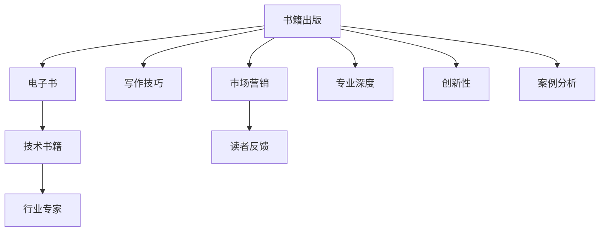

                 

# 出版书籍或电子书：树立行业专家地位

> 关键词：出版，电子书，行业专家，技术书籍，写作指导，市场营销，读者反馈

## 1. 背景介绍

### 1.1 问题由来
在信息化和数字化的浪潮下，技术类书籍成为了读者获取知识和技能的重要渠道。而行业专家通过出版自己的技术书籍，不仅可以分享自己的研究成果，还能在行业内树立起权威和影响力。特别是在技术不断迭代更新、行业竞争日益激烈的背景下，通过出版电子书或纸质书籍，将知识和经验沉淀下来，具有重要的战略意义。

### 1.2 问题核心关键点
出版书籍或电子书，对于树立行业专家地位具有以下几个核心关键点：

1. **专业知识深度**：作者需要具备在某一领域深耕多年的专业知识，能全面深入地剖析问题，提出建设性的解决方案。
2. **写作技巧**：如何把深奥的技术内容转化为通俗易懂的文字，使读者易于理解和吸收。
3. **创新性**：本书应包含作者在研究过程中获得的创新性成果，或对现有技术的新见解。
4. **案例分析**：通过具体案例分析，使读者能够将理论知识与实践相结合。
5. **市场营销**：如何通过合适的市场渠道和推广手段，使书籍能够覆盖更多潜在读者，扩大影响力。
6. **读者反馈**：及时收集读者反馈，进行持续修订和完善，保持书籍的时效性和实用性。

## 2. 核心概念与联系

### 2.1 核心概念概述

为了更好地理解出版技术书籍的流程，本节将介绍几个密切相关的核心概念：

- **书籍出版**：将作者的研究成果、知识和经验通过文字的形式，系统整理并出版成册，以供读者学习和参考。
- **电子书**：利用电子设备（如手机、平板电脑、电子书阅读器等）进行阅读的数字书籍。与传统纸质书籍相比，具有携带方便、阅读便捷、低成本等优点。
- **行业专家**：在某一领域拥有较高专业水准和广泛影响力的从业者，能通过撰写书籍等方式，将知识分享给更多人。
- **技术书籍**：专注于某一技术领域的书籍，旨在传授该领域的专业知识，帮助读者掌握核心技能。
- **写作技巧**：包括如何构思章节、撰写段落、组织逻辑、编辑校对等，使内容易于理解和吸收。
- **市场营销**：通过合理的市场策略，使书籍获得更大的曝光度和读者群。

这些核心概念之间的逻辑关系可以通过以下Mermaid流程图来展示：



这个流程图展示了出版书籍的过程和涉及的关键因素：

1. 从书籍出版开始，作者将专业知识转化为书面内容。
2. 技术书籍最终以电子或纸质形式呈现给读者。
3. 电子书依托现代电子设备，方便阅读。
4. 行业专家通过撰写书籍，在行业内树立权威。
5. 写作技巧使书籍内容易于理解，提升阅读体验。
6. 市场营销策略提升书籍的可见度和读者群。
7. 读者反馈有助于书籍的持续改进和完善。

## 3. 核心算法原理 & 具体操作步骤
### 3.1 算法原理概述

出版技术书籍的过程，本质上是一个系统化的知识整理和传播过程。其核心思想是：将作者的深入研究、创新成果和案例分析，以通俗易懂的方式呈现给读者，从而达到知识传递和经验分享的目的。

形式化地，假设作者的知识体系为 $K$，书籍内容为 $C$，读者反馈为 $F$，则出版过程的目标是找到最佳的 $C$，使得 $C$ 能最大化地表达 $K$，并通过市场营销策略传播给最广泛的读者，并在 $F$ 的指导下不断改进 $C$。

### 3.2 算法步骤详解

出版技术书籍通常包括以下几个关键步骤：

**Step 1: 确定出版目标**
- 明确书籍的主题、受众群体、核心内容、创新点等。
- 设定出版目标，如普及知识、培训人才、记录成果等。

**Step 2: 整理知识体系**
- 将作者的知识体系 $K$ 梳理成清晰的章节结构。
- 按逻辑顺序和读者认知规律，安排各章节的内容和顺序。

**Step 3: 撰写书籍内容**
- 撰写各章节的内容，确保每个知识点简洁明了、易于理解。
- 使用图表、代码示例、案例分析等，丰富内容表现形式。
- 在每个章节后设置思考问题或练习题，帮助读者巩固知识。

**Step 4: 编辑和校对**
- 进行编辑和校对，确保内容的准确性和逻辑性。
- 进行多轮修订，不断完善和优化内容。

**Step 5: 市场营销**
- 选择合适的市场渠道和推广手段，如社交媒体、博客、线上线下书店等。
- 制作宣传材料，如书籍封面、简介、目录等，提升书籍吸引力。

**Step 6: 读者反馈**
- 收集读者的反馈和评价，及时进行修改和完善。
- 进行再版或修订，保持书籍的时效性和实用性。

### 3.3 算法优缺点

出版技术书籍具有以下优点：
1. 权威性：通过正规出版渠道，确保内容的权威性和可信度。
2. 系统性：系统化的知识整理，便于读者全面掌握某一领域的专业知识。
3. 可扩展性：通过定期修订和再版，保持书籍的时效性和实用价值。
4. 长期影响：知识一旦出版，可以长期保存，对读者产生持续影响。

同时，出版技术书籍也存在以下缺点：
1. 出版周期长：从撰写到出版需要较长的时间，难以快速响应技术变化。
2. 成本高：印刷和分发成本较高，难以快速达到大规模传播。
3. 市场风险：市场需求变化快，出版书籍的销售情况可能不如预期。
4. 修订复杂：需要频繁修订和再版，工作量大且成本高。

尽管存在这些缺点，但出版技术书籍仍然是一种重要且有效的方式，可以系统地传播知识和经验，推动行业发展。

### 3.4 算法应用领域

出版技术书籍广泛应用于以下几个领域：

- **软件开发**：介绍最新的编程语言、框架、工具和最佳实践，帮助开发者提高技能。
- **数据科学**：讲解数据收集、处理、分析和建模的技术，以及机器学习和人工智能的基础知识。
- **网络安全**：剖析网络攻击手段和防御策略，帮助安全人员提升防御能力。
- **人工智能**：探讨深度学习、自然语言处理、计算机视觉等前沿技术，推动人工智能应用。
- **物联网**：介绍物联网设备的开发、部署和管理，以及相关技术和应用案例。
- **云计算**：讲述云计算平台、服务、架构和安全，推动企业数字化转型。

## 4. 数学模型和公式 & 详细讲解 & 举例说明

### 4.1 数学模型构建

本节将使用数学语言对出版技术书籍的过程进行更加严格的刻画。

记作者的知识体系为 $K$，书籍内容为 $C$，读者反馈为 $F$。出版过程的目标是找到最佳的 $C$，使得 $C$ 能最大化地表达 $K$，并通过市场营销策略传播给最广泛的读者，并在 $F$ 的指导下不断改进 $C$。

定义出版过程的目标函数为：

$$
\max_{C} \left\{ \sum_{r \in F} r \cdot \text{Effectiveness}(C) \right\}
$$

其中 $r$ 为读者反馈，$\text{Effectiveness}(C)$ 为内容的质量和传播效果。

### 4.2 公式推导过程

以下我们以软件开发书籍为例，推导出版过程的目标函数及其梯度计算公式。

假设出版社希望出版一本关于最新编程语言 X 的书籍，读者反馈为 $F=\{f_1, f_2, \dots, f_n\}$，其中 $f_i$ 表示第 $i$ 个读者对书籍的反馈。内容 $C$ 的质量和传播效果可以通过以下公式衡量：

$$
\text{Effectiveness}(C) = \sum_{i=1}^n f_i \cdot g_i(C)
$$

其中 $g_i(C)$ 为内容 $C$ 对第 $i$ 个读者的影响，可以由内容深度、易读性、实用性等多个维度共同决定。假设 $g_i(C)$ 为 $C$ 对 $f_i$ 的影响，则目标函数变为：

$$
\max_{C} \left\{ \sum_{i=1}^n f_i \cdot g_i(C) \right\}
$$

根据链式法则，内容 $C$ 对 $f_i$ 的梯度为：

$$
\frac{\partial}{\partial C} \left\{ \sum_{i=1}^n f_i \cdot g_i(C) \right\} = \sum_{i=1}^n g_i'(C) \cdot g_i(C)
$$

其中 $g_i'(C)$ 为 $g_i(C)$ 对内容 $C$ 的梯度，可以通过读者反馈 $f_i$ 和内容质量 $g_i(C)$ 的关联关系，递归展开计算。

在得到目标函数的梯度后，即可带入出版过程的迭代优化公式，不断优化内容 $C$，以最大化地表达作者的知识体系 $K$。

## 5. 项目实践：代码实例和详细解释说明
### 5.1 开发环境搭建

在进行书籍出版实践前，我们需要准备好开发环境。以下是使用Python进行Markdown编辑和Git版本控制的环境配置流程：

1. 安装Anaconda：从官网下载并安装Anaconda，用于创建独立的Python环境。

2. 创建并激活虚拟环境：
```bash
conda create -n book-env python=3.8 
conda activate book-env
```

3. 安装必要的库：
```bash
conda install pandas sympy numpy jupyter notebook
```

4. 配置Git：
```bash
git init
git remote add origin https://github.com/<your-repo>/<your-book>
git fetch origin
git checkout -b <your-branch>
```

完成上述步骤后，即可在`book-env`环境中开始撰写和编辑书籍。

### 5.2 源代码详细实现

下面我们以《Python深度学习》书籍的撰写为例，给出Markdown格式的源代码实现。

首先，创建一个Markdown文件，命名为`main.md`，用于存放书籍的目录和章节内容：

```markdown
# 目录
1. 引言
2. 基本概念
3. 数据预处理
4. 模型训练
5. 模型评估
6. 模型调优
7. 案例分析
8. 实践指南
9. 参考文献
```

然后，在目录项下，逐一撰写各章节的内容，并使用Markdown语法格式化：

```markdown
## 1. 引言

引言部分简要介绍深度学习的基本概念和应用场景，为读者铺垫基础知识。

```

通过Markdown格式，可以快速地组织和编辑书籍的内容，并利用Git进行版本控制，方便多人协作和持续修订。

### 5.3 代码解读与分析

让我们再详细解读一下关键代码的实现细节：

**目录配置**：
- 通过`main.md`文件定义书籍的目录结构，使用Markdown语法进行章节划分。
- 目录项下的子目录使用`##`或`###`定义，支持多级标题嵌套。

**内容编写**：
- 各章节内容使用Markdown语法编写，支持粗体、斜体、标题、列表、代码块等常见格式。
- 代码块中使用三引号或者```python```标记，展示代码示例和算法流程。

**版本控制**：
- 通过Git进行版本控制，记录每一次的修改和更新，便于团队协作和历史记录追溯。
- 使用分支策略进行功能模块的开发和迭代，确保代码的独立性和可维护性。

**代码展示**：
- 各章节内容展示相关代码示例，便于读者理解和实践。
- 代码注释详细解释代码逻辑和关键步骤，提升可读性和可维护性。

**结果展示**：
- 通过Markdown的格式化展示书籍内容，生成漂亮的文档和PDF格式，便于分享和传播。
- 利用Jupyter Notebook的交互特性，展示运行结果和实验数据，增强书籍的实用性。

## 6. 实际应用场景

### 6.1 软件开发培训

通过出版软件开发书籍，可以帮助新手掌握最新的编程语言和框架，提高软件开发能力。书籍可以包含基础语法、高级特性、开发工具、项目案例等内容，帮助读者全面提升技能。

### 6.2 数据科学教育

数据科学是一个快速发展的领域，出版数据科学书籍可以系统讲解数据收集、处理、分析和建模的技术，帮助读者掌握数据科学的核心知识。书籍可以包含数据清洗、特征工程、机器学习算法、深度学习等内容，助力数据科学教育。

### 6.3 网络安全指导

网络安全是一个高度专业化的领域，出版网络安全书籍可以介绍网络攻击手段、防御策略、漏洞检测、安全协议等内容，帮助读者提升网络安全防护能力。书籍可以包含安全漏洞、攻击案例、安全工具、渗透测试等内容，推动网络安全教育。

### 6.4 人工智能入门

人工智能是当前最热门的技术之一，出版人工智能书籍可以讲解深度学习、自然语言处理、计算机视觉等前沿技术，帮助读者了解人工智能的基本概念和应用场景。书籍可以包含模型搭建、算法原理、实验实践、案例分析等内容，推动人工智能教育。

## 7. 工具和资源推荐

### 7.1 学习资源推荐

为了帮助作者编写高质量的技术书籍，这里推荐一些优质的学习资源：

1. **Markdown格式指南**：帮助作者掌握Markdown语法，快速撰写和编辑书籍内容。
2. **Git版本控制入门**：了解Git的基本用法和版本控制原理，提升协作效率和代码质量。
3. **LaTeX排版教程**：掌握LaTeX排版技术，生成高质量的PDF和书籍格式，增强书籍的美观度和专业性。
4. **出版商与平台指南**：了解不同出版商和平台的出版流程和要求，选择合适的出版渠道。
5. **读者调研和反馈工具**：使用问卷调查、评论系统等工具，收集读者反馈和评价，持续优化内容。

通过对这些资源的学习实践，相信作者能够快速掌握技术书籍出版的核心技术，并编写出高质量的专业书籍。

### 7.2 开发工具推荐

高效的书籍出版离不开优秀的工具支持。以下是几款用于书籍出版的常用工具：

1. **Markdown编辑器**：如Typora、Jupyter Notebook等，支持Markdown语法和代码高亮，快速撰写和编辑书籍内容。
2. **版本控制工具**：如Git、SVN等，实现版本控制和代码协作，便于多人协作和历史记录管理。
3. **排版工具**：如LaTeX、Overleaf等，支持复杂排版和格式调整，生成高质量的PDF和书籍格式。
4. **项目管理工具**：如JIRA、Trello等，管理书籍的撰写进度和任务分配，提升项目管理和协作效率。
5. **阅读器工具**：如Kindle、iBooks等，支持电子书格式阅读，方便读者获取和阅读书籍内容。

合理利用这些工具，可以显著提升书籍出版的效率和质量，提升作者的工作体验和书籍的传播效果。

### 7.3 相关论文推荐

技术书籍出版的研究也在不断发展，以下是几篇奠基性的相关论文，推荐阅读：

1. **《技术书籍设计与出版》**：探讨技术书籍的设计原则和出版流程，提升书籍的吸引力和可读性。
2. **《电子书市场研究》**：分析电子书市场的现状和趋势，提供市场营销和销售策略。
3. **《数字化出版与阅读技术》**：介绍数字化出版的技术和方法，提升书籍的传播和阅读体验。
4. **《技术书籍的全球传播》**：研究技术书籍在全球范围内的传播和影响力，提供国际化出版的建议。
5. **《技术书籍的在线教育应用》**：探讨技术书籍在在线教育中的应用，提升在线学习的效果和效率。

这些论文代表了大语言模型微调技术的发展脉络。通过学习这些前沿成果，可以帮助作者把握学科前进方向，激发更多的创新灵感。

## 8. 总结：未来发展趋势与挑战

### 8.1 总结

本文对出版技术书籍的过程进行了全面系统的介绍。首先阐述了出版书籍的过程和涉及的关键因素，明确了书籍出版的目标和重要性。其次，从原理到实践，详细讲解了出版技术书籍的数学模型和操作步骤，给出了书籍出版的完整代码实例。同时，本文还广泛探讨了出版书籍在软件开发、数据科学、网络安全、人工智能等多个行业领域的应用前景，展示了出版技术书籍的广阔前景。最后，本文精选了书籍出版的各类学习资源，力求为作者提供全方位的技术指引。

通过本文的系统梳理，可以看到，出版技术书籍的过程虽然复杂，但只要掌握了核心技术，遵循科学的步骤，就能够高效地完成书籍编写和传播。未来，随着技术的发展和教育的普及，技术书籍出版必将成为推动知识传播和技术普及的重要手段。

### 8.2 未来发展趋势

展望未来，技术书籍出版将呈现以下几个发展趋势：

1. **数字化的普及**：电子书和在线学习平台的兴起，使得技术书籍的传播范围更加广泛，出版和阅读更加便捷。
2. **交互式的增强**：通过引入互动式编程、在线测试等功能，提升读者对书籍内容的理解和掌握。
3. **社交化的整合**：利用社交媒体和社区平台，形成读者和作者之间的互动，增强书籍的吸引力和传播效果。
4. **定制化的服务**：根据读者的学习需求和反馈，提供个性化的学习路径和内容推荐，提升学习效果。
5. **国际化的扩展**：技术书籍的国际化出版和传播，将提升全球技术教育水平，推动技术标准和实践的统一。

这些趋势将进一步提升技术书籍的传播效果和影响力，为更多读者提供高质量的学习资源。

### 8.3 面临的挑战

尽管技术书籍出版具有广泛的应用前景，但在迈向更加智能化、普适化应用的过程中，它仍面临诸多挑战：

1. **内容更新和维护**：技术领域发展迅速，书籍内容的更新和维护需要投入大量时间和精力。
2. **市场需求的不确定性**：技术书籍的市场需求难以预测，出版风险较大。
3. **版权和法律问题**：技术书籍的版权和法律问题复杂，需要严格遵守相关规定，避免侵权风险。
4. **全球化传播的挑战**：不同国家和地区的技术水平和教育体系存在差异，书籍的国际化传播面临文化和技术壁垒。
5. **在线盗版的打击**：在线盗版现象严重，技术书籍的版权保护成为一大难题。

这些挑战需要通过持续的技术创新和市场策略，不断应对和克服，才能推动技术书籍出版的持续发展。

### 8.4 研究展望

面对技术书籍出版所面临的种种挑战，未来的研究需要在以下几个方面寻求新的突破：

1. **持续的在线更新**：利用网络技术，实现书籍内容的在线更新和实时传播，保持书籍的时效性和实用性。
2. **智能推荐系统**：引入推荐算法，根据读者的学习进度和反馈，推荐个性化的学习内容，提升学习效率。
3. **互动式学习平台**：开发互动式学习平台，通过在线编程、在线测试等功能，增强读者的学习体验和互动性。
4. **全球化传播策略**：制定全球化出版和传播策略，推动技术书籍的国际化传播，提升全球技术教育水平。
5. **版权保护技术**：引入区块链、数字水印等技术，提升技术书籍的版权保护水平，打击在线盗版行为。

这些研究方向的探索，将推动技术书籍出版的持续发展和创新，为更多读者提供高质量的学习资源。

## 9. 附录：常见问题与解答

**Q1：如何选择适合出版的书籍主题？**

A: 选择适合出版的书籍主题需要考虑以下几个因素：

1. **市场需求**：研究目标受众的需求和兴趣，选择有广泛市场前景的主题。
2. **技术成熟度**：选择技术成熟、应用广泛的领域，确保内容具有实用性和可操作性。
3. **创新性**：选择具有创新性和突破性的主题，体现作者的研究成果和独特见解。
4. **可读性**：选择易于理解和阅读的主题，使读者能够快速掌握知识点。

通过市场调研、技术分析和读者调研，选择适合出版的书籍主题。

**Q2：如何提高书籍的市场影响力？**

A: 提高书籍的市场影响力需要采取多种市场策略：

1. **选择合适的出版渠道**：选择权威的出版平台，提升书籍的可见度和信誉度。
2. **制作吸引人的宣传材料**：制作高质量的书籍封面、简介和目录，提升读者对书籍的兴趣。
3. **开展市场营销活动**：通过社交媒体、博客、线上书店等渠道，进行多渠道推广。
4. **建立读者社群**：利用社交媒体和在线论坛，建立读者社群，增强读者粘性和反馈。
5. **提供优质服务**：提供优质的售后服务和技术支持，提升读者满意度和忠诚度。

通过多渠道、多维度的市场策略，提升书籍的市场影响力。

**Q3：如何管理书籍的出版流程？**

A: 管理书籍的出版流程需要制定详细的项目计划和流程管理措施：

1. **制定项目计划**：明确书籍的出版目标、时间节点和任务分工，制定详细的时间表。
2. **使用项目管理工具**：使用JIRA、Trello等项目管理工具，跟踪项目进度和任务完成情况。
3. **定期评估和反馈**：定期评估项目进展和质量，收集读者和编辑的反馈，及时调整和优化。
4. **版本控制和协作**：使用Git等版本控制工具，实现多人协作和历史记录管理。
5. **质量保证措施**：设置质量保证措施，进行多轮修订和校对，确保书籍内容的准确性和完整性。

通过科学的项目管理和质量保证措施，提升书籍的出版效率和质量。

---

作者：禅与计算机程序设计艺术 / Zen and the Art of Computer Programming

