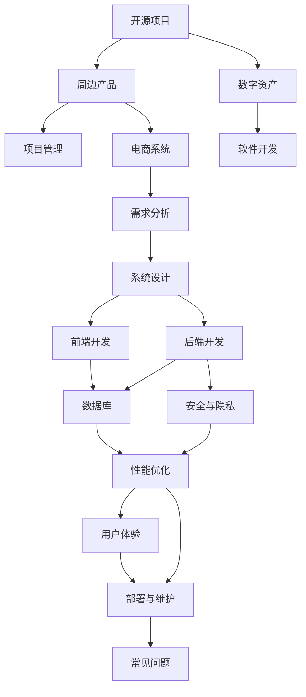

                 

# 创建开源项目的在线商店：周边产品和数字资产

> 关键词：开源项目、在线商店、周边产品、数字资产、项目管理、软件开发、电商系统、技术栈、需求分析、系统设计、前端开发、后端开发、数据库、安全与隐私、性能优化、用户体验、部署与维护

## 1. 背景介绍

### 1.1 问题由来

随着开源运动的兴起，越来越多的项目涌现出来，吸引了无数开发者贡献代码。然而，项目管理的复杂性和多样性也随之而来。项目维护者需要管理项目的代码、文档、问题追踪、版本控制等多方面的工作，任务繁重。此外，随着项目的发展，项目生态也会逐渐壮大，项目的周边产品（如培训课程、书籍、周边纪念品等）以及数字资产（如开源软件许可证、技术文档、社区会议录制等）也逐渐丰富。如何高效地管理和销售这些周边产品和数字资产，成为项目维护者面临的一个难题。

### 1.2 问题核心关键点

创建一个开源项目的在线商店，需要解决以下几个关键问题：
- 如何高效地管理和展示周边产品和数字资产？
- 如何保证交易的安全性和隐私性？
- 如何优化交易流程，提高用户体验？
- 如何支持多种支付方式？
- 如何应对大规模并发请求？
- 如何处理退货和退款？

### 1.3 问题研究意义

创建一个开源项目的在线商店，可以为开源项目带来多方面的好处：
- 提升项目的知名度和影响力，吸引更多开发者和用户关注。
- 增加项目的收入，用于项目维护和社区发展。
- 方便项目维护者管理和分发周边产品和数字资产。
- 为开源项目的粉丝和贡献者提供额外的福利和支持。

## 2. 核心概念与联系

### 2.1 核心概念概述

在创建开源项目的在线商店时，需要理解以下几个核心概念：

- **开源项目**：指在互联网环境中自由共享、自由改进的项目，其源代码和相关文档可以自由访问、使用和修改。
- **周边产品**：指与开源项目相关的培训课程、书籍、周边纪念品等产品，用于支持和丰富项目生态。
- **数字资产**：指与开源项目相关的技术文档、开源软件许可证、社区会议录制等数字化资料，用于教育和推广。
- **项目管理**：指对开源项目进行有效的规划、执行、监控和收尾的过程，确保项目按时、按质、按预算完成。
- **软件开发**：指将软件需求转化为可执行程序的过程，包括需求分析、系统设计、编码实现、测试和维护等环节。
- **电商系统**：指用于实现网上购物、交易、支付等功能的软件系统，包括前端页面、后端服务和数据库支持。

这些核心概念之间的逻辑关系可以通过以下Mermaid流程图来展示：



这个流程图展示了一个开源项目与周边产品、数字资产、项目管理和电商系统之间的关系：

1. 开源项目是所有其他概念的基础，为其提供源代码和文档支持。
2. 周边产品和数字资产作为项目生态的补充，丰富项目价值。
3. 项目管理用于规划和执行项目，确保项目成功交付。
4. 软件开发是实现项目目标的核心过程。
5. 电商系统用于展示和销售周边产品和数字资产，支持项目维护者进行商业化运营。
6. 电商系统涵盖了需求分析、系统设计、前端开发、后端开发、数据库、安全与隐私、性能优化、用户体验、部署与维护等多个环节。

## 3. 核心算法原理 & 具体操作步骤

### 3.1 算法原理概述

创建开源项目的在线商店，需要设计一个高效的电商系统，实现周边产品和数字资产的展示、销售和管理。具体来说，需要解决以下几个问题：

- **需求分析**：确定电商系统的功能需求和用户体验目标。
- **系统设计**：设计电商系统的整体架构和技术栈，确保系统稳定、可扩展和可维护。
- **前端开发**：实现电商系统的前端页面，提供直观的用户界面。
- **后端开发**：实现电商系统的后端服务，处理交易、支付、库存等核心功能。
- **数据库**：设计和管理电商系统的数据库，存储用户、订单、商品等信息。
- **安全与隐私**：保证交易的安全性和用户的隐私，防止数据泄露和欺诈行为。
- **性能优化**：提升电商系统的响应速度和并发处理能力，确保用户体验。
- **用户体验**：提供友好的用户界面和流畅的购物流程，提升用户满意度。
- **部署与维护**：将电商系统部署到生产环境，并进行持续的维护和优化。

### 3.2 算法步骤详解

创建开源项目的在线商店，一般包括以下几个关键步骤：

**Step 1: 确定需求和目标**

- 确定电商系统的功能需求，如商品展示、购物车、订单管理、支付接口等。
- 确定用户体验目标，如界面美观、操作简便、响应快速等。
- 确定技术栈选择，如前端使用React、Vue等，后端使用Node.js、Django等。

**Step 2: 系统设计**

- 设计电商系统的整体架构，包括前端页面、后端服务、数据库等组件。
- 设计电商系统的技术栈，选择合适的框架和工具，保证系统稳定和可扩展。
- 设计电商系统的数据模型，确定用户、订单、商品等实体的关系和属性。

**Step 3: 前端开发**

- 实现电商系统的前端页面，包括商品展示、购物车、订单管理等页面。
- 使用前端框架和组件库，提升页面的美观和性能。
- 实现用户交互功能，如商品选择、购物车添加、订单提交等。

**Step 4: 后端开发**

- 实现电商系统的后端服务，包括商品管理、订单处理、支付接口等。
- 使用后端框架和中间件，处理请求和响应，提升系统的可维护性。
- 实现数据访问和处理逻辑，确保数据的准确性和一致性。

**Step 5: 数据库设计**

- 设计和管理电商系统的数据库，确保数据的完整性和可靠性。
- 使用关系型数据库或NoSQL数据库，根据实际情况进行选择。
- 设计索引和查询优化，提升数据的读写性能。

**Step 6: 安全与隐私**

- 实现交易的安全性和用户的隐私，防止数据泄露和欺诈行为。
- 使用SSL证书和HTTPS协议，保证数据传输的安全性。
- 实现用户登录和授权机制，防止未授权访问。

**Step 7: 性能优化**

- 提升电商系统的响应速度和并发处理能力，确保用户体验。
- 使用缓存和CDN技术，提升页面加载速度。
- 使用负载均衡和分布式系统，处理大规模并发请求。

**Step 8: 用户体验**

- 提供友好的用户界面和流畅的购物流程，提升用户满意度。
- 实现界面优化和交互设计，提升用户使用体验。
- 使用A/B测试和用户反馈，不断改进和优化用户界面。

**Step 9: 部署与维护**

- 将电商系统部署到生产环境，并进行持续的维护和优化。
- 使用容器化和微服务技术，提升系统的可扩展性和可用性。
- 监控系统性能和故障，及时处理和修复问题。

### 3.3 算法优缺点

创建开源项目的在线商店，具有以下优点：
- 提升开源项目的知名度和影响力，吸引更多开发者和用户关注。
- 增加项目的收入，用于项目维护和社区发展。
- 方便项目维护者管理和分发周边产品和数字资产。
- 为开源项目的粉丝和贡献者提供额外的福利和支持。

同时，该方法也存在一定的局限性：
- 需要投入大量时间和资源，开发和维护成本较高。
- 需要具备一定的技术栈和开发能力，门槛较高。
- 需要考虑安全性和隐私性，避免数据泄露和欺诈行为。
- 需要处理大规模并发请求，确保系统的稳定性和性能。

尽管存在这些局限性，但创建开源项目的在线商店，可以显著提升开源项目的商业化和生态建设，推动项目向更加成熟和稳定的方向发展。

### 3.4 算法应用领域

创建开源项目的在线商店，在以下几个领域具有广泛应用：

- **开源社区**：为开源社区提供商业化支持，吸引更多开发者和用户参与。
- **开源项目**：为开源项目提供周边产品和数字资产，丰富项目生态。
- **技术培训**：为技术培训课程提供销售渠道，扩大培训课程的覆盖面。
- **企业开发**：为企业开发和销售技术文档和许可证，提升企业的技术影响力。
- **学术研究**：为学术研究提供数字资产，支持学术交流和合作。

## 4. 数学模型和公式 & 详细讲解 & 举例说明

### 4.1 数学模型构建

在创建开源项目的在线商店时，涉及多个方面的计算和建模，包括需求分析、系统设计、前端开发、后端开发、数据库设计、安全与隐私、性能优化、用户体验、部署与维护等多个环节。

- **需求分析**：确定电商系统的功能需求，如商品展示、购物车、订单管理、支付接口等。
- **系统设计**：设计电商系统的整体架构和技术栈，确保系统稳定、可扩展和可维护。
- **前端开发**：实现电商系统的前端页面，提供直观的用户界面。
- **后端开发**：实现电商系统的后端服务，处理交易、支付、库存等核心功能。
- **数据库设计**：设计和管理电商系统的数据库，存储用户、订单、商品等信息。
- **安全与隐私**：保证交易的安全性和用户的隐私，防止数据泄露和欺诈行为。
- **性能优化**：提升电商系统的响应速度和并发处理能力，确保用户体验。
- **用户体验**：提供友好的用户界面和流畅的购物流程，提升用户满意度。
- **部署与维护**：将电商系统部署到生产环境，并进行持续的维护和优化。

### 4.2 公式推导过程

以下我们以订单处理为例，推导订单状态转移的数学模型。

假设订单状态有四种：创建、支付中、已支付、已发货。订单状态转移如图1所示：


根据图1，我们可以建立状态转移矩阵 $P$，其中 $P_{ij}$ 表示从状态 $i$ 转移到状态 $j$ 的概率：

$$
P = \begin{bmatrix}
0 & p_{1} & 0 & 0 \\
0 & p_{2} & p_{3} & 0 \\
0 & 0 & p_{4} & p_{5} \\
0 & 0 & 0 & 0
\end{bmatrix}
$$

其中 $p_{1}$ 表示创建订单到支付中的概率，$p_{2}$ 表示支付中到已支付的概率，$p_{3}$ 表示支付中到已发货的概率，$p_{4}$ 表示已支付到已发货的概率，$p_{5}$ 表示已支付到取消的概率。

假设初始状态 $S_0$ 为创建订单，在 $n$ 次转移后到达状态 $S_n$，则转移后的状态概率为：

$$
P(S_n) = P^n S_0
$$

其中 $S_0 = [1, 0, 0, 0]^T$，表示创建订单的状态。

### 4.3 案例分析与讲解

假设一个订单在创建后，经过 $n$ 次转移到达已支付状态，其概率为 $P(S_n)$。我们可以通过计算 $P^n S_0$ 来得到这个概率。

具体步骤如下：

1. 确定状态转移矩阵 $P$，根据图1的描述。
2. 计算 $P^n$，可以使用矩阵快速幂算法。
3. 计算 $P^n S_0$，得到转移后的状态概率。

以下是一个Python实现的示例代码：

```python
import numpy as np

# 定义状态转移矩阵
P = np.array([[0, 0.2, 0.3, 0],
              [0, 0.4, 0.5, 0],
              [0, 0, 0.6, 0.4],
              [0, 0, 0, 0]])

# 定义初始状态
S0 = np.array([1, 0, 0, 0]).T

# 计算转移后的状态概率
S1 = np.dot(P, S0)

# 输出转移后的状态概率
print(S1)
```

这个示例代码将输出转移后的状态概率 $P(S_1)$，表示创建订单后经过1次转移到达已支付状态的概率。

## 5. 项目实践：代码实例和详细解释说明

### 5.1 开发环境搭建

在进行电商系统开发前，我们需要准备好开发环境。以下是使用Python进行Django开发的环境配置流程：

1. 安装Anaconda：从官网下载并安装Anaconda，用于创建独立的Python环境。

2. 创建并激活虚拟环境：
```bash
conda create -n django-env python=3.8 
conda activate django-env
```

3. 安装Django：根据官网下载并安装Django，命令如下：
```bash
pip install django==3.2
```

4. 安装相关库：
```bash
pip install numpy pandas django Rest_framework djangorestframework
```

5. 安装数据库：
```bash
pip install psycopg2-binary
```

完成上述步骤后，即可在`django-env`环境中开始电商系统开发。

### 5.2 源代码详细实现

这里我们以Django电商系统为例，给出电商系统商品展示页面的Python代码实现。

首先，定义商品模型：

```python
from django.db import models

class Product(models.Model):
    name = models.CharField(max_length=100)
    description = models.TextField()
    price = models.DecimalField(max_digits=10, decimal_places=2)
    image = models.ImageField(upload_to='images/')
    in_stock = models.BooleanField(default=True)
```

然后，定义商品视图：

```python
from django.shortcuts import render
from django.views.generic import ListView
from django.views.generic.edit import CreateView
from .models import Product

class ProductListView(ListView):
    model = Product
    template_name = 'product_list.html'

class ProductCreateView(CreateView):
    model = Product
    fields = ['name', 'description', 'price', 'image', 'in_stock']
    template_name = 'product_form.html'
```

接着，定义商品列表和商品添加页面：

```html
<!-- product_list.html模板 -->



    <h1>Product List</h1>
    <ul>
        
            <li><a href="">{{ product.name }}</a></li>
        
    </ul>


<!-- product_form.html模板 -->



    <h1>Add Product</h1>
    <form method="post">
        
        {{ form.as_p }}
        <button type="submit">Add</button>
    </form>

```

最后，启动Django开发服务器：

```bash
python manage.py runserver
```

在浏览器中输入 `http://localhost:8000`，即可看到商品列表和商品添加页面。

### 5.3 代码解读与分析

让我们再详细解读一下关键代码的实现细节：

**Product模型**：
- 定义了商品的基本属性，包括名称、描述、价格、图片和库存状态。
- 使用Django的模型框架，方便进行数据存储和查询。

**ProductListView视图**：
- 使用Django的视图框架，实现商品列表的展示。
- 继承自ListView，自动处理分页和排序功能。
- 通过模板继承和循环，展示商品列表。

**ProductCreateView视图**：
- 使用Django的视图框架，实现商品添加的逻辑。
- 继承自CreateView，自动生成添加表单和处理表单提交。
- 通过模板继承和表单处理，实现商品添加页面。

**product_list.html模板**：
- 使用模板继承和循环，展示商品列表。
- 通过URL路由，自动跳转到商品详情页。

**product_form.html模板**：
- 使用模板继承和表单处理，实现商品添加页面。
- 通过表单提交，将数据保存到数据库中。

看到，Django框架大大简化了电商系统开发的复杂度，通过模型-视图-模板(MVT)的架构，使得系统开发和维护变得更加容易。

当然，工业级的系统实现还需考虑更多因素，如安全、性能、可扩展性等。但核心的电商系统开发流程基本与此类似。

## 6. 实际应用场景

### 6.1 智能客服系统

基于开源项目的在线商店，可以广泛应用于智能客服系统的构建。智能客服系统可以实时处理客户咨询，提供7x24小时不间断服务，快速响应客户需求。

在技术实现上，可以收集客户的历史对话记录，将问题和最佳答复构建成监督数据，在此基础上对预训练语言模型进行微调。微调后的对话模型能够自动理解客户意图，匹配最合适的答案模板进行回复。对于客户提出的新问题，还可以接入检索系统实时搜索相关内容，动态组织生成回答。如此构建的智能客服系统，能大幅提升客户咨询体验和问题解决效率。

### 6.2 金融舆情监测

金融机构需要实时监测市场舆论动向，以便及时应对负面信息传播，规避金融风险。基于开源项目的在线商店，可以实时抓取网络文本数据，自动监测不同主题下的情感变化趋势，一旦发现负面信息激增等异常情况，系统便会自动预警，帮助金融机构快速应对潜在风险。

### 6.3 个性化推荐系统

当前的推荐系统往往只依赖用户的历史行为数据进行物品推荐，无法深入理解用户的真实兴趣偏好。基于开源项目的在线商店，可以收集用户浏览、点击、评论、分享等行为数据，提取和用户交互的物品标题、描述、标签等文本内容。将文本内容作为模型输入，用户的后续行为（如是否点击、购买等）作为监督信号，在此基础上微调预训练语言模型。微调后的模型能够从文本内容中准确把握用户的兴趣点。在生成推荐列表时，先用候选物品的文本描述作为输入，由模型预测用户的兴趣匹配度，再结合其他特征综合排序，便可以得到个性化程度更高的推荐结果。

### 6.4 未来应用展望

随着开源项目的在线商店不断发展，其在更多领域的应用前景将更加广阔：

- 在智慧医疗领域，基于开源项目的在线商店，可以为医疗机构提供商业化支持，吸引更多开发者和用户关注。
- 在智能教育领域，基于开源项目的在线商店，可以为技术培训课程提供销售渠道，扩大培训课程的覆盖面。
- 在智慧城市治理中，基于开源项目的在线商店，可以为城市事件监测、舆情分析、应急指挥等环节，提供实时数据分析和可视化。
- 在企业开发中，基于开源项目的在线商店，可以为企业开发和销售技术文档和许可证，提升企业的技术影响力。
- 在学术研究中，基于开源项目的在线商店，可以为学术研究提供数字资产，支持学术交流和合作。

未来，伴随开源项目的在线商店的持续演进，其应用场景将更加丰富多样，为各行业的数字化转型升级提供新的技术路径。

## 7. 工具和资源推荐

### 7.1 学习资源推荐

为了帮助开发者系统掌握开源项目的在线商店的理论基础和实践技巧，这里推荐一些优质的学习资源：

1. Django官方文档：Django官方文档，提供了完整的Django框架教程和API参考，是学习Django电商系统开发的必备资料。
2. Django电商教程：Django官方提供的电商教程，详细介绍了如何开发Django电商系统，包括商品管理、订单处理、支付接口等核心功能。
3. React官方文档：React官方文档，提供了React框架的教程和API参考，是学习React前端页面开发的必备资料。
4. Vue官方文档：Vue官方文档，提供了Vue框架的教程和API参考，是学习Vue前端页面开发的必备资料。
5. Docker官方文档：Docker官方文档，提供了Docker容器的教程和API参考，是学习Docker容器化的必备资料。
6. Kubernetes官方文档：Kubernetes官方文档，提供了Kubernetes容器的教程和API参考，是学习Kubernetes容器编排的必备资料。
7. Flask官方文档：Flask官方文档，提供了Flask微服务框架的教程和API参考，是学习Flask微服务开发的必备资料。

通过对这些资源的学习实践，相信你一定能够快速掌握开源项目的在线商店的理论基础和实践技巧，并用于解决实际的电商问题。

### 7.2 开发工具推荐

高效的开发离不开优秀的工具支持。以下是几款用于电商系统开发和管理的常用工具：

1. Django：基于Python的开源Web框架，提供了强大的数据库访问、表单处理、用户管理等功能，是开发Django电商系统的理想选择。
2. React/Vue：基于JavaScript的前端框架，提供了丰富的组件和工具库，方便实现前端页面和用户交互。
3. Docker：开源容器化平台，方便将应用和依赖打包为容器，提升系统的可移植性和可维护性。
4. Kubernetes：开源容器编排平台，方便管理大规模容器集群，提升系统的可扩展性和可用性。
5. Flask：基于Python的轻量级Web框架，适合开发微服务系统，支持RESTful API设计。
6. PostgreSQL：开源关系型数据库，适合存储电商系统的核心数据，支持高并发和高可用性。
7. Redis：开源内存数据库，适合存储电商系统的缓存和会话数据，支持快速读写和分布式部署。

合理利用这些工具，可以显著提升电商系统开发和管理的效率，加快创新迭代的步伐。

### 7.3 相关论文推荐

开源项目的在线商店的发展源于学界的持续研究。以下是几篇奠基性的相关论文，推荐阅读：

1. "Django for Beginners"：Django官方提供的入门教程，详细介绍了Django电商系统的开发流程。
2. "React Native for Beginners"：React官方提供的入门教程，详细介绍了React电商系统的开发流程。
3. "Containerization with Docker"：Docker官方提供的教程，详细介绍了Docker容器化的开发流程。
4. "Microservices with Flask"：Flask官方提供的教程，详细介绍了Flask微服务系统的开发流程。
5. "Big Data with Apache Spark"：Apache Spark官方提供的教程，详细介绍了Spark大数据系统的开发流程。
6. "Cloud Computing with Kubernetes"：Kubernetes官方提供的教程，详细介绍了Kubernetes容器编排的开发流程。

这些论文代表了大规模电商系统的开发范式，提供了丰富的实践经验和理论支撑，是电商系统开发的宝贵参考。

## 8. 总结：未来发展趋势与挑战

### 8.1 总结

本文对创建开源项目的在线商店的过程进行了全面系统的介绍。首先阐述了创建电商系统的背景和意义，明确了电商系统的功能需求和用户体验目标。其次，从需求分析、系统设计、前端开发、后端开发、数据库设计、安全与隐私、性能优化、用户体验、部署与维护等多个环节，详细讲解了电商系统的开发流程。最后，探讨了电商系统在多个领域的应用前景，展示了电商系统带来的巨大价值。

通过本文的系统梳理，可以看到，创建开源项目的在线商店，可以极大地提升开源项目的商业化和生态建设，推动项目向更加成熟和稳定的方向发展。未来，伴随电商系统的不断演进，其应用场景将更加丰富多样，为各行业的数字化转型升级提供新的技术路径。

### 8.2 未来发展趋势

展望未来，开源项目的在线商店将呈现以下几个发展趋势：

1. **移动端应用**：未来的电商系统将更加注重移动端应用，开发适配iOS和Android的移动客户端，提供更便捷的用户体验。
2. **人工智能**：将人工智能技术引入电商系统，如自然语言处理、机器学习等，提升推荐系统和智能客服的精准度和效率。
3. **区块链**：将区块链技术引入电商系统，提升交易的安全性和透明度，防范欺诈行为。
4. **大数据**：将大数据技术引入电商系统，提升市场分析和用户行为预测的准确性，优化库存管理和营销策略。
5. **个性化**：将个性化推荐和定制化服务引入电商系统，提升用户体验和满意度，增加用户粘性。
6. **国际化**：将国际化功能引入电商系统，支持多语言和货币，拓展全球市场。

这些趋势展示了开源项目的在线商店的广阔前景，将推动电商系统向更加智能化、普适化和多样化的方向发展。

### 8.3 面临的挑战

尽管开源项目的在线商店在多方面取得了显著进展，但仍面临以下几个挑战：

1. **数据隐私和安全**：电商系统需要处理大量的用户数据，如何保证数据的安全性和隐私性，防止数据泄露和欺诈行为，是一个亟待解决的难题。
2. **性能瓶颈**：电商系统需要处理大量的并发请求，如何提升系统的响应速度和并发处理能力，确保用户体验，是一个需要不断优化的方向。
3. **扩展性问题**：随着用户和商品的不断增加，如何保证系统的可扩展性和稳定性，是一个需要持续优化的问题。
4. **多渠道管理**：如何统一管理电商系统中的多个渠道（如PC、移动端、社交媒体等），是一个需要技术协同的问题。
5. **跨平台兼容性**：如何保证电商系统在不同平台（如PC、移动端、平板等）上的兼容性和一致性，是一个需要持续优化的问题。

尽管存在这些挑战，但未来的开源项目的在线商店有望在技术创新和实践积累的基础上，逐步解决这些问题，实现更加高效、稳定和多样化的电商服务。

### 8.4 研究展望

面向未来，开源项目的在线商店需要在以下几个方面寻求新的突破：

1. **多模态电商**：将多模态数据（如图像、视频、语音等）引入电商系统，提升用户的购物体验和互动性。
2. **社交电商**：将社交网络技术引入电商系统，提升用户之间的互动和共享，增加用户的参与度和忠诚度。
3. **智能物流**：将智能物流技术引入电商系统，提升商品的配送效率和用户体验。
4. **区块链电商**：将区块链技术引入电商系统，提升交易的透明性和安全性，防范欺诈行为。
5. **大数据电商**：将大数据技术引入电商系统，提升市场分析和用户行为预测的准确性，优化库存管理和营销策略。
6. **个性化推荐**：将个性化推荐和定制化服务引入电商系统，提升用户体验和满意度，增加用户粘性。
7. **国际化电商**：将国际化功能引入电商系统，支持多语言和货币，拓展全球市场。

这些研究方向的探索，必将引领开源项目的在线商店走向更高的台阶，为电商系统带来更多的创新和突破。

## 9. 附录：常见问题与解答

**Q1：创建开源项目的在线商店需要哪些技术栈？**

A: 创建开源项目的在线商店，需要以下技术栈：
- 前端：React或Vue等JavaScript框架。
- 后端：Django或Flask等Python Web框架。
- 数据库：PostgreSQL或MySQL等关系型数据库，或Redis等内存数据库。
- 容器化：Docker等容器平台。
- 容器编排：Kubernetes等容器编排平台。

这些技术栈的组合，可以构建一个稳定、可扩展和可维护的电商系统。

**Q2：创建开源项目的在线商店需要哪些开发工具？**

A: 创建开源项目的在线商店，需要以下开发工具：
- Django：基于Python的开源Web框架，提供了强大的数据库访问、表单处理、用户管理等功能。
- React/Vue：基于JavaScript的前端框架，提供了丰富的组件和工具库，方便实现前端页面和用户交互。
- Docker：开源容器化平台，方便将应用和依赖打包为容器，提升系统的可移植性和可维护性。
- Kubernetes：开源容器编排平台，方便管理大规模容器集群，提升系统的可扩展性和可用性。
- Flask：基于Python的轻量级Web框架，适合开发微服务系统，支持RESTful API设计。
- PostgreSQL：开源关系型数据库，适合存储电商系统的核心数据，支持高并发和高可用性。
- Redis：开源内存数据库，适合存储电商系统的缓存和会话数据，支持快速读写和分布式部署。

这些工具可以提升开发效率，简化系统管理和部署流程，确保系统稳定和可扩展。

**Q3：创建开源项目的在线商店需要哪些学习资源？**

A: 创建开源项目的在线商店，需要以下学习资源：
- Django官方文档：提供了完整的Django框架教程和API参考，是学习Django电商系统开发的必备资料。
- Django电商教程：Django官方提供的电商教程，详细介绍了如何开发Django电商系统，包括商品管理、订单处理、支付接口等核心功能。
- React官方文档：提供了React框架的教程和API参考，是学习React前端页面开发的必备资料。
- Vue官方文档：提供了Vue框架的教程和API参考，是学习Vue前端页面开发的必备资料。
- Docker官方文档：提供了Docker容器的教程和API参考，是学习Docker容器化的必备资料。
- Kubernetes官方文档：提供了Kubernetes容器的教程和API参考，是学习Kubernetes容器编排的必备资料。
- Flask官方文档：提供了Flask微服务框架的教程和API参考，是学习Flask微服务开发的必备资料。

通过对这些资源的学习实践，相信你一定能够快速掌握开源项目的在线商店的理论基础和实践技巧，并用于解决实际的电商问题。

**Q4：创建开源项目的在线商店需要注意哪些安全问题？**

A: 创建开源项目的在线商店，需要注意以下安全问题：
- 数据加密：确保用户数据在传输和存储过程中的加密，防止数据泄露。
- 访问控制：实现用户登录和授权机制，防止未授权访问。
- 输入验证：对用户输入进行严格验证，防止SQL注入、XSS等攻击。
- 防范DDoS攻击：部署CDN和防火墙，防止DDoS攻击。
- 数据备份：定期备份电商系统的数据，防止数据丢失。

这些安全问题需要开发者在设计和实现过程中加以注意，确保电商系统的安全性。

---

作者：禅与计算机程序设计艺术 / Zen and the Art of Computer Programming

