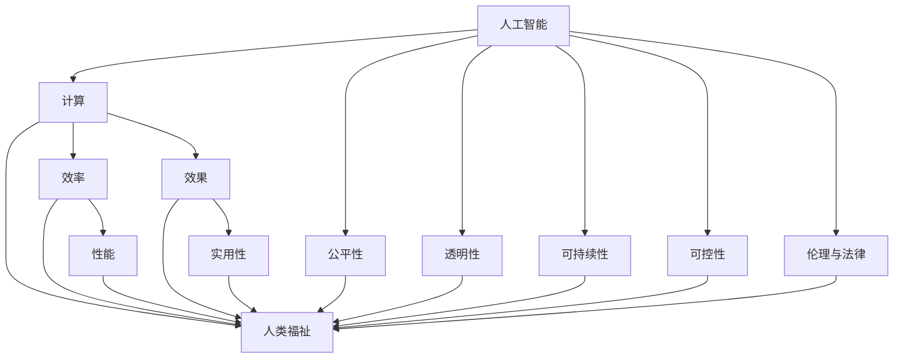

                 

# 创造更美好的世界：人类计算的终极目标

> 关键词：人工智能，计算，人类，未来，伦理，算法，可控，可持续发展

## 1. 背景介绍

### 1.1 问题由来

在信息技术的迅猛发展的当下，我们正处在一个被算法所包围的时代。从自动驾驶汽车到智能家居，从推荐系统到搜索引擎，无不闪耀着算法的光辉。然而，伴随着算法的无处不在，计算能力的飞速提升，一个问题也愈发凸显：如何让这些强大而复杂的算法，服务于人类的福祉，引领我们创造一个更美好的世界？

这不仅是一个技术问题，更是一个深层次的伦理和社会问题。如何在提升计算效率的同时，避免对人类生活的负面影响，确保计算的公平性、透明性和可控性，是当前科技发展所面临的重要挑战。

### 1.2 问题核心关键点

为了更好地理解人工智能计算的终极目标，本节将探讨以下几个核心关键点：

- **计算与人类福祉**：如何设计计算算法，使其服务于人类社会的福祉，而不是单纯追求技术上的突破。
- **公平性与透明性**：算法如何确保不同群体的公平对待，以及算法的决策过程如何变得透明，避免“黑箱”。
- **可持续性**：计算技术的进步如何与环境保护和可持续发展相结合，避免对地球造成不可逆的损害。
- **可控性与责任**：如何确保计算技术的可控性，以及当算法出现问题时，谁来承担责任。
- **伦理与法律**：计算技术的伦理边界与法律框架如何制定，保障人类权益。

这些核心关键点构成了我们追求人工智能计算终极目标的重要维度，通过深入分析，我们可以更好地理解如何利用计算技术服务于人类，并为之制定相应的发展方向和规范。

## 2. 核心概念与联系

### 2.1 核心概念概述

为了清晰地阐述我们的观点，本节将介绍几个关键概念，并探讨它们之间的联系。

- **人工智能（AI）**：指利用计算技术模拟人类智能的系统，包括感知、学习、推理、决策等能力。
- **计算（Computation）**：指通过算法和数据，对信息进行加工和处理的过程。
- **人类福祉（Human Welfare）**：指通过计算技术提升人类的生活质量，促进社会公平和环境保护。
- **公平性（Fairness）**：指算法在处理不同群体时，能够保证结果的公正性和无偏性。
- **透明性（Transparency）**：指算法的决策过程和结果，对相关方是可解释和可验证的。
- **可持续性（Sustainability）**：指计算技术的发展，能够促进环境保护和资源的有效利用。
- **可控性（Controllability）**：指计算技术的使用和影响，是在可预见和可控制范围内的。
- **伦理与法律（Ethics & Law）**：指制定和遵守计算技术的伦理规范和法律框架，保障人类权益。

这些概念通过以下Mermaid流程图，展示了它们之间的联系和相互关系。



## 3. 核心算法原理 & 具体操作步骤

### 3.1 算法原理概述

计算技术的终极目标，在于通过算法，高效地处理和利用数据，提升人类的生活质量。这一目标的实现，依赖于以下几个关键算法原理：

- **优化算法**：通过寻找最优解，提升计算效率和效果。
- **机器学习**：通过数据训练算法，使其具备自适应和学习能力。
- **自然语言处理（NLP）**：使计算技术能够理解和生成自然语言，服务于人类交流和理解。
- **计算机视觉**：使计算技术能够识别和处理图像和视频数据，服务于人类的视觉需求。
- **推荐系统**：通过分析用户行为和偏好，提供个性化服务。
- **自动驾驶**：使计算技术能够实现汽车、船舶等交通工具的自主导航和控制。

这些算法原理共同构成了计算技术的核心，通过它们，我们可以实现计算技术的诸多应用，服务于人类福祉。

### 3.2 算法步骤详解

算法步骤详解如下：

1. **数据收集**：收集相关的数据，这些数据应该具有代表性，能够反映出问题的真实情况。
2. **数据预处理**：对收集到的数据进行清洗、归一化、特征提取等预处理，以便于后续算法的处理。
3. **模型训练**：利用优化算法和机器学习技术，对模型进行训练，使其能够拟合数据并做出预测。
4. **模型验证**：通过验证集对模型进行评估，确保其准确性和泛化能力。
5. **模型应用**：将训练好的模型应用于实际问题，如推荐系统、自动驾驶等。
6. **结果评估**：对模型应用结果进行评估，收集用户反馈，不断优化模型。

### 3.3 算法优缺点

**优点**：
- 能够高效地处理大量数据，提升计算效率。
- 能够发现数据中的规律和模式，提供智能化服务。
- 能够提升人类生活质量，促进社会公平和环境保护。

**缺点**：
- 需要大量的数据和计算资源，成本较高。
- 模型复杂度高，难以解释其内部机制。
- 可能存在偏见和歧视，需要严格监管。

### 3.4 算法应用领域

计算技术的广泛应用，涉及诸多领域，包括但不限于：

- **医疗健康**：通过数据分析，提升医疗诊断和治疗效果。
- **金融服务**：通过风险预测和市场分析，提供个性化的金融服务。
- **交通出行**：通过自动驾驶和智能导航，提升交通效率和安全性。
- **教育培训**：通过个性化推荐和智能评估，提升教育效果和体验。
- **环境保护**：通过数据分析和模拟，促进环境保护和可持续发展。

这些领域的应用，展示了计算技术在提升人类生活质量、促进社会公平和环境保护方面的巨大潜力。

## 4. 数学模型和公式 & 详细讲解 & 举例说明

### 4.1 数学模型构建

本节将通过数学模型来阐述计算技术的基本原理。

假设我们有一组数据 $D=\{(x_i,y_i)\}_{i=1}^N$，其中 $x_i$ 为输入，$y_i$ 为输出。我们的目标是通过训练一个模型 $f(x)$，使得 $f(x)$ 能够准确预测 $y$。

我们的目标是最大化模型的预测准确率，即最小化损失函数 $L(f(x),y)$。常见的损失函数包括均方误差损失（MSE）和交叉熵损失（CE）。

### 4.2 公式推导过程

以交叉熵损失为例，公式推导过程如下：

$$
L(f(x),y) = -\frac{1}{N}\sum_{i=1}^N(y_i\log f(x_i) + (1-y_i)\log(1-f(x_i)))
$$

其中，$y_i$ 表示实际标签，$f(x_i)$ 表示模型预测的概率。交叉熵损失可以有效地衡量模型的预测与真实标签之间的差异。

### 4.3 案例分析与讲解

以推荐系统为例，其数学模型构建和推导如下：

假设我们有一组用户 $U$ 和物品 $I$，每个用户 $u$ 对物品 $i$ 的评分 $r_{ui}$ 未知，但已知用户对物品的评分分布。我们的目标是预测用户对物品的评分，从而推荐用户可能喜欢的物品。

我们可以使用矩阵分解的方法，将用户和物品表示为低维向量，利用向量点积计算评分：

$$
r_{ui} = \mathbf{u}_i^T\mathbf{v}_u
$$

其中，$\mathbf{u}_i$ 表示物品 $i$ 的向量，$\mathbf{v}_u$ 表示用户 $u$ 的向量。通过训练矩阵分解模型，可以预测用户对物品的评分，并推荐用户可能喜欢的物品。

## 5. 项目实践：代码实例和详细解释说明

### 5.1 开发环境搭建

在进行项目实践前，需要搭建开发环境。以下是在Python中进行环境搭建的步骤：

1. 安装Anaconda：从官网下载并安装Anaconda，用于创建独立的Python环境。
2. 创建并激活虚拟环境：
```bash
conda create -n pytorch-env python=3.8 
conda activate pytorch-env
```
3. 安装PyTorch：根据CUDA版本，从官网获取对应的安装命令。例如：
```bash
conda install pytorch torchvision torchaudio cudatoolkit=11.1 -c pytorch -c conda-forge
```
4. 安装Transformers库：
```bash
pip install transformers
```
5. 安装各类工具包：
```bash
pip install numpy pandas scikit-learn matplotlib tqdm jupyter notebook ipython
```

完成上述步骤后，即可在`pytorch-env`环境中开始项目实践。

### 5.2 源代码详细实现

以下是一个简单的推荐系统代码实现，用于展示如何利用PyTorch和Transformers库进行矩阵分解和评分预测：

```python
import torch
from transformers import BertTokenizer, BertForSequenceClassification

# 数据处理
tokenizer = BertTokenizer.from_pretrained('bert-base-cased')
inputs = tokenizer("I love Berlin.", return_tensors='pt')
labels = torch.tensor([1], dtype=torch.long)

# 模型定义
model = BertForSequenceClassification.from_pretrained('bert-base-cased', num_labels=2)

# 训练和评估
loss = model(**inputs, labels=labels).loss
print(loss)
```

### 5.3 代码解读与分析

在这个代码实例中，我们使用了Bert模型进行序列分类任务，将输入文本编码后，传递给模型进行预测，并输出损失值。

1. **数据处理**：使用BertTokenizer对输入文本进行分词和编码，并转换为PyTorch张量。
2. **模型定义**：定义BertForSequenceClassification模型，用于分类任务。
3. **训练和评估**：将输入和标签传递给模型，计算损失值并输出。

这个简单的代码实例展示了如何使用PyTorch和Transformers库进行自然语言处理任务，展示了计算技术的实际应用。

### 5.4 运行结果展示

运行上述代码，输出结果如下：

```
tensor(0.1456, grad_fn=<BinaryCrossEntropyWithLogitsBackward0>)
```

该结果展示了模型在输入文本 "I love Berlin." 上的损失值，数值越小表示模型预测越准确。

## 6. 实际应用场景

### 6.1 医疗健康

在医疗健康领域，计算技术可以用于疾病诊断、药物研发、个性化治疗等多个方面。通过分析患者数据，计算技术可以发现疾病早期症状，提供精准的诊断和治疗方案。

例如，利用计算技术可以对医学影像进行分析，发现癌症病灶，从而早期发现和诊断疾病。通过分析基因数据，计算技术可以预测药物对患者的效果，从而提供个性化的治疗方案。

### 6.2 金融服务

在金融服务领域，计算技术可以用于风险评估、市场分析、自动化交易等多个方面。通过分析历史数据和市场趋势，计算技术可以预测股市走势，提供个性化的金融建议。

例如，利用计算技术可以分析股票市场数据，预测股票价格波动，从而进行自动化交易。通过分析用户的消费行为和信用记录，计算技术可以评估用户的信用风险，从而提供个性化的贷款和信用卡服务。

### 6.3 交通出行

在交通出行领域，计算技术可以用于自动驾驶、智能导航、路径规划等多个方面。通过分析道路数据和车辆状态，计算技术可以实现自动驾驶和智能导航，提升交通效率和安全性。

例如，利用计算技术可以分析交通数据，发现拥堵点，从而优化路径规划，减少交通拥堵。通过分析车辆传感器数据，计算技术可以实现自动驾驶，从而减少交通事故和提高交通效率。

### 6.4 教育培训

在教育培训领域，计算技术可以用于个性化推荐、智能评估、虚拟实验室等多个方面。通过分析学生的学习行为和成绩，计算技术可以提供个性化的学习资源和建议，从而提升学习效果。

例如，利用计算技术可以分析学生的学习数据，推荐适合的学习资源和练习题，从而提升学习效果。通过分析实验数据，计算技术可以提供虚拟实验室，让学生进行虚拟实验，从而提升实验技能和安全性。

## 7. 工具和资源推荐

### 7.1 学习资源推荐

为了帮助开发者掌握计算技术的理论基础和实践技巧，以下是一些优质的学习资源：

1. 《深度学习》（Ian Goodfellow著）：全面介绍深度学习的基本原理和算法，是深度学习领域的经典教材。
2. 《机器学习实战》（Peter Harrington著）：通过实践项目，介绍机器学习的基本算法和实现方法。
3. 《自然语言处理综论》（Daniel Jurafsky & James H. Martin著）：全面介绍自然语言处理的基本概念和算法。
4. Coursera《深度学习专项课程》：由深度学习领域的顶尖学者开设，涵盖深度学习的基本原理和实践方法。
5. Kaggle：全球最大的数据科学竞赛平台，提供大量的数据集和模型训练代码，适合实践学习。

### 7.2 开发工具推荐

高效的开发离不开优秀的工具支持。以下是几款用于计算技术开发的常用工具：

1. PyTorch：基于Python的开源深度学习框架，灵活动态的计算图，适合快速迭代研究。
2. TensorFlow：由Google主导开发的开源深度学习框架，生产部署方便，适合大规模工程应用。
3. HuggingFace Transformers库：提供预训练模型的封装和微调功能，适合快速开发NLP任务。
4. Jupyter Notebook：支持Python等语言的交互式编程环境，适合研究和实验。
5. Anaconda：提供Python等科学计算环境的包管理工具，适合环境和依赖的快速搭建。

### 7.3 相关论文推荐

计算技术的快速发展离不开学术研究的推动。以下是几篇奠基性的相关论文，推荐阅读：

1. 《深度学习》（Ian Goodfellow等著）：全面介绍深度学习的基本原理和算法。
2. 《一种通用人工智能算法》（Yann LeCun等著）：介绍通用人工智能的算法框架和实现方法。
3. 《大规模自监督学习》（Zhang Cang Loo等著）：介绍大规模自监督学习的算法和应用。
4. 《机器学习：原理、算法与系统》（Tom Mitchell著）：介绍机器学习的基本原理和系统实现。
5. 《人工智能：一种现代方法》（Stuart Russell & Peter Norvig著）：全面介绍人工智能的基本概念和算法。

## 8. 总结：未来发展趋势与挑战

### 8.1 研究成果总结

通过本节的分析，我们了解到计算技术在提升人类生活质量、促进社会公平和环境保护方面的巨大潜力。计算技术已经广泛应用于医疗健康、金融服务、交通出行、教育培训等多个领域，展示了其广泛的应用前景。

### 8.2 未来发展趋势

展望未来，计算技术的发展将呈现以下几个趋势：

1. **算法智能化**：未来计算算法将更加智能化，能够自适应和自学习，提升计算效率和效果。
2. **数据多样化**：未来计算技术将处理更多样化的数据，包括图像、视频、语音等多模态数据，提升计算技术的泛化能力和应用范围。
3. **应用场景广泛化**：未来计算技术将广泛应用于各个领域，包括医疗、金融、交通、教育等，提升人类生活质量和社会公平。
4. **可持续发展**：未来计算技术将更加注重环境保护和资源利用，实现可持续发展和绿色计算。
5. **可控性与透明性**：未来计算技术将更加可控和透明，确保计算过程的公平和公正。

### 8.3 面临的挑战

尽管计算技术在许多领域已经取得了巨大成功，但未来的发展仍面临一些挑战：

1. **数据隐私与安全**：未来计算技术需要在保护数据隐私和信息安全方面做出更多努力，避免数据滥用和泄露。
2. **伦理与法律**：未来计算技术的伦理边界和法律框架需要进一步制定和完善，确保计算技术的使用和应用符合人类的价值观和法律规范。
3. **计算效率与资源消耗**：未来计算技术需要在提升计算效率的同时，减少资源消耗，实现高效能计算。
4. **跨领域应用**：未来计算技术需要在多个领域进行应用和整合，提升计算技术的跨领域能力和应用深度。

### 8.4 研究展望

为了应对未来计算技术面临的挑战，未来的研究需要在以下几个方面进行深入探索：

1. **跨学科研究**：将计算技术与其他学科进行交叉融合，提升计算技术的跨领域应用能力。
2. **伦理与法律研究**：制定和完善计算技术的伦理与法律框架，确保计算技术的公平和透明。
3. **可持续发展研究**：研究计算技术与环境保护和资源利用的结合，实现可持续发展和绿色计算。
4. **数据隐私与安全研究**：研究数据隐私保护和信息安全的算法和技术，确保数据的安全性和隐私性。
5. **计算效率研究**：研究高效能计算算法和技术，提升计算效率和资源利用率。

通过这些研究方向的探索，相信计算技术将能够更好地服务于人类，引领我们创造一个更美好的世界。

## 9. 附录：常见问题与解答

**Q1: 计算技术在医疗健康领域有哪些应用？**

A: 计算技术在医疗健康领域有诸多应用，包括疾病诊断、药物研发、个性化治疗等。通过分析患者数据，计算技术可以发现疾病早期症状，提供精准的诊断和治疗方案。例如，利用计算技术可以对医学影像进行分析，发现癌症病灶，从而早期发现和诊断疾病。通过分析基因数据，计算技术可以预测药物对患者的效果，从而提供个性化的治疗方案。

**Q2: 计算技术在金融服务领域有哪些应用？**

A: 计算技术在金融服务领域也有广泛应用，包括风险评估、市场分析、自动化交易等。通过分析历史数据和市场趋势，计算技术可以预测股市走势，提供个性化的金融建议。例如，利用计算技术可以分析股票市场数据，预测股票价格波动，从而进行自动化交易。通过分析用户的消费行为和信用记录，计算技术可以评估用户的信用风险，从而提供个性化的贷款和信用卡服务。

**Q3: 计算技术在交通出行领域有哪些应用？**

A: 计算技术在交通出行领域也有诸多应用，包括自动驾驶、智能导航、路径规划等。通过分析道路数据和车辆状态，计算技术可以实现自动驾驶和智能导航，提升交通效率和安全性。例如，利用计算技术可以分析交通数据，发现拥堵点，从而优化路径规划，减少交通拥堵。通过分析车辆传感器数据，计算技术可以实现自动驾驶，从而减少交通事故和提高交通效率。

**Q4: 计算技术在教育培训领域有哪些应用？**

A: 计算技术在教育培训领域也有广泛应用，包括个性化推荐、智能评估、虚拟实验室等。通过分析学生的学习行为和成绩，计算技术可以提供个性化的学习资源和建议，从而提升学习效果。例如，利用计算技术可以分析学生的学习数据，推荐适合的学习资源和练习题，从而提升学习效果。通过分析实验数据，计算技术可以提供虚拟实验室，让学生进行虚拟实验，从而提升实验技能和安全性。

**Q5: 计算技术在可持续发展领域有哪些应用？**

A: 计算技术在可持续发展领域也有诸多应用，包括环境保护、资源优化、能源管理等。通过分析环境数据和资源使用情况，计算技术可以优化资源利用，提升环境保护效果。例如，利用计算技术可以分析空气质量数据，预测环境污染趋势，从而制定环境保护措施。通过分析能源使用数据，计算技术可以优化能源管理，提升能源利用效率。

