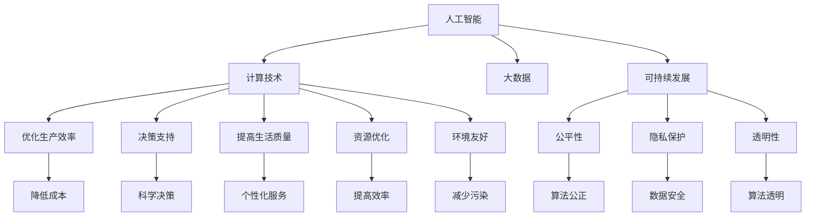

                 

# 创造更美好的明天：人类计算的积极作用

> 关键词：人工智能,计算技术,社会影响,大数据,伦理道德,可持续发展

## 1. 背景介绍

### 1.1 问题由来
随着计算技术的迅猛发展，人工智能（AI）正以前所未有的速度融入人类的生产生活。无论是智能家居、智能医疗，还是智能交通、智能制造，AI技术都在为人类带来巨大的便利和效益。然而，科技进步也带来了新的问题和挑战，如数据隐私保护、就业结构变化、伦理道德等，这些问题不容忽视。

面对这些挑战，我们亟需建立一套既能够充分利用计算技术为人类创造美好生活，又能够合理控制其负面影响的发展机制。本文将从计算技术的角度，探讨其对社会生活的积极作用，并提出一些应对未来挑战的策略。

### 1.2 问题核心关键点
计算技术对社会生活的积极作用主要体现在以下几个方面：
- **提升生产效率**：通过自动化、智能化生产，减少人工操作，降低成本，提高生产效率。
- **优化决策过程**：借助大数据和机器学习，从海量数据中提取有价值的信息，为决策提供科学依据。
- **改善生活质量**：利用AI技术，提供个性化服务，提高生活质量，如智能医疗、智能家居等。
- **促进可持续发展**：通过计算技术，优化资源配置，提高能源利用效率，实现环境友好型发展。

## 2. 核心概念与联系

### 2.1 核心概念概述

为更好地理解计算技术对社会生活的积极作用，本节将介绍几个密切相关的核心概念：

- **人工智能（AI）**：通过模拟人类智能行为，使机器能够执行复杂任务的技术。
- **计算技术**：以信息处理为基础，通过算法和数据处理技术，实现信息自动化、智能化的技术。
- **大数据**：规模庞大、结构复杂、形式多样的数据集，为数据分析、决策支持等提供坚实基础。
- **可持续发展**：在满足当前需求的同时，不损害后代人满足需求的能力，追求经济、社会、环境的协调发展。
- **伦理道德**：在计算技术应用过程中，关注数据隐私、算法透明性、公平性等问题，确保技术应用符合社会伦理标准。

这些核心概念之间的逻辑关系可以通过以下Mermaid流程图来展示：



这个流程图展示了几组核心概念之间的关系：

1. **人工智能与计算技术**：AI技术的核心是计算技术，通过算法和数据处理，使机器具备智能行为。
2. **大数据与人工智能**：大数据为AI提供了训练和验证的基础，使AI能够从海量数据中提取有用信息。
3. **可持续发展与人工智能**：AI技术在资源配置、环境监测等方面具有重要作用，促进可持续发展。
4. **伦理道德与人工智能**：AI应用中需要关注伦理道德问题，确保技术应用符合社会规范。
5. **各功能模块与核心概念**：AI技术通过优化生产效率、提供决策支持、改善生活质量、促进资源优化和环境友好，实现了对社会生活的积极作用。

这些概念共同构成了计算技术在社会生活中的应用框架，为我们提供了理解和应用计算技术的理论基础。

## 3. 核心算法原理 & 具体操作步骤

### 3.1 算法原理概述

计算技术对社会生活的积极作用，主要通过以下算法原理实现：

1. **算法优化**：通过优化算法，提高生产效率和决策准确性。例如，优化算法用于物流配送、供应链管理等领域，能够显著减少运输成本，提高配送速度。
2. **数据驱动决策**：利用大数据分析和机器学习算法，从数据中提取有用信息，为决策提供依据。例如，智能医疗系统利用患者历史数据，预测疾病风险，制定个性化治疗方案。
3. **自然语言处理**：通过自然语言处理技术，实现人与机器的自然交互，提高生活质量。例如，智能客服系统通过理解用户意图，提供高效的服务支持。
4. **计算优化资源**：利用计算技术优化资源配置，提高能源利用效率。例如，智能电网通过实时数据监控，优化电力分配，减少能源浪费。

### 3.2 算法步骤详解

具体来说，计算技术对社会生活的积极作用可以通过以下步骤实现：

**Step 1: 数据收集与预处理**
- 收集相关领域的原始数据，如工业生产数据、医疗记录、交通流量等。
- 对数据进行清洗、整理、标注，确保数据质量和可用性。

**Step 2: 算法设计与训练**
- 根据具体需求，设计合适的算法模型，如优化算法、机器学习模型、自然语言处理模型等。
- 利用数据集对模型进行训练，调整模型参数，优化算法性能。

**Step 3: 模型部署与应用**
- 将训练好的模型部署到实际应用场景中，如智能生产系统、智能医疗平台、智能交通系统等。
- 对用户输入的数据进行实时处理，输出相应的结果。

**Step 4: 监控与优化**
- 实时监控模型运行情况，收集反馈数据，评估模型性能。
- 根据反馈数据，调整模型参数，优化算法性能。

**Step 5: 持续改进**
- 定期更新数据集，重新训练模型，提升算法性能。
- 不断优化算法流程，确保计算技术对社会生活的积极作用。

### 3.3 算法优缺点

计算技术对社会生活的积极作用主要体现在以下几个方面：
- **提高效率**：通过自动化、智能化生产，大幅提高生产效率和决策效率。
- **优化决策**：利用数据驱动的决策支持系统，提高决策的科学性和准确性。
- **改善生活质量**：提供个性化服务和智能交互，提高生活质量。
- **资源优化**：优化资源配置，提高能源利用效率，实现可持续发展。

然而，计算技术也存在一些局限性：
- **数据隐私**：在数据收集和处理过程中，存在隐私泄露的风险。
- **算法偏见**：算法可能存在固有的偏见，导致决策不公。
- **伦理道德**：技术应用过程中可能涉及伦理道德问题，如自动化取代人力。
- **资源消耗**：大规模计算任务的资源消耗较大，可能对环境造成影响。

这些缺点需要我们在实际应用中加以注意，并采取相应的措施加以规避。

### 3.4 算法应用领域

计算技术在多个领域得到了广泛应用，以下是几个典型应用：

- **智能制造**：通过优化算法和机器学习，实现自动化生产，提高生产效率和产品质量。
- **智慧医疗**：利用大数据和机器学习，提供个性化的医疗服务和疾病预测。
- **智能交通**：通过实时数据监控和优化算法，实现交通流量的合理分配，减少拥堵。
- **能源管理**：利用智能电网技术，优化电力分配，提高能源利用效率。
- **智能客服**：通过自然语言处理技术，提供智能客服支持，提高用户满意度。
- **金融科技**：利用大数据分析和机器学习，提供风险控制和决策支持。

## 4. 数学模型和公式 & 详细讲解 & 举例说明

### 4.1 数学模型构建

计算技术对社会生活的积极作用，可以从多个维度进行建模：

1. **生产效率模型**：
   $$
   \text{Efficiency} = \frac{\text{产出}}{\text{投入}} = \frac{P}{C}
   $$
   其中，$P$ 为产出，$C$ 为投入，包括人力、物资、时间等。

2. **决策支持模型**：
   $$
   \text{Decision} = f(\text{Data})
   $$
   其中，$\text{Data}$ 为数据集，$f$ 为决策算法。

3. **生活质量模型**：
   $$
   \text{Quality} = \sum_{i=1}^{n} w_i \times \text{Score}_i
   $$
   其中，$n$ 为评价指标个数，$w_i$ 为各指标的权重，$\text{Score}_i$ 为各指标的评分。

4. **可持续发展模型**：
   $$
   \text{Sustainability} = \text{Economic} + \text{Social} + \text{Environment}
   $$
   其中，$\text{Economic}$、$\text{Social}$、$\text{Environment}$ 分别为经济、社会、环境的评价指标。

### 4.2 公式推导过程

以下是一些典型公式的推导过程：

**生产效率模型推导**：
设某生产过程的产出为 $P$，投入为 $C$，则生产效率 $E$ 可表示为：
$$
E = \frac{P}{C}
$$
通过优化生产流程，减少投入 $C$，提高产出 $P$，从而提升生产效率 $E$。

**决策支持模型推导**：
设某决策问题的数据集为 $D$，决策算法为 $f$，则最优决策 $\text{Decision}$ 可表示为：
$$
\text{Decision} = f(D)
$$
通过选择最优的决策算法 $f$，结合高质量的数据集 $D$，能够实现最优的决策支持。

**生活质量模型推导**：
设某生活质量评价指标为 $S$，其评分向量为 $\text{Score}$，各指标权重为 $w$，则生活质量 $\text{Quality}$ 可表示为：
$$
\text{Quality} = \sum_{i=1}^{n} w_i \times \text{Score}_i
$$
通过合理设计评价指标和权重，能够全面评估生活质量，指导政策制定和社会发展。

### 4.3 案例分析与讲解

以下以智慧医疗为例，分析计算技术对社会生活的积极作用：

智慧医疗系统通过计算技术实现医疗服务的智能化、个性化。首先，系统收集患者的电子病历、检查报告、生活习惯等数据，利用大数据分析技术，识别出患者的健康风险因素。其次，利用机器学习算法，预测患者的疾病发展趋势，制定个性化的治疗方案。最后，系统通过智能推荐系统，为医生提供最优的治疗方案，提高医疗服务质量。

该系统在实际应用中，显著提高了诊断准确性、治疗效果和患者满意度，实现了资源的优化配置，降低了医疗成本。

## 5. 项目实践：代码实例和详细解释说明

### 5.1 开发环境搭建

在进行计算技术的应用开发前，需要搭建合适的开发环境。以下是使用Python进行TensorFlow开发的典型流程：

1. 安装Anaconda：从官网下载并安装Anaconda，用于创建独立的Python环境。

2. 创建并激活虚拟环境：
```bash
conda create -n tf-env python=3.8 
conda activate tf-env
```

3. 安装TensorFlow：根据CUDA版本，从官网获取对应的安装命令。例如：
```bash
conda install tensorflow
```

4. 安装各类工具包：
```bash
pip install numpy pandas scikit-learn matplotlib tqdm jupyter notebook ipython
```

完成上述步骤后，即可在`tf-env`环境中开始计算技术的应用开发。

### 5.2 源代码详细实现

这里我们以智慧医疗系统为例，给出使用TensorFlow进行患者健康风险预测的代码实现。

首先，定义数据处理函数：

```python
import tensorflow as tf
import numpy as np

def preprocess_data(data):
    # 数据预处理，如归一化、缺失值处理等
    # ...
    return np.array(data)
```

然后，定义模型和优化器：

```python
from tensorflow.keras.models import Sequential
from tensorflow.keras.layers import Dense, Dropout, Input
from tensorflow.keras.callbacks import EarlyStopping

# 构建模型
model = Sequential()
model.add(Dense(64, input_dim=10, activation='relu'))
model.add(Dropout(0.5))
model.add(Dense(10, activation='softmax'))

# 编译模型
model.compile(loss='categorical_crossentropy', optimizer='adam', metrics=['accuracy'])

# 设置早停机制
early_stopping = EarlyStopping(monitor='val_loss', patience=10)
```

接着，定义训练和评估函数：

```python
def train_model(model, train_data, val_data, batch_size=32, epochs=100):
    # 训练模型
    model.fit(train_data, train_labels, validation_data=(val_data, val_labels), batch_size=batch_size, epochs=epochs, callbacks=[early_stopping])

    # 评估模型
    test_loss, test_acc = model.evaluate(test_data, test_labels)
    print(f'Test loss: {test_loss:.4f}')
    print(f'Test accuracy: {test_acc:.4f}')
```

最后，启动训练流程：

```python
# 准备数据集
train_data, val_data, test_data = ...
train_labels, val_labels, test_labels = ...

# 调用训练函数
train_model(model, train_data, val_data, epochs=100)
```

以上就是使用TensorFlow进行患者健康风险预测的完整代码实现。可以看到，TensorFlow提供了强大的计算能力和丰富的工具支持，使得计算技术的开发更加高效。

### 5.3 代码解读与分析

让我们再详细解读一下关键代码的实现细节：

**preprocess_data函数**：
- 数据预处理是模型训练和推理的基础，这里实现了一些基本的数据清洗和归一化操作。

**Sequential模型**：
- Sequential模型是TensorFlow中常用的线性堆叠模型，适合于顺序连接的神经网络层。
- 模型第一层为全连接层，激活函数为ReLU，输出层为softmax，用于多分类任务。

**Dropout层**：
- Dropout层用于防止过拟合，随机将部分神经元的输出置为0。

**EarlyStopping回调**：
- EarlyStopping用于设置早停机制，监控验证集损失，一旦损失不再下降，提前停止训练。

**train_model函数**：
- 函数实现了模型的训练和评估流程，通过拟合数据集，不断更新模型参数，评估模型性能。

**训练流程**：
- 准备数据集，包括训练集、验证集和测试集。
- 调用train_model函数进行模型训练，设置训练轮数和批次大小。
- 在训练过程中，监控验证集损失，一旦损失不再下降，触发早停机制。

可以看到，TensorFlow提供了灵活的API和丰富的回调机制，使得计算技术的开发和应用更加方便。

当然，工业级的系统实现还需考虑更多因素，如模型的保存和部署、超参数的自动搜索、更灵活的任务适配层等。但核心的算法流程基本与此类似。

## 6. 实际应用场景

### 6.1 智能制造

智能制造系统通过计算技术实现生产过程的智能化和自动化。首先，系统收集设备运行数据、产品质量数据等，利用大数据分析技术，识别出生产过程中的异常点和瓶颈。其次，利用优化算法，调整生产流程，提高生产效率和产品质量。最后，系统通过实时监控和反馈，实现生产过程的持续优化。

该系统在实际应用中，显著提高了生产效率和产品质量，降低了生产成本，推动了制造业的数字化转型。

### 6.2 智慧医疗

智慧医疗系统通过计算技术实现医疗服务的智能化和个性化。首先，系统收集患者的电子病历、检查报告、生活习惯等数据，利用大数据分析技术，识别出患者的健康风险因素。其次，利用机器学习算法，预测患者的疾病发展趋势，制定个性化的治疗方案。最后，系统通过智能推荐系统，为医生提供最优的治疗方案，提高医疗服务质量。

该系统在实际应用中，显著提高了诊断准确性、治疗效果和患者满意度，实现了资源的优化配置，降低了医疗成本。

### 6.3 智能交通

智能交通系统通过计算技术实现交通流量的智能化和优化。首先，系统收集交通流量数据、车辆位置数据等，利用大数据分析技术，识别出交通瓶颈和异常点。其次，利用优化算法，调整交通信号灯、道路布局，实现交通流量的合理分配。最后，系统通过实时监控和反馈，实现交通流量的持续优化。

该系统在实际应用中，显著缓解了交通拥堵，提高了交通效率，减少了交通事故和环境污染。

### 6.4 未来应用展望

随着计算技术的不断发展，未来在多个领域将进一步深化应用：

1. **智能城市**：利用计算技术实现城市管理的智能化和优化，包括智慧交通、智能安防、智能环保等领域。
2. **智能金融**：利用大数据分析和机器学习技术，实现风险控制和投资决策。
3. **智能教育**：利用计算技术实现个性化教育和智能评估。
4. **智能农业**：利用计算技术实现精准农业和农业机械自动化。

这些应用将推动各行各业实现数字化、智能化转型，为人类创造更美好的生活。

## 7. 工具和资源推荐

### 7.1 学习资源推荐

为了帮助开发者系统掌握计算技术的应用，这里推荐一些优质的学习资源：

1. **《TensorFlow官方文档》**：TensorFlow的官方文档提供了详细的API介绍和示例代码，是学习TensorFlow不可或缺的资源。

2. **《深度学习基础》**：斯坦福大学Andrew Ng教授的在线课程，系统介绍了深度学习的基本概念和常用技术。

3. **《Python编程：从入门到实践》**：一本介绍Python编程的入门书籍，适合初学者学习。

4. **《大数据技术与实践》**：介绍大数据技术的经典书籍，涵盖数据收集、数据处理、数据可视化等方面。

5. **Kaggle数据科学竞赛平台**：提供丰富的数据集和竞赛平台，适合实践和挑战自我。

通过对这些资源的学习实践，相信你一定能够快速掌握计算技术的精髓，并用于解决实际的计算问题。

### 7.2 开发工具推荐

高效的开发离不开优秀的工具支持。以下是几款用于计算技术开发常用的工具：

1. **Jupyter Notebook**：基于Web的交互式编程环境，适合快速原型开发和数据可视化。

2. **TensorBoard**：TensorFlow配套的可视化工具，可实时监测模型训练状态，并提供丰富的图表呈现方式。

3. **Weights & Biases**：模型训练的实验跟踪工具，可以记录和可视化模型训练过程中的各项指标，方便对比和调优。

4. **GitHub**：全球最大的开源代码托管平台，适合存储和分享计算技术项目代码。

5. **PyTorch Lightning**：基于PyTorch的快速原型开发框架，适合构建高效的深度学习模型。

6. **Cloudflare Ray**：分布式计算框架，适合处理大规模计算任务。

合理利用这些工具，可以显著提升计算技术的开发效率，加快创新迭代的步伐。

### 7.3 相关论文推荐

计算技术的发展离不开学界的持续研究。以下是几篇奠基性的相关论文，推荐阅读：

1. **《深度学习》**：Ian Goodfellow、Yoshua Bengio和Aaron Courville合著的经典教材，全面介绍了深度学习的基础理论和技术。

2. **《强化学习》**：Richard Sutton和Andrew Barto的经典著作，介绍了强化学习的原理和算法。

3. **《机器学习》**：Tom Mitchell的著作，系统介绍了机器学习的基本概念和常用技术。

4. **《自然语言处理综论》**：Daniel Jurafsky和James H. Martin的经典教材，涵盖了自然语言处理的基础知识和最新进展。

这些论文代表了大数据和人工智能领域的最新研究成果，通过学习这些前沿成果，可以帮助研究者把握学科前进方向，激发更多的创新灵感。

## 8. 总结：未来发展趋势与挑战

### 8.1 总结

本文对计算技术在社会生活中的积极作用进行了全面系统的介绍。首先阐述了计算技术在生产效率、决策支持、生活质量和可持续发展等方面的重要作用。其次，从算法原理到实际应用，详细讲解了计算技术的具体实施流程。最后，展望了计算技术在智能制造、智慧医疗、智能交通等领域的未来应用前景。

通过本文的系统梳理，可以看到，计算技术在多个领域已经展现出巨大的潜力，能够为社会生活带来多方面的积极影响。未来，随着计算技术的不断发展，计算技术在社会生活中的应用将更加广泛和深入。

### 8.2 未来发展趋势

展望未来，计算技术在社会生活中的应用将呈现以下几个发展趋势：

1. **智能化水平提升**：随着计算技术的不断发展，计算技术的智能化水平将进一步提升，能够更好地理解和适应复杂多变的场景。
2. **数据驱动决策**：大数据和机器学习将成为决策支持的重要手段，进一步提升决策的科学性和准确性。
3. **环境友好**：计算技术在资源优化和环境监测方面的应用将更加深入，推动可持续发展。
4. **伦理道德**：计算技术的应用将更加注重伦理道德，确保技术应用符合社会规范。
5. **跨领域融合**：计算技术将与其他技术（如物联网、区块链等）进行更深入的融合，实现更广泛的应用场景。

这些趋势凸显了计算技术在社会生活中的重要性和前景。这些方向的探索发展，必将进一步推动社会生活的智能化、个性化和可持续发展。

### 8.3 面临的挑战

尽管计算技术在社会生活中展现出巨大的潜力，但在实际应用中，仍面临诸多挑战：

1. **数据隐私**：在数据收集和处理过程中，存在隐私泄露的风险，需要采取数据保护措施。
2. **算法偏见**：算法可能存在固有的偏见，导致决策不公，需要加强算法透明性和公平性。
3. **资源消耗**：大规模计算任务的资源消耗较大，可能对环境造成影响，需要优化计算流程。
4. **伦理道德**：技术应用过程中可能涉及伦理道德问题，如自动化取代人力，需要建立合理的伦理框架。

这些挑战需要我们积极应对，并寻求突破，才能真正实现计算技术的积极作用。

### 8.4 研究展望

面对计算技术在社会生活中应用的挑战，未来的研究需要在以下几个方面寻求新的突破：

1. **隐私保护技术**：开发更加高效的数据保护技术，确保数据隐私安全。
2. **算法透明性**：加强算法透明性，减少算法的偏见和误解。
3. **资源优化**：优化计算流程，减少资源消耗，实现环境友好型发展。
4. **伦理道德框架**：建立合理的伦理道德框架，确保技术应用符合社会规范。

这些研究方向的探索，将为计算技术在社会生活中的应用提供坚实的理论基础和实践指导，推动计算技术更好地服务于人类社会。

## 9. 附录：常见问题与解答

**Q1：计算技术如何应用于生产效率提升？**

A: 计算技术通过自动化和智能化生产，减少人工操作，提高生产效率。例如，通过优化算法，实现设备运行调度优化，提高生产线的利用率。利用机器学习，优化生产流程，减少生产过程中的浪费和缺陷。

**Q2：计算技术在数据驱动决策中的作用是什么？**

A: 计算技术通过大数据分析和机器学习，从海量数据中提取有用信息，为决策提供科学依据。例如，在智能制造中，通过大数据分析，识别出生产过程中的瓶颈和异常点，制定优化方案。在智慧医疗中，通过大数据分析，预测患者的疾病发展趋势，制定个性化的治疗方案。

**Q3：如何平衡计算技术的智能化与人类就业的关系？**

A: 计算技术的智能化将带来就业结构的变化，部分低技能工作可能被机器取代。为了平衡这一关系，需要加强技能培训和再教育，提升人类适应智能化的能力。同时，通过计算技术创造新的就业机会，如数据分析、机器学习等高技能岗位。

**Q4：计算技术在环境保护方面的应用有哪些？**

A: 计算技术在环境保护方面的应用包括智能电网、碳排放监测、环境数据处理等方面。通过实时数据监控和优化算法，实现能源的合理分配，减少能源浪费。通过大数据分析，监测环境污染，制定环境治理方案。

**Q5：计算技术在伦理道德方面需要注意哪些问题？**

A: 计算技术在伦理道德方面需要注意数据隐私、算法透明性、算法公正等问题。需要确保数据收集和处理过程中的隐私保护，建立透明的算法流程，避免算法偏见。同时，需要建立合理的伦理框架，确保技术应用符合社会规范。

通过这些问题的解答，可以看出计算技术在社会生活中的积极作用和潜在的挑战。未来，只有积极应对挑战，才能充分发挥计算技术在社会生活中的作用，为人类创造更美好的明天。

---

作者：禅与计算机程序设计艺术 / Zen and the Art of Computer Programming

