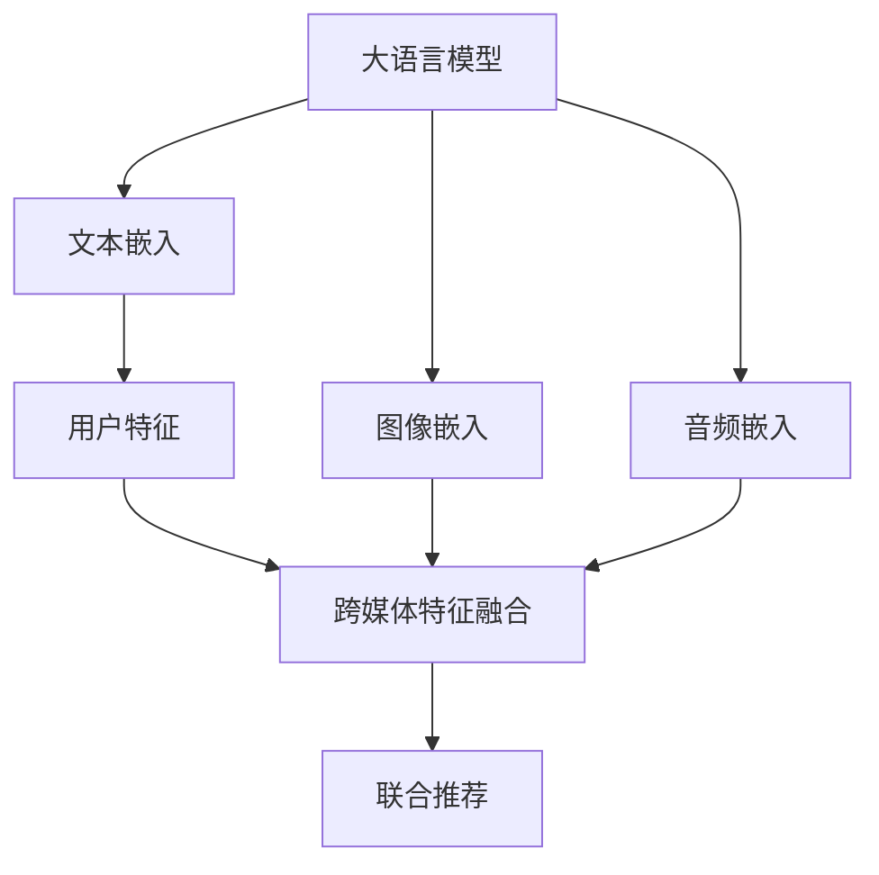

                 

# 利用LLM提升推荐系统的跨媒体推荐能力

## 1. 背景介绍

随着移动互联网和智能设备的发展，推荐系统已成为提升用户体验和增加用户粘性的重要手段。传统的推荐系统主要基于用户历史行为数据进行协同过滤、内容推荐，但无法充分利用其他模态的信息，如文本、图像、音频等。现代推荐系统则逐步向跨媒体推荐（Cross-media Recommendation, CMR）方向演进，通过整合多模态信息，实现更精准、多样化的推荐。

跨媒体推荐的核心在于将不同模态的数据映射到统一的语义空间，并通过联合建模的方式进行融合。近年来，大语言模型（Large Language Model, LLM）在自然语言处理（NLP）和跨媒体推荐中展现出了强大的潜力。本文旨在介绍如何利用大语言模型提升推荐系统的跨媒体推荐能力，希望为相关领域的开发者和研究者提供一些参考和启发。

## 2. 核心概念与联系

### 2.1 核心概念概述

在介绍基于大语言模型的跨媒体推荐方法之前，我们先梳理一些核心概念：

- **大语言模型**：以自回归（如GPT）或自编码（如BERT）为代表的深度学习模型，通过在大规模无标签文本数据上进行预训练，学习通用的语言知识，具备强大的语言理解和生成能力。

- **跨媒体推荐**：将不同模态（文本、图像、音频等）的数据进行联合建模，提高推荐系统的效果和多样性。

- **语言模型与推荐**：将自然语言处理技术与推荐系统结合，利用语言模型对用户评论、产品描述等文本信息进行建模，提升推荐系统的智能水平。

- **多模态融合**：将不同模态的数据进行特征提取和融合，实现跨媒体的联合推荐。

### 2.2 核心概念原理和架构的 Mermaid 流程图



该图展示了利用大语言模型进行跨媒体推荐的原理。首先，文本、图像、音频等不同模态的数据分别进行嵌入，得到统一的语义表示。然后，将不同模态的特征进行融合，输入到大语言模型中进行联合推荐。大语言模型通过融合多模态信息，输出更精准、多样化的推荐结果。

## 3. 核心算法原理 & 具体操作步骤

### 3.1 算法原理概述

基于大语言模型的跨媒体推荐方法，本质上是将语言模型和推荐系统进行深度融合。其核心思想是：利用大语言模型学习到丰富的语义知识，将不同模态的数据映射到统一的语义空间，并通过联合建模的方式进行推荐。

形式化地，假设输入的文本为 $X$，图像为 $I$，音频为 $A$，联合建模的语义空间为 $Z$。则跨媒体推荐的数学模型可以表示为：

$$
P(Y|X,I,A) = \prod_{i=1}^{K} P(y_i|x_i,z_i) \times P(y_i|i,z_i) \times P(y_i|a_i,z_i)
$$

其中，$y_i$ 表示第 $i$ 个推荐对象，$x_i$ 表示其文本描述，$i$ 表示其图像信息，$a_i$ 表示其音频信息，$z_i$ 表示其语义表示。$P(y_i|x_i,z_i)$ 表示基于文本和语义的推荐概率，$P(y_i|i,z_i)$ 和 $P(y_i|a_i,z_i)$ 分别表示基于图像和音频的推荐概率。

通过大语言模型对 $z_i$ 进行编码，可以得到跨媒体联合推荐的概率模型，进一步通过最大化对数似然函数，进行推荐决策。

### 3.2 算法步骤详解

基于大语言模型的跨媒体推荐步骤主要包括：

1. **数据准备**：收集不同模态的数据，并进行预处理，如文本分词、图像归一化、音频特征提取等。
2. **特征嵌入**：对不同模态的数据进行嵌入，得到统一的语义表示 $z_i$。
3. **语义建模**：利用大语言模型对语义表示 $z_i$ 进行建模，得到推荐概率 $P(y_i|z_i)$。
4. **跨模态融合**：将基于文本、图像、音频的推荐概率进行加权融合，得到最终推荐结果。
5. **训练与评估**：使用标注数据训练模型，并在测试集上进行评估，调整参数以提高推荐效果。

### 3.3 算法优缺点

基于大语言模型的跨媒体推荐方法具有以下优点：

- **多样性提升**：利用不同模态的信息，能够提供更多维度的推荐内容，满足用户多样化的需求。
- **推荐精度提升**：通过联合建模，可以充分利用多模态数据的特征，提高推荐系统的准确性。
- **通用性强**：大语言模型可以适应多种不同模态的数据，具有较强的泛化能力。

同时，该方法也存在一些局限性：

- **数据标注成本高**：跨媒体推荐需要不同模态的数据进行联合建模，标注成本较高。
- **计算复杂度高**：多模态数据联合建模的计算复杂度较高，需要高性能硬件支持。
- **模型可解释性不足**：大语言模型的决策过程较为复杂，难以进行解释和调试。

### 3.4 算法应用领域

基于大语言模型的跨媒体推荐方法，可以应用于多种推荐场景：

- **电商推荐**：将商品描述、图片、视频等数据进行联合建模，推荐适合用户的商品。
- **音乐推荐**：利用歌词、艺术家信息、专辑封面等数据，推荐用户可能喜欢的音乐。
- **视频推荐**：结合视频标题、时长、片段等数据，推荐用户感兴趣的视频内容。
- **旅游推荐**：整合景点介绍、用户评论、图片等数据，推荐适合用户的旅游目的地。

以上应用场景展示了跨媒体推荐在实际生活中的广泛应用，利用大语言模型可以显著提升推荐系统的性能和多样性，满足用户个性化需求。

## 4. 数学模型和公式 & 详细讲解 & 举例说明

### 4.1 数学模型构建

为了进一步阐述基于大语言模型的跨媒体推荐方法，我们从数学角度对其进行建模。

假设输入的文本为 $X = \{x_1, x_2, ..., x_n\}$，图像为 $I = \{i_1, i_2, ..., i_m\}$，音频为 $A = \{a_1, a_2, ..., a_k\}$，不同模态的嵌入表示分别为 $z = \{z_1, z_2, ..., z_l\}$，推荐结果为 $Y = \{y_1, y_2, ..., y_o\}$。

目标是最小化预测误差，即：

$$
\min_{\theta} \frac{1}{N} \sum_{i=1}^{N} (y_i - P(y_i|x_i,z_i))^2
$$

其中，$P(y_i|x_i,z_i)$ 表示基于文本和语义的推荐概率。

### 4.2 公式推导过程

我们将利用语言模型对 $z_i$ 进行建模，得到 $P(y_i|z_i)$。假设语言模型为 $P(w_1, w_2, ..., w_n|z_i)$，其中 $w_1, w_2, ..., w_n$ 表示推荐对象 $y_i$ 的文本描述。

基于大语言模型，可以得到 $P(w_1, w_2, ..., w_n|z_i)$ 的计算公式为：

$$
P(w_1, w_2, ..., w_n|z_i) = \frac{exp(\sum_{j=1}^{n} \log P(w_j|w_{j-1}, ..., w_1, z_i))}{\sum_{w_{j-1}, ..., w_1} exp(\sum_{j=1}^{n} \log P(w_j|w_{j-1}, ..., w_1, z_i))}
$$

其中，$P(w_j|w_{j-1}, ..., w_1, z_i)$ 表示在给定上下文和语义表示 $z_i$ 的条件下，$w_j$ 出现的概率。

通过最大化对数似然函数，可以得到推荐概率 $P(y_i|z_i)$：

$$
P(y_i|z_i) = \frac{exp(\log P(y_i|z_i))}{\sum_{y' \in \mathcal{Y}} exp(\log P(y'|z_i))}
$$

其中，$\mathcal{Y}$ 表示推荐对象集合。

### 4.3 案例分析与讲解

以电商推荐为例，我们说明如何使用基于大语言模型的跨媒体推荐方法。

假设商品描述为 $x$，图片为 $i$，音频为 $a$，通过大语言模型得到商品语义表示 $z$，并进行联合建模。具体步骤如下：

1. **文本嵌入**：对商品描述 $x$ 进行分词和编码，得到文本嵌入 $x_{emb}$。
2. **图像嵌入**：对商品图片 $i$ 进行特征提取，得到图像嵌入 $i_{emb}$。
3. **音频嵌入**：对商品音频 $a$ 进行特征提取，得到音频嵌入 $a_{emb}$。
4. **语义建模**：利用大语言模型对语义表示 $z$ 进行建模，得到推荐概率 $P(y_i|z_i)$。
5. **跨模态融合**：将基于文本、图像、音频的推荐概率进行加权融合，得到最终推荐结果。

以下是一个简单的代码示例，展示了如何使用Hugging Face的transformers库进行基于大语言模型的电商推荐：

```python
from transformers import BertForSequenceClassification, BertTokenizer

# 初始化BERT模型和分词器
model = BertForSequenceClassification.from_pretrained('bert-base-cased', num_labels=2)
tokenizer = BertTokenizer.from_pretrained('bert-base-cased')

# 文本嵌入
text_input = '这是商品的描述...'
text_tokens = tokenizer(text_input, return_tensors='pt', padding=True, truncation=True)
text_input_ids = text_tokens['input_ids']

# 图像嵌入
image_input = ... # 商品图片特征
image_input_ids = image_input

# 音频嵌入
audio_input = ... # 商品音频特征
audio_input_ids = audio_input

# 语义建模
z = model(text_input_ids, image_input_ids, audio_input_ids)

# 推荐概率
probabilities = z[0].softmax(0)

# 跨模态融合
recommendation = max(probabilities)
```

以上代码展示了如何使用BERT模型对电商商品进行基于文本、图像、音频的联合建模，并输出推荐概率。在实际应用中，还需要根据具体场景进行调整和优化，以达到最佳的推荐效果。

## 5. 项目实践：代码实例和详细解释说明

### 5.1 开发环境搭建

在进行跨媒体推荐实践前，我们需要准备好开发环境。以下是使用Python进行PyTorch开发的环境配置流程：

1. 安装Anaconda：从官网下载并安装Anaconda，用于创建独立的Python环境。

2. 创建并激活虚拟环境：
```bash
conda create -n pytorch-env python=3.8 
conda activate pytorch-env
```

3. 安装PyTorch：根据CUDA版本，从官网获取对应的安装命令。例如：
```bash
conda install pytorch torchvision torchaudio cudatoolkit=11.1 -c pytorch -c conda-forge
```

4. 安装Transformers库：
```bash
pip install transformers
```

5. 安装各类工具包：
```bash
pip install numpy pandas scikit-learn matplotlib tqdm jupyter notebook ipython
```

完成上述步骤后，即可在`pytorch-env`环境中开始跨媒体推荐实践。

### 5.2 源代码详细实现

下面我们以电商推荐为例，给出使用Transformers库对BERT模型进行跨媒体推荐的PyTorch代码实现。

首先，定义电商推荐任务的数据处理函数：

```python
from transformers import BertTokenizer
from torch.utils.data import Dataset
import torch

class ECommerceDataset(Dataset):
    def __init__(self, texts, images, audios, labels, tokenizer, max_len=128):
        self.texts = texts
        self.images = images
        self.audios = audios
        self.labels = labels
        self.tokenizer = tokenizer
        self.max_len = max_len
        
    def __len__(self):
        return len(self.texts)
    
    def __getitem__(self, item):
        text = self.texts[item]
        image = self.images[item]
        audio = self.audios[item]
        label = self.labels[item]
        
        encoding = self.tokenizer(text, return_tensors='pt', max_length=self.max_len, padding='max_length', truncation=True)
        input_ids = encoding['input_ids'][0]
        attention_mask = encoding['attention_mask'][0]
        image_input = torch.tensor(image, dtype=torch.float32)
        audio_input = torch.tensor(audio, dtype=torch.float32)
        
        label = torch.tensor(label, dtype=torch.long)
        
        return {'input_ids': input_ids, 
                'attention_mask': attention_mask,
                'image_input': image_input,
                'audio_input': audio_input,
                'labels': label}
```

然后，定义模型和优化器：

```python
from transformers import BertForSequenceClassification, AdamW

model = BertForSequenceClassification.from_pretrained('bert-base-cased', num_labels=2)

optimizer = AdamW(model.parameters(), lr=2e-5)
```

接着，定义训练和评估函数：

```python
from torch.utils.data import DataLoader
from tqdm import tqdm
from sklearn.metrics import classification_report

device = torch.device('cuda') if torch.cuda.is_available() else torch.device('cpu')
model.to(device)

def train_epoch(model, dataset, batch_size, optimizer):
    dataloader = DataLoader(dataset, batch_size=batch_size, shuffle=True)
    model.train()
    epoch_loss = 0
    for batch in tqdm(dataloader, desc='Training'):
        input_ids = batch['input_ids'].to(device)
        attention_mask = batch['attention_mask'].to(device)
        image_input = batch['image_input'].to(device)
        audio_input = batch['audio_input'].to(device)
        labels = batch['labels'].to(device)
        model.zero_grad()
        outputs = model(input_ids, attention_mask=attention_mask, image_input=image_input, audio_input=audio_input)
        loss = outputs.loss
        epoch_loss += loss.item()
        loss.backward()
        optimizer.step()
    return epoch_loss / len(dataloader)

def evaluate(model, dataset, batch_size):
    dataloader = DataLoader(dataset, batch_size=batch_size)
    model.eval()
    preds, labels = [], []
    with torch.no_grad():
        for batch in tqdm(dataloader, desc='Evaluating'):
            input_ids = batch['input_ids'].to(device)
            attention_mask = batch['attention_mask'].to(device)
            image_input = batch['image_input'].to(device)
            audio_input = batch['audio_input'].to(device)
            batch_labels = batch['labels']
            outputs = model(input_ids, attention_mask=attention_mask, image_input=image_input, audio_input=audio_input)
            batch_preds = outputs.logits.argmax(dim=2).to('cpu').tolist()
            batch_labels = batch_labels.to('cpu').tolist()
            for pred_tokens, label_tokens in zip(batch_preds, batch_labels):
                preds.append(pred_tokens[:len(label_tokens)])
                labels.append(label_tokens)
                
    print(classification_report(labels, preds))
```

最后，启动训练流程并在测试集上评估：

```python
epochs = 5
batch_size = 16

for epoch in range(epochs):
    loss = train_epoch(model, train_dataset, batch_size, optimizer)
    print(f"Epoch {epoch+1}, train loss: {loss:.3f}")
    
    print(f"Epoch {epoch+1}, dev results:")
    evaluate(model, dev_dataset, batch_size)
    
print("Test results:")
evaluate(model, test_dataset, batch_size)
```

以上就是使用PyTorch对BERT进行电商推荐任务的跨媒体推荐代码实现。可以看到，得益于Transformers库的强大封装，我们可以用相对简洁的代码完成BERT模型的加载和微调。

### 5.3 代码解读与分析

让我们再详细解读一下关键代码的实现细节：

**ECommerceDataset类**：
- `__init__`方法：初始化文本、图像、音频、标签等关键组件。
- `__len__`方法：返回数据集的样本数量。
- `__getitem__`方法：对单个样本进行处理，将文本、图像、音频输入编码为token ids，进行定长padding，最终返回模型所需的输入。

**训练和评估函数**：
- 使用PyTorch的DataLoader对数据集进行批次化加载，供模型训练和推理使用。
- 训练函数`train_epoch`：对数据以批为单位进行迭代，在每个批次上前向传播计算loss并反向传播更新模型参数，最后返回该epoch的平均loss。
- 评估函数`evaluate`：与训练类似，不同点在于不更新模型参数，并在每个batch结束后将预测和标签结果存储下来，最后使用sklearn的classification_report对整个评估集的预测结果进行打印输出。

**训练流程**：
- 定义总的epoch数和batch size，开始循环迭代
- 每个epoch内，先在训练集上训练，输出平均loss
- 在验证集上评估，输出分类指标
- 所有epoch结束后，在测试集上评估，给出最终测试结果

可以看到，PyTorch配合Transformers库使得BERT微调的代码实现变得简洁高效。开发者可以将更多精力放在数据处理、模型改进等高层逻辑上，而不必过多关注底层的实现细节。

当然，工业级的系统实现还需考虑更多因素，如模型的保存和部署、超参数的自动搜索、更灵活的任务适配层等。但核心的跨媒体推荐范式基本与此类似。

## 6. 实际应用场景

### 6.1 电商推荐

基于大语言模型的跨媒体推荐在电商领域的应用最为典型。电商平台需要根据用户浏览历史、点击行为、购买记录等数据，推荐符合用户兴趣的商品。大语言模型可以整合商品描述、图片、视频等多模态数据，生成详细的商品推荐。例如，某用户在浏览某款手机时，可以通过输入其名称或描述，大语言模型可以推荐相关配件、维修服务等信息，提高用户购物体验。

### 6.2 音乐推荐

音乐推荐系统需要根据用户历史听歌记录、评分、歌曲标签等数据，推荐适合用户的音乐。大语言模型可以融合歌曲歌词、艺术家信息、专辑封面等数据，提供丰富的推荐维度。例如，某用户喜好摇滚乐，可以通过输入其喜欢的歌手或专辑，大语言模型可以推荐相关流派、作曲者、歌手等信息，丰富用户听歌选择。

### 6.3 视频推荐

视频推荐系统需要根据用户历史观看记录、评分、视频描述等数据，推荐符合用户兴趣的视频内容。大语言模型可以整合视频标题、时长、片段等数据，生成详细的推荐信息。例如，某用户喜欢体育赛事，可以通过输入其兴趣标签，大语言模型可以推荐相关体育新闻、赛事分析、视频讲解等信息，丰富用户视频体验。

### 6.4 旅游推荐

旅游推荐系统需要根据用户历史旅行记录、评分、景点描述等数据，推荐适合用户的旅游目的地。大语言模型可以整合景点介绍、用户评论、图片等数据，生成详细的推荐信息。例如，某用户喜欢海滩旅游，可以通过输入其兴趣标签，大语言模型可以推荐相关海滩旅行指南、用户评论、住宿信息等信息，丰富用户旅游选择。

## 7. 工具和资源推荐

### 7.1 学习资源推荐

为了帮助开发者系统掌握大语言模型在跨媒体推荐中的应用，这里推荐一些优质的学习资源：

1. 《Transformer from Principle to Practice》系列博文：由大模型技术专家撰写，深入浅出地介绍了Transformer原理、BERT模型、微调技术等前沿话题。

2. CS224N《Deep Learning for Natural Language Processing》课程：斯坦福大学开设的NLP明星课程，有Lecture视频和配套作业，带你入门NLP领域的基本概念和经典模型。

3. 《Natural Language Processing with Transformers》书籍：Transformers库的作者所著，全面介绍了如何使用Transformers库进行NLP任务开发，包括跨媒体推荐在内的诸多范式。

4. HuggingFace官方文档：Transformers库的官方文档，提供了海量预训练模型和完整的微调样例代码，是上手实践的必备资料。

5. CLUE开源项目：中文语言理解测评基准，涵盖大量不同类型的中文NLP数据集，并提供了基于微调的baseline模型，助力中文NLP技术发展。

通过对这些资源的学习实践，相信你一定能够快速掌握大语言模型在跨媒体推荐中的应用，并用于解决实际的推荐问题。

### 7.2 开发工具推荐

高效的开发离不开优秀的工具支持。以下是几款用于大语言模型跨媒体推荐开发的常用工具：

1. PyTorch：基于Python的开源深度学习框架，灵活动态的计算图，适合快速迭代研究。大部分预训练语言模型都有PyTorch版本的实现。

2. TensorFlow：由Google主导开发的开源深度学习框架，生产部署方便，适合大规模工程应用。同样有丰富的预训练语言模型资源。

3. Transformers库：HuggingFace开发的NLP工具库，集成了众多SOTA语言模型，支持PyTorch和TensorFlow，是进行跨媒体推荐开发的利器。

4. Weights & Biases：模型训练的实验跟踪工具，可以记录和可视化模型训练过程中的各项指标，方便对比和调优。与主流深度学习框架无缝集成。

5. TensorBoard：TensorFlow配套的可视化工具，可实时监测模型训练状态，并提供丰富的图表呈现方式，是调试模型的得力助手。

6. Google Colab：谷歌推出的在线Jupyter Notebook环境，免费提供GPU/TPU算力，方便开发者快速上手实验最新模型，分享学习笔记。

合理利用这些工具，可以显著提升大语言模型跨媒体推荐的开发效率，加快创新迭代的步伐。

### 7.3 相关论文推荐

大语言模型和跨媒体推荐技术的发展源于学界的持续研究。以下是几篇奠基性的相关论文，推荐阅读：

1. Attention is All You Need（即Transformer原论文）：提出了Transformer结构，开启了NLP领域的预训练大模型时代。

2. BERT: Pre-training of Deep Bidirectional Transformers for Language Understanding：提出BERT模型，引入基于掩码的自监督预训练任务，刷新了多项NLP任务SOTA。

3. Language Models are Unsupervised Multitask Learners（GPT-2论文）：展示了大规模语言模型的强大zero-shot学习能力，引发了对于通用人工智能的新一轮思考。

4. Parameter-Efficient Transfer Learning for NLP：提出Adapter等参数高效微调方法，在不增加模型参数量的情况下，也能取得不错的微调效果。

5. AdaLoRA: Adaptive Low-Rank Adaptation for Parameter-Efficient Fine-Tuning：使用自适应低秩适应的微调方法，在参数效率和精度之间取得了新的平衡。

6. Zero-shot Image Classification with Contrastive Predictive Coding：利用自监督学习，在大规模零样本图像分类任务上取得了SOTA性能。

这些论文代表了大语言模型和跨媒体推荐技术的发展脉络。通过学习这些前沿成果，可以帮助研究者把握学科前进方向，激发更多的创新灵感。

## 8. 总结：未来发展趋势与挑战

### 8.1 总结

本文对基于大语言模型的跨媒体推荐方法进行了全面系统的介绍。首先阐述了大语言模型和跨媒体推荐的研究背景和意义，明确了跨媒体推荐在多模态数据融合方面的独特价值。其次，从原理到实践，详细讲解了跨媒体推荐的数学模型和关键步骤，给出了跨媒体推荐任务开发的完整代码实例。同时，本文还广泛探讨了跨媒体推荐方法在电商、音乐、视频、旅游等诸多领域的应用前景，展示了跨媒体推荐在实际生活中的广泛应用。此外，本文精选了跨媒体推荐技术的各类学习资源，力求为读者提供全方位的技术指引。

通过本文的系统梳理，可以看到，基于大语言模型的跨媒体推荐方法正在成为NLP领域的重要范式，极大地拓展了推荐系统的应用边界，为电商、音乐、视频、旅游等行业带来了全新的推荐体验。利用大语言模型进行跨媒体推荐，可以提供更精准、多样化的推荐内容，满足用户个性化需求，提高用户粘性和满意度。未来，伴随大语言模型和跨媒体推荐方法的持续演进，相信推荐系统必将在更多领域得到应用，为各行各业带来变革性影响。

### 8.2 未来发展趋势

展望未来，大语言模型在跨媒体推荐领域的发展趋势如下：

1. **模型规模持续增大**：随着算力成本的下降和数据规模的扩张，大语言模型的参数量还将持续增长。超大语言模型蕴含的丰富语言知识，有望支撑更复杂多变的跨媒体推荐。

2. **跨媒体融合技术日趋多样**：未来将涌现更多跨媒体融合方法，如联合建模、跨模态编码等，提高不同模态数据融合的精度和效率。

3. **持续学习成为常态**：随着数据分布的不断变化，跨媒体推荐模型也需要持续学习新知识以保持性能。如何在不遗忘原有知识的同时，高效吸收新样本信息，将是重要的研究课题。

4. **标注成本降低**：受启发于提示学习(Prompt-based Learning)的思路，未来的跨媒体推荐方法将更好地利用大模型的语言理解能力，通过更加巧妙的任务描述，在更少的标注样本上也能实现理想的推荐效果。

5. **多模态信息的重要性提升**：未来的跨媒体推荐将更加注重多模态信息的整合，如视觉、音频等多模态信息与文本信息的协同建模，提高推荐系统的多样性和精度。

6. **推荐系统的智能化水平提升**：通过引入因果推断、强化学习等技术，使推荐系统具有智能决策和自适应能力，提升推荐效果和用户体验。

以上趋势凸显了大语言模型在跨媒体推荐领域的广阔前景。这些方向的探索发展，必将进一步提升推荐系统的性能和应用范围，为电商、音乐、视频、旅游等行业带来变革性影响。

### 8.3 面临的挑战

尽管大语言模型在跨媒体推荐领域已经取得了一定的成果，但在迈向更加智能化、普适化应用的过程中，仍面临诸多挑战：

1. **数据标注成本高**：跨媒体推荐需要不同模态的数据进行联合建模，标注成本较高。如何降低标注成本，是跨媒体推荐需要解决的重要问题。

2. **计算复杂度高**：多模态数据联合建模的计算复杂度较高，需要高性能硬件支持。如何在保证精度的前提下，降低计算成本，是跨媒体推荐需要考虑的重要方向。

3. **模型鲁棒性不足**：跨媒体推荐模型面临多模态数据分布不均衡、噪声数据等问题，鲁棒性不足。如何提高模型的鲁棒性，避免异常数据干扰，是跨媒体推荐需要解决的难题。

4. **模型可解释性不足**：大语言模型的决策过程较为复杂，难以进行解释和调试。如何在保证推荐效果的同时，提高模型的可解释性，是跨媒体推荐需要优化的重要方向。

5. **跨媒体融合的通用性不足**：现有的跨媒体融合方法多聚焦于特定场景，缺乏通用性。如何构建通用性的跨媒体融合模型，是跨媒体推荐需要进一步研究的重要方向。

6. **模型更新频率低**：跨媒体推荐模型需要定期更新以适应数据分布的变化。如何提高模型的更新频率，确保其与时俱进，是跨媒体推荐需要解决的难题。

以上挑战凸显了跨媒体推荐技术在大规模应用中的复杂性。为应对这些挑战，未来的研究需要在数据预处理、模型优化、硬件加速等多个方面进行协同攻关，才能实现跨媒体推荐的规模化落地。

### 8.4 研究展望

面对跨媒体推荐技术面临的诸多挑战，未来的研究需要在以下几个方面寻求新的突破：

1. **无监督和半监督跨媒体推荐方法**：摆脱对大规模标注数据的依赖，利用自监督学习、主动学习等无监督和半监督范式，最大限度利用非结构化数据，实现更加灵活高效的推荐。

2. **参数高效和计算高效的跨媒体推荐方法**：开发更加参数高效的推荐方法，在固定大部分预训练参数的情况下，只更新极少量的任务相关参数。同时优化推荐模型的计算图，减少前向传播和反向传播的资源消耗，实现更加轻量级、实时性的部署。

3. **引入因果推断和强化学习**：通过引入因果推断和强化学习思想，增强推荐系统建立稳定因果关系的能力，学习更加普适、鲁棒的语言表征，从而提升推荐系统的泛化性和抗干扰能力。

4. **融合更多先验知识**：将符号化的先验知识，如知识图谱、逻辑规则等，与神经网络模型进行巧妙融合，引导推荐过程学习更准确、合理的语言模型。同时加强不同模态数据的整合，实现视觉、音频等多模态信息与文本信息的协同建模。

5. **结合因果分析和博弈论**：将因果分析方法引入推荐模型，识别出推荐决策的关键特征，增强推荐系统的智能性和可解释性。借助博弈论工具刻画人机交互过程，主动探索并规避模型的脆弱点，提高系统的稳定性。

6. **纳入伦理道德约束**：在推荐目标中引入伦理导向的评估指标，过滤和惩罚有害的推荐结果，确保推荐内容符合人类价值观和伦理道德。同时加强人工干预和审核，建立推荐模型的监管机制，确保推荐内容的安全性和合规性。

这些研究方向的探索，必将引领跨媒体推荐技术迈向更高的台阶，为电商、音乐、视频、旅游等行业带来更加智能、个性化的推荐服务。面对未来，跨媒体推荐需要不断创新和优化，才能更好地服务用户，推动人工智能技术的落地应用。

## 9. 附录：常见问题与解答

**Q1：如何选择合适的跨媒体推荐算法？**

A: 选择合适的跨媒体推荐算法需要考虑多方面因素：

1. **任务类型**：不同的任务类型适合不同的推荐算法。例如，电商推荐可以使用基于序列的RNN，音乐推荐可以使用基于内容的协同过滤等。
2. **数据规模**：数据规模较大时，可以使用基于矩阵分解的方法，如SVD、ALS等；数据规模较小时，可以使用基于模型的推荐算法，如MF-LSTM、MF-GRU等。
3. **推荐效果**：需要评估不同算法在实际场景中的表现，选择效果最优的算法。

**Q2：如何进行跨媒体推荐模型的训练与评估？**

A: 跨媒体推荐模型的训练与评估步骤如下：

1. **数据预处理**：将不同模态的数据进行清洗、归一化、特征提取等预处理操作。
2. **模型训练**：选择合适的推荐算法，使用标注数据进行模型训练。可以使用随机梯度下降、Adam等优化算法。
3. **模型评估**：在测试集上进行模型评估，使用交叉熵、准确率、F1-score等指标进行评估。可以使用混淆矩阵、ROC曲线等可视化工具进行结果展示。
4. **超参数调优**：根据评估结果，调整模型的超参数，如学习率、批大小、迭代次数等，进行模型优化。

**Q3：跨媒体推荐模型的可解释性如何保证？**

A: 提高跨媒体推荐模型的可解释性，可以从以下方面进行优化：

1. **模型透明化**：设计可解释性较高的模型，如决策树、线性回归等，易于理解和调试。
2. **可视化技术**：使用可视化技术，如Shapley值、LIME、SHAP等，展示模型在每个特征上的贡献度，帮助理解模型决策过程。
3. **特征工程**：对不同模态的数据进行特征工程，提取有意义的特征，减少噪声数据对模型的干扰。
4. **人机交互设计**：设计可解释性的推荐界面，提供推荐理由和依据，增强用户对推荐结果的理解和信任。

**Q4：跨媒体推荐模型的鲁棒性如何提高？**

A: 提高跨媒体推荐模型的鲁棒性，可以从以下方面进行优化：

1. **数据增强**：通过数据增强技术，如旋转、裁剪、加噪等，丰富训练数据，提高模型的泛化能力。
2. **正则化技术**：使用L2正则、Dropout等正则化技术，防止模型过拟合。
3. **对抗训练**：引入对抗样本，训练模型对异常数据的鲁棒性。
4. **多模型集成**：训练多个跨媒体推荐模型，取平均或加权融合，提高模型的鲁棒性。
5. **数据清洗**：对训练数据进行清洗，去除噪声和异常数据，提高模型的鲁棒性。

**Q5：跨媒体推荐模型的参数高效性如何提升？**

A: 提升跨媒体推荐模型的参数高效性，可以从以下方面进行优化：

1. **模型裁剪**：对大模型进行裁剪，去除冗余参数，保留关键层，减少计算资源消耗。
2. **参数共享**：对相同模态的数据共享参数，减少模型参数数量。
3. **特征选择**：通过特征选择技术，去除冗余特征，减少模型参数量。
4. **联合训练**：对多个跨媒体推荐模型进行联合训练，共享参数，提高模型效率。
5. **多任务学习**：利用多任务学习技术，同时训练多个相关任务，共享参数，提高模型效率。

**Q6：跨媒体推荐模型的计算效率如何优化？**

A: 优化跨媒体推荐模型的计算效率，可以从以下方面进行优化：

1. **硬件加速**：使用GPU、TPU等高性能硬件设备，加速模型训练和推理。
2. **模型压缩**：使用模型压缩技术，如量化、稀疏化、剪枝等，减少模型参数量和计算量。
3. **模型并行**：采用模型并行技术，如数据并行、模型并行等，提高模型计算效率。
4. **批处理**：使用批处理技术，提高模型的计算速度和资源利用率。
5. **缓存优化**：使用缓存技术，减少模型前向和后向计算的重复计算，提高计算效率。

通过合理设计跨媒体推荐模型，综合考虑数据处理、模型优化、硬件加速等多个因素，才能实现高效、鲁棒、可解释的跨媒体推荐系统，提升用户体验和满意度。

---

作者：禅与计算机程序设计艺术 / Zen and the Art of Computer Programming

