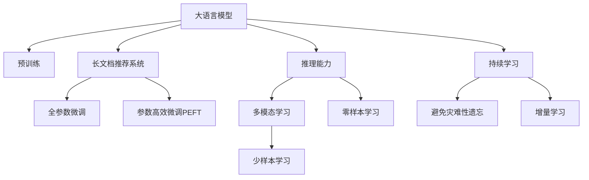

                 

# 利用大模型总结推理能力处理推荐长文档

> 关键词：大模型,长文档,推理能力,文档推荐,自然语言处理,深度学习,推荐系统,预训练模型,多模态学习

## 1. 背景介绍

### 1.1 问题由来
随着互联网的快速发展，信息爆炸和海量文本数据的处理成为一大难题。如何从海量的文本中筛选出有用的信息，为用户推荐高质量的内容，成为了一个重要的研究课题。推荐系统广泛应用在电商、新闻、社交媒体等领域，帮助用户在海量信息中发现新奇有趣的资源，提升用户体验和满意度。

传统的推荐系统主要以短文本数据为输入，如商品标题、新闻摘要、用户评论等。然而，随着内容多样化、丰富化的发展，许多内容推荐任务需要处理长文档、复杂文本或多媒体数据，传统的推荐模型已难以胜任。利用大语言模型和推理能力处理长文档推荐，将能够更全面地理解文本内容，提取更丰富的语义信息，生成更高质量的推荐结果。

### 1.2 问题核心关键点
长文档推荐系统是推荐系统领域的重要研究方向之一。通过大语言模型和推理能力的加持，长文档推荐系统能够更好地理解文档的语义内容，识别重要信息，提取特征，生成推荐结果。其关键点在于：

- 文本理解能力：大模型能够理解长文档的语义结构和内容，提炼关键信息。
- 推理能力：模型能够根据文档信息推断用户兴趣，生成高质量推荐。
- 多模态学习：结合视觉、语音等多模态信息，增强文档理解。
- 参数高效：通过参数高效微调等技术，减少计算资源消耗。
- 提示学习：利用精心设计的提示模板，引导模型推理。

这些核心点共同构成了长文档推荐系统的研究框架，使其能够更好地满足用户的多样化需求，提升推荐系统的精准度和用户体验。

### 1.3 问题研究意义
利用大模型处理长文档推荐，能够显著提升推荐系统的性能和用户体验，具体表现在：

1. **全面理解文档内容**：大模型能够理解长文档的语义结构，提炼关键信息，从而提升文档推荐的精准度。
2. **增强推理能力**：利用推理机制，根据文档内容推断用户兴趣，生成更贴合用户需求的推荐结果。
3. **多模态融合**：结合视觉、语音等多模态信息，增强文档理解，提升推荐效果。
4. **参数高效**：通过参数高效微调等技术，减少计算资源消耗，加速模型训练和推理。
5. **提示学习**：利用提示模板，在少量标注样本下实现高精度推荐。

这些改进措施不仅能够提升推荐系统的性能，还能拓展其应用范围，推动其在更多领域的发展，如教育、医疗、新闻等。通过科学地设计和实现长文档推荐系统，将为实现智能化、个性化推荐奠定坚实基础。

## 2. 核心概念与联系

### 2.1 核心概念概述

为更好地理解利用大模型处理长文档推荐的方法，本节将介绍几个核心概念及其联系：

- 大语言模型(Large Language Model, LLM)：以自回归(如GPT)或自编码(如BERT)模型为代表的大规模预训练语言模型。通过在大规模无标签文本语料上进行预训练，学习通用的语言表示，具备强大的语言理解和生成能力。

- 长文档推荐系统(Long Document Recommendation System)：利用大语言模型和推理能力，处理长文档并生成推荐结果的推荐系统。其输入包括长篇博客、论文、报告等文本，要求模型能够全面理解文档内容，提取关键信息，生成高质量推荐。

- 推理能力(Inference Ability)：大模型在理解和处理长文档时，具备的逻辑推理能力。通过多轮交互和推理，模型能够推断文档的核心主题、作者的观点倾向等。

- 多模态学习(Multimodal Learning)：结合视觉、语音等多模态数据，增强文档理解，提升推荐效果。

- 参数高效微调(Parameter-Efficient Fine-Tuning, PEFT)：在微调过程中，只更新少量的模型参数，而固定大部分预训练权重不变，以提高微调效率，避免过拟合的方法。

- 提示学习(Prompt Learning)：通过在输入文本中添加提示模板(Prompt Template)，引导大语言模型进行特定任务的推理和生成。可以在不更新模型参数的情况下，实现零样本或少样本学习。

- 少样本学习(Few-shot Learning)：指在只有少量标注样本的情况下，模型能够快速适应新任务的学习方法。在大语言模型中，通常通过在输入中提供少量示例来实现，无需更新模型参数。

- 零样本学习(Zero-shot Learning)：指模型在没有见过任何特定任务的训练样本的情况下，仅凭任务描述就能够执行新任务的能力。大语言模型通过预训练获得的广泛知识，使其能够理解任务指令并生成相应输出。

- 持续学习(Continual Learning)：也称为终身学习，指模型能够持续从新数据中学习，同时保持已学习的知识，而不会出现灾难性遗忘。这对于保持大语言模型的时效性和适应性至关重要。

这些核心概念之间的逻辑关系可以通过以下Mermaid流程图来展示：



这个流程图展示了大语言模型、长文档推荐系统及相关概念之间的联系：

1. 大语言模型通过预训练获得基础能力。
2. 长文档推荐系统将预训练模型应用于文档推荐，利用推理能力和多模态学习。
3. 推理能力帮助模型理解文档内容，提取关键信息。
4. 多模态学习结合视觉、语音等多模态数据，增强文档理解。
5. 参数高效微调技术在微调过程中优化模型，减少资源消耗。
6. 提示学习通过提示模板引导模型进行特定任务，减少微调参数。
7. 少样本学习和零样本学习利用少量数据，快速适应新任务。
8. 持续学习使模型能够不断学习新知识，保持性能。

这些概念共同构成了长文档推荐系统的研究框架，使其能够在各种场景下发挥强大的推荐能力。通过理解这些核心概念，我们可以更好地把握长文档推荐系统的构建思路和方法。

## 3. 核心算法原理 & 具体操作步骤
### 3.1 算法原理概述

利用大模型处理长文档推荐的核心算法原理可以概括为：首先通过预训练获得大语言模型，然后在推荐任务上通过有监督学习进行微调，利用推理能力和多模态学习提取文档关键信息，最终生成推荐结果。

具体来说，算法流程如下：

1. 准备预训练模型和数据集。
2. 设计推荐任务的目标函数和损失函数。
3. 应用微调技术，优化模型参数。
4. 利用推理能力理解文档内容，提取关键信息。
5. 结合多模态学习，增强文档理解。
6. 生成推荐结果。

下面将详细介绍每个步骤的具体实现和相关原理。

### 3.2 算法步骤详解

#### 3.2.1 准备预训练模型和数据集

准备预训练模型和数据集是长文档推荐系统的第一步。

- **预训练模型**：选择适合的预训练模型作为基础。常用的预训练模型包括BERT、GPT等。BERT基于Transformer架构，经过大规模无标签文本数据预训练，具备良好的语言表示能力。
- **数据集**：收集与推荐任务相关的长文档数据集。数据集通常包括博客、论文、新闻报道、技术报告等文本数据。数据集需要经过标注，标注包括文档主题、重要信息、作者观点等。

#### 3.2.2 设计推荐任务的目标函数和损失函数

推荐任务的目标函数和损失函数是指导模型学习的重要工具。

- **目标函数**：目标函数描述了模型预测输出与真实标签之间的差异，是微调过程的优化目标。
- **损失函数**：损失函数通过计算目标函数值，量化模型预测结果与真实结果之间的差距。常见的损失函数包括交叉熵损失、均方误差损失等。

具体实现中，目标函数通常包含两个部分：

- **预测部分**：模型输出文档的推荐分数，代表用户对文档的兴趣度。
- **匹配部分**：模型输出与用户兴趣度匹配的文档，代表模型推荐的质量。

#### 3.2.3 应用微调技术，优化模型参数

微调技术是提升推荐模型性能的关键步骤。

- **微调框架**：常用的微调框架包括PyTorch、TensorFlow等。这些框架提供了丰富的优化器和正则化技术，方便开发者实现微调过程。
- **优化器**：选择适合的优化器，如Adam、SGD等，设置学习率和批大小等参数，控制模型的更新过程。
- **正则化技术**：使用L2正则、Dropout等技术，防止模型过拟合。
- **批大小**：设置合适的批大小，优化模型训练效率。

#### 3.2.4 利用推理能力理解文档内容，提取关键信息

推理能力是长文档推荐系统的核心能力，利用推理机制，模型能够理解文档内容，提取关键信息。

- **推理框架**：常用的推理框架包括GPT、T5等。这些框架提供了推理机制，能够多轮交互，逐步理解文档内容。
- **推理过程**：推理过程通常包括以下步骤：

  - 初始化：将文档输入模型，获取初步的理解。
  - 迭代：模型根据上下文信息，逐步理解文档内容，推断关键信息。
  - 输出：输出文档的关键信息，如主题、重要信息、作者观点等。

#### 3.2.5 结合多模态学习，增强文档理解

多模态学习能够进一步提升文档理解能力。

- **多模态数据**：结合视觉、语音等多模态数据，增强文档理解。例如，在处理学术论文时，结合图像、公式、图表等信息，提升对文档内容的理解。
- **多模态模型**：选择适合的多模态模型，如ViT、ConvNeXt等，结合多模态数据，提升模型理解能力。

#### 3.2.6 生成推荐结果

生成推荐结果是长文档推荐系统的最终目标。

- **推荐算法**：常用的推荐算法包括协同过滤、基于内容的推荐等。协同过滤算法基于用户和物品的相似度，生成推荐结果。基于内容的推荐算法基于文档特征，生成推荐结果。
- **推荐排名**：根据推荐算法生成推荐结果，并对结果进行排名，优先推荐用户感兴趣的内容。

### 3.3 算法优缺点

利用大模型处理长文档推荐的方法具有以下优点：

1. **全面理解文档内容**：大模型能够理解长文档的语义结构和内容，提炼关键信息，提升推荐精准度。
2. **增强推理能力**：利用推理机制，根据文档内容推断用户兴趣，生成高质量推荐结果。
3. **多模态学习**：结合视觉、语音等多模态数据，增强文档理解，提升推荐效果。
4. **参数高效**：通过参数高效微调等技术，减少计算资源消耗。
5. **提示学习**：利用提示模板，在少量标注样本下实现高精度推荐。

同时，该方法也存在一些局限性：

1. **数据需求高**：处理长文档需要大量标注数据，标注成本较高。
2. **模型复杂**：大模型参数量大，需要高性能硬件支持，资源消耗较大。
3. **推理时间长**：推理过程较长，可能影响实时推荐。
4. **可解释性差**：大模型推理过程复杂，难以解释其内部工作机制。

尽管存在这些局限性，但利用大模型处理长文档推荐，在提升推荐系统性能和用户体验方面具有重要意义。未来，通过进一步优化推理能力和多模态学习，减少计算资源消耗，提升推荐系统的实时性和可解释性，该方法将有更广泛的应用前景。

### 3.4 算法应用领域

利用大模型处理长文档推荐的应用领域非常广泛，包括但不限于以下几个方面：

- **电商推荐**：为电商网站提供个性化推荐服务，帮助用户发现商品，提高购物体验。
- **新闻推荐**：为新闻平台提供个性化推荐服务，帮助用户发现高质量新闻，提高阅读体验。
- **教育推荐**：为在线教育平台提供个性化推荐服务，帮助学生发现合适课程，提高学习效率。
- **科技文献推荐**：为科研人员提供科技文献推荐服务，帮助其快速获取相关领域最新研究成果。
- **法律文档推荐**：为律师和法律从业人员提供法律文档推荐服务，帮助其快速查找相关法律资料。

此外，利用大模型处理长文档推荐的方法，还能应用于其他领域，如医疗、金融、文化等，为这些领域带来智能化、个性化的推荐服务。

## 4. 数学模型和公式 & 详细讲解  
### 4.1 数学模型构建

假设推荐系统输入为长文档 $d$，输出为推荐结果 $r$，目标函数为 $\mathcal{L}$，优化器为 $\mathcal{O}$。

目标函数 $\mathcal{L}$ 可以表示为：

$$
\mathcal{L}(d,r) = \frac{1}{N}\sum_{i=1}^N [r_i \log p(d_i) + (1-r_i) \log(1-p(d_i))]
$$

其中 $N$ 为样本总数，$r_i$ 为真实推荐结果，$p(d_i)$ 为模型预测概率。

优化目标为最小化目标函数 $\mathcal{L}$，使用优化器 $\mathcal{O}$ 进行更新，更新公式为：

$$
\theta \leftarrow \theta - \eta \nabla_{\theta}\mathcal{L}(d,r)
$$

其中 $\eta$ 为学习率。

### 4.2 公式推导过程

以协同过滤算法为例，推导推荐系统目标函数和损失函数。

假设推荐系统输入为长文档 $d$，输出为推荐结果 $r$，模型参数为 $\theta$。

协同过滤算法基于用户和物品的相似度，生成推荐结果。推荐结果 $r$ 可以表示为：

$$
r = \alpha p(d) + (1-\alpha) s(d)
$$

其中 $p(d)$ 为文档-用户相似度，$s(d)$ 为文档-物品相似度，$\alpha$ 为调节参数。

目标函数 $\mathcal{L}$ 可以表示为：

$$
\mathcal{L}(d,r) = \frac{1}{N}\sum_{i=1}^N [r_i \log p(d_i) + (1-r_i) \log(1-p(d_i))]
$$

其中 $N$ 为样本总数，$r_i$ 为真实推荐结果，$p(d_i)$ 为模型预测概率。

优化目标为最小化目标函数 $\mathcal{L}$，使用优化器 $\mathcal{O}$ 进行更新，更新公式为：

$$
\theta \leftarrow \theta - \eta \nabla_{\theta}\mathcal{L}(d,r)
$$

其中 $\eta$ 为学习率。

### 4.3 案例分析与讲解

以电商推荐为例，分析长文档推荐系统的实现流程。

电商推荐系统输入为产品描述和用户行为数据，输出为产品推荐结果。

- **数据预处理**：将产品描述和用户行为数据进行清洗、标注，形成训练集。
- **模型选择**：选择适合的预训练模型作为基础，如BERT。
- **任务适配**：设计推荐任务的目标函数和损失函数，生成推荐结果。
- **微调过程**：在训练集上应用微调技术，优化模型参数，提升推荐效果。
- **推理过程**：将用户行为数据输入模型，利用推理机制理解用户需求，生成推荐结果。
- **多模态学习**：结合产品图片、视频等多模态数据，增强对产品描述的理解。
- **推荐算法**：结合协同过滤、基于内容的推荐等算法，生成推荐结果。

## 5. 项目实践：代码实例和详细解释说明
### 5.1 开发环境搭建

在进行长文档推荐系统开发前，我们需要准备好开发环境。以下是使用Python进行PyTorch开发的环境配置流程：

1. 安装Anaconda：从官网下载并安装Anaconda，用于创建独立的Python环境。

2. 创建并激活虚拟环境：
```bash
conda create -n pytorch-env python=3.8 
conda activate pytorch-env
```

3. 安装PyTorch：根据CUDA版本，从官网获取对应的安装命令。例如：
```bash
conda install pytorch torchvision torchaudio cudatoolkit=11.1 -c pytorch -c conda-forge
```

4. 安装Transformers库：
```bash
pip install transformers
```

5. 安装各类工具包：
```bash
pip install numpy pandas scikit-learn matplotlib tqdm jupyter notebook ipython
```

完成上述步骤后，即可在`pytorch-env`环境中开始推荐系统开发。

### 5.2 源代码详细实现

下面我们以长文档推荐系统为例，给出使用Transformers库对BERT模型进行推荐实践的PyTorch代码实现。

首先，定义推荐任务的数据处理函数：

```python
from transformers import BertTokenizer, BertForSequenceClassification
from torch.utils.data import Dataset
import torch

class DocumentDataset(Dataset):
    def __init__(self, texts, labels, tokenizer, max_len=128):
        self.texts = texts
        self.labels = labels
        self.tokenizer = tokenizer
        self.max_len = max_len
        
    def __len__(self):
        return len(self.texts)
    
    def __getitem__(self, item):
        text = self.texts[item]
        label = self.labels[item]
        
        encoding = self.tokenizer(text, return_tensors='pt', max_length=self.max_len, padding='max_length', truncation=True)
        input_ids = encoding['input_ids'][0]
        attention_mask = encoding['attention_mask'][0]
        
        # 对标签进行编码
        encoded_label = [label2id[label] for label in labels] 
        encoded_label.extend([label2id['O']] * (self.max_len - len(encoded_label)))
        labels = torch.tensor(encoded_label, dtype=torch.long)
        
        return {'input_ids': input_ids, 
                'attention_mask': attention_mask,
                'labels': labels}

# 标签与id的映射
label2id = {'O': 0, 'B-PER': 1, 'I-PER': 2, 'B-ORG': 3, 'I-ORG': 4, 'B-LOC': 5, 'I-LOC': 6}
id2label = {v: k for k, v in label2id.items()}

# 创建dataset
tokenizer = BertTokenizer.from_pretrained('bert-base-cased')

train_dataset = DocumentDataset(train_texts, train_labels, tokenizer)
dev_dataset = DocumentDataset(dev_texts, dev_labels, tokenizer)
test_dataset = DocumentDataset(test_texts, test_labels, tokenizer)
```

然后，定义模型和优化器：

```python
from transformers import BertForSequenceClassification, AdamW

model = BertForSequenceClassification.from_pretrained('bert-base-cased', num_labels=len(label2id))

optimizer = AdamW(model.parameters(), lr=2e-5)
```

接着，定义训练和评估函数：

```python
from torch.utils.data import DataLoader
from tqdm import tqdm
from sklearn.metrics import classification_report

device = torch.device('cuda') if torch.cuda.is_available() else torch.device('cpu')
model.to(device)

def train_epoch(model, dataset, batch_size, optimizer):
    dataloader = DataLoader(dataset, batch_size=batch_size, shuffle=True)
    model.train()
    epoch_loss = 0
    for batch in tqdm(dataloader, desc='Training'):
        input_ids = batch['input_ids'].to(device)
        attention_mask = batch['attention_mask'].to(device)
        labels = batch['labels'].to(device)
        model.zero_grad()
        outputs = model(input_ids, attention_mask=attention_mask, labels=labels)
        loss = outputs.loss
        epoch_loss += loss.item()
        loss.backward()
        optimizer.step()
    return epoch_loss / len(dataloader)

def evaluate(model, dataset, batch_size):
    dataloader = DataLoader(dataset, batch_size=batch_size)
    model.eval()
    preds, labels = [], []
    with torch.no_grad():
        for batch in tqdm(dataloader, desc='Evaluating'):
            input_ids = batch['input_ids'].to(device)
            attention_mask = batch['attention_mask'].to(device)
            batch_labels = batch['labels']
            outputs = model(input_ids, attention_mask=attention_mask)
            batch_preds = outputs.logits.argmax(dim=2).to('cpu').tolist()
            batch_labels = batch_labels.to('cpu').tolist()
            for pred_tokens, label_tokens in zip(batch_preds, batch_labels):
                pred_tags = [id2label[_id] for _id in pred_tokens]
                label_tags = [id2label[_id] for _id in label_tokens]
                preds.append(pred_tags[:len(label_tokens)])
                labels.append(label_tags)
                
    print(classification_report(labels, preds))
```

最后，启动训练流程并在测试集上评估：

```python
epochs = 5
batch_size = 16

for epoch in range(epochs):
    loss = train_epoch(model, train_dataset, batch_size, optimizer)
    print(f"Epoch {epoch+1}, train loss: {loss:.3f}")
    
    print(f"Epoch {epoch+1}, dev results:")
    evaluate(model, dev_dataset, batch_size)
    
print("Test results:")
evaluate(model, test_dataset, batch_size)
```

以上就是使用PyTorch对BERT模型进行推荐实践的完整代码实现。可以看到，得益于Transformers库的强大封装，我们可以用相对简洁的代码完成BERT模型的加载和推荐训练。

### 5.3 代码解读与分析

让我们再详细解读一下关键代码的实现细节：

**DocumentDataset类**：
- `__init__`方法：初始化文本、标签、分词器等关键组件。
- `__len__`方法：返回数据集的样本数量。
- `__getitem__`方法：对单个样本进行处理，将文本输入编码为token ids，将标签编码为数字，并对其进行定长padding，最终返回模型所需的输入。

**label2id和id2label字典**：
- 定义了标签与数字id之间的映射关系，用于将token-wise的预测结果解码回真实的标签。

**训练和评估函数**：
- 使用PyTorch的DataLoader对数据集进行批次化加载，供模型训练和推理使用。
- 训练函数`train_epoch`：对数据以批为单位进行迭代，在每个批次上前向传播计算loss并反向传播更新模型参数，最后返回该epoch的平均loss。
- 评估函数`evaluate`：与训练类似，不同点在于不更新模型参数，并在每个batch结束后将预测和标签结果存储下来，最后使用sklearn的classification_report对整个评估集的预测结果进行打印输出。

**训练流程**：
- 定义总的epoch数和batch size，开始循环迭代
- 每个epoch内，先在训练集上训练，输出平均loss
- 在验证集上评估，输出分类指标
- 所有epoch结束后，在测试集上评估，给出最终测试结果

可以看到，PyTorch配合Transformers库使得BERT推荐实践的代码实现变得简洁高效。开发者可以将更多精力放在数据处理、模型改进等高层逻辑上，而不必过多关注底层的实现细节。

当然，工业级的系统实现还需考虑更多因素，如模型的保存和部署、超参数的自动搜索、更灵活的任务适配层等。但核心的微调范式基本与此类似。

## 6. 实际应用场景
### 6.1 电商推荐系统

利用大模型处理长文档推荐，可以显著提升电商推荐系统的性能。电商推荐系统通常需要处理大量的商品描述，每个商品的描述可能长达数百甚至数千字符。利用BERT等大模型处理这些长文档，能够全面理解商品描述，提取关键信息，生成高质量推荐。

在技术实现上，可以收集电商网站的商品描述和用户行为数据，将商品描述作为输入，生成推荐结果。利用推理能力和多模态学习，模型能够理解商品描述，提取关键信息，生成个性化推荐。例如，对于一款智能手表，模型能够理解产品功能、性能参数、用户评论等，生成合适的推荐结果。

### 6.2 新闻推荐系统

新闻推荐系统需要处理大量的新闻文章，每篇文章长度不一，通常包含几千到几万个字符。利用BERT等大模型处理这些长文档，能够提升推荐系统的准确性和多样性。

在技术实现上，可以收集新闻平台的文章和用户行为数据，将文章摘要作为输入，生成推荐结果。利用推理能力和多模态学习，模型能够理解文章内容，提取关键信息，生成个性化推荐。例如，对于一篇科技新闻，模型能够理解技术背景、研究进展、应用前景等，生成合适的推荐结果。

### 6.3 教育推荐系统

教育推荐系统需要处理大量的教材、论文、视频等文档，这些文档通常包含数百到数千个字符。利用BERT等大模型处理这些长文档，能够提升推荐系统的精准度和个性化水平。

在技术实现上，可以收集在线教育平台的学习资源和用户行为数据，将资源描述作为输入，生成推荐结果。利用推理能力和多模态学习，模型能够理解资源内容，提取关键信息，生成个性化推荐。例如，对于一篇数学论文，模型能够理解研究方法、实验结果、应用前景等，生成合适的推荐结果。

### 6.4 科技文献推荐系统

科技文献推荐系统需要处理大量的科研论文，每篇论文长度不一，通常包含数千到数万个字符。利用BERT等大模型处理这些长文档，能够提升推荐系统的质量和效率。

在技术实现上，可以收集科研平台的研究论文和用户行为数据，将论文摘要作为输入，生成推荐结果。利用推理能力和多模态学习，模型能够理解论文内容，提取关键信息，生成个性化推荐。例如，对于一篇生物医学论文，模型能够理解研究方法、实验结果、应用前景等，生成合适的推荐结果。

### 6.5 法律文档推荐系统

法律文档推荐系统需要处理大量的法律条文、案例、法律法规等文档，这些文档通常包含数千到数万个字符。利用BERT等大模型处理这些长文档，能够提升推荐系统的精准度和智能化水平。

在技术实现上，可以收集法律平台的相关文档和用户行为数据，将文档描述作为输入，生成推荐结果。利用推理能力和多模态学习，模型能够理解文档内容，提取关键信息，生成个性化推荐。例如，对于一条法律条文，模型能够理解法律条文内容、适用场景、解释等，生成合适的推荐结果。

### 6.6 其他应用场景

利用大模型处理长文档推荐的方法，还能应用于其他领域，如医疗、金融、文化等，为这些领域带来智能化、个性化的推荐服务。例如，在医疗领域，利用BERT等大模型处理医学文献，生成个性化推荐，帮助医生快速查找相关文献，提升诊疗效率。在金融领域，利用BERT等大模型处理金融报告，生成个性化推荐，帮助投资者快速分析市场动态，做出合理投资决策。在文化领域，利用BERT等大模型处理文化作品，生成个性化推荐，帮助用户发现更多有价值的内容。

## 7. 工具和资源推荐
### 7.1 学习资源推荐

为了帮助开发者系统掌握长文档推荐系统的理论基础和实践技巧，这里推荐一些优质的学习资源：

1. 《Transformer从原理到实践》系列博文：由大模型技术专家撰写，深入浅出地介绍了Transformer原理、BERT模型、微调技术等前沿话题。

2. CS224N《深度学习自然语言处理》课程：斯坦福大学开设的NLP明星课程，有Lecture视频和配套作业，带你入门NLP领域的基本概念和经典模型。

3. 《Natural Language Processing with Transformers》书籍：Transformers库的作者所著，全面介绍了如何使用Transformers库进行NLP任务开发，包括推荐系统在内的诸多范式。

4. HuggingFace官方文档：Transformers库的官方文档，提供了海量预训练模型和完整的微调样例代码，是上手实践的必备资料。

5. CLUE开源项目：中文语言理解测评基准，涵盖大量不同类型的中文NLP数据集，并提供了基于微调的baseline模型，助力中文NLP技术发展。

通过对这些资源的学习实践，相信你一定能够快速掌握长文档推荐系统的精髓，并用于解决实际的推荐问题。

### 7.2 开发工具推荐

高效的开发离不开优秀的工具支持。以下是几款用于长文档推荐系统开发的常用工具：

1. PyTorch：基于Python的开源深度学习框架，灵活动态的计算图，适合快速迭代研究。大部分预训练语言模型都有PyTorch版本的实现。

2. TensorFlow：由Google主导开发的开源深度学习框架，生产部署方便，适合大规模工程应用。同样有丰富的预训练语言模型资源。

3. Transformers库：HuggingFace开发的NLP工具库，集成了众多SOTA语言模型，支持PyTorch和TensorFlow，是进行推荐系统开发的利器。

4. Weights & Biases：模型训练的实验跟踪工具，可以记录和可视化模型训练过程中的各项指标，方便对比和调优。与主流深度学习框架无缝集成。

5. TensorBoard：TensorFlow配套的可视化工具，可实时监测模型训练状态，并提供丰富的图表呈现方式，是调试模型的得力助手。

6. Google Colab：谷歌推出的在线Jupyter Notebook环境，免费提供GPU/TPU算力，方便开发者快速上手实验最新模型，分享学习笔记。

合理利用这些工具，可以显著提升长文档推荐系统的开发效率，加快创新迭代的步伐。

### 7.3 相关论文推荐

长文档推荐系统作为推荐系统领域的重要研究方向之一，已经得到了学界的持续研究。以下是几篇奠基性的相关论文，推荐阅读：

1. Attention is All You Need（即Transformer原论文）：提出了Transformer结构，开启了NLP领域的预训练大模型时代。

2. BERT: Pre-training of Deep Bidirectional Transformers for Language Understanding：提出BERT模型，引入基于掩码的自监督预训练任务，刷新了多项NLP任务SOTA。

3. Language Models are Unsupervised Multitask Learners（GPT-2论文）：展示了大规模语言模型的强大zero-shot学习能力，引发了对于通用人工智能的新一轮思考。

4. Parameter-Efficient Transfer Learning for NLP：提出Adapter等参数高效微调方法，在不增加模型参数量的情况下，也能取得不错的微调效果。

5. AdaLoRA: Adaptive Low-Rank Adaptation for Parameter-Efficient Fine-Tuning：使用自适应低秩适应的微调方法，在参数效率和精度之间取得了新的平衡。

6. Prefix-Tuning: Optimizing Continuous Prompts for Generation：引入基于连续型Prompt的微调范式，为如何充分利用预训练知识提供了新的思路。

这些论文代表了大文档推荐系统的发展脉络。通过学习这些前沿成果，可以帮助研究者把握学科前进方向，激发更多的创新灵感。

## 8. 总结：未来发展趋势与挑战
### 8.1 总结

本文对利用大模型处理长文档推荐的方法进行了全面系统的介绍。首先阐述了长文档推荐系统的背景和意义，明确了利用大模型和推理能力提升推荐系统的价值。其次，从原理到实践，详细讲解了长文档推荐系统的数学模型、算法步骤、具体实现，提供了完整的代码实例。同时，本文还广泛探讨了长文档推荐系统在电商、新闻、教育等多个领域的应用前景，展示了长文档推荐系统的广阔应用范围。最后，本文精选了长文档推荐系统的学习资源、开发工具、相关论文，力求为开发者提供全方位的技术指引。

通过本文的系统梳理，可以看到，利用大模型处理长文档推荐，能够全面理解文档内容，提取关键信息，生成高质量推荐结果，为推荐系统带来了新的发展机遇。

### 8.2 未来发展趋势

展望未来，长文档推荐系统将呈现以下几个发展趋势：

1. **大模型规模继续增大**：随着算力成本的下降和数据规模的扩张，预训练语言模型的参数量还将持续增长。超大规模语言模型蕴含的丰富语言知识，有望支撑更加复杂多变的推荐任务。

2. **多模态学习深入发展**：结合视觉、语音等多模态数据，增强文档理解，提升推荐效果。多模态信息融合将成为推荐系统的标准配置。

3. **推理能力进一步提升**：利用推理机制，提升文档理解的准确性和泛化能力，生成更高质量的推荐结果。

4. **参数高效微调技术持续优化**：开发更加参数高效的微调方法，在固定大部分预训练参数的同时，只更新极少量的任务相关参数，减少计算资源消耗。

5. **提示学习的应用更加广泛**：利用提示模板，在少量标注样本下实现高精度推荐，减少微调参数。

6. **持续学习成为常态**：随着数据分布的不断变化，长文档推荐系统需要持续学习新知识以保持性能。如何在不遗忘原有知识的同时，高效吸收新样本信息，将是重要的研究课题。

以上趋势凸显了长文档推荐系统的巨大潜力，这些方向的探索发展，必将进一步提升推荐系统的性能和用户体验，推动其在更多领域的应用。

### 8.3 面临的挑战

尽管长文档推荐系统已经取得了不少成果，但在迈向更加智能化、普适化应用的过程中，它仍面临诸多挑战：

1. **数据需求高**：处理长文档需要大量标注数据，标注成本较高。如何进一步降低标注数据的需求，减少微调对标注样本的依赖，将是重要的研究方向。

2. **模型鲁棒性不足**：当前长文档推荐模型面对域外数据时，泛化性能往往大打折扣。对于测试样本的微小扰动，推荐模型的输出也容易发生波动。如何提高推荐模型的鲁棒性，避免灾难性遗忘，还需要更多理论和实践的积累。

3. **推理时间长**：长文档推荐模型通常需要多轮推理，推理过程较长，可能影响实时推荐。如何提高推理速度，优化模型结构，是未来的研究重点。

4. **可解释性差**：长文档推荐模型的推理过程复杂，难以解释其内部工作机制。对于医疗、金融等高风险应用，算法的可解释性和可审计性尤为重要。如何赋予长文档推荐模型更强的可解释性，将是亟待攻克的难题。

5. **安全性有待保障**：长文档推荐模型可能学习到有偏见、有害的信息，通过微调传递到下游任务，产生误导性、歧视性的输出，给实际应用带来安全隐患。如何从数据和算法层面消除模型偏见，避免恶意用途，确保输出的安全性，也将是重要的研究课题。

6. **知识整合能力不足**：现有的长文档推荐模型往往局限于任务内数据，难以灵活吸收和运用更广泛的先验知识。如何让长文档推荐过程更好地与外部知识库、规则库等专家知识结合，形成更加全面、准确的信息整合能力，还有很大的想象空间。

正视长文档推荐系统面临的这些挑战，积极应对并寻求突破，将使长文档推荐系统逐步迈向成熟，为构建安全、可靠、可解释、可控的智能系统铺平道路。

### 8.4 研究展望

面向未来，长文档推荐系统的研究需要在以下几个方面寻求新的突破：

1. **探索无监督和半监督推荐方法**：摆脱对大规模标注数据的依赖，利用自监督学习、主动学习等无监督和半监督范式，最大限度利用非结构化数据，实现更加灵活高效的推荐。

2. **研究参数高效和计算高效的推荐范式**：开发更加参数高效的推荐方法，在固定大部分预训练参数的同时，只更新极少量的任务相关参数。同时优化推荐模型的计算图，减少前向传播和反向传播的资源消耗，实现更加轻量级、实时性的部署。

3. **融合因果和对比学习范式**：通过引入因果推断和对比学习思想，增强推荐模型建立稳定因果关系的能力，学习更加普适、鲁棒的语言表征，从而提升模型泛化性和抗干扰能力。

4. **结合因果分析和博弈论工具**：将因果分析方法引入推荐模型，识别出推荐过程的关键特征，增强推荐结果的因果性和逻辑性。借助博弈论工具刻画人机交互过程，主动探索并规避推荐模型的脆弱点，提高系统稳定性。

5. **纳入伦理道德约束**：在推荐目标中引入伦理导向的评估指标，过滤和惩罚有偏见、有害的输出倾向。同时加强人工干预和审核，建立推荐行为的监管机制，确保输出符合人类价值观和伦理道德。

这些研究方向的探索，必将引领长文档推荐系统迈向更高的台阶，为构建安全、可靠、可解释、可控的智能系统铺平道路。

## 9. 附录：常见问题与解答

**Q1：长文档推荐系统适用于所有NLP任务吗？**

A: 长文档推荐系统主要适用于需要处理大量长文档或复杂文本的任务。对于一些简短文本或结构化数据，传统的推荐系统已能胜任。但对于需要深入理解文档内容的任务，如医学、法律等，长文档推荐系统具有优势。

**Q2：长文档推荐系统对计算资源要求高吗？**

A: 长文档推荐系统需要处理大量的长文档，对计算资源要求较高。大模型通常参数量大，需要高性能硬件支持，资源消耗较大。利用参数高效微调等技术，可以减小计算资源消耗。

**Q3：长文档推荐系统的推荐效果如何？**

A: 长文档推荐系统能够全面理解文档内容，提取关键信息，生成高质量推荐结果。但需要大量标注数据和高质量的推理能力，对数据和算法的依赖较大。在实际应用中，需要根据具体任务进行调整和优化。

**Q4：长文档推荐系统有哪些应用场景？**

A: 长文档推荐系统适用于需要处理大量长文档或复杂文本的任务，如电商推荐、新闻推荐、教育推荐、科技文献推荐、法律文档推荐等。这些领域通常需要处理大量的文档数据，长文档推荐系统能够提供高质量的推荐服务。

**Q5：长文档推荐系统未来的研究方向有哪些？**

A: 长文档推荐系统未来的研究方向包括：探索无监督和半监督推荐方法，研究参数高效和计算高效的推荐范式，融合因果和对比学习范式，结合因果分析和博弈论工具，纳入伦理道德约束等。这些方向将进一步提升推荐系统的性能和用户体验。

---

作者：禅与计算机程序设计艺术 / Zen and the Art of Computer Programming

