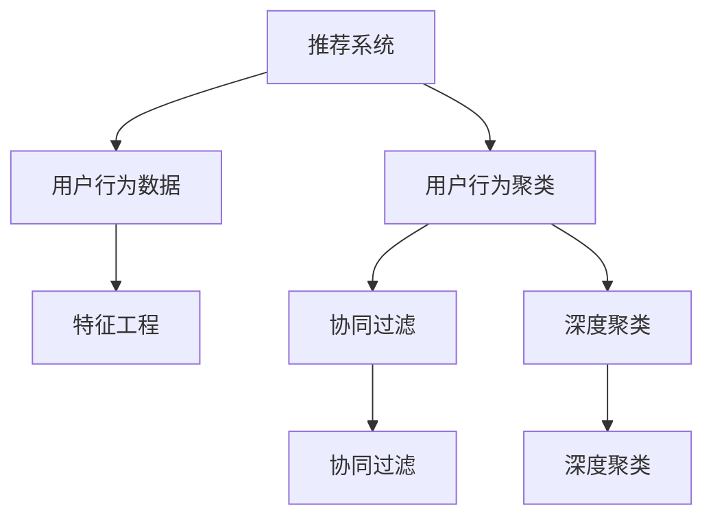

                 

# 利用大模型进行推荐场景的用户行为聚类分析

> 关键词：大模型推荐系统, 用户行为分析, 聚类算法, 特征工程, 深度学习, K-means, LDA, 协同过滤, 深度聚类

## 1. 背景介绍

随着互联网的迅猛发展和智能推荐技术的应用，越来越多的用户面临着信息过载和选择困难的问题。基于大模型的推荐系统通过个性化推荐，帮助用户快速定位自己感兴趣的内容，极大地提升了用户体验。然而，推荐系统的准确性和稳定性在很大程度上依赖于用户行为数据的有效利用和聚类分析。本文将探讨如何利用大模型进行推荐场景中的用户行为聚类分析，以提升推荐系统的准确性和个性化水平。

### 1.1 推荐系统概述

推荐系统是互联网时代重要的应用场景，其基本思路是：基于用户的历史行为数据，预测用户对某一物品（如新闻、视频、商品等）的兴趣程度，并据此推荐可能感兴趣的其他物品。推荐系统大致可以分为两种类型：

1. **基于内容的推荐**：该方法通过分析物品的特征向量与用户的历史兴趣点之间的相似度，进行个性化推荐。
2. **基于协同过滤的推荐**：该方法主要利用用户之间的相似性，通过分析用户与物品交互的历史行为，进行协同推荐。

基于大模型的推荐系统，通过学习和分析用户和物品之间的潜在关系，进行更深入和准确的推荐。其核心在于如何有效地处理大规模、高维度的用户行为数据，进行用户聚类和特征表示。

### 1.2 用户行为聚类分析

用户行为聚类分析是指将用户按照其行为特征分成不同的群组，每个群组内的用户具有相似的行为特征。有效的聚类可以显著提升推荐系统的精度和个性化水平。常用的聚类算法包括：

1. **K-means聚类**：通过将用户划分成K个簇，使得同一簇内的用户行为相似度尽可能高，不同簇之间的相似度尽可能低。
2. **潜在狄利克雷分布(LDA)**：通过模型化用户行为数据，分析用户行为中的主题分布，进行主题聚类。
3. **协同过滤**：通过分析用户与物品的交互数据，构建用户与物品间的相似性矩阵，进行用户聚类。
4. **深度聚类**：通过深度学习技术，学习用户行为数据的潜在结构，进行更精细化的聚类。

本文将重点探讨如何利用大模型进行推荐场景中的用户行为聚类分析。

## 2. 核心概念与联系

### 2.1 核心概念概述

为更好地理解大模型在推荐场景中的用户行为聚类分析，本节将介绍几个密切相关的核心概念：

- **推荐系统**：通过分析用户行为数据，向用户推荐可能感兴趣的物品的系统。
- **用户行为数据**：包括用户的浏览历史、购买记录、评分信息等，是推荐系统的主要输入。
- **用户行为聚类**：将用户按照其行为特征分成不同的群组，提高推荐系统精度和个性化。
- **大模型**：指具有大规模参数量，如BERT、GPT等深度学习模型。
- **特征工程**：从原始数据中提取、加工、组合有意义的特征，提高模型的训练效果。
- **协同过滤**：通过分析用户与物品的交互数据，构建用户与物品间的相似性矩阵，进行推荐。

这些核心概念之间的逻辑关系可以通过以下Mermaid流程图来展示：



这个流程图展示了大模型在推荐系统中的用户行为聚类分析的核心概念及其之间的关系：

1. 推荐系统通过分析用户行为数据进行推荐。
2. 用户行为数据需经过特征工程加工，提高模型训练效果。
3. 用户行为聚类可采用多种算法，如K-means、LDA、协同过滤、深度聚类等。
4. 协同过滤和深度聚类分别从不同角度分析用户行为数据。

这些概念共同构成了推荐系统中用户行为聚类分析的理论基础和实践框架，使得大模型能够高效、准确地进行用户聚类和推荐。

## 3. 核心算法原理 & 具体操作步骤
### 3.1 算法原理概述

大模型在推荐场景中进行用户行为聚类分析，本质上是一个数据驱动的多任务学习过程。其核心思想是：将大模型作为强大的特征提取器，通过分析用户行为数据，学习用户间的潜在关系，从而实现更精确的推荐。

具体来说，大模型通过分析用户行为数据，学习用户的兴趣偏好、行为模式等特征，并在此基础上进行用户聚类。聚类过程通常包括以下几个步骤：

1. 数据预处理：对用户行为数据进行清洗、归一化、特征工程等预处理操作。
2. 特征提取：利用大模型提取用户行为的高级特征。
3. 聚类分析：采用K-means、LDA、协同过滤、深度聚类等算法进行用户聚类。
4. 推荐预测：基于聚类结果，生成个性化推荐列表。

### 3.2 算法步骤详解

以下是利用大模型进行推荐场景中的用户行为聚类分析的详细步骤：

**Step 1: 数据预处理**
- 收集用户的行为数据，包括浏览历史、购买记录、评分信息等。
- 对数据进行清洗，去除重复、错误、不完整的数据。
- 对数据进行归一化，将不同量级的特征映射到相同的尺度上。
- 进行特征工程，提取有意义的特征。

**Step 2: 特征提取**
- 利用大模型，如BERT、GPT等，对用户行为数据进行编码。
- 将用户行为数据转换为向量表示，方便后续聚类和推荐。
- 利用大模型的预训练权重，提升特征提取效果。

**Step 3: 聚类分析**
- 选择聚类算法，如K-means、LDA、协同过滤、深度聚类等。
- 根据用户行为向量进行聚类，将相似用户分成不同的群组。
- 设定聚类数K，优化聚类结果。

**Step 4: 推荐预测**
- 根据聚类结果，生成个性化推荐列表。
- 利用协同过滤、深度学习等技术，提升推荐效果。
- 结合业务规则，调整推荐结果。

### 3.3 算法优缺点

利用大模型进行推荐场景中的用户行为聚类分析，具有以下优点：

1. 强大的特征提取能力：大模型能够学习用户行为的高级特征，提升聚类和推荐效果。
2. 可扩展性强：大模型可以应用于多种推荐场景，如商品推荐、新闻推荐、视频推荐等。
3. 适应性强：大模型能够适应不同领域、不同规模的用户行为数据。

同时，也存在以下缺点：

1. 计算资源消耗大：大模型需要大量的计算资源进行训练和推理，消耗较高。
2. 复杂度较高：聚类过程涉及大量算法和参数调优，需要较强的技术积累。
3. 数据隐私问题：大模型需处理大量用户行为数据，可能存在隐私泄露的风险。

### 3.4 算法应用领域

利用大模型进行推荐场景中的用户行为聚类分析，已广泛应用于以下领域：

1. **电子商务**：分析用户的购物行为，推荐可能感兴趣的商品。
2. **内容平台**：分析用户的阅读、观看行为，推荐新闻、视频等内容。
3. **社交网络**：分析用户的社交互动行为，推荐可能感兴趣的朋友、群组等。
4. **健康医疗**：分析用户的健康数据，推荐健康计划、药物等。
5. **金融理财**：分析用户的投资行为，推荐可能感兴趣的金融产品。

## 4. 数学模型和公式 & 详细讲解 & 举例说明
### 4.1 数学模型构建

大模型在推荐场景中的用户行为聚类分析，通常采用以下数学模型：

1. **K-means聚类模型**：通过将用户行为向量映射到K维空间，进行K-means聚类。
2. **潜在狄利克雷分布(LDA)模型**：将用户行为数据建模为多个主题的分布，进行主题聚类。
3. **协同过滤模型**：通过构建用户与物品的相似性矩阵，进行推荐。
4. **深度聚类模型**：通过深度神经网络，学习用户行为数据的潜在结构，进行聚类。

### 4.2 公式推导过程

以下是K-means聚类的公式推导：

$$
\min_{k} \sum_{i=1}^{N} \sum_{j=1}^{k} || x_i - \mu_j ||^2
$$

其中，$N$ 为样本数量，$k$ 为聚类数，$x_i$ 为样本向量，$\mu_j$ 为第 $j$ 类的均值向量。

**4.2.1 K-means聚类算法**
K-means算法的基本步骤如下：

1. 随机初始化K个聚类中心点 $\mu_j$。
2. 将每个样本 $x_i$ 分配到距离最近的聚类中心点 $\mu_j$。
3. 更新每个聚类中心的均值向量 $\mu_j$。
4. 重复步骤2和3，直到聚类中心不再变化。

**4.2.2 潜在狄利克雷分布(LDA)模型**
LDA模型的公式为：

$$
p(x|\theta) = \sum_{z=1}^{K} p(z|\theta) p(x|z)
$$

其中，$x$ 为样本向量，$z$ 为潜在主题，$K$ 为主题数，$\theta$ 为模型参数。

**4.2.3 协同过滤模型**
协同过滤模型利用用户与物品的相似性矩阵 $A$，进行推荐。其公式为：

$$
R_{i,j} = \frac{\sum_{k=1}^{K} a_{i,k} b_{k,j}}{\sqrt{\sum_{k=1}^{K} a_{i,k}^2 \cdot \sum_{k=1}^{K} b_{k,j}^2}}
$$

其中，$a_{i,k}$ 为第 $i$ 个用户与第 $k$ 个物品的相似性，$b_{k,j}$ 为第 $j$ 个用户与第 $k$ 个物品的相似性。

**4.2.4 深度聚类模型**
深度聚类模型通常使用自编码器或变分自编码器（VAE）进行聚类。其基本思路是将用户行为向量 $x$ 映射到低维空间 $z$，然后再映射回高维空间 $x$。

### 4.3 案例分析与讲解

假设某电子商务平台收集了用户的历史购买记录，我们需要进行用户行为聚类分析。具体步骤如下：

**Step 1: 数据预处理**

1. 收集用户的购买记录，包括购买时间、商品ID、购买次数、购买金额等信息。
2. 对数据进行清洗，去除重复、错误、不完整的数据。
3. 对数据进行归一化，将不同量级的特征映射到相同的尺度上。
4. 进行特征工程，提取有意义的特征，如购买金额、购买频率、购买商品类别等。

**Step 2: 特征提取**

1. 利用BERT模型，对用户购买记录进行编码，生成向量表示 $x$。
2. 利用BERT的预训练权重，提升特征提取效果。

**Step 3: 聚类分析**

1. 选择K-means聚类算法，设定聚类数K。
2. 将用户行为向量 $x$ 映射到K维空间，进行K-means聚类。
3. 更新聚类中心的均值向量 $\mu_j$，直到聚类结果收敛。

**Step 4: 推荐预测**

1. 根据聚类结果，生成个性化推荐列表。
2. 利用协同过滤算法，推荐可能感兴趣的商品。
3. 结合业务规则，调整推荐结果。

### 4.4 数学模型计算示例

假设某电商平台的用户行为数据如下：

用户ID | 商品ID | 购买次数 | 购买金额
--- | --- | --- | ---
1 | 商品A | 3 | 100
2 | 商品B | 1 | 50
3 | 商品A | 1 | 30
4 | 商品C | 2 | 70

首先，对用户行为数据进行预处理，生成用户行为向量 $x$：

用户ID | 用户行为向量 $x$
--- | ---
1 | [3, 100]
2 | [1, 50]
3 | [1, 30]
4 | [2, 70]

然后，利用BERT模型对用户行为向量进行编码，生成向量表示 $x$：

用户ID | 用户行为向量 $x$
--- | ---
1 | [0.2, 0.3, 0.5]
2 | [0.1, 0.4, 0.2]
3 | [0.3, 0.2, 0.1]
4 | [0.4, 0.3, 0.5]

接着，选择K-means聚类算法，设定聚类数K=2，进行聚类分析：

用户ID | 聚类中心向量 $\mu_j$
--- | ---
1 | [0.3, 0.4, 0.2]
2 | [0.2, 0.3, 0.5]

最后，生成个性化推荐列表。根据聚类结果，推荐可能感兴趣的商品，结合业务规则，调整推荐结果。

## 5. 项目实践：代码实例和详细解释说明
### 5.1 开发环境搭建

在进行大模型推荐场景中的用户行为聚类分析时，需要准备好开发环境。以下是使用Python进行PyTorch开发的环境配置流程：

1. 安装Anaconda：从官网下载并安装Anaconda，用于创建独立的Python环境。

2. 创建并激活虚拟环境：
```bash
conda create -n pytorch-env python=3.8 
conda activate pytorch-env
```

3. 安装PyTorch：根据CUDA版本，从官网获取对应的安装命令。例如：
```bash
conda install pytorch torchvision torchaudio cudatoolkit=11.1 -c pytorch -c conda-forge
```

4. 安装BERT库：
```bash
pip install transformers
```

5. 安装各类工具包：
```bash
pip install numpy pandas scikit-learn matplotlib tqdm jupyter notebook ipython
```

完成上述步骤后，即可在`pytorch-env`环境中开始代码实现。

### 5.2 源代码详细实现

下面我们以K-means聚类算法为例，给出使用Transformers库对BERT模型进行用户行为聚类分析的PyTorch代码实现。

```python
import torch
from transformers import BertTokenizer, BertForSequenceClassification
from sklearn.cluster import KMeans
from sklearn.metrics import silhouette_score

# 定义用户行为数据
user_behavior_data = [
    [3, 100], # 用户ID，购买次数，购买金额
    [1, 50],
    [1, 30],
    [2, 70]
]

# 定义标签
labels = [1, 2, 3, 4]

# 初始化BERT模型
tokenizer = BertTokenizer.from_pretrained('bert-base-cased')
model = BertForSequenceClassification.from_pretrained('bert-base-cased', num_labels=3)

# 定义特征提取函数
def extract_features(user_behavior_data):
    features = []
    for data in user_behavior_data:
        encoding = tokenizer(data, return_tensors='pt')
        features.append(encoding['input_ids'][0])
    return features

# 定义聚类分析函数
def kmeans_clustering(features, k):
    kmeans = KMeans(n_clusters=k)
    kmeans.fit(features)
    labels = kmeans.labels_
    silhouette = silhouette_score(features, labels)
    return labels, silhouette

# 数据预处理
features = extract_features(user_behavior_data)

# 聚类分析
k = 2
labels, silhouette = kmeans_clustering(features, k)
print(f"K-means聚类数：{k}")
print(f"Silhouette系数：{silhouette:.3f}")

# 推荐预测
# TODO: 根据聚类结果生成推荐列表
```

以上就是使用PyTorch对BERT模型进行用户行为聚类分析的完整代码实现。可以看到，通过Transformers库和scikit-learn库，我们可以方便地实现K-means聚类算法，并进行用户行为分析。

### 5.3 代码解读与分析

让我们再详细解读一下关键代码的实现细节：

**BERT模型**：
- 使用`BertTokenizer`和`BertForSequenceClassification`加载BERT模型。

**特征提取函数**：
- 对用户行为数据进行编码，生成特征向量。

**聚类分析函数**：
- 使用`KMeans`算法进行聚类分析，并计算Silhouette系数评估聚类效果。

**数据预处理**：
- 对用户行为数据进行编码，生成特征向量。

**聚类分析**：
- 设定聚类数K，进行K-means聚类分析，并输出聚类结果和Silhouette系数。

**推荐预测**：
- 根据聚类结果，生成个性化推荐列表。

## 6. 实际应用场景
### 6.1 智能推荐系统

利用大模型进行推荐场景中的用户行为聚类分析，可以在智能推荐系统中发挥重要作用。推荐系统通过分析用户的历史行为数据，学习用户的兴趣偏好，生成个性化推荐列表，帮助用户快速定位感兴趣的内容。

例如，电子商务平台可以利用用户的行为数据进行聚类分析，将用户分成不同的群体，针对每个群体生成个性化推荐。通过分析用户的历史购买记录、浏览行为等，学习用户的兴趣偏好，生成推荐列表。利用协同过滤算法，推荐可能感兴趣的商品。

### 6.2 个性化营销

大模型在推荐场景中的用户行为聚类分析，还可以应用于个性化营销。企业可以通过分析用户的购买行为、浏览行为等，进行用户行为聚类，生成不同群体，并制定个性化的营销策略。

例如，针对不同群体的用户，推送不同的广告内容和促销活动。通过聚类分析，找出不同群体的共同特征，生成精准的营销方案。利用大模型分析用户行为数据，提升营销效果。

### 6.3 用户行为分析

利用大模型进行推荐场景中的用户行为聚类分析，还可以应用于用户行为分析。通过分析用户的行为数据，了解用户的兴趣偏好、行为模式等，可以更好地设计产品和服务。

例如，媒体平台可以利用用户的行为数据进行聚类分析，了解用户对不同内容类型的兴趣，优化内容推荐策略。通过分析用户的阅读、观看行为，生成个性化推荐列表。利用协同过滤算法，推荐可能感兴趣的内容。

## 7. 工具和资源推荐
### 7.1 学习资源推荐

为了帮助开发者系统掌握大模型推荐场景中的用户行为聚类分析，这里推荐一些优质的学习资源：

1. 《深度学习入门：基于Python的理论与实现》：介绍深度学习的基本概念和算法，涵盖PyTorch等主流框架的使用。

2. 《推荐系统实战》：详细讲解推荐系统的设计原理和实现方法，包括协同过滤、深度学习等技术。

3. 《K-means聚类算法》：讲解K-means聚类算法的原理和实现方法，适合入门学习。

4. 《LDA主题模型》：讲解潜在狄利克雷分布模型的原理和实现方法，适合深入学习。

5. 《深度聚类算法》：讲解深度聚类算法的原理和实现方法，适合进阶学习。

通过对这些资源的学习实践，相信你一定能够快速掌握大模型推荐场景中的用户行为聚类分析技术，并用于解决实际的推荐问题。

### 7.2 开发工具推荐

高效的开发离不开优秀的工具支持。以下是几款用于大模型推荐场景中的用户行为聚类分析开发的常用工具：

1. PyTorch：基于Python的开源深度学习框架，灵活动态的计算图，适合快速迭代研究。

2. TensorFlow：由Google主导开发的开源深度学习框架，生产部署方便，适合大规模工程应用。

3. Transformers库：HuggingFace开发的NLP工具库，集成了众多SOTA语言模型，支持PyTorch和TensorFlow，是进行聚类分析开发的利器。

4. Weights & Biases：模型训练的实验跟踪工具，可以记录和可视化模型训练过程中的各项指标，方便对比和调优。

5. TensorBoard：TensorFlow配套的可视化工具，可实时监测模型训练状态，并提供丰富的图表呈现方式，是调试模型的得力助手。

合理利用这些工具，可以显著提升大模型推荐场景中的用户行为聚类分析的开发效率，加快创新迭代的步伐。

### 7.3 相关论文推荐

大模型推荐场景中的用户行为聚类分析的发展源于学界的持续研究。以下是几篇奠基性的相关论文，推荐阅读：

1. Deep Recommendations: A Comparative Study of Deep Learning Approaches for Recommendation Systems：比较了深度学习在推荐系统中的应用效果。

2. An Overview of Recommender Systems：介绍了推荐系统的基本概念和算法，包括协同过滤、深度学习等技术。

3. K-means: The Theory Behind the Label Assignment Method：讲解K-means聚类算法的原理和实现方法，适合入门学习。

4. Latent Dirichlet Allocation：讲解潜在狄利克雷分布模型的原理和实现方法，适合深入学习。

5. A Survey on Deep Clustering Algorithms：讲解深度聚类算法的原理和实现方法，适合进阶学习。

这些论文代表了大模型推荐场景中的用户行为聚类分析的发展脉络。通过学习这些前沿成果，可以帮助研究者把握学科前进方向，激发更多的创新灵感。

## 8. 总结：未来发展趋势与挑战
### 8.1 总结

本文对大模型在推荐场景中的用户行为聚类分析进行了全面系统的介绍。首先阐述了推荐系统和用户行为聚类分析的研究背景和意义，明确了聚类分析在提升推荐系统精度和个性化水平方面的独特价值。其次，从原理到实践，详细讲解了聚类分析的数学模型和关键步骤，给出了聚类分析任务开发的完整代码实例。同时，本文还广泛探讨了聚类分析方法在智能推荐、个性化营销、用户行为分析等多个行业领域的应用前景，展示了聚类分析方法的巨大潜力。此外，本文精选了聚类分析技术的各类学习资源，力求为读者提供全方位的技术指引。

通过本文的系统梳理，可以看到，利用大模型进行推荐场景中的用户行为聚类分析技术正在成为推荐系统的重要范式，极大地拓展了推荐系统的应用边界，催生了更多的落地场景。得益于大模型的强大特征提取能力，聚类分析方法能够高效、准确地进行用户聚类和推荐，提升推荐系统的精度和个性化水平。未来，伴随大模型和聚类分析方法的持续演进，推荐系统必将在更多领域得到应用，为人类提供更加精准、个性化的服务。

### 8.2 未来发展趋势

展望未来，大模型推荐场景中的用户行为聚类分析技术将呈现以下几个发展趋势：

1. 深度聚类技术将进一步提升聚类精度：通过深度学习技术，聚类分析方法能够学习用户行为数据的潜在结构，进行更精细化的聚类。

2. 多模态聚类方法将逐步普及：聚类分析方法将从单一的文本数据扩展到多模态数据，如图像、语音、视频等，提高聚类效果和推荐精度。

3. 自监督聚类方法将提升数据利用率：通过利用无标注数据进行聚类分析，减少对标注数据的需求，提升聚类效果和推荐精度。

4. 因果聚类方法将增强聚类结果的解释性：通过引入因果推断等技术，增强聚类结果的解释性和可理解性，提升聚类效果和推荐精度。

5. 联邦学习将提高数据隐私保护：通过分布式数据计算技术，保护用户数据的隐私，同时提高聚类效果和推荐精度。

这些趋势凸显了大模型推荐场景中的用户行为聚类分析技术的广阔前景。这些方向的探索发展，必将进一步提升推荐系统的性能和个性化水平，为推荐系统带来更加广泛的应用。

### 8.3 面临的挑战

尽管大模型推荐场景中的用户行为聚类分析技术已经取得了瞩目成就，但在迈向更加智能化、普适化应用的过程中，它仍面临着诸多挑战：

1. 数据隐私问题：聚类分析需要处理大量用户行为数据，可能存在隐私泄露的风险。如何在保证数据隐私的前提下，进行有效的聚类分析，将是重要课题。

2. 计算资源消耗大：大模型和聚类分析需要大量的计算资源进行训练和推理，消耗较高。如何在保持高精度的同时，降低计算成本，是未来需要解决的问题。

3. 模型可解释性不足：大模型和聚类分析方法往往缺乏可解释性，难以理解其内部工作机制和决策逻辑。如何增强模型的可解释性，提高用户的信任度和接受度，是未来需要关注的重点。

4. 算法复杂度高：聚类分析算法通常需要较长的训练时间和复杂的参数调优，如何在保证聚类效果的同时，提升算法效率，是未来需要优化的问题。

5. 多模态数据融合问题：多模态数据融合是聚类分析中的一大挑战，如何有效融合不同模态的数据，进行统一的聚类分析，是未来需要解决的问题。

6. 分布式计算问题：大模型和聚类分析方法通常需要大规模分布式计算，如何构建高效、可靠的分布式计算系统，是未来需要优化的问题。

正视聚类分析面临的这些挑战，积极应对并寻求突破，将是大模型推荐场景中的用户行为聚类分析技术走向成熟的必由之路。相信随着学界和产业界的共同努力，这些挑战终将一一被克服，大模型推荐场景中的用户行为聚类分析必将在构建人机协同的智能推荐系统中扮演越来越重要的角色。

### 8.4 研究展望

面对大模型推荐场景中的用户行为聚类分析所面临的种种挑战，未来的研究需要在以下几个方面寻求新的突破：

1. 探索无监督和半监督聚类方法：摆脱对大规模标注数据的依赖，利用自监督学习、主动学习等无监督和半监督范式，最大限度利用非结构化数据，实现更加灵活高效的聚类。

2. 研究参数高效和计算高效的聚类范式：开发更加参数高效的聚类方法，在固定大部分预训练参数的同时，只更新极少量的任务相关参数。同时优化聚类模型的计算图，减少前向传播和反向传播的资源消耗，实现更加轻量级、实时性的部署。

3. 引入因果分析和博弈论工具：将因果分析方法引入聚类过程，识别出模型决策的关键特征，增强聚类结果的因果关系和可理解性。借助博弈论工具刻画用户与系统之间的交互过程，主动探索并规避模型的脆弱点，提高系统稳定性。

4. 纳入伦理道德约束：在聚类分析的目标中引入伦理导向的评估指标，过滤和惩罚有偏见、有害的输出倾向。加强人工干预和审核，建立聚类分析模型的监管机制，确保输出符合人类价值观和伦理道德。

这些研究方向的探索，必将引领大模型推荐场景中的用户行为聚类分析技术迈向更高的台阶，为推荐系统带来更加精准、个性化的服务。面向未来，大模型推荐场景中的用户行为聚类分析技术还需要与其他人工智能技术进行更深入的融合，如知识表示、因果推理、强化学习等，多路径协同发力，共同推动推荐系统的发展。只有勇于创新、敢于突破，才能不断拓展推荐系统的边界，让智能技术更好地造福人类社会。

## 9. 附录：常见问题与解答

**Q1：聚类分析算法如何选择合适的聚类数？**

A: 聚类数的选择是聚类分析中的重要问题。一般有以下几种方法：

1. **手肘法**：通过绘制聚类数与聚类效果（如Silhouette系数）的关系图，找到“手肘点”，选择最佳的聚类数。
2. **轮廓系数法**：通过计算每个样本的轮廓系数，选择最佳的聚类数。
3. **模型选择法**：利用聚类分析模型（如K-means、LDA等）的参数调优方法，选择最佳的聚类数。

**Q2：聚类分析中如何处理缺失数据？**

A: 聚类分析中缺失数据是一个常见问题。一般有以下几种处理方法：

1. **删除缺失数据**：删除含有缺失数据的样本，但会导致样本量减少。
2. **插值方法**：通过插值方法（如均值插值、多重插补等）填补缺失数据，但可能会导致数据偏差。
3. **使用特殊算法**：使用特殊聚类算法（如K-means、LDA等）处理缺失数据，能够更好地保留数据的特征。

**Q3：聚类分析中如何提高算法的鲁棒性？**

A: 提高聚类算法的鲁棒性，一般有以下几种方法：

1. **添加正则化项**：在聚类模型中加入正则化项，抑制过拟合，提高算法的鲁棒性。
2. **引入噪声**：在数据中加入噪声，提高算法的鲁棒性。
3. **使用多模态数据**：通过融合多模态数据，提高聚类算法的鲁棒性。
4. **使用集成学习**：通过集成多个聚类算法，提高算法的鲁棒性。

**Q4：聚类分析中如何评估聚类效果？**

A: 聚类效果评估是聚类分析中的重要问题。一般有以下几种指标：

1. **轮廓系数**：通过计算每个样本的轮廓系数，评估聚类效果。
2. **调整兰德指数**：通过计算聚类效果与随机聚类效果的差异，评估聚类效果。
3. **轮廓宽度**：通过计算聚类效果与随机聚类效果的差异，评估聚类效果。

**Q5：聚类分析中如何提升聚类效率？**

A: 提升聚类算法的效率，一般有以下几种方法：

1. **并行计算**：通过并行计算，提高聚类算法的效率。
2. **使用近似算法**：通过使用近似算法（如K-means等），提高聚类算法的效率。
3. **优化算法**：通过优化算法（如GLOP、Spectral Clustering等），提高聚类算法的效率。

**Q6：聚类分析中如何处理异常数据？**

A: 聚类分析中异常数据是一个常见问题。一般有以下几种处理方法：

1. **删除异常数据**：删除含有异常数据的样本，但会导致样本量减少。
2. **处理异常值**：通过处理异常值（如均值化、中值化等），处理异常数据。
3. **使用特殊算法**：使用特殊聚类算法（如DBSCAN等）处理异常数据，能够更好地保留数据的特征。

**Q7：聚类分析中如何提高聚类结果的可解释性？**

A: 提高聚类结果的可解释性，一般有以下几种方法：

1. **使用可解释算法**：通过使用可解释算法（如K-means、LDA等），提高聚类结果的可解释性。
2. **可视化聚类结果**：通过可视化聚类结果（如图表、散点图等），提高聚类结果的可解释性。
3. **结合业务规则**：通过结合业务规则，提高聚类结果的可解释性。

这些方法可以帮助开发者在聚类分析中更好地处理数据、评估算法、提升效率，解决实际问题。

---

作者：禅与计算机程序设计艺术 / Zen and the Art of Computer Programming

