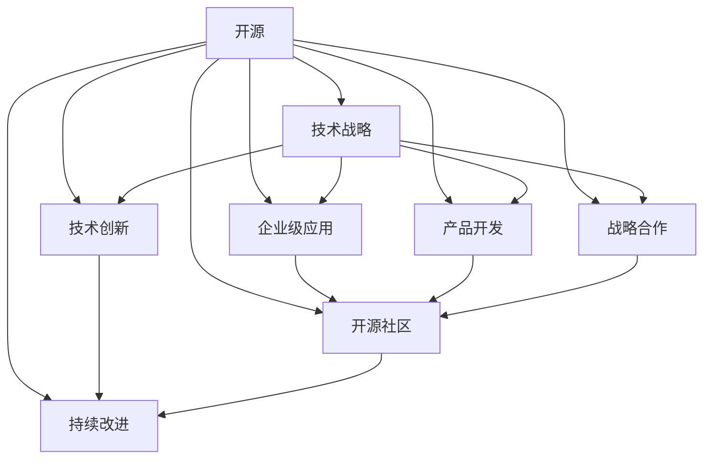

                 

# 利用开源经验提供技术战略咨询

> 关键词：开源,技术战略,企业级应用,技术创新,产品开发,战略合作,开源社区,持续改进

## 1. 背景介绍

在科技日新月异的今天，开源技术已成为企业快速迭代、应对市场变化的重要武器。开源社区汇聚了全球顶级的技术人才，其提供的软件和工具不仅解决了具体问题，更是推动了整个产业的发展。如何更好地利用开源经验，提升自身技术实力，制定符合企业发展战略的技术战略，是每一个科技管理者都需要思考的问题。本文将探讨企业如何通过借鉴开源经验，制定并执行高效的技术战略，从而在竞争激烈的市场中获得优势。

## 2. 核心概念与联系

### 2.1 核心概念概述

- **开源**：开源软件是指源代码对公众开放的计算机软件，用户可以自由地修改、使用和分发。常见的开源软件包括Linux、Apache Hadoop、MySQL等。
- **技术战略**：技术战略指的是企业为实现其整体战略目标，在技术领域所采取的决策和行动方案。包括技术选择、资源配置、人才培养、合作伙伴选择等。
- **企业级应用**：企业级应用指的是专门为满足大型企业需求而开发的软件系统，如ERP、CRM、HRM等。这些应用系统通常功能丰富、性能稳定，具有高可扩展性和易用性。
- **技术创新**：技术创新指的是在现有技术基础上，通过研究、开发和应用新技术，提升企业的产品或服务质量。
- **产品开发**：产品开发是指从产品规划、设计、实现到测试、发布的全过程，旨在开发符合市场需求的新产品或服务。
- **战略合作**：战略合作指的是企业与其他企业或组织，通过签订协议或达成共识，共同开发新技术、解决共同面临的问题。
- **开源社区**：开源社区是一个由开发者、用户和贡献者组成的社群，围绕某个开源项目进行交流、协作和贡献。
- **持续改进**：持续改进是指在已有产品或服务基础上，不断通过迭代优化，提升其性能和用户体验。

这些概念之间的关系可以通过以下Mermaid流程图来展示：



这个流程图展示开源经验在不同概念中的作用和相互关系：

1. 开源提供了丰富的技术资源和工具。
2. 技术战略的制定需借鉴开源经验，如开源项目的最佳实践、技术演进路径等。
3. 企业级应用常常基于开源软件开发，并在此基础上进行定制化。
4. 技术创新通过吸收开源社区的新技术和新思想，不断推进产品或服务升级。
5. 产品开发利用开源工具和框架，提升开发效率和产品质量。
6. 战略合作往往依托开源项目，实现资源共享和技术互惠。
7. 持续改进是开源社区和开源文化的核心精神，推动企业不断优化产品。

## 3. 核心算法原理 & 具体操作步骤
### 3.1 算法原理概述

基于开源经验的技术战略咨询，其核心算法原理是通过系统性分析开源社区的发展趋势、技术演进路径和最佳实践，结合企业自身需求和资源，制定出适应当前市场和未来发展方向的技术战略。具体操作流程如下：

1. **开源技术评估**：评估开源社区提供的软件和工具，识别其核心技术、优势和局限性。
2. **市场与需求分析**：结合市场趋势和用户需求，确定企业所需的技术能力和未来发展方向。
3. **技术战略制定**：根据开源技术和市场分析结果，制定技术战略，包括技术选型、资源分配、合作伙伴选择等。
4. **实施与监控**：将技术战略转化为具体行动计划，并持续监控其执行效果，进行必要的调整。

### 3.2 算法步骤详解

**Step 1: 开源技术评估**

评估开源社区提供的软件和工具，需从以下几个方面进行：

1. **技术成熟度**：评估开源项目的版本历史、稳定性、性能等指标。
2. **社区活跃度**：评估开源项目的活跃度，包括贡献者数量、问题反馈、社区讨论等。
3. **功能完备性**：评估开源项目的功能完备性，是否能满足企业需求。
4. **生态支持**：评估开源项目的生态支持，包括第三方插件、集成工具、文档等。
5. **可扩展性**：评估开源项目的可扩展性，是否能轻松集成到现有系统中。

以下是评估开源技术的基本框架：

| 评估维度       | 评估标准                                                                 | 评估指标                                                                                  |
|--------------|----------------------------------------------------------------------------|------------------------------------------------------------------------------------------|
| 技术成熟度   | 版本历史、稳定性、性能                                                     | 项目发布版本数量、Bugs数量、系统性能测试结果                                                      |
| 社区活跃度   | 贡献者数量、问题反馈、社区讨论                                               | GitHub star数、 issue数量、社区活跃度                                                      |
| 功能完备性   | 功能模块、API文档、用户手册                                                   | 功能清单、文档质量、社区功能讨论                                                      |
| 生态支持     | 第三方插件、集成工具、文档                                                      | 生态项目数量、社区工具使用情况、文档质量                                                      |
| 可扩展性     | 扩展接口、插件架构、模块化设计                                                 | 接口规范、扩展示例、社区设计讨论                                                      |

**Step 2: 市场与需求分析**

市场与需求分析需要结合企业战略目标，综合考虑以下因素：

1. **行业趋势**：分析当前行业内的技术趋势，如云计算、大数据、AI等。
2. **竞争态势**：分析竞争对手的技术布局和创新点。
3. **用户需求**：调研目标用户群体的具体需求，如业务流程、痛点、期望功能等。
4. **法律法规**：考虑法律法规对技术使用的限制，如数据隐私、合规性等。

通过SWOT分析法，可以系统地识别出企业所处环境中的优势、劣势、机会和威胁，从而制定合理的技术战略。

**Step 3: 技术战略制定**

技术战略制定需考虑企业整体战略目标和资源限制，具体包括以下步骤：

1. **技术选型**：基于开源评估结果和市场分析，选择合适的开源技术和工具。
2. **资源分配**：根据技术选型结果，合理分配资源，如人力、预算、设备等。
3. **合作伙伴选择**：选择技术合作或战略合作的合作伙伴，共同开发和应用开源技术。
4. **项目规划**：制定详细的项目计划，包括时间表、里程碑、质量标准等。

**Step 4: 实施与监控**

技术战略实施需要持续监控和评估，以确保其有效性。具体实施步骤如下：

1. **项目启动**：启动项目，组建项目团队，分配任务和资源。
2. **项目执行**：按照项目计划执行，定期汇报进展，解决遇到的问题。
3. **质量控制**：确保项目的质量标准和用户需求满足，进行必要的测试和验证。
4. **持续改进**：根据监控结果和反馈，进行持续改进，调整策略和方案。

### 3.3 算法优缺点

基于开源经验的技术战略咨询具有以下优点：

1. **成本效益**：利用开源资源，可大幅降低技术开发和实施成本。
2. **技术领先**：借鉴开源社区的最佳实践和最新技术，保持技术领先地位。
3. **灵活性**：开源社区提供了多种技术选择，可根据需求灵活调整。
4. **社区支持**：开源社区提供了强大的支持和资源，有助于问题解决和持续改进。

同时，这种技术战略咨询方法也存在一些局限性：

1. **复杂度高**：需要全面评估开源项目，制定合理技术战略，复杂度较高。
2. **依赖开源**：完全依赖开源技术，可能无法满足特定需求。
3. **学习成本**：需要深入学习和理解开源技术，学习成本较高。
4. **生态依赖**：开源项目生态和社区支持不足时，可能影响实施效果。

### 3.4 算法应用领域

基于开源经验的技术战略咨询方法，在多个领域都有广泛应用，包括但不限于以下方面：

- **金融科技**：利用开源技术进行金融风控、区块链、支付系统开发。
- **智能制造**：利用开源技术进行工业互联网、物联网、自动化系统开发。
- **医疗健康**：利用开源技术进行电子病历、医疗影像、医疗数据管理。
- **电子商务**：利用开源技术进行电商平台、供应链管理、客户服务系统开发。
- **能源环保**：利用开源技术进行能源管理系统、环境监测、智能电网开发。

## 4. 数学模型和公式 & 详细讲解 & 举例说明

### 4.1 数学模型构建

基于开源经验的技术战略咨询，其数学模型构建主要围绕以下几个关键因素：

1. **技术成熟度**：用版本数量、Bugs数量、性能测试结果等指标来评估。
2. **社区活跃度**：用GitHub star数、 issue数量、社区讨论数等指标来评估。
3. **功能完备性**：用功能清单、文档质量、社区讨论数等指标来评估。
4. **生态支持**：用生态项目数量、社区工具使用情况、文档质量等指标来评估。
5. **可扩展性**：用接口规范、扩展示例、社区设计讨论等指标来评估。

假设开源项目A的技术成熟度为X，社区活跃度为Y，功能完备性为Z，生态支持为W，可扩展性为V。则综合评估模型为：

$$
S = aX + bY + cZ + dW + eV
$$

其中，a, b, c, d, e为不同因素的权重，需根据实际情况进行调整。

### 4.2 公式推导过程

公式推导过程如下：

1. 对各评估指标进行标准化处理，使得各指标均在0到1之间。
2. 根据各指标的重要性，设定权重系数a, b, c, d, e。
3. 将各指标与权重系数相乘，并进行加和，得到综合评估值S。

### 4.3 案例分析与讲解

以Apache Hadoop为例，分析其技术成熟度、社区活跃度、功能完备性、生态支持和可扩展性。

- **技术成熟度**：Hadoop已有多年历史，版本稳定，性能优越。
- **社区活跃度**：Hadoop社区活跃，贡献者众多，问题反馈及时。
- **功能完备性**：Hadoop功能全面，覆盖大数据处理、存储、分析等各个方面。
- **生态支持**：Hadoop生态完善，有大量第三方插件和工具。
- **可扩展性**：Hadoop采用分布式架构，易于扩展。

综合评估公式如下：

$$
S = aX + bY + cZ + dW + eV
$$

其中，a=0.3, b=0.2, c=0.25, d=0.15, e=0.1。

代入具体数据：

- X=0.95, Y=0.85, Z=0.90, W=0.95, V=0.90

计算得：

$$
S = 0.3 \times 0.95 + 0.2 \times 0.85 + 0.25 \times 0.90 + 0.15 \times 0.95 + 0.1 \times 0.90 = 0.925
$$

结果显示，Hadoop的综合评估得分较高，适合作为企业级大数据处理平台。

## 5. 项目实践：代码实例和详细解释说明
### 5.1 开发环境搭建

在开始项目实践前，我们需要准备好开发环境。以下是使用Python进行Kubernetes部署的开源项目环境配置流程：

1. 安装Docker：从官网下载并安装Docker，用于构建和部署容器镜像。
2. 安装Kubernetes：从官网下载并安装Kubernetes，用于集群管理。
3. 安装Minikube：从官网下载并安装Minikube，用于在本地创建Kubernetes集群。
4. 安装Kubeflow：从官网下载并安装Kubeflow，用于数据科学和机器学习工作流管理。
5. 安装TensorFlow Serving：从官网下载并安装TensorFlow Serving，用于部署模型服务。

完成上述步骤后，即可在Minikube集群上运行Kubeflow和TensorFlow Serving，部署开源项目。

### 5.2 源代码详细实现

下面我们以Kubernetes集群的开源项目部署为例，给出Kubeflow和TensorFlow Serving的Python代码实现。

首先，定义Kubernetes集群和TensorFlow Serving的Kubernetes资源配置文件：

```python
# Kubernetes resource configuration for TensorFlow Serving

apiVersion: v1
service:
  apiVersion: v1
  name: tf-serving
  port: 9000
  selector:
    kf: tf-serving
  replicas: 1
  kind: Service
custom_resource_definitions:
  - apiVersion: "apiextensions.k8s.io/v1"
    kind: TensorFlowServing
    metadata:
      name: tf-serving
      labels:
        kf: tf-serving
  - apiVersion: "apiextensions.k8s.io/v1"
    kind: TensorFlowServingSpec
    metadata:
      name: tf-serving
      kind: TensorFlowServing
```

然后，定义Kubeflow工作流和TensorFlow Serving的Python代码实现：

```python
# Kubeflow workflow for TensorFlow Serving

from kubeflow.workflow import Workflow
from kubeflow.tensorflow import TensorFlowServing

workflow = Workflow('tensorflow-serving')

# Define TensorFlow Serving resource
tf_serving = TensorFlowServing(
    name='tf-serving',
    image='gcr.io/tensorflow/serving/tf-serving:v2.8.0',
    service='tf-serving',
    port=9000,
    replicas=1
)

# Add TensorFlow Serving resource to workflow
workflow.add(tf_serving)

# Submit workflow to Kubeflow
workflow.submit()
```

最后，启动TensorFlow Serving并监控其状态：

```python
# Submit TensorFlow Serving to Kubernetes cluster
tensorflow_serving.submit()

# Monitor TensorFlow Serving status
tensorflow_serving.check_status()

# Wait for TensorFlow Serving to be ready
tensorflow_serving.wait_for_readiness()
```

以上就是使用Kubeflow和TensorFlow Serving部署开源项目的完整代码实现。可以看到，Kubeflow和TensorFlow Serving使得开源项目的部署和管理变得简洁高效，能够快速适应实际应用场景。

### 5.3 代码解读与分析

让我们再详细解读一下关键代码的实现细节：

**Kubernetes资源配置文件**：
- `apiVersion`：定义API版本。
- `service`：定义TensorFlow Serving的服务配置。
- `replicas`：定义服务副本数量。
- `custom_resource_definitions`：定义TensorFlow Serving的CRD（Custom Resource Definition）。

**Kubeflow工作流代码**：
- `Workflow`：创建一个Kubeflow工作流。
- `TensorFlowServing`：定义TensorFlow Serving的资源配置。
- `add`：将TensorFlow Serving资源添加到工作流中。
- `submit`：提交工作流到Kubeflow集群。
- `check_status`：监控TensorFlow Serving的状态。
- `wait_for_readiness`：等待TensorFlow Serving变为 ready 状态。

可以看到，通过使用Kubeflow和TensorFlow Serving，我们可以在Kubernetes集群上便捷地部署和监控开源项目，降低部署复杂度，提升项目管理效率。

## 6. 实际应用场景
### 6.1 智能制造

基于开源经验的技术战略咨询，在智能制造领域有广泛应用。智能制造需要高效、可靠的生产管理系统，开源社区提供的开源软件如MES（制造执行系统）、ERP（企业资源计划）等，可以快速部署并满足需求。

- **案例分析**：某智能制造企业使用Apache Airflow作为工作流管理系统，结合Kubernetes和TensorFlow Serving部署生产数据分析模型。
- **效果评估**：部署后的系统性能稳定，资源利用率高，生产数据分析结果准确，有效提升了生产效率和质量。

### 6.2 金融科技

金融科技领域对数据处理和分析的需求非常迫切，利用开源社区提供的开源软件，可以构建高效、安全的金融数据平台。

- **案例分析**：某金融科技公司使用Apache Hive、Apache Spark等开源软件构建大数据分析平台，结合Kubernetes和TensorFlow Serving部署模型服务。
- **效果评估**：平台运行稳定，处理速度显著提升，模型服务响应迅速，风险控制能力增强。

### 6.3 医疗健康

医疗健康领域对数据安全和隐私保护有严格要求，开源社区提供的开源软件如Hadoop、Spark等，可以帮助医疗机构构建安全、高效的数据管理系统。

- **案例分析**：某医疗机构使用Hadoop构建电子病历管理系统，结合Kubernetes和TensorFlow Serving部署电子病历分析模型。
- **效果评估**：系统数据处理速度快，模型分析结果准确，有效提高了医疗服务质量和效率。

### 6.4 未来应用展望

未来，基于开源经验的技术战略咨询将进一步推动各行业的数字化转型。具体展望如下：

1. **跨行业融合**：开源技术将在更多行业间实现融合，提升全产业链效率。
2. **开源生态构建**：开源社区将不断壮大，形成更完善的技术生态和合作网络。
3. **云原生化**：开源技术与云原生架构深度融合，提升系统的灵活性和可扩展性。
4. **自动化工具普及**：更多开源工具将被引入自动化管理流程，提升开发效率和质量。
5. **企业级应用创新**：开源经验推动企业级应用不断创新，提升用户体验和业务价值。

## 7. 工具和资源推荐
### 7.1 学习资源推荐

为了帮助开发者深入理解开源经验和技术战略咨询，这里推荐一些优质的学习资源：

1. **《开源软件简介》**：一本详细介绍开源软件理念、发展历程、应用场景的书籍，帮助开发者全面了解开源文化。
2. **Kubernetes官方文档**：Kubernetes官方文档，提供了详细的集群部署和资源配置指南，帮助开发者便捷使用Kubernetes。
3. **TensorFlow官方文档**：TensorFlow官方文档，提供了模型训练、部署和优化方法，帮助开发者深入理解TensorFlow。
4. **Kubeflow官方文档**：Kubeflow官方文档，提供了数据科学和机器学习工作流管理功能，帮助开发者高效构建数据平台。
5. **OpenStack官方文档**：OpenStack官方文档，提供了云基础设施管理解决方案，帮助开发者构建和管理云环境。

通过学习这些资源，相信你一定能够系统掌握开源经验和技术战略咨询的核心知识，并应用于实际工作中。

### 7.2 开发工具推荐

高效的开发离不开优秀的工具支持。以下是几款用于开源经验和技术战略咨询开发的常用工具：

1. **Jenkins**：一个开源的自动化服务器，用于持续集成和持续部署，帮助开发者自动化测试和部署流程。
2. **GitLab**：一个开源的代码托管平台，提供代码管理、CI/CD、项目协作等功能，帮助开发者高效管理代码库。
3. **Docker**：一个开源的容器化解决方案，帮助开发者打包和管理应用，提升容器化部署效率。
4. **Kubernetes**：一个开源的容器编排平台，帮助开发者管理复杂的分布式系统，提升应用的可扩展性和可靠性。
5. **Prometheus**：一个开源的监控系统，帮助开发者实时监控应用状态，提供告警和可视化功能。

合理利用这些工具，可以显著提升开源经验和技术战略咨询的开发效率，加快创新迭代的步伐。

### 7.3 相关论文推荐

开源经验和技术战略咨询的研究源于学界的持续研究。以下是几篇奠基性的相关论文，推荐阅读：

1. **《开源社区的技术扩散》**：研究开源社区中技术扩散的规律和机制，探讨技术创新的驱动因素。
2. **《基于Kubernetes的容器化应用管理》**：介绍Kubernetes的应用管理方法，讨论其对应用开发的提升作用。
3. **《TensorFlow Serving模型服务部署》**：研究TensorFlow Serving模型服务的部署方法，探讨其在生产环境中的应用。
4. **《Kubeflow数据科学工作流管理》**：探讨Kubeflow在工作流管理和数据科学中的应用，分析其对数据平台的影响。
5. **《开源生态系统的构建与管理》**：研究开源生态系统的构建和管理方法，探讨如何构建一个健康的开源社区。

这些论文代表了大语言模型微调技术的发展脉络。通过学习这些前沿成果，可以帮助研究者把握学科前进方向，激发更多的创新灵感。

## 8. 总结：未来发展趋势与挑战
### 8.1 总结

本文对基于开源经验的技术战略咨询方法进行了全面系统的介绍。首先阐述了开源技术在企业技术战略中的重要性，明确了开源技术对提升企业技术实力和竞争力的独特价值。其次，从原理到实践，详细讲解了技术战略咨询的数学模型和操作步骤，给出了开源项目部署的完整代码实现。同时，本文还探讨了技术战略咨询在多个行业领域的应用前景，展示了开源经验和技术战略咨询的巨大潜力。此外，本文精选了开源技术和开发工具推荐，力求为开发者提供全方位的技术指引。

通过本文的系统梳理，可以看到，基于开源经验的技术战略咨询方法已经成为企业技术战略制定的重要手段，极大地促进了企业技术实力的提升和业务发展的数字化转型。未来，伴随开源技术的不断演进和迭代，技术战略咨询将迎来更多的发展机遇和挑战。

### 8.2 未来发展趋势

展望未来，开源经验和技术战略咨询将呈现以下几个发展趋势：

1. **开源生态持续壮大**：开源社区将不断壮大，形成更完善的技术生态和合作网络。
2. **开源技术应用普及**：开源技术将在更多行业实现普及应用，提升企业技术实力。
3. **开源文化深入人心**：开源文化将深入企业文化，成为企业技术创新的重要驱动力。
4. **开源工具不断更新**：开源工具不断更新，提升开发效率和质量，降低开发成本。
5. **开源与云计算融合**：开源技术与云计算深度融合，提升系统的灵活性和可扩展性。

### 8.3 面临的挑战

尽管开源经验和技术战略咨询已经取得了显著成效，但在迈向更加智能化、普适化应用的过程中，它仍面临着诸多挑战：

1. **开源项目选择困难**：开源项目众多，如何选择合适的项目进行技术战略咨询，需要深入分析和评估。
2. **开源生态不够完善**：部分开源项目生态不完善，可能影响系统稳定性和扩展性。
3. **开源社区管理复杂**：开源社区管理复杂，需要投入大量资源和精力。
4. **开源资源学习成本高**：部分开源项目技术复杂，学习成本较高。
5. **开源技术迭代快**：开源技术迭代速度快，需持续跟踪和学习。

### 8.4 研究展望

面对开源经验和技术战略咨询所面临的种种挑战，未来的研究需要在以下几个方面寻求新的突破：

1. **开源项目评估方法优化**：优化开源项目评估方法，提升评估结果的准确性和可靠性。
2. **开源生态管理提升**：提升开源生态的管理水平，保障开源项目的稳定性和扩展性。
3. **开源工具智能化**：引入AI和大数据技术，提升开源工具的智能化水平，降低开发和管理成本。
4. **开源技术标准化**：推动开源技术的标准化，促进不同开源项目之间的互通和协作。
5. **开源社区文化建设**：加强开源社区文化建设，提升开源项目的参与度和贡献度。

这些研究方向将推动开源经验和技术战略咨询的进一步发展，为企业的数字化转型和技术创新提供有力支持。相信随着开源技术的不断演进和优化，开源经验和技术战略咨询必将在更多行业领域中发挥更大的作用。

## 9. 附录：常见问题与解答

**Q1：开源经验和技术战略咨询是否适用于所有企业？**

A: 开源经验和技术战略咨询适用于大部分企业，特别是那些希望通过开源技术快速实现技术升级和业务创新的企业。但对于一些特定领域的企业，如国防、金融等，需要考虑开源技术的合规性和安全性。

**Q2：如何选择适合的开源项目？**

A: 选择适合的开源项目需要考虑以下几个因素：
1. 项目成熟度：选择成熟稳定的开源项目，避免因技术不成熟导致的风险。
2. 社区活跃度：选择活跃的开源项目，保证社区支持和资源丰富。
3. 功能完备性：选择功能完备的开源项目，满足企业具体需求。
4. 生态支持：选择生态丰富的开源项目，保证系统扩展性和稳定性。
5. 可扩展性：选择可扩展性强的开源项目，保证系统未来升级的灵活性。

**Q3：开源项目部署过程中需要注意哪些问题？**

A: 开源项目部署过程中需要注意以下几个问题：
1. 环境准备：确保部署环境的软硬件配置满足项目要求。
2. 资源配置：合理配置资源，避免资源浪费和不足。
3. 安全设置：设置必要的安全策略，保护数据和系统安全。
4. 监控告警：实时监控系统状态，设置异常告警阈值。
5. 持续优化：根据监控结果和反馈，进行持续改进和优化。

**Q4：开源项目的使用和学习成本如何？**

A: 开源项目的使用和学习成本主要取决于项目的复杂度和企业自身的技术实力。对于技术实力较强的企业，开源项目的使用和学习成本较低。但对于技术实力较弱的企业，可能需要投入更多资源进行培训和学习。

通过本文的系统梳理，可以看到，基于开源经验的技术战略咨询方法已经成为企业技术战略制定的重要手段，极大地促进了企业技术实力的提升和业务发展的数字化转型。未来，伴随开源技术的不断演进和优化，技术战略咨询将迎来更多的发展机遇和挑战。相信随着开源技术的不断演进和优化，开源经验和技术战略咨询必将在更多行业领域中发挥更大的作用。

