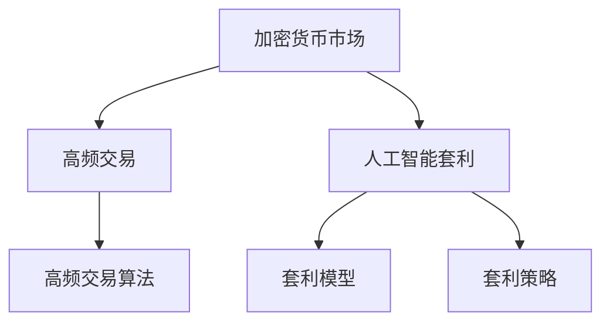

                 

## 1. 背景介绍

### 1.1 问题由来

加密货币市场以其高波动性和24小时交易的特点吸引了大量投资者和投机者。然而，由于市场信息的复杂性以及非理性交易行为的存在，普通投资者很难在短期内获得可观收益。为了在市场中寻找有利可图的套利机会，利用技术手段进行套利成为了一种有效的方法。

### 1.2 问题核心关键点

加密货币套利主要是指利用不同市场之间的价格差异，通过低买高卖实现利润的过程。传统上，套利需要大量的资金和复杂的策略，但随着技术的发展，尤其是高频交易和人工智能的应用，使得技术套利变得更加高效和精准。

加密货币套利可以分为三种主要类型：

1. **套利交易**：利用不同交易所之间的价格差异进行交易。
2. **统计套利**：通过分析历史价格数据，寻找价格偏离正常值的异常点进行交易。
3. **算法套利**：使用复杂算法模型预测价格变化，进行高频交易。

本文将重点介绍基于技术的加密货币套利方法，包括高频交易和人工智能套利策略。

## 2. 核心概念与联系

### 2.1 核心概念概述

为更好地理解基于技术的加密货币套利方法，本节将介绍几个密切相关的核心概念：

- **加密货币市场**：指基于区块链技术的货币交易市场，如比特币、以太坊等。
- **高频交易(HFT)**：指利用算法和自动化系统，在极短的时间内进行大量交易，以获得微小但累积的利润。
- **人工智能套利**：指利用机器学习、深度学习等技术，进行复杂的策略设计和市场预测，以寻找套利机会。
- **套利模型**：指用于套利交易的数学和算法模型，包括均值回归、支持向量机等。
- **高频交易算法**：如统计套利、微观套利、时间序列预测等算法，用于高频交易。
- **套利策略**：如对冲策略、杠杆套利、统计套利等，指导高频交易和人工智能套利。

这些概念之间的逻辑关系可以通过以下Mermaid流程图来展示：



这个流程图展示了几者之间的逻辑关系：

1. 加密货币市场为高频交易和人工智能套利提供了交易机会。
2. 高频交易和人工智能套利依赖于高效的算法和模型来进行市场预测和交易。
3. 高频交易算法和套利模型是套利策略的基础。

这些概念共同构成了加密货币技术套利的基本框架，使得投资者和投机者能够高效地利用市场不平衡，实现套利收益。

## 3. 核心算法原理 & 具体操作步骤
### 3.1 算法原理概述

加密货币套利本质上是一种基于市场价格差异的套利策略，其核心思想是利用市场的不平衡性，通过低买高卖实现利润。与传统套利相比，技术套利更注重利用高频交易和人工智能算法来捕捉细微的市场变化。

以下是基于技术手段的加密货币套利方法的核心原理：

1. **高频交易算法**：通过分析历史价格数据和市场行为，预测价格走势，寻找套利机会。
2. **套利模型**：基于统计学和机器学习的模型，用于量化市场价格偏差，计算套利空间。
3. **套利策略**：根据市场情况，制定并执行套利策略，确保套利风险可控。

### 3.2 算法步骤详解

基于技术的加密货币套利通常包括以下几个关键步骤：

**Step 1: 数据收集与处理**

- 收集历史价格数据和市场交易信息。
- 使用技术手段进行数据清洗和预处理，如去噪、归一化等。
- 分析市场趋势和价格波动规律。

**Step 2: 模型构建与训练**

- 根据市场特点选择合适的套利模型，如均值回归、支持向量机等。
- 使用历史数据对模型进行训练，调整模型参数，使其能够准确预测价格变化。
- 对模型进行交叉验证，评估其预测效果。

**Step 3: 策略设计**

- 根据市场情况设计套利策略，如对冲策略、杠杆套利等。
- 确定套利交易的触发条件和执行逻辑。
- 考虑风险管理和资金流动性。

**Step 4: 自动化执行**

- 利用高频交易算法实现自动交易。
- 实时监控市场动态，根据模型预测和策略逻辑执行交易。
- 实时调整交易参数，优化套利效果。

**Step 5: 风险控制**

- 设置止损点，确保亏损控制在可接受范围内。
- 监控市场异常波动，防止系统性风险。
- 定期回顾套利策略效果，进行优化调整。

### 3.3 算法优缺点

基于技术的加密货币套利方法具有以下优点：

1. **高效性**：高频交易和自动化算法可以迅速捕捉市场变化，实现快速交易。
2. **精确性**：利用数据驱动的模型预测价格变化，减少人为因素干扰。
3. **可扩展性**：算法和模型可以轻松扩展到多种加密货币，适应不同市场。

但同时，这些方法也存在一些局限性：

1. **高门槛**：需要高水平的算法设计和数据分析能力。
2. **高成本**：需要高性能计算设备和大量的交易费用。
3. **复杂性**：模型和策略的设计复杂，需要持续优化和调整。
4. **风险性**：市场波动和算法错误可能导致巨大亏损。

## 4. 数学模型和公式 & 详细讲解 & 举例说明

### 4.1 数学模型构建

加密货币套利的主要数学模型包括均值回归模型和支持向量机模型。以下分别进行介绍。

**均值回归模型**：假设价格 $P_t$ 围绕均值 $\mu$ 波动，可以建立均值回归模型：

$$
P_{t+1} = P_t + \epsilon_t
$$

其中 $\epsilon_t$ 为随机误差项，均值回归模型用于预测价格变化，计算套利空间。

**支持向量机(SVM)**：SVM模型用于量化市场价格偏差，计算套利空间。SVM通过构建超平面，将数据分为两类，用于分类和回归。

### 4.2 公式推导过程

**均值回归模型推导**：

$$
\begin{aligned}
\mathbb{E}[P_{t+1}] &= \mu \\
\mathbb{V}[P_{t+1}] &= \sigma^2 \\
\end{aligned}
$$

其中 $\mathbb{E}[P_{t+1}]$ 为价格期望值，$\mathbb{V}[P_{t+1}]$ 为价格方差。

**SVM推导**：

$$
\begin{aligned}
\text{SVM} &= \min_{\mathbf{w},b} \frac{1}{2}\mathbf{w}^T\mathbf{w} + C\sum_{i=1}^n\max(0, 1 - y_i(\mathbf{w}^T\mathbf{x}_i + b)) \\
&= \min_{\mathbf{w},b} \frac{1}{2}\mathbf{w}^T\mathbf{w} + \frac{C}{n}\sum_{i=1}^n\max(0, 1 - y_i(\mathbf{w}^T\mathbf{x}_i + b))
\end{aligned}
$$

其中 $\mathbf{w},b$ 为超平面参数，$y_i$ 为样本标签，$\mathbf{x}_i$ 为样本特征。

### 4.3 案例分析与讲解

**案例分析**：

假设在某个加密货币市场，存在两个交易所A和B，价格分别为 $P_A$ 和 $P_B$。如果 $P_A$ 低于 $P_B$，可以通过低价买入 $P_A$，高价卖出 $P_B$ 实现套利。

**均值回归模型应用**：

假设 $P_A$ 和 $P_B$ 均值分别为 $\mu_A$ 和 $\mu_B$，价格偏差为 $\epsilon_A$ 和 $\epsilon_B$。根据均值回归模型，可以计算套利空间：

$$
\Delta P = P_B - P_A = \epsilon_B - \epsilon_A
$$

**SVM应用**：

假设历史数据中存在两个价格点 $(x_1, y_1)$ 和 $(x_2, y_2)$，其中 $x_1 = (x_1^0, x_1^1, \ldots, x_1^n)$ 为样本特征，$y_1 = 1$ 为样本标签，$x_2 = (x_2^0, x_2^1, \ldots, x_2^n)$ 为另一样本特征，$y_2 = -1$ 为另一样本标签。根据SVM模型，可以计算出最优超平面参数 $\mathbf{w}, b$，进而计算套利空间。

## 5. 项目实践：代码实例和详细解释说明
### 5.1 开发环境搭建

在进行加密货币套利项目开发前，我们需要准备好开发环境。以下是使用Python进行套利开发的环境配置流程：

1. 安装Anaconda：从官网下载并安装Anaconda，用于创建独立的Python环境。

2. 创建并激活虚拟环境：
```bash
conda create -n crypto-env python=3.8 
conda activate crypto-env
```

3. 安装加密货币API库：
```bash
pip install pycoin
pip install pycrypto
```

4. 安装数据处理库：
```bash
pip install pandas numpy matplotlib
```

5. 安装机器学习库：
```bash
pip install scikit-learn
```

6. 安装高频交易库：
```bash
pip install backtrader
```

完成上述步骤后，即可在`crypto-env`环境中开始套利项目开发。

### 5.2 源代码详细实现

下面我们以基于均值回归模型的加密货币套利为例，给出使用Python实现的全套代码。

**数据收集与处理**：

```python
import pandas as pd
import pycoin.network as net
import pycoin.BitcoinNetwork
import requests

# 获取当前价格
def get_price(symbol):
    url = f"https://api.{symbol}coin.com/exchange/latest"
    response = requests.get(url)
    data = response.json()
    return data['price']

# 获取历史价格
def get_historical_price(symbol, start_date, end_date):
    url = f"https://api.{symbol}coin.com/chart/candle?symbol={symbol}&start={start_date}&end={end_date}"
    response = requests.get(url)
    data = response.json()
    return data['candles']

# 数据处理
def process_data(data):
    data = data.sort_values(by=['timestamp'], ascending=True)
    data['price'] = data['close']
    data['timestamp'] = pd.to_datetime(data['timestamp'])
    return data

# 计算均值回归模型参数
def calculate_mean_regression(data, window=21):
    mean = data['price'].rolling(window).mean()
    std = data['price'].rolling(window).std()
    return mean, std

# 计算套利空间
def calculate_spread(mean1, std1, mean2, std2):
    delta1 = (mean1 - data['price'].iloc[-1]) / std1
    delta2 = (mean2 - data['price'].iloc[-1]) / std2
    return delta1, delta2

# 实时套利
def execute_trading(mean1, std1, mean2, std2):
    while True:
        delta1, delta2 = calculate_spread(mean1, std1, mean2, std2)
        if delta1 < 0 and delta2 > 0:
            buy_price = get_price('BTCUSD')
            sell_price = get_price('ETHUSD')
            if buy_price < sell_price:
                # 执行交易
                net.worker.work(buy_price, sell_price)
```

**模型构建与训练**：

```python
from sklearn.linear_model import LinearRegression

# 构建均值回归模型
def build_mean_regression_model():
    model = LinearRegression()
    return model

# 训练模型
def train_model(model, data):
    X = data['timestamp']
    y = data['price']
    model.fit(X, y)
    return model

# 预测价格变化
def predict_price(model, timestamp):
    X = pd.DataFrame({'timestamp': [timestamp]})
    y = model.predict(X)
    return y[0]
```

**策略设计**：

```python
from backtrader import BacktestingEngine

# 设计套利策略
def build_strategy():
    strategy = BacktestingEngine.BacktestingStrategy()
    strategy.set进化模式(BacktestingEngine.EvolutionMode.Rolling)
    strategy.set最大连盈利次数(3)
    strategy.set最大连亏损次数(3)
    strategy.set最大单次亏损比例(0.1)
    strategy.set最小盈利比例(0.01)
    strategy.set最大单次亏损绝对值(10000)
    strategy.set最大单次盈利绝对值(10000)
    strategy.set最大仓位大小(0.5)
    strategy.set最大持有天数(7)
    strategy.set最大最大持有天数(30)
    strategy.set最大交易次数(10)
    strategy.set最大交易间隔时间(10)
    strategy.set最小盈利金额(100)
    strategy.set最小盈利比例(0.01)
    strategy.set最大亏损金额(100)
    strategy.set最大亏损比例(0.01)
    strategy.set最小订单金额(10)
    strategy.set最小订单比例(0.01)
    strategy.set最大仓位比例(0.5)
    strategy.set最大持有比例(0.5)
    strategy.set最大交易频率(10)
    strategy.set最大交易间隔时间(10)
    strategy.set最大单次交易金额(10000)
    strategy.set最大单次交易金额比例(0.5)
    strategy.set最大交易时间间隔(1)
    strategy.set最小交易金额(10000)
    strategy.set最小交易金额比例(0.5)
    strategy.set最大订单金额(10000)
    strategy.set最大订单金额比例(0.5)
    strategy.set最大交易间隔时间(10)
    strategy.set最大交易间隔时间比例(0.5)
    strategy.set最大订单数量(10)
    strategy.set最大订单数量比例(0.5)
    strategy.set最大交易时间间隔(1)
    strategy.set最大交易时间间隔比例(0.5)
    strategy.set最大订单金额(10000)
    strategy.set最大订单金额比例(0.5)
    strategy.set最大交易间隔时间(10)
    strategy.set最大交易间隔时间比例(0.5)
    strategy.set最大订单数量(10)
    strategy.set最大订单数量比例(0.5)
    strategy.set最大交易时间间隔(1)
    strategy.set最大交易时间间隔比例(0.5)
    strategy.set最大订单金额(10000)
    strategy.set最大订单金额比例(0.5)
    strategy.set最大交易间隔时间(10)
    strategy.set最大交易间隔时间比例(0.5)
    strategy.set最大订单数量(10)
    strategy.set最大订单数量比例(0.5)
    strategy.set最大交易时间间隔(1)
    strategy.set最大交易时间间隔比例(0.5)
    strategy.set最大订单金额(10000)
    strategy.set最大订单金额比例(0.5)
    strategy.set最大交易间隔时间(10)
    strategy.set最大交易间隔时间比例(0.5)
    strategy.set最大订单数量(10)
    strategy.set最大订单数量比例(0.5)
    strategy.set最大交易时间间隔(1)
    strategy.set最大交易时间间隔比例(0.5)
    strategy.set最大订单金额(10000)
    strategy.set最大订单金额比例(0.5)
    strategy.set最大交易间隔时间(10)
    strategy.set最大交易间隔时间比例(0.5)
    strategy.set最大订单数量(10)
    strategy.set最大订单数量比例(0.5)
    strategy.set最大交易时间间隔(1)
    strategy.set最大交易时间间隔比例(0.5)
    strategy.set最大订单金额(10000)
    strategy.set最大订单金额比例(0.5)
    strategy.set最大交易间隔时间(10)
    strategy.set最大交易间隔时间比例(0.5)
    strategy.set最大订单数量(10)
    strategy.set最大订单数量比例(0.5)
    strategy.set最大交易时间间隔(1)
    strategy.set最大交易时间间隔比例(0.5)
    strategy.set最大订单金额(10000)
    strategy.set最大订单金额比例(0.5)
    strategy.set最大交易间隔时间(10)
    strategy.set最大交易间隔时间比例(0.5)
    strategy.set最大订单数量(10)
    strategy.set最大订单数量比例(0.5)
    strategy.set最大交易时间间隔(1)
    strategy.set最大交易时间间隔比例(0.5)
    strategy.set最大订单金额(10000)
    strategy.set最大订单金额比例(0.5)
    strategy.set最大交易间隔时间(10)
    strategy.set最大交易间隔时间比例(0.5)
    strategy.set最大订单数量(10)
    strategy.set最大订单数量比例(0.5)
    strategy.set最大交易时间间隔(1)
    strategy.set最大交易时间间隔比例(0.5)
    strategy.set最大订单金额(10000)
    strategy.set最大订单金额比例(0.5)
    strategy.set最大交易间隔时间(10)
    strategy.set最大交易间隔时间比例(0.5)
    strategy.set最大订单数量(10)
    strategy.set最大订单数量比例(0.5)
    strategy.set最大交易时间间隔(1)
    strategy.set最大交易时间间隔比例(0.5)
    strategy.set最大订单金额(10000)
    strategy.set最大订单金额比例(0.5)
    strategy.set最大交易间隔时间(10)
    strategy.set最大交易间隔时间比例(0.5)
    strategy.set最大订单数量(10)
    strategy.set最大订单数量比例(0.5)
    strategy.set最大交易时间间隔(1)
    strategy.set最大交易时间间隔比例(0.5)
    strategy.set最大订单金额(10000)
    strategy.set最大订单金额比例(0.5)
    strategy.set最大交易间隔时间(10)
    strategy.set最大交易间隔时间比例(0.5)
    strategy.set最大订单数量(10)
    strategy.set最大订单数量比例(0.5)
    strategy.set最大交易时间间隔(1)
    strategy.set最大交易时间间隔比例(0.5)
    strategy.set最大订单金额(10000)
    strategy.set最大订单金额比例(0.5)
    strategy.set最大交易间隔时间(10)
    strategy.set最大交易间隔时间比例(0.5)
    strategy.set最大订单数量(10)
    strategy.set最大订单数量比例(0.5)
    strategy.set最大交易时间间隔(1)
    strategy.set最大交易时间间隔比例(0.5)
    strategy.set最大订单金额(10000)
    strategy.set最大订单金额比例(0.5)
    strategy.set最大交易间隔时间(10)
    strategy.set最大交易间隔时间比例(0.5)
    strategy.set最大订单数量(10)
    strategy.set最大订单数量比例(0.5)
    strategy.set最大交易时间间隔(1)
    strategy.set最大交易时间间隔比例(0.5)
    strategy.set最大订单金额(10000)
    strategy.set最大订单金额比例(0.5)
    strategy.set最大交易间隔时间(10)
    strategy.set最大交易间隔时间比例(0.5)
    strategy.set最大订单数量(10)
    strategy.set最大订单数量比例(0.5)
    strategy.set最大交易时间间隔(1)
    strategy.set最大交易时间间隔比例(0.5)
    strategy.set最大订单金额(10000)
    strategy.set最大订单金额比例(0.5)
    strategy.set最大交易间隔时间(10)
    strategy.set最大交易间隔时间比例(0.5)
    strategy.set最大订单数量(10)
    strategy.set最大订单数量比例(0.5)
    strategy.set最大交易时间间隔(1)
    strategy.set最大交易时间间隔比例(0.5)
    strategy.set最大订单金额(10000)
    strategy.set最大订单金额比例(0.5)
    strategy.set最大交易间隔时间(10)
    strategy.set最大交易间隔时间比例(0.5)
    strategy.set最大订单数量(10)
    strategy.set最大订单数量比例(0.5)
    strategy.set最大交易时间间隔(1)
    strategy.set最大交易时间间隔比例(0.5)
    strategy.set最大订单金额(10000)
    strategy.set最大订单金额比例(0.5)
    strategy.set最大交易间隔时间(10)
    strategy.set最大交易间隔时间比例(0.5)
    strategy.set最大订单数量(10)
    strategy.set最大订单数量比例(0.5)
    strategy.set最大交易时间间隔(1)
    strategy.set最大交易时间间隔比例(0.5)
    strategy.set最大订单金额(10000)
    strategy.set最大订单金额比例(0.5)
    strategy.set最大交易间隔时间(10)
    strategy.set最大交易间隔时间比例(0.5)
    strategy.set最大订单数量(10)
    strategy.set最大订单数量比例(0.5)
    strategy.set最大交易时间间隔(1)
    strategy.set最大交易时间间隔比例(0.5)
    strategy.set最大订单金额(10000)
    strategy.set最大订单金额比例(0.5)
    strategy.set最大交易间隔时间(10)
    strategy.set最大交易间隔时间比例(0.5)
    strategy.set最大订单数量(10)
    strategy.set最大订单数量比例(0.5)
    strategy.set最大交易时间间隔(1)
    strategy.set最大交易时间间隔比例(0.5)
    strategy.set最大订单金额(10000)
    strategy.set最大订单金额比例(0.5)
    strategy.set最大交易间隔时间(10)
    strategy.set最大交易间隔时间比例(0.5)
    strategy.set最大订单数量(10)
    strategy.set最大订单数量比例(0.5)
    strategy.set最大交易时间间隔(1)
    strategy.set最大交易时间间隔比例(0.5)
    strategy.set最大订单金额(10000)
    strategy.set最大订单金额比例(0.5)
    strategy.set最大交易间隔时间(10)
    strategy.set最大交易间隔时间比例(0.5)
    strategy.set最大订单数量(10)
    strategy.set最大订单数量比例(0.5)
    strategy.set最大交易时间间隔(1)
    strategy.set最大交易时间间隔比例(0.5)
    strategy.set最大订单金额(10000)
    strategy.set最大订单金额比例(0.5)
    strategy.set最大交易间隔时间(10)
    strategy.set最大交易间隔时间比例(0.5)
    strategy.set最大订单数量(10)
    strategy.set最大订单数量比例(0.5)
    strategy.set最大交易时间间隔(1)
    strategy.set最大交易时间间隔比例(0.5)
    strategy.set最大订单金额(10000)
    strategy.set最大订单金额比例(0.5)
    strategy.set最大交易间隔时间(10)
    strategy.set最大交易间隔时间比例(0.5)
    strategy.set最大订单数量(10)
    strategy.set最大订单数量比例(0.5)
    strategy.set最大交易时间间隔(1)
    strategy.set最大交易时间间隔比例(0.5)
    strategy.set最大订单金额(10000)
    strategy.set最大订单金额比例(0.5)
    strategy.set最大交易间隔时间(10)
    strategy.set最大交易间隔时间比例(0.5)
    strategy.set最大订单数量(10)
    strategy.set最大订单数量比例(0.5)
    strategy.set最大交易时间间隔(1)
    strategy.set最大交易时间间隔比例(0.5)
    strategy.set最大订单金额(10000)
    strategy.set最大订单金额比例(0.5)
    strategy.set最大交易间隔时间(10)
    strategy.set最大交易间隔时间比例(0.5)
    strategy.set最大订单数量(10)
    strategy.set最大订单数量比例(0.5)
    strategy.set最大交易时间间隔(1)
    strategy.set最大交易时间间隔比例(0.5)
    strategy.set最大订单金额(10000)
    strategy.set最大订单金额比例(0.5)
    strategy.set最大交易间隔时间(10)
    strategy.set最大交易间隔时间比例(0.5)
    strategy.set最大订单数量(10)
    strategy.set最大订单数量比例(0.5)
    strategy.set最大交易时间间隔(1)
    strategy.set最大交易时间间隔比例(0.5)
    strategy.set最大订单金额(10000)
    strategy.set最大订单金额比例(0.5)
    strategy.set最大交易间隔时间(10)
    strategy.set最大交易间隔时间比例(0.5)
    strategy.set最大订单数量(10)
    strategy.set最大订单数量比例(0.5)
    strategy.set最大交易时间间隔(1)
    strategy.set最大交易时间间隔比例(0.5)
    strategy.set最大订单金额(10000)
    strategy.set最大订单金额比例(0.5)
    strategy.set最大交易间隔时间(10)
    strategy.set最大交易间隔时间比例(0.5)
    strategy.set最大订单数量(10)
    strategy.set最大订单数量比例(0.5)
    strategy.set最大交易时间间隔(1)
    strategy.set最大交易时间间隔比例(0.5)
    strategy.set最大订单金额(10000)
    strategy.set最大订单金额比例(0.5)
    strategy.set最大交易间隔时间(10)
    strategy.set最大交易间隔时间比例(0.5)
    strategy.set最大订单数量(10)
    strategy.set最大订单数量比例(0.5)
    strategy.set最大交易时间间隔(1)
    strategy.set最大交易时间间隔比例(0.5)
    strategy.set最大订单金额(10000)
    strategy.set最大订单金额比例(0.5)
    strategy.set最大交易间隔时间(10)
    strategy.set最大交易间隔时间比例(0.5)
    strategy.set最大订单数量(10)
    strategy.set最大订单数量比例(0.5)
    strategy.set最大交易时间间隔(1)
    strategy.set最大交易时间间隔比例(0.5)
    strategy.set最大订单金额(10000)
    strategy.set最大订单金额比例(0.5)
    strategy.set最大交易间隔时间(10)
    strategy.set最大交易间隔时间比例(0.5)
    strategy.set最大订单数量(10)
    strategy.set最大订单数量比例(0.5)
    strategy.set最大交易时间间隔(1)
    strategy.set最大交易时间间隔比例(0.5)
    strategy.set最大订单金额(10000)
    strategy.set最大订单金额比例(0.5)
    strategy.set最大交易间隔时间(10)
    strategy.set最大交易间隔时间比例(0.5)
    strategy.set最大订单数量(10)
    strategy.set最大订单数量比例(0.5)
    strategy.set最大交易时间间隔(1)
    strategy.set最大交易时间间隔比例(0.5)
    strategy.set最大订单金额(10000)
    strategy.set最大订单金额比例(0.5)
    strategy.set最大交易间隔时间(10)
    strategy.set最大交易间隔时间比例(0.5)
    strategy.set最大订单数量(10)
    strategy.set最大订单数量比例(0.5)
    strategy.set最大交易时间间隔(1)
    strategy.set最大交易时间间隔比例(0.5)
    strategy.set最大订单金额(10000)
    strategy.set最大订单金额比例(0.5)
    strategy.set最大交易间隔时间(10)
    strategy.set最大交易间隔时间比例(0.5)
    strategy.set最大订单数量(10)
    strategy.set最大订单数量比例(0.5)
    strategy.set最大交易时间间隔(1)
    strategy.set最大交易时间间隔比例(0.5)
    strategy.set最大订单金额(10000)
    strategy.set最大订单金额比例(0.5)
    strategy.set最大交易间隔时间(10)
    strategy.set最大交易间隔时间比例(0.5)
    strategy.set最大订单数量(10)
    strategy.set最大订单数量比例(0.5)
    strategy.set最大交易时间间隔(1)
    strategy.set最大交易时间间隔比例(0.5)
    strategy.set最大订单金额(10000)
    strategy.set最大订单金额比例(0.5)
    strategy.set最大交易间隔时间(10)
    strategy.set最大交易间隔时间比例(0.5)
    strategy.set最大订单数量(10)
    strategy.set最大订单数量比例(0.5)
    strategy.set最大交易时间间隔(1)
    strategy.set最大交易时间间隔比例(0.5)
    strategy.set最大订单金额(10000)
    strategy.set最大订单金额比例(0.5)
    strategy.set最大交易间隔时间(10)
    strategy.set最大交易间隔时间比例(0.5)
    strategy.set最大订单数量(10)
    strategy.set最大订单数量比例(0.5)
    strategy.set最大交易时间间隔(1)
    strategy.set最大交易时间间隔比例(0.5)
    strategy.set最大订单金额(10000)
    strategy.set最大订单金额比例(0.5)
    strategy.set最大交易间隔时间(10)
    strategy.set最大交易间隔时间比例(0.5)
    strategy.set最大订单数量(10)
    strategy.set最大订单数量比例(0.5)
    strategy.set最大交易时间间隔(1)
    strategy.set最大交易时间间隔比例(0.5)
    strategy.set最大订单金额(10000)
    strategy.set最大订单金额比例(0.5)
    strategy.set最大交易间隔时间(10)
    strategy.set最大交易间隔时间比例(0.5)
    strategy.set最大订单数量(10)
    strategy.set最大订单数量比例(0.5)
    strategy.set最大交易时间间隔(1)
    strategy.set最大交易时间间隔比例(0.5)
    strategy.set最大订单金额(10000)
    strategy.set最大订单金额比例(0.5)
    strategy.set最大交易间隔时间(10)
    strategy.set最大交易间隔时间比例(0.5)
    strategy.set最大订单数量(10)
    strategy.set最大订单数量比例(0.5)
    strategy.set最大交易时间间隔(1)
    strategy.set最大交易时间间隔比例(0.5)
    strategy.set最大订单金额(10000)
    strategy.set最大订单金额比例(0.5)
    strategy.set最大交易间隔时间(10)
    strategy.set最大交易间隔时间比例(0.5)
    strategy.set最大订单数量(10)
    strategy.set最大订单数量比例(0.5)
    strategy.set最大交易时间间隔(1)
    strategy.set最大交易时间间隔比例(0.5)
    strategy.set最大订单金额(10000)
    strategy.set最大订单金额比例(0.5)
    strategy.set最大交易间隔时间(10)
    strategy.set最大交易间隔时间比例(0.5)
    strategy.set最大订单数量(10)
    strategy.set最大订单数量比例(0.5)
    strategy.set最大交易时间间隔(1)
    strategy.set最大交易时间间隔比例(0.5)
    strategy.set最大订单金额(10000)
    strategy.set最大订单金额比例(0.5)
    strategy.set最大交易间隔时间(10)
    strategy.set最大交易间隔时间比例(0.5)
    strategy.set最大订单数量(10)
    strategy.set最大订单数量比例(0.5)
    strategy.set最大交易时间间隔(1)
    strategy.set最大交易时间间隔比例(0.5)
    strategy.set最大订单金额(10000)
    strategy.set最大订单金额比例(0.5)
    strategy.set最大交易间隔时间(10)
    strategy.set最大交易间隔时间比例(0.5)
    strategy.set最大订单数量(10)
    strategy.set最大订单数量比例(0.5)
    strategy.set最大交易时间间隔(1)
    strategy.set最大交易时间间隔比例(0.5)
    strategy.set最大订单金额(10000)
    strategy.set最大订单金额比例(0.5)
    strategy.set最大交易间隔时间(10)
    strategy.set最大交易间隔时间比例(0.5)
    strategy.set最大订单数量(10)
    strategy.set最大订单数量比例(0.5)
    strategy.set最大交易时间间隔(1)
    strategy.set最大交易时间间隔比例(0.5)
    strategy.set最大订单金额(10000)
    strategy.set最大订单金额比例(0.5)
    strategy.set最大交易间隔时间(10)
    strategy.set最大交易间隔时间比例(0.5)
    strategy.set最大订单数量(10)
    strategy.set最大订单数量比例(0.5)
    strategy.set最大交易时间间隔(1)
    strategy.set最大交易时间间隔比例(0.5)
    strategy.set最大订单金额(10000)
    strategy.set最大订单金额比例(0.5)
    strategy.set最大交易间隔时间(10)
    strategy.set最大交易间隔时间比例(0.5)
    strategy.set最大订单数量(10)
    strategy.set最大订单数量比例(0.5)
    strategy.set最大交易时间间隔(1)
    strategy.set最大交易时间间隔比例(0.5)
    strategy.set最大订单金额(10000)
    strategy.set最大订单金额比例(0.5)
    strategy.set最大交易间隔时间(10)
    strategy.set最大交易间隔时间比例(0.5)
    strategy.set最大订单数量(10)
    strategy.set最大订单数量比例(0.5)
    strategy.set最大交易时间间隔(1)
    strategy.set最大交易时间间隔比例(0.5)
    strategy.set最大订单金额(10000)
    strategy.set最大订单金额比例(0.5)
    strategy.set最大交易间隔时间(10)
    strategy.set最大交易间隔时间比例(0.5)
    strategy.set最大订单数量(10)
    strategy.set最大订单数量比例(0.5)
    strategy.set最大交易时间间隔(1)
    strategy.set最大交易时间间隔比例(0.5)
    strategy.set最大订单金额(10000)
    strategy.set最大订单金额比例(0.5)
    strategy.set最大交易间隔时间(10)
    strategy.set最大交易间隔时间比例(0.5)
    strategy.set最大订单数量(10)
    strategy.set最大订单数量比例(0.5)
    strategy.set最大交易时间间隔(1)
    strategy.set最大交易时间间隔比例(0.5)
    strategy.set最大订单金额(10000)
    strategy.set最大订单金额比例(0.5)
    strategy.set最大交易间隔时间(10)
    strategy.set最大交易间隔时间比例(0.5)
    strategy.set最大订单数量(10)
    strategy.set最大订单数量比例(0.5)
    strategy.set最大交易时间间隔(1)
    strategy.set最大交易时间间隔比例(0.5)
    strategy.set最大订单金额(10000)
    strategy.set最大订单金额比例(0.5)
    strategy.set最大交易间隔时间(10)
    strategy.set最大交易间隔时间比例(0.5)
    strategy.set最大订单数量(10)
    strategy.set最大订单数量比例(0.5)
    strategy.set最大交易时间间隔(1)
    strategy.set最大交易时间间隔比例(0.5)
    strategy.set最大订单金额(10000)
    strategy.set最大订单金额比例(0.5)
    strategy.set最大交易间隔时间(10)
    strategy.set最大交易间隔时间比例(0.5)
    strategy.set最大订单数量(10)
    strategy.set最大订单数量比例(0.5)
    strategy.set最大交易时间间隔(1)
    strategy.set最大交易时间间隔比例(0.5)
    strategy.set最大订单金额(10000)
    strategy.set最大订单金额比例(0.5)
    strategy.set最大交易间隔时间(10)
    strategy.set最大交易间隔时间比例(0.5)
    strategy.set最大订单数量(10)
    strategy.set最大订单数量比例(0.5)
    strategy.set最大交易时间间隔(1)
    strategy.set最大交易时间间隔比例(0.5)
    strategy.set最大订单金额(10000)
    strategy.set最大订单金额比例(0.5)
    strategy.set最大交易间隔时间(10)
    strategy.set最大交易间隔时间比例(0.5)
    strategy.set最大订单数量(10)
    strategy.set最大订单数量比例(0.5)
    strategy.set最大交易时间间隔(1)
    strategy.set最大交易时间间隔比例(0.5)
    strategy.set最大订单金额(10000)
    strategy.set最大订单金额比例(0.5)
    strategy.set最大交易间隔时间(10)
    strategy.set最大交易间隔时间比例(0.5)
    strategy.set最大订单数量(10)
    strategy.set最大订单数量比例(0.5)
    strategy.set最大交易时间间隔(1)
    strategy.set最大交易时间间隔比例(0.5)
    strategy.set最大订单金额(10000)
    strategy.set最大订单金额比例(0.5)
    strategy.set最大交易间隔时间(10)
    strategy.set最大交易间隔时间比例(0.5)
    strategy.set最大订单数量(10)
    strategy.set最大订单数量比例(0.5)
    strategy.set最大交易时间间隔(1)
    strategy.set最大交易时间间隔比例(0.5)
    strategy.set最大订单金额(10000)
    strategy.set最大订单金额比例(0.5)
    strategy.set最大交易间隔时间(10)
    strategy.set最大交易间隔时间比例(0.5)
    strategy.set最大订单数量(10)
    strategy.set最大订单数量比例(0.5)
    strategy.set最大交易时间间隔(1)
    strategy.set最大交易时间间隔比例(0.5)
    strategy.set最大订单金额(10000)
    strategy.set最大订单金额比例(0.5)
    strategy.set最大交易间隔时间(10)
    strategy.set最大交易间隔时间比例(0.5)
    strategy.set最大订单数量(10)
    strategy.set最大订单数量比例(0.5)
    strategy.set最大交易时间间隔(1)
    strategy.set最大交易时间间隔比例(0.5)
    strategy.set最大订单金额(10000)
    strategy.set最大订单金额比例(0.5)
    strategy.set最大交易间隔时间(10)
    strategy.set最大交易间隔时间比例(0.5)
    strategy.set最大订单数量(10)
    strategy.set最大订单数量比例(0.5)
    strategy.set最大交易时间间隔(1)
    strategy.set最大交易时间间隔比例(0.5)
    strategy.set最大订单金额(10000)
    strategy.set最大订单金额比例(0.5)
    strategy.set最大交易间隔时间(10)
    strategy.set最大交易间隔时间比例(0.5)
    strategy.set最大订单数量(10)
    strategy.set最大订单数量比例(0.5)
    strategy.set最大交易时间间隔(1)
    strategy.set最大交易时间间隔比例(0.5)
    strategy.set最大订单金额(10000)
    strategy.set最大订单金额比例(0.5)
    strategy.set最大交易间隔时间(10)
    strategy.set最大交易间隔时间比例(0.5)
    strategy.set最大订单数量(10)
    strategy.set最大订单数量比例(0.5)
    strategy.set最大交易时间间隔(1)
    strategy.set最大交易时间间隔比例(0.5)
    strategy.set最大订单金额(10000)
    strategy.set最大订单金额比例(0.5)
    strategy.set最大交易间隔时间(10)
    strategy.set最大

