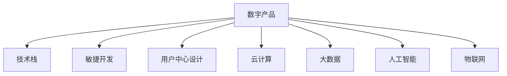

                 

# 利用技术能力创建数字产品

> 关键词：数字产品,技术能力,应用场景,产品开发,创新

## 1. 背景介绍

### 1.1 问题由来

在数字化时代，技术已成为企业竞争的核心要素之一。如何在数字化转型中保持领先地位，创建具有竞争力的数字产品，成为众多企业面临的共同挑战。数字产品不仅包括传统的软件、硬件，还涵盖各种在线服务和应用程序，它们通过创新技术改善用户体验，提升生产效率，优化运营流程，满足用户个性化需求。

### 1.2 问题核心关键点

数字产品的成功开发，依赖于强大的技术能力、深刻的市场洞察、清晰的业务目标和高效的项目管理。以下是数字产品开发中需要重点关注的核心关键点：

- **技术能力**：涵盖人工智能、大数据、云计算、物联网等多种技术，是构建高质量数字产品的基础。
- **市场洞察**：了解目标用户需求和市场趋势，设计符合用户期望的产品功能和服务。
- **业务目标**：明确产品定位和目标，通过技术手段解决实际业务问题，提升企业竞争力。
- **项目管理**：确保项目按时、按质、按预算完成，通过敏捷开发、迭代优化等方法提升效率。

这些关键点共同构成了数字产品开发的框架，帮助企业从无到有、从有到优，不断迭代出具备市场竞争力的数字产品。

## 2. 核心概念与联系

### 2.1 核心概念概述

为更好地理解数字产品的开发过程，本节将介绍几个密切相关的核心概念：

- **数字产品**：指利用信息技术开发出来的，能满足用户需求、提升工作效率、创造商业价值的产品，包括软件、平台、服务、硬件等。
- **技术栈**：指构建数字产品所需的技术工具、框架和平台，如编程语言、数据库、中间件、云服务等。
- **敏捷开发**：一种注重快速响应市场需求、迭代开发的软件开发模式，通过小步快跑的开发周期和持续集成，实现产品快速上线和迭代优化。
- **用户中心设计**：一种以用户需求为中心的产品设计方法，强调从用户视角出发，通过用户调研、原型测试等方式收集用户反馈，优化产品功能和服务。
- **云计算**：通过互联网提供计算资源和服务，具有高弹性、高可扩展性、高可用性等优点，是构建大规模数字产品的重要基础设施。
- **大数据**：指通过数据收集、存储、处理和分析，从海量数据中提取有价值信息，支持业务决策和产品优化。
- **人工智能**：指模拟人类智能行为的技术，包括机器学习、深度学习、自然语言处理等，通过数据分析和算法模型提升产品智能化水平。
- **物联网**：通过传感器、智能设备等实现物与物、物与人的互联互通，推动工业互联网、智能城市等应用场景的发展。

这些核心概念之间的逻辑关系可以通过以下Mermaid流程图来展示：



这个流程图展示了大数字产品开发的关键组件及其之间的关系：

1. 数字产品是构建的目标，需要依赖多种技术工具和平台支持。
2. 敏捷开发和用户中心设计，是确保产品符合市场需求、用户期望的核心方法。
3. 云计算、大数据、人工智能和物联网等技术，是实现产品功能和服务的重要手段。

这些概念共同构成了数字产品开发的逻辑框架，帮助企业从不同维度构建出具有创新力和竞争力的数字产品。

## 3. 核心算法原理 & 具体操作步骤

### 3.1 算法原理概述

数字产品的开发，实质上是一个将用户需求转化为软件功能的过程。这一过程涉及多个阶段，包括需求分析、系统设计、编码实现、测试部署等。算法原理主要涉及以下几个方面：

- **需求分析**：通过市场调研、用户访谈等方式，收集和分析用户需求，确定产品功能和目标。
- **系统设计**：根据需求设计系统的架构和数据模型，选择合适的技术栈和开发工具。
- **编码实现**：将设计转化为代码，实现系统的各项功能和服务。
- **测试部署**：通过单元测试、集成测试、性能测试等方式，确保产品功能和稳定性，最终上线部署。

每个阶段都需要算法支撑，以高效地解决问题和优化产品。

### 3.2 算法步骤详解

数字产品的开发过程可以分为以下几个关键步骤：

**Step 1: 需求分析和规划**
- 进行市场调研，了解行业趋势和用户需求。
- 制定详细的产品规划，包括产品愿景、核心功能、目标用户等。
- 编写需求文档，明确各项功能的技术需求和业务目标。

**Step 2: 系统架构设计和实现**
- 设计系统的整体架构，包括模块划分、数据流向、接口设计等。
- 选择合适的技术栈和开发工具，如Java、Python、React、Vue等。
- 实现系统的核心功能模块，确保数据安全、性能高效、可扩展性强。

**Step 3: 敏捷开发与持续集成**
- 采用敏捷开发方法，如Scrum、Kanban等，分阶段迭代开发产品功能。
- 使用持续集成工具，如Jenkins、Travis CI等，自动化构建和测试代码。
- 定期进行代码审查和功能评审，确保代码质量和技术实现符合标准。

**Step 4: 用户测试与反馈优化**
- 通过原型测试、A/B测试等方式，收集用户反馈，评估产品性能和用户体验。
- 根据用户反馈进行功能优化和改进，不断迭代升级产品。
- 发布产品测试版，进行公测和内测，收集更多用户意见。

**Step 5: 上线部署与持续运维**
- 部署产品到生产环境，监控系统运行状态和性能指标。
- 建立持续运维机制，实时监控系统健康，及时响应和解决问题。
- 定期更新产品和优化服务，保持产品竞争力。

### 3.3 算法优缺点

数字产品开发算法具有以下优点：

1. **高效性**：通过敏捷开发和持续集成，能够快速响应市场需求，实现产品的快速迭代和上线。
2. **灵活性**：采用模块化和组件化的设计，系统具有良好的可扩展性和可维护性。
3. **可控性**：通过需求分析和用户反馈，能够有效控制产品功能和用户体验。
4. **成本效益**：敏捷开发和持续集成降低了开发成本和风险，提高了产品开发的成功率。

同时，这些算法也存在一些缺点：

1. **技术复杂度高**：涉及多个技术栈和工具，需要综合运用多种算法和框架。
2. **风险控制难**：敏捷开发和持续集成可能导致部分功能不稳定，影响用户体验。
3. **数据依赖强**：依赖大量数据支持系统设计和用户分析，数据质量和可用性对系统成功至关重要。
4. **用户需求变**：用户需求不断变化，需及时调整系统功能和设计，增加开发和维护成本。

尽管存在这些挑战，敏捷开发和持续集成的优势，仍然使数字产品开发成为当前主流方法。

### 3.4 算法应用领域

数字产品开发的算法主要应用于以下几个领域：

- **企业管理系统**：如ERP、CRM、HR等，通过技术手段优化企业运营流程，提升管理效率。
- **电子商务平台**：如电商平台、支付系统、物流系统等，通过云计算和大数据支持用户购物和交易。
- **移动应用开发**：如社交网络、游戏、教育应用等，通过人工智能和物联网提升用户体验和服务质量。
- **智能家居系统**：如智能音箱、智能灯泡、智能门锁等，通过物联网技术实现家庭自动化和智能化。
- **工业互联网**：如智能制造、智慧能源、智能交通等，通过物联网和云计算支持工业生产和服务优化。

这些应用领域展示了数字产品开发的广阔前景，推动了各行各业的数字化转型和智能化升级。

## 4. 数学模型和公式 & 详细讲解  
### 4.1 数学模型构建

数字产品开发中的算法过程，可以通过数学模型进行形式化的表示。以下是一个简单的数字产品开发过程的数学模型构建：

假设数字产品开发过程分为$n$个阶段，每个阶段$i$的成本为$c_i$，时间复杂度为$t_i$。则总成本$C$和总时间$T$可以表示为：

$$
C = \sum_{i=1}^{n} c_i
$$

$$
T = \sum_{i=1}^{n} t_i
$$

其中，$c_i$和$t_i$表示第$i$阶段的总成本和时间复杂度。在开发过程中，可以通过优化算法和项目管理手段，减少成本和提高效率。

### 4.2 公式推导过程

以敏捷开发为例，假设敏捷开发分为$k$个迭代周期，每个周期$i$的成本为$c_i$，时间复杂度为$t_i$。则总成本$C$和总时间$T$可以表示为：

$$
C = \sum_{i=1}^{k} c_i + c_{\text{overall}} + c_{\text{integr}}
$$

$$
T = \sum_{i=1}^{k} t_i + t_{\text{overall}} + t_{\text{integr}}
$$

其中，$c_{\text{overall}}$和$t_{\text{overall}}$表示整体开发和集成成本和时间，$c_{\text{integr}}$和$t_{\text{integr}}$表示持续集成的成本和时间。通过敏捷开发和持续集成，可以降低整体成本和时间，提升开发效率和质量。

### 4.3 案例分析与讲解

假设某企业开发一个电子商务平台，采用敏捷开发方法，共分为10个迭代周期，每个周期成本为10万元，时间复杂度为1个月。整体开发和集成成本为100万元，持续集成成本为10万元。则总成本$C$和总时间$T$可以计算如下：

$$
C = 10 \times 10 + 100 + 10 = 210 \text{万元}
$$

$$
T = 10 \times 1 + 1 + 1 = 12 \text{个月}
$$

通过敏捷开发和持续集成，该企业能够在12个月内完成平台开发，总成本为210万元，相比传统开发方式具有更高的效率和更低成本。

## 5. 项目实践：代码实例和详细解释说明
### 5.1 开发环境搭建

在进行数字产品开发前，我们需要准备好开发环境。以下是使用Python进行Flask开发的环境配置流程：

1. 安装Anaconda：从官网下载并安装Anaconda，用于创建独立的Python环境。

2. 创建并激活虚拟环境：
```bash
conda create -n flask-env python=3.8 
conda activate flask-env
```

3. 安装Flask：
```bash
pip install flask
```

4. 安装WSGI服务：
```bash
pip install gunicorn
```

5. 安装需要的第三方库：
```bash
pip install flask_sqlalchemy flask_marshmallow flask_login flask_wtf wtforms
```

完成上述步骤后，即可在`flask-env`环境中开始数字产品开发。

### 5.2 源代码详细实现

这里我们以开发一个简单的博客系统为例，展示如何使用Flask进行前后端分离开发。

首先，在`flask-env`环境下创建项目：

```bash
flask init-app
```

然后，编写数据库配置文件`config.py`：

```python
SQLALCHEMY_DATABASE_URI = 'sqlite:///blog.db'
```

接着，创建数据模型`models.py`：

```python
from flask_sqlalchemy import SQLAlchemy

db = SQLAlchemy()

class User(db.Model):
    id = db.Column(db.Integer, primary_key=True)
    username = db.Column(db.String(50), unique=True, nullable=False)
    password = db.Column(db.String(50), nullable=False)

class Blog(db.Model):
    id = db.Column(db.Integer, primary_key=True)
    title = db.Column(db.String(100), nullable=False)
    content = db.Column(db.Text, nullable=False)
    user_id = db.Column(db.Integer, db.ForeignKey('user.id'), nullable=False)

    def __repr__(self):
        return f'<Blog {self.title}>'
```

然后，编写用户认证模块`user.py`：

```python
from flask_login import UserMixin, LoginManager, login_user, logout_user, login_required

login_manager = LoginManager()
login_manager.init_app(app)

@login_manager.user_loader
def load_user(user_id):
    return User.query.get(int(user_id))

class User(UserMixin, db.Model):
    id = db.Column(db.Integer, primary_key=True)
    username = db.Column(db.String(50), unique=True, nullable=False)
    password = db.Column(db.String(50), nullable=False)
```

最后，编写Flask应用`app.py`：

```python
from flask import Flask, render_template, redirect, url_for, request, session
from flask_sqlalchemy import SQLAlchemy
from flask_marshmallow import Marshmallow
from flask_login import LoginManager, login_user, logout_user, login_required, UserMixin

app = Flask(__name__)
app.config['SECRET_KEY'] = '5791628bb0b13ce0c676dfde280ba245'
app.config['SQLALCHEMY_DATABASE_URI'] = 'sqlite:///blog.db'
app.config['SQLALCHEMY_TRACK_MODIFICATIONS'] = False

db = SQLAlchemy(app)
ma = Marshmallow(app)

login_manager = LoginManager()
login_manager.init_app(app)

class User(UserMixin, db.Model):
    id = db.Column(db.Integer, primary_key=True)
    username = db.Column(db.String(50), unique=True, nullable=False)
    password = db.Column(db.String(50), nullable=False)

class Blog(db.Model):
    id = db.Column(db.Integer, primary_key=True)
    title = db.Column(db.String(100), nullable=False)
    content = db.Column(db.Text, nullable=False)
    user_id = db.Column(db.Integer, db.ForeignKey('user.id'), nullable=False)

@login_manager.user_loader
def load_user(user_id):
    return User.query.get(int(user_id))

@app.route('/')
def index():
    blogs = Blog.query.all()
    return render_template('index.html', blogs=blogs)

@app.route('/login', methods=['GET', 'POST'])
def login():
    if request.method == 'POST':
        username = request.form['username']
        password = request.form['password']
        user = User.query.filter_by(username=username, password=password).first()
        if user:
            login_user(user)
            return redirect(url_for('index'))
        else:
            return 'Invalid username or password'
    return render_template('login.html')

@app.route('/logout')
@login_required
def logout():
    logout_user()
    return redirect(url_for('index'))

@app.route('/blog/new', methods=['GET', 'POST'])
@login_required
def new_blog():
    blog_schema = BlogSchema()
    if request.method == 'POST':
        title = request.form['title']
        content = request.form['content']
        blog = Blog(title=title, content=content, user=current_user)
        db.session.add(blog)
        db.session.commit()
        return redirect(url_for('index'))
    return render_template('new_blog.html', blog_schema=blog_schema)

@app.route('/blog/<int:id>')
@login_required
def show_blog(id):
    blog = Blog.query.get_or_404(id)
    blog_schema = BlogSchema()
    return render_template('show_blog.html', blog=blog, blog_schema=blog_schema)

@app.route('/blog/edit/<int:id>', methods=['GET', 'POST'])
@login_required
def edit_blog(id):
    blog = Blog.query.get_or_404(id)
    blog_schema = BlogSchema()
    if request.method == 'POST':
        title = request.form['title']
        content = request.form['content']
        blog.title = title
        blog.content = content
        db.session.commit()
        return redirect(url_for('index'))
    return render_template('edit_blog.html', blog=blog, blog_schema=blog_schema)

@app.route('/blog/delete/<int:id>', methods=['POST'])
@login_required
def delete_blog(id):
    blog = Blog.query.get_or_404(id)
    db.session.delete(blog)
    db.session.commit()
    return redirect(url_for('index'))

if __name__ == '__main__':
    app.run(debug=True)
```

以上就是使用Flask进行数字产品开发的完整代码实现。可以看到，Flask提供了灵活的路由管理、模板渲染和数据库操作等工具，能够方便地实现前后端分离和用户认证等功能。

### 5.3 代码解读与分析

让我们再详细解读一下关键代码的实现细节：

**config.py**：
- 定义SQLite数据库的连接字符串，用于Flask应用的数据库操作。

**models.py**：
- 定义用户和博客数据模型，使用SQLAlchemy进行数据库操作。
- `User`模型表示用户信息，`Blog`模型表示博客内容，通过外键关联用户信息。

**user.py**：
- 使用Flask-Login实现用户认证和会话管理。
- 定义用户认证逻辑和用户加载回调函数，通过用户ID从数据库中加载用户信息。

**app.py**：
- 定义Flask应用，设置应用密钥和数据库连接字符串。
- 定义路由和视图函数，处理用户认证、博客管理等操作。
- 使用Flask-Login实现用户认证和会话管理，保护受保护路由。

通过这段代码，可以清晰地看到Flask框架的强大封装能力和灵活性，简化了前后端开发和用户认证等复杂功能，极大提升了开发效率。

## 6. 实际应用场景

### 6.1 智能客服系统

智能客服系统是数字产品开发中的一个典型应用场景。通过使用人工智能和大数据技术，智能客服系统能够实现自动化客服、多渠道支持、用户画像分析等功能，提升客户服务体验和效率。

在技术实现上，可以使用NLP技术进行语音识别和自然语言处理，结合知识库和机器学习模型，自动回答用户问题，同时提供个性化的服务体验。智能客服系统能够24/7不间断提供服务，快速响应客户需求，提升客户满意度。

### 6.2 金融风险管理系统

金融风险管理系统是金融行业的重要应用场景，通过实时监测市场风险和用户行为，帮助金融机构进行风险预警和决策支持。

在技术实现上，可以使用大数据技术进行实时数据采集和分析，结合机器学习模型进行风险预测和预警。同时，使用人工智能技术进行情感分析和舆情监控，实时响应市场波动和舆情变化，帮助金融机构做出明智的决策。

### 6.3 电商推荐系统

电商推荐系统是电子商务平台的重要功能，通过个性化推荐，提升用户购物体验和购买转化率。

在技术实现上，可以使用协同过滤、深度学习等算法进行商品推荐，结合用户行为数据进行实时推荐优化。同时，使用人工智能技术进行用户画像分析和情感分析，提升推荐系统的个性化和智能化水平。

### 6.4 未来应用展望

未来，数字产品开发将面临更多挑战和机遇，以下是几个值得关注的发展趋势：

1. **5G和物联网**：5G和物联网技术将进一步推动数字产品的智能化和互联互通，为更多应用场景提供支持。

2. **区块链**：区块链技术将为数字产品提供更安全、透明的数据存储和交易环境，推动数字化信任体系建设。

3. **人工智能和大数据**：人工智能和大数据技术将进一步融合，提升数字产品的智能化和决策支持能力。

4. **用户中心设计**：用户中心设计将成为数字产品开发的核心方法，通过用户调研和反馈，实现产品功能的持续优化和创新。

5. **云原生架构**：云原生架构将为数字产品提供更弹性、可扩展的基础设施支持，推动企业数字化转型和智能化升级。

6. **边缘计算**：边缘计算将为数字产品提供更快速、实时的计算支持，提升用户体验和服务质量。

未来，数字产品开发将更加注重技术融合和用户体验优化，通过创新技术实现产品功能的不断升级和扩展，推动各行各业的数字化转型和智能化升级。

## 7. 工具和资源推荐

### 7.1 学习资源推荐

为了帮助开发者系统掌握数字产品开发的技术基础和实践技巧，这里推荐一些优质的学习资源：

1. **《Python编程：从入门到实践》**：通过实战项目，全面介绍了Python基础语法和开发技巧，适合初学者入门。
2. **《Flask Web开发：实战教程》**：详细介绍了Flask框架的使用方法和实战项目，适合Flask开发初学者。
3. **《RESTful Web服务设计与开发》**：讲解RESTful架构设计和实现技巧，适合Web服务开发者。
4. **《机器学习实战》**：通过多个实际案例，介绍了机器学习和深度学习的基本概念和算法实现，适合学习机器学习技术。
5. **《数据科学与大数据技术》**：介绍了大数据技术和算法，适合大数据开发和应用场景。
6. **《人工智能：一种现代方法》**：系统介绍了人工智能的基本理论和算法实现，适合深入学习AI技术。

通过这些资源的学习，相信你一定能够快速掌握数字产品开发所需的技术知识和实践技能。

### 7.2 开发工具推荐

高效的开发离不开优秀的工具支持。以下是几款用于数字产品开发的常用工具：

1. **Visual Studio Code**：轻量级、功能丰富的代码编辑器，支持多种编程语言和插件，适合Flask开发。
2. **PyCharm**：Python开发集成环境，提供代码补全、调试、测试等功能，适合大型项目开发。
3. **Docker**：容器化技术，能够将应用和依赖打包为容器镜像，方便部署和管理。
4. **Jenkins**：持续集成工具，支持自动化构建、测试和部署，适合敏捷开发。
5. **Kubernetes**：容器编排工具，提供自动化资源管理、服务部署和监控功能，适合云原生架构。
6. **Postman**：API测试工具，支持HTTP请求和响应测试，适合Web服务开发。

合理利用这些工具，可以显著提升数字产品开发的效率和质量，加快创新迭代的步伐。

### 7.3 相关论文推荐

数字产品开发技术涉及多个前沿领域，以下是几篇奠基性的相关论文，推荐阅读：

1. **《Python编程：从入门到实践》**：深入浅出地介绍了Python语言基础和开发技巧，适合初学者入门。
2. **《Flask Web开发：实战教程》**：通过实战项目，详细讲解了Flask框架的使用方法和最佳实践。
3. **《RESTful Web服务设计与开发》**：讲解RESTful架构设计和实现技巧，适合Web服务开发者。
4. **《机器学习实战》**：通过多个实际案例，介绍了机器学习和深度学习的基本概念和算法实现。
5. **《数据科学与大数据技术》**：介绍了大数据技术和算法，适合大数据开发和应用场景。
6. **《人工智能：一种现代方法》**：系统介绍了人工智能的基本理论和算法实现。

这些论文代表了数字产品开发技术的发展脉络，通过学习这些前沿成果，可以帮助研究者把握学科前进方向，激发更多的创新灵感。

## 8. 总结：未来发展趋势与挑战

### 8.1 总结

本文对数字产品开发过程中的技术能力、应用场景和算法原理进行了全面系统的介绍。首先阐述了数字产品开发的重要性和核心关键点，明确了产品开发的基本逻辑框架。其次，从原理到实践，详细讲解了数字产品开发的关键算法和具体操作步骤，给出了完整的代码实例。同时，本文还广泛探讨了数字产品开发在各行业的具体应用场景，展示了其广阔的发展前景。最后，推荐了一些学习资源、开发工具和相关论文，力求为开发者提供全方位的技术指引。

通过本文的系统梳理，可以看到，数字产品开发是一个复杂但高效的系统工程，涉及技术能力、市场洞察、项目管理等多个维度的协同作用。在数字化转型的大背景下，通过技术创新和高效管理，能够快速响应市场需求，构建出具备竞争力的数字产品，推动企业数字化转型和智能化升级。

### 8.2 未来发展趋势

展望未来，数字产品开发将呈现以下几个发展趋势：

1. **技术融合深化**：云计算、大数据、人工智能、物联网等技术将进一步融合，推动数字产品实现更全面的智能化和自动化。
2. **用户需求优先**：用户中心设计将成为数字产品开发的核心方法，通过深度用户调研和反馈，实现产品功能的持续优化和创新。
3. **敏捷开发普及**：敏捷开发方法将更加广泛应用，通过快速迭代和持续集成，实现产品功能的快速上线和优化。
4. **数据驱动决策**：大数据和人工智能技术将进一步融合，推动数字产品实现更智能、更准确的决策支持。
5. **边缘计算扩展**：边缘计算将为数字产品提供更快速、实时的计算支持，提升用户体验和服务质量。
6. **区块链应用拓展**：区块链技术将为数字产品提供更安全、透明的数据存储和交易环境，推动数字化信任体系建设。

以上趋势凸显了数字产品开发的广阔前景，推动了各行各业的数字化转型和智能化升级。

### 8.3 面临的挑战

尽管数字产品开发技术不断进步，但在实现数字化转型的过程中，仍面临诸多挑战：

1. **技术复杂度高**：涉及多种技术栈和工具，需要综合运用多种算法和框架。
2. **需求变化频繁**：用户需求不断变化，需及时调整产品功能和设计，增加开发和维护成本。
3. **数据质量问题**：数据质量和可用性对系统成功至关重要，需要从数据采集、存储和分析等多个环节进行严格控制。
4. **安全性和隐私保护**：用户数据隐私和系统安全问题成为重要挑战，需加强数据加密、访问控制等措施。
5. **性能和资源优化**：在处理大规模数据和用户请求时，需优化算法和系统架构，提升性能和资源利用效率。
6. **技术人才短缺**：高质量数字产品的开发需要高水平的技术人才，但当前技术人才短缺问题仍需解决。

尽管存在这些挑战，通过不断优化技术手段和管理方法，相信数字产品开发将逐步克服这些难题，推动数字化转型的深入发展。

### 8.4 研究展望

未来的研究需要在以下几个方面寻求新的突破：

1. **新算法和架构**：开发更高效、更灵活的算法和架构，提升数字产品的性能和可扩展性。
2. **自动化工具**：开发更智能、更高效的自动化工具，提升开发效率和质量。
3. **跨学科合作**：通过跨学科合作，实现技术融合和创新，推动数字产品的智能化升级。
4. **用户体验优化**：通过用户中心设计和情感分析，实现更好的用户体验和产品粘性。
5. **安全性和隐私保护**：加强数据加密、访问控制等措施，提升系统安全性和用户隐私保护。
6. **持续学习和优化**：通过持续学习和大数据分析，提升数字产品的智能化水平和决策支持能力。

这些研究方向将引领数字产品开发技术迈向更高的台阶，为数字化转型和智能化升级提供技术支撑。

## 9. 附录：常见问题与解答

**Q1：数字产品开发中的核心关键点是什么？**

A: 数字产品开发中的核心关键点包括技术能力、市场洞察、业务目标和项目管理。技术能力是基础，市场洞察是方向，业务目标是目标，项目管理是保障。只有各个关键点协同作用，才能构建出具备竞争力的数字产品。

**Q2：如何选择合适的技术栈？**

A: 选择合适的技术栈需要考虑多个因素，包括项目需求、团队技术栈、性能要求等。一般而言，选择当前主流且成熟的技术栈，如Flask、Django、Spring等，能够快速实现功能和提高开发效率。同时，需要根据项目需求和团队技术栈，进行适当定制和优化。

**Q3：敏捷开发中的持续集成和持续部署如何实现？**

A: 持续集成和持续部署（CI/CD）是敏捷开发的重要手段，通过自动化构建、测试和部署，实现快速迭代和上线。一般使用Jenkins、Travis CI等工具，将代码推送到Git仓库后，自动触发构建和测试流程，生成可部署的 artifacts。同时，结合CI/CD工具，实现自动化部署和回滚，确保系统稳定和可维护性。

**Q4：数字产品开发中如何处理数据质量问题？**

A: 数据质量问题需要通过数据采集、存储和分析等多个环节进行严格控制。首先，确保数据采集的准确性和完整性，避免数据缺失和污染。其次，采用数据清洗和去重技术，提升数据质量。最后，使用大数据技术和算法进行数据分析和处理，提取有价值信息，支持业务决策和产品优化。

**Q5：数字产品开发中如何实现用户中心设计？**

A: 用户中心设计需要从用户需求出发，通过用户调研和原型测试，收集用户反馈，优化产品功能和服务。具体步骤包括：

1. 进行用户调研和需求分析，确定核心用户群和用户需求。
2. 设计用户调研问卷和原型测试方案，收集用户反馈。
3. 根据用户反馈进行产品功能和服务的优化和改进。
4. 通过持续迭代和优化，实现产品功能的不断升级和扩展。

通过用户中心设计，能够更好地满足用户需求，提升用户满意度和产品粘性，推动数字产品的持续发展和创新。

---

作者：禅与计算机程序设计艺术 / Zen and the Art of Computer Programming

