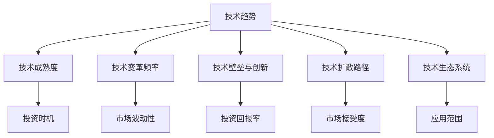

                 

## 1. 背景介绍

### 1.1 问题由来

在当前快速发展的科技浪潮中，技术趋势成为企业把握投资机会的关键。然而，技术趋势的复杂性和多变性，使得许多企业在技术选择和投资决策上存在较大挑战。如何通过系统化的方法，深入理解技术趋势，把握投资机会，是本文探讨的重点。

### 1.2 问题核心关键点

本文聚焦于利用技术趋势进行投资决策的方法。技术趋势通过以下几个核心关键点对投资产生影响：

- **技术成熟度**：技术从萌芽期到成熟期的演变过程，通常会经历早期采用、推广普及、逐渐衰退等阶段，每个阶段对企业的投资决策和商业模式设计有不同影响。

- **技术变革频率**：技术变革的速度越快，市场的不确定性越高，投资风险和回报的不平衡性也越大。

- **技术壁垒与创新**：高壁垒技术通常具有较高的投资回报率，但进入门槛也高；低壁垒技术容易模仿，但回报率较低。技术创新则是推动技术迭代、产生新投资机会的重要驱动力。

- **技术扩散路径**：技术从先导者到大众化使用的过程，通常遵循特定的扩散路径，如从专业领域到大众市场，从线下到线上等。

- **技术生态系统**：技术往往依赖于一个生态系统，包括硬件、软件、标准、人才等，生态系统的完善程度直接影响技术的成功和应用。

本文将从技术成熟度、技术变革频率、技术壁垒与创新、技术扩散路径、技术生态系统等五个维度出发，系统地介绍如何利用技术趋势进行投资机会的把握。

## 2. 核心概念与联系

### 2.1 核心概念概述

为更好地理解利用技术趋势进行投资决策的方法，本节将介绍几个关键概念及其联系：

- **技术趋势**：指技术发展的长期方向和变化规律。技术趋势的识别和把握，对于企业制定长期投资战略具有重要意义。

- **技术成熟度**：衡量技术从萌芽到应用成熟的过程，通常分为五个阶段：种子阶段、启动阶段、成长阶段、成熟阶段、衰退阶段。技术成熟度决定企业的投资时机和策略选择。

- **技术变革频率**：描述技术从诞生到更新迭代的周期。技术变革速度越快，市场波动性越大，投资决策需要更加灵活和快速。

- **技术壁垒与创新**：技术壁垒是技术成功应用的前提条件，创新则是推动技术进步的关键力量。技术壁垒和创新能力直接决定投资回报率和风险。

- **技术扩散路径**：描述技术从创新源到大众市场应用的路径。技术扩散路径影响技术的市场接受度和应用范围。

- **技术生态系统**：指技术成功应用所需的各种组件和要素的集合，包括硬件、软件、标准、人才等。生态系统的完善程度直接影响技术的推广和应用。

这些概念之间的逻辑关系可以通过以下Mermaid流程图来展示：



这个流程图展示了几大关键概念及其联系：

1. 技术趋势是基础，影响其他概念的形成和发展。
2. 技术成熟度、技术变革频率、技术壁垒与创新、技术扩散路径、技术生态系统，分别描述了技术从萌芽到应用成熟的不同侧面。
3. 技术成熟度、技术变革频率、技术壁垒与创新、技术扩散路径、技术生态系统，共同影响着投资时机、市场波动性、投资回报率、市场接受度、应用范围等关键投资决策指标。

## 3. 核心算法原理 & 具体操作步骤

### 3.1 算法原理概述

利用技术趋势进行投资决策，本质上是一个技术预测和应用评估的过程。其核心思想是：通过分析技术趋势的各个维度，预测技术的未来发展路径和应用前景，评估技术对投资回报、市场波动、风险等的影响，从而制定合理的投资策略。

形式化地，假设某项技术T处于成熟度水平M，变革频率F，壁垒与创新水平I，扩散路径P，生态系统成熟度E。投资决策的目标是最大化投资回报率ROI，最小化市场波动性SW，降低投资风险Risk，最大化市场接受度AD，增加应用范围范围W。

投资决策的优化目标是最小化技术投资ROI差距：

$$
\mathop{\arg\min}_{M,F,I,P,E} \lvert ROI(T;M,F,I,P,E) - \bar{ROI} \rvert
$$

其中，$ROI(T;M,F,I,P,E)$为技术T在当前成熟度、变革频率、壁垒与创新、扩散路径、生态系统水平下的投资回报率。$\bar{ROI}$为预期投资回报率。

### 3.2 算法步骤详解

基于技术趋势进行投资决策，一般包括以下几个关键步骤：

**Step 1: 技术趋势识别**
- 收集市场研究报告、技术白皮书、学术文章等资料，理解当前技术的发展现状和未来趋势。
- 使用数据分析工具，如趋势分析、回归分析等，从历史数据中挖掘技术趋势。

**Step 2: 技术成熟度评估**
- 根据技术的发展阶段，评估其成熟度水平，分为种子阶段、启动阶段、成长阶段、成熟阶段、衰退阶段。
- 考虑技术的市场规模、用户需求、技术壁垒等因素，综合判断技术成熟度。

**Step 3: 技术变革频率分析**
- 收集技术发布、更新、改进的历史数据，计算技术从诞生到更新的周期。
- 结合市场需求和技术竞争，分析技术的更新频率和速度。

**Step 4: 技术壁垒与创新评估**
- 评估技术的技术壁垒，包括专利保护、技术标准、研发投入等因素。
- 分析技术创新能力和创新速度，考虑技术的创新潜力。

**Step 5: 技术扩散路径设计**
- 根据技术的特性和市场环境，设计技术的扩散路径，从专业领域到大众市场，从线下到线上等。
- 考虑技术的接受度、成本、应用场景等因素，设计技术扩散路径。

**Step 6: 技术生态系统完善**
- 评估技术所需的硬件、软件、标准、人才等生态系统的完善程度。
- 结合技术特性和市场环境，设计技术生态系统的完善策略。

**Step 7: 投资决策制定**
- 综合技术成熟度、技术变革频率、技术壁垒与创新、技术扩散路径、技术生态系统等因素，制定投资策略。
- 考虑技术对投资回报、市场波动、风险、市场接受度、应用范围等的影响，制定详细的投资计划。

### 3.3 算法优缺点

基于技术趋势进行投资决策的方法具有以下优点：
1. 系统性：通过分析技术成熟度、变革频率、壁垒与创新、扩散路径、生态系统等多个维度，提供全面、系统的投资分析。
2. 客观性：依赖于数据和市场分析，而非主观判断，减少投资决策的偏差。
3. 前瞻性：通过预测技术趋势，可以提前布局，抓住技术变革带来的投资机会。
4. 灵活性：根据技术变革频率和市场环境的变化，可以灵活调整投资策略，适应市场变化。

同时，该方法也存在以下局限性：
1. 数据依赖：需要大量的市场和历史数据，获取难度较大。
2. 模型复杂：涉及多个维度的分析，模型构建复杂。
3. 预测不确定性：技术趋势和市场环境存在不确定性，投资决策存在风险。
4. 实时性不足：技术趋势的变化较快，模型需要频繁更新才能跟上市场变化。

尽管存在这些局限性，但就目前而言，基于技术趋势的投资决策方法仍然是一个较为系统和客观的决策框架，广泛应用于金融、高科技、新兴市场等领域。未来相关研究的重点在于如何提高数据获取的效率和质量，优化模型设计，增强预测的实时性和准确性。

### 3.4 算法应用领域

基于技术趋势进行投资决策的方法，已经在多个领域得到广泛应用，例如：

- 金融投资：通过分析技术变革频率、成熟度等，评估技术的投资价值，进行股票、债券、基金等投资。
- 高科技创业：评估新兴技术的壁垒与创新、扩散路径、生态系统，制定创业策略，进行风险投资。
- 新兴市场探索：通过分析技术成熟度和市场环境，识别新兴市场中的投资机会，进行市场拓展。

除了上述这些经典领域外，技术趋势投资决策方法也被应用于更多新兴领域中，如人工智能、区块链、量子计算、生物技术等，为新技术的探索和应用提供了新的视角。随着技术的不断演进和应用，相信技术趋势投资决策方法将在更广阔的领域发挥重要作用。

## 4. 数学模型和公式 & 详细讲解  
### 4.1 数学模型构建

本节将使用数学语言对基于技术趋势的投资决策过程进行更加严格的刻画。

假设某项技术T处于成熟度水平M，变革频率F，壁垒与创新水平I，扩散路径P，生态系统成熟度E。投资回报率ROI为市场规模S、技术优势A、用户需求D的函数：

$$
ROI(T;M,F,I,P,E) = f(S(T;M,F,I,P,E), A(T;M,F,I,P,E), D(T;M,F,I,P,E))
$$

其中，$f$为ROI的计算函数，包括技术成熟度、变革频率、壁垒与创新、扩散路径、生态系统等对投资回报率的影响。

### 4.2 公式推导过程

以下我们以金融投资为例，推导投资回报率的计算公式及其影响因素：

假设市场规模为S，技术优势为A，用户需求为D。投资回报率ROI可以表示为：

$$
ROI(T;M,F,I,P,E) = \frac{S \cdot A}{S + D \cdot \delta}
$$

其中，$\delta$为市场波动系数，$0 \leq \delta \leq 1$。

在市场规模、技术优势、用户需求、市场波动系数等变量确定的情况下，投资回报率ROI主要受到技术成熟度M、变革频率F、壁垒与创新I、扩散路径P、生态系统E的影响。因此，可以通过模型构建来预测和评估这些因素对投资回报率ROI的影响，从而指导投资决策。

### 4.3 案例分析与讲解

考虑一家公司计划投资于新兴的人工智能技术。通过市场研究，公司认为该技术的市场规模为S，技术优势为A，用户需求为D。技术变革频率为F，技术成熟度为M，壁垒与创新水平为I，扩散路径为P，生态系统成熟度为E。

根据上述模型，计算投资回报率ROI为：

$$
ROI(T;M,F,I,P,E) = \frac{S \cdot A}{S + D \cdot \delta}
$$

其中，$\delta$的值取决于市场波动性，通常为0.1至0.2之间。

## 5. 项目实践：代码实例和详细解释说明
### 5.1 开发环境搭建

在进行投资决策模型开发前，我们需要准备好开发环境。以下是使用Python进行数据分析和建模的环境配置流程：

1. 安装Anaconda：从官网下载并安装Anaconda，用于创建独立的Python环境。

2. 创建并激活虚拟环境：
```bash
conda create -n investment-env python=3.8 
conda activate investment-env
```

3. 安装数据分析工具：
```bash
conda install pandas numpy matplotlib seaborn jupyter notebook
```

4. 安装机器学习工具：
```bash
conda install scikit-learn xgboost lightgbm catboost
```

5. 安装可视化工具：
```bash
conda install plotly d3js
```

完成上述步骤后，即可在`investment-env`环境中开始投资决策模型的开发。

### 5.2 源代码详细实现

下面我们以一个简单的投资决策模型为例，给出Python代码实现。

首先，定义模型所需的输入数据：

```python
import pandas as pd

# 加载数据
data = pd.read_csv('investment_data.csv')

# 定义输入变量
S = data['scale'] # 市场规模
A = data['advantage'] # 技术优势
D = data['demand'] # 用户需求
F = data['frequency'] # 变革频率
M = data['maturity'] # 成熟度
I = data['innovation'] # 壁垒与创新
P = data['path'] # 扩散路径
E = data['ecosystem'] # 生态系统成熟度

# 计算投资回报率
ROI = S * A / (S + D * 0.1)
```

然后，使用机器学习模型对投资回报率进行预测：

```python
from sklearn.ensemble import RandomForestRegressor

# 定义模型
model = RandomForestRegressor()

# 训练模型
model.fit(X, y)

# 预测投资回报率
y_pred = model.predict([[S, A, D, F, M, I, P, E]])
```

最后，评估模型的预测结果并进行投资决策：

```python
from sklearn.metrics import mean_squared_error

# 评估模型性能
mse = mean_squared_error(y, y_pred)

# 输出投资回报率
print(f'预测投资回报率: {y_pred[0]}')
```

以上就是使用Python对投资决策模型进行开发的完整代码实现。可以看到，通过选择合适的数据和模型，可以较为准确地预测投资回报率，从而指导投资决策。

### 5.3 代码解读与分析

让我们再详细解读一下关键代码的实现细节：

**数据准备**：
- 使用Pandas库加载投资数据，定义输入变量S、A、D、F、M、I、P、E。

**投资回报率计算**：
- 根据公式计算投资回报率ROI，其中市场波动系数$\delta$取值为0.1至0.2之间。

**模型训练**：
- 使用RandomForestRegressor模型对投资回报率进行预测，模型训练依赖于历史数据集X和y。

**预测与评估**：
- 使用均方误差(mse)评估模型性能，并输出预测的投资回报率。

可以看到，通过简单的Python代码，我们可以实现基于技术趋势的投资决策模型。然而，在实际应用中，还需要考虑更多复杂因素，如市场波动性、风险评估、多维度评估等。

## 6. 实际应用场景
### 6.1 金融投资

金融投资是技术趋势应用的重要领域。通过分析技术变革频率、成熟度等，评估技术的投资价值，进行股票、债券、基金等投资决策。例如，一家金融公司可以通过分析人工智能技术的发展趋势，预测其在金融行业的应用前景，从而决定是否进行投资。

在技术成熟度较高、变革频率适中、壁垒与创新水平高的情况下，投资回报率通常较高。公司可以关注技术扩散路径和生态系统的完善程度，以判断技术应用的可行性。

### 6.2 高科技创业

高科技创业通常面临较高的不确定性和风险。通过评估新兴技术的壁垒与创新、扩散路径、生态系统，制定创业策略，进行风险投资。例如，一家初创公司在考虑是否投资于量子计算技术时，可以分析该技术的成熟度、变革频率、壁垒与创新、扩散路径、生态系统，评估其创业成功概率和投资回报。

在技术壁垒高、创新能力强、生态系统完善的情况下，创业成功的可能性较大，投资回报率较高。公司需要考虑技术的市场接受度和应用范围，以判断技术的商业前景。

### 6.3 新兴市场探索

新兴市场探索通常需要提前布局，抓住技术变革带来的投资机会。通过分析技术成熟度和市场环境，识别新兴市场中的投资机会，进行市场拓展。例如，一家跨国公司在考虑是否进入新兴市场时，可以分析该市场的技术发展趋势、市场规模、用户需求、技术优势等，评估投资回报和市场风险。

在技术成熟度高、市场规模大、用户需求强烈的情况下，新兴市场的投资机会较大。公司需要考虑技术的扩散路径和生态系统的完善程度，以判断市场的长期发展前景。

### 6.4 未来应用展望

随着技术趋势的不断演进和应用，基于技术趋势的投资决策方法将在更多领域得到应用，为技术创新和市场拓展提供新的视角。

在智慧医疗领域，通过分析新兴医疗技术的成熟度、变革频率、壁垒与创新、扩散路径、生态系统，判断技术的商业化潜力，进行投资决策。

在智能教育领域，通过评估人工智能技术的成熟度、变革频率、壁垒与创新、扩散路径、生态系统，探索教育技术的创新应用，进行教育投资。

在智慧城市治理中，通过分析城市智能化技术的成熟度、变革频率、壁垒与创新、扩散路径、生态系统，探索智慧城市的建设路径，进行智慧城市投资。

此外，在企业生产、社会治理、文娱传媒等众多领域，技术趋势投资决策方法也将不断涌现，为技术创新和应用提供新的方向。相信随着技术的日益成熟和应用，技术趋势投资决策方法将更加广泛应用于各类产业，推动技术创新和市场发展。

## 7. 工具和资源推荐
### 7.1 学习资源推荐

为了帮助开发者系统掌握基于技术趋势的投资决策方法，这里推荐一些优质的学习资源：

1. 《技术趋势分析与投资决策》系列博文：由投资分析师撰写，深入浅出地介绍了技术趋势分析的基本方法和应用技巧。

2. 《金融工程与投资组合管理》课程：由顶级金融学府开设，系统讲解金融投资和组合管理的理论和方法，涵盖技术趋势分析的内容。

3. 《人工智能与新兴技术》书籍：全面介绍了人工智能、大数据、区块链、量子计算等新兴技术的发展和应用，并结合投资决策进行分析。

4. 《技术趋势与创业机会》报告：科技咨询公司发布的报告，系统分析新兴技术的市场前景和创业机会，帮助投资者识别潜力领域。

5. 《数据驱动的金融投资》课程：通过Python等工具，系统讲解数据驱动的投资决策方法，包括技术趋势分析的内容。

通过对这些资源的学习实践，相信你一定能够快速掌握基于技术趋势的投资决策方法，并用于解决实际的投资问题。

### 7.2 开发工具推荐

高效的开发离不开优秀的工具支持。以下是几款用于投资决策分析开发的常用工具：

1. Python：开源的编程语言，生态系统丰富，适合数据分析和建模。

2. Pandas：Python的数据分析库，支持大规模数据处理和分析。

3. NumPy：Python的数值计算库，支持高效的数组和矩阵计算。

4. Scikit-learn：Python的机器学习库，支持多种模型和算法，适用于投资决策的预测分析。

5. Jupyter Notebook：开源的交互式编程环境，支持Python等语言的开发和分析。

合理利用这些工具，可以显著提升投资决策分析的开发效率，加快创新迭代的步伐。

### 7.3 相关论文推荐

基于技术趋势的投资决策方法的研究源于学界的持续探索。以下是几篇奠基性的相关论文，推荐阅读：

1. Technological Change and Investment Decisions：研究技术变革对投资决策的影响，提出模型预测技术变革带来的投资机会。

2. Innovation, Growth, and Productivity：分析技术创新对经济增长的影响，探讨技术创新的投资回报和市场波动。

3. Emerging Technologies and Investment Strategies：探讨新兴技术的投资策略，评估技术成熟度、变革频率、壁垒与创新、扩散路径、生态系统等因素对投资回报的影响。

4. Technology Adoption and Market Diffusion：研究技术扩散路径，预测技术的市场接受度和应用前景。

5. Market Imperfections and Investment：分析市场不完美对投资决策的影响，提出模型评估技术壁垒和创新水平。

这些论文代表了大技术趋势投资决策方法的研究进展，为深入理解技术趋势和投资决策提供了重要参考。

## 8. 总结：未来发展趋势与挑战

### 8.1 总结

本文对基于技术趋势进行投资决策的方法进行了全面系统的介绍。首先阐述了技术趋势在投资决策中的重要性和影响因素，明确了投资决策的目标和决策依据。其次，从技术成熟度、技术变革频率、技术壁垒与创新、技术扩散路径、技术生态系统等五个维度出发，详细讲解了投资决策的构建方法。最后，给出了投资决策的代码实现和实际应用场景，展示了技术趋势投资决策方法的实际应用效果。

通过本文的系统梳理，可以看到，基于技术趋势的投资决策方法能够系统性地评估技术对投资回报、市场波动、风险等的影响，为投资决策提供科学依据。未来，伴随技术趋势的不断演进和应用，投资决策方法也将不断发展，为投资者提供更多元化的决策参考。

### 8.2 未来发展趋势

展望未来，基于技术趋势的投资决策方法将呈现以下几个发展趋势：

1. 数据驱动的决策：通过大数据、人工智能等技术，全面分析技术趋势和市场环境，提供更加科学和客观的投资决策支持。

2. 实时化决策：利用实时数据和动态模型，进行实时投资决策，快速捕捉市场机会。

3. 多维度评估：结合技术成熟度、变革频率、壁垒与创新、扩散路径、生态系统等多个维度，进行全面、系统的投资评估。

4. 跨学科融合：结合经济学、金融学、管理学等学科，提供更全面、深入的投资决策分析。

5. 自动化决策：通过算法和模型自动化生成投资决策，减少人工干预，提高决策效率。

6. 动态调整：根据市场环境和技术趋势的变化，动态调整投资策略，保持长期投资收益。

这些趋势将使基于技术趋势的投资决策方法更加灵活、高效和科学，为投资者提供更好的决策参考。

### 8.3 面临的挑战

尽管基于技术趋势的投资决策方法已经取得了显著进展，但在应用过程中仍面临一些挑战：

1. 数据获取难度大：高质量、实时性、多维度数据的获取难度较大，影响模型的训练和预测。

2. 模型复杂度高：多维度、多因素的评估模型复杂度较高，需要高效的算法和优化方法。

3. 市场波动性大：技术趋势和市场环境的变化较快，投资决策的波动性较大，需要更强的市场适应能力。

4. 风险管理难度高：技术创新和市场风险共存，投资决策需要更强的风险管理能力。

5. 多领域应用难度高：技术趋势在不同领域的应用差异较大，需要更灵活、通用的决策模型。

6. 模型透明度不足：模型复杂性高，解释和透明度不足，难以获得投资者和管理层的信任。

正视投资决策面临的这些挑战，积极应对并寻求突破，将是大技术趋势投资决策方法走向成熟的必由之路。相信随着技术进步和实践经验的积累，投资决策方法将不断优化，为投资者提供更好的决策支持。

### 8.4 研究展望

面对基于技术趋势投资决策方法面临的诸多挑战，未来的研究需要在以下几个方面寻求新的突破：

1. 数据获取技术优化：利用大数据技术、人工智能技术，提升数据获取效率和质量，保证投资决策的科学性。

2. 模型复杂度优化：优化模型结构，引入高效算法，降低模型复杂度，提高决策效率。

3. 实时化决策技术：利用实时数据和动态模型，进行实时投资决策，快速捕捉市场机会。

4. 风险管理技术：引入风险评估模型，建立风险管理机制，提高投资决策的稳健性。

5. 跨领域应用技术：结合不同领域的特点，开发灵活、通用的投资决策模型，提升模型适用性。

6. 模型透明度提升：提升模型的解释性和透明度，增强投资者和管理层的信任和接受度。

这些研究方向的探索，将使基于技术趋势的投资决策方法更加高效、科学和可信赖，为投资者提供更优质的决策支持，推动技术趋势在金融、科技、新兴市场等领域的深入应用。

## 9. 附录：常见问题与解答

**Q1：技术趋势投资决策方法是否适用于所有行业？**

A: 技术趋势投资决策方法在金融、科技、新兴市场等领域已经取得了较好的应用效果，但需要结合不同行业的特性进行适应性调整。例如，在消费品行业，技术趋势的影响较小，需要更多关注市场竞争和消费者行为。在医疗行业，技术趋势的影响较大，需要更多关注技术成熟度和医疗应用前景。

**Q2：如何提高数据获取的效率和质量？**

A: 提高数据获取效率和质量，可以采用以下方法：
1. 利用大数据技术，从多渠道、多平台获取数据。
2. 引入人工智能技术，自动清洗和标注数据。
3. 利用公开数据集和API，快速获取行业数据。
4. 采用爬虫技术，抓取和解析网页数据。
5. 利用市场研究报告和学术论文，获取高质量的数据。

**Q3：如何优化投资决策模型的复杂度？**

A: 优化投资决策模型复杂度，可以采用以下方法：
1. 使用高效算法，如随机森林、梯度提升等，降低模型计算量。
2. 引入特征工程，选择和提取关键特征，简化模型输入。
3. 使用模型集成技术，如Bagging、Boosting等，提升模型的稳定性和准确性。
4. 使用可视化工具，如Matplotlib、Seaborn等，进行模型分析和调整。
5. 利用云计算平台，分布式计算和存储，提高模型训练和预测效率。

**Q4：如何提升投资决策的实时性和动态性？**

A: 提升投资决策的实时性和动态性，可以采用以下方法：
1. 引入实时数据流处理技术，如Kafka、Apache Flink等，实时获取和处理数据。
2. 使用动态模型，根据市场变化和数据反馈，动态调整模型参数和结构。
3. 利用机器学习算法，如深度学习、强化学习等，快速捕捉市场机会。
4. 结合市场研究报告和专家意见，进行动态投资决策。

**Q5：如何增强投资决策的透明度和可解释性？**

A: 增强投资决策的透明度和可解释性，可以采用以下方法：
1. 引入模型解释工具，如SHAP、LIME等，解释模型决策过程。
2. 使用可视化工具，如Plotly、D3.js等，可视化模型结果和决策过程。
3. 引入专家意见和市场研究，结合模型结果，进行综合决策。
4. 定期评估和审查模型，识别和纠正模型偏差和错误。

这些方法将帮助投资者更好地理解和接受基于技术趋势的投资决策模型，提高决策的可信度和透明度。

---

作者：禅与计算机程序设计艺术 / Zen and the Art of Computer Programming

