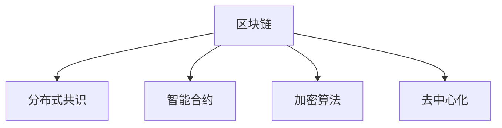

                 

# 区块链管理：探索分布式技术的商业应用

> 关键词：区块链，分布式技术，商业应用，加密算法，智能合约，共识机制，共识算法，交易验证，数字资产，隐私保护，数据安全，可扩展性，去中心化

## 1. 背景介绍

### 1.1 问题由来
随着数字经济的发展，数字化转型已成为各行各业的共同需求。然而，传统互联网架构存在诸多问题，如数据孤岛、中心化风险、数据隐私泄露等。区块链技术以其去中心化、透明可验证、不可篡改等特性，成为解决这些问题的新方向。

区块链是一种基于分布式账本技术的共识协议，通过构建一个去中心化的网络，使得多方能够在无需信任第三方的情况下，达成一致的账本记录。这种技术不仅可用于数字货币（如比特币），更适用于各类数据和业务场景，如供应链管理、金融交易、数字身份认证等。

### 1.2 问题核心关键点
区块链技术的核心在于其分布式共识机制。通过一种机制，使得网络中的参与者（通常称为“节点”）达成一致的账本记录，同时保持数据的安全性和不可篡改性。

- **共识机制**：指在分布式网络中，如何达成一致的账本记录。常见的共识机制有PoW（工作量证明）、PoS（权益证明）、DPoS（委托权益证明）等。
- **加密算法**：用于保护数据传输和存储的安全性，如非对称加密、哈希函数、数字签名等。
- **智能合约**：一种自动化的合约，运行于区块链上，当满足特定条件时自动执行。
- **分布式账本**：一种去中心化的账本技术，参与者通过共识协议共同维护，保证数据的透明性和不可篡改性。

### 1.3 问题研究意义
探索区块链技术在商业应用中的管理方式，对于推动数字化转型、提升业务效率、保障数据安全具有重要意义。通过区块链，企业可以实现数据共享、降低信任成本、提升业务透明度，从而在激烈的市场竞争中获得优势。

## 2. 核心概念与联系

### 2.1 核心概念概述

为了更好地理解区块链技术的商业应用，本节将介绍几个密切相关的核心概念：

- **区块链**：一种去中心化的分布式账本技术，通过共识机制保证数据的不可篡改性和透明性。
- **分布式共识**：指在分布式网络中，节点如何达成一致的账本记录。
- **智能合约**：一种自动化合约，运行于区块链上，当满足特定条件时自动执行。
- **加密算法**：用于保护数据传输和存储的安全性。
- **去中心化**：指不依赖于单一的中心化权威机构，通过分布式网络实现数据共享和协同管理。

这些核心概念之间的逻辑关系可以通过以下Mermaid流程图来展示：



这个流程图展示了大语言模型的核心概念及其之间的关系：

1. 区块链通过分布式共识机制达成一致的账本记录。
2. 智能合约在区块链上运行，当满足特定条件时自动执行。
3. 加密算法用于保护数据传输和存储的安全性。
4. 区块链通过去中心化技术实现数据共享和协同管理。

这些概念共同构成了区块链技术的核心框架，使其能够在商业场景中发挥强大的去中心化管理和数据安全保障能力。

## 3. 核心算法原理 & 具体操作步骤
### 3.1 算法原理概述

区块链的核心算法原理主要包括以下几个方面：

- **分布式共识算法**：通过设计合适的共识协议，使得网络中的节点能够达成一致的账本记录，同时保证数据的安全性和不可篡改性。
- **加密算法**：用于保护数据传输和存储的安全性，包括哈希函数、非对称加密、数字签名等。
- **智能合约**：通过编程方式，定义合约规则和执行条件，当满足特定条件时自动执行。

### 3.2 算法步骤详解

以下我们以比特币的共识算法（PoW）为例，详细介绍区块链的运行机制：

1. **区块构建**：参与者通过矿机验证交易，并将验证后的交易打包成区块。每个区块包含前一区块的哈希值和当前区块的交易记录。
2. **矿机计算**：矿机通过计算复杂的哈希函数，寻找满足条件的哈希值。这个过程称为“挖矿”，矿机将得到一定数量的比特币奖励。
3. **共识验证**：网络中的节点通过验证新的区块是否符合共识规则，决定是否接受该区块。一旦网络中的多数节点同意，该区块将被加入到区块链中。
4. **区块链连**：每个新区块包含前一区块的哈希值，从而形成一条不可篡改的链式结构。

### 3.3 算法优缺点

区块链技术在商业应用中具有以下优点：

- **去中心化**：不需要依赖单一的中心化机构，提升数据的安全性和可靠性。
- **透明性**：所有交易记录公开透明，可以追溯历史数据。
- **不可篡改**：通过哈希函数和共识协议，保证数据的不可篡改性。
- **智能合约**：自动执行合约规则，提高业务效率和安全性。

同时，该技术也存在一定的局限性：

- **性能瓶颈**：由于需要全网络共识，处理交易速度较慢。
- **存储成本**：所有交易记录需要存储在分布式网络中，占用大量存储空间。
- **能耗问题**：如PoW算法，需要大量的计算资源，能源消耗较大。
- **复杂性高**：设计和维护区块链系统需要较高的技术门槛。

尽管存在这些局限性，但就目前而言，区块链技术以其独特的优势在商业应用中得到了广泛的应用。未来相关研究的重点在于如何进一步降低存储和计算成本，提高系统的可扩展性和效率，同时兼顾数据安全性和隐私保护等因素。

### 3.4 算法应用领域

区块链技术在商业应用中已经得到了广泛的应用，覆盖了多个领域，例如：

- **金融领域**：用于数字货币发行、支付结算、资产托管等。比特币和以太坊等数字货币的成功应用，奠定了区块链在金融领域的基础。
- **供应链管理**：用于追踪产品从生产到交付的每一个环节，提高供应链的透明度和可追溯性。
- **数字身份认证**：通过区块链技术，实现数字身份的创建、验证和管理，提升身份认证的安全性和便捷性。
- **版权保护**：用于版权的登记、认证和分发，保护知识产权。
- **医疗健康**：用于医疗数据共享和溯源，保障患者隐私和数据安全。

除了上述这些经典应用外，区块链技术还被创新性地应用到更多场景中，如去中心化社交网络、去中心化金融(DeFi)、去中心化存储等，为各类数据和业务场景提供了新的解决方案。随着区块链技术的不断演进，相信其将在更广阔的应用领域发挥更大的作用。

## 4. 数学模型和公式 & 详细讲解
### 4.1 数学模型构建

本节将使用数学语言对区块链技术的核心算法原理进行更加严格的刻画。

记区块链系统中的区块为 $B_k$，其中 $k$ 为区块编号，每个区块包含的交易记录为 $T_k$。区块链系统的目标是通过共识机制，使得网络中的节点达成一致的区块记录。

定义共识规则为 $C_k$，即在区块 $B_k$ 满足条件 $C_k$ 的情况下，网络中的多数节点同意将其加入到区块链中。

## 5. 项目实践：代码实例和详细解释说明
### 5.1 开发环境搭建

在进行区块链项目开发前，我们需要准备好开发环境。以下是使用Python进行Hyperledger Fabric开发的环境配置流程：

1. 安装Anaconda：从官网下载并安装Anaconda，用于创建独立的Python环境。

2. 创建并激活虚拟环境：
```bash
conda create -n fabric-env python=3.8 
conda activate fabric-env
```

3. 安装Hyperledger Fabric：从官网获取对应的安装命令。例如：
```bash
conda install hyperledger-fabric -c conda-forge
```

4. 安装各类工具包：
```bash
pip install numpy pandas scikit-learn matplotlib tqdm jupyter notebook ipython
```

完成上述步骤后，即可在`fabric-env`环境中开始区块链项目开发。

### 5.2 源代码详细实现

这里我们以Hyperledger Fabric开发为例，提供一个基于智能合约的区块链应用代码实现。

首先，定义智能合约的基本结构：

```python
import sys
from shapelib.shapelib import SHAPE
from shapelib.compiler import compile_lib

@compile_lib
class MyContract(SHAPE):
    def __init__(self):
        self.acl = 'myorg1-admin-msp-peer0'

    @SHAPE.function(decorators=['Public'])
    def Hello(self):
        return 'Hello from Python Smart Contract!'

    @SHAPE.function(decorators=['Permissioned'])
    def Change(self, new_name):
        self.new_name = new_name
        return 'Name changed to {}'.format(new_name)
```

然后，定义区块链网络的基本结构：

```python
from hyperledger.fabric.gateway import Gateway
from hyperledger.fabric.exceptions import *
from hyperledger.fabric.gateway.discovery import GatewayDiscoveryService
from hyperledger.fabric.gateway.constant import GatewayCreationOptions

def create_gateway():
    gateway = Gateway(
        GatewayDiscoveryService(
            GatewayCreationOptions(
                discovery_service_endpoints='localhost:7051',
                gateway_id='my-gateway',
                client_id='client-org1',
                name='peer0.org1.com'
            )
        )
    return gateway

def register_user(gateway):
    gateway.set_user_id('user1@org1.com', 'password')
    gateway.get_user('user1@org1.com')
    gateway.set_user('user1@org1.com', gateway.get_user('user1@org1.com').get_private_key())
```

最后，启动区块链网络并运行智能合约：

```python
gateway = create_gateway()
register_user(gateway)

my_contract = gateway.get_contracts('peer0.org1.com')[0]
my_contract.set_key('new_name', 'John Doe')
result = my_contract.call('Hello', {})

print(result)
```

以上就是使用Hyperledger Fabric开发基于智能合约的区块链应用的完整代码实现。可以看到，Hyperledger Fabric提供了强大的开发接口，开发者可以快速搭建区块链网络，部署智能合约，并对其进行操作。

### 5.3 代码解读与分析

让我们再详细解读一下关键代码的实现细节：

**MyContract类**：
- `__init__`方法：初始化智能合约，定义权限控制列表。
- `Hello`方法：公开函数，任何人都可以调用，返回欢迎信息。
- `Change`方法：受权限控制，只有特定用户才能调用，用于修改智能合约的状态。

**Gateway类**：
- `create_gateway`方法：创建Hyperledger Fabric的Gateway对象，指定网络节点和服务端点。
- `register_user`方法：注册用户，设置用户密码和私钥。

**启动区块链网络**：
- `gateway = create_gateway()`：创建一个Gateway对象，指定网络节点和服务端点。
- `register_user(gateway)`：注册用户，设置用户密码和私钥。
- `my_contract = gateway.get_contracts('peer0.org1.com')[0]`：获取网络中的智能合约。
- `my_contract.set_key('new_name', 'John Doe')`：设置智能合约的参数。
- `result = my_contract.call('Hello', {})`：调用智能合约的公开函数。

可以看到，Hyperledger Fabric提供了便捷的开发接口，使得开发者可以轻松地搭建和管理区块链网络，部署和调用智能合约。

当然，工业级的系统实现还需考虑更多因素，如共识协议、网络扩展、性能优化等。但核心的区块链开发流程基本与此类似。

## 6. 实际应用场景
### 6.1 供应链管理

区块链技术在供应链管理中的应用，可以实现供应链的透明化和可追溯性。传统供应链管理依赖于中心化的信息管理系统，数据存储分散、难以追踪，增加了管理成本和风险。而使用区块链技术，可以实现供应链各环节的数据透明共享，提升供应链的效率和安全性。

在技术实现上，供应链各参与方可以在区块链上建立智能合约，记录供应链的关键数据，如商品批次、运输记录、质量检测结果等。任何供应链环节的变更都需要通过智能合约的审批和验证，确保数据的真实性和完整性。一旦数据上链，任何改动都会被记录下来，所有参与方都可以实时查看，保障供应链的透明度和可追溯性。

### 6.2 数字身份认证

区块链技术在数字身份认证中的应用，可以实现身份信息的透明共享和隐私保护。传统身份认证系统依赖中心化的身份数据库，数据存储和访问存在安全隐患。而使用区块链技术，可以实现身份信息的分布式存储和加密保护，提升身份认证的安全性和隐私性。

在技术实现上，个人身份信息可以上链，并通过智能合约实现身份验证和授权。任何身份验证请求都需要通过智能合约的审批和验证，确保身份的真实性和合法性。同时，区块链上的身份信息只对授权用户可见，保障了用户的隐私安全。

### 6.3 版权保护

区块链技术在版权保护中的应用，可以实现版权信息的透明共享和不可篡改性。传统版权保护依赖中心化的版权登记系统，数据存储和验证存在安全隐患。而使用区块链技术，可以实现版权信息的分布式存储和加密保护，提升版权保护的可靠性和透明性。

在技术实现上，版权信息可以上链，并通过智能合约实现版权登记和授权。任何版权变更都需要通过智能合约的审批和验证，确保版权的真实性和合法性。同时，区块链上的版权信息不可篡改，任何人都可以实时查看，保障了版权信息的透明性和不可篡改性。

### 6.4 未来应用展望

随着区块链技术的不断演进，其在商业应用中的前景广阔，未来可能会应用于更多领域：

- **智能合约平台**：类似于Ethereum等去中心化合约平台，提供更高效、更安全的智能合约执行环境。
- **去中心化金融(DeFi)**：基于区块链的金融应用，实现去中心化的贷款、投资、保险等金融服务。
- **去中心化存储**：通过区块链技术实现去中心化的数据存储和共享，如Filecoin等项目。
- **数字资产交易**：基于区块链的数字资产交易平台，如NFT（非同质化代币）等。
- **去中心化社交网络**：通过区块链技术实现去中心化的社交网络应用，保障用户隐私和数据安全。

这些未来应用将进一步拓展区块链技术的商业应用场景，推动数字经济的发展。

## 7. 工具和资源推荐
### 7.1 学习资源推荐

为了帮助开发者系统掌握区块链技术的基本概念和应用方法，这里推荐一些优质的学习资源：

1. Hyperledger Fabric官方文档：Hyperledger Fabric的官方文档，提供了详尽的技术指南和API文档，是入门区块链开发的必备资料。

2. 《区块链原理与技术》书籍：深度介绍区块链技术的原理和应用，适合初学者和高级开发者阅读。

3. 《Mastering Blockchain with Python》书籍：介绍如何使用Python进行区块链开发，适合Python开发者阅读。

4. 《Blockchain for Finance》课程：由Coursera开设的区块链金融应用课程，深入讲解区块链在金融领域的应用案例。

5. 《Blockchain Basics》课程：由Udacity开设的区块链基础课程，适合新手入门区块链技术。

通过对这些资源的学习实践，相信你一定能够快速掌握区块链技术的精髓，并用于解决实际的商业问题。
###  7.2 开发工具推荐

高效的开发离不开优秀的工具支持。以下是几款用于区块链项目开发的常用工具：

1. Hyperledger Fabric：Hyperledger Fabric是Hyperledger联盟下的开源区块链平台，支持分布式账本和智能合约开发。

2. Ethereum：Ethereum是目前应用最广泛的区块链平台，支持智能合约和去中心化应用（DApps）开发。

3. IPFS：InterPlanetary File System，一种去中心化的分布式文件存储系统，支持大规模数据存储和共享。

4. Trusted钱包：一款支持多种区块链平台的去中心化钱包，方便用户管理和操作数字资产。

5. MetaMask：一款基于Web3.0的去中心化钱包，支持Ethereum和其他区块链平台。

6. Truffle开发套件：一款用于以太坊智能合约开发的IDE，集成了测试网络和部署工具。

合理利用这些工具，可以显著提升区块链项目的开发效率，加速创新迭代的步伐。

### 7.3 相关论文推荐

区块链技术在学术界和工业界的发展，源于学界的持续研究。以下是几篇奠基性的相关论文，推荐阅读：

1. Bitcoin: A Peer-to-Peer Electronic Cash System：中本聪（Satoshi Nakamoto）发表的比特币白皮书，首次提出了区块链技术。

2. Consensus in the Bitcoin Network：中本聪发表的比特币共识机制研究论文，详细解释了比特币的共识算法。

3. Smart Contracts: Towards Solid-State Smart Contracts：以太坊创始人Vitalik Buterin发表的智能合约技术白皮书，提出了以太坊的智能合约平台。

4. Practical Byzantine Fault Tolerance：以太坊共识算法研究论文，详细解释了以太坊的共识算法。

5. Hyperledger Fabric: Architecture Overview and key Modules：Hyperledger Fabric架构白皮书，详细介绍了Hyperledger Fabric的架构和关键模块。

这些论文代表了大语言模型微调技术的发展脉络。通过学习这些前沿成果，可以帮助研究者把握学科前进方向，激发更多的创新灵感。

## 8. 总结：未来发展趋势与挑战
### 8.1 总结

本文对区块链技术的核心算法原理和实际应用进行了全面系统的介绍。首先阐述了区块链技术的背景和核心概念，明确了其在商业场景中的应用价值。其次，从原理到实践，详细讲解了区块链的数学模型和具体实现方法，给出了区块链项目开发的完整代码实例。同时，本文还广泛探讨了区块链技术在供应链管理、数字身份认证、版权保护等多个领域的实际应用，展示了区块链技术的广泛应用前景。

通过本文的系统梳理，可以看到，区块链技术在去中心化管理、数据安全和隐私保护等方面具有显著优势，已经成为推动数字化转型的重要工具。未来，伴随区块链技术的持续演进，其在商业应用中必将发挥更大的作用，为数字经济的发展注入新的动力。

### 8.2 未来发展趋势

展望未来，区块链技术在商业应用中可能会呈现以下几个发展趋势：

1. **可扩展性提升**：通过优化共识协议、引入分层架构等技术，提升区块链系统的可扩展性，支持更多用户和交易。
2. **跨链互操作**：实现不同区块链平台之间的互操作，提升区块链的通用性和灵活性。
3. **智能合约平台优化**：改进智能合约的执行机制和安全性，提升合约的可扩展性和性能。
4. **去中心化金融(DeFi)生态发展**：DeFi应用逐步成熟，形成完整的去中心化金融生态系统。
5. **去中心化存储普及**：IPFS等去中心化存储技术逐步普及，解决数据存储和共享问题。
6. **隐私保护技术进步**：引入隐私保护技术，如零知识证明、同态加密等，提升区块链的安全性和隐私性。

这些趋势凸显了区块链技术在商业应用中的广阔前景。这些方向的探索发展，必将进一步提升区块链系统的性能和应用范围，为数字经济的发展注入新的动力。

### 8.3 面临的挑战

尽管区块链技术在商业应用中已经取得了显著成果，但在迈向更加智能化、普适化应用的过程中，仍面临诸多挑战：

1. **性能瓶颈**：由于需要全网络共识，处理交易速度较慢，需要进一步优化共识算法和网络结构。
2. **存储成本高**：所有交易记录需要存储在分布式网络中，占用大量存储空间，需要优化数据压缩和存储技术。
3. **能耗问题**：如PoW算法，需要大量的计算资源，能源消耗较大，需要研究更高效的共识算法。
4. **技术门槛高**：区块链系统的设计和维护需要较高的技术门槛，需要更多专业人才参与。
5. **法律和合规问题**：区块链技术的应用涉及诸多法律和合规问题，需要制定相应的政策和规范。
6. **用户接受度低**：区块链技术在实际应用中存在较高的用户接受度门槛，需要更多的教育和推广。

正视区块链面临的这些挑战，积极应对并寻求突破，将是大规模区块链应用落地必不可少的步骤。相信随着学界和产业界的共同努力，这些挑战终将一一被克服，区块链技术必将在构建去中心化、安全和透明的网络中发挥更大的作用。

### 8.4 研究展望

未来，区块链技术的深入研究可能集中在以下几个方向：

1. **分布式共识协议优化**：研究更高效的共识协议，提升区块链系统的可扩展性和性能。
2. **隐私保护技术创新**：引入更多的隐私保护技术，提升区块链系统的安全性和隐私性。
3. **跨链互操作机制**：研究跨链互操作机制，实现不同区块链平台之间的数据共享和协同。
4. **智能合约语言和平台**：开发更加高效、灵活的智能合约语言和平台，支持更多的商业应用。
5. **去中心化基础设施建设**：建设去中心化的基础设施，如去中心化存储、去中心化交易等，为区块链应用提供更强的支持。

这些研究方向将引领区块链技术迈向新的高度，为构建去中心化、安全和透明的网络提供更强的技术支持。面向未来，区块链技术还需要与其他人工智能技术进行更深入的融合，如区块链+物联网、区块链+大数据等，多路径协同发力，共同推动数字经济的发展。只有勇于创新、敢于突破，才能不断拓展区块链技术的边界，让去中心化技术更好地造福人类社会。

## 9. 附录：常见问题与解答

**Q1：区块链技术是否只适用于数字货币？**

A: 区块链技术最初是应用于数字货币的，但其核心特性使其适用于更多领域。除了数字货币，区块链技术还可以用于供应链管理、数字身份认证、版权保护等。

**Q2：区块链技术如何实现去中心化？**

A: 区块链技术通过分布式账本和共识机制实现去中心化。每个节点都可以参与账本记录，网络中的多数节点通过共识协议达成一致的账本记录，从而实现去中心化。

**Q3：区块链技术在实际应用中面临哪些挑战？**

A: 区块链技术在实际应用中面临诸多挑战，包括性能瓶颈、存储成本高、能耗问题、技术门槛高等。这些挑战需要从共识协议、网络结构、隐私保护等方面进行综合优化，才能实现大规模的区块链应用。

**Q4：区块链技术的未来应用前景如何？**

A: 区块链技术的未来应用前景广阔，可能应用于更多领域，如智能合约平台、去中心化金融(DeFi)、去中心化存储等。未来，区块链技术将成为推动数字经济发展的重要工具。

**Q5：如何选择合适的区块链平台？**

A: 选择合适的区块链平台需要考虑多个因素，如应用场景、性能需求、技术门槛等。Hyperledger Fabric、Ethereum等主流平台都有各自的特点和优势，需要根据具体应用场景进行选择。

以上是区块链技术在商业应用中的管理方式和未来展望，希望能为你提供有价值的参考和指导。

---

作者：禅与计算机程序设计艺术 / Zen and the Art of Computer Programming

