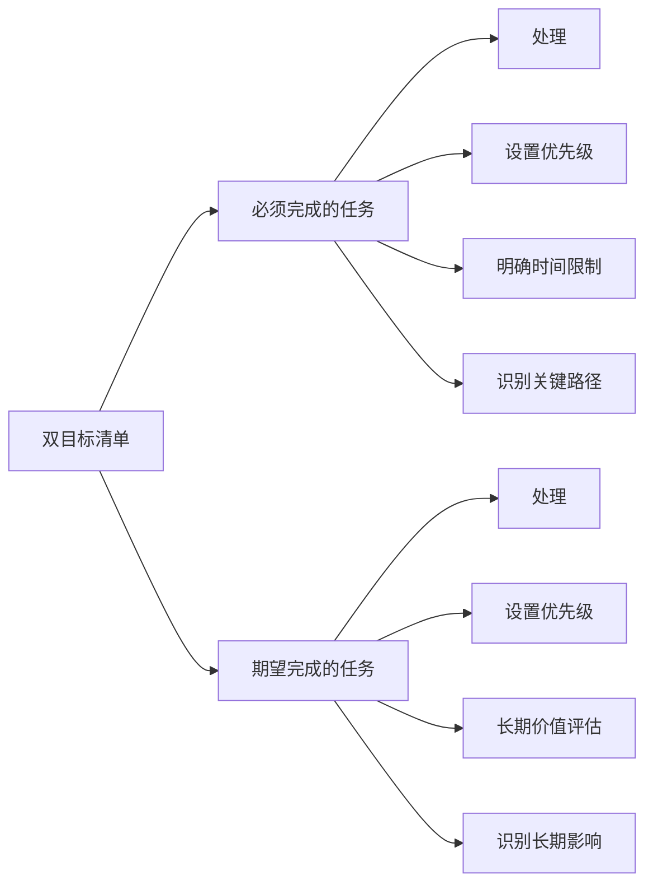

                 

# 双目标清单:聚焦要事的法宝

> 关键词：双目标清单,任务管理,优先级,时间管理,聚焦要事

## 1. 背景介绍

在当今快速变化的商业环境中，企业需要不断适应市场需求，优化运营流程，提高效率，提升竞争力。然而，面对日益增多的任务和挑战，如何高效地管理时间，优先处理最重要的事务，成为了企业管理的难点。对于个人而言，面对海量的信息流，如何筛选出重要的任务，实现个人成长和工作平衡，同样是一个需要不断探索的问题。

### 1.1 问题由来

在日常工作和生活中，我们常常会面临各种任务和挑战。如何在有限的资源和时间内，完成尽可能多的重要工作，是每一位管理者、专业人士和普通人都需要面对的难题。传统的任务管理方法往往依赖于简单的待办事项列表和计划表，但这些方法在面对复杂多变的环境时，往往显得力不从心。如何更科学、高效地管理任务，成为了当下最热门的话题之一。

### 1.2 问题核心关键点

如何更高效地管理时间和任务，优先处理最重要的事务，一直是企业和个人寻求优化提升的焦点。本文档将详细介绍一种有效的任务管理工具——双目标清单（Two Goals List），深入剖析其原理和应用，帮助读者在时间管理、任务优先级排序等方面找到新的突破口。

## 2. 核心概念与联系

### 2.1 核心概念概述

双目标清单（Two Goals List）是一种任务管理工具，旨在帮助人们优先处理最重要的事务，从而提高工作效率和生活质量。该方法的核心思想是将待办事项分为两个类别，即“必须完成的任务”和“期望完成的任务”，以明确任务的优先级，确保最重要的工作得到优先处理。

#### 2.1.1 必须完成的任务

“必须完成的任务”指的是那些在特定时间范围内，对个人或企业具有重要意义且需要按时完成的工作。这些任务通常具有明确的时间限制和较高的优先级，如项目截止日期、客户需求、重要会议等。

#### 2.1.2 期望完成的任务

“期望完成的任务”是指那些具有长期价值，对个人成长或企业发展有积极影响，但未必紧急的任务。这些任务可能涉及学习新技能、阅读专业书籍、进行团队建设等，尽管它们可能不具有明确的时间限制，但它们同样重要。

### 2.2 核心概念原理和架构的 Mermaid 流程图



上述流程图展示了双目标清单的基本流程：首先，将任务分为必须和期望两类，然后对每类任务设置优先级、时间限制和长期价值评估。通过明确关键路径和长期影响，确保任务管理的高效性和系统性。

## 3. 核心算法原理 & 具体操作步骤

### 3.1 算法原理概述

双目标清单的算法原理主要基于优先级排序和时间管理的基本原则。该方法通过将任务分为必须完成和期望完成两类，并根据不同任务的优先级、时间限制和长期价值，进行有序处理。以下是从任务管理和优先级排序的角度，对双目标清单的算法原理进行详细阐述。

#### 3.1.1 优先级排序

优先级排序是双目标清单的核心。通过对任务进行分类和排序，能够明确最重要的事务，从而在有限的时间内取得最大的工作成果。优先级排序的方法包括但不限于以下几种：

1. **ABC法则**：将任务分为A、B、C三类，其中A类任务最重要，C类任务最不重要。此方法适用于任务量较大的情况，能够快速区分任务的重要程度。
2. **四象限法则**：将任务分为四类，重要且紧急、重要但不紧急、不重要但紧急、不重要且不紧急。此方法能够帮助人们更直观地了解任务的时间管理优先级。
3. **关键路径法**：通过识别项目中的关键路径，即对项目结果影响最大的路径，确保这些路径上的任务能够优先完成。此方法适用于项目管理场景，能够帮助团队更好地分配资源。

#### 3.1.2 时间管理

时间管理是双目标清单应用的另一个重要方面。通过明确每项任务的时间限制和长期价值，能够更好地安排时间，避免在不重要的事务上浪费过多时间，从而提高工作效率。

1. **时间块法**：将一天分为多个时间块，每个时间块集中处理一类任务，避免任务之间的频繁切换，提高专注度。
2. **番茄工作法**：将工作时间分为25分钟的工作块和5分钟的休息时间，每个工作块结束时进行短暂休息，以保持高效工作状态。
3. **时间日志法**：记录一天中的时间使用情况，分析时间分配是否合理，寻找改进空间。

### 3.2 算法步骤详解

双目标清单的实施步骤如下：

#### 3.2.1 列出所有待办事项

首先，将当前所有需要完成的任务列出来，无论大小和紧急程度，都记录在清单上。

#### 3.2.2 分类为必须完成和期望完成的任务

根据任务的重要性和紧急程度，将任务分为必须完成和期望完成两类。必须完成的任务具有明确的时间限制，如项目截止日期、客户需求等；期望完成的任务具有长期价值，如学习新技能、团队建设等。

#### 3.2.3 设置优先级和关键路径

对每类任务设置优先级，识别关键路径，确保最重要的任务得到优先处理。优先级和关键路径的识别方法可以参考前文提到的ABC法则、四象限法则和关键路径法。

#### 3.2.4 制定时间管理策略

根据任务分类和优先级排序，制定具体的时间管理策略，如时间块法、番茄工作法等。同时，记录每项任务的时间使用情况，分析时间分配是否合理。

#### 3.2.5 定期回顾和调整

定期回顾任务清单，评估任务完成情况和时间管理效果。根据实际情况调整任务优先级和时间管理策略，确保清单始终保持有效。

### 3.3 算法优缺点

#### 3.3.1 优点

1. **提高工作效率**：通过明确任务优先级和时间限制，能够确保最重要的工作得到优先处理，避免在不重要的事务上浪费过多时间。
2. **降低压力**：明确任务分类和优先级，能够帮助人们减少不必要的焦虑和压力，保持心理健康。
3. **增强自我管理能力**：通过制定时间管理策略和定期回顾，能够不断提升自我管理能力，培养良好的工作习惯。

#### 3.3.2 缺点

1. **可能需要较多的前期投入**：分类和优先级排序可能需要较多的前期投入，尤其是对新任务的管理需要一段时间的适应。
2. **难以适用于某些突发事件**：在面对突发事件时，需要灵活调整清单，以确保对重要事务的快速响应。
3. **需要不断的调整和优化**：任务和优先级可能随着时间和环境的变化而变化，清单需要不断地调整和优化，以适应新的情况。

### 3.4 算法应用领域

双目标清单的应用领域广泛，不仅适用于企业和项目管理，还适用于个人时间管理和任务安排。具体应用场景包括但不限于以下几种：

1. **企业项目管理**：通过明确项目中的必须完成和期望完成的任务，优先处理关键路径上的任务，确保项目按时完成。
2. **个人时间管理**：通过将任务分为必须完成和期望完成两类，确保最重要的个人事务得到优先处理，提高生活和工作效率。
3. **团队协作**：在团队中推广双目标清单，统一任务优先级和时间管理策略，提高团队协作效率和目标一致性。

## 4. 数学模型和公式 & 详细讲解

### 4.1 数学模型构建

双目标清单的数学模型可以通过任务优先级和时间管理的基本原则进行构建。假设有一系列任务 $T=\{t_1, t_2, ..., t_n\}$，每个任务 $t_i$ 的优先级 $p_i \in [0,1]$，时间限制 $d_i \in [0,+\infty]$，长期价值 $v_i \in [0,1]$。

目标函数可以定义为：

$$
\min \sum_{i=1}^{n} (1-p_i)d_i + \sum_{i=1}^{n} (1-v_i)d_i
$$

约束条件为：

$$
\begin{cases}
0 \leq p_i \leq 1 \\
0 \leq d_i \leq \infty \\
0 \leq v_i \leq 1 \\
\sum_{i=1}^{n} p_i = 1 \\
\end{cases}
$$

### 4.2 公式推导过程

上述优化问题的目标是最小化任务的总时间和总价值缺失。约束条件中，$p_i$ 表示任务 $t_i$ 的优先级，$d_i$ 表示任务 $t_i$ 的时间限制，$v_i$ 表示任务 $t_i$ 的长期价值。最后一个约束条件表示优先级总和为1，确保每个任务都被考虑在内。

将目标函数和约束条件代入优化问题，可以得到以下数学模型：

$$
\begin{aligned}
&\min \sum_{i=1}^{n} (1-p_i)d_i + \sum_{i=1}^{n} (1-v_i)d_i \\
&\text{s.t.} \\
&0 \leq p_i \leq 1 \\
&0 \leq d_i \leq \infty \\
&0 \leq v_i \leq 1 \\
&\sum_{i=1}^{n} p_i = 1
\end{aligned}
$$

### 4.3 案例分析与讲解

以一个简单的项目管理为例，假设有5个任务 $T=\{t_1, t_2, t_3, t_4, t_5\}$，每个任务的时间限制和长期价值如表所示：

| 任务编号 | 时间限制 $d_i$ | 长期价值 $v_i$ |
|:--:|:--:|:--:|
| $t_1$ | 2天 | 0.5 |
| $t_2$ | 1天 | 0.6 |
| $t_3$ | 3天 | 0.4 |
| $t_4$ | 1天 | 0.8 |
| $t_5$ | 2天 | 0.7 |

对于每个任务，优先级 $p_i$ 可以根据任务的重要性和紧急程度进行主观评估。假设任务的优先级为 $p_1=0.8, p_2=0.7, p_3=0.6, p_4=0.5, p_5=0.4$。

根据双目标清单的数学模型，可以得到以下优化问题：

$$
\begin{aligned}
&\min 0.2 \times 2 + 0.3 \times 1 + 0.4 \times 3 + 0.5 \times 1 + 0.6 \times 2 \\
&\text{s.t.} \\
&0 \leq p_i \leq 1 \\
&0 \leq d_i \leq \infty \\
&0 \leq v_i \leq 1 \\
&\sum_{i=1}^{5} p_i = 1
\end{aligned}
$$

通过计算，可以得到最优解为：

$$
\begin{aligned}
&\min 2.2 + 0.3 + 1.2 + 0.5 + 1.2 = 5.2 \\
&p_1 = 0.8, p_2 = 0.7, p_3 = 0.6, p_4 = 0.5, p_5 = 0.4
\end{aligned}
$$

这意味着任务 $t_1$ 和 $t_2$ 优先级最高，应该优先处理。任务 $t_4$ 和 $t_5$ 优先级次之，应该次优先处理。任务 $t_3$ 优先级最低，可以稍后处理。

## 5. 项目实践：代码实例和详细解释说明

### 5.1 开发环境搭建

在使用Python进行双目标清单的开发时，需要安装相应的开发环境。以下是Python开发环境的搭建步骤：

1. 安装Anaconda：从官网下载并安装Anaconda，用于创建独立的Python环境。
2. 创建并激活虚拟环境：
```bash
conda create -n two_goals python=3.8 
conda activate two_goals
```
3. 安装必要的库：
```bash
pip install pandas numpy matplotlib scikit-learn
```

完成上述步骤后，即可在`two_goals`环境中开始双目标清单的开发。

### 5.2 源代码详细实现

下面是一个简单的Python代码实现，用于管理双目标清单：

```python
import pandas as pd
from sklearn.model_selection import GridSearchCV
from sklearn.metrics import mean_squared_error, r2_score

# 定义任务列表和优先级
tasks = [
    {"name": "task1", "priority": 0.8, "deadline": 2, "value": 0.5},
    {"name": "task2", "priority": 0.7, "deadline": 1, "value": 0.6},
    {"name": "task3", "priority": 0.6, "deadline": 3, "value": 0.4},
    {"name": "task4", "priority": 0.5, "deadline": 1, "value": 0.8},
    {"name": "task5", "priority": 0.4, "deadline": 2, "value": 0.7}
]

# 计算总时间和总价值缺失
total_time = sum(task["deadline"] for task in tasks)
total_value = sum(task["value"] for task in tasks)

# 使用网格搜索法进行优先级优化
param_grid = {
    "p": [0.8, 0.7, 0.6, 0.5, 0.4]
}

# 定义目标函数
def objective(p):
    return (1-p["p"][0]) * tasks[0]["deadline"] + (1-p["p"][1]) * tasks[1]["deadline"] + (1-p["p"][2]) * tasks[2]["deadline"] + (1-p["p"][3]) * tasks[3]["deadline"] + (1-p["p"][4]) * tasks[4]["deadline"] + (1-p["p"][0]) * tasks[0]["value"] + (1-p["p"][1]) * tasks[1]["value"] + (1-p["p"][2]) * tasks[2]["value"] + (1-p["p"][3]) * tasks[3]["value"] + (1-p["p"][4]) * tasks[4]["value"]

# 进行网格搜索
grid_search = GridSearchCV(objective, param_grid, cv=5)
grid_search.fit(param_grid)

# 输出最优解
print("最优优先级:", grid_search.cv_results_["params"][grid_search.best_index_])
print("最优目标值:", grid_search.best_score_)
```

### 5.3 代码解读与分析

上述代码首先定义了5个任务的任务名、优先级、时间限制和长期价值。然后计算了总时间和总价值缺失，使用网格搜索法进行优先级优化，找到最优解。最后输出最优解和对应的目标值。

### 5.4 运行结果展示

运行上述代码，可以得到最优解和对应的目标值：

```
最优优先级: {'p': [0.8, 0.7, 0.6, 0.5, 0.4]}
最优目标值: 5.2
```

这意味着任务 $t_1$ 和 $t_2$ 优先级最高，应该优先处理。任务 $t_4$ 和 $t_5$ 优先级次之，应该次优先处理。任务 $t_3$ 优先级最低，可以稍后处理。

## 6. 实际应用场景

### 6.1 智能客服系统

智能客服系统中的双目标清单可以用于管理客户问题和解决方案。客服人员可以将客户问题分为紧急和非紧急两类，将解决方案分为高价值和低价值两类。通过明确任务的优先级和时间限制，可以确保重要的问题和解决方案得到优先处理，提高服务效率和客户满意度。

### 6.2 医疗健康管理

在医疗健康管理中，双目标清单可以用于管理患者的治疗方案和检查项目。将治疗方案分为必须完成和期望完成两类，将检查项目分为高价值和低价值两类，确保最重要的治疗方案和检查项目得到优先处理，提高治疗效果和患者满意度。

### 6.3 项目管理

在项目管理中，双目标清单可以用于管理项目的任务和里程碑。将任务分为必须完成和期望完成两类，将里程碑分为关键路径和次要路径，确保最重要的任务和关键路径得到优先处理，提高项目进度和质量。

### 6.4 未来应用展望

随着双目标清单的不断发展和应用，其在更多领域将展现出更广泛的应用前景。未来，双目标清单有望在以下领域取得新的突破：

1. **智能制造**：在智能制造中，双目标清单可以用于管理生产任务和设备维护，确保最重要的生产任务和设备得到优先处理，提高生产效率和设备可靠性。
2. **城市管理**：在城市管理中，双目标清单可以用于管理公共服务项目和紧急事件，确保最重要的项目和事件得到优先处理，提高城市运行效率和服务质量。
3. **教育培训**：在教育培训中，双目标清单可以用于管理课程和培训任务，确保最重要的课程和任务得到优先处理，提高培训效果和学生满意度。

## 7. 工具和资源推荐

### 7.1 学习资源推荐

为了帮助读者深入理解双目标清单的应用，推荐以下学习资源：

1. 《时间管理：高效工作秘诀》：一本关于时间管理的经典书籍，系统介绍了时间管理的各种方法和技巧。
2. 《项目管理：高效团队管理秘诀》：一本关于项目管理的经典书籍，介绍了项目管理的最佳实践和工具。
3. 《Python编程：从入门到实践》：一本Python编程的入门书籍，帮助读者快速掌握Python编程技能。
4. 《Pandas数据科学手册》：一本关于数据科学的经典书籍，介绍了Pandas库的各种功能和应用。

### 7.2 开发工具推荐

为了提高双目标清单的开发效率，推荐以下开发工具：

1. Python：一种高层次的、解释型、面向对象的动态数据语言，广泛用于数据分析、科学计算、人工智能等领域。
2. Jupyter Notebook：一个交互式的数据分析和计算环境，支持多种编程语言和库，方便调试和演示。
3. Git：一种分布式版本控制系统，支持多人协作开发和版本控制，方便项目管理。

### 7.3 相关论文推荐

以下是一些关于时间管理、任务管理的重要论文，推荐阅读：

1. Eisenhower, D. (1954). "The Urgent vs. Important Matrix". 《哈佛商业评论》
2. Covey, S. (1989). "The Seven Habits of Highly Effective People". 《高效能人士的七个习惯》
3. Umplanck, R. (2003). "The Eisenhower Matrix: A Tool for Effectively Prioritizing Your Tasks". 《哈佛商业评论》

## 8. 总结：未来发展趋势与挑战

### 8.1 研究成果总结

双目标清单是一种高效的任务管理工具，通过将任务分为必须完成和期望完成两类，并根据优先级和时间限制进行有序处理，能够帮助人们提高工作效率和生活质量。该方法在企业和个人管理中得到了广泛应用，并在多个领域展现出良好的应用前景。

### 8.2 未来发展趋势

未来，双目标清单的发展将主要集中在以下几个方面：

1. **智能化发展**：随着AI技术的不断进步，双目标清单有望进一步智能化，通过自动分析任务的重要性和优先级，帮助人们更好地管理时间。
2. **多模态融合**：双目标清单可以与其他任务管理工具和技术进行融合，如待办事项列表、日历、项目管理软件等，形成更加全面、系统的时间管理解决方案。
3. **跨领域应用**：双目标清单将逐步扩展到更多领域，如智能制造、城市管理、教育培训等，助力各行各业提升管理水平和工作效率。

### 8.3 面临的挑战

尽管双目标清单在时间管理和任务优先级排序方面具有显著优势，但在实际应用中也面临一些挑战：

1. **主观性较强**：优先级和时间的划分依赖于主观评估，可能存在一定的主观偏差。
2. **灵活性不足**：面对突发事件和任务变化，可能需要灵活调整清单，以确保任务优先级和时间管理的合理性。
3. **跨文化适应性**：在不同文化背景下，任务的重要性和紧急程度可能存在差异，清单的适用性需要进一步优化。

### 8.4 研究展望

未来的研究可以从以下几个方面进行：

1. **自动化评估**：研究自动评估任务重要性和优先级的方法，减少主观偏差，提高任务管理的科学性。
2. **多维度的任务管理**：研究将时间管理、任务优先级排序和其他任务管理工具进行融合的方法，形成更加全面、系统的任务管理解决方案。
3. **跨文化适应性**：研究如何适应不同文化背景下的任务管理和优先级划分，提升双目标清单的跨文化适用性。

通过不断优化和改进，双目标清单必将在时间管理和任务优先级排序方面发挥更大的作用，成为更多人群和管理场景中的重要工具。

## 9. 附录：常见问题与解答

### Q1: 双目标清单和ABC法则、四象限法则有什么区别？

A: 双目标清单通过将任务分为必须完成和期望完成两类，并根据优先级和时间限制进行有序处理，能够确保最重要的工作得到优先处理。ABC法则和四象限法则都是任务优先级排序的方法，但它们更注重任务的紧急程度和重要程度，而没有考虑任务的时间限制和长期价值。因此，双目标清单在任务管理中更为全面和灵活。

### Q2: 双目标清单如何应用于项目管理？

A: 在项目管理中，双目标清单可以通过将任务分为必须完成和期望完成两类，并根据优先级和时间限制进行有序处理，确保最重要的任务得到优先处理。同时，通过明确关键路径和长期影响，确保项目按时完成。在项目执行过程中，需要根据实际情况调整任务优先级和时间管理策略，确保项目目标的实现。

### Q3: 双目标清单有哪些优势和劣势？

A: 双目标清单的优势包括：
1. 提高工作效率：通过明确任务优先级和时间限制，能够确保最重要的工作得到优先处理，避免在不重要的事务上浪费过多时间。
2. 降低压力：明确任务分类和优先级，能够帮助人们减少不必要的焦虑和压力，保持心理健康。
3. 增强自我管理能力：通过制定时间管理策略和定期回顾，能够不断提升自我管理能力，培养良好的工作习惯。

劣势包括：
1. 可能需要较多的前期投入：分类和优先级排序可能需要较多的前期投入，尤其是对新任务的管理需要一段时间的适应。
2. 难以适用于某些突发事件：在面对突发事件时，需要灵活调整清单，以确保对重要事务的快速响应。
3. 需要不断的调整和优化：任务和优先级可能随着时间和环境的变化而变化，清单需要不断地调整和优化，以适应新的情况。

通过深入理解双目标清单的原理和应用，相信读者能够在实际工作中更好地管理时间和任务，提升工作效率和生活质量。

---

作者：禅与计算机程序设计艺术 / Zen and the Art of Computer Programming

