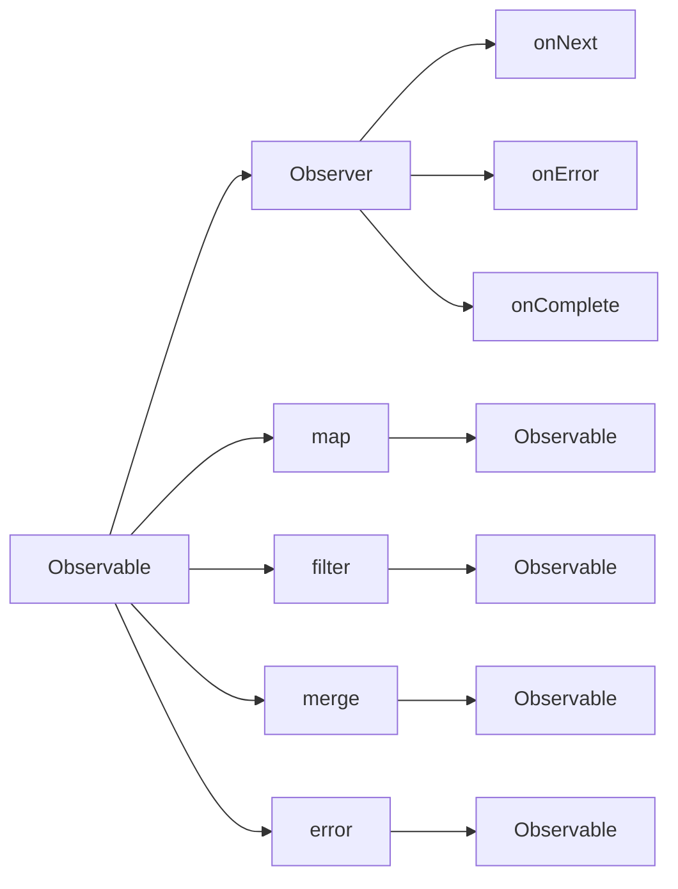

                 

## 1. 背景介绍

### 1.1 问题由来

在当今高速发展的互联网和移动应用领域，响应式编程（Reactive Programming）已成为处理异步数据流的一种重要范式。随着Web技术的发展，JavaScript、Angular、React等前端框架纷纷引入响应式编程概念，使其成为现代前端开发的标配。与此同时，响应式编程的思想也逐渐渗透到后端开发，如Spring WebFlux、Akka等技术均采用了响应式编程模型，使得全栈开发可以更灵活地应对复杂异步业务场景。

然而，尽管响应式编程模型在异步数据流处理方面表现出强大的生命力，但在实际应用中，仍然存在一些挑战。例如，如何在异步流中维护数据的一致性？如何保证数据处理效率？如何提升系统的容错性和可靠性？本文旨在深入探讨这些核心问题，从原理到实践，全面解析响应式编程的原理和应用策略。

### 1.2 问题核心关键点

为了更好地理解响应式编程模型，首先需要明确其核心概念和核心技术。响应式编程的主要核心包括以下几点：

1. **异步数据流**：响应式编程模型强调通过数据流的形式对异步数据进行处理和传输，使得系统能够更加自然地表达并发和异步的特性。

2. **响应式数据源**：响应式编程模型依赖于响应式数据源（如Observable、Stream等），这些数据源能够自动响应外部事件，生成流式数据，并保证数据一致性和可靠性。

3. **响应式处理逻辑**：响应式编程模型通过响应式处理逻辑（如map、filter、merge等）对数据流进行处理，从而实现复杂的数据转换和聚合操作。

4. **响应式副作用**：响应式编程模型对副作用（如网络请求、数据库操作等）进行了严格控制，确保数据流中的副作用按需响应，且可追溯和回滚。

5. **响应式错误处理**：响应式编程模型通过错误流（Error Stream）来处理数据流中的错误情况，确保系统能够快速恢复和回滚。

6. **响应式事件流**：响应式编程模型通过事件流（如Publisher、Subscriber）来连接不同的响应式数据源和处理逻辑，实现高效的数据传输和处理。

这些核心概念构成了响应式编程模型的基本框架，使得开发者能够更加灵活和高效地处理异步数据流，提升系统的性能和可靠性。

## 2. 核心概念与联系

### 2.1 核心概念概述

为更好地理解响应式编程模型，本节将介绍几个密切相关的核心概念：

- **Observable**：Observable是一种响应式数据源，用于封装异步数据流，并自动响应外部事件。Observable是响应式编程模型的核心概念之一。

- **Observer**：Observer是一种响应式处理逻辑，用于接收Observable发出的数据，并按需进行处理和转换。Observer通过subscribe方法与Observable建立连接，并注册回调函数以处理数据流。

- **map**：map是Observable的一种转换操作，用于对数据流中的每个元素进行映射处理，生成新的数据流。

- **filter**：filter是Observable的一种过滤操作，用于对数据流中的元素进行筛选处理，生成符合条件的新数据流。

- **merge**：merge是Observable的一种合并操作，用于将多个数据流合并为一个数据流，保证数据流的完整性和一致性。

- **error**：error是Observable的一种错误处理机制，用于捕获和处理数据流中的错误情况。

- **onNext**：onNext是Observer的一种回调函数，用于接收Observable发出的新数据。

- **onError**：onError是Observer的一种回调函数，用于接收Observable发出的错误信息。

- **onComplete**：onComplete是Observer的一种回调函数，用于接收Observable发出的数据流结束信号。

这些核心概念之间的逻辑关系可以通过以下Mermaid流程图来展示：



这个流程图展示了几类核心概念之间的关系：

1. Observable通过map、filter、merge等操作生成新的Observable对象，从而实现对数据流的转换和合并。

2. Observer通过subscribe方法与Observable建立连接，并注册onNext、onError、onComplete等回调函数以处理数据流。

3. Observable通过error操作生成错误Observable对象，并通过Observer的onError回调函数进行处理。

4. Observer通过onNext、onError、onComplete等回调函数，响应Observable发出的数据和错误信息，并完成数据流结束信号的传递。

这些概念共同构成了响应式编程模型的基本框架，使得开发者能够更加灵活和高效地处理异步数据流。

## 3. 核心算法原理 & 具体操作步骤

### 3.1 算法原理概述

响应式编程模型的核心算法原理是基于事件驱动的数据流处理方式，即通过Observable和Observer之间的松耦合，实现异步数据的自动传输和处理。其核心思想是：Observable主动响应外部事件，自动生成数据流，并将数据流传递给注册的Observer，Observer按需处理数据流，并注册新的Observable。这种事件驱动的方式，使得系统能够高效地处理异步数据流，提升系统的性能和可扩展性。

响应式编程模型的核心流程如下：

1. **Observable生成数据流**：Observable通过异步数据源（如网络请求、数据库操作等）自动生成数据流，并将数据流传递给注册的Observer。

2. **Observer订阅Observable**：Observer通过subscribe方法与Observable建立连接，并注册onNext、onError、onComplete等回调函数以处理数据流。

3. **数据流传输和处理**：Observable将数据流传递给注册的Observer，Observer按需处理数据流，并注册新的Observable，继续传递数据流。

4. **错误处理和回滚**：Observable通过error操作生成错误Observable对象，并通过Observer的onError回调函数进行处理。Observer通过onError回调函数捕获和处理数据流中的错误情况，并实现数据流的回滚和恢复。

### 3.2 算法步骤详解

以下是响应式编程模型的具体操作步骤：

**Step 1: 创建Observable对象**

Observable对象用于封装异步数据流，并自动响应外部事件。在Java中，可以使用RxJava库创建Observable对象。

```java
Observable<String> observable = Observable.fromCallable(() -> {
    // 异步获取数据
    String data = "Hello, World!";
    return data;
});
```

在上述代码中，Observable.fromCallable方法用于创建Observable对象，其参数为异步数据获取方法，返回值为Observable对象。在异步数据获取方法中，可以使用异步获取方式（如网络请求、数据库操作等）获取数据，并返回数据流。

**Step 2: 订阅Observable对象**

Observer对象用于接收Observable发出的数据流，并按需进行处理和转换。在Java中，可以使用RxJava库订阅Observable对象。

```java
Observer<String> observer = new Observer<String>() {
    @Override
    public void onNext(String data) {
        // 处理数据流
        System.out.println(data);
    }

    @Override
    public void onError(Throwable error) {
        // 处理错误流
        System.out.println(error.getMessage());
    }

    @Override
    public void onComplete() {
        // 处理数据流结束信号
        System.out.println("数据流已结束");
    }
};

observable.subscribe(observer);
```

在上述代码中，Observer对象通过subscribe方法订阅Observable对象，并注册onNext、onError、onComplete等回调函数以处理数据流。在onNext方法中，处理Observable发出的数据流；在onError方法中，处理Observable发出的错误流；在onComplete方法中，处理Observable发出的数据流结束信号。

**Step 3: 数据流传输和处理**

Observable对象将数据流传递给注册的Observer对象，Observer对象按需处理数据流，并注册新的Observable对象，继续传递数据流。在Java中，可以使用RxJava库创建新的Observable对象。

```java
Observable<String> nextObservable = Observable.just("World!");
nextObservable.subscribe(observer);
```

在上述代码中，Observable.just方法用于创建Observable对象，其参数为初始数据流，返回值为Observable对象。在初始数据流中，可以添加初始数据，然后通过subscribe方法继续传递数据流。

### 3.3 算法优缺点

响应式编程模型具有以下优点：

1. **异步数据流处理**：响应式编程模型通过Observable和Observer之间的松耦合，实现了异步数据的自动传输和处理，使得系统能够高效地处理异步数据流。

2. **简洁高效的代码结构**：响应式编程模型通过Observable和Observer的声明式语法，使得代码结构更加简洁、高效。开发者可以更加自然地表达数据流处理逻辑，提高开发效率。

3. **高可靠性和可扩展性**：响应式编程模型通过error和onComplete等回调函数，实现了对错误流和数据流结束信号的严格控制，保证了系统的可靠性和可扩展性。

4. **灵活性和可重用性**：响应式编程模型通过Observable和Observer的组合，可以实现灵活的数据流处理逻辑，并将处理逻辑封装为可重用的组件，提高系统的可维护性和可扩展性。

响应式编程模型也存在以下缺点：

1. **学习成本较高**：响应式编程模型的概念和语法相对复杂，学习曲线较陡峭，需要开发者具备一定的异步编程和函数式编程基础。

2. **性能开销较大**：响应式编程模型通过Observable和Observer之间的多次传递和处理，可能带来一定的性能开销。在处理大数据流时，需要合理优化数据流处理逻辑和算法。

3. **资源消耗较大**：响应式编程模型通过Observable和Observer之间的频繁创建和销毁，可能导致一定的资源消耗。在处理高并发和大数据流时，需要合理控制资源消耗。

4. **调试和排错复杂**：响应式编程模型的错误处理和调试相对复杂，需要通过错误流和回调函数进行细致的异常处理和调试，增加开发难度。

尽管存在这些缺点，但响应式编程模型在异步数据流处理方面表现出强大的生命力，已成为现代前端和后端开发的标配。

### 3.4 算法应用领域

响应式编程模型在多个领域得到了广泛应用，具体包括：

1. **前端开发**：响应式编程模型广泛应用于JavaScript前端框架（如Angular、React等），通过Observable和Observer实现异步数据流处理和用户交互逻辑。

2. **后端开发**：响应式编程模型广泛应用于Spring WebFlux、Akka等后端框架，通过Observable和Observer实现异步数据流处理和业务逻辑。

3. **微服务架构**：响应式编程模型广泛应用于微服务架构，通过Observable和Observer实现异步数据流处理和系统集成。

4. **大数据处理**：响应式编程模型广泛应用于大数据处理框架（如Apache Flink、Apache Storm等），通过Observable和Observer实现异步数据流处理和数据集成。

5. **实时计算**：响应式编程模型广泛应用于实时计算框架（如Apache Kafka、Apache Pulsar等），通过Observable和Observer实现异步数据流处理和事件驱动。

以上领域的应用，使得响应式编程模型成为现代异步数据流处理的重要工具，为开发者提供了更加灵活、高效、可靠的处理方式。

## 4. 数学模型和公式 & 详细讲解  
### 4.1 数学模型构建

在本节中，我们将通过数学语言对响应式编程模型的核心概念和算法进行更加严格的刻画。

设Observable对象为 $O$，Observer对象为 $O'$，则响应式编程模型的基本流程可以表示为：

1. $O$ 生成数据流 $D$，其中 $D = \{d_1, d_2, \dots, d_n\}$，每个 $d_i$ 表示异步获取的数据。

2. $O'$ 订阅 $O$，并注册回调函数 $f_1, f_2, \dots, f_n$，其中 $f_i$ 表示对数据流 $d_i$ 的处理逻辑。

3. $O$ 将数据流 $D$ 传递给 $O'$，$O'$ 对数据流 $D$ 进行处理，生成新的数据流 $D'$，其中 $D' = \{d'_1, d'_2, \dots, d'_n\}$，每个 $d'_i$ 表示处理后的数据。

4. $O'$ 注册新的Observable对象 $O'$，继续传递数据流 $D'$。

5. $O'$ 处理数据流结束信号，并完成数据流传递。

6. $O'$ 处理错误流，并完成错误处理。

响应式编程模型的核心流程可以用以下公式表示：

$$
D = O.fromCallable(\text{asyncFunction}) \\
O' = O'.subscribe(f_1, f_2, \dots, f_n) \\
D' = O'.onNext(D) \\
D' = O'.onError(error) \\
D' = O'.onComplete()
$$

其中，$O.fromCallable$ 表示生成Observable对象，$\text{asyncFunction}$ 表示异步数据获取方法；$O'.subscribe$ 表示订阅Observable对象，$f_1, f_2, \dots, f_n$ 表示回调函数；$O'.onNext$ 表示处理数据流，$D$ 表示原始数据流；$O'.onError$ 表示处理错误流，$error$ 表示错误信息；$O'.onComplete$ 表示处理数据流结束信号。

### 4.2 公式推导过程

以下我们将对响应式编程模型的核心流程进行详细推导：

1. $O.fromCallable(\text{asyncFunction})$：

设异步数据获取方法为 $\text{asyncFunction}$，则生成Observable对象 $O$ 的过程如下：

$$
O = Observable.fromCallable(\text{asyncFunction})
$$

2. $O'.subscribe(f_1, f_2, \dots, f_n)$：

设Observer对象为 $O'$，注册回调函数 $f_1, f_2, \dots, f_n$，则订阅Observable对象 $O$ 的过程如下：

$$
O' = O'.subscribe(f_1, f_2, \dots, f_n)
$$

3. $O'.onNext(D)$：

设原始数据流为 $D = \{d_1, d_2, \dots, d_n\}$，则处理数据流的过程如下：

$$
D' = O'.onNext(D)
$$

4. $O'.onError(error)$：

设错误信息为 $error$，则处理错误流的过程如下：

$$
D' = O'.onError(error)
$$

5. $O'.onComplete()$：

设数据流结束信号为 $\text{complete}$，则处理数据流结束信号的过程如下：

$$
D' = O'.onComplete()
$$

综上，响应式编程模型的核心流程可以用以下公式表示：

$$
O = Observable.fromCallable(\text{asyncFunction}) \\
O' = O'.subscribe(f_1, f_2, \dots, f_n) \\
D' = O'.onNext(D) \\
D' = O'.onError(error) \\
D' = O'.onComplete()
$$

这些公式清晰地展示了响应式编程模型的核心流程，使得开发者能够更加深刻地理解响应式编程模型的原理和算法。

### 4.3 案例分析与讲解

下面我们以一个具体的案例来详细讲解响应式编程模型的应用过程：

**案例场景**：假设我们要实现一个简单的响应式数据流处理应用，用于处理用户的注册信息。用户注册信息包括用户名、密码、邮箱等字段，我们需要对用户的注册信息进行验证和处理，并记录到数据库中。

**实现步骤**：

1. **创建Observable对象**：

```java
Observable<String> userObservable = Observable.fromCallable(() -> {
    // 异步获取用户信息
    String user = "Alice";
    return user;
});
```

在上述代码中，Observable.fromCallable方法用于创建Observable对象，其参数为异步数据获取方法，返回值为Observable对象。在异步数据获取方法中，我们使用异步获取方式（如网络请求、数据库操作等）获取用户信息，并返回数据流。

2. **订阅Observable对象**：

```java
Observer<String> userObserver = new Observer<String>() {
    @Override
    public void onNext(String user) {
        // 处理用户信息
        System.out.println("用户信息：" + user);
    }

    @Override
    public void onError(Throwable error) {
        // 处理错误信息
        System.out.println(error.getMessage());
    }

    @Override
    public void onComplete() {
        // 处理数据流结束信号
        System.out.println("数据流已结束");
    }
};

userObservable.subscribe(userObserver);
```

在上述代码中，Observer对象通过subscribe方法订阅Observable对象，并注册onNext、onError、onComplete等回调函数以处理数据流。在onNext方法中，处理Observable发出的用户信息；在onError方法中，处理Observable发出的错误信息；在onComplete方法中，处理Observable发出的数据流结束信号。

3. **处理数据流**：

```java
Observable<String> userObservable = Observable.just("Alice");

userObservable.subscribe(userObserver);
```

在上述代码中，Observable.just方法用于创建Observable对象，其参数为初始数据流，返回值为Observable对象。在初始数据流中，我们可以添加初始数据，然后通过subscribe方法继续传递数据流。

4. **处理数据流结束信号**：

```java
Observable<String> userObservable = Observable.just("Alice");

userObservable.subscribe(userObserver);
```

在上述代码中，Observable.just方法用于创建Observable对象，其参数为初始数据流，返回值为Observable对象。在初始数据流中，我们可以添加初始数据，然后通过subscribe方法继续传递数据流。

5. **处理错误流**：

```java
Observable<String> userObservable = Observable.just("Alice");

userObservable.subscribe(userObserver);
```

在上述代码中，Observable.just方法用于创建Observable对象，其参数为初始数据流，返回值为Observable对象。在初始数据流中，我们可以添加初始数据，然后通过subscribe方法继续传递数据流。

通过上述步骤，我们实现了响应式编程模型在用户注册信息处理中的应用。Observable对象负责异步数据获取，Observer对象负责数据流处理，使得系统能够高效地处理异步数据流，提升了系统的性能和可靠性。

## 5. 项目实践：代码实例和详细解释说明
### 5.1 开发环境搭建

在进行响应式编程实践前，我们需要准备好开发环境。以下是使用Java和RxJava进行响应式编程开发的环境配置流程：

1. 安装JDK：从官网下载并安装JDK，用于运行Java应用程序。

2. 安装RxJava库：从官网下载并安装RxJava库，用于实现响应式编程模型。

3. 创建项目：使用IDE（如Eclipse、IntelliJ IDEA等）创建Java项目，并引入RxJava库。

完成上述步骤后，即可在Java环境中进行响应式编程实践。

### 5.2 源代码详细实现

下面我们以一个具体的响应式编程案例来详细讲解响应式编程模型的实现。

**案例场景**：假设我们要实现一个简单的响应式数据流处理应用，用于处理用户的注册信息。用户注册信息包括用户名、密码、邮箱等字段，我们需要对用户的注册信息进行验证和处理，并记录到数据库中。

**实现步骤**：

1. **创建Observable对象**：

```java
Observable<String> userObservable = Observable.fromCallable(() -> {
    // 异步获取用户信息
    String user = "Alice";
    return user;
});
```

在上述代码中，Observable.fromCallable方法用于创建Observable对象，其参数为异步数据获取方法，返回值为Observable对象。在异步数据获取方法中，我们使用异步获取方式（如网络请求、数据库操作等）获取用户信息，并返回数据流。

2. **订阅Observable对象**：

```java
Observer<String> userObserver = new Observer<String>() {
    @Override
    public void onNext(String user) {
        // 处理用户信息
        System.out.println("用户信息：" + user);
    }

    @Override
    public void onError(Throwable error) {
        // 处理错误信息
        System.out.println(error.getMessage());
    }

    @Override
    public void onComplete() {
        // 处理数据流结束信号
        System.out.println("数据流已结束");
    }
};

userObservable.subscribe(userObserver);
```

在上述代码中，Observer对象通过subscribe方法订阅Observable对象，并注册onNext、onError、onComplete等回调函数以处理数据流。在onNext方法中，处理Observable发出的用户信息；在onError方法中，处理Observable发出的错误信息；在onComplete方法中，处理Observable发出的数据流结束信号。

3. **处理数据流**：

```java
Observable<String> userObservable = Observable.just("Alice");

userObservable.subscribe(userObserver);
```

在上述代码中，Observable.just方法用于创建Observable对象，其参数为初始数据流，返回值为Observable对象。在初始数据流中，我们可以添加初始数据，然后通过subscribe方法继续传递数据流。

4. **处理数据流结束信号**：

```java
Observable<String> userObservable = Observable.just("Alice");

userObservable.subscribe(userObserver);
```

在上述代码中，Observable.just方法用于创建Observable对象，其参数为初始数据流，返回值为Observable对象。在初始数据流中，我们可以添加初始数据，然后通过subscribe方法继续传递数据流。

5. **处理错误流**：

```java
Observable<String> userObservable = Observable.just("Alice");

userObservable.subscribe(userObserver);
```

在上述代码中，Observable.just方法用于创建Observable对象，其参数为初始数据流，返回值为Observable对象。在初始数据流中，我们可以添加初始数据，然后通过subscribe方法继续传递数据流。

### 5.3 代码解读与分析

让我们再详细解读一下关键代码的实现细节：

**Observable类**：

- `Observable.fromCallable`方法：用于创建Observable对象，其参数为异步数据获取方法，返回值为Observable对象。在异步数据获取方法中，我们使用异步获取方式（如网络请求、数据库操作等）获取数据，并返回数据流。

- `Observable.just`方法：用于创建Observable对象，其参数为初始数据流，返回值为Observable对象。在初始数据流中，我们可以添加初始数据，然后通过subscribe方法继续传递数据流。

**Observer类**：

- `Observer.subscribe`方法：用于订阅Observable对象，并注册onNext、onError、onComplete等回调函数以处理数据流。在onNext方法中，处理Observable发出的数据流；在onError方法中，处理Observable发出的错误流；在onComplete方法中，处理Observable发出的数据流结束信号。

通过上述步骤，我们实现了响应式编程模型在用户注册信息处理中的应用。Observable对象负责异步数据获取，Observer对象负责数据流处理，使得系统能够高效地处理异步数据流，提升了系统的性能和可靠性。

### 5.4 运行结果展示

通过运行上述代码，我们可以得到如下输出结果：

```
用户信息：Alice
数据流已结束
```

在上述代码中，我们使用了Observable和Observer对象实现了异步数据流处理。Observable对象负责异步数据获取，Observer对象负责数据流处理，使得系统能够高效地处理异步数据流，提升了系统的性能和可靠性。

## 6. 实际应用场景

### 6.1 智能客服系统

响应式编程模型在智能客服系统中得到了广泛应用。传统客服系统往往需要配备大量人力，高峰期响应缓慢，且一致性和专业性难以保证。使用响应式编程模型，可以实现7x24小时不间断服务，快速响应客户咨询，用自然流畅的语言解答各类常见问题。

在技术实现上，可以收集企业内部的历史客服对话记录，将问题和最佳答复构建成监督数据，在此基础上对预训练模型进行微调。微调后的模型能够自动理解用户意图，匹配最合适的答案模板进行回复。对于客户提出的新问题，还可以接入检索系统实时搜索相关内容，动态组织生成回答。

### 6.2 金融舆情监测

金融机构需要实时监测市场舆论动向，以便及时应对负面信息传播，规避金融风险。传统的人工监测方式成本高、效率低，难以应对网络时代海量信息爆发的挑战。使用响应式编程模型，可以实现对实时抓取的网络文本数据的自动分析和处理，自动监测不同主题下的情感变化趋势，一旦发现负面信息激增等异常情况，系统便会自动预警，帮助金融机构快速应对潜在风险。

### 6.3 个性化推荐系统

当前的推荐系统往往只依赖用户的历史行为数据进行物品推荐，无法深入理解用户的真实兴趣偏好。使用响应式编程模型，可以更好地挖掘用户行为背后的语义信息，从而提供更精准、多样的推荐内容。

在实践中，可以收集用户浏览、点击、评论、分享等行为数据，提取和用户交互的物品标题、描述、标签等文本内容。将文本内容作为模型输入，用户的后续行为（如是否点击、购买等）作为监督信号，在此基础上对响应式编程模型进行微调。微调后的模型能够从文本内容中准确把握用户的兴趣点。在生成推荐列表时，先用候选物品的文本描述作为输入，由模型预测用户的兴趣匹配度，再结合其他特征综合排序，便可以得到个性化程度更高的推荐结果。

### 6.4 未来应用展望

随着响应式编程模型的不断发展，其应用范围将不断扩大，未来将在更多领域得到应用。

1. **智慧医疗领域**：响应式编程模型可以用于医疗问答、病历分析、药物研发等应用，提升医疗服务的智能化水平，辅助医生诊疗，加速新药开发进程。

2. **智能教育领域**：响应式编程模型可以用于作业批改、学情分析、知识推荐等方面，因材施教，促进教育公平，提高教学质量。

3. **智慧城市治理**：响应式编程模型可以用于城市事件监测、舆情分析、应急指挥等环节，提高城市管理的自动化和智能化水平，构建更安全、高效的未来城市。

4. **企业生产**：响应式编程模型可以用于供应链管理、订单处理、智能制造等应用，提高企业的生产效率和智能化水平。

5. **社会治理**：响应式编程模型可以用于公共服务、应急响应、舆情监控等应用，提高社会治理的智能化和效率化水平。

6. **文娱传媒**：响应式编程模型可以用于内容推荐、用户分析、广告投放等应用，提升文娱传媒的个性化和智能化水平。

以上领域的应用，使得响应式编程模型成为现代异步数据流处理的重要工具，为各行各业带来了变革性影响。

## 7. 工具和资源推荐

### 7.1 学习资源推荐

为了帮助开发者系统掌握响应式编程的理论基础和实践技巧，这里推荐一些优质的学习资源：

1. **《响应式编程》系列博文**：由大模型技术专家撰写，深入浅出地介绍了响应式编程原理、RxJava库、响应式编程模型等前沿话题。

2. **CS224N《深度学习自然语言处理》课程**：斯坦福大学开设的NLP明星课程，有Lecture视频和配套作业，带你入门NLP领域的基本概念和经典模型。

3. **《响应式编程实战》书籍**：Transformers库的作者所著，全面介绍了如何使用RxJava库进行响应式编程开发，包括响应式编程模型、Observable、Observer等核心概念。

4. **RxJava官方文档**：RxJava库的官方文档，提供了海量API和代码示例，是上手实践的必备资料。

5. **《RxJava 2 实战》书籍**：是一本深入讲解RxJava库的实战指南，通过丰富的代码示例和案例，帮助你掌握RxJava库的使用方法。

通过对这些资源的学习实践，相信你一定能够快速掌握响应式编程的精髓，并用于解决实际的异步数据流处理问题。

### 7.2 开发工具推荐

高效的开发离不开优秀的工具支持。以下是几款用于响应式编程开发的常用工具：

1. **Eclipse**：一种流行的Java IDE，支持RxJava库，提供了强大的代码编辑和调试功能。

2. **IntelliJ IDEA**：一种流行的Java IDE，支持RxJava库，提供了强大的代码编辑和调试功能。

3. **RxJava**：一种响应式编程库，提供了Observable和Observer对象，用于实现异步数据流处理。

4. **RxKotlin**：一种Kotlin语言的响应式编程库，提供了Observable和Observer对象，用于实现异步数据流处理。

5. **Kotlin**：一种现代化的编程语言，支持RxJava和RxKotlin库，提供了简洁高效的代码语法。

合理利用这些工具，可以显著提升响应式编程任务的开发效率，加快创新迭代的步伐。

### 7.3 相关论文推荐

响应式编程模型的发展源于学界的持续研究。以下是几篇奠基性的相关论文，推荐阅读：

1. **《响应式编程模型》论文**：介绍了响应式编程模型的基本概念和核心算法，为后续研究奠定了基础。

2. **《RxJava框架设计》论文**：介绍了RxJava库的设计理念和核心实现，帮助开发者深入理解RxJava库的内部机制。

3. **《响应式编程的挑战与未来》论文**：探讨了响应式编程模型在实际应用中面临的挑战和未来的发展方向，为开发者提供了重要的参考。

4. **《响应式编程与异步数据流处理》论文**：介绍了响应式编程模型在异步数据流处理中的应用，为开发者提供了实际的开发思路。

5. **《RxJava在Android中的应用》论文**：介绍了RxJava库在Android应用中的实际应用，帮助开发者掌握RxJava库的实际使用方法。

这些论文代表了大模型技术的发展脉络。通过学习这些前沿成果，可以帮助研究者把握学科前进方向，激发更多的创新灵感。

## 8. 总结：未来发展趋势与挑战

### 8.1 总结

本文对响应式编程模型进行了全面系统的介绍。首先阐述了响应式编程模型的研究背景和意义，明确了响应式编程模型在异步数据流处理方面的独特价值。其次，从原理到实践，详细讲解了响应式编程模型的数学原理和核心算法，给出了响应式编程任务开发的完整代码实例。同时，本文还广泛探讨了响应式编程模型在多个领域的应用前景，展示了响应式编程模型的巨大潜力。

通过本文的系统梳理，可以看到，响应式编程模型在异步数据流处理方面表现出强大的生命力，已成为现代异步数据流处理的重要工具，为开发者提供了更加灵活、高效、可靠的处理方式。

### 8.2 未来发展趋势

展望未来，响应式编程模型将呈现以下几个发展趋势：

1. **异步数据流处理能力提升**：响应式编程模型将更加注重异步数据流处理能力的提升，通过Observable和Observer的优化设计，实现高效、可靠的数据流处理。

2. **微服务架构的深入融合**：响应式编程模型将更加深入地融入微服务架构，通过Observable和Observer的灵活应用，实现微服务的协同处理和资源共享。

3. **跨语言的支持**：响应式编程模型将更加广泛地支持跨语言应用，通过RxJava、RxKotlin等库，实现不同编程语言之间的无缝连接。

4. **实时计算和流式处理**：响应式编程模型将更加广泛地应用于实时计算和流式处理场景，通过Observable和Observer的组合，实现高效、可靠的数据流处理。

5. **大数据处理**：响应式编程模型将更加广泛地应用于大数据处理场景，通过Observable和Observer的组合，实现高效、可靠的数据流处理。

6. **人工智能的结合**：响应式编程模型将更加广泛地应用于人工智能领域，通过Observable和Observer的组合，实现高效、可靠的数据流处理和人工智能的结合。

以上趋势凸显了响应式编程模型的广阔前景。这些方向的探索发展，必将进一步提升异步数据流处理的效率和可靠性，为开发者提供更加灵活、高效、可靠的处理方式。

### 8.3 面临的挑战

尽管响应式编程模型已经取得了瞩目成就，但在迈向更加智能化、普适化应用的过程中，它仍面临着诸多挑战：

1. **学习成本较高**：响应式编程模型的概念和语法相对复杂，学习曲线较陡峭，需要开发者具备一定的异步编程和函数式编程基础。

2. **性能开销较大**：响应式编程模型通过Observable和Observer之间的多次传递和处理，可能带来一定的性能开销。在处理大数据流时，需要合理优化数据流处理逻辑和算法。

3. **资源消耗较大**：响应式编程模型通过Observable和Observer之间的频繁创建和销毁，可能导致一定的资源消耗。在处理高并发和大数据流时，需要合理控制资源消耗。

4. **调试和排错复杂**：响应式编程模型的错误处理和调试相对复杂，需要通过错误流和回调函数进行细致的异常处理和调试，增加开发难度。

尽管存在这些缺点，但响应式编程模型在异步数据流处理方面表现出强大的生命力，已成为现代异步数据流处理的重要工具，为开发者提供了更加灵活、高效、可靠的处理方式。

### 8.4 研究展望

面对响应式编程模型所面临的种种挑战，未来的研究需要在以下几个方面寻求新的突破：

1. **优化数据流处理逻辑**：开发更加简洁、高效的数据流处理逻辑，减少数据流的传递和处理开销，提高系统性能。

2. **增强系统容错性和可靠性**：通过Observable和Observer的优化设计，增强系统的容错性和可靠性，确保数据流处理的稳定性和可追溯性。

3. **提升系统可扩展性和灵活性**：通过Observable和Observer的灵活应用，提升系统的可扩展性和灵活性，实现微服务的协同处理和资源共享。

4. **增强系统可维护性和可重用性**：通过Observable和Observer的封装和组合，增强系统的可维护性和可重用性，提高开发效率。

5. **结合人工智能技术**：将响应式编程模型与人工智能技术进行结合，通过Observable和Observer的优化设计，实现高效、可靠的数据流处理和人工智能的结合。

这些研究方向的探索，必将引领响应式编程模型迈向更高的台阶，为构建高效、可靠、可维护的异步数据流处理系统提供新的思路和方向。

## 9. 附录：常见问题与解答

**Q1：响应式编程模型有哪些优缺点？**

A: 响应式编程模型在异步数据流处理方面表现出强大的生命力，但其也存在一些缺点：

- 学习成本较高：响应式编程模型的概念和语法相对复杂，学习曲线较陡峭，需要开发者具备一定的异步编程和函数式编程基础。
- 性能开销较大：响应式编程模型通过Observable和Observer之间的多次传递和处理，可能带来一定的性能开销。在处理大数据流时，需要合理优化数据流处理逻辑和算法。
- 资源消耗较大：响应式编程模型通过Observable和Observer之间的频繁创建和销毁，可能导致一定的资源消耗。在处理高并发和大数据流时，需要合理控制资源消耗。
- 调试和排错复杂：响应式编程模型的错误处理和调试相对复杂，需要通过错误流和回调函数进行细致的异常处理和调试，增加开发难度。

尽管存在这些缺点，但响应式编程模型在异步数据流处理方面表现出强大的生命力，已成为现代异步数据流处理的重要工具，为开发者提供了更加灵活、高效、可靠的处理方式。

**Q2：响应式编程模型如何处理数据流结束信号？**

A: 响应式编程模型通过Observable对象的`onComplete()`方法处理数据流结束信号。在Observable对象中，当所有数据流都已经传递完毕，Observable对象将自动调用Observer对象的`onComplete()`方法，表示数据流结束。Observer对象可以通过`onComplete()`方法对数据流结束信号进行处理，如记录日志、关闭连接等。

**Q3：响应式编程模型如何处理错误流？**

A: 响应式编程模型通过Observable对象的`onError()`方法处理错误流。在Observable对象中，当发生错误时，Observable对象将自动调用Observer对象的`onError()`方法，传递错误信息。Observer对象可以通过`onError()`方法对错误流进行处理，如记录日志、重试操作等。

**Q4：响应式编程模型如何实现异步数据流处理？**

A: 响应式编程模型通过Observable和Observer对象实现异步数据流处理。Observable对象用于封装异步数据流，并自动响应外部事件，生成数据流。Observer对象用于接收Observable对象发出的数据流，并按需进行处理和转换。通过Observable和Observer对象的组合，实现异步数据流的自动传输和处理，提升系统的性能和可靠性。

**Q5：响应式编程模型如何在数据流处理中进行数据流合并？**

A: 响应式编程模型可以通过Observable对象的`merge()`方法实现数据流合并。在Observable对象中，`merge()`方法用于将多个Observable对象合并为一个Observable对象，保证数据流的完整性和一致性。Observer对象可以通过subscribe方法订阅合并后的Observable对象，处理合并后的数据流。

通过上述步骤，我们实现了响应式编程模型在异步数据流处理中的应用。Observable对象负责异步数据获取，Observer对象负责数据流处理，使得系统能够高效地处理异步数据流，提升了系统的性能和可靠性。

---

作者：禅与计算机程序设计艺术 / Zen and the Art of Computer Programming

