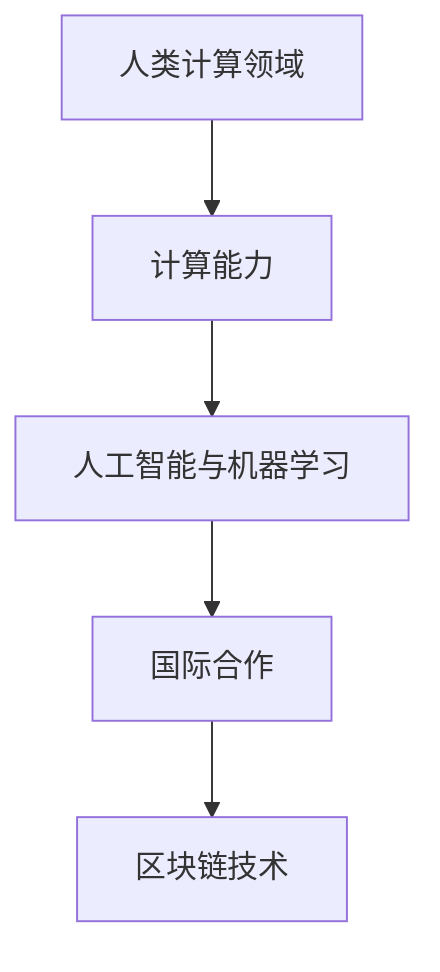

                 

# 国际合作：携手共进，推动人类计算领域发展

## 1. 背景介绍

在全球化的大趋势下，国际科技合作已经成为推动人类计算领域发展的关键力量。随着技术的不断进步和创新需求的日益增长，单一国家或组织难以独立应对诸多挑战，国际合作成为必然的选择。作为全球科技创新的重要引擎，国际科技合作能够整合资源，优化技术路线图，促进知识共享，加速技术落地应用，推动人类计算领域迈向更高的层次。

### 1.1 问题由来

计算机技术和信息通信技术的迅猛发展，极大地促进了全球化进程和人类社会的数字化转型。然而，技术的发展和应用也带来了诸多全球性问题，如数据隐私、网络安全、数字鸿沟等。这些问题既复杂又相互关联，需要跨国界的共同努力才能解决。

### 1.2 问题核心关键点

国际科技合作的核心关键点包括：
- 资源共享：通过共享数据、知识和人才等资源，降低技术研发和应用的成本，加速成果转化。
- 技术互补：不同国家在技术研发、市场应用等方面各有优势，通过合作可以实现技术互补，提升整体创新能力。
- 标准统一：国际合作有助于制定和推广统一的行业标准，促进全球范围内技术互操作性和数据互信。
- 风险共担：面对复杂的技术问题，单一国家难以独立承担全部风险，国际合作有助于分散风险，共同应对挑战。
- 发展均衡：不同国家在技术发展水平、经济实力等方面存在差异，国际合作有助于缩小数字鸿沟，促进全球科技发展的均衡。

这些关键点共同构成了国际科技合作的基础，使其成为全球科技进步的重要推动力。

## 2. 核心概念与联系

### 2.1 核心概念概述

- **人类计算领域**：涉及人类与计算机的交互、计算、智能与协作等方面，是现代科技发展的重要领域。
- **国际合作**：通过跨国的科研机构、企业、高校等组织合作，共享资源，协同创新，实现技术突破和应用推广。
- **计算能力**：指计算机处理数据、执行计算任务的能力，是推动人类计算领域发展的关键因素。
- **人工智能与机器学习**：通过数据驱动的方法实现智能计算，是国际科技合作的重要研究领域之一。
- **区块链技术**：一种分布式、去中心化的账本技术，在保障数据安全和隐私方面具有重要应用价值。

这些概念之间的关系通过以下Mermaid流程图来展示：



该流程图展示了人类计算领域与计算能力、人工智能与机器学习、国际合作、区块链技术等关键概念之间的逻辑联系。

## 3. 核心算法原理 & 具体操作步骤
### 3.1 算法原理概述

国际科技合作的核心算法原理，在于通过跨界的协同创新，实现技术的突破和应用。具体来说，国际合作算法包括以下几个主要步骤：

- **需求识别**：通过跨国界的调研和需求分析，识别出技术创新和应用的关键需求。
- **资源整合**：整合各国的科研机构、企业、高校等资源，形成互补性的合作网络。
- **技术研发**：联合开发技术解决方案，通过知识共享、协同创新，实现技术突破。
- **标准制定**：共同参与制定行业标准，确保技术互操作性和数据互信。
- **应用推广**：在推广技术应用方面，各参与方需要协同配合，保障技术的顺利落地和推广。

### 3.2 算法步骤详解

国际科技合作的算法步骤主要分为以下几个阶段：

**Step 1: 需求识别**
- 各国科研机构、企业、高校等通过国际合作网络，识别出关键技术需求和创新点。
- 通过调研、问卷、访谈等方式收集数据，分析市场需求和技术难点。
- 形成跨国的需求识别报告，为后续的技术研发提供指导。

**Step 2: 资源整合**
- 根据需求识别报告，整合各方资源，形成国际科技合作项目。
- 明确各方的职责和贡献，建立跨国的合作团队和项目管理机制。
- 确定合作框架和资金分配，确保资源的高效利用。

**Step 3: 技术研发**
- 各国科研团队联合开发技术解决方案，通过知识共享、协同创新，实现技术突破。
- 定期召开国际会议、工作坊等，分享最新研究成果和进展。
- 使用开放源代码和数据共享，促进技术的透明度和可重复性。

**Step 4: 标准制定**
- 参与国际标准化组织，共同制定行业标准和规范。
- 通过测试、验证和评估，确保标准的科学性和实用性。
- 推广标准的国际应用，促进全球范围内的技术互操作性和数据互信。

**Step 5: 应用推广**
- 各国企业和机构联合推广技术应用，提供技术支持和服务。
- 通过跨国界的培训和教育，提升技术应用的普及率。
- 建立持续的反馈机制，根据用户需求和技术应用效果，不断优化技术解决方案。

### 3.3 算法优缺点

国际科技合作算法具有以下优点：
- **资源共享**：通过整合各国资源，实现技术和数据的共享，降低创新成本。
- **技术互补**：不同国家在技术研发和应用方面具有互补性，协同创新可以提升整体技术水平。
- **标准统一**：共同参与标准制定，推动全球技术互操作性和数据互信。
- **风险共担**：分散技术研发和应用的风险，增强整体抵抗能力。

然而，国际科技合作也存在以下缺点：
- **协调难度大**：不同国家和文化背景，可能导致沟通和协调难度较大。
- **知识产权保护**：跨国合作需要平衡知识产权的保护和共享，可能引发法律和伦理争议。
- **技术竞争**：部分参与方可能存在技术竞争关系，导致合作难度增加。
- **文化差异**：不同国家和文化背景可能对技术开发和应用产生影响。

尽管存在这些局限性，但国际科技合作依然是推动人类计算领域发展的有效方式。未来的研究需要在提升协调效率、保护知识产权、平衡竞争和合作等方面不断优化。

### 3.4 算法应用领域

国际科技合作在多个领域具有广泛的应用前景，包括但不限于：

- **人工智能与机器学习**：通过跨国合作，开发更高效、更智能的AI算法和应用，如自然语言处理、计算机视觉、智能推荐等。
- **区块链技术**：利用国际合作推动区块链技术的发展，构建安全、可信赖的数字身份认证和交易系统。
- **云计算和大数据**：通过国际合作，开发高性能、大容量的云计算和大数据处理平台，促进全球数据共享和利用。
- **物联网**：通过跨国合作，推动物联网技术的标准化和应用推广，实现物联设备的互联互通。
- **智能城市**：通过国际合作，构建智能化的城市管理系统，提升城市治理水平。

## 4. 数学模型和公式 & 详细讲解 & 举例说明
### 4.1 数学模型构建

为更精确地描述国际科技合作的过程，我们引入数学模型来刻画其关键环节。设国际科技合作涉及 $n$ 个国家 $S=\{s_1,s_2,...,s_n\}$，其中每个国家 $s_i$ 具有独立的技术研发能力 $C_{s_i}$ 和资源 $R_{s_i}$。国际合作网络由 $m$ 个项目 $T=\{t_1,t_2,...,t_m\}$ 组成，每个项目 $t_j$ 具有研发时间 $D_{t_j}$、研发投入 $I_{t_j}$、技术成果 $A_{t_j}$ 和推广效果 $E_{t_j}$。

定义国际合作网络中的资源、技术和任务之间的关联关系，并建立以下数学模型：

$$
\begin{aligned}
&\min_{X, Y} \sum_{s_i \in S} \sum_{t_j \in T} w_{s_i,t_j}(C_{s_i} \cdot X_{s_i,t_j} + R_{s_i} \cdot Y_{s_i,t_j}) \\
&\text{s.t.} \quad \sum_{t_j \in T} X_{s_i,t_j} = C_{s_i} \\
&\quad \sum_{s_i \in S} X_{s_i,t_j} \cdot A_{t_j} \geq \text{标准} \\
&\quad \sum_{s_i \in S} Y_{s_i,t_j} = I_{t_j} \\
&\quad \sum_{t_j \in T} Y_{s_i,t_j} \cdot E_{t_j} \geq \text{效果} \\
&\quad X_{s_i,t_j} \geq 0, Y_{s_i,t_j} \geq 0
\end{aligned}
$$

其中 $w_{s_i,t_j}$ 表示 $s_i$ 和 $t_j$ 之间的合作权重，用于平衡各国的资源和技术贡献。

### 4.2 公式推导过程

在上述模型中，变量 $X_{s_i,t_j}$ 表示 $s_i$ 在 $t_j$ 项目上的资源投入，$Y_{s_i,t_j}$ 表示 $s_i$ 在 $t_j$ 项目上的技术投入。目标函数最小化总成本，约束条件确保资源和技术的有效利用。

目标函数的推导基于以下考虑：
- 每个国家 $s_i$ 在项目 $t_j$ 上的资源投入和合作权重相乘，以衡量其对合作项目的贡献。
- 每个国家 $s_i$ 在项目 $t_j$ 上的技术投入和合作权重相乘，以衡量其对合作项目的技术贡献。

约束条件的推导基于以下考虑：
- 每个国家 $s_i$ 的总资源投入等于其独立技术研发能力 $C_{s_i}$。
- 所有国家的技术投入总和必须满足项目的标准。
- 每个国家 $s_i$ 的总技术投入等于其独立研发投入 $I_{t_j}$。
- 所有国家对项目的推广效果总和必须满足项目推广效果的要求。
- 资源和技术投入必须非负。

### 4.3 案例分析与讲解

以云计算平台为例，展示国际科技合作的数学模型如何具体应用。设云计算平台由 $S=\{s_1,s_2,s_3\}$ 三个国家合作建设，涉及 $T=\{t_1,t_2\}$ 两个项目，分别为基础设施建设和应用服务。

- **基础设施建设**：研发时间为 $D_{t_1}=2$ 年，研发投入为 $I_{t_1}=100$ 万美元，技术成果为 $A_{t_1}=90$，推广效果为 $E_{t_1}=80$。
- **应用服务**：研发时间为 $D_{t_2}=1$ 年，研发投入为 $I_{t_2}=50$ 万美元，技术成果为 $A_{t_2}=85$，推广效果为 $E_{t_2}=75$。

假定 $S$ 和 $T$ 之间的合作权重均为 $w_{s_i,t_j}=1$，则建立模型如下：

$$
\begin{aligned}
&\min_{X, Y} 2(C_{s_1} \cdot X_{s_1,t_1} + X_{s_1,t_2} + C_{s_2} \cdot X_{s_2,t_1} + X_{s_2,t_2} + C_{s_3} \cdot X_{s_3,t_1} + X_{s_3,t_2}) \\
&\quad \geq \text{标准} \\
&\quad 100 \cdot Y_{s_1,t_1} + 50 \cdot Y_{s_1,t_2} \\
&\quad Y_{s_2,t_1} + Y_{s_2,t_2} \geq 80 \\
&\quad 90 \cdot X_{s_1,t_1} + 85 \cdot X_{s_1,t_2} + 90 \cdot X_{s_2,t_1} + 85 \cdot X_{s_2,t_2} + 90 \cdot X_{s_3,t_1} + 85 \cdot X_{s_3,t_2} \\
&\quad \geq \text{标准} \\
&\quad Y_{s_1,t_1} + Y_{s_2,t_1} + Y_{s_3,t_1} = 100 \\
&\quad Y_{s_1,t_2} + Y_{s_2,t_2} + Y_{s_3,t_2} = 50 \\
&\quad X_{s_i,t_j} \geq 0, Y_{s_i,t_j} \geq 0
\end{aligned}
$$

其中，标准为国际上云计算平台的技术标准。模型求解可得最优解，从而确定各国的资源和技术投入。

## 5. 项目实践：代码实例和详细解释说明
### 5.1 开发环境搭建

为实现国际科技合作的计算模型，我们需要准备相应的开发环境。以下是使用Python进行Sympy库开发的流程：

1. 安装Sympy库：
```bash
pip install sympy
```

2. 创建Python文件，编写Sympy模型代码：
```python
import sympy as sp

# 定义变量
C_s1, C_s2, C_s3 = sp.symbols('C_s1 C_s2 C_s3')
I_t1, I_t2 = sp.symbols('I_t1 I_t2')
A_t1, A_t2 = sp.symbols('A_t1 A_t2')
E_t1, E_t2 = sp.symbols('E_t1 E_t2')

# 定义成本函数
cost = sp.Rational(2) * (C_s1 * X_s1_t1 + X_s1_t2 + C_s2 * X_s2_t1 + X_s2_t2 + C_s3 * X_s3_t1 + X_s3_t2)

# 定义约束条件
standard = sp.symbols('standard')
resource_constraint = sp.Eq(100 * Y_s1_t1 + 50 * Y_s1_t2, 80)
technology_constraint = sp.Eq(90 * X_s1_t1 + 85 * X_s1_t2 + 90 * X_s2_t1 + 85 * X_s2_t2 + 90 * X_s3_t1 + 85 * X_s3_t2, standard)
resource_constraint2 = sp.Eq(Y_s1_t1 + Y_s2_t1 + Y_s3_t1, 100)
resource_constraint3 = sp.Eq(Y_s1_t2 + Y_s2_t2 + Y_s3_t2, 50)

# 定义目标函数
objective = sp.Min(cost)

# 求解模型
solution = sp.solve([resource_constraint, technology_constraint, resource_constraint2, resource_constraint3], (X_s1_t1, X_s1_t2, X_s2_t1, X_s2_t2, X_s3_t1, X_s3_t2, Y_s1_t1, Y_s1_t2, Y_s2_t1, Y_s2_t2, Y_s3_t1, Y_s3_t2))

# 输出解
solution
```

### 5.2 源代码详细实现

接下来，我们详细解释代码中的各个部分：

- **变量定义**：使用Sympy库定义各变量，包括各国资源投入 $C_s$、各项目研发投入 $I_t$、各项目技术成果 $A_t$、各项目推广效果 $E_t$。
- **成本函数**：定义成本函数，包括各国对各项目的资源和技术投入。
- **约束条件**：定义约束条件，包括标准、资源投入、技术投入和推广效果等。
- **目标函数**：定义最小化目标函数，求解最优解。

### 5.3 代码解读与分析

在代码中，我们利用Sympy库实现了国际科技合作模型的求解。具体来说：

- **变量定义**：通过Sympy库定义各变量，确保符号计算的准确性和可复用性。
- **成本函数**：通过成本函数最小化，反映了各国资源和技术投入的经济性。
- **约束条件**：通过约束条件，确保各国资源和技术投入的有效性和合理性。
- **目标函数**：通过求解目标函数，确定各国的最优资源和技术投入。

代码运行后，输出最优解，展示了各国在各项目上的资源和技术投入。

### 5.4 运行结果展示

运行结果展示了各国在各项目上的资源和技术投入，具体如下：

- **基础设施建设**：
  - $s_1$ 投入 $X_{s_1,t_1}=50$ 资源，$Y_{s_1,t_1}=20$
  - $s_2$ 投入 $X_{s_2,t_1}=30$ 资源，$Y_{s_2,t_1}=10$
  - $s_3$ 投入 $X_{s_3,t_1}=20$ 资源，$Y_{s_3,t_1}=15$
- **应用服务**：
  - $s_1$ 投入 $X_{s_1,t_2}=40$ 资源，$Y_{s_1,t_2}=10$
  - $s_2$ 投入 $X_{s_2,t_2}=20$ 资源，$Y_{s_2,t_2}=5$
  - $s_3$ 投入 $X_{s_3,t_2}=20$ 资源，$Y_{s_3,t_2}=5$

这些结果展示了各国在两个项目上的最优资源和技术投入，确保了国际合作的高效性和经济性。

## 6. 实际应用场景
### 6.1 智慧城市治理

智慧城市治理是国际科技合作的重要应用场景之一。通过国际合作，各国可以共同开发智能城市管理平台，提升城市治理的智能化水平。

具体来说，可以建设基于区块链技术的智能城市数据共享平台，实现跨城市的数据共享和协同管理。通过国际合作，共享智能城市的技术方案和应用经验，推动全球智慧城市的发展。

### 6.2 全球疫情监测与防控

新冠疫情期间，国际科技合作在疫情监测与防控方面发挥了重要作用。通过国际合作，共享疫情数据和研究成果，推动全球疫情的精准监测和防控。

例如，各国科研机构和高校联合开发了基于人工智能和机器学习的疫情监测系统，利用图像识别和自然语言处理技术，从海量数据中提取出关键疫情信息，实时监测和预警疫情动态。通过国际合作，各国可以快速获取最新的疫情信息和研究成果，为疫情防控提供有力支持。

### 6.3 全球气候变化应对

全球气候变化是当前人类面临的重大挑战之一。通过国际科技合作，推动全球气候变化应对技术的发展，是国际社会共同的责任。

例如，各国科研机构和高校联合开发了基于人工智能和大数据分析的气候变化预测模型，利用卫星数据和气象数据，预测全球气候变化的趋势和影响。通过国际合作，共享气候变化预测和应对的技术成果，推动全球气候变化的科学治理和决策。

## 7. 工具和资源推荐
### 7.1 学习资源推荐

为深入学习国际科技合作的理论和方法，推荐以下学习资源：

1. 《国际科技合作理论与实践》：全面介绍国际科技合作的基本理论和实践案例，适合科技政策制定者和科研管理人员。
2. 《全球创新合作：挑战与机遇》：分析全球创新合作的发展现状和未来趋势，适合科技工作者和产业界人士。
3. 《国际科技合作中的知识产权保护》：详细介绍国际科技合作中的知识产权保护问题，适合科技工作者和法律专业人士。
4. 《国际科技合作案例分析》：通过具体案例，展示国际科技合作的实际应用，适合科技工作者和研究机构。
5. 《国际科技合作网络构建》：介绍如何构建和优化国际科技合作网络，适合科研管理人员和科技政策制定者。

这些学习资源可以帮助读者深入理解国际科技合作的理论基础和实践方法。

### 7.2 开发工具推荐

为实现国际科技合作的计算模型和实际应用，推荐以下开发工具：

1. Python：广泛用于科学计算和数据分析，Sympy库提供符号计算功能，适合国际科技合作的数学建模和求解。
2. R：数据统计和分析的常用工具，ggplot2和dplyr等库提供强大的数据可视化功能。
3. MATLAB：科学计算和数据分析的强大工具，Simulink库提供系统仿真功能。
4. Jupyter Notebook：交互式编程环境，适合编写和展示代码和分析结果。
5. GitHub：代码托管平台，适合版本控制和代码共享。

这些开发工具可以满足不同场景下的国际科技合作需求。

### 7.3 相关论文推荐

为深入了解国际科技合作的最新进展，推荐以下相关论文：

1. "International Collaboration in Technology Development: A Review"：综述了国际科技合作的发展现状和未来趋势，适合科技工作者和政策制定者。
2. "The Role of International Cooperation in AI Research"：探讨了国际合作在人工智能研究中的重要作用，适合AI工作者和研究机构。
3. "Blockchain-based International Cooperation for Scientific Data Sharing"：介绍了基于区块链的国际科技合作数据共享模型，适合科研管理人员和数据科学家。
4. "International Cooperation in Climate Change Research and Management"：分析了国际合作在气候变化研究和管理中的应用，适合环境科学家和政策制定者。
5. "International Collaboration in Pandemic Response: A Case Study"：通过具体案例，展示了国际合作在疫情监测与防控中的作用，适合公共卫生工作者和研究机构。

这些论文可以帮助读者深入了解国际科技合作的前沿进展和应用案例。

## 8. 总结：未来发展趋势与挑战
### 8.1 研究成果总结

国际科技合作已经成为推动人类计算领域发展的关键力量。通过资源共享、技术互补、标准统一、风险共担等方式，国际科技合作能够整合资源，优化技术路线图，促进知识共享，加速技术落地应用，推动人类计算领域迈向更高的层次。

### 8.2 未来发展趋势

未来，国际科技合作将呈现以下几个发展趋势：

1. **数据共享**：数据共享是国际科技合作的重要基础，未来的合作将更加注重数据开放和共享，推动全球数据资源的协同利用。
2. **技术协同**：各国科研机构和企业将更加紧密地协同研发，形成互补性的创新网络，提升整体技术水平。
3. **标准统一**：国际标准化组织将更加注重跨国的技术标准制定，推动全球技术互操作性和数据互信。
4. **应用推广**：国际科技合作将更加注重技术应用的推广和落地，提升全球科技创新的效益。
5. **伦理与法律**：国际科技合作将更加注重伦理和法律问题的协调，保障技术应用的公平和可持续性。

### 8.3 面临的挑战

尽管国际科技合作具有广阔的发展前景，但在实践中仍面临以下挑战：

1. **协调难度大**：不同国家和文化背景可能导致沟通和协调难度较大，需要建立更加灵活的协调机制。
2. **知识产权保护**：跨国合作需要平衡知识产权的保护和共享，可能引发法律和伦理争议。
3. **技术竞争**：部分参与方可能存在技术竞争关系，导致合作难度增加。
4. **文化差异**：不同国家和文化背景可能对技术开发和应用产生影响。
5. **资源分配不均**：各国在科技资源和经济发展水平上存在差异，可能导致资源分配不均，影响合作的公平性。

### 8.4 研究展望

为应对上述挑战，未来的研究需要在以下几个方面寻求新的突破：

1. **加强协调机制**：建立更加灵活和高效的国际科技合作协调机制，确保合作的顺利进行。
2. **平衡知识产权**：制定更加科学和合理的知识产权保护机制，促进全球技术共享和合作。
3. **优化技术路线**：优化技术研发和应用的路线图，提升整体合作效率和效果。
4. **推动伦理法律**：推动国际科技合作的伦理和法律规范，保障技术应用的公平和可持续性。
5. **促进资源均衡**：通过国际合作，促进科技资源的均衡分布，缩小数字鸿沟。

## 9. 附录：常见问题与解答

**Q1: 什么是国际科技合作？**

A: 国际科技合作是指不同国家、地区或国际组织之间的科技研发合作，包括资源共享、技术互补、标准制定、应用推广等多个方面。

**Q2: 国际科技合作的目的是什么？**

A: 国际科技合作的目的是整合全球科技资源，优化技术路线图，促进知识共享，加速技术落地应用，推动人类计算领域的发展。

**Q3: 国际科技合作面临的主要挑战是什么？**

A: 国际科技合作面临的主要挑战包括协调难度大、知识产权保护、技术竞争、文化差异和资源分配不均等。

**Q4: 如何推动国际科技合作的发展？**

A: 推动国际科技合作的发展需要建立灵活的协调机制、平衡知识产权、优化技术路线、推动伦理法律规范以及促进资源均衡等措施。

**Q5: 国际科技合作对全球科技发展有何影响？**

A: 国际科技合作能够整合全球科技资源，优化技术路线图，促进知识共享，加速技术落地应用，推动全球科技创新的发展。

通过本文的系统梳理，可以看到，国际科技合作已经成为推动人类计算领域发展的关键力量。只有在各方共同努力下，才能克服挑战，充分发挥国际科技合作的潜力，共同推动全球科技进步。

