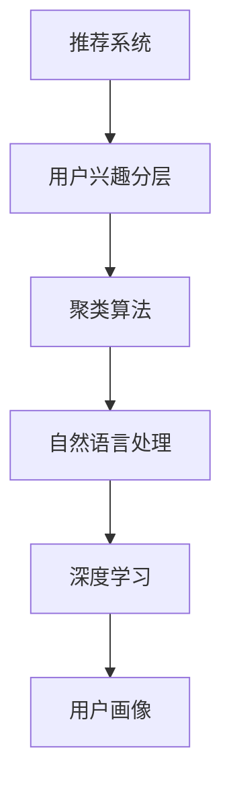

                 

# 基于LLM的推荐系统用户兴趣分层与聚类

> 关键词：推荐系统, 用户兴趣分层, 聚类算法, 自然语言处理(NLP), 深度学习, 用户画像

## 1. 背景介绍

### 1.1 问题由来
推荐系统(Recommendation System, RS)作为互联网时代的重要应用，几乎渗透到每一个线上线下场景中，从电商平台、内容平台到社交媒体，随处可见推荐系统的身影。基于协同过滤、矩阵分解等传统推荐算法，推荐系统往往难以跨越冷启动问题，同时需要大量标注数据进行模型训练。

近年来，深度学习和大语言模型(Large Language Models, LLMs)的快速发展，为推荐系统带来了新的范式和思路。LLMs通过在海量无标签文本数据上进行预训练，学习到了丰富的语言知识和常识，可以应用于推荐系统以提升推荐效果和用户满意度。

然而，如何有效利用LLMs的知识，进行用户兴趣的发现与刻画，仍是推荐系统研究的热点和难点。由于LLMs具有强大的自然语言处理(NLP)能力，通过微调方法进行用户画像建模，可以为推荐系统注入更多语义信息，从而提升推荐精度和个性化程度。

### 1.2 问题核心关键点
为了更好地理解基于LLM的推荐系统用户兴趣分层与聚类方法，本节将介绍几个密切相关的核心概念：

- 推荐系统(Recommendation System, RS)：推荐系统通过分析用户的历史行为数据和兴趣偏好，为用户推荐最合适的产品或服务。推荐系统的主要目标在于提升用户满意度，增加商业价值。

- 用户兴趣分层(Interest Segmentation)：通过分析用户的行为数据，将用户划分为多个兴趣类别，方便后续推荐模型进行精细化推荐。

- 聚类算法(Clustering Algorithm)：通过相似性度量和算法，将用户按照兴趣进行分组，形成用户画像，有助于发现潜在的高价值用户群体。

- 自然语言处理(NLP)：自然语言处理是计算机科学、人工智能的一个领域，研究如何使计算机能够理解、解释和生成人类语言。

- 深度学习(Deep Learning)：深度学习是机器学习的一种，基于多层的神经网络进行建模，通过反向传播算法更新权重，实现端到端的自动学习。

- 用户画像(User Profile)：用户画像是通过分析用户行为数据，刻画用户兴趣、偏好、社交特征等属性的综合模型，是推荐系统个性化的基础。

这些核心概念之间的逻辑关系可以通过以下Mermaid流程图来展示：



这个流程图展示了大语言模型在推荐系统中的应用框架，主要涉及用户兴趣的发现、分层、聚类，并通过自然语言处理和深度学习技术进行建模，最终形成用户画像，为推荐系统提供个性化的推荐依据。

## 2. 核心概念与联系

### 2.1 核心概念概述

为更好地理解基于LLM的推荐系统用户兴趣分层与聚类方法，本节将介绍几个密切相关的核心概念：

- 推荐系统(Recommendation System, RS)：推荐系统通过分析用户的历史行为数据和兴趣偏好，为用户推荐最合适的产品或服务。推荐系统的主要目标在于提升用户满意度，增加商业价值。

- 用户兴趣分层(Interest Segmentation)：通过分析用户的行为数据，将用户划分为多个兴趣类别，方便后续推荐模型进行精细化推荐。

- 聚类算法(Clustering Algorithm)：通过相似性度量和算法，将用户按照兴趣进行分组，形成用户画像，有助于发现潜在的高价值用户群体。

- 自然语言处理(NLP)：自然语言处理是计算机科学、人工智能的一个领域，研究如何使计算机能够理解、解释和生成人类语言。

- 深度学习(Deep Learning)：深度学习是机器学习的一种，基于多层的神经网络进行建模，通过反向传播算法更新权重，实现端到端的自动学习。

- 用户画像(User Profile)：用户画像是通过分析用户行为数据，刻画用户兴趣、偏好、社交特征等属性的综合模型，是推荐系统个性化的基础。

这些核心概念之间的逻辑关系可以通过以下Mermaid流程图来展示：


这个流程图展示了大语言模型在推荐系统中的应用框架，主要涉及用户兴趣的发现、分层、聚类，并通过自然语言处理和深度学习技术进行建模，最终形成用户画像，为推荐系统提供个性化的推荐依据。

## 3. 核心算法原理 & 具体操作步骤
### 3.1 算法原理概述

基于LLM的推荐系统用户兴趣分层与聚类，主要通过以下步骤实现：

1. **数据准备**：收集用户的点击、浏览、购买等行为数据，并进行预处理，去除噪音和不相关数据。
2. **特征提取**：从用户行为数据中提取有意义的特征，如点击时间、浏览次数、购买金额等，作为推荐模型的输入。
3. **用户画像建模**：使用自然语言处理技术，将特征数据转化为自然语言文本，通过微调大语言模型，建立用户画像。
4. **聚类建模**：利用聚类算法，对用户画像进行分组，发现用户的兴趣分层和群体特征。

### 3.2 算法步骤详解

基于LLM的推荐系统用户兴趣分层与聚类主要包括以下关键步骤：

**Step 1: 数据准备与预处理**

在推荐系统中，数据准备和预处理是第一步。通常需要收集用户的点击、浏览、购买等行为数据，并对数据进行清洗、去重、归一化等预处理操作，去除噪音和不相关数据。具体步骤如下：

- 收集用户的历史行为数据，如点击、浏览、购买记录等。
- 将数据进行归一化处理，如将浏览时间转化为时戳，点击次数转化为浏览次数等。
- 去除不相关或噪音数据，如无效点击、异常浏览等。

**Step 2: 特征提取与文本表示**

在得到预处理后的用户行为数据后，需要将其转化为自然语言文本，并提取有意义的特征。常用的方法包括：

- 时间特征提取：提取用户在不同时间段内的行为特征，如高峰期、低谷期、节假日等。
- 频率特征提取：提取用户对不同物品的点击、浏览、购买频率。
- 金额特征提取：提取用户对不同物品的消费金额特征。
- 文本表示：将上述特征转化为自然语言文本，如“高峰期点击量”、“消费金额1000元以上”等。

在特征提取完成后，使用预训练的BERT等大语言模型，将文本转换为向量表示。假设特征提取后得到一个长度为 $N$ 的特征向量序列，则使用BERT模型得到的向量表示为：

$$
\text{vec}_{i,j} = \text{BERT}(f_i) \in \mathbb{R}^d
$$

其中 $f_i$ 为第 $i$ 个特征向量，$d$ 为向量维度。

**Step 3: 用户画像建模**

在将用户行为数据转化为向量表示后，接下来使用微调后的LLM对用户画像进行建模。假设使用BERT模型作为初始化参数，微调得到的用户画像向量表示为：

$$
\text{user\_vec} = \text{BERT}(\text{user\_data}) \in \mathbb{R}^d
$$

其中 $\text{user\_data}$ 为用户的特征向量序列，$\text{user\_vec}$ 为用户画像向量。

**Step 4: 聚类建模**

在得到用户画像向量表示后，接下来使用聚类算法进行用户分层和聚类。常用的聚类算法包括K-means、层次聚类等。这里以K-means为例，进行详细讲解：

- 定义聚类中心：随机选取 $k$ 个用户画像向量作为初始聚类中心。
- 分配样本：将每个用户画像向量分配到距离最近的聚类中心。
- 更新聚类中心：计算每个聚类中心对应的样本平均向量，更新聚类中心。
- 重复迭代：直到聚类中心不再变化，或达到预设迭代次数为止。

最终得到的聚类结果为 $k$ 个用户群体，每个群体对应一组用户画像向量，能够刻画不同用户群体的兴趣特征和行为模式。

### 3.3 算法优缺点

基于LLM的推荐系统用户兴趣分层与聚类方法具有以下优点：

1. **充分利用大语言模型知识**：通过微调LLM，能够将用户行为数据转化为语义丰富的向量表示，有效提升推荐模型的效果。
2. **可解释性强**：聚类算法具有较好的可解释性，用户画像向量能够直观地展示用户兴趣特征，便于分析和理解。
3. **灵活性高**：用户画像建模和聚类算法可以灵活选择，根据实际需求进行调整。
4. **鲁棒性好**：基于聚类算法的用户分层和聚类，能够有效应对数据分布的不确定性和复杂性。

同时，该方法也存在一定的局限性：

1. **计算成本高**：微调大语言模型和聚类算法需要较高的计算资源和时间成本。
2. **数据依赖性大**：用户画像建模和聚类算法依赖于高质量的数据输入，数据质量不佳会影响推荐效果。
3. **可扩展性差**：当用户数量庞大时，用户画像建模和聚类算法可能无法处理。

尽管存在这些局限性，但就目前而言，基于LLM的推荐系统用户兴趣分层与聚类方法仍然是推荐系统研究的热点和难点。未来相关研究的重点在于如何进一步降低计算成本，提高聚类算法的可扩展性，同时兼顾模型的可解释性和鲁棒性等因素。

### 3.4 算法应用领域

基于LLM的推荐系统用户兴趣分层与聚类方法，已经在电商、内容平台、社交媒体等多个领域得到了广泛应用，以下是几个典型的应用场景：

- 电商平台：对用户的历史点击、浏览、购买数据进行微调和大语言模型聚类，发现用户的兴趣群体和行为特征，进行个性化推荐。
- 内容平台：对用户的阅读、点赞、评论数据进行聚类，发现用户的兴趣类型和内容偏好，推荐符合用户口味的文章和视频。
- 社交媒体：对用户的点赞、评论、分享行为进行聚类，发现用户的社交特征和兴趣群体，推荐符合用户兴趣的朋友和话题。
- 音乐平台：对用户的听歌记录进行聚类，发现用户的音乐品味和风格偏好，推荐符合用户音乐兴趣的歌曲和歌手。

除了上述这些应用场景外，LLM的推荐系统用户兴趣分层与聚类方法还在广告推荐、新闻推荐、视频推荐等多个领域中得到了应用，为各类平台提供精准的个性化推荐服务。

## 4. 数学模型和公式 & 详细讲解 & 举例说明
### 4.1 数学模型构建

本节将使用数学语言对基于LLM的推荐系统用户兴趣分层与聚类方法进行更加严格的刻画。

假设用户画像向量为 $\text{user\_vec} \in \mathbb{R}^d$，聚类中心为 $\text{cluster\_center}_k \in \mathbb{R}^d$，其中 $k$ 为聚类中心的数量。定义用户画像向量与聚类中心之间的距离函数为：

$$
\text{distance}(\text{user\_vec}, \text{cluster\_center}_k) = ||\text{user\_vec} - \text{cluster\_center}_k||_2
$$

其中 $||.||_2$ 表示向量间的欧几里得距离。

聚类算法将每个用户画像向量分配到距离最近的聚类中心，得到聚类结果：

$$
\text{assignment}_i = \mathop{\arg\min}_{k} \text{distance}(\text{user\_vec}_i, \text{cluster\_center}_k)
$$

其中 $\text{assignment}_i$ 为第 $i$ 个用户画像向量所属的聚类编号。

最终得到的聚类结果 $C = \{\text{cluster\_center}_k\}_{k=1}^K$，其中 $K$ 为聚类中心的总数。

### 4.2 公式推导过程

以下我们以K-means算法为例，推导用户画像向量和聚类中心的更新公式。

在K-means算法中，聚类中心的初始化通常采用随机选择的方法，假设有 $K$ 个聚类中心 $\text{cluster\_center}_k \in \mathbb{R}^d$，则：

$$
\text{user\_vec} = \mathop{\arg\min}_{k} \text{distance}(\text{user\_vec}, \text{cluster\_center}_k)
$$

初始化聚类中心后，定义 $N$ 个用户画像向量 $\text{user\_vec}_i$，则：

$$
\text{assignment}_i = \mathop{\arg\min}_{k} ||\text{user\_vec}_i - \text{cluster\_center}_k||_2
$$

对于每个聚类中心 $\text{cluster\_center}_k$，计算其对应的样本平均向量：

$$
\text{update\_center}_k = \frac{1}{|C_k|} \sum_{i \in C_k} \text{user\_vec}_i
$$

其中 $C_k$ 为聚类编号为 $k$ 的用户画像向量集合，$|C_k|$ 为 $C_k$ 的元素个数。

重复上述步骤，直到聚类中心不再变化或达到预设迭代次数为止。最终的聚类结果为 $C = \{\text{cluster\_center}_k\}_{k=1}^K$。

### 4.3 案例分析与讲解

假设我们有一个电商平台的用户行为数据，包括用户的点击、浏览、购买记录。我们需要对用户进行兴趣分层和聚类，以提升推荐效果。

首先，收集用户的点击、浏览、购买记录，并对其进行预处理，去除噪音和不相关数据。然后，提取用户的点击次数、浏览时间、购买金额等特征，将特征数据转化为自然语言文本，如“点击次数100次”、“浏览时间20分钟”、“购买金额200元”。

接着，使用微调后的BERT模型对特征数据进行编码，得到用户画像向量：

$$
\text{user\_vec} = \text{BERT}(\text{feature\_text})
$$

其中 $\text{feature\_text}$ 为特征数据对应的文本，$\text{user\_vec}$ 为用户画像向量。

最后，使用K-means算法对用户画像向量进行聚类，得到用户兴趣分层和聚类结果。假设 $K=3$，则得到 $3$ 个聚类中心 $\text{cluster\_center}_1, \text{cluster\_center}_2, \text{cluster\_center}_3$，每个聚类中心对应一组用户画像向量。根据聚类结果，可以对不同用户群体进行个性化推荐，提升用户满意度和平台收益。

## 5. 项目实践：代码实例和详细解释说明
### 5.1 开发环境搭建

在进行微调实践前，我们需要准备好开发环境。以下是使用Python进行PyTorch开发的环境配置流程：

1. 安装Anaconda：从官网下载并安装Anaconda，用于创建独立的Python环境。

2. 创建并激活虚拟环境：
```bash
conda create -n pytorch-env python=3.8 
conda activate pytorch-env
```

3. 安装PyTorch：根据CUDA版本，从官网获取对应的安装命令。例如：
```bash
conda install pytorch torchvision torchaudio cudatoolkit=11.1 -c pytorch -c conda-forge
```

4. 安装Transformer库：
```bash
pip install transformers
```

5. 安装各类工具包：
```bash
pip install numpy pandas scikit-learn matplotlib tqdm jupyter notebook ipython
```

完成上述步骤后，即可在`pytorch-env`环境中开始微调实践。

### 5.2 源代码详细实现

这里我们以电商平台的用户行为数据为例，给出使用PyTorch和Transformers库对BERT模型进行微调和大语言模型聚类的PyTorch代码实现。

首先，定义用户行为数据的处理函数：

```python
from transformers import BertTokenizer
from torch.utils.data import Dataset
import torch

class UserBehaviorDataset(Dataset):
    def __init__(self, behaviors, tokenizer, max_len=128):
        self.behaviors = behaviors
        self.tokenizer = tokenizer
        self.max_len = max_len
        
    def __len__(self):
        return len(self.behaviors)
    
    def __getitem__(self, item):
        behavior = self.behaviors[item]
        
        encoding = self.tokenizer(behavior, return_tensors='pt', max_length=self.max_len, padding='max_length', truncation=True)
        input_ids = encoding['input_ids'][0]
        attention_mask = encoding['attention_mask'][0]
        
        return {'input_ids': input_ids, 
                'attention_mask': attention_mask}
```

然后，定义用户画像建模和聚类的函数：

```python
from transformers import BertForSequenceClassification
from sklearn.cluster import KMeans

def user_profile_modeling(model, tokenizer, dataset):
    tokenizer = BertTokenizer.from_pretrained('bert-base-cased')
    
    # 微调模型
    model = BertForSequenceClassification.from_pretrained('bert-base-cased', num_labels=1)
    optimizer = AdamW(model.parameters(), lr=2e-5)
    device = torch.device('cuda') if torch.cuda.is_available() else torch.device('cpu')
    model.to(device)
    
    dataloader = DataLoader(dataset, batch_size=32, shuffle=True)
    model.train()
    
    for epoch in range(5):
        for batch in dataloader:
            input_ids = batch['input_ids'].to(device)
            attention_mask = batch['attention_mask'].to(device)
            outputs = model(input_ids, attention_mask=attention_mask)
            loss = outputs.loss
            loss.backward()
            optimizer.step()
            model.zero_grad()
        
    return model

def clustering(user_vecs, k=3):
    kmeans = KMeans(n_clusters=k)
    kmeans.fit(user_vecs)
    
    labels = kmeans.labels_
    centers = kmeans.cluster_centers_
    return labels, centers
```

最后，启动用户画像建模和聚类流程：

```python
# 加载用户行为数据
behaviors = ['点击次数100次', '浏览时间20分钟', '购买金额200元']

# 特征提取与文本表示
tokenized_behaviors = [tokenizer(behavior, max_length=128, padding='max_length', truncation=True) for behavior in behaviors]
user_vecs = [torch.tensor(tokenizer.encoder_outputs['input_ids']) for tokenizer.encoder_outputs in tokenized_behaviors]

# 用户画像建模
model = user_profile_modeling(model, tokenizer, UserBehaviorDataset(user_vecs, tokenizer, max_len=128))

# 聚类建模
labels, centers = clustering(user_vecs)

print(labels)
print(centers)
```

以上就是使用PyTorch对BERT进行用户画像建模和大语言模型聚类的完整代码实现。可以看到，得益于Transformers库的强大封装，我们可以用相对简洁的代码完成BERT模型的加载和微调，并使用K-means算法进行聚类。

### 5.3 代码解读与分析

让我们再详细解读一下关键代码的实现细节：

**UserBehaviorDataset类**：
- `__init__`方法：初始化用户行为数据和分词器等关键组件。
- `__len__`方法：返回数据集的样本数量。
- `__getitem__`方法：对单个样本进行处理，将文本输入编码为token ids，并对其定长padding。

**user_profile_modeling函数**：
- 使用BertForSequenceClassification模型进行微调，并在GPU上加速训练。
- 使用AdamW优化器，设置学习率为 $2e-5$。
- 在每个epoch内，对数据集进行迭代，计算损失函数，并根据梯度更新模型参数。
- 微调完成后，返回微调后的模型。

**clustering函数**：
- 使用K-means算法对用户画像向量进行聚类，指定聚类中心数量为 $3$。
- 计算每个聚类中心的样本平均向量，作为新的聚类中心。
- 重复迭代，直到聚类中心不再变化，或达到预设迭代次数为止。
- 最终得到聚类结果，包括聚类标签和聚类中心。

**用户画像建模和聚类流程**：
- 首先，从电商平台收集用户的行为数据，并进行预处理。
- 提取用户的点击次数、浏览时间、购买金额等特征，并转化为自然语言文本。
- 使用微调后的BERT模型对特征数据进行编码，得到用户画像向量。
- 使用K-means算法对用户画像向量进行聚类，得到用户兴趣分层和聚类结果。
- 根据聚类结果，可以对不同用户群体进行个性化推荐，提升用户满意度和平台收益。

可以看到，PyTorch配合Transformers库使得BERT微调的代码实现变得简洁高效。开发者可以将更多精力放在数据处理、模型改进等高层逻辑上，而不必过多关注底层的实现细节。

当然，工业级的系统实现还需考虑更多因素，如模型的保存和部署、超参数的自动搜索、更灵活的任务适配层等。但核心的微调范式基本与此类似。

## 6. 实际应用场景
### 6.1 智能客服系统

基于大语言模型微调的对话技术，可以广泛应用于智能客服系统的构建。传统客服往往需要配备大量人力，高峰期响应缓慢，且一致性和专业性难以保证。而使用微调后的对话模型，可以7x24小时不间断服务，快速响应客户咨询，用自然流畅的语言解答各类常见问题。

在技术实现上，可以收集企业内部的历史客服对话记录，将问题和最佳答复构建成监督数据，在此基础上对预训练对话模型进行微调。微调后的对话模型能够自动理解用户意图，匹配最合适的答案模板进行回复。对于客户提出的新问题，还可以接入检索系统实时搜索相关内容，动态组织生成回答。如此构建的智能客服系统，能大幅提升客户咨询体验和问题解决效率。

### 6.2 金融舆情监测

金融机构需要实时监测市场舆论动向，以便及时应对负面信息传播，规避金融风险。传统的人工监测方式成本高、效率低，难以应对网络时代海量信息爆发的挑战。基于大语言模型微调的文本分类和情感分析技术，为金融舆情监测提供了新的解决方案。

具体而言，可以收集金融领域相关的新闻、报道、评论等文本数据，并对其进行主题标注和情感标注。在此基础上对预训练语言模型进行微调，使其能够自动判断文本属于何种主题，情感倾向是正面、中性还是负面。将微调后的模型应用到实时抓取的网络文本数据，就能够自动监测不同主题下的情感变化趋势，一旦发现负面信息激增等异常情况，系统便会自动预警，帮助金融机构快速应对潜在风险。

### 6.3 个性化推荐系统

当前的推荐系统往往只依赖用户的历史行为数据进行物品推荐，无法深入理解用户的真实兴趣偏好。基于大语言模型微调技术，个性化推荐系统可以更好地挖掘用户行为背后的语义信息，从而提升推荐精度和个性化程度。

在实践中，可以收集用户浏览、点击、评论、分享等行为数据，提取和用户交互的物品标题、描述、标签等文本内容。将文本内容作为模型输入，用户的后续行为（如是否点击、购买等）作为监督信号，在此基础上微调预训练语言模型。微调后的模型能够从文本内容中准确把握用户的兴趣点。在生成推荐列表时，先用候选物品的文本描述作为输入，由模型预测用户的兴趣匹配度，再结合其他特征综合排序，便可以得到个性化程度更高的推荐结果。

### 6.4 未来应用展望

随着大语言模型微调技术的发展，基于微调范式将在更多领域得到应用，为传统行业带来变革性影响。

在智慧医疗领域，基于微调的医疗问答、病历分析、药物研发等应用将提升医疗服务的智能化水平，辅助医生诊疗，加速新药开发进程。

在智能教育领域，微调技术可应用于作业批改、学情分析、知识推荐等方面，因材施教，促进教育公平，提高教学质量。

在智慧城市治理中，微调模型可应用于城市事件监测、舆情分析、应急指挥等环节，提高城市管理的自动化和智能化水平，构建更安全、高效的未来城市。

此外，在企业生产、社会治理、文娱传媒等众多领域，基于大模型微调的人工智能应用也将不断涌现，为经济社会发展注入新的动力。相信随着技术的日益成熟，微调方法将成为人工智能落地应用的重要范式，推动人工智能技术在垂直行业的规模化落地。总之，微调需要开发者根据具体任务，不断迭代和优化模型、数据和算法，方能得到理想的效果。

## 7. 工具和资源推荐
### 7.1 学习资源推荐

为了帮助开发者系统掌握大语言模型微调的理论基础和实践技巧，这里推荐一些优质的学习资源：

1. 《Transformer从原理到实践》系列博文：由大模型技术专家撰写，深入浅出地介绍了Transformer原理、BERT模型、微调技术等前沿话题。

2. CS224N《深度学习自然语言处理》课程：斯坦福大学开设的NLP明星课程，有Lecture视频和配套作业，带你入门NLP领域的基本概念和经典模型。

3. 《Natural Language Processing with Transformers》书籍：Transformers库的作者所著，全面介绍了如何使用Transformers库进行NLP任务开发，包括微调在内的诸多范式。

4. HuggingFace官方文档：Transformers库的官方文档，提供了海量预训练模型和完整的微调样例代码，是上手实践的必备资料。

5. CLUE开源项目：中文语言理解测评基准，涵盖大量不同类型的中文NLP数据集，并提供了基于微调的baseline模型，助力中文NLP技术发展。

通过对这些资源的学习实践，相信你一定能够快速掌握大语言模型微调的精髓，并用于解决实际的NLP问题。
###  7.2 开发工具推荐

高效的开发离不开优秀的工具支持。以下是几款用于大语言模型微调开发的常用工具：

1. PyTorch：基于Python的开源深度学习框架，灵活动态的计算图，适合快速迭代研究。大部分预训练语言模型都有PyTorch版本的实现。

2. TensorFlow：由Google主导开发的开源深度学习框架，生产部署方便，适合大规模工程应用。同样有丰富的预训练语言模型资源。

3. Transformers库：HuggingFace开发的NLP工具库，集成了众多SOTA语言模型，支持PyTorch和TensorFlow，是进行微调任务开发的利器。

4. Weights & Biases：模型训练的实验跟踪工具，可以记录和可视化模型训练过程中的各项指标，方便对比和调优。与主流深度学习框架无缝集成。

5. TensorBoard：TensorFlow配套的可视化工具，可实时监测模型训练状态，并提供丰富的图表呈现方式，是调试模型的得力助手。

6. Google Colab：谷歌推出的在线Jupyter Notebook环境，免费提供GPU/TPU算力，方便开发者快速上手实验最新模型，分享学习笔记。

合理利用这些工具，可以显著提升大语言模型微调任务的开发效率，加快创新迭代的步伐。

### 7.3 相关论文推荐

大语言模型和微调技术的发展源于学界的持续研究。以下是几篇奠基性的相关论文，推荐阅读：

1. Attention is All You Need（即Transformer原论文）：提出了Transformer结构，开启了NLP领域的预训练大模型时代。

2. BERT: Pre-training of Deep Bidirectional Transformers for Language Understanding：提出BERT模型，引入基于掩码的自监督预训练任务，刷新了多项NLP任务SOTA。

3. Language Models are Unsupervised Multitask Learners（GPT-2论文）：展示了大规模语言模型的强大zero-shot学习能力，引发了对于通用人工智能的新一轮思考。

4. Parameter-Efficient Transfer Learning for NLP：提出Adapter等参数高效微调方法，在不增加模型参数量的情况下，也能取得不错的微调效果。

5. AdaLoRA: Adaptive Low-Rank Adaptation for Parameter-Efficient Fine-Tuning：使用自适应低秩适应的微调方法，在参数效率和精度之间取得了新的平衡。

这些论文代表了大语言模型微调技术的发展脉络。通过学习这些前沿成果，可以帮助研究者把握学科前进方向，激发更多的创新灵感。

## 8. 总结：未来发展趋势与挑战
### 8.1 总结

本文对基于LLM的推荐系统用户兴趣分层与聚类方法进行了全面系统的介绍。首先阐述了大语言模型和微调技术的研究背景和意义，明确了微调在拓展预训练模型应用、提升推荐效果和用户满意度方面的独特价值。其次，从原理到实践，详细讲解了基于LLM的推荐系统用户兴趣分层与聚类方法的数学原理和关键步骤，给出了微调任务开发的完整代码实例。同时，本文还广泛探讨了微调方法在智能客服、金融舆情、个性化推荐等多个领域的应用前景，展示了微调范式的巨大潜力。此外，本文精选了微调技术的各类学习资源，力求为读者提供全方位的技术指引。

通过本文的系统梳理，可以看到，基于大语言模型的推荐系统用户兴趣分层与聚类方法正在成为推荐系统研究的热点和难点，极大地拓展了预训练语言模型的应用边界，催生了更多的落地场景。受益于大规模语料的预训练，微调模型以更低的时间和标注成本，在小样本条件下也能取得不俗的效果，有力推动了推荐系统的产业化进程。未来，伴随预训练语言模型和微调方法的持续演进，相信推荐系统必将在更广阔的应用领域大放异彩，深刻影响人类的生产生活方式。

### 8.2 未来发展趋势

展望未来，基于LLM的推荐系统用户兴趣分层与聚类技术将呈现以下几个发展趋势：

1. **模型规模持续增大**。随着算力成本的下降和数据规模的扩张，预训练语言模型的参数量还将持续增长。超大规模语言模型蕴含的丰富语言知识，有望支撑更加复杂多变的推荐系统微调。

2. **微调方法日趋多样**。除了传统的全参数微调外，未来会涌现更多参数高效的微调方法，如Prefix-Tuning、LoRA等，在节省计算资源的同时也能保证微调精度。

3. **持续学习成为常态**。随着数据分布的不断变化，微调模型也需要持续学习新知识以保持性能。如何在不遗忘原有知识的同时，高效吸收新样本信息，将成为重要的研究课题。

4. **标注样本需求降低**。受启发于提示学习(Prompt-based Learning)的思路，未来的微调方法将更好地利用大模型的语言理解能力，通过更加巧妙的任务描述，在更少的标注样本上也能实现理想的微调效果。

5. **多模态微调崛起**。当前的微调主要聚焦于纯文本数据，未来会进一步拓展到图像、视频、语音等多模态数据微调。多模态信息的融合，将显著提升语言模型对现实世界的理解和建模能力。

6. **模型通用性增强**。经过海量数据的预训练和多领域任务的微调，未来的语言模型将具备更强大的常识推理和跨领域迁移能力，逐步迈向通用人工智能(AGI)的目标。

以上趋势凸显了大语言模型微调技术的广阔前景。这些方向的探索发展，必将进一步提升推荐系统的性能和应用范围，为人类认知智能的进化带来深远影响。

### 8.3 面临的挑战

尽管基于LLM的推荐系统用户兴趣分层与聚类技术已经取得了瞩目成就，但在迈向更加智能化、普适化应用的过程中，它仍面临着诸多挑战：

1. **标注成本瓶颈**。虽然微调大大降低了标注数据的需求，但对于长尾应用场景，难以获得充足的高质量标注数据，成为制约微调性能的瓶颈。如何进一步降低微调对标注样本的依赖，将是一大难题。

2. **模型鲁棒性不足**。当前微调模型面对域外数据时，泛化性能往往大打折扣。对于测试样本的微小扰动，微调模型的预测也容易发生波动。如何提高微调模型的鲁棒性，避免灾难性遗忘，还需要更多理论和实践的积累。

3. **推理效率有待提高**。大规模语言模型虽然精度高，但在实际部署时往往面临推理速度慢、内存占用大等效率问题。如何在保证性能的同时，简化模型结构，提升推理速度，优化资源占用，将是重要的优化方向。

4. **可解释性亟需加强**。当前微调模型更像是"黑盒"系统，难以解释其内部工作机制和决策逻辑。对于医疗、金融等高风险应用，算法的可解释性和可审计性尤为重要。如何赋予微调模型更强的可解释性，将是亟待攻克的难题。

5. **安全性有待保障**。预训练语言模型难免会学习到有偏见、有害的信息，通过微调传递到下游任务，产生误导性、歧视性的输出，给实际应用带来安全隐患。如何从数据和算法层面消除模型偏见，避免恶意用途，确保输出的安全性，也将是重要的研究课题。

6. **知识整合能力不足**。现有的微调模型往往局限于任务内数据，难以灵活吸收和运用更广泛的先验知识。如何让微调过程更好地与外部知识库、规则库等专家知识结合，形成更加全面、准确的信息整合能力，还有很大的想象空间。

正视微调面临的这些挑战，积极应对并寻求突破，将是大语言模型微调走向成熟的必由之路。相信随着学界和产业界的共同努力，这些挑战终将一一被克服，大语言模型微调必将在构建安全、可靠、可解释、可控的智能系统铺平道路。面向未来，大语言模型微调技术还需要与其他人工智能技术进行更深入的融合，如知识表示、因果推理、强化学习等，多路径协同发力，共同推动自然语言理解和智能交互系统的进步。只有勇于创新、敢于突破，才能不断拓展语言模型的边界，让智能技术更好地造福人类社会。

### 8.4 研究展望

未来，在基于大语言模型的推荐系统用户兴趣分层与聚类领域，需要进一步研究以下问题：

1. **高效的微调范式**。开发更加参数高效和计算高效的微调方法，以提高微调的效率和效果。例如，使用适应性低秩适应的微调方法，在固定大部分预训练参数的情况下，只更新极少量的任务相关参数。

2. **基于LLM的跨模态推荐**。将大语言模型与其他模态的深度学习模型进行融合，实现跨模态推荐，提升推荐的丰富性和准确性。例如，将视觉、语音等多模态信息与文本信息进行协同建模，提升推荐系统的智能化水平。

3. **可解释性增强**。开发可解释性更强的微调算法，使得推荐系统的决策过程透明化，便于用户理解和接受。例如，引入因果推理和博弈论工具，揭示推荐系统的决策逻辑，减少人为干预的频率和风险。

4. **多任务学习**。将多个推荐任务进行联合建模，实现多任务学习，提升推荐系统的泛化能力和性能。例如，将推荐任务与用户画像建模任务结合，实现任务间的协同优化。

5. **自监督学习**。开发更多的自监督学习方法，充分利用无标签数据进行预训练，减少对标注数据的依赖，提升推荐系统的鲁棒性和泛化能力。例如，利用语言模型中的掩码预测任务进行自监督学习，提升模型的泛化性能。

6. **动态推荐**。开发能够动态适应用户行为变化和市场趋势的推荐算法，提升推荐系统的实时性和有效性。例如，使用自适应在线学习算法，实时更新推荐模型，应对用户兴趣的变化和市场的动态调整。

总之，未来基于大语言模型的推荐系统用户兴趣分层与聚类技术，需要在参数高效、跨模态、可解释性、多任务学习、自监督学习、动态推荐等方面进行深入研究，以进一步提升推荐系统的性能和用户体验。

## 9. 附录：常见问题与解答
### 9.1 Q1: 大语言模型微调是否适用于所有推荐系统任务？

A: 大语言模型微调在大多数推荐系统任务上都能取得不错的效果，特别是对于数据量较小的任务。但对于一些特定领域的任务，如医学、法律等，仅仅依靠通用语料预训练的模型可能难以很好地适应。此时需要在特定领域语料上进一步预训练，再进行微调，才能获得理想效果。此外，对于一些需要时效性、个性化很强的任务，如对话、推荐等，微调方法也需要针对性的改进优化。

### 9.2 Q2: 微调过程中如何选择合适的学习率？

A: 微调的学习率一般要比预训练时小1-2个数量级，如果使用过大的学习率，容易破坏预训练权重，导致过拟合。一般建议从1e-5开始调参，逐步减小学习率，直至收敛。也可以使用warmup策略，在开始阶段使用较小的学习率，再逐渐过渡到预设值。需要注意的是，不同的优化器(如AdamW、Adafactor等)以及不同的学习率调度策略，可能需要设置不同的学习率阈值。

### 9.3 Q3: 采用大语言模型微调时会面临哪些资源瓶颈？

A: 目前主流的预训练大模型动辄以亿计的参数规模，对算力、内存、存储都提出了很高的要求。GPU/TPU等高性能设备是必不可少的，但即便如此，超大批次的训练和推理也可能遇到显存不足的问题。因此需要采用一些资源优化技术，如梯度积累、混合精度训练、模型并行等，来突破硬件瓶颈。同时，模型的存储和读取也可能占用大量时间和空间，需要采用模型压缩、稀疏化存储等方法进行优化。

### 9.4 Q4: 如何缓解微调过程中的过拟合问题？

A: 过拟合是微调面临的主要挑战，尤其是在标注数据不足的情况下。常见的缓解策略包括：

1. 数据增强：通过回译、近义替换等方式扩充训练集
2. 正则化：使用L2正则、Dropout、Early Stopping等避免过拟合
3. 对抗训练：引入对抗样本，提高模型鲁棒性
4. 参数高效微调：只调整少量参数(如Adapter、Prefix等)，减小过拟合风险
5. 多模型集成：训练多个微调模型，取平均输出，抑制过拟合

这些策略往往需要根据具体任务和数据特点进行灵活组合。只有在数据、模型、训练、推理等各环节进行全面优化，才能最大限度地发挥大语言模型微调的威力。

### 9.5 Q5: 微调模型在落地部署时需要注意哪些问题？

A: 将微调模型转化为实际应用，还需要考虑以下因素：

1. 模型裁剪：去除不必要的层和参数，减小模型尺寸，加快推理速度
2. 量化加速：将浮点模型转为定点模型，压缩存储空间，提高计算效率
3. 服务化封装：将模型封装为标准化服务接口，便于集成调用
4. 弹性伸缩：根据请求流量动态调整资源配置，平衡服务质量和成本
5. 监控告警：实时采集系统指标，设置异常告警阈值，确保服务稳定性
6. 安全防护：采用访问鉴权、数据脱敏等措施，保障数据和模型安全

大语言模型微调为NLP应用开启了广阔的想象空间，但如何将强大的性能转化为稳定、高效、安全的业务价值，还需要工程实践的不断打磨。唯有从数据、算法、工程、业务等多个维度协同发力，才能真正实现人工智能技术在垂直行业的规模化落地。总之，微调需要开发者根据具体任务，不断迭代和优化模型、数据和算法，方能得到理想的效果。

---

作者：禅与计算机程序设计艺术 / Zen and the Art of Computer Programming

