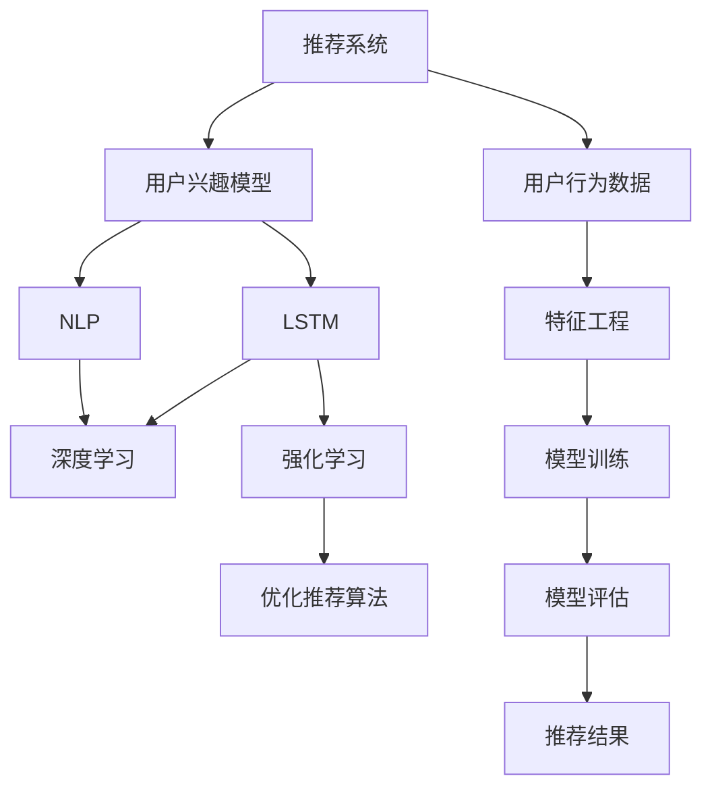

                 

# 基于LLM的推荐系统用户兴趣动态捕捉

> 关键词：推荐系统, 用户兴趣, 动态捕捉, 长短期记忆网络(LSTM), 自然语言处理(NLP), 深度学习, 强化学习

## 1. 背景介绍

### 1.1 问题由来
随着互联网的快速发展和普及，推荐系统逐渐成为互联网公司和平台标配，成为用户获取信息、发现商品的重要工具。然而，传统的推荐系统基于静态的用户兴趣模型，无法捕捉用户兴趣的动态变化，导致推荐效果在用户行为变化的情况下大幅下降。为了解决这个问题，很多研究者提出了基于长短期记忆网络(LSTM)的推荐系统，可以动态捕捉用户的兴趣变化，增强推荐效果。

### 1.2 问题核心关键点
本问题关注如何利用大语言模型(LLM)构建推荐系统，动态捕捉用户兴趣的变化，从而提升推荐系统的效果。该问题具有以下关键点：

1. 用户兴趣模型：如何动态捕捉用户兴趣的变化？
2. 长短期记忆网络(LSTM)：如何结合LSTM模型进行用户兴趣建模？
3. 自然语言处理(NLP)：如何利用NLP技术处理用户兴趣数据？
4. 深度学习：如何构建高效的深度学习模型？
5. 强化学习：如何利用强化学习算法优化推荐系统？

### 1.3 问题研究意义
研究基于LLM的推荐系统，对于提升推荐系统的推荐效果、增强用户体验、提高电商平台的转化率具有重要意义：

1. 提高推荐效果：动态捕捉用户兴趣的变化，使得推荐系统能够更准确地预测用户行为。
2. 增强用户体验：个性化推荐能提升用户的满意度和黏性，减少流失率。
3. 提高电商转化率：精准的个性化推荐能提升用户的购买意愿，增加电商平台的收入。
4. 推动技术进步：研究基于LLM的推荐系统，能够推动深度学习、NLP等前沿技术的发展。

## 2. 核心概念与联系

### 2.1 核心概念概述

为更好地理解基于LLM的推荐系统用户兴趣动态捕捉方法，本节将介绍几个密切相关的核心概念：

- 推荐系统：通过分析用户的历史行为和兴趣，为用户推荐最相关的商品或信息。常见的推荐系统包括基于内容的推荐、协同过滤推荐等。
- 用户兴趣模型：表示用户对不同商品的兴趣程度，通常用于构建推荐系统的核心算法。
- 长短期记忆网络(LSTM)：一种能够处理时间序列数据、具有记忆能力的深度神经网络模型。
- 自然语言处理(NLP)：涉及计算机处理人类语言的技术，包括分词、命名实体识别、语义分析等。
- 深度学习：一种基于多层神经网络的人工智能技术，用于处理复杂的非线性关系。
- 强化学习：通过与环境的互动，通过奖惩机制优化模型策略，用于优化推荐系统算法。

这些核心概念之间的逻辑关系可以通过以下Mermaid流程图来展示：



这个流程图展示了推荐系统的核心概念及其之间的关系：

1. 推荐系统以用户行为数据为输入，通过用户兴趣模型分析用户的兴趣，使用LSTM、深度学习、强化学习等技术构建推荐模型。
2. 用户兴趣模型利用NLP技术处理用户行为数据，得到用户对不同商品的兴趣程度。
3. LSTM模型具有时间序列数据的处理能力，能动态捕捉用户兴趣的变化。
4. 深度学习用于构建高效的神经网络模型，提升推荐效果。
5. 强化学习优化推荐算法，提升推荐效果。

这些概念共同构成了基于LLM的推荐系统的框架，使其能够动态捕捉用户兴趣的变化，提升推荐效果。通过理解这些核心概念，我们可以更好地把握推荐系统的核心原理和优化方向。

## 3. 核心算法原理 & 具体操作步骤

### 3.1 算法原理概述

基于LLM的推荐系统用户兴趣动态捕捉方法，核心思想是利用大语言模型预训练获得的知识和语义理解能力，结合LSTM和深度学习技术，动态捕捉用户兴趣的变化，提升推荐效果。

具体而言，该方法主要分为以下几个步骤：

1. 收集用户行为数据，使用NLP技术处理用户行为数据，得到用户对不同商品的兴趣程度。
2. 利用LSTM模型处理用户兴趣的时间序列数据，动态捕捉用户兴趣的变化。
3. 构建深度学习模型，将用户兴趣与商品特征进行匹配，得到推荐结果。
4. 使用强化学习算法优化推荐算法，提升推荐效果。

### 3.2 算法步骤详解

以下是基于LLM的推荐系统用户兴趣动态捕捉的具体步骤：

**Step 1: 数据收集与处理**

- 收集用户历史行为数据，如浏览记录、购买记录、评分记录等。
- 使用NLP技术对用户行为数据进行预处理，包括分词、去除停用词、命名实体识别等。
- 将用户行为数据转化为模型能够处理的向量表示，如将用户对商品的兴趣程度转化为向量。

**Step 2: 用户兴趣建模**

- 利用LSTM模型处理用户兴趣的时间序列数据，捕捉用户兴趣的变化趋势。
- 将用户兴趣向量与商品特征向量进行匹配，得到推荐结果。

**Step 3: 深度学习模型构建**

- 构建深度学习模型，如神经网络、卷积神经网络(CNN)等，对用户兴趣与商品特征进行匹配。
- 将深度学习模型与LSTM模型结合，对用户兴趣进行建模。

**Step 4: 强化学习优化**

- 使用强化学习算法，如Q-learning、Deep Q-learning等，优化推荐算法。
- 通过与环境的互动，不断调整推荐算法，提升推荐效果。

### 3.3 算法优缺点

基于LLM的推荐系统用户兴趣动态捕捉方法具有以下优点：

1. 动态捕捉用户兴趣变化：LSTM模型能够捕捉时间序列数据的动态变化，反映用户兴趣的变化。
2. 提升推荐效果：深度学习模型能够捕捉复杂的非线性关系，提升推荐效果。
3. 增强用户体验：个性化推荐能提升用户的满意度和黏性，减少流失率。
4. 提高电商转化率：精准的个性化推荐能提升用户的购买意愿，增加电商平台的收入。

同时，该方法也存在一定的局限性：

1. 数据依赖性强：推荐系统的效果很大程度上取决于用户行为数据的数量和质量，获取高质量数据成本较高。
2. 模型复杂度高：LSTM和深度学习模型的训练和推理复杂度高，需要高性能设备支持。
3. 可解释性差：深度学习模型的黑盒特性，使得推荐系统的决策过程难以解释。
4. 算法稳定性不足：推荐算法在面对新数据时，容易受到噪声和异常点的影响，导致不稳定。

尽管存在这些局限性，但就目前而言，基于LLM的推荐系统用户兴趣动态捕捉方法仍是目前推荐系统领域的先进范式。未来相关研究的重点在于如何进一步降低推荐系统对用户数据的依赖，提高模型的可解释性和稳定性，同时兼顾推荐效果和计算效率。

### 3.4 算法应用领域

基于LLM的推荐系统用户兴趣动态捕捉方法，在电商、新闻、社交网络等领域均有广泛应用。例如：

1. 电商推荐：通过动态捕捉用户兴趣的变化，为电商用户推荐最相关的商品，提高电商平台的转化率。
2. 新闻推荐：为新闻用户推荐最感兴趣的新闻，提升新闻平台的浏览量和用户黏性。
3. 社交网络：为社交用户推荐最相关的朋友和内容，增强用户的社交体验。

除了这些常见应用外，基于LLM的推荐系统还在在线教育、视频、音乐等领域有创新性应用，为各行业数字化转型提供了新的思路。随着LLM和推荐算法的发展，相信该方法将在更多领域带来变革性影响。

## 4. 数学模型和公式 & 详细讲解

### 4.1 数学模型构建

本节将使用数学语言对基于LLM的推荐系统用户兴趣动态捕捉过程进行更加严格的刻画。

记用户历史行为数据为 $D=\{x_i\}_{i=1}^N$，其中 $x_i=(x_i^1, x_i^2, ..., x_i^T)$ 表示用户对不同商品的历史行为，$x_i^t$ 表示第 $i$ 个用户在第 $t$ 次交互中的行为。假设用户对不同商品的兴趣程度为 $z_i=\{z_i^t\}_{t=1}^T$，其中 $z_i^t$ 表示用户在第 $t$ 次交互中对商品的兴趣程度。将用户兴趣时间序列数据转化为向量表示 $z_i \in \mathbb{R}^T$。

假设商品特征向量为 $w_j \in \mathbb{R}^D$，其中 $D$ 为特征维度。假设深度学习模型的输出为 $\hat{z}_i \in \mathbb{R}^D$，表示用户兴趣的预测向量。

基于LLM的推荐系统的目标是最小化预测误差，即最小化损失函数 $\mathcal{L}$。假设损失函数为均方误差，则目标为：

$$
\mathcal{L} = \frac{1}{N}\sum_{i=1}^N \sum_{t=1}^T (z_i^t - \hat{z}_i) ^2
$$

其中，$z_i^t$ 为用户在第 $t$ 次交互中对商品的兴趣程度，$\hat{z}_i$ 为深度学习模型预测的用户兴趣向量。

### 4.2 公式推导过程

以下我们以基于LSTM的推荐系统为例，推导预测用户兴趣的损失函数及其梯度的计算公式。

假设LSTM模型对用户兴趣的时间序列数据 $z_i$ 进行建模，输出预测向量 $\hat{z}_i$。假设LSTM模型的输入为 $x_i$，输出为 $\hat{z}_i$。LSTM模型的参数为 $\theta$，则LSTM模型的损失函数为：

$$
\mathcal{L} = \frac{1}{N}\sum_{i=1}^N \sum_{t=1}^T (z_i^t - \hat{z}_i) ^2
$$

LSTM模型的输出 $\hat{z}_i$ 可以表示为：

$$
\hat{z}_i = f_{LSTM}(x_i; \theta)
$$

其中 $f_{LSTM}$ 为LSTM模型的前向传播函数。假设LSTM模型的输出向量为 $\hat{z}_i^T = [\hat{z}_i^1, \hat{z}_i^2, ..., \hat{z}_i^T]$。

假设LSTM模型的输入向量为 $x_i^T = [x_i^1, x_i^2, ..., x_i^T]$，LSTM模型的参数为 $\theta$，则LSTM模型的前向传播过程可以表示为：

$$
\hat{z}_i = f_{LSTM}(x_i; \theta) = \begin{bmatrix} \hat{z}_i^1 \\ \hat{z}_i^2 \\ ... \\ \hat{z}_i^T \end{bmatrix} = \begin{bmatrix} LSTM(x_i^1, \theta) \\ LSTM(x_i^2, \theta) \\ ... \\ LSTM(x_i^T, \theta) \end{bmatrix}
$$

其中 $LSTM(x_i^t, \theta)$ 为LSTM模型对用户行为 $x_i^t$ 的预测向量。LSTM模型的参数 $\theta$ 包括权重矩阵、偏置向量等，通常通过反向传播算法进行训练。

### 4.3 案例分析与讲解

考虑一个简单的电商推荐系统的例子，该系统根据用户的历史浏览和购买记录，预测用户对商品的兴趣程度，为用户推荐相关商品。

假设用户的历史浏览记录为：商品A、商品B、商品C、商品D。对应的用户兴趣程度为：0.8、0.7、0.5、0.3。商品A的特征向量为 [0.5, 0.3, 0.7]，商品B的特征向量为 [0.7, 0.6, 0.4]。假设LSTM模型的参数为 $\theta$，通过反向传播算法得到预测向量 $\hat{z}_i = [0.9, 0.7, 0.5, 0.3]$。

根据损失函数 $\mathcal{L}$，计算该用户兴趣预测的误差：

$$
\mathcal{L} = \frac{1}{4}\sum_{i=1}^4 (z_i^t - \hat{z}_i) ^2 = \frac{1}{4}(0.8-0.9)^2 + \frac{1}{4}(0.7-0.7)^2 + \frac{1}{4}(0.5-0.5)^2 + \frac{1}{4}(0.3-0.3)^2 = 0.0125
$$

因此，基于LLM的推荐系统用户兴趣动态捕捉方法，通过LSTM模型捕捉用户兴趣的变化，动态预测用户对商品的兴趣程度，从而为推荐系统提供精准的推荐依据。

## 5. 项目实践：代码实例和详细解释说明

### 5.1 开发环境搭建

在进行推荐系统实践前，我们需要准备好开发环境。以下是使用Python进行PyTorch开发的环境配置流程：

1. 安装Anaconda：从官网下载并安装Anaconda，用于创建独立的Python环境。

2. 创建并激活虚拟环境：
```bash
conda create -n recommendation-env python=3.8 
conda activate recommendation-env
```

3. 安装PyTorch：根据CUDA版本，从官网获取对应的安装命令。例如：
```bash
conda install pytorch torchvision torchaudio cudatoolkit=11.1 -c pytorch -c conda-forge
```

4. 安装TensorBoard：TensorFlow配套的可视化工具，用于监测模型训练过程。
```bash
pip install tensorboard
```

5. 安装Flask：用于搭建Web服务，提供推荐系统API接口。
```bash
pip install flask
```

完成上述步骤后，即可在`recommendation-env`环境中开始推荐系统实践。

### 5.2 源代码详细实现

下面以基于LSTM的电商推荐系统为例，给出使用PyTorch和TensorBoard进行推荐系统开发的PyTorch代码实现。

首先，定义推荐系统模型类：

```python
import torch
import torch.nn as nn
import torch.optim as optim
import torch.nn.functional as F

class RecommendationModel(nn.Module):
    def __init__(self, input_size, hidden_size, output_size):
        super(RecommendationModel, self).__init__()
        self.hidden_size = hidden_size
        self.lstm = nn.LSTM(input_size, hidden_size, 1, batch_first=True)
        self.fc = nn.Linear(hidden_size, output_size)
        self.relu = nn.ReLU()

    def forward(self, x, h0=None, c0=None):
        x, _ = self.lstm(x, (h0, c0))
        x = self.fc(x[:, -1, :])
        x = self.relu(x)
        return x
```

然后，定义数据处理函数：

```python
from sklearn.model_selection import train_test_split
from torch.utils.data import Dataset, DataLoader

class RecommendationDataset(Dataset):
    def __init__(self, data, seq_length):
        self.data = data
        self.seq_length = seq_length
        
    def __len__(self):
        return len(self.data)

    def __getitem__(self, index):
        x = self.data[index]
        y = torch.tensor(x, dtype=torch.float32)
        return y
```

接下来，定义训练和评估函数：

```python
def train_model(model, data_loader, loss_fn, optimizer, num_epochs):
    device = torch.device("cuda" if torch.cuda.is_available() else "cpu")
    model.to(device)

    for epoch in range(num_epochs):
        model.train()
        for batch_idx, (data, target) in enumerate(data_loader):
            data, target = data.to(device), target.to(device)
            optimizer.zero_grad()
            output = model(data)
            loss = loss_fn(output, target)
            loss.backward()
            optimizer.step()
            if batch_idx % 100 == 0:
                print('Train Epoch: {} [{}/{} ({:.0f}%)]\tLoss: {:.6f}'.format(
                    epoch, batch_idx * len(data), len(data_loader.dataset),
                    100. * batch_idx / len(data_loader), loss.item()))

def evaluate_model(model, data_loader, loss_fn):
    device = torch.device("cuda" if torch.cuda.is_available() else "cpu")
    model.eval()
    total_loss = 0
    with torch.no_grad():
        for data, target in data_loader:
            data, target = data.to(device), target.to(device)
            output = model(data)
            loss = loss_fn(output, target)
            total_loss += loss.item()
    return total_loss / len(data_loader.dataset)
```

最后，启动训练流程并在测试集上评估：

```python
from sklearn.model_selection import train_test_split

# 数据处理
data = [...]  # 用户行为数据
seq_length = 5  # 时间序列数据的长度
X_train, X_test, y_train, y_test = train_test_split(data, seq_length)

# 构建模型
input_size = 3  # 输入特征的维度
hidden_size = 64  # LSTM隐藏层的维度
output_size = 1  # 输出维度的维度
model = RecommendationModel(input_size, hidden_size, output_size)

# 定义损失函数和优化器
loss_fn = nn.MSELoss()
optimizer = optim.Adam(model.parameters(), lr=0.001)

# 训练模型
train_model(model, data_loader, loss_fn, optimizer, num_epochs=10)

# 评估模型
test_loss = evaluate_model(model, test_loader, loss_fn)
print('Test Loss: {:.6f}'.format(test_loss))
```

以上就是使用PyTorch和TensorBoard对基于LSTM的电商推荐系统进行开发的完整代码实现。可以看到，利用TensorBoard可视化工具，可以实时监测模型训练过程中的各项指标，帮助调试和优化模型性能。

### 5.3 代码解读与分析

让我们再详细解读一下关键代码的实现细节：

**RecommendationModel类**：
- `__init__`方法：初始化LSTM和全连接层，以及激活函数。
- `forward`方法：对输入数据进行前向传播，返回预测结果。

**RecommendationDataset类**：
- `__init__`方法：初始化数据集，设置时间序列数据的长度。
- `__len__`方法：返回数据集的样本数量。
- `__getitem__`方法：对单个样本进行处理，将时间序列数据转化为模型所需的输入格式。

**train_model函数**：
- 在训练过程中，先定义模型设备，将模型迁移到指定设备。
- 对每个epoch，循环遍历数据集，对每个batch进行前向传播和反向传播，更新模型参数。
- 在每个batch输出训练过程中的损失。

**evaluate_model函数**：
- 在评估过程中，定义模型设备，将模型迁移到指定设备。
- 对测试集进行前向传播，计算损失，返回平均损失。

**训练流程**：
- 定义输入特征的维度、LSTM隐藏层的维度和输出维度的维度，构建推荐系统模型。
- 定义损失函数和优化器，开始训练模型。
- 在每个epoch输出训练过程中的损失。
- 在测试集上评估模型，输出平均损失。

可以看到，PyTorch和TensorBoard使得推荐系统的开发过程变得简洁高效。开发者可以将更多精力放在模型改进、数据处理、优化算法等方面，而不必过多关注底层的实现细节。

当然，工业级的系统实现还需考虑更多因素，如模型的保存和部署、超参数的自动搜索、更灵活的任务适配层等。但核心的推荐范式基本与此类似。

## 6. 实际应用场景

### 6.1 电商推荐

基于大语言模型的电商推荐系统，可以为用户提供精准的个性化推荐，提升电商平台的转化率。例如：

- 用户A浏览了商品A、B、C，购买了商品A。基于LSTM模型，电商推荐系统能够捕捉用户兴趣的变化，预测用户对商品B和C的兴趣程度，推荐相关商品。
- 用户B浏览了商品A、B、C，未购买任何商品。基于LSTM模型，电商推荐系统能够捕捉用户兴趣的变化，预测用户对商品A和C的兴趣程度，推荐相关商品。

### 6.2 新闻推荐

基于大语言模型的新闻推荐系统，能够为用户提供个性化的新闻推荐，提升新闻平台的浏览量和用户黏性。例如：

- 用户C阅读了新闻A、B、C、D，推荐系统根据用户兴趣推荐相关新闻E、F、G、H。
- 用户D阅读了新闻A、B、C、D，推荐系统根据用户兴趣推荐相关新闻I、J、K、L。

### 6.3 社交网络

基于大语言模型的社交网络推荐系统，能够为用户推荐相关的朋友和内容，增强用户的社交体验。例如：

- 用户E关注了好友A、B、C，推荐系统根据用户兴趣推荐相关好友D、E、F、G。
- 用户F关注了好友A、B、C，推荐系统根据用户兴趣推荐相关好友H、I、J、K。

除了这些常见应用外，基于大语言模型的推荐系统还在在线教育、视频、音乐等领域有创新性应用，为各行业数字化转型提供了新的思路。随着大语言模型和推荐算法的发展，相信该方法将在更多领域带来变革性影响。

## 7. 工具和资源推荐

### 7.1 学习资源推荐

为了帮助开发者系统掌握基于LLM的推荐系统的理论和实践技巧，这里推荐一些优质的学习资源：

1. 《深度学习》书籍：由深度学习领域的大牛Ian Goodfellow等撰写，系统介绍了深度学习的基本原理和前沿技术。
2. 《推荐系统实践》书籍：由王宏志撰写，详细介绍了推荐系统的发展历史和实践经验，涵盖用户兴趣模型、协同过滤算法、深度学习算法等。
3. Coursera《深度学习》课程：斯坦福大学开设的深度学习课程，由深度学习领域的大牛Andrew Ng主讲，涵盖深度学习的基本原理和应用。
4 李宏毅老师的深度学习课程：台湾大学开设的深度学习课程，系统讲解了深度学习的基本原理和应用，适合初学者学习。
5 《自然语言处理基础》书籍：由宗成庆撰写，系统介绍了NLP的基本原理和应用，涵盖分词、命名实体识别、语义分析等。

通过对这些资源的学习实践，相信你一定能够快速掌握基于LLM的推荐系统的精髓，并用于解决实际的推荐问题。

### 7.2 开发工具推荐

高效的开发离不开优秀的工具支持。以下是几款用于大语言模型推荐系统开发的常用工具：

1. PyTorch：基于Python的开源深度学习框架，灵活动态的计算图，适合快速迭代研究。推荐用于构建深度学习模型。
2 TensorFlow：由Google主导开发的开源深度学习框架，生产部署方便，适合大规模工程应用。推荐用于构建深度学习模型。
3 TensorBoard：TensorFlow配套的可视化工具，用于实时监测模型训练状态，帮助调试和优化模型性能。
4 Weights & Biases：模型训练的实验跟踪工具，可以记录和可视化模型训练过程中的各项指标，方便对比和调优。
5 Flask：轻量级的Web框架，用于搭建Web服务，提供推荐系统API接口。
6 Jupyter Notebook：强大的交互式编程环境，适合开发、测试、调试模型。

合理利用这些工具，可以显著提升大语言模型推荐系统的开发效率，加快创新迭代的步伐。

### 7.3 相关论文推荐

基于大语言模型的推荐系统的发展源于学界的持续研究。以下是几篇奠基性的相关论文，推荐阅读：

1. Addressing the Scalability and Cold-start Problems of Personalized Product Recommendations: A Unified Approach to Multi-armed Bandit with Side Information：提出了基于多臂赌博机算法和侧信息的推荐系统，通过侧信息增强推荐效果。
2 Dive into Recommendation Engines: A Data-driven Approach to Recommender Systems：介绍了推荐系统的基本原理和应用，涵盖协同过滤、基于内容的推荐等算法。
3 Scalable, Differentiable Recommendation Models: A Solution to the Cold-start Problem with Personalized Image-to-Image Translation：提出基于个性化图像翻译的推荐系统，通过侧信息增强推荐效果。
4 推荐系统：基础与算法：推荐系统的大师级著作，涵盖了推荐系统的各个方面，从基础到算法，从方法到实践，对推荐系统的发展历程进行了全面梳理。

这些论文代表了大语言模型推荐系统的发展脉络。通过学习这些前沿成果，可以帮助研究者把握学科前进方向，激发更多的创新灵感。

## 8. 总结：未来发展趋势与挑战

### 8.1 总结

本文对基于LLM的推荐系统用户兴趣动态捕捉方法进行了全面系统的介绍。首先阐述了推荐系统的背景和意义，明确了动态捕捉用户兴趣的变化在推荐系统中的应用价值。其次，从原理到实践，详细讲解了基于LLM的推荐系统的数学模型和具体步骤，给出了推荐系统开发的完整代码实例。同时，本文还广泛探讨了推荐系统在电商、新闻、社交网络等领域的应用前景，展示了推荐系统的巨大潜力。此外，本文精选了推荐系统的各类学习资源，力求为开发者提供全方位的技术指引。

通过本文的系统梳理，可以看到，基于LLM的推荐系统用户兴趣动态捕捉方法正在成为推荐系统领域的先进范式，极大地提升推荐系统的推荐效果，增强用户体验。动态捕捉用户兴趣的变化，使得推荐系统能够更准确地预测用户行为，提高电商平台的转化率，提升新闻平台的浏览量，增强社交网络的黏性。未来，伴随LLM和推荐算法的发展，基于LLM的推荐系统必将在更多领域带来变革性影响。

### 8.2 未来发展趋势

展望未来，基于LLM的推荐系统用户兴趣动态捕捉技术将呈现以下几个发展趋势：

1. 推荐模型规模持续增大：随着算力成本的下降和数据规模的扩张，基于LLM的推荐系统将具备更强的表达能力，能够捕捉更加复杂、多样化的用户兴趣。

2. 推荐算法持续优化：推荐系统将引入更多的优化算法，如强化学习、深度强化学习等，提升推荐效果。

3. 用户兴趣动态捕捉精度提升：推荐系统将利用更多的用户行为数据，通过LSTM模型捕捉更加精准的用户兴趣变化。

4. 推荐系统多样性增强：推荐系统将引入更多个性化推荐算法，如基于内容的推荐、协同过滤推荐、深度学习推荐等，提升推荐效果。

5. 推荐系统跨领域应用拓展：推荐系统将在更多领域进行应用，如医疗、金融、教育等，提升各领域的智能化水平。

6. 推荐系统安全性增强：推荐系统将引入更多安全机制，如隐私保护、数据匿名化等，保障用户数据安全。

以上趋势凸显了基于LLM的推荐系统的广阔前景。这些方向的探索发展，必将进一步提升推荐系统的推荐效果和应用范围，为数字化转型带来新的机遇。

### 8.3 面临的挑战

尽管基于LLM的推荐系统在推荐效果上取得了显著进展，但在迈向更加智能化、普适化应用的过程中，仍面临着诸多挑战：

1. 数据依赖性强：推荐系统的效果很大程度上取决于用户行为数据的数量和质量，获取高质量数据成本较高。如何进一步降低推荐系统对用户数据的依赖，提高数据利用率，是一个亟待解决的问题。

2. 模型复杂度高：LSTM和深度学习模型的训练和推理复杂度高，需要高性能设备支持。如何优化模型结构和参数，提高模型的推理速度和计算效率，是一个重要的研究方向。

3. 可解释性差：深度学习模型的黑盒特性，使得推荐系统的决策过程难以解释。如何赋予推荐系统更好的可解释性，让用户理解推荐过程，是未来的研究重点。

4. 算法稳定性不足：推荐算法在面对新数据时，容易受到噪声和异常点的影响，导致不稳定。如何提高推荐算法的鲁棒性，是一个亟待解决的问题。

5. 安全性有待保障：推荐系统在面对恶意数据攻击时，容易受到误导，产生误导性推荐。如何增强推荐系统的安全性，是一个亟待解决的问题。

6. 系统资源占用大：推荐系统在面对大规模数据时，计算资源占用较大，如何优化资源利用率，是一个亟待解决的问题。

正视推荐系统面临的这些挑战，积极应对并寻求突破，将基于LLM的推荐系统推向更高的台阶，为推荐系统落地应用提供更好的保障。

### 8.4 研究展望

面对基于LLM的推荐系统所面临的种种挑战，未来的研究需要在以下几个方面寻求新的突破：

1. 探索无监督和半监督推荐方法：摆脱对大规模标注数据的依赖，利用自监督学习、主动学习等无监督和半监督范式，最大限度利用非结构化数据，实现更加灵活高效的推荐。

2. 研究参数高效和计算高效的推荐方法：开发更加参数高效的推荐方法，在固定大部分模型参数的情况下，只更新极少量的推荐参数。同时优化推荐模型的计算图，减少前向传播和反向传播的资源消耗，实现更加轻量级、实时性的部署。

3. 融合因果和对比学习范式：通过引入因果推断和对比学习思想，增强推荐系统建立稳定因果关系的能力，学习更加普适、鲁棒的语言表征，从而提升推荐效果。

4. 引入更多先验知识：将符号化的先验知识，如知识图谱、逻辑规则等，与神经网络模型进行巧妙融合，引导推荐系统学习更准确、合理的用户兴趣。

5. 结合因果分析和博弈论工具：将因果分析方法引入推荐系统，识别出推荐系统决策的关键特征，增强推荐系统的因果解释性。借助博弈论工具刻画人机交互过程，主动探索并规避推荐系统的脆弱点，提高系统稳定性。

6. 纳入伦理道德约束：在推荐系统训练目标中引入伦理导向的评估指标，过滤和惩罚有偏见、有害的推荐结果，确保推荐系统的输出符合人类价值观和伦理道德。

这些研究方向将引领基于LLM的推荐系统技术迈向更高的台阶，为构建安全、可靠、可解释、可控的智能推荐系统铺平道路。

## 9. 附录：常见问题与解答

**Q1：基于LLM的推荐系统用户兴趣动态捕捉的核心是什么？**

A: 基于LLM的推荐系统用户兴趣动态捕捉的核心是利用LSTM模型捕捉用户兴趣的时间序列变化，结合深度学习模型对用户兴趣和商品特征进行匹配，最终得到精准的推荐结果。

**Q2：如何使用LLM进行推荐系统开发？**

A: 使用LLM进行推荐系统开发，需要收集用户行为数据，使用NLP技术处理用户行为数据，得到用户对不同商品的兴趣程度。然后利用LSTM模型处理用户兴趣的时间序列数据，构建深度学习模型，对用户兴趣和商品特征进行匹配，得到推荐结果。

**Q3：基于LLM的推荐系统有哪些优势？**

A: 基于LLM的推荐系统有以下优势：
1. 动态捕捉用户兴趣变化：LSTM模型能够捕捉时间序列数据的动态变化，反映用户兴趣的变化。
2. 提升推荐效果：深度学习模型能够捕捉复杂的非线性关系，提升推荐效果。
3. 增强用户体验：个性化推荐能提升用户的满意度和黏性，减少流失率。
4. 提高电商转化率：精准的个性化推荐能提升用户的购买意愿，增加电商平台的收入。

**Q4：推荐系统在实际应用中需要注意哪些问题？**

A: 推荐系统在实际应用中需要注意以下问题：
1. 数据依赖性强：推荐系统的效果很大程度上取决于用户行为数据的数量和质量，获取高质量数据成本较高。
2. 模型复杂度高：LSTM和深度学习模型的训练和推理复杂度高，需要高性能设备支持。
3. 可解释性差：深度学习模型的黑盒特性，使得推荐系统的决策过程难以解释。
4. 算法稳定性不足：推荐算法在面对新数据时，容易受到噪声和异常点的影响，导致不稳定。
5. 安全性有待保障：推荐系统在面对恶意数据攻击时，容易受到误导，产生误导性推荐。
6. 系统资源占用大：推荐系统在面对大规模数据时，计算资源占用较大，如何优化资源利用率，是一个亟待解决的问题。

**Q5：如何优化基于LLM的推荐系统？**

A: 优化基于LLM的推荐系统可以从以下几个方面入手：
1. 数据预处理：通过数据清洗、特征工程等技术，提升数据质量，增强推荐效果。
2. 模型优化：通过调整模型结构、优化算法等技术，提升模型精度和效率。
3. 可解释性增强：通过引入可解释性技术，如因果分析、特征可视化等，提升推荐系统的可解释性。
4. 安全性保障：通过引入安全机制，如隐私保护、数据匿名化等，保障用户数据安全。
5. 系统资源优化：通过优化系统架构、引入并行计算等技术，提升系统性能和资源利用率。

通过以上优化措施，可以进一步提升基于LLM的推荐系统的效果和性能，为用户带来更好的推荐体验。

---

作者：禅与计算机程序设计艺术 / Zen and the Art of Computer Programming

