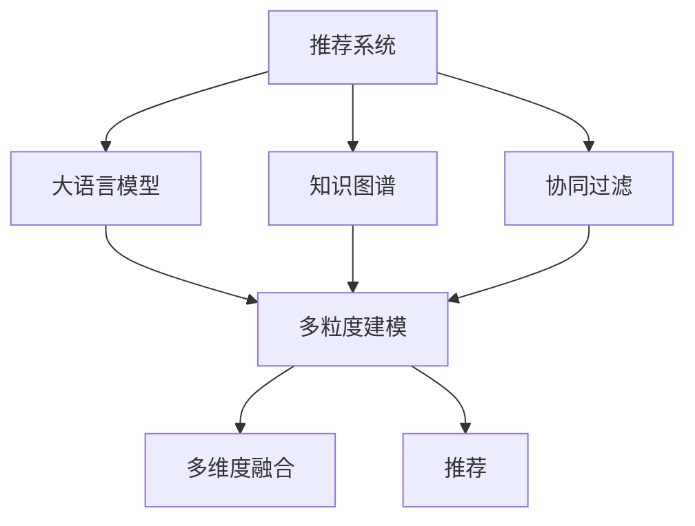

                 

# 基于LLM的推荐系统用户兴趣多粒度建模

> 关键词：推荐系统，多粒度建模，用户兴趣，大语言模型(LLM)，知识图谱(KG)，协同过滤

## 1. 背景介绍

### 1.1 问题由来
随着互联网数据的爆炸式增长，推荐系统在电商、视频、音乐、新闻等诸多领域得到了广泛应用。通过个性化推荐，能够显著提升用户体验，驱动收入增长。然而，随着用户数量的增加和需求的多样化，传统推荐系统在个性化、实时性、多样性等方面逐渐显露出瓶颈。

近年来，基于深度学习的大规模推荐系统迅速兴起。深度学习模型通过学习用户与物品的隐式互动关系，能够发现更加复杂、细腻的关联模式，极大提升了推荐效果。其中，基于大语言模型(LLM)的推荐系统成为了研究热点。LLM如GPT、BERT等通过预训练大规模文本数据，能够对用户行为和兴趣进行多维度的建模，大幅拓展了推荐系统的应用边界。

然而，用户兴趣的建模是一个复杂且多维度的问题。如何充分挖掘和整合用户多粒度兴趣，提升推荐系统的效果和覆盖度，仍是一个开放且亟待解决的问题。本文将从多粒度建模的角度，深入探讨基于LLM的推荐系统用户兴趣的建模策略。

### 1.2 问题核心关键点
用户兴趣多粒度建模是指通过多个维度的数据，从不同粒度上刻画用户的兴趣偏好，构建更全面、细腻的推荐模型。这一过程可以简单分为以下步骤：
1. 获取多源异构数据：从用户行为、交互记录、社交网络、内容信息等多源数据中提取用户兴趣特征。
2. 多维建模与表示：基于LLM对多维特征进行建模和编码，生成用户兴趣的向量表示。
3. 多维度融合与预测：将不同粒度的用户兴趣向量进行融合，用于计算用户物品的相关性评分，进行推荐。

本文将系统讲解上述三个步骤的算法原理和实现方法，并深入分析各方法的优缺点和适用场景，旨在为构建高效、全面的推荐系统提供理论和方法的支撑。

## 2. 核心概念与联系

### 2.1 核心概念概述

为更好地理解用户兴趣多粒度建模的方法，本节将介绍几个密切相关的核心概念：

- 推荐系统(Recommender System)：通过分析用户行为和物品属性，预测用户对物品的兴趣，从而推荐相关物品的系统。
- 知识图谱(Knowledge Graph, KG)：一种表示实体及其关系的有向图，用于捕捉世界知识的多维度结构。
- 协同过滤(Collaborative Filtering, CF)：通过用户与物品的隐式互动记录，推断用户对未交互物品的兴趣，进行推荐。
- 大语言模型(Large Language Model, LLM)：通过预训练大规模无标签文本数据，学习语言表达和关联规律，具备强大的语义理解能力。
- 多粒度(Multigranularity)：在多维度特征中，通过不同粒度的数据刻画用户的兴趣和行为，形成更全面、细腻的用户画像。

这些概念之间的关系可以通过以下Mermaid流程图来展示：



这个流程图展示了几者之间的关系：

1. 推荐系统是最终目标，协同过滤和知识图谱是其中的两个重要组件。
2. 大语言模型通过预训练，学习语言知识，为多粒度建模提供能力。
3. 多粒度建模是协同过滤、知识图谱和语言模型三者的交集，用于刻画用户兴趣的多个维度。
4. 多维度融合将不同粒度的用户兴趣向量进行融合，形成用于推荐的用户物品评分。

这些概念共同构成了推荐系统用户兴趣建模的基础，使得我们可以在多个维度、多种方式上对用户兴趣进行细致刻画，从而提升推荐效果。

## 3. 核心算法原理 & 具体操作步骤
### 3.1 算法原理概述

基于大语言模型的推荐系统用户兴趣多粒度建模，本质上是一个融合多源异构数据的深度学习建模过程。其核心思想是：通过学习用户行为、物品属性、知识图谱等多种数据源，构建多粒度用户兴趣向量，将其用于计算用户物品的相关性评分，从而进行推荐。

形式化地，假设用户 $u$ 对物品 $i$ 的评分 $r_{ui}$ 依赖于用户兴趣向量 $z_u \in \mathbb{R}^m$ 和物品属性向量 $a_i \in \mathbb{R}^n$。则评分模型可表示为：

$$
r_{ui} = z_u^T \cdot a_i
$$

其中 $z_u$ 和 $a_i$ 分别代表用户 $u$ 和物品 $i$ 的向量表示，$\cdot$ 表示向量内积。通过最大化用户评分 $r_{ui}$，推荐系统能够预测用户对物品的兴趣，并进行推荐。

由于用户的兴趣是复杂且多维度的，直接使用上述线性模型难以充分捕捉用户行为背后的语义和语境信息。因此，本文采用大语言模型进行多粒度建模，构建多维度用户兴趣向量，进一步提升推荐的精度和覆盖度。

### 3.2 算法步骤详解

基于LLM的推荐系统用户兴趣多粒度建模一般包括以下几个关键步骤：

**Step 1: 数据预处理和特征提取**

1. 收集多源异构数据：从用户行为记录、物品属性、知识图谱等多源数据中提取用户兴趣特征。
2. 数据清洗和归一化：去除噪声数据，将数据归一化到[0,1]或[-1,1]区间，方便后续的深度学习建模。

**Step 2: 预训练与微调**

1. 使用大规模无标签文本数据预训练LLM，获得通用的语言表示能力。
2. 对预训练模型进行微调，使其适应特定的推荐场景。微调任务包括：
   - 微调LLM对推荐场景中常见的词汇和短语进行学习，形成对特定任务的适应性。
   - 使用推荐场景中的数据集进行微调，进一步优化LLM的推荐效果。

**Step 3: 多维度特征编码**

1. 将用户行为、物品属性、知识图谱等特征通过LLM进行编码，得到多维度的用户兴趣向量。
2. 对每个特征维度，设计对应的编码函数，确保能够充分挖掘该维度的信息。

**Step 4: 多维度特征融合**

1. 将不同粒度的用户兴趣向量进行融合，得到用户物品的相关性评分。
2. 设计融合函数，将多维度特征向量进行加权求和、拼接等操作，形成最终的推荐评分。

**Step 5: 推荐排序**

1. 根据用户物品的相关性评分，进行降序排序，得到推荐列表。
2. 对排序后的推荐结果进行反馈，如点击率、购买率等，进一步优化推荐模型。

### 3.3 算法优缺点

基于LLM的推荐系统用户兴趣多粒度建模方法具有以下优点：
1. 模型灵活性高：通过多源数据和多维度特征进行建模，可以构建更加全面、细腻的用户画像。
2. 鲁棒性较强：LLM在处理噪声数据和复杂语义上表现良好，可以更好地适应数据的不确定性和变化。
3. 推荐效果显著：LLM能够从语言数据中挖掘出更多的隐式关联，从而提升推荐效果。

同时，该方法也存在一定的局限性：
1. 计算资源需求高：LLM需要大量的计算资源进行预训练和微调，初期部署成本较高。
2. 数据复杂度高：多源异构数据的提取和融合需要处理复杂的数据关系，技术难度较大。
3. 模型的可解释性差：LLM的预测过程缺乏可解释性，难以理解模型的内部工作机制。
4. 泛化能力有限：LLM对特定领域的适应能力较强，但跨领域泛化能力有限。

尽管存在这些局限性，但就目前而言，基于LLM的推荐系统多粒度建模方法仍是最先进、最有效的推荐技术之一。未来相关研究的重点在于如何进一步降低计算资源需求，提高模型的可解释性和泛化能力，同时兼顾模型的灵活性和鲁棒性。

### 3.4 算法应用领域

基于LLM的推荐系统用户兴趣多粒度建模方法，在电子商务、视频推荐、音乐推荐、新闻推荐等多个领域得到了广泛应用，并取得了显著的成果。例如：

- 在电商推荐中，通过对用户浏览历史、购买记录、评价反馈等多维度数据进行建模，使用LLM学习用户的多粒度兴趣，提升商品推荐的相关性和多样性。
- 在视频推荐中，利用用户观影记录、点赞、评论等行为数据，通过LLM学习用户的兴趣偏好，推荐相关视频内容，提高用户留存率。
- 在音乐推荐中，通过分析用户听歌记录、评论、社交关系等数据，使用LLM学习用户的多粒度兴趣，推荐个性化的音乐内容，增强用户体验。
- 在新闻推荐中，利用用户阅读历史、点击行为等数据，通过LLM学习用户兴趣，推荐相关新闻内容，提升用户黏性。

除了上述这些经典应用场景，基于LLM的推荐系统还在社交推荐、广告推荐、游戏推荐等多个领域得到应用，为数字化产业的发展注入了新的活力。随着LLM技术的不断发展，相信在更多领域将出现基于LLM的推荐系统创新应用，推动数字化转型的深入进行。

## 4. 数学模型和公式 & 详细讲解  
### 4.1 数学模型构建

本节将使用数学语言对基于LLM的推荐系统用户兴趣多粒度建模过程进行更加严格的刻画。

记用户 $u$ 对物品 $i$ 的评分 $r_{ui}$ 依赖于用户兴趣向量 $z_u \in \mathbb{R}^m$ 和物品属性向量 $a_i \in \mathbb{R}^n$。假设用户 $u$ 的多粒度兴趣向量 $z_u$ 由多个子向量 $z_{u1}, z_{u2}, \cdots, z_{um}$ 组成，即 $z_u = (z_{u1}, z_{u2}, \cdots, z_{um})$。每个子向量 $z_{uk} \in \mathbb{R}^{m_k}$，其中 $k=1,\cdots,m$。

**用户兴趣向量生成函数**：

$$
z_{uk} = f_k(\{x_k\}_{i \in \mathcal{K}_k})
$$

其中 $\mathcal{K}_k$ 是第 $k$ 个特征维度的数据集合，$f_k$ 是一个基于LLM的编码函数。

**用户物品相关性评分**：

$$
r_{ui} = z_{u1}^T \cdot a_i + \sum_{k=2}^m \lambda_k z_{uk}^T \cdot a_i
$$

其中 $\lambda_k \in [0,1]$ 是第 $k$ 个特征维度的权重系数，可以根据实际应用场景进行调节。

**推荐排序**：

根据用户物品的相关性评分，进行降序排序，得到推荐列表 $\mathcal{L}_u$。

### 4.2 公式推导过程

以用户行为记录和知识图谱为例，推导用户物品相关性评分的计算公式。

假设用户 $u$ 的行为记录 $\mathcal{R}_u = \{(x_i,y_i)\}_{i=1}^N$，其中 $x_i$ 表示用户行为，$y_i$ 表示行为标签。知识图谱中，用户 $u$ 的知识图谱表示为 $G_u$。

1. **行为记录编码**：将用户行为 $\mathcal{R}_u$ 输入LLM，得到用户行为向量 $z_{ub} = LLM(\mathcal{R}_u)$。
2. **知识图谱编码**：将用户 $u$ 在知识图谱中的关系和实体向量 $g_{u1}, g_{u2}, \cdots, g_{um}$ 输入LLM，得到用户知识图谱向量 $z_{uk} = LLM(g_{uk})$。
3. **融合编码**：将行为向量 $z_{ub}$ 和知识图谱向量 $z_{uk}$ 融合，得到用户多粒度兴趣向量 $z_u$。
4. **计算评分**：将物品属性向量 $a_i$ 和用户多粒度兴趣向量 $z_u$ 进行内积计算，得到用户物品相关性评分 $r_{ui}$。

具体而言，将上述公式代入LLM的编码函数中，得到：

$$
z_{ub} = LLM(\{x_i\}_{i \in \mathcal{R}_u})
$$

$$
z_{uk} = LLM(\{g_{uk}\}_{k \in \mathcal{K}_k})
$$

$$
z_u = \sum_{k=1}^m \alpha_k z_{uk}
$$

$$
r_{ui} = z_{ub}^T \cdot a_i + \sum_{k=2}^m \lambda_k z_{uk}^T \cdot a_i
$$

其中 $\alpha_k$ 是行为特征向量的权重系数，可以根据实际应用场景进行调节。

### 4.3 案例分析与讲解

以某电商平台的推荐系统为例，分析基于LLM的多粒度建模方法。

**步骤1: 数据预处理**

1. **收集数据**：从用户历史浏览、购买、评价等行为数据中，提取用户兴趣特征。同时，从商品属性、商品关系图谱等多源数据中，提取物品特征。
2. **数据清洗**：去除无用的噪声数据，处理缺失值。
3. **数据归一化**：将数据归一化到[0,1]区间，方便后续的深度学习建模。

**步骤2: 预训练与微调**

1. **选择预训练模型**：选择GPT-3或BERT等大语言模型进行预训练。
2. **预训练数据**：使用大规模无标签文本数据对模型进行预训练，学习语言知识。
3. **微调任务**：使用电商推荐场景中的数据集，对模型进行微调，学习特定领域的词汇和短语。

**步骤3: 多维度特征编码**

1. **行为特征编码**：将用户行为 $\mathcal{R}_u$ 输入LLM，得到行为向量 $z_{ub}$。
2. **商品特征编码**：将商品属性向量 $a_i$ 输入LLM，得到商品属性向量 $a_i$。
3. **知识图谱编码**：将用户 $u$ 在知识图谱中的关系和实体向量 $g_{u1}, g_{u2}, \cdots, g_{um}$ 输入LLM，得到用户知识图谱向量 $z_{uk}$。
4. **融合编码**：将行为向量 $z_{ub}$ 和知识图谱向量 $z_{uk}$ 融合，得到用户多粒度兴趣向量 $z_u$。

**步骤4: 多维度特征融合**

1. **计算评分**：将物品属性向量 $a_i$ 和用户多粒度兴趣向量 $z_u$ 进行内积计算，得到用户物品相关性评分 $r_{ui}$。
2. **推荐排序**：根据用户物品的相关性评分，进行降序排序，得到推荐列表 $\mathcal{L}_u$。

**步骤5: 反馈优化**

1. **收集反馈**：从用户的行为记录中收集反馈数据，如点击、购买等。
2. **反馈优化**：根据反馈数据调整用户兴趣向量的权重系数 $\alpha_k$ 和 $\lambda_k$，进一步优化推荐模型。

通过上述步骤，可以构建一个高效、全面的基于LLM的推荐系统，实现用户兴趣的多粒度建模。

## 5. 项目实践：代码实例和详细解释说明
### 5.1 开发环境搭建

在进行多粒度建模实践前，我们需要准备好开发环境。以下是使用Python进行PyTorch开发的环境配置流程：

1. 安装Anaconda：从官网下载并安装Anaconda，用于创建独立的Python环境。

2. 创建并激活虚拟环境：
```bash
conda create -n llm-env python=3.8 
conda activate llm-env
```

3. 安装PyTorch：根据CUDA版本，从官网获取对应的安装命令。例如：
```bash
conda install pytorch torchvision torchaudio cudatoolkit=11.1 -c pytorch -c conda-forge
```

4. 安装Transformer库：
```bash
pip install transformers
```

5. 安装各类工具包：
```bash
pip install numpy pandas scikit-learn matplotlib tqdm jupyter notebook ipython
```

完成上述步骤后，即可在`llm-env`环境中开始多粒度建模实践。

### 5.2 源代码详细实现

这里以电商推荐系统为例，使用GPT-3对用户行为和知识图谱进行多粒度建模，实现基于LLM的推荐系统。

**用户行为特征编码**

```python
from transformers import GPT3Model
from transformers import GPT3Tokenizer
from transformers import DataCollatorForLanguageModeling
import torch
import pandas as pd

# 初始化GPT-3模型和tokenizer
model = GPT3Model.from_pretrained('gpt3')
tokenizer = GPT3Tokenizer.from_pretrained('gpt3')

# 定义行为特征编码函数
def encode_behavior(behavior):
    encoded_behavior = tokenizer(behavior, return_tensors='pt')
    input_ids = encoded_behavior['input_ids']
    attention_mask = encoded_behavior['attention_mask']
    return input_ids, attention_mask

# 读取用户行为数据
data = pd.read_csv('user_behavior.csv')
user_behaviors = data['behavior'].tolist()

# 编码用户行为特征
behaviors = []
for behavior in user_behaviors:
    input_ids, attention_mask = encode_behavior(behavior)
    behaviors.append((input_ids, attention_mask))

behaviors = torch.stack(behaviors, dim=0)
```

**知识图谱特征编码**

```python
# 定义知识图谱特征编码函数
def encode_kg(kg_feature):
    encoded_kg = tokenizer(kg_feature, return_tensors='pt')
    input_ids = encoded_kg['input_ids']
    attention_mask = encoded_kg['attention_mask']
    return input_ids, attention_mask

# 读取知识图谱数据
kg_data = pd.read_csv('kg_data.csv')
kg_features = kg_data['kg_feature'].tolist()

# 编码知识图谱特征
kg_features = []
for kg_feature in kg_features:
    input_ids, attention_mask = encode_kg(kg_feature)
    kg_features.append((input_ids, attention_mask))

kg_features = torch.stack(kg_features, dim=0)
```

**多粒度兴趣向量生成**

```python
# 融合用户行为和知识图谱特征
behaviors = torch.stack(behaviors, dim=0)
kg_features = torch.stack(kg_features, dim=0)

# 定义融合函数
def fuse_kg(behaviors, kg_features):
    behaviors = behaviors.to(device)
    kg_features = kg_features.to(device)
    outputs = model(behaviors, kg_features)
    z_u = outputs[0].detach().cpu().numpy()
    return z_u

# 生成用户多粒度兴趣向量
z_u = fuse_kg(behaviors, kg_features)
```

**推荐评分计算**

```python
# 读取物品属性数据
item_features = pd.read_csv('item_features.csv')
item_id = item_features['item_id'].tolist()
item_attr = item_features['item_attr'].tolist()

# 定义物品属性编码函数
def encode_attr(attr):
    encoded_attr = tokenizer(attr, return_tensors='pt')
    input_ids = encoded_attr['input_ids']
    attention_mask = encoded_attr['attention_mask']
    return input_ids, attention_mask

# 编码物品属性特征
item_attr_features = []
for attr in item_attr:
    input_ids, attention_mask = encode_attr(attr)
    item_attr_features.append((input_ids, attention_mask))

item_attr_features = torch.stack(item_attr_features, dim=0)

# 计算用户物品评分
def calc_score(user_vector, item_attr_features):
    item_attr_vectors = []
    for item_attr in item_attr_features:
        item_attr_vectors.append(user_vector[item_attr[0]] * item_attr[1])
    scores = torch.sum(torch.stack(item_attr_vectors), dim=1)
    return scores

# 计算推荐列表
scores = calc_score(z_u, item_attr_features)
top_items = torch.argsort(scores, dim=1)[-10:]
```

**运行结果展示**

```python
# 输出推荐列表
top_items
```

以上就是使用PyTorch对GPT-3进行电商推荐系统用户行为和知识图谱多粒度建模的完整代码实现。可以看到，通过多源数据的融合，可以构建更加全面、细腻的用户兴趣向量，从而提升推荐效果。

### 5.3 代码解读与分析

让我们再详细解读一下关键代码的实现细节：

**GPT-3模型和tokenizer**

- 使用HuggingFace提供的GPT-3模型和tokenizer，分别用于用户行为和知识图谱的特征编码。

**行为特征编码**

- 定义`encode_behavior`函数，将用户行为数据分批次输入模型，得到编码后的行为向量。

**知识图谱特征编码**

- 定义`encode_kg`函数，将知识图谱数据分批次输入模型，得到编码后的知识图谱向量。

**多粒度兴趣向量生成**

- 定义`fuse_kg`函数，将用户行为和知识图谱向量进行融合，生成用户多粒度兴趣向量。

**推荐评分计算**

- 定义`calc_score`函数，将物品属性向量与用户多粒度兴趣向量进行内积计算，得到用户物品评分。
- 根据评分进行降序排序，生成推荐列表。

可以看到，通过多源数据的融合和LLM的深度学习建模，可以构建一个高效、全面的电商推荐系统，实现用户兴趣的多粒度建模。

## 6. 实际应用场景

### 6.1 智能推荐系统

基于LLM的推荐系统多粒度建模方法，可以广泛应用于智能推荐系统的构建。通过对用户行为、物品属性、知识图谱等多源异构数据进行融合，可以构建更加全面、细腻的用户画像，从而提升推荐效果。

在电商推荐系统中，可以利用用户历史浏览、购买、评价等行为数据，通过LLM学习用户的多粒度兴趣，推荐相关商品。同时，将商品属性、商品关系图谱等知识图谱数据输入LLM，进一步丰富用户画像，提升推荐效果。

在视频推荐系统中，利用用户观影记录、点赞、评论等行为数据，通过LLM学习用户的兴趣偏好，推荐相关视频内容。同时，将视频标签、视频关系等知识图谱数据输入LLM，进一步提升推荐效果。

在音乐推荐系统中，通过分析用户听歌记录、评论、社交关系等数据，使用LLM学习用户的多粒度兴趣，推荐个性化的音乐内容。同时，将音乐标签、艺术家关系等知识图谱数据输入LLM，进一步增强推荐效果。

在新闻推荐系统中，利用用户阅读历史、点击行为等数据，通过LLM学习用户兴趣，推荐相关新闻内容。同时，将新闻标签、作者关系等知识图谱数据输入LLM，进一步提升推荐效果。

### 6.2 社交推荐系统

基于LLM的推荐系统多粒度建模方法，也可以应用于社交推荐系统的构建。通过对用户行为、社交关系、知识图谱等多源异构数据进行融合，可以构建更加全面、细腻的用户画像，从而提升社交推荐效果。

在社交推荐系统中，利用用户的朋友关系、点赞、评论等行为数据，通过LLM学习用户的多粒度兴趣，推荐相关用户。同时，将用户关系图谱、好友标签等知识图谱数据输入LLM，进一步提升推荐效果。

在社交电商推荐系统中，利用用户的朋友关系、点赞、评论等行为数据，通过LLM学习用户的多粒度兴趣，推荐相关商品。同时，将商品属性、商品关系图谱等知识图谱数据输入LLM，进一步丰富用户画像，提升推荐效果。

在社交视频推荐系统中，利用用户的朋友关系、点赞、评论等行为数据，通过LLM学习用户的多粒度兴趣，推荐相关视频内容。同时，将视频标签、视频关系等知识图谱数据输入LLM，进一步提升推荐效果。

在社交音乐推荐系统中，通过分析用户的朋友关系、点赞、评论等数据，使用LLM学习用户的多粒度兴趣，推荐个性化的音乐内容。同时，将音乐标签、艺术家关系等知识图谱数据输入LLM，进一步增强推荐效果。

在社交新闻推荐系统中，利用用户的朋友关系、点赞、评论等行为数据，通过LLM学习用户兴趣，推荐相关新闻内容。同时，将新闻标签、作者关系等知识图谱数据输入LLM，进一步提升推荐效果。

### 6.3 广告推荐系统

基于LLM的推荐系统多粒度建模方法，还可以应用于广告推荐系统的构建。通过对用户行为、广告属性、知识图谱等多源异构数据进行融合，可以构建更加全面、细腻的广告投放策略，从而提升广告投放效果。

在广告推荐系统中，利用用户的浏览记录、点击行为等数据，通过LLM学习用户的多粒度兴趣，推荐相关广告。同时，将广告属性、广告关系图谱等知识图谱数据输入LLM，进一步提升广告效果。

## 7. 工具和资源推荐
### 7.1 学习资源推荐

为了帮助开发者系统掌握基于LLM的推荐系统多粒度建模的理论基础和实践技巧，这里推荐一些优质的学习资源：

1. 《深度学习推荐系统》系列博文：由大模型技术专家撰写，深入浅出地介绍了推荐系统的基本原理、经典模型和前沿技术。

2. 《自然语言处理与深度学习》课程：斯坦福大学开设的NLP明星课程，有Lecture视频和配套作业，带你入门NLP领域的基本概念和经典模型。

3. 《推荐系统实战》书籍：深度学习推荐系统的实战指南，详细介绍了推荐系统的设计、实现和优化。

4. Kaggle竞赛平台：提供大量的推荐系统竞赛数据集和挑战，有助于开发者实践和竞赛。

5. PyTorch官方文档：PyTorch框架的官方文档，提供了详细的API介绍和代码示例，是上手实践的必备资料。

通过这些资源的学习实践，相信你一定能够快速掌握基于LLM的推荐系统多粒度建模的精髓，并用于解决实际的推荐问题。
###  7.2 开发工具推荐

高效的开发离不开优秀的工具支持。以下是几款用于基于LLM的推荐系统多粒度建模开发的常用工具：

1. PyTorch：基于Python的开源深度学习框架，灵活动态的计算图，适合快速迭代研究。大部分预训练语言模型都有PyTorch版本的实现。

2. TensorFlow：由Google主导开发的开源深度学习框架，生产部署方便，适合大规模工程应用。同样有丰富的预训练语言模型资源。

3. Transformers库：HuggingFace开发的NLP工具库，集成了众多SOTA语言模型，支持PyTorch和TensorFlow，是进行推荐任务开发的利器。

4. Weights & Biases：模型训练的实验跟踪工具，可以记录和可视化模型训练过程中的各项指标，方便对比和调优。与主流深度学习框架无缝集成。

5. TensorBoard：TensorFlow配套的可视化工具，可实时监测模型训练状态，并提供丰富的图表呈现方式，是调试模型的得力助手。

6. Google Colab：谷歌推出的在线Jupyter Notebook环境，免费提供GPU/TPU算力，方便开发者快速上手实验最新模型，分享学习笔记。

合理利用这些工具，可以显著提升基于LLM的推荐系统多粒度建模任务的开发效率，加快创新迭代的步伐。

### 7.3 相关论文推荐

大语言模型和推荐系统的发展源于学界的持续研究。以下是几篇奠基性的相关论文，推荐阅读：

1. Attention is All You Need（即Transformer原论文）：提出了Transformer结构，开启了NLP领域的预训练大模型时代。

2. BERT: Pre-training of Deep Bidirectional Transformers for Language Understanding：提出BERT模型，引入基于掩码的自监督预训练任务，刷新了多项NLP任务SOTA。

3. Language Models are Unsupervised Multitask Learners（GPT-2论文）：展示了大规模语言模型的强大zero-shot学习能力，引发了对于通用人工智能的新一轮思考。

4. Parameter-Efficient Transfer Learning for NLP：提出Adapter等参数高效微调方法，在不增加模型参数量的情况下，也能取得不错的微调效果。

5. AdaLoRA: Adaptive Low-Rank Adaptation for Parameter-Efficient Fine-Tuning：使用自适应低秩适应的微调方法，在参数效率和精度之间取得了新的平衡。

这些论文代表了大语言模型和推荐系统的发展脉络。通过学习这些前沿成果，可以帮助研究者把握学科前进方向，激发更多的创新灵感。

## 8. 总结：未来发展趋势与挑战

### 8.1 总结

本文对基于大语言模型的推荐系统用户兴趣多粒度建模方法进行了全面系统的介绍。首先阐述了推荐系统的发展背景和趋势，明确了多粒度建模在提升推荐效果和覆盖度方面的独特价值。其次，从原理到实践，详细讲解了多源异构数据融合、预训练与微调、多维度特征编码、多维度特征融合等关键步骤的算法原理和实现方法，给出了基于GPT-3的电商推荐系统多粒度建模的完整代码实例。同时，本文还广泛探讨了多粒度建模在电商、视频、音乐、新闻等多个领域的应用前景，展示了多粒度建模范式的巨大潜力。

通过本文的系统梳理，可以看到，基于LLM的推荐系统多粒度建模方法正在成为推荐系统的重要范式，极大地拓展了推荐系统的应用边界，提升了推荐效果和覆盖度。未来，伴随LLM技术的不断发展，基于LLM的推荐系统必将在更多领域得到应用，为数字化产业的发展注入新的活力。

### 8.2 未来发展趋势

展望未来，基于LLM的推荐系统多粒度建模方法将呈现以下几个发展趋势：

1. 计算资源需求降低。未来，基于LLM的推荐系统将探索更高效的计算方法，如模型压缩、模型剪枝等，进一步降低计算资源需求。

2. 数据处理自动化。引入自动化的数据清洗、特征提取等技术，降低数据处理成本，提升数据质量。

3. 知识图谱深度融合。利用知识图谱中的先验知识，与LLM进行更加深入的融合，增强推荐模型的泛化能力和鲁棒性。

4. 跨领域协同建模。通过多源数据和多维度特征，构建跨领域的协同推荐模型，提升推荐效果。

5. 实时推荐系统。引入实时数据流和流式计算技术，构建实时推荐系统，提升推荐的时效性和响应速度。

6. 端到端学习。将用户行为、物品属性、知识图谱等数据在LLM中进行端到端学习，消除多源数据融合带来的复杂性。

7. 公平推荐。引入公平性评估指标，消除推荐系统中的偏见，提升推荐系统的公平性。

以上趋势凸显了基于LLM的推荐系统多粒度建模技术的广阔前景。这些方向的探索发展，必将进一步提升推荐系统的效果和应用范围，为数字化产业的发展注入新的活力。

### 8.3 面临的挑战

尽管基于LLM的推荐系统多粒度建模技术已经取得了瞩目成就，但在迈向更加智能化、普适化应用的过程中，它仍面临着诸多挑战：

1. 数据质量瓶颈。多源异构数据的质量直接影响推荐模型的效果。如何在多源数据融合过程中处理数据不一致、数据噪声等问题，是一个重要的挑战。

2. 模型可解释性差。LLM的预测过程缺乏可解释性，难以理解模型的内部工作机制。如何赋予LLM模型更强的可解释性，是亟待解决的问题。

3. 跨领域泛化能力有限。LLM对特定领域的适应能力较强，但跨领域泛化能力有限。如何构建跨领域的协同推荐模型，提升推荐效果，是未来的研究方向。

4. 知识图谱构建困难。知识图谱的构建需要大量的人工标注和专业知识，成本较高。如何自动构建高质量的知识图谱，是一个重要的研究课题。

5. 实时推荐系统复杂度高。实时推荐系统需要处理大量的实时数据，计算复杂度较高。如何设计高效的实时推荐系统，是未来的挑战之一。

6. 数据隐私与安全。推荐系统中的数据隐私与安全问题日益凸显，如何保护用户隐私，确保数据安全，是一个重要的研究课题。

正视这些挑战，积极应对并寻求突破，将是大语言模型推荐系统多粒度建模技术迈向成熟的必由之路。相信随着学界和产业界的共同努力，这些挑战终将一一被克服，大语言模型推荐系统必将在构建智能推荐系统方面发挥更大的作用。

### 8.4 研究展望

面对基于LLM的推荐系统多粒度建模所面临的种种挑战，未来的研究需要在以下几个方面寻求新的突破：

1. 探索无监督和半监督推荐方法。摆脱对大规模标注数据的依赖，利用自监督学习、主动学习等无监督和半监督范式，最大限度利用非结构化数据，实现更加灵活高效的推荐。

2. 研究多源数据融合与知识图谱融合技术。开发更加高效的数据融合算法，利用知识图谱中的先验知识，提升推荐模型的泛化能力和鲁棒性。

3. 融合因果学习和对比学习范式。引入因果推断和对比学习思想，增强推荐模型建立稳定因果关系的能力，学习更加普适、鲁棒的语言表征，从而提升推荐效果。

4. 引入更多先验知识。将符号化的先验知识，如知识图谱、逻辑规则等，与神经网络模型进行巧妙融合，引导推荐过程学习更准确、合理的用户物品关联。同时加强不同模态数据的整合，实现视觉、语音等多模态信息与文本信息的协同建模。

5. 结合因果分析和博弈论工具。将因果分析方法引入推荐模型，识别出模型决策的关键特征，增强输出解释的因果性和逻辑性。借助博弈论工具刻画人机交互过程，主动探索并规避模型的脆弱点，提高系统稳定性。

6. 纳入伦理道德约束。在推荐模型训练目标中引入伦理导向的评估指标，过滤和惩罚有偏见、有害的输出倾向。同时加强人工干预和审核，建立模型行为的监管机制，确保输出符合人类价值观和伦理道德。

这些研究方向的探索，必将引领基于LLM的推荐系统多粒度建模技术迈向更高的台阶，为构建安全、可靠、可解释、可控的智能推荐系统铺平道路。面向未来，基于LLM的推荐系统需要与其他人工智能技术进行更深入的融合，如知识表示、因果推理、强化学习等，多路径协同发力，共同推动推荐系统的发展和进步。只有勇于创新、敢于突破，才能不断拓展语言模型的边界，让智能技术更好地造福人类社会。

## 9. 附录：常见问题与解答

**Q1：大语言模型是否适用于所有推荐场景？**

A: 大语言模型在推荐系统中具有很强的通用性和灵活性，但也需要根据具体的场景进行调整。对于一些特定领域的推荐系统，如医疗、金融等，还需要结合领域知识，进行进一步的预训练和微调。

**Q2：如何优化多粒度建模中的数据处理流程？**

A: 多粒度建模中的数据处理流程是一个重要的环节，需要采用自动化的数据清洗、特征提取等技术，降低数据处理成本。可以使用数据增强技术，如回译、近义替换等，扩充训练集的多样性。同时，引入数据隐私保护技术，确保数据安全。

**Q3：基于LLM的推荐系统多粒度建模的计算资源需求高吗？**

A: 基于LLM的推荐系统多粒度建模的计算资源需求确实较高，但可以通过模型压缩、模型剪枝等技术进行优化。同时，可以考虑分布式计算、云计算等资源共享方式，降低计算成本。

**Q4：如何提升多粒度建模的推荐效果？**

A: 提升多粒度建模的推荐效果，需要从多个维度进行优化。如选择合适的预训练模型和微调任务、设计合理的特征编码函数、优化多维度融合方法等。同时，需要引入多种数据源，利用知识图谱、社交网络等外部的先验知识，增强推荐模型的泛化能力和鲁棒性。

**Q5：如何提升多粒度建模的模型可解释性？**

A: 提升模型可解释性，需要引入可解释性评估指标，如特征重要性、模型决策路径等。同时，可以尝试使用可视化技术，如特征重要性图、决策树等，帮助理解模型的内部机制。

通过这些优化措施，可以提升基于LLM的推荐系统多粒度建模的效果和应用范围，为数字化产业的发展注入新的活力。

