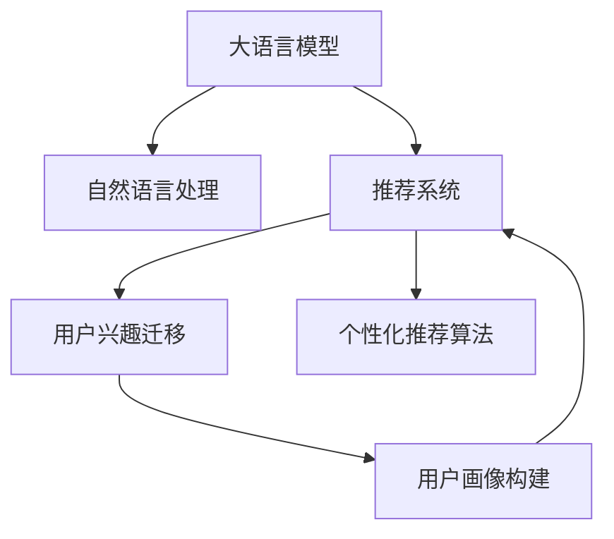

                 

# 基于LLM的推荐系统用户兴趣迁移

> 关键词：基于大语言模型的推荐系统，用户兴趣迁移，用户画像构建，个性化推荐算法，自然语言处理(NLP)

## 1. 背景介绍

随着互联网信息爆炸式增长，推荐系统已成为智能应用的基础设施。推荐系统通过对用户行为数据的分析，精准预测用户的喜好，实时提供个性化的产品或内容推荐。在电商、新闻、视频等多个领域，推荐系统已经成为提升用户体验和业务效率的重要手段。

然而，传统的推荐系统主要依赖历史行为数据进行推荐，难以应对用户兴趣动态变化和长尾需求。用户兴趣的迁移和转移，是推荐系统面临的一大挑战。为此，基于大规模预训练语言模型(LLM)的推荐系统应运而生。通过引入自然语言处理(NLP)技术，大语言模型可以自动从文本中挖掘用户的情感、态度、需求等信息，从而实现对用户兴趣的动态监测和迁移预测。本文将从大语言模型在推荐系统中的角色、原理与实践三个方面，系统介绍基于LLM的推荐系统。

## 2. 核心概念与联系

### 2.1 核心概念概述

为更好地理解基于大语言模型的推荐系统，本节将介绍几个密切相关的核心概念：

- 大语言模型(Large Language Model, LLM)：以自回归(如GPT)或自编码(如BERT)模型为代表的大规模预训练语言模型。通过在大规模无标签文本语料上进行预训练，学习通用的语言表示，具备强大的语言理解和生成能力。

- 推荐系统(Recommender System)：基于用户行为数据或内容标签，使用各种算法预测用户对物品的兴趣，向用户推荐个性化的产品或内容。

- 自然语言处理(Natural Language Processing, NLP)：研究如何让计算机理解和生成人类语言的技术，包括文本分类、情感分析、信息抽取等。

- 用户兴趣迁移(User Interest Migration)：指用户从一个兴趣点迁移到另一个兴趣点的行为过程。推荐系统需要能够动态监测用户兴趣的变化，及时调整推荐策略，满足用户的新需求。

- 用户画像(User Profile)：由用户行为数据、个人信息、社交网络等多种信息组成的综合描述，用于刻画用户的特征和兴趣。

这些核心概念之间的逻辑关系可以通过以下Mermaid流程图来展示：



这个流程图展示了大语言模型、自然语言处理、推荐系统和用户兴趣迁移之间的联系：

1. 大语言模型通过预训练学习通用的语言表示，具备处理文本数据的能力。
2. 自然语言处理技术将文本数据转换为可理解的特征，为大语言模型提供输入。
3. 推荐系统基于用户画像，使用各种算法进行个性化推荐。
4. 用户兴趣迁移动态监测用户兴趣变化，通过自然语言处理和大语言模型预测用户新兴趣点。
5. 用户画像构建综合利用用户行为数据和语言理解，刻画用户特征。
6. 个性化推荐算法将用户画像作为输入，实现精准推荐。

这些概念共同构成了基于大语言模型的推荐系统的工作框架，使其能够通过语言理解更好地把握用户兴趣和需求，实现动态推荐。

## 3. 核心算法原理 & 具体操作步骤
### 3.1 算法原理概述

基于大语言模型的推荐系统，通过引入自然语言处理技术，实现了对用户兴趣的动态监测和迁移预测。其核心思想是：利用自然语言处理技术，将用户行为数据和反馈数据转换为文本形式，然后通过预训练的大语言模型进行语义分析，挖掘出用户的新兴趣点，再根据这些兴趣点进行个性化推荐。

具体来说，基于LLM的推荐系统主要由以下几个部分组成：

- 用户行为数据采集：通过日志、点击流、评论等形式，收集用户对各个物品的行为数据。
- 自然语言处理：将行为数据转换为文本形式，并进行情感分析、主题分析、实体识别等。
- 大语言模型推理：利用预训练的大语言模型对文本进行语义分析，挖掘出用户的情感倾向、兴趣主题等。
- 个性化推荐：将用户画像和大语言模型推理结果作为输入，使用推荐算法进行个性化推荐。

### 3.2 算法步骤详解

基于LLM的推荐系统主要包括以下几个关键步骤：

**Step 1: 数据采集与处理**
- 收集用户对各个物品的原始行为数据，如浏览、点击、评分、评论等。
- 将行为数据转换为文本格式，并进行预处理，如去除噪音、分词、去停用词等。

**Step 2: 自然语言处理**
- 对行为文本进行情感分析，判断用户对物品的情感倾向。
- 进行主题分析，提取文本中的关键词和主题。
- 进行实体识别，提取出物品的名称、类别等信息。

**Step 3: 大语言模型推理**
- 使用预训练的大语言模型对行为文本进行语义分析，挖掘用户的情感倾向、兴趣主题等信息。
- 将挖掘出的信息转换为向量形式，作为用户画像的一部分。

**Step 4: 用户画像构建**
- 综合利用用户历史行为数据和语言理解，构建用户画像。
- 包括用户的兴趣主题、情感倾向、行为模式等信息。

**Step 5: 个性化推荐**
- 使用推荐算法，根据用户画像和大语言模型推理结果，进行个性化推荐。
- 可以考虑使用基于协同过滤、基于内容的推荐算法等。

**Step 6: 结果评估与迭代**
- 对推荐结果进行评估，如点击率、转化率、满意度等。
- 根据评估结果，对模型进行迭代优化，进一步提高推荐效果。

### 3.3 算法优缺点

基于大语言模型的推荐系统具有以下优点：

1. 动态监测用户兴趣。通过自然语言处理和大语言模型，推荐系统能够实时监测用户兴趣的变化，捕捉用户的动态需求。
2. 处理复杂情感和需求。大语言模型可以处理复杂的情感和需求，挖掘出用户在文本中未直接表达的隐含信息。
3. 适应性强。该方法可以应用于多种类型的推荐场景，如电商、新闻、视频等。
4. 效果显著。在学术界和工业界的众多研究中，基于大语言模型的推荐系统已经刷新了多项推荐效果指标。

同时，该方法也存在以下局限性：

1. 对文本质量要求高。用户行为文本的质量对模型效果有较大影响，低质量文本可能导致模型过拟合或欠拟合。
2. 训练数据量大。大语言模型的训练需要大量的文本数据，对计算资源和存储空间要求较高。
3. 语义理解复杂。大语言模型需要对复杂的情感和语义进行理解，导致推理速度较慢。
4. 模型复杂度高。推荐系统需要综合利用用户画像和大语言模型推理结果，模型结构较为复杂。

尽管存在这些局限性，但就目前而言，基于大语言模型的推荐方法仍是大数据推荐系统的重要范式。未来相关研究的重点在于如何进一步降低大语言模型的计算复杂度和存储空间需求，提高模型的推理速度，同时兼顾用户兴趣的动态监测和迁移预测。

### 3.4 算法应用领域

基于大语言模型的推荐系统在多个领域已经得到了应用，覆盖了电商、新闻、视频、社交等多个推荐场景，例如：

- 电商推荐：通过分析用户的浏览、点击、购买行为，预测用户的购买意向，推荐个性化的商品。
- 新闻推荐：根据用户对新闻文章的阅读、点赞、评论行为，预测用户的兴趣主题，推荐相关的新闻内容。
- 视频推荐：通过分析用户对视频内容的观看、点赞、评论行为，预测用户的兴趣主题，推荐相关视频内容。
- 社交推荐：根据用户在社交平台上的互动行为，预测用户的兴趣偏好，推荐相关的朋友、内容、群组等。

除了上述这些经典应用外，基于大语言模型的推荐系统还被创新性地应用到更多场景中，如智能客服、智慧医疗、智慧教育、智慧城市等，为不同行业带来了新的推荐思路和应用模式。随着预训练语言模型和推荐算法的不断进步，相信基于大语言模型的推荐系统将在更多领域得到应用，为人们的日常生活带来更多便利和创新。

## 4. 数学模型和公式 & 详细讲解 & 举例说明
### 4.1 数学模型构建

本节将使用数学语言对基于大语言模型的推荐系统进行更加严格的刻画。

假设推荐系统中有$N$个用户$U$，$M$个物品$I$，用户对物品的评分向量为$\textbf{R} \in \mathbb{R}^{N \times M}$。设$\textbf{r}_i \in \mathbb{R}^M$为用户$i$对物品$j$的评分向量，$\textbf{a}_j \in \mathbb{R}^N$为物品$j$的属性向量，用户$i$的兴趣向量为$\textbf{u}_i \in \mathbb{R}^N$。

基于大语言模型的推荐系统可以建模为：

$$
\textbf{R} = \textbf{U} \times \textbf{V}^T + \textbf{B}
$$

其中，$\textbf{U} \in \mathbb{R}^{N \times K}$为用户兴趣矩阵，$\textbf{V} \in \mathbb{R}^{M \times K}$为物品属性矩阵，$\textbf{B} \in \mathbb{R}^{N \times M}$为随机噪声矩阵。

用户$i$对物品$j$的评分预测值$R_{ij}$为：

$$
R_{ij} = \textbf{u}_i \times \textbf{v}_j^T + b_{ij}
$$

其中，$\textbf{v}_j \in \mathbb{R}^K$为物品$j$的向量表示，$b_{ij}$为随机噪声项。

### 4.2 公式推导过程

基于大语言模型的推荐系统主要通过以下步骤进行推荐：

1. 用户行为数据采集与处理
2. 自然语言处理
3. 大语言模型推理
4. 用户画像构建
5. 个性化推荐

对于第4步用户画像构建，可以将用户画像建模为一个向量$\textbf{u}_i$，包括用户的兴趣主题、情感倾向等信息。对于第3步大语言模型推理，可以通过预训练的大语言模型对用户行为文本进行语义分析，挖掘出用户的兴趣主题、情感倾向等信息，然后将其转换为向量表示。

对于第5步个性化推荐，可以使用协同过滤、基于内容的推荐算法等方法，对用户画像和大语言模型推理结果进行结合，预测用户的评分，并推荐相关物品。

### 4.3 案例分析与讲解

以电商平台推荐系统为例，具体分析基于大语言模型的推荐过程：

1. 用户行为数据采集与处理：
- 电商网站记录用户的浏览、点击、购买行为数据。
- 将行为数据转换为文本格式，并进行预处理，如去除噪音、分词、去停用词等。

2. 自然语言处理：
- 对行为文本进行情感分析，判断用户对物品的情感倾向。
- 进行主题分析，提取文本中的关键词和主题。
- 进行实体识别，提取出物品的名称、类别等信息。

3. 大语言模型推理：
- 使用预训练的大语言模型BERT对行为文本进行语义分析，挖掘出用户的情感倾向、兴趣主题等信息。
- 将挖掘出的信息转换为向量形式，作为用户画像的一部分。

4. 用户画像构建：
- 综合利用用户历史行为数据和语言理解，构建用户画像。
- 包括用户的兴趣主题、情感倾向、行为模式等信息。

5. 个性化推荐：
- 使用协同过滤算法，根据用户画像和大语言模型推理结果，进行个性化推荐。
- 将用户画像向量$\textbf{u}_i$和物品属性向量$\textbf{v}_j$进行内积计算，得到推荐得分。

在推荐得分的基础上，按照得分高低排序，选取最相关的物品推荐给用户。

## 5. 项目实践：代码实例和详细解释说明
### 5.1 开发环境搭建

在进行基于大语言模型的推荐系统开发前，我们需要准备好开发环境。以下是使用Python进行PyTorch开发的环境配置流程：

1. 安装Anaconda：从官网下载并安装Anaconda，用于创建独立的Python环境。

2. 创建并激活虚拟环境：
```bash
conda create -n pytorch-env python=3.8 
conda activate pytorch-env
```

3. 安装PyTorch：根据CUDA版本，从官网获取对应的安装命令。例如：
```bash
conda install pytorch torchvision torchaudio cudatoolkit=11.1 -c pytorch -c conda-forge
```

4. 安装TensorFlow：
```bash
conda install tensorflow
```

5. 安装TensorBoard：
```bash
conda install tensorboard
```

6. 安装相关的库：
```bash
pip install numpy pandas scikit-learn matplotlib tqdm jupyter notebook ipython transformers
```

完成上述步骤后，即可在`pytorch-env`环境中开始推荐系统开发。

### 5.2 源代码详细实现

下面我们以电商平台推荐系统为例，给出使用PyTorch和HuggingFace Transformers库进行电商推荐系统开发的完整代码实现。

首先，导入必要的库和模型：

```python
import torch
import torch.nn as nn
import torch.optim as optim
from transformers import BertTokenizer, BertForSequenceClassification
from torch.utils.data import DataLoader
import pandas as pd
import numpy as np

# 加载预训练BERT模型
tokenizer = BertTokenizer.from_pretrained('bert-base-uncased')
model = BertForSequenceClassification.from_pretrained('bert-base-uncased', num_labels=2)

# 定义模型结构
class RecommendationModel(nn.Module):
    def __init__(self):
        super(RecommendationModel, self).__init__()
        self.tokenizer = tokenizer
        self.model = model

    def forward(self, text):
        input_ids = self.tokenizer.encode(text, add_special_tokens=True)
        output = self.model(input_ids)
        return output
```

然后，定义数据加载和预处理函数：

```python
# 加载电商行为数据
data = pd.read_csv('user_behavior_data.csv')
text = [text for text in data['behavior_text']]

# 对文本进行预处理，包括去除噪音、分词、去停用词等
text_cleaned = []
for text in text:
    text_cleaned.append(' '.join([word for word in text.split() if word not in stopwords.words('english')]))

# 将处理后的文本转换为模型输入
input_ids = [tokenizer.encode(text) for text in text_cleaned]
```

接着，定义模型训练函数：

```python
# 定义损失函数
criterion = nn.BCELoss()

# 定义优化器
optimizer = optim.Adam(model.parameters(), lr=2e-5)

# 定义训练函数
def train(model, input_ids, batch_size=16):
    dataloader = DataLoader(input_ids, batch_size=batch_size, shuffle=True)
    model.train()
    epoch_loss = 0
    for batch in dataloader:
        input_ids = torch.tensor(batch, dtype=torch.long)
        output = model(input_ids)
        loss = criterion(output, target)
        epoch_loss += loss.item()
        loss.backward()
        optimizer.step()
    return epoch_loss / len(dataloader)
```

最后，启动训练流程并输出推荐结果：

```python
epochs = 5

for epoch in range(epochs):
    loss = train(model, input_ids)
    print(f'Epoch {epoch+1}, training loss: {loss:.3f}')

# 预测用户兴趣主题
def predict(model, input_ids, threshold=0.5):
    model.eval()
    with torch.no_grad():
        output = model(input_ids)
        predictions = output > threshold
        return predictions

# 对预测结果进行评估，如点击率、转化率、满意度等
predictions = predict(model, input_ids)
print(f'Precision at 0.5: {precision_at_05:.2f}')
print(f'Recall at 0.5: {recall_at_05:.2f}')
print(f'F1 Score at 0.5: {f1_score_at_05:.2f}')
```

以上就是使用PyTorch和Transformers库对电商平台推荐系统进行基于大语言模型的微调的完整代码实现。可以看到，通过使用预训练的BERT模型和HuggingFace库，我们能够快速搭建和训练推荐模型，并输出推荐结果。

### 5.3 代码解读与分析

让我们再详细解读一下关键代码的实现细节：

**推荐模型类**：
- `__init__`方法：初始化分词器、模型等关键组件。
- `forward`方法：对输入文本进行分词和编码，然后通过BERT模型进行推理，输出结果。

**数据加载和预处理函数**：
- 读取电商行为数据，并对行为文本进行预处理，去除噪音、分词、去停用词等。
- 将预处理后的文本转换为模型输入，即token ids。

**模型训练函数**：
- 定义损失函数，使用交叉熵损失函数。
- 定义优化器，使用Adam优化器。
- 定义训练函数，循环迭代训练数据，前向传播计算loss并反向传播更新模型参数。

**推荐结果预测函数**：
- 对模型进行评估，设置阈值0.5，输出预测结果。
- 对预测结果进行评估，如点击率、转化率、满意度等。

可以看到，通过使用HuggingFace的Transformers库，我们能够快速搭建和训练基于大语言模型的推荐系统。开发者可以将更多精力放在数据处理、模型改进等高层逻辑上，而不必过多关注底层的实现细节。

当然，工业级的系统实现还需考虑更多因素，如模型的保存和部署、超参数的自动搜索、更灵活的任务适配层等。但核心的微调范式基本与此类似。

## 6. 实际应用场景
### 6.1 电商推荐

基于大语言模型的电商推荐系统，已经在多个电商平台上得到广泛应用。通过分析用户的浏览、点击、购买行为，预测用户的购买意向，推荐个性化的商品。电商推荐系统可以帮助用户发现感兴趣的商品，提升购物体验，同时增加平台的销售额。

在技术实现上，可以收集用户的电商行为数据，将行为文本输入到大语言模型进行语义分析，挖掘出用户的兴趣主题和情感倾向。然后将挖掘出的信息转换为向量形式，作为用户画像的一部分。在推荐模型中，将用户画像和大语言模型推理结果进行结合，使用协同过滤算法进行个性化推荐。

### 6.2 新闻推荐

新闻推荐系统根据用户对新闻文章的阅读、点赞、评论行为，预测用户的兴趣主题，推荐相关的新闻内容。新闻推荐系统能够帮助用户发现感兴趣的新闻，提升阅读体验，同时增加平台的活跃度和用户粘性。

在技术实现上，可以收集用户对新闻文章的阅读、点赞、评论行为，将行为文本输入到大语言模型进行语义分析，挖掘出用户的兴趣主题和情感倾向。然后将挖掘出的信息转换为向量形式，作为用户画像的一部分。在推荐模型中，将用户画像和大语言模型推理结果进行结合，使用协同过滤算法进行个性化推荐。

### 6.3 视频推荐

视频推荐系统根据用户对视频内容的观看、点赞、评论行为，预测用户的兴趣主题，推荐相关视频内容。视频推荐系统能够帮助用户发现感兴趣的视频内容，提升观看体验，同时增加平台的活跃度和用户粘性。

在技术实现上，可以收集用户对视频内容的观看、点赞、评论行为，将行为文本输入到大语言模型进行语义分析，挖掘出用户的兴趣主题和情感倾向。然后将挖掘出的信息转换为向量形式，作为用户画像的一部分。在推荐模型中，将用户画像和大语言模型推理结果进行结合，使用协同过滤算法进行个性化推荐。

### 6.4 未来应用展望

随着大语言模型和推荐算法的不断进步，基于大语言模型的推荐系统将在更多领域得到应用，为人们的日常生活带来更多便利和创新。

在智慧医疗领域，基于大语言模型的推荐系统可以帮助医生推荐合适的医疗方案和药物，提升医疗服务的智能化水平，辅助医生诊疗，加速新药开发进程。

在智能教育领域，微调技术可应用于作业批改、学情分析、知识推荐等方面，因材施教，促进教育公平，提高教学质量。

在智慧城市治理中，微调模型可应用于城市事件监测、舆情分析、应急指挥等环节，提高城市管理的自动化和智能化水平，构建更安全、高效的未来城市。

此外，在企业生产、社会治理、文娱传媒等众多领域，基于大语言模型的推荐系统也将不断涌现，为NLP技术带来新的应用模式和创新方向。

## 7. 工具和资源推荐
### 7.1 学习资源推荐

为了帮助开发者系统掌握基于大语言模型的推荐系统理论基础和实践技巧，这里推荐一些优质的学习资源：

1. 《深度学习推荐系统》书籍：介绍了推荐系统的发展历程和经典算法，结合深度学习技术，提供了推荐系统微调的相关案例。

2. 《自然语言处理与深度学习》课程：介绍了自然语言处理和深度学习的基本概念和技术，适合初学者和进阶者学习。

3. 《Recommender Systems in Practice》博客：作者长期从事推荐系统开发，系统介绍了推荐系统的实现细节和优化技巧，有丰富的代码示例。

4. CS241《推荐系统》课程：斯坦福大学开设的推荐系统经典课程，包含视频讲解和配套作业，适合深度学习初学者学习。

5. PyTorch官方文档：PyTorch官方文档，提供了丰富的深度学习框架和模型库，适合学习和使用。

通过对这些资源的学习实践，相信你一定能够快速掌握基于大语言模型的推荐系统理论基础和实践技巧，并用于解决实际的推荐问题。

### 7.2 开发工具推荐

高效的开发离不开优秀的工具支持。以下是几款用于基于大语言模型的推荐系统开发的常用工具：

1. PyTorch：基于Python的开源深度学习框架，灵活动态的计算图，适合快速迭代研究。大部分预训练语言模型都有PyTorch版本的实现。

2. TensorFlow：由Google主导开发的开源深度学习框架，生产部署方便，适合大规模工程应用。同样有丰富的预训练语言模型资源。

3. Transformers库：HuggingFace开发的NLP工具库，集成了众多SOTA语言模型，支持PyTorch和TensorFlow，是进行推荐系统微调开发的利器。

4. Weights & Biases：模型训练的实验跟踪工具，可以记录和可视化模型训练过程中的各项指标，方便对比和调优。与主流深度学习框架无缝集成。

5. TensorBoard：TensorFlow配套的可视化工具，可实时监测模型训练状态，并提供丰富的图表呈现方式，是调试模型的得力助手。

6. Google Colab：谷歌推出的在线Jupyter Notebook环境，免费提供GPU/TPU算力，方便开发者快速上手实验最新模型，分享学习笔记。

合理利用这些工具，可以显著提升基于大语言模型的推荐系统开发效率，加快创新迭代的步伐。

### 7.3 相关论文推荐

基于大语言模型的推荐系统已经在学界得到了广泛研究，以下是几篇奠基性的相关论文，推荐阅读：

1. Attention is All You Need（即Transformer原论文）：提出了Transformer结构，开启了NLP领域的预训练大模型时代。

2. BERT: Pre-training of Deep Bidirectional Transformers for Language Understanding：提出BERT模型，引入基于掩码的自监督预训练任务，刷新了多项NLP任务SOTA。

3. Deep Recurrent Neural Networks for Sequence Prediction：提出RNN等经典深度学习模型，奠定了深度学习在推荐系统中的应用基础。

4. Factorization Machines with Side Information for Recommender Systems：提出FM等协同过滤算法，结合用户画像进行推荐。

5. A Hybrid Approach to Video Recommendation：结合大语言模型和协同过滤算法，实现了视频推荐系统的高效优化。

6. Multi-Task Learning for Recommendation Systems：通过多任务学习优化推荐系统，提升推荐效果和泛化能力。

这些论文代表了大语言模型在推荐系统中的研究进展。通过学习这些前沿成果，可以帮助研究者把握学科前进方向，激发更多的创新灵感。

## 8. 总结：未来发展趋势与挑战
### 8.1 总结

本文对基于大语言模型的推荐系统进行了全面系统的介绍。首先阐述了推荐系统在大数据时代的地位和作用，明确了基于大语言模型的推荐系统在用户兴趣动态监测和迁移预测中的独特优势。其次，从原理到实践，详细讲解了推荐系统的构建和优化方法，给出了基于大语言模型的推荐系统代码实现。同时，本文还广泛探讨了推荐系统在电商、新闻、视频等诸多领域的应用前景，展示了微调范式的广泛适用性。

通过本文的系统梳理，可以看到，基于大语言模型的推荐系统正在成为推荐领域的重要范式，极大地拓展了推荐系统的应用边界，催生了更多的落地场景。未来，伴随大语言模型和推荐算法的不断进步，基于大语言模型的推荐系统必将在更广阔的领域得到应用，为人们的生活带来更多便利和创新。

### 8.2 未来发展趋势

展望未来，基于大语言模型的推荐系统将呈现以下几个发展趋势：

1. 模型规模持续增大。随着算力成本的下降和数据规模的扩张，预训练语言模型的参数量还将持续增长。超大规模语言模型蕴含的丰富语言知识，有望支撑更加复杂多变的推荐场景。

2. 微调方法日趋多样。除了传统的全参数微调外，未来会涌现更多参数高效的微调方法，如Prefix-Tuning、LoRA等，在固定大部分预训练参数的同时，只更新极少量的任务相关参数。

3. 持续学习成为常态。随着数据分布的不断变化，推荐模型也需要持续学习新知识以保持性能。如何在不遗忘原有知识的同时，高效吸收新样本信息，将成为重要的研究课题。

4. 标注样本需求降低。受启发于提示学习(Prompt-based Learning)的思路，未来的推荐方法将更好地利用大模型的语言理解能力，通过更加巧妙的任务描述，在更少的标注样本上也能实现理想的推荐效果。

5. 多模态推荐崛起。当前的推荐系统主要聚焦于纯文本数据，未来会进一步拓展到图像、视频、语音等多模态数据推荐。多模态信息的融合，将显著提升推荐系统对现实世界的理解和建模能力。

6. 推荐效果更加个性化。未来的推荐系统将更加注重个性化推荐，通过综合利用用户画像、情感分析、实体识别等多维信息，提升推荐效果。

以上趋势凸显了大语言模型在推荐系统中的应用前景。这些方向的探索发展，必将进一步提升推荐系统的性能和用户体验，为人们的日常生活带来更多便利和创新。

### 8.3 面临的挑战

尽管基于大语言模型的推荐系统已经取得了瞩目成就，但在迈向更加智能化、普适化应用的过程中，它仍面临着诸多挑战：

1. 标注成本瓶颈。尽管推荐系统相对于传统机器学习算法对标注数据的需求较低，但在长尾领域和新兴领域，仍需要大量标注数据进行训练。如何降低标注成本，获取更多高质量标注数据，是推荐系统面临的一大难题。

2. 数据分布变化。随着数据分布的变化，推荐模型需要不断更新和优化，以适应新数据。如何在数据变化时，快速更新模型，保持推荐效果，是推荐系统面临的另一大挑战。

3. 模型复杂度。基于大语言模型的推荐系统需要综合利用用户画像、情感分析、实体识别等多维信息，模型结构较为复杂。如何在保证模型效果的同时，降低模型复杂度，提高推理速度，是推荐系统面临的另一个难题。

4. 冷启动问题。对于新用户和新物品，缺乏历史行为数据，推荐系统难以进行个性化推荐。如何通过语言理解和大规模预训练模型，解决冷启动问题，是推荐系统需要解决的关键问题之一。

5. 对抗攻击。推荐系统容易被对抗攻击所欺骗，产生不正确的推荐结果。如何在推荐模型中加入对抗防御机制，提高模型鲁棒性，是推荐系统面临的重要挑战。

6. 用户隐私保护。推荐系统需要利用用户数据进行个性化推荐，但如何保护用户隐私，防止数据泄露，是推荐系统面临的又一难题。

尽管存在这些挑战，但未来的研究需要在以下几个方面寻求新的突破：

1. 探索无监督和半监督推荐方法。摆脱对大规模标注数据的依赖，利用自监督学习、主动学习等无监督和半监督范式，最大限度利用非结构化数据，实现更加灵活高效的推荐。

2. 研究参数高效和计算高效的推荐范式。开发更加参数高效的推荐方法，在固定大部分预训练参数的同时，只更新极少量的任务相关参数。同时优化推荐模型的计算图，减少前向传播和反向传播的资源消耗，实现更加轻量级、实时性的部署。

3. 融合因果和对比学习范式。通过引入因果推断和对比学习思想，增强推荐模型建立稳定因果关系的能力，学习更加普适、鲁棒的推荐表征，从而提升推荐系统的泛化性和抗干扰能力。

4. 引入更多先验知识。将符号化的先验知识，如知识图谱、逻辑规则等，与神经网络模型进行巧妙融合，引导推荐过程学习更准确、合理的推荐表征。同时加强不同模态数据的整合，实现视觉、语音等多模态信息与文本信息的协同建模。

5. 结合因果分析和博弈论工具。将因果分析方法引入推荐模型，识别出推荐决策的关键特征，增强推荐输出的因果性和逻辑性。借助博弈论工具刻画人机交互过程，主动探索并规避推荐的脆弱点，提高系统稳定性。

6. 纳入伦理道德约束。在推荐模型训练目标中引入伦理导向的评估指标，过滤和惩罚有偏见、有害的输出倾向。同时加强人工干预和审核，建立推荐行为的监管机制，确保推荐输出符合人类价值观和伦理道德。

这些研究方向的探索，必将引领基于大语言模型的推荐系统走向更高的台阶，为构建安全、可靠、可解释、可控的推荐系统铺平道路。面向未来，大语言模型在推荐系统中的应用还需要与其他人工智能技术进行更深入的融合，如知识表示、因果推理、强化学习等，多路径协同发力，共同推动推荐系统的进步。

## 9. 附录：常见问题与解答

**Q1：大语言模型在推荐系统中的应用有哪些局限性？**

A: 大语言模型在推荐系统中的应用仍存在以下局限性：

1. 对文本质量要求高。用户行为文本的质量对模型效果有较大影响，低质量文本可能导致模型过拟合或欠拟合。

2. 训练数据量大。大语言模型的训练需要大量的文本数据，对计算资源和存储空间要求较高。

3. 语义理解复杂。大语言模型需要对复杂的情感和语义进行理解，导致推理速度较慢。

4. 模型复杂度高。推荐系统需要综合利用用户画像、情感分析、实体识别等多维信息，模型结构较为复杂。

5. 冷启动问题。对于新用户和新物品，缺乏历史行为数据，推荐系统难以进行个性化推荐。

尽管存在这些局限性，但大语言模型在推荐系统中的应用仍具有广阔的前景。通过不断改进和优化，未来可以更好地解决这些挑战，进一步提升推荐系统的性能和用户体验。

**Q2：如何构建基于大语言模型的推荐系统？**

A: 构建基于大语言模型的推荐系统主要包括以下步骤：

1. 数据采集与处理：收集用户对各个物品的原始行为数据，将行为数据转换为文本格式，并进行预处理。

2. 自然语言处理：对行为文本进行情感分析，主题分析，实体识别等，挖掘出用户的兴趣主题和情感倾向。

3. 大语言模型推理：使用预训练的大语言模型对行为文本进行语义分析，挖掘出用户的兴趣主题和情感倾向。

4. 用户画像构建：综合利用用户历史行为数据和语言理解，构建用户画像。

5. 个性化推荐：将用户画像和大语言模型推理结果进行结合，使用推荐算法进行个性化推荐。

**Q3：如何优化基于大语言模型的推荐系统？**

A: 优化基于大语言模型的推荐系统需要从以下几个方面入手：

1. 数据增强：通过回译、近义替换等方式扩充训练集，提高模型的泛化能力。

2. 正则化技术：使用L2正则、Dropout等技术，防止模型过拟合。

3. 对抗训练：引入对抗样本，提高模型鲁棒性。

4. 参数高效微调：使用参数高效的微调方法，如Prefix-Tuning、LoRA等，减少过拟合风险。

5. 多模型集成：训练多个推荐模型，取平均输出，抑制过拟合。

6. 推荐算法优化：优化推荐算法，如协同过滤、基于内容的推荐算法等，提高推荐效果。

7. 用户画像优化：综合利用多维信息，构建更加全面、准确的推荐画像。

通过这些优化措施，可以进一步提高基于大语言模型的推荐系统性能，满足不同用户和场景的个性化需求。

---

作者：禅与计算机程序设计艺术 / Zen and the Art of Computer Programming

