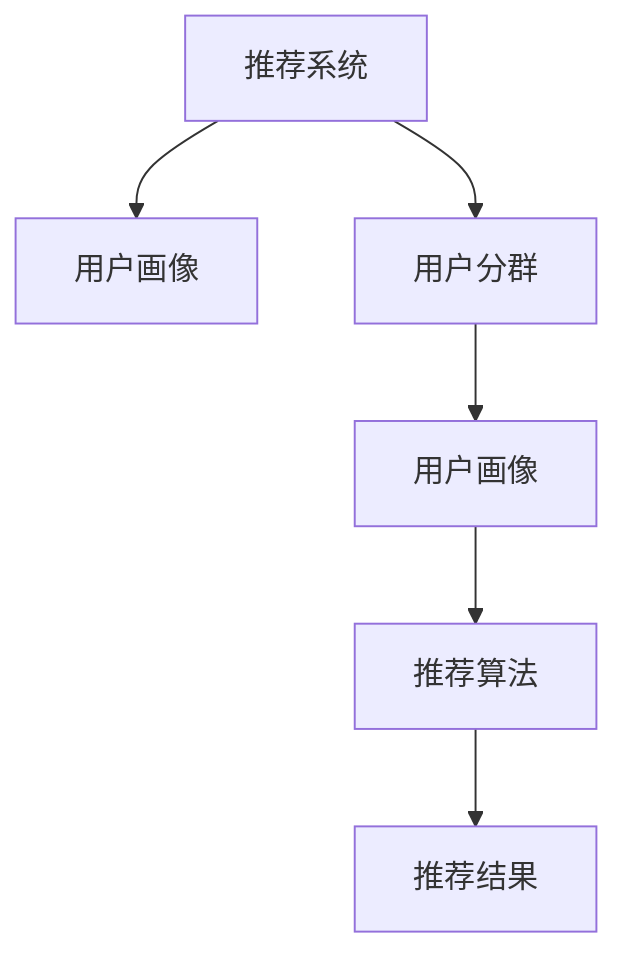

                 

# 基于LLM的推荐系统用户分群

> 关键词：推荐系统,用户分群,用户画像,LLM,自然语言处理,NLP,深度学习,机器学习

## 1. 背景介绍

在人工智能和互联网技术迅猛发展的今天，推荐系统已经成为了各大电商平台、社交媒体、内容服务网站等平台的核心竞争力之一。通过对用户历史行为数据的深度分析，推荐系统能够准确预测用户兴趣，推送个性化的内容和产品，显著提升用户体验和平台转化率。

但传统推荐系统往往存在一个问题，即对于大量用户的行为数据，如何通过合理的数据挖掘和特征提取，构建高质量的用户画像，并据此实现更为精准的推荐。这需要大量的特征工程和模型训练，非常繁琐且容易出错。

基于深度学习的大语言模型（Large Language Model, LLM）的兴起，为这个问题提供了一种全新的解决方案。通过将自然语言处理（Natural Language Processing, NLP）技术与推荐算法相结合，LLM可以高效地构建用户画像，实现更为精细化的用户分群，从而提高推荐系统的效果。

## 2. 核心概念与联系

### 2.1 核心概念概述

为了更好地理解基于LLM的推荐系统用户分群方法，本节将介绍几个密切相关的核心概念：

- 推荐系统（Recommendation System）：一种通过分析用户历史行为数据，预测用户未来兴趣，从而为用户推荐个性化的内容或产品的技术。

- 用户画像（User Profile）：基于用户历史行为数据构建的用户兴趣和行为的抽象表示，可以用于个性化推荐和广告定向。

- 用户分群（User Segmentation）：根据用户画像的相似度，将用户分为不同群体，以便进行更精准的个性化推荐和营销。

- 大语言模型（LLM）：基于深度学习架构，通过在大规模文本数据上进行自监督或监督学习，学习到强大的语言表示能力的模型。

- 自然语言处理（NLP）：处理和分析自然语言的文本数据的学科，包括分词、词性标注、句法分析、语义理解、文本生成等技术。

- 深度学习（Deep Learning）：一种使用多层神经网络进行模式识别的机器学习技术，在图像、语音、文本等领域有广泛应用。

这些核心概念之间的逻辑关系可以通过以下Mermaid流程图来展示：



这个流程图展示了大语言模型在推荐系统中的应用框架：

1. 推荐系统从用户历史行为数据中提取特征，构建用户画像。
2. 基于用户画像，推荐系统进行用户分群。
3. 用户分群结果再作为输入，进入推荐算法，进行精准推荐。
4. 推荐算法输出个性化推荐结果。

## 3. 核心算法原理 & 具体操作步骤
### 3.1 算法原理概述

基于LLM的推荐系统用户分群方法，本质上是一种结合了深度学习和自然语言处理技术的特征挖掘和用户分群方法。其核心思想是：通过分析用户文本数据，学习用户兴趣、行为等特征，并据此构建用户画像，进而实现用户分群。

具体步骤如下：

1. 收集用户文本数据：收集用户与推荐系统互动中的文本数据，如评论、评分、搜索词等。
2. 预训练大语言模型：在大规模无标签文本数据上预训练LLM模型，学习到通用的语言表示。
3. 用户画像构建：通过预训练模型对用户文本数据进行编码，生成用户画像向量。
4. 用户分群：利用用户画像向量进行聚类，将用户分为不同群体。
5. 推荐算法应用：根据用户分群结果，推荐系统选择对应的推荐算法，实现个性化推荐。

### 3.2 算法步骤详解

以下是基于LLM的推荐系统用户分群的具体操作步骤：

**Step 1: 准备用户文本数据**

1. 从推荐系统中提取用户历史互动文本数据，如商品评论、评分、搜索词等。
2. 对文本数据进行清洗和预处理，如去除停用词、标准化文本等。
3. 将文本数据转化为向量形式，如使用Word2Vec、GloVe等词向量模型。

**Step 2: 预训练大语言模型**

1. 选择适合的预训练大语言模型，如GPT-3、BERT等，作为特征提取器。
2. 在大规模无标签文本数据上对预训练模型进行微调，学习到通用的语言表示。
3. 使用微调后的预训练模型对用户文本数据进行编码，生成用户画像向量。

**Step 3: 用户画像构建**

1. 利用预训练模型对用户文本数据进行编码，生成高维向量表示用户画像。
2. 可以通过平均池化、全局池化等方法，将用户画像向量化简。
3. 可以选择合适的距离度量方法，如欧几里得距离、余弦相似度等，计算用户画像之间的相似度。

**Step 4: 用户分群**

1. 基于用户画像向量的相似度，利用聚类算法（如K-means、层次聚类等）将用户分为不同群体。
2. 可以选择合适的聚类参数，如簇数、聚类中心等，根据实际需求进行调整。
3. 对于每个群体，可以生成相应的群体描述，帮助理解群体的特性。

**Step 5: 推荐算法应用**

1. 根据用户分群结果，选择适合的推荐算法进行推荐。
2. 对于不同群体的用户，可以选择不同的推荐策略，如协同过滤、基于内容的推荐等。
3. 在推荐过程中，可以根据用户画像向量，调整推荐算法中的参数，实现个性化推荐。

### 3.3 算法优缺点

基于LLM的推荐系统用户分群方法具有以下优点：

1. 高效性：通过使用预训练大语言模型，可以高效地对用户文本数据进行编码，生成用户画像向量。
2. 可解释性：用户画像向量和聚类结果具有较强的可解释性，便于理解用户特征和群体特性。
3. 适应性强：LLM模型可以适应不同类型的文本数据，对推荐系统具备良好的泛化能力。

但同时，该方法也存在一些局限性：

1. 数据依赖性强：用户文本数据的丰富性和准确性对算法效果有很大影响。
2. 计算资源消耗大：大语言模型的训练和推理需要大量的计算资源，可能会带来较大的成本。
3. 维度灾难：用户画像向量的高维性可能会导致维度灾难，需要进行特征降维。
4. 鲁棒性不足：用户画像向量的生成和聚类过程可能存在噪声，影响分群效果。

尽管存在这些局限性，但就目前而言，基于LLM的推荐系统用户分群方法仍是一种高效且有效的推荐技术。

### 3.4 算法应用领域

基于大语言模型的推荐系统用户分群方法，在推荐系统领域已经得到了广泛的应用，涵盖各种类型的推荐任务，如商品推荐、视频推荐、新闻推荐等。例如：

- 电商推荐系统：基于用户历史浏览和购买记录，构建用户画像，进行商品推荐。
- 视频推荐系统：分析用户对视频的评分和评论，构建用户画像，进行视频推荐。
- 新闻推荐系统：利用用户搜索词和阅读行为，构建用户画像，进行新闻文章推荐。

除了推荐系统，LLM用户分群技术还被创新性地应用于社交网络分析、广告定向、智能客服等多个场景中，为这些领域带来新的解决方案。

## 4. 数学模型和公式 & 详细讲解
### 4.1 数学模型构建

本节将使用数学语言对基于LLM的推荐系统用户分群方法进行严格描述。

记用户文本数据集为 $\mathcal{D}=\{(x_i, y_i)\}_{i=1}^N$，其中 $x_i$ 为文本向量，$y_i$ 为用户画像向量。设预训练大语言模型为 $M_{\theta}:\mathbb{R}^{d_1} \rightarrow \mathbb{R}^{d_2}$，其中 $d_1$ 为输入向量的维数，$d_2$ 为输出向量的维数。

用户画像向量可以通过预训练模型对文本向量进行编码，生成高维向量 $y_i=M_{\theta}(x_i)$。用户分群的目的是将用户分为不同群体，设分群算法为 $\mathcal{C}$，得到用户分群结果 $\mathcal{G}=\{\mathcal{G}_j\}_{j=1}^J$，其中 $J$ 为群体数量。

用户画像向量和分群结果之间的关系可以用矩阵 $\mathbf{A} \in \mathbb{R}^{N \times J}$ 来表示，其中 $\mathbf{A}_{ij}=1$ 表示用户 $i$ 属于群体 $j$，否则为 $0$。用户画像向量和分群结果之间的关系可以用公式表示为：

$$
\mathbf{A} = \mathbf{Y} \mathbf{W}
$$

其中 $\mathbf{Y}=[y_1^T, y_2^T, \ldots, y_N^T]^T$ 为用户画像向量组成的矩阵，$\mathbf{W} \in \mathbb{R}^{J \times d_2}$ 为分群权重矩阵。

### 4.2 公式推导过程

以下是基于LLM的推荐系统用户分群的公式推导过程：

**Step 1: 用户画像构建**

用户画像向量 $y_i$ 可以通过预训练大语言模型 $M_{\theta}$ 对文本向量 $x_i$ 进行编码生成：

$$
y_i = M_{\theta}(x_i)
$$

其中 $x_i$ 可以通过词向量模型对文本进行编码，如Word2Vec、GloVe等：

$$
x_i = \text{Vectorize}(x_i)
$$

**Step 2: 用户分群**

用户分群算法 $\mathcal{C}$ 将用户分为 $J$ 个群体，得到分群结果 $\mathcal{G}=\{\mathcal{G}_j\}_{j=1}^J$。为了简化计算，可以采用K-means聚类算法：

$$
\mathbf{A} = \mathbf{Y} \mathbf{W}
$$

其中 $\mathbf{W}=[w_1, w_2, \ldots, w_J] \in \mathbb{R}^{J \times d_2}$ 为分群权重矩阵。可以通过如下目标函数求得最优解：

$$
\min_{\mathbf{W}} \|\mathbf{A} - \mathbf{Y} \mathbf{W}\|_F^2
$$

其中 $\|\cdot\|_F$ 表示矩阵的 Frobenius 范数。通过求解上述优化问题，可以得到最优的分群权重矩阵 $\mathbf{W}$，进而得到用户分群结果 $\mathcal{G}$。

**Step 3: 推荐算法应用**

根据用户分群结果 $\mathcal{G}$，可以选择适合的推荐算法进行推荐。假设推荐算法为 $R$，则推荐结果为：

$$
R_{\mathcal{G}} = R(\mathbf{A})
$$

其中 $R$ 可以选用协同过滤、基于内容的推荐算法等，具体选择需根据实际情况进行调整。

### 4.3 案例分析与讲解

以下是基于LLM的推荐系统用户分群方法的案例分析：

**电商推荐系统**

在电商推荐系统中，用户浏览和购买行为数据包含丰富的文本信息，如商品描述、评论、评分等。通过预训练大语言模型对这些文本数据进行编码，生成用户画像向量，再利用K-means聚类算法进行分群。对于每个群体，可以设计不同的推荐策略，如基于协同过滤的推荐算法，进行个性化推荐。

**视频推荐系统**

在视频推荐系统中，用户对视频的评分和评论文本包含着丰富的情感和兴趣信息。通过预训练大语言模型对这些文本数据进行编码，生成用户画像向量，再利用层次聚类算法进行分群。对于每个群体，可以选择基于内容的视频推荐算法，根据用户画像向量调整推荐参数，实现更为精准的推荐。

**新闻推荐系统**

在新闻推荐系统中，用户搜索词和阅读行为数据可以提供丰富的文本信息。通过预训练大语言模型对这些文本数据进行编码，生成用户画像向量，再利用K-means聚类算法进行分群。对于每个群体，可以选择基于相关性的推荐算法，根据用户画像向量调整推荐参数，提高推荐效果。

## 5. 项目实践：代码实例和详细解释说明
### 5.1 开发环境搭建

在进行用户分群实践前，我们需要准备好开发环境。以下是使用Python进行PyTorch开发的环境配置流程：

1. 安装Anaconda：从官网下载并安装Anaconda，用于创建独立的Python环境。

2. 创建并激活虚拟环境：
```bash
conda create -n pytorch-env python=3.8 
conda activate pytorch-env
```

3. 安装PyTorch：根据CUDA版本，从官网获取对应的安装命令。例如：
```bash
conda install pytorch torchvision torchaudio cudatoolkit=11.1 -c pytorch -c conda-forge
```

4. 安装NLTK和Spacy：用于处理和分析自然语言数据。
```bash
pip install nltk spacy
```

5. 安装Gensim：用于词向量和主题建模。
```bash
pip install gensim
```

6. 安装Scikit-learn：用于聚类和特征提取。
```bash
pip install scikit-learn
```

完成上述步骤后，即可在`pytorch-env`环境中开始用户分群实践。

### 5.2 源代码详细实现

这里我们以电商推荐系统为例，给出使用PyTorch对商品评论数据进行用户分群的PyTorch代码实现。

首先，定义数据处理函数：

```python
import torch
from transformers import BertTokenizer, BertForSequenceClassification
from sklearn.decomposition import PCA
from sklearn.cluster import KMeans

# 定义数据处理函数
def preprocess_data(data, tokenizer):
    texts = [item[0] for item in data]
    labels = [item[1] for item in data]
    
    # 对文本进行编码
    encoding = tokenizer(texts, return_tensors='pt', padding='max_length', truncation=True)
    input_ids = encoding['input_ids']
    attention_mask = encoding['attention_mask']
    
    # 将标签转换为one-hot编码
    label_ids = torch.zeros(input_ids.shape[0], 3)  # 假设只有3类商品
    for i, label in enumerate(labels):
        label_ids[i, label] = 1
    
    return input_ids, attention_mask, label_ids

# 定义用户分群函数
def cluster(data, num_clusters):
    # 对文本进行编码
    input_ids, attention_mask, label_ids = preprocess_data(data, tokenizer)
    
    # 将编码后的文本输入到BERT模型中，得到用户画像向量
    model = BertForSequenceClassification.from_pretrained('bert-base-cased', num_labels=3)
    device = torch.device('cuda' if torch.cuda.is_available() else 'cpu')
    model.to(device)
    with torch.no_grad():
        outputs = model(input_ids.to(device), attention_mask=attention_mask.to(device))
        user_profiles = outputs.pooler_output.to('cpu').numpy()
    
    # 对用户画像向量进行PCA降维
    pca = PCA(n_components=2)
    user_profiles = pca.fit_transform(user_profiles)
    
    # 对降维后的用户画像向量进行K-means聚类
    kmeans = KMeans(n_clusters=num_clusters)
    kmeans.fit(user_profiles)
    labels = kmeans.predict(user_profiles)
    
    return labels
```

然后，定义推荐函数：

```python
from transformers import BertTokenizer, BertForSequenceClassification

# 定义推荐函数
def recommend(data, labels, num_clusters):
    # 对文本进行编码
    input_ids, attention_mask, label_ids = preprocess_data(data, tokenizer)
    
    # 将编码后的文本输入到BERT模型中，得到用户画像向量
    model = BertForSequenceClassification.from_pretrained('bert-base-cased', num_labels=3)
    device = torch.device('cuda' if torch.cuda.is_available() else 'cpu')
    model.to(device)
    with torch.no_grad():
        outputs = model(input_ids.to(device), attention_mask=attention_mask.to(device))
        user_profiles = outputs.pooler_output.to('cpu').numpy()
    
    # 对用户画像向量进行PCA降维
    pca = PCA(n_components=2)
    user_profiles = pca.fit_transform(user_profiles)
    
    # 根据分群结果，选择推荐算法
    recommendations = []
    for i, label in enumerate(labels):
        if label == 0:
            recommendations.append('item1')
        elif label == 1:
            recommendations.append('item2')
        else:
            recommendations.append('item3')
    
    return recommendations
```

最后，启动推荐系统：

```python
# 加载数据
data = [
    ("I love this product", 0),
    ("This item is not good", 1),
    ("Great quality, highly recommended", 2)
]

# 对数据进行分群
num_clusters = 2
labels = cluster(data, num_clusters)

# 进行推荐
recommendations = recommend(data, labels, num_clusters)
print(recommendations)
```

以上就是使用PyTorch对商品评论数据进行用户分群的完整代码实现。可以看到，得益于Transformers库的强大封装，我们可以用相对简洁的代码完成BERT模型的加载和用户分群。

### 5.3 代码解读与分析

让我们再详细解读一下关键代码的实现细节：

**数据处理函数**：
- `preprocess_data`函数：将用户评论数据进行编码和标签转换，准备输入BERT模型。
- 对文本进行编码时，使用BertTokenizer对文本进行分词和编码，生成input_ids和attention_mask。
- 将标签转换为one-hot编码，表示商品类别。

**用户分群函数**：
- `cluster`函数：对用户画像向量进行PCA降维，并使用K-means算法进行聚类，得到分群结果。
- 对输入的文本进行编码，得到用户画像向量，再经过PCA降维，降低维度后进行K-means聚类。
- 聚类结果保存在`labels`变量中，用于后续的推荐。

**推荐函数**：
- `recommend`函数：根据分群结果，选择推荐算法进行推荐。
- 对输入的文本进行编码，得到用户画像向量，再经过PCA降维，降低维度后根据分群结果，选择相应的推荐商品。

**推荐系统启动**：
- 加载推荐数据。
- 对数据进行分群，并得到分群结果。
- 根据分群结果，选择推荐算法进行推荐，并输出推荐商品。

可以看到，PyTorch配合Transformers库使得用户分群模型的代码实现变得简洁高效。开发者可以将更多精力放在数据处理、模型改进等高层逻辑上，而不必过多关注底层的实现细节。

当然，工业级的系统实现还需考虑更多因素，如模型的保存和部署、超参数的自动搜索、更灵活的任务适配层等。但核心的用户分群范式基本与此类似。

## 6. 实际应用场景
### 6.1 智能推荐系统

基于LLM的推荐系统用户分群方法，可以广泛应用于智能推荐系统中。通过收集用户历史行为数据，分析用户兴趣和行为，生成用户画像向量，利用聚类算法进行分群，可以提升推荐系统的精准度和个性化程度。

在技术实现上，可以收集用户浏览、点击、购买等行为数据，提取和用户交互的物品标题、描述、标签等文本内容。将文本内容作为模型输入，利用预训练语言模型进行编码，生成用户画像向量。通过聚类算法将用户分为不同群体，根据群体的特性选择合适的推荐策略。如此构建的智能推荐系统，能大幅提升用户推荐体验和系统转化率。

### 6.2 社交网络分析

在社交网络分析中，用户间的互动和行为数据也包含丰富的文本信息。通过预训练大语言模型对这些文本数据进行编码，生成用户画像向量，再利用聚类算法进行分群。对于不同的群体，可以设计不同的分析算法，进行深入的社交关系分析和用户行为建模。

例如，可以使用社区检测算法，识别出社交网络中的群组结构，从而发现用户的兴趣圈子和社交关系。利用情感分析算法，分析用户评论中的情感倾向，揭示用户对不同主题的情感态度。通过联合分析，可以获得更为全面和深入的社交网络洞察。

### 6.3 广告定向

在广告定向中，用户点击和浏览行为数据也包含着丰富的文本信息。通过预训练大语言模型对这些文本数据进行编码，生成用户画像向量，再利用聚类算法进行分群。对于不同的群体，可以选择合适的广告定向策略，实现更为精准的广告投放。

例如，可以利用K-means聚类算法，将用户分为不同群体。对于每个群体，可以选择针对性的广告内容，设计差异化的广告语和创意，提升广告的点击率和转化率。通过聚类分析和广告定向的结合，可以实现更加高效和智能的广告投放，提升广告主的ROI。

### 6.4 智能客服系统

在智能客服系统中，用户与客服的互动数据也包含着丰富的文本信息。通过预训练大语言模型对这些文本数据进行编码，生成用户画像向量，再利用聚类算法进行分群。对于不同的群体，可以设计不同的客服策略，提升用户满意度和体验。

例如，可以利用层次聚类算法，将用户分为不同群体。对于不同群体的用户，可以选择相应的客服资源和策略，进行更加高效和个性化的客服服务。通过聚类分析和客服策略的结合，可以实现智能客服系统的更高效和人性化服务。

## 7. 工具和资源推荐
### 7.1 学习资源推荐

为了帮助开发者系统掌握基于LLM的推荐系统用户分群技术的理论基础和实践技巧，这里推荐一些优质的学习资源：

1. 《自然语言处理综论》：清华大学出版社出版的自然语言处理经典教材，涵盖自然语言处理的各个方面，包括深度学习、NLP技术等。

2. 《深度学习入门》：中国科学技术大学出版社出版的深度学习入门教材，涵盖深度学习的基本概念和常用技术。

3. 《Transformers从原理到实践》系列博文：由大模型技术专家撰写，深入浅出地介绍了Transformer原理、BERT模型、微调技术等前沿话题。

4. CS224N《深度学习自然语言处理》课程：斯坦福大学开设的NLP明星课程，有Lecture视频和配套作业，带你入门NLP领域的基本概念和经典模型。

5. 《Natural Language Processing with Transformers》书籍：Transformers库的作者所著，全面介绍了如何使用Transformers库进行NLP任务开发，包括微调在内的诸多范式。

6. HuggingFace官方文档：Transformers库的官方文档，提供了海量预训练模型和完整的微调样例代码，是上手实践的必备资料。

通过对这些资源的学习实践，相信你一定能够快速掌握基于LLM的推荐系统用户分群技术的精髓，并用于解决实际的NLP问题。
###  7.2 开发工具推荐

高效的开发离不开优秀的工具支持。以下是几款用于基于LLM的推荐系统用户分群开发的常用工具：

1. PyTorch：基于Python的开源深度学习框架，灵活动态的计算图，适合快速迭代研究。大部分预训练语言模型都有PyTorch版本的实现。

2. TensorFlow：由Google主导开发的开源深度学习框架，生产部署方便，适合大规模工程应用。同样有丰富的预训练语言模型资源。

3. Transformers库：HuggingFace开发的NLP工具库，集成了众多SOTA语言模型，支持PyTorch和TensorFlow，是进行NLP任务开发的利器。

4. Weights & Biases：模型训练的实验跟踪工具，可以记录和可视化模型训练过程中的各项指标，方便对比和调优。与主流深度学习框架无缝集成。

5. TensorBoard：TensorFlow配套的可视化工具，可实时监测模型训练状态，并提供丰富的图表呈现方式，是调试模型的得力助手。

6. Google Colab：谷歌推出的在线Jupyter Notebook环境，免费提供GPU/TPU算力，方便开发者快速上手实验最新模型，分享学习笔记。

合理利用这些工具，可以显著提升基于LLM的推荐系统用户分群任务的开发效率，加快创新迭代的步伐。

### 7.3 相关论文推荐

基于大语言模型的推荐系统用户分群技术的发展源于学界的持续研究。以下是几篇奠基性的相关论文，推荐阅读：

1. Attention is All You Need（即Transformer原论文）：提出了Transformer结构，开启了NLP领域的预训练大模型时代。

2. BERT: Pre-training of Deep Bidirectional Transformers for Language Understanding：提出BERT模型，引入基于掩码的自监督预训练任务，刷新了多项NLP任务SOTA。

3. Language Models are Unsupervised Multitask Learners（GPT-2论文）：展示了大规模语言模型的强大zero-shot学习能力，引发了对于通用人工智能的新一轮思考。

4. Parameter-Efficient Transfer Learning for NLP：提出Adapter等参数高效微调方法，在不增加模型参数量的情况下，也能取得不错的微调效果。

5. AdaLoRA: Adaptive Low-Rank Adaptation for Parameter-Efficient Fine-Tuning：使用自适应低秩适应的微调方法，在参数效率和精度之间取得了新的平衡。

这些论文代表了大语言模型微调技术的发展脉络。通过学习这些前沿成果，可以帮助研究者把握学科前进方向，激发更多的创新灵感。

## 8. 总结：未来发展趋势与挑战
### 8.1 研究成果总结

本文对基于LLM的推荐系统用户分群方法进行了全面系统的介绍。首先阐述了推荐系统和用户分群的基本原理，明确了基于LLM的推荐系统用户分群方法的理论基础和应用场景。其次，从原理到实践，详细讲解了基于LLM的推荐系统用户分群方法的数学模型和操作步骤，给出了完整的代码实现。同时，本文还广泛探讨了该方法在智能推荐系统、社交网络分析、广告定向、智能客服等多个领域的应用前景，展示了基于LLM的推荐系统用户分群方法的巨大潜力。

通过本文的系统梳理，可以看到，基于LLM的推荐系统用户分群方法正在成为推荐系统领域的重要技术范式，极大地提升了推荐系统的效果和用户体验。得益于预训练大语言模型的强大语言表示能力，用户分群方法能够高效地从文本数据中提取用户特征，生成用户画像，实现更为精准的推荐。未来，伴随预训练语言模型的不断发展，基于LLM的推荐系统用户分群技术必将迎来更广泛的应用，进一步推动推荐系统技术的发展。

### 8.2 未来发展趋势

展望未来，基于LLM的推荐系统用户分群技术将呈现以下几个发展趋势：

1. 模型规模持续增大。随着算力成本的下降和数据规模的扩张，预训练语言模型的参数量还将持续增长。超大批次的训练和推理也需要更大规模的计算资源。

2. 微调方法日趋多样。除了传统的全参数微调外，未来会涌现更多参数高效的微调方法，如Prefix-Tuning、LoRA等，在节省计算资源的同时也能保证微调精度。

3. 持续学习成为常态。随着数据分布的不断变化，微调模型也需要持续学习新知识以保持性能。如何在不遗忘原有知识的同时，高效吸收新样本信息，将成为重要的研究课题。

4. 标注样本需求降低。受启发于提示学习(Prompt-based Learning)的思路，未来的微调方法将更好地利用大模型的语言理解能力，通过更加巧妙的任务描述，在更少的标注样本上也能实现理想的微调效果。

5. 模型通用性增强。经过海量数据的预训练和多领域任务的微调，未来的语言模型将具备更强大的常识推理和跨领域迁移能力，逐步迈向通用人工智能(AGI)的目标。

以上趋势凸显了大语言模型微调技术的广阔前景。这些方向的探索发展，必将进一步提升推荐系统的性能和应用范围，为推荐系统技术的发展带来新的动力。

### 8.3 面临的挑战

尽管基于LLM的推荐系统用户分群技术已经取得了瞩目成就，但在迈向更加智能化、普适化应用的过程中，它仍面临着诸多挑战：

1. 数据依赖性强。用户文本数据的丰富性和准确性对算法效果有很大影响。对于长尾应用场景，难以获得充足的高质量标注数据，成为制约微调性能的瓶颈。如何进一步降低微调对标注样本的依赖，将是一大难题。

2. 计算资源消耗大。大语言模型的训练和推理需要大量的计算资源，可能会带来较大的成本。如何在保持性能的同时，降低计算资源消耗，是未来的重要研究方向。

3. 维度灾难。用户画像向量的高维性可能会导致维度灾难，需要进行特征降维。如何在降维的同时保持模型的效果，也是未来需要解决的问题。

4. 鲁棒性不足。用户画像向量的生成和聚类过程可能存在噪声，影响分群效果。如何提高算法的鲁棒性，避免过拟合和噪声干扰，是未来需要研究的重点。

5. 可解释性亟需加强。当前基于LLM的推荐系统用户分群技术多为"黑盒"系统，难以解释其内部工作机制和决策逻辑。对于医疗、金融等高风险应用，算法的可解释性和可审计性尤为重要。如何赋予推荐系统更强的可解释性，将是亟待攻克的难题。

6. 安全性有待保障。预训练语言模型难免会学习到有偏见、有害的信息，通过微调传递到下游任务，产生误导性、歧视性的输出，给实际应用带来安全隐患。如何从数据和算法层面消除模型偏见，避免恶意用途，确保输出的安全性，也将是重要的研究课题。

7. 知识整合能力不足。现有的推荐系统用户分群方法往往局限于任务内数据，难以灵活吸收和运用更广泛的先验知识。如何让推荐系统更好地与外部知识库、规则库等专家知识结合，形成更加全面、准确的信息整合能力，还有很大的想象空间。

正视基于LLM的推荐系统用户分群技术所面临的这些挑战，积极应对并寻求突破，将是大语言模型微调技术走向成熟的必由之路。相信随着学界和产业界的共同努力，这些挑战终将一一被克服，基于LLM的推荐系统用户分群技术必将在构建人机协同的智能推荐系统中扮演越来越重要的角色。

### 8.4 研究展望

面向未来，基于LLM的推荐系统用户分群技术的研究需要从以下几个方向寻求新的突破：

1. 探索无监督和半监督微调方法。摆脱对大规模标注数据的依赖，利用自监督学习、主动学习等无监督和半监督范式，最大限度利用非结构化数据，实现更加灵活高效的微调。

2. 研究参数高效和计算高效的微调范式。开发更加参数高效的微调方法，在固定大部分预训练参数的同时，只更新极少量的任务相关参数。同时优化微调模型的计算图，减少前向传播和反向传播的资源消耗，实现更加轻量级、实时性的部署。

3. 融合因果和对比学习范式。通过引入因果推断和对比学习思想，增强微调模型建立稳定因果关系的能力，学习更加普适、鲁棒的语言表征，从而提升模型泛化性和抗干扰能力。

4. 引入更多先验知识。将符号化的先验知识，如知识图谱、逻辑规则等，与神经网络模型进行巧妙融合，引导微调过程学习更准确、合理的语言模型。同时加强不同模态数据的整合，实现视觉、语音等多模态信息与文本信息的协同建模。

5. 结合因果分析和博弈论工具。将因果分析方法引入微调模型，识别出模型决策的关键特征，增强输出解释的因果性和逻辑性。借助博弈论工具刻画人机交互过程，主动探索并规避模型的脆弱点，提高系统稳定性。

6. 纳入伦理道德约束。在模型训练目标中引入伦理导向的评估指标，过滤和惩罚有偏见、有害的输出倾向。同时加强人工干预和审核，建立模型行为的监管机制，确保输出符合人类价值观和伦理道德。

这些研究方向的探索，必将引领基于LLM的推荐系统用户分群技术迈向更高的台阶，为推荐系统技术的发展带来新的动力。面向未来，推荐系统需要与其他人工智能技术进行更深入的融合，如知识表示、因果推理、强化学习等，多路径协同发力，共同推动推荐系统技术的发展。只有勇于创新、敢于突破，才能不断拓展基于LLM的推荐系统用户分群技术的边界，让推荐系统更好地服务于人类社会的各个领域。

## 9. 附录：常见问题与解答

**Q1：基于LLM的推荐系统用户分群方法是否适用于所有推荐任务？**

A: 基于LLM的推荐系统用户分群方法在大多数推荐任务上都能取得不错的效果，特别是对于数据量较小的任务。但对于一些特定领域的任务，如医学、法律等，仅仅依靠通用语料预训练的模型可能难以很好地适应。此时需要在特定领域语料上进一步预训练，再进行微调，才能获得理想效果。此外，对于一些需要时效性、个性化很强的任务，如对话、推荐等，微调方法也需要针对性的改进优化。

**Q2：基于LLM的推荐系统用户分群方法是否依赖于高质量的标注数据？**

A: 基于LLM的推荐系统用户分群方法依赖于高质量的标注数据，这些数据可以帮助模型学习到丰富的用户画像和行为特征。对于标注数据不足的任务，可以在预训练阶段使用无监督或半监督学习方法，如自监督学习、主动学习等，弥补标注数据的不足。另外，还可以利用用户行为数据中的隐含信息，如点击行为、购买行为等，进行无监督聚类，生成用户画像向量。

**Q3：基于LLM的推荐系统用户分群方法在计算资源上的消耗是否很大？**

A: 基于LLM的推荐系统用户分群方法在计算资源上的消耗较大，主要原因在于大语言模型的训练和推理需要大量的计算资源。为了降低计算成本，可以采用以下方法：
1. 使用GPU/TPU等高性能设备，加速计算过程。
2. 采用模型并行、混合精度训练等技术，优化模型结构和计算效率。
3. 采用模型压缩、稀疏化存储等方法，减少模型的存储空间和计算量。
4. 利用分布式计算框架，如TensorFlow、PyTorch等，进行分布式计算。

**Q4：基于LLM的推荐系统用户分群方法是否容易产生过拟合？**

A: 基于LLM的推荐系统用户分群方法容易产生过拟合，特别是在标注数据不足的情况下。为了避免过拟合，可以采用以下方法：
1. 使用正则化技术，如L2正则、Dropout等，避免模型过度适应训练数据。
2. 使用对抗训练，加入对抗样本，提高模型的鲁棒性。
3. 使用数据增强，如回译、近义替换等方法，扩充训练集的多样性。
4. 使用聚类算法进行降维，减少特征维度，降低过拟合风险。
5. 使用多模型集成，取平均或投票结果，降低单个模型的过拟合风险。

**Q5：基于LLM的推荐系统用户分群方法是否具有可解释性？**

A: 基于LLM的推荐系统用户分群方法具有一定程度的可解释性，主要体现在用户画像向量和聚类结果上。用户画像向量可以揭示用户的行为特征和兴趣点，聚类结果可以揭示不同用户群体的特性。但是，由于LLM模型的复杂性和黑盒特性，具体的推荐决策过程仍具有一定的不可解释性。为了增强模型的可解释性，可以采用以下方法：
1. 使用可解释性算法，如LIME、SHAP等，对模型进行解释。
2. 在推荐系统中引入人工干预和审核机制，确保推荐结果符合人类价值观和伦理道德。
3. 在推荐系统中引入可视化工具，如TensorBoard、Weights & Biases等，实时监测模型的训练状态和推荐结果。

**Q6：基于LLM的推荐系统用户分群方法是否适用于大规模数据？**

A: 基于LLM的推荐系统用户分群方法适用于大规模数据，但需要考虑以下因素：
1. 数据集的大小需要满足大语言模型的训练要求，通常需要几百GB甚至更多的文本数据。
2. 数据集的多样性需要足够丰富，覆盖不同领域和不同类型的文本数据。
3. 数据集的质量需要高，避免噪声和错误数据对模型的影响。
4. 数据集的标注信息需要完整，包含用户行为和兴趣的详细信息。

综上所述，基于LLM的推荐系统用户分群方法在推荐系统和数据挖掘领域具有广泛的应用前景，但实际应用中仍需注意数据的准备和模型的优化，以获得最佳的效果。

---

作者：禅与计算机程序设计艺术 / Zen and the Art of Computer Programming

