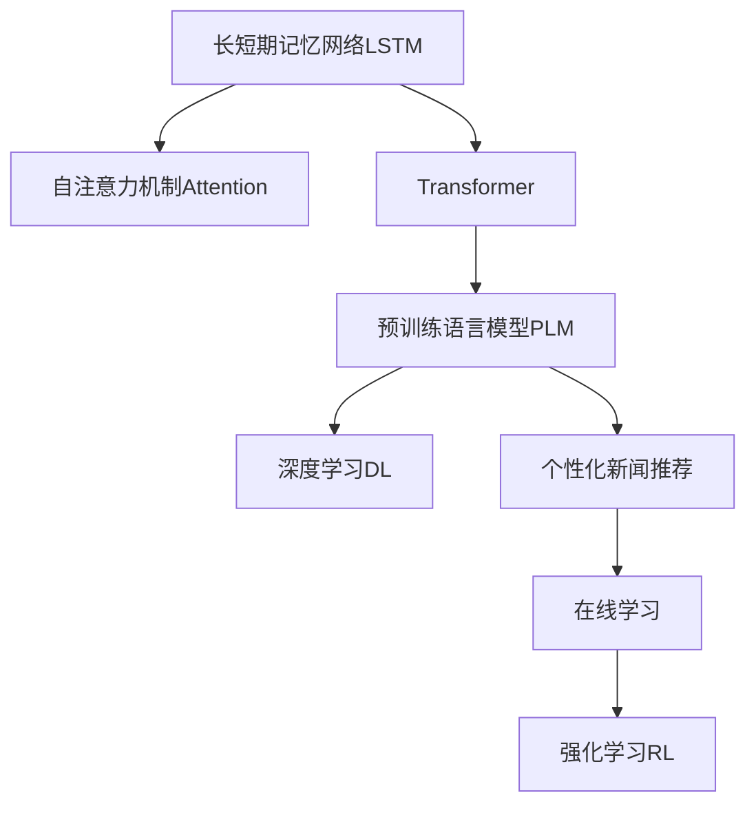

                 

# 基于LLM的生成式新闻推荐系统GENRE

> 关键词：生成式推荐,自然语言处理(NLP),长短期记忆网络(LSTM),自注意力机制(Attention),Transformer,预训练语言模型(PLM),深度学习,个性化新闻推荐

## 1. 背景介绍

### 1.1 问题由来

在信息爆炸的时代，如何高效地从海量新闻数据中挑选出满足用户兴趣的个性化内容，成为内容推荐系统的核心问题。随着深度学习技术的发展，推荐系统开始利用机器学习算法，自动分析用户的历史行为，从而提供更加个性化的新闻推荐服务。然而，传统的基于协同过滤的推荐系统难以解释推荐过程，且推荐精度受限于用户行为数据的稀疏性。

近年来，基于自然语言处理(NLP)的生成式推荐系统受到了广泛关注。这些系统使用预训练语言模型(PLM)作为推荐模型的核心组件，通过分析用户与新闻的语义匹配度，生成个性化的新闻摘要或标题，从而提供高质量的推荐内容。

### 1.2 问题核心关键点

生成式新闻推荐系统(GENRE)的核心在于利用预训练语言模型自动生成新闻摘要或标题，从而进行个性化推荐。系统首先使用预训练模型学习新闻内容的语义表示，然后根据用户的历史行为和兴趣偏好，生成个性化的摘要或标题。由于用户历史行为数据的稀疏性，生成式推荐系统通过自监督学习和在线学习的方式，不断优化模型，提升推荐精度。

此外，为了应对新用户或冷启动问题，生成式推荐系统还可以引入强化学习等技术，通过在线学习新样本，逐步建立和优化推荐模型。

### 1.3 问题研究意义

研究基于预训练语言模型的生成式新闻推荐系统，对于提升推荐系统的效果和用户体验，具有重要意义：

1. 高效处理海量新闻数据。预训练语言模型能够自动学习新闻的语义特征，高效处理大规模新闻数据，提升推荐效率。
2. 提升推荐系统的可解释性。利用预训练模型的语义表示，可以解释推荐过程，提高用户信任度。
3. 增强推荐系统的个性化能力。通过分析新闻和用户的语义匹配度，生成个性化的摘要或标题，提升推荐精度和用户体验。
4. 解决冷启动问题。通过在线学习和强化学习，生成式推荐系统可以在新用户或冷启动场景下，快速适应并推荐高质量内容。
5. 推动内容产业升级。高效、个性化的推荐系统能够提升内容消费效率，促进内容产业的数字化转型。

## 2. 核心概念与联系

### 2.1 核心概念概述

为了更好地理解基于LLM的生成式新闻推荐系统，本节将介绍几个密切相关的核心概念：

- **长短期记忆网络(LSTM)**：一种递归神经网络，能够处理序列数据并记住之前的状态。常用于序列数据的建模，如文本生成、时间序列预测等。
- **自注意力机制(Attention)**：一种机制，用于在序列数据中查找重要的特征。通过计算不同位置的注意力权重，强调序列中不同位置的特征，从而增强模型的表达能力。
- **Transformer**：一种基于自注意力机制的神经网络结构，用于处理序列数据。Transformer结构在自然语言处理领域取得了广泛应用，如BERT、GPT等。
- **预训练语言模型(PLM)**：通过在大规模无标签文本数据上进行自监督预训练，学习语言的通用表示。常见的预训练任务包括掩码语言模型、下一句预测等。
- **深度学习(DL)**：一种机器学习技术，通过多层神经网络进行特征提取和分类等任务。深度学习在大数据环境下取得了突破性进展，广泛应用于图像、语音、文本等领域。
- **个性化新闻推荐**：根据用户的历史行为和兴趣偏好，推荐个性化的新闻内容，提升用户体验和推荐效果。
- **在线学习**：在不断获得新数据的情况下，通过在线学习不断更新模型，适应新的数据分布。
- **强化学习(RL)**：一种通过智能体与环境交互，不断优化行为策略的学习方法。

这些核心概念之间的逻辑关系可以通过以下Mermaid流程图来展示：



这个流程图展示了大语言模型在生成式新闻推荐系统中的关键组件及其之间的关系：

1. 长短期记忆网络处理序列数据。
2. 自注意力机制增强序列数据建模能力。
3. Transformer结构用于序列数据处理。
4. 预训练语言模型学习语言的通用表示。
5. 深度学习应用于特征提取和分类。
6. 个性化新闻推荐基于用户历史行为。
7. 在线学习不断更新推荐模型。
8. 强化学习优化推荐策略。

这些核心概念共同构成了生成式新闻推荐系统的框架，使得系统能够高效、个性化地推荐新闻内容。

## 3. 核心算法原理 & 具体操作步骤
### 3.1 算法原理概述

基于预训练语言模型的生成式新闻推荐系统，本质上是一种基于深度学习的自然语言处理(NLP)任务。其核心思想是：使用预训练语言模型学习新闻内容的语义表示，根据用户的历史行为和兴趣偏好，生成个性化的新闻摘要或标题，从而进行推荐。

形式化地，假设预训练语言模型为 $M_{\theta}$，其中 $\theta$ 为预训练得到的模型参数。给定用户 $u$ 和新闻文章 $a$，系统需要计算新闻 $a$ 与用户 $u$ 的匹配度，生成个性化的新闻摘要或标题，推荐给用户 $u$。

具体步骤如下：

1. 使用预训练模型 $M_{\theta}$ 对新闻 $a$ 进行编码，得到新闻的语义表示 $\mathbf{a}=M_{\theta}(a)$。
2. 根据用户 $u$ 的历史行为和兴趣偏好，生成一个与用户兴趣相关的向量 $\mathbf{u}$。
3. 计算新闻 $a$ 与用户 $u$ 的匹配度，得到匹配度向量 $\mathbf{sim}=\mathbf{a} \cdot \mathbf{u}$。
4. 利用匹配度向量 $\mathbf{sim}$ 生成个性化的新闻摘要或标题，作为推荐结果。

### 3.2 算法步骤详解

基于预训练语言模型的生成式新闻推荐系统，一般包括以下几个关键步骤：

**Step 1: 准备预训练模型和数据集**
- 选择合适的预训练语言模型 $M_{\theta}$ 作为初始化参数，如BERT、GPT等。
- 准备用户行为数据集 $D_u$ 和新闻数据集 $D_a$，划分为训练集、验证集和测试集。一般要求用户行为数据与新闻数据分布不要差异过大。

**Step 2: 设计任务适配层**
- 根据任务类型，在预训练模型顶层设计合适的输出层和损失函数。
- 对于生成任务，通常在顶层添加语言模型的解码器输出概率分布，并以负对数似然为损失函数。

**Step 3: 设置微调超参数**
- 选择合适的优化算法及其参数，如 AdamW、SGD 等，设置学习率、批大小、迭代轮数等。
- 设置正则化技术及强度，包括权重衰减、Dropout、Early Stopping 等。
- 确定冻结预训练参数的策略，如仅微调顶层，或全部参数都参与微调。

**Step 4: 执行梯度训练**
- 将训练集数据分批次输入模型，前向传播计算损失函数。
- 反向传播计算参数梯度，根据设定的优化算法和学习率更新模型参数。
- 周期性在验证集上评估模型性能，根据性能指标决定是否触发 Early Stopping。
- 重复上述步骤直到满足预设的迭代轮数或 Early Stopping 条件。

**Step 5: 测试和部署**
- 在测试集上评估生成式推荐系统的效果，对比微调前后的推荐精度提升。
- 使用生成式推荐系统对新用户和新新闻进行推荐，集成到实际的应用系统中。
- 持续收集用户行为数据，定期重新微调模型，以适应数据分布的变化。

以上是基于深度学习的生成式新闻推荐系统的一般流程。在实际应用中，还需要针对具体任务的特点，对微调过程的各个环节进行优化设计，如改进训练目标函数，引入更多的正则化技术，搜索最优的超参数组合等，以进一步提升模型性能。

### 3.3 算法优缺点

基于预训练语言模型的生成式新闻推荐系统具有以下优点：
1. 高效处理大规模文本数据。预训练模型能够自动学习文本的语义特征，高效处理新闻数据，提升推荐效率。
2. 提升推荐系统的可解释性。利用预训练模型的语义表示，可以解释推荐过程，提高用户信任度。
3. 增强推荐系统的个性化能力。通过分析新闻和用户的语义匹配度，生成个性化的摘要或标题，提升推荐精度和用户体验。
4. 解决冷启动问题。通过在线学习和强化学习，生成式推荐系统可以在新用户或冷启动场景下，快速适应并推荐高质量内容。

同时，该方法也存在一定的局限性：
1. 依赖标注数据。微调的效果很大程度上取决于标注数据的质量和数量，获取高质量标注数据的成本较高。
2. 迁移能力有限。当目标任务与预训练数据的分布差异较大时，微调的性能提升有限。
3. 可解释性不足。生成式推荐系统的决策过程通常缺乏可解释性，难以对其推理逻辑进行分析和调试。

尽管存在这些局限性，但就目前而言，基于深度学习的微调方法仍是最主流的推荐系统范式。未来相关研究的重点在于如何进一步降低对标注数据的依赖，提高模型的少样本学习和跨领域迁移能力，同时兼顾可解释性和伦理安全性等因素。

### 3.4 算法应用领域

基于预训练语言模型的生成式新闻推荐系统已经在新闻推荐、内容聚合、广告投放等多个领域得到应用，取得了显著的效果。

- **新闻推荐**：根据用户的历史行为和兴趣偏好，推荐个性化的新闻内容，提升用户体验和推荐效果。
- **内容聚合**：自动聚合相关新闻内容，生成摘要或标题，帮助用户快速获取关键信息。
- **广告投放**：利用用户的新闻阅读偏好，推荐相关广告，提升广告投放效果。

除了上述这些经典应用外，生成式推荐系统还被创新性地应用到更多场景中，如个性化电商推荐、音乐推荐、视频推荐等，为内容消费提供了更加智能化、个性化的解决方案。

## 4. 数学模型和公式 & 详细讲解 & 举例说明
### 4.1 数学模型构建

本节将使用数学语言对基于LLM的生成式新闻推荐系统进行更加严格的刻画。

记预训练语言模型为 $M_{\theta}$，其中 $\theta$ 为预训练得到的模型参数。假设用户 $u$ 的历史行为和兴趣偏好为 $\mathbf{u}$，新闻 $a$ 的语义表示为 $\mathbf{a}=M_{\theta}(a)$。

定义用户 $u$ 和新闻 $a$ 的匹配度向量为 $\mathbf{sim}=\mathbf{a} \cdot \mathbf{u}$，在训练集上定义平均匹配度为：

$$
\mathcal{L}(\theta) = -\frac{1}{N}\sum_{i=1}^N \mathbf{a}_i \cdot \mathbf{u}_i
$$

其中 $\mathbf{a}_i$ 和 $\mathbf{u}_i$ 分别表示第 $i$ 个训练样本的新闻和用户向量。

微调的优化目标是最小化平均匹配度 $\mathcal{L}(\theta)$，即找到最优参数：

$$
\theta^* = \mathop{\arg\min}_{\theta} \mathcal{L}(\theta)
$$

在实践中，我们通常使用基于梯度的优化算法（如SGD、Adam等）来近似求解上述最优化问题。设 $\eta$ 为学习率，$\lambda$ 为正则化系数，则参数的更新公式为：

$$
\theta \leftarrow \theta - \eta \nabla_{\theta}\mathcal{L}(\theta) - \eta\lambda\theta
$$

其中 $\nabla_{\theta}\mathcal{L}(\theta)$ 为损失函数对参数 $\theta$ 的梯度，可通过反向传播算法高效计算。

### 4.2 公式推导过程

以下我们以生成新闻摘要为例，推导平均匹配度 $\mathcal{L}(\theta)$ 及其梯度的计算公式。

假设用户 $u$ 的历史行为和兴趣偏好为 $\mathbf{u}$，新闻 $a$ 的语义表示为 $\mathbf{a}=M_{\theta}(a)$。则匹配度向量 $\mathbf{sim}$ 可以表示为：

$$
\mathbf{sim} = \mathbf{a} \cdot \mathbf{u}
$$

在训练集上定义平均匹配度为：

$$
\mathcal{L}(\theta) = -\frac{1}{N}\sum_{i=1}^N \mathbf{a}_i \cdot \mathbf{u}_i
$$

根据链式法则，损失函数对参数 $\theta_k$ 的梯度为：

$$
\frac{\partial \mathcal{L}(\theta)}{\partial \theta_k} = -\frac{1}{N}\sum_{i=1}^N (\mathbf{a}_i \cdot \frac{\partial \mathbf{u}_i}{\partial \theta_k})
$$

其中 $\frac{\partial \mathbf{u}_i}{\partial \theta_k}$ 可进一步递归展开，利用自动微分技术完成计算。

在得到损失函数的梯度后，即可带入参数更新公式，完成模型的迭代优化。重复上述过程直至收敛，最终得到适应用户兴趣的最优模型参数 $\theta^*$。

## 5. 项目实践：代码实例和详细解释说明
### 5.1 开发环境搭建

在进行生成式推荐系统开发前，我们需要准备好开发环境。以下是使用Python进行PyTorch开发的环境配置流程：

1. 安装Anaconda：从官网下载并安装Anaconda，用于创建独立的Python环境。

2. 创建并激活虚拟环境：
```bash
conda create -n pytorch-env python=3.8 
conda activate pytorch-env
```

3. 安装PyTorch：根据CUDA版本，从官网获取对应的安装命令。例如：
```bash
conda install pytorch torchvision torchaudio cudatoolkit=11.1 -c pytorch -c conda-forge
```

4. 安装Transformers库：
```bash
pip install transformers
```

5. 安装各类工具包：
```bash
pip install numpy pandas scikit-learn matplotlib tqdm jupyter notebook ipython
```

完成上述步骤后，即可在`pytorch-env`环境中开始生成式推荐系统开发。

### 5.2 源代码详细实现

这里我们以使用BERT模型进行新闻推荐为例，给出使用Transformers库对BERT模型进行微调的PyTorch代码实现。

首先，定义推荐任务的数据处理函数：

```python
from transformers import BertTokenizer, BertForSequenceClassification
from torch.utils.data import Dataset
import torch

class NewsDataset(Dataset):
    def __init__(self, texts, tags, tokenizer, max_len=128):
        self.texts = texts
        self.tags = tags
        self.tokenizer = tokenizer
        self.max_len = max_len
        
    def __len__(self):
        return len(self.texts)
    
    def __getitem__(self, item):
        text = self.texts[item]
        label = self.tags[item]
        
        encoding = self.tokenizer(text, return_tensors='pt', max_length=self.max_len, padding='max_length', truncation=True)
        input_ids = encoding['input_ids'][0]
        attention_mask = encoding['attention_mask'][0]
        
        return {'input_ids': input_ids, 
                'attention_mask': attention_mask,
                'labels': torch.tensor(label, dtype=torch.long)}
```

然后，定义模型和优化器：

```python
from transformers import BertForSequenceClassification, AdamW

model = BertForSequenceClassification.from_pretrained('bert-base-cased', num_labels=2)

optimizer = AdamW(model.parameters(), lr=2e-5)
```

接着，定义训练和评估函数：

```python
from torch.utils.data import DataLoader
from tqdm import tqdm
from sklearn.metrics import accuracy_score

device = torch.device('cuda') if torch.cuda.is_available() else torch.device('cpu')
model.to(device)

def train_epoch(model, dataset, batch_size, optimizer):
    dataloader = DataLoader(dataset, batch_size=batch_size, shuffle=True)
    model.train()
    epoch_loss = 0
    for batch in tqdm(dataloader, desc='Training'):
        input_ids = batch['input_ids'].to(device)
        attention_mask = batch['attention_mask'].to(device)
        labels = batch['labels'].to(device)
        model.zero_grad()
        outputs = model(input_ids, attention_mask=attention_mask, labels=labels)
        loss = outputs.loss
        epoch_loss += loss.item()
        loss.backward()
        optimizer.step()
    return epoch_loss / len(dataloader)

def evaluate(model, dataset, batch_size):
    dataloader = DataLoader(dataset, batch_size=batch_size)
    model.eval()
    preds, labels = [], []
    with torch.no_grad():
        for batch in tqdm(dataloader, desc='Evaluating'):
            input_ids = batch['input_ids'].to(device)
            attention_mask = batch['attention_mask'].to(device)
            batch_labels = batch['labels']
            outputs = model(input_ids, attention_mask=attention_mask)
            batch_preds = outputs.logits.argmax(dim=1).to('cpu').tolist()
            batch_labels = batch_labels.to('cpu').tolist()
            for pred, label in zip(batch_preds, batch_labels):
                preds.append(pred)
                labels.append(label)
                
    print("Accuracy:", accuracy_score(labels, preds))
```

最后，启动训练流程并在测试集上评估：

```python
epochs = 5
batch_size = 16

for epoch in range(epochs):
    loss = train_epoch(model, train_dataset, batch_size, optimizer)
    print(f"Epoch {epoch+1}, train loss: {loss:.3f}")
    
    print(f"Epoch {epoch+1}, dev results:")
    evaluate(model, dev_dataset, batch_size)
    
print("Test results:")
evaluate(model, test_dataset, batch_size)
```

以上就是使用PyTorch对BERT进行新闻推荐任务的微调代码实现。可以看到，得益于Transformers库的强大封装，我们可以用相对简洁的代码完成BERT模型的加载和微调。

### 5.3 代码解读与分析

让我们再详细解读一下关键代码的实现细节：

**NewsDataset类**：
- `__init__`方法：初始化文本、标签、分词器等关键组件。
- `__len__`方法：返回数据集的样本数量。
- `__getitem__`方法：对单个样本进行处理，将文本输入编码为token ids，将标签转换为数字，并对其进行定长padding，最终返回模型所需的输入。

**train_epoch函数和evaluate函数**：
- 使用PyTorch的DataLoader对数据集进行批次化加载，供模型训练和推理使用。
- 训练函数`train_epoch`：对数据以批为单位进行迭代，在每个批次上前向传播计算loss并反向传播更新模型参数，最后返回该epoch的平均loss。
- 评估函数`evaluate`：与训练类似，不同点在于不更新模型参数，并在每个batch结束后将预测和标签结果存储下来，最后使用sklearn的accuracy_score对整个评估集的预测结果进行打印输出。

**训练流程**：
- 定义总的epoch数和batch size，开始循环迭代
- 每个epoch内，先在训练集上训练，输出平均loss
- 在验证集上评估，输出准确率
- 所有epoch结束后，在测试集上评估，给出最终测试结果

可以看到，PyTorch配合Transformers库使得BERT微调的新闻推荐系统代码实现变得简洁高效。开发者可以将更多精力放在数据处理、模型改进等高层逻辑上，而不必过多关注底层的实现细节。

当然，工业级的系统实现还需考虑更多因素，如模型的保存和部署、超参数的自动搜索、更灵活的任务适配层等。但核心的微调范式基本与此类似。

## 6. 实际应用场景
### 6.1 智能推荐系统

基于大语言模型的生成式新闻推荐系统可以广泛应用于智能推荐系统的构建。传统的推荐系统往往只依赖用户的历史行为数据进行物品推荐，无法深入理解用户的真实兴趣偏好。生成式推荐系统则能够利用用户与新闻的语义匹配度，生成个性化的新闻摘要或标题，提升推荐精度和用户体验。

在技术实现上，可以收集用户浏览、点击、评论等行为数据，提取和用户交互的新闻标题、描述、标签等文本内容。将文本内容作为模型输入，用户的后续行为作为监督信号，在此基础上微调预训练语言模型。微调后的模型能够从文本内容中准确把握用户的兴趣点。在生成推荐列表时，先用候选新闻的标题作为输入，由模型预测用户的兴趣匹配度，再结合其他特征综合排序，便可以得到个性化程度更高的推荐结果。

### 6.2 个性化内容聚合

在新闻聚合领域，基于大语言模型的生成式推荐系统能够自动聚合相关新闻内容，生成摘要或标题，帮助用户快速获取关键信息。相比于传统的内容聚合方式，生成式推荐系统能够从语言层面上理解新闻内容，提供更加精准的聚合效果。

例如，用户可以在搜索框中输入关键词，系统根据关键词生成相关的新闻摘要或标题，展示给用户。用户可以进一步阅读摘要，选择感兴趣的新闻进行详细阅读。这种个性化的内容聚合方式，能够显著提升用户的新闻阅读体验。

### 6.3 广告投放优化

基于大语言模型的生成式推荐系统，还可以应用于广告投放的优化。广告主希望在合适的时间段，将合适的广告展示给合适的用户。生成式推荐系统能够通过分析用户与新闻的语义匹配度，生成个性化的广告摘要或标题，提升广告的点击率和转化率。

例如，广告主希望推广一款健身产品，可以将其新闻摘要作为广告的标题，展示给对健康生活感兴趣的用户。通过这种方式，广告主可以以较低的成本，获取到高效的用户触达。

### 6.4 未来应用展望

随着大语言模型和生成式推荐方法的不断发展，基于微调范式将在更多领域得到应用，为内容消费带来变革性影响。

在智慧城市治理中，基于大语言模型的生成式推荐系统可以帮助用户获取最新的城市事件信息、公共政策、天气预报等，提升城市管理的透明度和用户满意度。

在智慧教育领域，生成式推荐系统能够推荐个性化的学习资源，如视频、文章、课程等，帮助学生提升学习效果。

在智慧医疗领域，基于大语言模型的生成式推荐系统能够推荐个性化的医疗资讯，如健康知识、疾病预防、医疗案例等，帮助患者提升健康管理水平。

此外，在企业生产、社会治理、文娱传媒等众多领域，基于大语言模型的生成式推荐系统都将带来新的应用场景，为内容消费提供更加智能化、个性化的解决方案。相信随着技术的日益成熟，生成式推荐系统必将在内容产业中扮演越来越重要的角色。

## 7. 工具和资源推荐
### 7.1 学习资源推荐

为了帮助开发者系统掌握基于LLM的生成式新闻推荐系统的理论基础和实践技巧，这里推荐一些优质的学习资源：

1. 《Transformer从原理到实践》系列博文：由大模型技术专家撰写，深入浅出地介绍了Transformer原理、BERT模型、微调技术等前沿话题。

2. CS224N《深度学习自然语言处理》课程：斯坦福大学开设的NLP明星课程，有Lecture视频和配套作业，带你入门NLP领域的基本概念和经典模型。

3. 《Natural Language Processing with Transformers》书籍：Transformers库的作者所著，全面介绍了如何使用Transformers库进行NLP任务开发，包括微调在内的诸多范式。

4. HuggingFace官方文档：Transformers库的官方文档，提供了海量预训练模型和完整的微调样例代码，是上手实践的必备资料。

5. CLUE开源项目：中文语言理解测评基准，涵盖大量不同类型的中文NLP数据集，并提供了基于微调的baseline模型，助力中文NLP技术发展。

通过对这些资源的学习实践，相信你一定能够快速掌握基于LLM的生成式新闻推荐系统的精髓，并用于解决实际的NLP问题。
###  7.2 开发工具推荐

高效的开发离不开优秀的工具支持。以下是几款用于大语言模型微调开发的常用工具：

1. PyTorch：基于Python的开源深度学习框架，灵活动态的计算图，适合快速迭代研究。大部分预训练语言模型都有PyTorch版本的实现。

2. TensorFlow：由Google主导开发的开源深度学习框架，生产部署方便，适合大规模工程应用。同样有丰富的预训练语言模型资源。

3. Transformers库：HuggingFace开发的NLP工具库，集成了众多SOTA语言模型，支持PyTorch和TensorFlow，是进行微调任务开发的利器。

4. Weights & Biases：模型训练的实验跟踪工具，可以记录和可视化模型训练过程中的各项指标，方便对比和调优。与主流深度学习框架无缝集成。

5. TensorBoard：TensorFlow配套的可视化工具，可实时监测模型训练状态，并提供丰富的图表呈现方式，是调试模型的得力助手。

6. Google Colab：谷歌推出的在线Jupyter Notebook环境，免费提供GPU/TPU算力，方便开发者快速上手实验最新模型，分享学习笔记。

合理利用这些工具，可以显著提升生成式推荐系统的开发效率，加快创新迭代的步伐。

### 7.3 相关论文推荐

大语言模型和生成式推荐技术的发展源于学界的持续研究。以下是几篇奠基性的相关论文，推荐阅读：

1. Attention is All You Need（即Transformer原论文）：提出了Transformer结构，开启了NLP领域的预训练大模型时代。

2. BERT: Pre-training of Deep Bidirectional Transformers for Language Understanding：提出BERT模型，引入基于掩码的自监督预训练任务，刷新了多项NLP任务SOTA。

3. Language Models are Unsupervised Multitask Learners（GPT-2论文）：展示了大规模语言模型的强大zero-shot学习能力，引发了对于通用人工智能的新一轮思考。

4. Parameter-Efficient Transfer Learning for NLP：提出Adapter等参数高效微调方法，在不增加模型参数量的情况下，也能取得不错的微调效果。

5. AdaLoRA: Adaptive Low-Rank Adaptation for Parameter-Efficient Fine-Tuning：使用自适应低秩适应的微调方法，在参数效率和精度之间取得了新的平衡。

6. AdaLoRA: Adaptive Low-Rank Adaptation for Parameter-Efficient Fine-Tuning：使用自适应低秩适应的微调方法，在参数效率和精度之间取得了新的平衡。

这些论文代表了大语言模型生成式推荐系统的研究进展，通过学习这些前沿成果，可以帮助研究者把握学科前进方向，激发更多的创新灵感。

## 8. 总结：未来发展趋势与挑战
### 8.1 总结

本文对基于预训练语言模型的生成式新闻推荐系统进行了全面系统的介绍。首先阐述了生成式推荐系统的背景和意义，明确了微调在拓展预训练模型应用、提升推荐系统的效果和用户体验方面的独特价值。其次，从原理到实践，详细讲解了生成式推荐系统的数学原理和关键步骤，给出了微调任务开发的完整代码实例。同时，本文还广泛探讨了生成式推荐系统在智能推荐、内容聚合、广告投放等多个领域的应用前景，展示了生成式推荐系统的巨大潜力。此外，本文精选了生成式推荐系统的各类学习资源，力求为读者提供全方位的技术指引。

通过本文的系统梳理，可以看到，基于大语言模型的生成式推荐系统正在成为推荐系统的重要范式，极大地拓展了预训练语言模型的应用边界，提升了推荐系统的效果和用户体验。未来，伴随预训练语言模型和生成式推荐方法的持续演进，基于微调范式必将在内容产业中扮演越来越重要的角色，推动内容消费的智能化、个性化进程。

### 8.2 未来发展趋势

展望未来，生成式推荐系统的发展将呈现以下几个趋势：

1. 模型规模持续增大。随着算力成本的下降和数据规模的扩张，预训练语言模型的参数量还将持续增长。超大规模语言模型蕴含的丰富语言知识，有望支撑更加复杂多变的推荐任务。

2. 推荐精度不断提高。随着深度学习技术的不断进步，生成式推荐系统将能够更好地理解和匹配用户需求，提升推荐精度和用户体验。

3. 推荐系统的可解释性增强。利用预训练模型的语义表示，可以解释推荐过程，提高用户信任度。

4. 在线学习与强化学习融合。通过在线学习不断更新推荐模型，结合强化学习优化推荐策略，生成式推荐系统将更加灵活、高效。

5. 多模态推荐系统崛起。当前的生成式推荐系统主要以文本推荐为主，未来将拓展到图像、视频、语音等多模态数据推荐。多模态信息的融合，将显著提升推荐系统的表达能力和用户满意度。

6. 推荐系统的安全性保障。预训练语言模型难免会学习到有偏见、有害的信息，通过生成式推荐系统传递到用户，造成误导性、歧视性的输出。未来系统需要引入更多的伦理道德约束，确保输出的安全性和可靠性。

以上趋势凸显了生成式推荐系统的广阔前景。这些方向的探索发展，必将进一步提升推荐系统的效果和用户体验，为内容消费带来更加智能化、个性化的解决方案。

### 8.3 面临的挑战

尽管生成式推荐系统已经取得了瞩目成就，但在迈向更加智能化、普适化应用的过程中，它仍面临着诸多挑战：

1. 标注成本瓶颈。虽然生成式推荐系统可以通过少样本学习实现个性化推荐，但初期仍需要大量标注数据进行微调。获取高质量标注数据的成本较高，如何进一步降低微调对标注样本的依赖，将是一大难题。

2. 推荐系统的鲁棒性不足。生成式推荐系统面对新用户或新内容的推荐效果往往不稳定。如何提高推荐系统的鲁棒性，增强对异常数据的抗干扰能力，还需要更多的研究积累。

3. 计算资源的消耗。大规模预训练模型的推理效率低，计算资源消耗大，如何优化模型结构，提高推理速度，需要不断探索。

4. 推荐系统的可解释性不足。生成式推荐系统的决策过程通常缺乏可解释性，难以对其推理逻辑进行分析和调试。如何赋予推荐系统更强的可解释性，将是亟待攻克的难题。

5. 推荐系统的安全性问题。预训练语言模型可能学习到有害信息，通过生成式推荐系统传递给用户，带来安全隐患。如何从数据和算法层面消除模型偏见，避免恶意用途，确保输出的安全性，也将是重要的研究课题。

6. 推荐系统的跨领域泛化能力不足。当前的生成式推荐系统多聚焦于特定领域的推荐，如何增强跨领域泛化能力，提升模型的通用性，还有很大的想象空间。

正视生成式推荐系统面临的这些挑战，积极应对并寻求突破，将是其迈向成熟的必由之路。相信随着学界和产业界的共同努力，这些挑战终将一一被克服，生成式推荐系统必将在内容消费的智能化、个性化进程中扮演越来越重要的角色。

### 8.4 研究展望

面对生成式推荐系统所面临的种种挑战，未来的研究需要在以下几个方面寻求新的突破：

1. 探索无监督和半监督生成式推荐方法。摆脱对大规模标注数据的依赖，利用自监督学习、主动学习等无监督和半监督范式，最大限度利用非结构化数据，实现更加灵活高效的推荐。

2. 研究参数高效和计算高效的生成式推荐范式。开发更加参数高效的推荐方法，在固定大部分预训练参数的同时，只更新极少量的任务相关参数。同时优化推荐系统的计算图，减少前向传播和反向传播的资源消耗，实现更加轻量级、实时性的部署。

3. 融合因果和对比学习范式。通过引入因果推断和对比学习思想，增强生成式推荐系统的稳定性，学习更加普适、鲁棒的语言表征，从而提升推荐系统的泛化性和抗干扰能力。

4. 引入更多先验知识。将符号化的先验知识，如知识图谱、逻辑规则等，与神经网络模型进行巧妙融合，引导生成式推荐系统学习更准确、合理的语言模型。同时加强不同模态数据的整合，实现视觉、语音等多模态信息与文本信息的协同建模。

5. 结合因果分析和博弈论工具。将因果分析方法引入生成式推荐系统，识别出推荐过程中的关键特征，增强推荐系统的因果性和逻辑性。借助博弈论工具刻画人机交互过程，主动探索并规避推荐系统的不稳定性，提高系统的稳定性。

6. 纳入伦理道德约束。在生成式推荐系统的设计目标中引入伦理导向的评估指标，过滤和惩罚有害的输出倾向。同时加强人工干预和审核，建立推荐系统的监管机制，确保推荐内容符合伦理道德。

这些研究方向的探索，必将引领生成式推荐系统迈向更高的台阶，为构建安全、可靠、可解释、可控的推荐系统铺平道路。面向未来，生成式推荐系统还需要与其他人工智能技术进行更深入的融合，如知识表示、因果推理、强化学习等，多路径协同发力，共同推动内容产业的数字化转型。只有勇于创新、敢于突破，才能不断拓展推荐系统的边界，让内容消费更加智能化、个性化。

## 9. 附录：常见问题与解答

**Q1：生成式推荐系统如何处理冷启动问题？**

A: 生成式推荐系统可以通过在线学习和强化学习来处理冷启动问题。具体步骤如下：
1. 对新用户，首先进行深度学习模型的预训练，利用非结构化数据和预训练语言模型学习用户的历史行为和兴趣偏好。
2. 在推荐过程中，通过在线学习不断更新推荐模型，利用新样本进行迭代优化。
3. 结合强化学习算法，对用户的点击、阅读等行为进行奖励反馈，优化推荐策略。
4. 通过A/B测试等方式，不断调整推荐算法，提升推荐效果。

**Q2：生成式推荐系统如何提升推荐精度？**

A: 生成式推荐系统可以通过以下方法提升推荐精度：
1. 利用预训练语言模型的语义表示，进行推荐相似度计算。
2. 结合用户历史行为和兴趣偏好，生成个性化的推荐摘要或标题。
3. 引入协同过滤、内容过滤等传统推荐算法，综合优化推荐效果。
4. 进行用户画像建模，分析用户的多维度特征，提升推荐准确性。
5. 利用在线学习不断更新推荐模型，适应数据分布的变化。
6. 结合强化学习，优化推荐策略，提升用户满意度。

**Q3：生成式推荐系统如何优化计算效率？**

A: 生成式推荐系统可以通过以下方法优化计算效率：
1. 利用深度学习模型的参数共享特性，减少计算资源消耗。
2. 引入分布式计算框架，如Hadoop、Spark等，提升计算效率。
3. 优化计算图，利用GPU/TPU等硬件加速，提升计算速度。
4. 进行模型压缩和稀疏化，减小模型规模，降低计算资源消耗。
5. 使用缓存和预取技术，减少重复计算，提高系统性能。
6. 采用增量学习，只更新部分模型参数，减少计算开销。

**Q4：生成式推荐系统如何进行用户画像建模？**

A: 生成式推荐系统可以通过以下方法进行用户画像建模：
1. 收集用户的个人信息，如年龄、性别、地域等。
2. 分析用户的浏览历史、点击行为、评价反馈等数据。
3. 使用协同过滤算法，对用户历史行为进行聚类分析，构建用户画像。
4. 利用深度学习模型，对用户画像进行建模，提取用户的多维度特征。
5. 结合领域知识，利用符号化先验知识对用户画像进行优化，提升推荐效果。
6. 定期更新用户画像，适应用户行为的变化。

**Q5：生成式推荐系统如何进行个性化推荐？**

A: 生成式推荐系统可以通过以下方法进行个性化推荐：
1. 分析用户的历史行为和兴趣偏好，生成个性化的推荐摘要或标题。
2. 结合用户画像建模，分析用户的多维度特征，生成个性化的推荐结果。
3. 利用协同过滤算法，对用户历史行为进行分析和推荐。
4. 引入推荐相似度计算，分析新闻之间的语义匹配度，生成个性化的推荐结果。
5. 结合领域知识，利用符号化先验知识对推荐结果进行优化，提升推荐效果。
6. 利用在线学习和强化学习，不断更新推荐模型，适应数据分布的变化。

通过本文的系统梳理，可以看到，基于预训练语言模型的生成式新闻推荐系统正在成为推荐系统的重要范式，极大地拓展了预训练语言模型的应用边界，提升了推荐系统的效果和用户体验。未来，伴随预训练语言模型和生成式推荐方法的持续演进，基于微调范式必将在内容产业中扮演越来越重要的角色，推动内容消费的智能化、个性化进程。

---

作者：禅与计算机程序设计艺术 / Zen and the Art of Computer Programming

