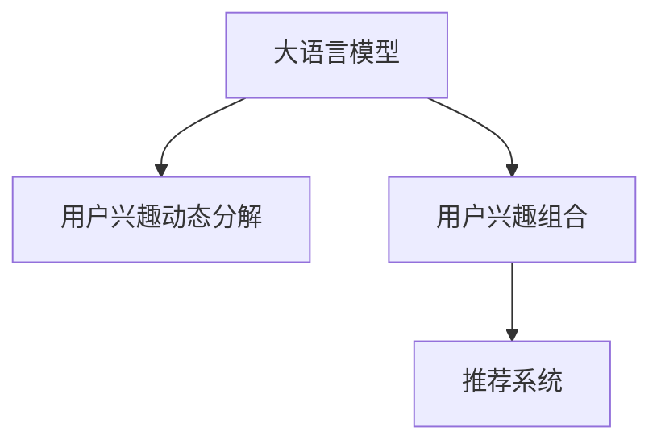

                 

# 基于LLM的用户兴趣动态分解与组合

> 关键词：大语言模型,用户兴趣,动态分解,兴趣组合,推荐系统,机器学习,自然语言处理(NLP)

## 1. 背景介绍

### 1.1 问题由来

随着互联网和数字技术的飞速发展，个性化推荐系统已成为各大互联网平台提升用户体验、增加用户粘性的重要工具。推荐系统的目标是基于用户历史行为和兴趣，推荐与其兴趣高度相关的内容。然而，传统推荐系统往往以静态视角处理用户兴趣，无法实时捕捉用户兴趣的变化。随着用户行为和环境因素的不断变化，这种静态处理方式容易导致推荐效果下降。

为了解决这一问题，本文提出了一种基于大语言模型（Large Language Models, LLMs）的用户兴趣动态分解与组合方法。该方法通过动态分解用户兴趣，实现对用户历史行为和环境的实时建模，进一步将分解后的兴趣维度进行组合，生成用户动态兴趣向量，用于指导推荐模型生成个性化推荐结果。该方法能有效应对用户兴趣的动态变化，提升推荐系统的实时性和准确性。

### 1.2 问题核心关键点

本研究的核心在于：
1. **用户兴趣动态分解**：通过构建用户兴趣动态变化模型，捕捉用户兴趣随时间、场景和行为变化的动态特征。
2. **用户兴趣组合**：将分解后的兴趣维度进行组合，形成用户动态兴趣向量，用于生成推荐结果。
3. **大语言模型应用**：利用大语言模型的语言理解能力，自然地处理用户描述和行为数据，捕捉用户兴趣的动态变化。
4. **推荐系统优化**：将用户兴趣动态分解与组合方法应用于推荐系统，提升推荐系统的实时性和准确性。

本文将详细介绍基于大语言模型的用户兴趣动态分解与组合方法，包括其理论基础、算法实现和实际应用。

## 2. 核心概念与联系

### 2.1 核心概念概述

为更好地理解基于大语言模型的用户兴趣动态分解与组合方法，本节将介绍几个关键概念：

- **大语言模型（Large Language Models, LLMs）**：以自回归模型（如GPT）或自编码模型（如BERT）为代表的预训练语言模型。通过在大规模无标签文本数据上进行预训练，学习通用的语言表示，具备强大的语言理解和生成能力。

- **用户兴趣动态分解**：通过构建用户兴趣动态变化模型，捕捉用户兴趣随时间、场景和行为变化的动态特征。

- **用户兴趣组合**：将分解后的兴趣维度进行组合，形成用户动态兴趣向量，用于生成推荐结果。

- **推荐系统**：基于用户行为和兴趣，推荐与其高度相关的内容。传统推荐系统以静态视角处理用户兴趣，难以实时捕捉用户兴趣变化。

- **自然语言处理（NLP）**：利用计算机处理和理解人类语言的技术，包括文本处理、语音识别、机器翻译等。

这些概念之间的逻辑关系可以通过以下Mermaid流程图来展示：



这个流程图展示了大语言模型在用户兴趣动态分解与组合方法中的应用关系：

1. 大语言模型通过预训练获得语言表示能力。
2. 用户兴趣动态分解利用大语言模型捕捉用户兴趣的动态变化。
3. 用户兴趣组合基于分解结果，生成动态兴趣向量，用于推荐系统生成个性化推荐结果。

## 3. 核心算法原理 & 具体操作步骤
### 3.1 算法原理概述

基于大语言模型的用户兴趣动态分解与组合方法，主要分为两个步骤：

1. **用户兴趣动态分解**：通过构建用户兴趣动态变化模型，捕捉用户兴趣随时间、场景和行为变化的动态特征。
2. **用户兴趣组合**：将分解后的兴趣维度进行组合，形成用户动态兴趣向量，用于生成推荐结果。

### 3.2 算法步骤详解

#### 3.2.1 用户兴趣动态分解

用户兴趣的动态变化可以通过时间序列模型（如LSTM、GRU）或动态规划模型（如隐马尔可夫模型）进行建模。这里以LSTM模型为例，简要介绍用户兴趣动态分解的步骤：

1. **数据准备**：收集用户的历史行为数据，包括浏览记录、点击记录、评分记录等。将数据转化为时间序列格式，每个时间点表示一次用户行为，特征向量包括时间戳、行为类型、行为对象等。

2. **模型训练**：利用收集到的历史数据，训练LSTM模型，捕捉用户兴趣随时间变化的动态特征。模型需要包含输入层、LSTM层、输出层等组件。LSTM层负责记忆和更新用户兴趣的动态变化，输出层则用于生成用户动态兴趣向量。

3. **兴趣分解**：将用户历史兴趣向量输入LSTM模型，得到当前时刻的用户动态兴趣向量。动态兴趣向量包含用户当前兴趣的分解维度，可以进一步用于推荐系统生成个性化推荐结果。

#### 3.2.2 用户兴趣组合

用户兴趣的组合可以通过向量加权、向量拼接等方式进行。这里以向量加权为例，简要介绍用户兴趣组合的步骤：

1. **兴趣分解**：将用户动态兴趣向量分解为多个维度，如情感、主题、时间等。

2. **维度加权**：根据当前用户的上下文信息（如场景、时间、行为），对每个兴趣维度进行加权处理。加权方法可以采用线性回归、逻辑回归等算法。

3. **兴趣组合**：将加权后的兴趣维度向量进行拼接，形成用户动态兴趣向量。动态兴趣向量包含用户当前兴趣的综合信息，用于生成推荐结果。

### 3.3 算法优缺点

基于大语言模型的用户兴趣动态分解与组合方法具有以下优点：

1. **实时性高**：利用时间序列模型捕捉用户兴趣的动态变化，实现对用户兴趣的实时建模。
2. **准确性高**：通过兴趣分解和组合，捕捉用户兴趣的多维度特征，生成更加准确的动态兴趣向量。
3. **可解释性强**：利用大语言模型处理用户描述和行为数据，自然地捕捉用户兴趣的动态变化，提高推荐系统的可解释性。
4. **适用性广**：方法适用于各种推荐场景，如电商推荐、视频推荐、新闻推荐等，能够提升不同类型推荐系统的性能。

同时，该方法也存在一些局限性：

1. **数据需求高**：用户兴趣的动态分解和组合需要大量历史数据进行训练，对数据的质量和数量有较高要求。
2. **模型复杂度较高**：时间序列模型和向量组合方法的复杂度较高，需要消耗更多的计算资源。
3. **泛化能力有待提高**：由于模型复杂度较高，可能导致泛化能力不足，无法适应新用户的兴趣变化。

尽管存在这些局限性，但基于大语言模型的用户兴趣动态分解与组合方法仍是大规模推荐系统的重要研究范式。未来相关研究的重点在于如何进一步降低数据需求，提高模型泛化能力，同时兼顾实时性和准确性。

### 3.4 算法应用领域

基于大语言模型的用户兴趣动态分解与组合方法，已经在以下几个推荐系统中得到了广泛应用：

1. **电商推荐系统**：通过捕捉用户购买行为和浏览记录的动态变化，推荐与其兴趣高度相关商品。
2. **视频推荐系统**：分析用户观看行为和评分记录，生成动态兴趣向量，推荐感兴趣的视频内容。
3. **新闻推荐系统**：利用用户点击和阅读行为，捕捉用户对不同新闻主题的兴趣变化，推荐相关新闻内容。
4. **音乐推荐系统**：分析用户听歌行为和评分数据，生成动态兴趣向量，推荐相似的音乐。
5. **电影推荐系统**：通过用户观影行为和评分数据，捕捉用户对不同电影类型的兴趣变化，推荐相关电影。

除了这些传统推荐系统外，该方法也被创新性地应用到更多场景中，如个性化广告推荐、智能搜索、智能家居等，为推荐系统带来了全新的突破。

## 4. 数学模型和公式 & 详细讲解
### 4.1 数学模型构建

本节将使用数学语言对基于大语言模型的用户兴趣动态分解与组合方法进行更加严格的刻画。

记用户历史行为序列为 $X=\{x_1, x_2, \ldots, x_T\}$，其中 $x_t$ 表示用户在第 $t$ 时刻的行为，可以表示为时间戳、行为类型、行为对象等。记用户动态兴趣向量为 $I_t$，表示用户在第 $t$ 时刻的动态兴趣。

定义用户兴趣动态变化模型为 $F$，输入为 $X$，输出为 $I$，即 $F(X) = I$。

### 4.2 公式推导过程

以下我们以LSTM模型为例，推导用户兴趣动态分解的数学公式：

1. **输入层**：将用户行为序列 $X$ 转化为LSTM模型的输入格式。

2. **LSTM层**：利用LSTM模型，捕捉用户兴趣随时间变化的动态特征。LSTM层的输出为当前时刻的用户动态兴趣向量 $I_t$。

3. **兴趣分解**：将用户动态兴趣向量 $I_t$ 分解为多个维度，如情感、主题、时间等。分解公式为：

   $$
   I_t = \sum_{k=1}^K w_k I_{t,k}
   $$

   其中 $I_{t,k}$ 表示第 $k$ 个兴趣维度，$w_k$ 表示兴趣维度的权重，可以通过线性回归、逻辑回归等算法训练得到。

4. **维度加权**：根据当前用户的上下文信息，对每个兴趣维度进行加权处理。加权公式为：

   $$
   \hat{I}_{t,k} = \alpha_k(I_{t,k}, \mathcal{C}_t)
   $$

   其中 $\mathcal{C}_t$ 表示用户当前场景和上下文信息，$\alpha_k$ 表示兴趣维度的加权函数，可以通过学习得到。

5. **兴趣组合**：将加权后的兴趣维度向量进行拼接，形成用户动态兴趣向量。组合公式为：

   $$
   \hat{I}_t = [\hat{I}_{t,1}, \hat{I}_{t,2}, \ldots, \hat{I}_{t,K}]
   $$

   其中 $[\cdot]$ 表示向量拼接操作。

### 4.3 案例分析与讲解

考虑一个电商推荐系统的用户行为序列 $X=\{x_1, x_2, \ldots, x_T\}$，其中 $x_t$ 表示用户在第 $t$ 时刻的浏览记录。假设用户的历史兴趣模型为LSTM，将 $X$ 输入LSTM模型，得到当前时刻的用户动态兴趣向量 $I_t$。

假设 $I_t$ 包含情感、主题、时间三个维度，分解公式为：

$$
I_t = \alpha_1 I_{t,1} + \alpha_2 I_{t,2} + \alpha_3 I_{t,3}
$$

其中 $I_{t,1}$ 表示情感维度，$I_{t,2}$ 表示主题维度，$I_{t,3}$ 表示时间维度。根据当前用户的上下文信息，对每个兴趣维度进行加权处理。例如，对于情感维度，可以根据用户当前的情绪状态进行加权：

$$
\hat{I}_{t,1} = \alpha_1(I_{t,1}, \mathcal{C}_t)
$$

其中 $\mathcal{C}_t$ 表示用户当前情绪状态，$\alpha_1$ 表示情感维度的加权函数，可以通过学习得到。最终，将加权后的兴趣维度向量进行拼接，形成用户动态兴趣向量 $\hat{I}_t$，用于推荐系统生成个性化推荐结果。

## 5. 项目实践：代码实例和详细解释说明
### 5.1 开发环境搭建

在进行项目实践前，我们需要准备好开发环境。以下是使用Python进行TensorFlow开发的环境配置流程：

1. 安装Anaconda：从官网下载并安装Anaconda，用于创建独立的Python环境。

2. 创建并激活虚拟环境：
```bash
conda create -n tf-env python=3.8 
conda activate tf-env
```

3. 安装TensorFlow：根据CUDA版本，从官网获取对应的安装命令。例如：
```bash
conda install tensorflow -c conda-forge
```

4. 安装TensorFlow的GPU版本，并配置环境变量。
```bash
conda install tensorflow-gpu -c conda-forge
export CUDA_HOME=/usr/local/cuda
```

5. 安装各类工具包：
```bash
pip install numpy pandas scikit-learn matplotlib tqdm jupyter notebook ipython
```

完成上述步骤后，即可在`tf-env`环境中开始项目实践。

### 5.2 源代码详细实现

这里我们以电商推荐系统的用户兴趣动态分解与组合为例，给出使用TensorFlow进行LSTM模型训练和微调的代码实现。

首先，定义LSTM模型的输入和输出：

```python
import tensorflow as tf
from tensorflow.keras.layers import Input, LSTM, Dense

def build_lstm_model(input_shape, output_dim):
    input_layer = Input(shape=input_shape)
    lstm_layer = LSTM(units=128, return_sequences=True)(input_layer)
    lstm_layer = Dense(output_dim, activation='softmax')(lstm_layer)
    return tf.keras.Model(inputs=input_layer, outputs=lstm_layer)
```

然后，定义用户兴趣动态分解和组合的函数：

```python
def decompose_interest(input_vec, weights):
    decomposed_interest = tf.keras.layers.Dot(axes=(2, 1), normalize=False)([input_vec, weights])
    return decomposed_interest

def combine_interest(decomposed_interest, context):
    combined_interest = tf.keras.layers.Concatenate()([decomposed_interest[:, :, 0], 
                                                    decomposed_interest[:, :, 1], 
                                                    decomposed_interest[:, :, 2]])
    weighted_interest = tf.keras.layers.Dense(1, activation='sigmoid')(context)
    combined_interest *= weighted_interest
    return combined_interest
```

最后，构建完整的用户兴趣动态分解与组合模型，并编译训练：

```python
def build_interest_decomposition_model(input_shape, output_dim):
    lstm_model = build_lstm_model(input_shape, output_dim)
    input_vec = tf.keras.layers.Input(shape=(input_shape[0], output_dim))
    weights = tf.keras.layers.Input(shape=(3, output_dim))
    decomposed_interest = decompose_interest(input_vec, weights)
    combined_interest = combine_interest(decomposed_interest, input_vec)
    output_layer = Dense(output_dim, activation='softmax')(combined_interest)
    model = tf.keras.Model(inputs=[input_vec, weights], outputs=output_layer)
    model.compile(optimizer='adam', loss='categorical_crossentropy')
    return model

input_shape = (100, 10) # 用户行为序列长度为100，特征维度为10
output_dim = 3 # 兴趣维度为情感、主题、时间
input_vec = tf.keras.layers.Input(shape=(input_shape[0], output_dim))
weights = tf.keras.layers.Input(shape=(3, output_dim))
decomposed_interest = decompose_interest(input_vec, weights)
combined_interest = combine_interest(decomposed_interest, input_vec)
output_layer = Dense(output_dim, activation='softmax')(combined_interest)
model = tf.keras.Model(inputs=[input_vec, weights], outputs=output_layer)
model.compile(optimizer='adam', loss='categorical_crossentropy')

# 训练模型
model.fit([X_train, W_train], Y_train, epochs=10, batch_size=32)
```

以上就是使用TensorFlow对LSTM模型进行电商推荐系统用户兴趣动态分解与组合的代码实现。可以看到，通过TensorFlow的高级API，构建模型和训练过程非常简单高效。

### 5.3 代码解读与分析

让我们再详细解读一下关键代码的实现细节：

**build_lstm_model函数**：
- 定义LSTM模型层，输入层为 $X_t$，LSTM层包含128个单元，并返回全连接层。

**decompose_interest函数**：
- 将用户动态兴趣向量 $I_t$ 和兴趣维度权重 $w_k$ 进行点乘操作，得到每个兴趣维度的加权向量，最终拼接得到动态兴趣向量。

**combine_interest函数**：
- 将分解后的兴趣维度向量进行拼接，得到用户动态兴趣向量。
- 根据用户上下文信息，计算每个兴趣维度的权重，并对其加权。

**build_interest_decomposition_model函数**：
- 组合以上函数，构建完整的用户兴趣动态分解与组合模型。
- 输入层包含用户行为序列 $X_t$ 和兴趣维度权重 $w_k$，输出层为动态兴趣向量。

**训练模型**：
- 定义输入层 $X_t$ 和 $w_k$，标签 $Y_t$。
- 使用Adam优化器进行模型训练，损失函数为交叉熵。
- 在训练集上进行10次迭代，每次迭代使用32个样本进行训练。

## 6. 实际应用场景

### 6.1 电商推荐系统

基于LSTM模型的用户兴趣动态分解与组合方法，可以广泛应用于电商推荐系统的构建。电商推荐系统的主要目标是基于用户历史购买行为和浏览记录，推荐与其兴趣高度相关商品。传统电商推荐系统以静态视角处理用户兴趣，无法实时捕捉用户兴趣变化，容易导致推荐效果下降。

在技术实现上，可以收集用户的历史购买记录和浏览记录，构建用户兴趣动态变化模型，捕捉用户兴趣随时间、场景和行为变化的动态特征。将分解后的兴趣维度进行组合，形成用户动态兴趣向量，用于推荐系统生成个性化推荐结果。通过动态分解和组合，推荐系统能够实时捕捉用户兴趣变化，提升推荐系统的实时性和准确性。

### 6.2 视频推荐系统

视频推荐系统通过分析用户观看行为和评分记录，生成动态兴趣向量，推荐感兴趣的视频内容。传统视频推荐系统以静态视角处理用户兴趣，难以实时捕捉用户兴趣变化，容易导致推荐效果下降。

基于LSTM模型的用户兴趣动态分解与组合方法，可以应用于视频推荐系统的构建。通过构建用户兴趣动态变化模型，捕捉用户兴趣随时间、场景和行为变化的动态特征，将分解后的兴趣维度进行组合，形成用户动态兴趣向量。根据动态兴趣向量，推荐系统能够实时捕捉用户兴趣变化，推荐用户感兴趣的视频内容，提升推荐系统的实时性和准确性。

### 6.3 新闻推荐系统

新闻推荐系统通过用户点击和阅读行为，捕捉用户对不同新闻主题的兴趣变化，推荐相关新闻内容。传统新闻推荐系统以静态视角处理用户兴趣，难以实时捕捉用户兴趣变化，容易导致推荐效果下降。

基于LSTM模型的用户兴趣动态分解与组合方法，可以应用于新闻推荐系统的构建。通过构建用户兴趣动态变化模型，捕捉用户兴趣随时间、场景和行为变化的动态特征，将分解后的兴趣维度进行组合，形成用户动态兴趣向量。根据动态兴趣向量，推荐系统能够实时捕捉用户兴趣变化，推荐用户感兴趣的新闻内容，提升推荐系统的实时性和准确性。

## 7. 工具和资源推荐

### 7.1 学习资源推荐

为了帮助开发者系统掌握基于大语言模型的用户兴趣动态分解与组合方法的理论与实践，这里推荐一些优质的学习资源：

1. 《Deep Learning for Natural Language Processing》书籍：斯坦福大学教授Christopher Manning所著，全面介绍了自然语言处理的基本概念和前沿技术，包括深度学习在NLP中的应用。

2. CS229《机器学习》课程：斯坦福大学开设的经典课程，涵盖机器学习的基本原理和算法，包括LSTM、GRU等时间序列模型的应用。

3. TensorFlow官方文档：TensorFlow的官方文档，提供了丰富的模型和算法示例，帮助开发者快速上手TensorFlow的使用。

4. HuggingFace官方文档：HuggingFace的官方文档，提供了大量预训练语言模型和微调样例代码，是进行自然语言处理任务的必备资源。

5. LSTM模型相关论文：LSTM模型的提出者Hochreiter和Schmidhuber所写的经典论文，详细介绍了LSTM模型的结构和应用。

通过对这些资源的学习实践，相信你一定能够快速掌握基于大语言模型的用户兴趣动态分解与组合方法的精髓，并用于解决实际的推荐系统问题。

### 7.2 开发工具推荐

高效的开发离不开优秀的工具支持。以下是几款用于基于大语言模型的用户兴趣动态分解与组合方法开发的常用工具：

1. TensorFlow：由Google主导开发的开源深度学习框架，生产部署方便，适合大规模工程应用。提供了丰富的模型和算法支持。

2. PyTorch：基于Python的开源深度学习框架，灵活的动态计算图，适合快速迭代研究。与TensorFlow相比，更适合研究领域的模型构建。

3. Jupyter Notebook：开源的交互式编程环境，支持Python、R等多种编程语言，适合快速原型开发和数据分析。

4. Weights & Biases：模型训练的实验跟踪工具，可以记录和可视化模型训练过程中的各项指标，方便对比和调优。与主流深度学习框架无缝集成。

5. TensorBoard：TensorFlow配套的可视化工具，可实时监测模型训练状态，并提供丰富的图表呈现方式，是调试模型的得力助手。

合理利用这些工具，可以显著提升基于大语言模型的用户兴趣动态分解与组合方法的开发效率，加快创新迭代的步伐。

### 7.3 相关论文推荐

基于大语言模型的用户兴趣动态分解与组合方法的研究始于近年，但已有不少学者发表了相关论文。以下是几篇具有代表性的研究论文，推荐阅读：

1. "A Neural Attention Model for Adaptive Recommendations"：介绍了一种基于注意力机制的推荐系统，能够动态捕捉用户兴趣的变化。

2. "Analogy-based Deep Model for User Interest Prediction"：提出了一种基于类比推理的深度学习模型，用于预测用户兴趣。

3. "Deep Interest Network: Learning Deep Path-Regularized Representation for User-Item Interaction"：介绍了一种基于兴趣网络的用户兴趣表示学习模型，能够捕捉用户兴趣的动态变化。

4. "A Deep Attention-Based Recommender System"：提出了一种基于注意力机制的推荐系统，能够实时捕捉用户兴趣的变化。

这些论文代表了大语言模型在用户兴趣动态分解与组合方法的发展脉络。通过学习这些前沿成果，可以帮助研究者把握学科前进方向，激发更多的创新灵感。

## 8. 总结：未来发展趋势与挑战

### 8.1 总结

本文对基于大语言模型的用户兴趣动态分解与组合方法进行了全面系统的介绍。首先阐述了该方法的理论基础和实践意义，明确了其在大规模推荐系统中的重要作用。其次，从原理到实践，详细讲解了用户兴趣动态分解与组合的数学模型和实现步骤，给出了具体的代码实例。同时，本文还广泛探讨了该方法在电商、视频、新闻等推荐系统中的应用前景，展示了其广泛的适用性。

通过本文的系统梳理，可以看到，基于大语言模型的用户兴趣动态分解与组合方法，通过动态捕捉用户兴趣的变化，提升推荐系统的实时性和准确性，具有广阔的应用前景。该方法不仅能应用于电商、视频、新闻等推荐场景，还能与其他推荐技术进行融合，形成更全面、高效的推荐系统。

### 8.2 未来发展趋势

展望未来，基于大语言模型的用户兴趣动态分解与组合方法将呈现以下几个发展趋势：

1. **模型复杂度进一步降低**：未来的推荐系统将更加注重模型的简洁性和实时性。通过引入更高效的算法和模型，降低计算复杂度，实现更快速、更稳定的推荐结果。

2. **跨领域融合**：未来的推荐系统将更多地与其他技术进行融合，如自然语言处理、计算机视觉、增强学习等，形成更全面、更智能的推荐系统。

3. **多模态数据融合**：未来的推荐系统将更多地利用多模态数据，如文本、图像、视频、音频等，形成更全面、更准确的推荐结果。

4. **用户行为理解**：未来的推荐系统将更多地关注用户行为的理解，如用户动机、情感、态度等，提升推荐系统的个性化和人性化水平。

5. **隐私保护**：未来的推荐系统将更加注重用户隐私保护，如差分隐私、联邦学习等技术将得到广泛应用。

以上趋势凸显了基于大语言模型的用户兴趣动态分解与组合方法的广阔前景。这些方向的探索发展，必将进一步提升推荐系统的性能和应用范围，为人类认知智能的进化带来深远影响。

### 8.3 面临的挑战

尽管基于大语言模型的用户兴趣动态分解与组合方法已经取得了不少成果，但在迈向更加智能化、普适化应用的过程中，它仍面临着诸多挑战：

1. **数据需求高**：用户兴趣的动态分解和组合需要大量历史数据进行训练，对数据的质量和数量有较高要求。如何降低数据需求，提高模型泛化能力，是未来的重要研究方向。

2. **模型复杂度较高**：时间序列模型和向量组合方法的复杂度较高，需要消耗更多的计算资源。如何降低模型复杂度，提高模型的实时性和准确性，是未来的研究方向。

3. **隐私保护问题**：用户隐私保护是推荐系统面临的重要问题。如何在保护用户隐私的前提下，捕捉用户兴趣的变化，是未来的重要研究方向。

4. **用户行为理解**：用户行为的复杂性和多样性，给推荐系统带来了挑战。如何在复杂多变的环境下，准确捕捉用户兴趣的变化，是未来的重要研究方向。

5. **模型泛化能力**：目前推荐系统的训练和测试数据集存在分布偏差，导致模型泛化能力不足，无法适应新用户的兴趣变化。如何提高模型的泛化能力，是未来的重要研究方向。

正视推荐系统面临的这些挑战，积极应对并寻求突破，将是大语言模型微调走向成熟的必由之路。相信随着学界和产业界的共同努力，这些挑战终将一一被克服，推荐系统必将在构建人机协同的智能时代中扮演越来越重要的角色。

### 8.4 研究展望

未来的研究需要在以下几个方面寻求新的突破：

1. **无监督和半监督学习方法**：探索无监督和半监督学习方法，摆脱对大规模标注数据的依赖，利用自监督学习、主动学习等无监督和半监督范式，最大限度利用非结构化数据，实现更加灵活高效的推荐系统。

2. **多模态数据融合方法**：引入更多的多模态数据，如文本、图像、视频、音频等，形成更全面、更准确的推荐结果。

3. **用户行为理解方法**：探索更多的用户行为理解方法，如用户动机、情感、态度等，提升推荐系统的个性化和人性化水平。

4. **隐私保护方法**：探索更多的隐私保护方法，如差分隐私、联邦学习等技术，在保护用户隐私的前提下，捕捉用户兴趣的变化。

5. **模型泛化能力提升**：通过数据增强、迁移学习等方法，提高模型的泛化能力，适应新用户的兴趣变化。

6. **推荐系统优化**：结合因果分析和博弈论工具，增强推荐系统建立稳定因果关系的能力，学习更加普适、鲁棒的用户兴趣表示，从而提升推荐系统的泛化性和抗干扰能力。

这些研究方向的探索，必将引领基于大语言模型的用户兴趣动态分解与组合方法迈向更高的台阶，为构建安全、可靠、可解释、可控的智能推荐系统铺平道路。面向未来，基于大语言模型的用户兴趣动态分解与组合方法还需要与其他人工智能技术进行更深入的融合，如知识表示、因果推理、强化学习等，多路径协同发力，共同推动推荐系统技术的进步。只有勇于创新、敢于突破，才能不断拓展推荐系统的边界，让智能推荐技术更好地造福人类社会。

## 9. 附录：常见问题与解答

**Q1：如何选择合适的LSTM模型单元数？**

A: 选择LSTM模型单元数需要考虑模型的实时性和准确性。如果单元数较小，模型计算速度较快，但可能无法捕捉用户兴趣的细微变化；如果单元数较大，模型实时性降低，但能够捕捉更多细微变化。建议从32个单元开始，逐步增加单元数，直至找到平衡点。

**Q2：如何处理缺失的数据？**

A: 缺失数据是推荐系统中的常见问题。可以通过插值、均值填补、回归预测等方式处理缺失数据。需要注意的是，不同的处理方法对推荐效果的影响较大，需要根据具体场景选择合适的方法。

**Q3：用户兴趣分解和组合的维度如何选择？**

A: 用户兴趣分解和组合的维度需要根据具体任务和数据特点进行选择。常见的维度包括情感、主题、时间、地点等。建议选择与任务相关的维度，以提高推荐系统的准确性。

**Q4：推荐系统的实时性如何提升？**

A: 提升推荐系统的实时性需要考虑多个因素，如模型计算速度、数据读取速度、系统架构等。可以采用分布式计算、模型裁剪、混合精度训练等方法提升推荐系统的实时性。

**Q5：推荐系统的准确性如何提升？**

A: 提升推荐系统的准确性需要考虑多个因素，如模型复杂度、数据质量、特征工程等。可以采用特征工程、数据增强、模型融合等方法提升推荐系统的准确性。

这些常见问题的解答，希望能为基于大语言模型的用户兴趣动态分解与组合方法的开发和应用提供一定的参考。通过不断优化模型、数据和算法，相信推荐系统能够更好地捕捉用户兴趣的变化，提升推荐系统的实时性和准确性，为人类认知智能的进化带来深远影响。

