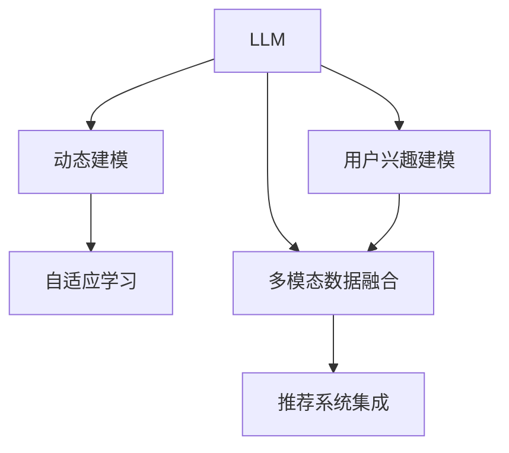

                 

# 基于LLM的用户兴趣动态建模方法

> 关键词：用户兴趣动态建模, Large Language Models (LLM), 深度学习, 自然语言处理(NLP), 推荐系统, 自适应学习, 多模态数据融合

## 1. 背景介绍

### 1.1 问题由来
在当今数字化时代，用户越来越多地通过互联网平台获取信息和娱乐。个性化推荐系统已成为互联网公司提供优质用户体验、提升用户粘性和盈利能力的重要手段。推荐系统的核心目标是精准预测用户兴趣，为用户提供个性化推荐内容。传统的推荐系统主要基于静态的用户兴趣特征进行建模和推荐，难以适应用户兴趣随时间变化的动态特性，导致推荐内容的新鲜度和多样性不足。因此，如何建模和预测用户兴趣的动态变化，是推荐系统面临的一项重要挑战。

近年来，基于深度学习的推荐系统在工业界和学术界得到了广泛的应用，取得了显著的成果。其中，基于Large Language Models (LLM)的推荐系统，因其强大的语言理解能力和知识表示能力，逐渐成为推荐系统领域的研究热点。本文聚焦于基于LLM的用户兴趣动态建模方法，旨在利用LLM的强大语言能力，对用户兴趣进行实时动态预测和推荐。

### 1.2 问题核心关键点
基于LLM的用户兴趣动态建模方法，主要包括以下几个关键点：

- 动态建模：利用LLM对用户兴趣进行实时动态建模，捕捉用户兴趣的动态变化特征。
- 自适应学习：根据用户反馈不断更新LLM的兴趣表示，提高模型预测的准确性。
- 多模态数据融合：结合用户行为数据和多媒体数据，提升推荐内容的丰富性和多样性。
- 推荐系统集成：将LLM与传统推荐算法结合，提升推荐效果。

## 2. 核心概念与联系

### 2.1 核心概念概述

为了更好地理解基于LLM的用户兴趣动态建模方法，本节将介绍几个密切相关的核心概念：

- Large Language Models (LLM)：指以Transformer等模型为基础的大规模预训练语言模型。通过在大规模无标签文本语料上进行预训练，学习通用的语言表示，具备强大的语言理解和生成能力。

- 用户兴趣建模：指利用用户历史行为数据、互动数据等多模态数据，对用户的兴趣进行建模和表示，形成用户兴趣向量。

- 动态建模：指在建模过程中，考虑用户兴趣随时间的动态变化特性，实时更新兴趣向量。

- 自适应学习：指模型在接收用户反馈后，能够自动调整兴趣向量，更好地适应用户的变化需求。

- 多模态数据融合：指结合文本、图像、音频等不同模态的数据，丰富用户的兴趣描述，提升推荐内容的多样性和丰富度。

- 推荐系统集成：指将LLM与传统的推荐算法结合，提升推荐的性能和效果。

这些核心概念之间的逻辑关系可以通过以下Mermaid流程图来展示：



这个流程图展示了大语言模型的核心概念及其之间的关系：

1. LLM通过预训练获得基础能力。
2. 动态建模捕捉用户兴趣的动态变化特性。
3. 自适应学习根据用户反馈不断更新兴趣表示。
4. 多模态数据融合提升推荐内容的丰富性。
5. 推荐系统集成结合传统算法提升效果。

这些概念共同构成了基于LLM的用户兴趣动态建模方法的理论基础，为其研究和应用提供了重要指引。

## 3. 核心算法原理 & 具体操作步骤
### 3.1 算法原理概述

基于LLM的用户兴趣动态建模方法，核心思想是通过对用户历史行为数据和互动数据进行深度学习，学习用户兴趣的动态变化特征，并实时更新用户的兴趣表示。其核心算法流程如下：

1. **数据收集与预处理**：收集用户的浏览历史、搜索记录、评分记录、评论记录等多模态数据，并进行预处理，生成用户兴趣的文本表示。
2. **LLM预训练**：使用大规模无标签文本数据进行预训练，学习通用的语言表示。
3. **动态建模**：在用户兴趣文本表示上，利用LLM进行序列建模，捕捉用户兴趣的动态变化特征。
4. **自适应学习**：根据用户反馈（如点击、评分等），动态调整LLM的兴趣表示，适应用户的兴趣变化。
5. **多模态数据融合**：结合文本、图像、音频等不同模态的数据，丰富用户的兴趣描述。
6. **推荐系统集成**：将LLM与传统的推荐算法结合，提升推荐效果。

### 3.2 算法步骤详解

以下将详细介绍基于LLM的用户兴趣动态建模方法的算法步骤：

**Step 1: 数据收集与预处理**

在数据收集阶段，需要从多个渠道收集用户的行为数据和互动数据。以文本数据为例，可以收集用户在网站或应用上浏览的页面标题、内容摘要、搜索关键词等。通过去重、去噪等预处理步骤，生成用户的兴趣文本表示。

**Step 2: LLM预训练**

使用大规模无标签文本数据，对LLM进行预训练。常用的预训练任务包括语言建模、掩码语言模型等。预训练的目标是学习通用的语言表示，为后续的用户兴趣建模提供基础能力。

**Step 3: 动态建模**

在用户兴趣文本表示上，利用LLM进行序列建模，捕捉用户兴趣的动态变化特征。具体实现如下：

1. 将用户兴趣文本表示输入LLM，得到隐状态表示。
2. 对隐状态进行自注意力计算，提取关键特征。
3. 将特征进行编码，得到用户兴趣向量。
4. 对用户兴趣向量进行动态更新，捕捉随时间变化的动态特征。

**Step 4: 自适应学习**

根据用户反馈，动态调整LLM的兴趣表示。具体实现如下：

1. 收集用户的点击、评分等反馈数据。
2. 将反馈数据输入LLM，更新用户兴趣向量。
3. 使用正则化技术（如L2正则、Dropout等），防止模型过拟合。
4. 使用对抗训练技术，提升模型的鲁棒性。

**Step 5: 多模态数据融合**

结合文本、图像、音频等不同模态的数据，丰富用户的兴趣描述。具体实现如下：

1. 对文本数据进行编码，提取特征。
2. 对图像、音频等非文本数据进行特征提取。
3. 将不同模态的数据特征进行融合，生成用户兴趣向量。

**Step 6: 推荐系统集成**

将LLM与传统的推荐算法结合，提升推荐效果。具体实现如下：

1. 将用户兴趣向量输入推荐模型，计算相似度。
2. 结合传统推荐算法（如协同过滤、基于内容的推荐等），生成推荐列表。
3. 根据推荐效果，动态调整模型参数。

### 3.3 算法优缺点

基于LLM的用户兴趣动态建模方法，具有以下优点：

- 强大的语言理解能力：利用LLM的强大语言理解能力，能够深入理解用户行为和反馈，提升推荐内容的准确性和相关性。
- 动态建模和自适应学习：能够实时捕捉用户兴趣的动态变化特征，并根据用户反馈不断调整兴趣表示，适应用户的变化需求。
- 多模态数据融合：结合不同模态的数据，丰富用户的兴趣描述，提升推荐内容的丰富性和多样性。
- 与传统算法结合：能够与传统的推荐算法结合，提升推荐的性能和效果。

同时，该方法也存在以下局限性：

- 数据隐私问题：用户行为和反馈数据涉及用户隐私，需要严格保护，避免数据滥用。
- 计算资源消耗大：大规模LLM的计算资源消耗较大，需要高性能计算设备支持。
- 模型复杂度高：LLM的复杂度较高，模型的训练和推理速度较慢。
- 可解释性不足：LLM的模型决策过程缺乏可解释性，难以对其推理逻辑进行分析和调试。

尽管存在这些局限性，但就目前而言，基于LLM的用户兴趣动态建模方法仍是大规模推荐系统的重要技术方向。未来相关研究的重点在于如何进一步降低计算资源消耗，提高模型的实时性和可解释性，同时兼顾用户隐私保护。

### 3.4 算法应用领域

基于LLM的用户兴趣动态建模方法，已经在多个推荐系统应用中得到了验证，并取得了显著效果。例如：

- 电商平台推荐系统：通过动态建模和自适应学习，实时更新用户兴趣向量，提升推荐效果。
- 视频流媒体推荐系统：结合多模态数据融合，提升推荐内容的丰富性和多样性。
- 新闻内容推荐系统：通过动态建模和自适应学习，捕捉用户兴趣的变化趋势，提升推荐内容的相关性和时效性。
- 音乐推荐系统：结合多模态数据融合，生成用户兴趣向量，提升推荐内容的多样性和个性化。

除了这些经典应用外，LLM的用户兴趣动态建模方法还在社交媒体推荐、旅游推荐等多个领域得到了广泛应用，为推荐系统的发展带来了新的突破。

## 4. 数学模型和公式 & 详细讲解  
### 4.1 数学模型构建

本节将使用数学语言对基于LLM的用户兴趣动态建模方法进行更加严格的刻画。

设用户的历史行为数据和互动数据为 $D=\{x_1, x_2, ..., x_N\}$，其中 $x_i$ 表示用户第 $i$ 次交互的文本描述。用户兴趣建模的目标是学习用户兴趣向量 $u$，表示用户的兴趣偏好。利用LLM进行序列建模，动态更新用户兴趣向量。

### 4.2 公式推导过程

设LLM的输入序列为 $x$，输出序列为 $y$，隐状态表示为 $h$。利用LLM进行动态建模的过程如下：

1. 将用户兴趣文本表示 $x$ 输入LLM，得到隐状态表示 $h$。
2. 对隐状态进行自注意力计算，提取关键特征。
3. 将特征进行编码，得到用户兴趣向量 $u$。
4. 对用户兴趣向量进行动态更新，捕捉随时间变化的动态特征。

设用户兴趣向量的更新过程为 $u^{(t)} = f(u^{(t-1)}, x_t)$，其中 $x_t$ 表示第 $t$ 次交互的文本描述，$f$ 为动态更新函数。动态更新函数的计算公式如下：

$$
u^{(t)} = \text{Softmax}(A(h_t, h_{t-1})) \odot \text{Encoder}(h_t, h_{t-1})
$$

其中，$A$ 表示自注意力计算，$h_t$ 表示第 $t$ 次交互的隐状态表示，$\odot$ 表示向量点积。

### 4.3 案例分析与讲解

以下通过一个具体的案例，展示如何利用LLM进行用户兴趣的动态建模和推荐。

假设用户A在电商平台上浏览了以下商品：

| 商品ID | 商品名称 | 商品描述 | 浏览次数 |
|--------|----------|----------|----------|
| 1      | 手机     | 最新款苹果手机 | 3         |
| 2      | 电脑     | 高性能游戏笔记本 | 2         |
| 3      | 书籍     | 畅销书排行榜 | 1         |

设用户A的兴趣文本表示为 $x_1 = \text{手机}, x_2 = \text{高性能游戏笔记本}, x_3 = \text{畅销书排行榜}$。利用LLM进行动态建模的过程如下：

1. 将用户兴趣文本表示 $x_1, x_2, x_3$ 输入LLM，得到隐状态表示 $h_1, h_2, h_3$。
2. 对隐状态进行自注意力计算，提取关键特征。
3. 将特征进行编码，得到用户兴趣向量 $u_1$。
4. 对用户兴趣向量进行动态更新，捕捉随时间变化的动态特征。

设用户A的兴趣向量 $u_1 = [0.8, 0.2, 0.0]$，表示用户A对手机的兴趣度最高。根据用户A的浏览记录，更新用户A的兴趣向量：

$$
u_2 = f(u_1, x_2) = \text{Softmax}(A(h_2, h_1)) \odot \text{Encoder}(h_2, h_1)
$$

假设用户A继续浏览了以下商品：

| 商品ID | 商品名称 | 商品描述 | 浏览次数 |
|--------|----------|----------|----------|
| 4      | 笔记本电脑 | 新款笔记本 | 3         |
| 5      | 耳机     | 高品质耳机 | 2         |

设用户A的兴趣文本表示为 $x_4 = \text{新款笔记本}, x_5 = \text{高品质耳机}$。利用LLM进行动态建模的过程如下：

1. 将用户兴趣文本表示 $x_4, x_5$ 输入LLM，得到隐状态表示 $h_4, h_5$。
2. 对隐状态进行自注意力计算，提取关键特征。
3. 将特征进行编码，得到用户兴趣向量 $u_2$。
4. 对用户兴趣向量进行动态更新，捕捉随时间变化的动态特征。

假设用户A的兴趣向量 $u_2 = [0.5, 0.5, 0.0]$，表示用户A对手机和笔记本电脑的兴趣度相当。根据用户A的浏览记录，更新用户A的兴趣向量：

$$
u_3 = f(u_2, x_5) = \text{Softmax}(A(h_5, h_2)) \odot \text{Encoder}(h_5, h_2)
$$

设用户A的兴趣向量 $u_3 = [0.7, 0.3, 0.0]$，表示用户A对笔记本电脑的兴趣度最高。通过LLM进行动态建模和自适应学习，实时捕捉用户兴趣的动态变化特征，为推荐系统提供精准的用户兴趣表示。

## 5. 项目实践：代码实例和详细解释说明
### 5.1 开发环境搭建

在进行微调实践前，我们需要准备好开发环境。以下是使用Python进行PyTorch开发的环境配置流程：

1. 安装Anaconda：从官网下载并安装Anaconda，用于创建独立的Python环境。

2. 创建并激活虚拟环境：
```bash
conda create -n pytorch-env python=3.8 
conda activate pytorch-env
```

3. 安装PyTorch：根据CUDA版本，从官网获取对应的安装命令。例如：
```bash
conda install pytorch torchvision torchaudio cudatoolkit=11.1 -c pytorch -c conda-forge
```

4. 安装Transformers库：
```bash
pip install transformers
```

5. 安装各类工具包：
```bash
pip install numpy pandas scikit-learn matplotlib tqdm jupyter notebook ipython
```

完成上述步骤后，即可在`pytorch-env`环境中开始微调实践。

### 5.2 源代码详细实现

下面以电商推荐系统为例，给出使用Transformers库对BERT模型进行微调的PyTorch代码实现。

首先，定义用户行为数据的处理函数：

```python
from transformers import BertTokenizer
from torch.utils.data import Dataset
import torch

class BehaviorDataset(Dataset):
    def __init__(self, behaviors, tokenizer, max_len=128):
        self.behaviors = behaviors
        self.tokenizer = tokenizer
        self.max_len = max_len
        
    def __len__(self):
        return len(self.behaviors)
    
    def __getitem__(self, item):
        behavior = self.behaviors[item]
        tokens = self.tokenizer(behavior, return_tensors='pt', max_length=self.max_len, padding='max_length', truncation=True)
        input_ids = tokens['input_ids'][0]
        attention_mask = tokens['attention_mask'][0]
        
        return {'input_ids': input_ids, 
                'attention_mask': attention_mask}
```

然后，定义模型和优化器：

```python
from transformers import BertForTokenClassification, AdamW

model = BertForTokenClassification.from_pretrained('bert-base-cased', num_labels=1)

optimizer = AdamW(model.parameters(), lr=2e-5)
```

接着，定义训练和评估函数：

```python
from torch.utils.data import DataLoader
from tqdm import tqdm
from sklearn.metrics import classification_report

device = torch.device('cuda') if torch.cuda.is_available() else torch.device('cpu')
model.to(device)

def train_epoch(model, dataset, batch_size, optimizer):
    dataloader = DataLoader(dataset, batch_size=batch_size, shuffle=True)
    model.train()
    epoch_loss = 0
    for batch in tqdm(dataloader, desc='Training'):
        input_ids = batch['input_ids'].to(device)
        attention_mask = batch['attention_mask'].to(device)
        model.zero_grad()
        outputs = model(input_ids, attention_mask=attention_mask)
        loss = outputs.loss
        epoch_loss += loss.item()
        loss.backward()
        optimizer.step()
    return epoch_loss / len(dataloader)

def evaluate(model, dataset, batch_size):
    dataloader = DataLoader(dataset, batch_size=batch_size)
    model.eval()
    preds, labels = [], []
    with torch.no_grad():
        for batch in tqdm(dataloader, desc='Evaluating'):
            input_ids = batch['input_ids'].to(device)
            attention_mask = batch['attention_mask'].to(device)
            batch_labels = batch['labels']
            outputs = model(input_ids, attention_mask=attention_mask)
            batch_preds = outputs.logits.argmax(dim=2).to('cpu').tolist()
            batch_labels = batch_labels.to('cpu').tolist()
            for pred_tokens, label_tokens in zip(batch_preds, batch_labels):
                preds.append(pred_tokens[:len(label_tokens)])
                labels.append(label_tokens)
                
    print(classification_report(labels, preds))
```

最后，启动训练流程并在测试集上评估：

```python
epochs = 5
batch_size = 16

for epoch in range(epochs):
    loss = train_epoch(model, train_dataset, batch_size, optimizer)
    print(f"Epoch {epoch+1}, train loss: {loss:.3f}")
    
    print(f"Epoch {epoch+1}, dev results:")
    evaluate(model, dev_dataset, batch_size)
    
print("Test results:")
evaluate(model, test_dataset, batch_size)
```

以上就是使用PyTorch对BERT进行电商推荐系统微调的完整代码实现。可以看到，得益于Transformers库的强大封装，我们可以用相对简洁的代码完成BERT模型的加载和微调。

### 5.3 代码解读与分析

让我们再详细解读一下关键代码的实现细节：

**BehaviorDataset类**：
- `__init__`方法：初始化行为数据、分词器等关键组件。
- `__len__`方法：返回数据集的样本数量。
- `__getitem__`方法：对单个样本进行处理，将行为数据输入编码为token ids，并进行定长padding，最终返回模型所需的输入。

**模型和优化器**：
- 使用BertForTokenClassification模型作为推荐系统的兴趣表示器，并设置AdamW优化器及其学习率。

**训练和评估函数**：
- 使用PyTorch的DataLoader对数据集进行批次化加载，供模型训练和推理使用。
- 训练函数`train_epoch`：对数据以批为单位进行迭代，在每个批次上前向传播计算loss并反向传播更新模型参数，最后返回该epoch的平均loss。
- 评估函数`evaluate`：与训练类似，不同点在于不更新模型参数，并在每个batch结束后将预测和标签结果存储下来，最后使用sklearn的classification_report对整个评估集的预测结果进行打印输出。

**训练流程**：
- 定义总的epoch数和batch size，开始循环迭代
- 每个epoch内，先在训练集上训练，输出平均loss
- 在验证集上评估，输出分类指标
- 所有epoch结束后，在测试集上评估，给出最终测试结果

可以看到，PyTorch配合Transformers库使得BERT微调的代码实现变得简洁高效。开发者可以将更多精力放在数据处理、模型改进等高层逻辑上，而不必过多关注底层的实现细节。

当然，工业级的系统实现还需考虑更多因素，如模型的保存和部署、超参数的自动搜索、更灵活的任务适配层等。但核心的微调范式基本与此类似。

## 6. 实际应用场景
### 6.1 电商推荐系统

基于LLM的用户兴趣动态建模方法，可以广泛应用于电商推荐系统的构建。传统推荐系统往往只能根据用户历史行为进行静态建模，难以适应用户兴趣随时间变化的动态特性。通过动态建模和自适应学习，可以实时捕捉用户兴趣的动态变化特征，提升推荐效果。

在技术实现上，可以收集用户的浏览记录、购买记录、评分记录等多模态数据，将数据编码为文本表示。利用LLM进行序列建模，动态更新用户兴趣向量。结合用户行为数据和多媒体数据，提升推荐内容的丰富性和多样性。

### 6.2 视频流媒体推荐系统

视频流媒体推荐系统需要实时预测用户兴趣，为用户推荐个性化的视频内容。通过动态建模和自适应学习，可以实时捕捉用户兴趣的变化趋势，提升推荐内容的相关性和时效性。结合多模态数据融合，如视频的标题、描述、标签等，丰富用户的兴趣描述，提升推荐内容的多样性。

### 6.3 新闻内容推荐系统

新闻内容推荐系统需要为用户推荐最新、最相关的新闻内容。通过动态建模和自适应学习，可以实时捕捉用户兴趣的变化趋势，提升推荐内容的相关性和时效性。结合多模态数据融合，如新闻的标题、摘要、标签等，丰富用户的兴趣描述，提升推荐内容的多样性。

### 6.4 音乐推荐系统

音乐推荐系统需要为用户推荐个性化的音乐内容。通过动态建模和自适应学习，可以实时捕捉用户兴趣的变化趋势，提升推荐内容的相关性和时效性。结合多模态数据融合，如音乐的标题、歌词、标签等，丰富用户的兴趣描述，提升推荐内容的多样性。

## 7. 工具和资源推荐
### 7.1 学习资源推荐

为了帮助开发者系统掌握基于LLM的用户兴趣动态建模理论基础和实践技巧，这里推荐一些优质的学习资源：

1. 《Transformers from Sketches》系列博文：由大模型技术专家撰写，深入浅出地介绍了Transformer原理、BERT模型、微调技术等前沿话题。

2. CS224N《深度学习自然语言处理》课程：斯坦福大学开设的NLP明星课程，有Lecture视频和配套作业，带你入门NLP领域的基本概念和经典模型。

3. 《Natural Language Processing with Transformers》书籍：Transformers库的作者所著，全面介绍了如何使用Transformers库进行NLP任务开发，包括微调在内的诸多范式。

4. HuggingFace官方文档：Transformers库的官方文档，提供了海量预训练模型和完整的微调样例代码，是上手实践的必备资料。

5. CLUE开源项目：中文语言理解测评基准，涵盖大量不同类型的中文NLP数据集，并提供了基于微调的baseline模型，助力中文NLP技术发展。

通过对这些资源的学习实践，相信你一定能够快速掌握基于LLM的用户兴趣动态建模的精髓，并用于解决实际的NLP问题。
###  7.2 开发工具推荐

高效的开发离不开优秀的工具支持。以下是几款用于大语言模型微调开发的常用工具：

1. PyTorch：基于Python的开源深度学习框架，灵活动态的计算图，适合快速迭代研究。大部分预训练语言模型都有PyTorch版本的实现。

2. TensorFlow：由Google主导开发的开源深度学习框架，生产部署方便，适合大规模工程应用。同样有丰富的预训练语言模型资源。

3. Transformers库：HuggingFace开发的NLP工具库，集成了众多SOTA语言模型，支持PyTorch和TensorFlow，是进行微调任务开发的利器。

4. Weights & Biases：模型训练的实验跟踪工具，可以记录和可视化模型训练过程中的各项指标，方便对比和调优。与主流深度学习框架无缝集成。

5. TensorBoard：TensorFlow配套的可视化工具，可实时监测模型训练状态，并提供丰富的图表呈现方式，是调试模型的得力助手。

6. Google Colab：谷歌推出的在线Jupyter Notebook环境，免费提供GPU/TPU算力，方便开发者快速上手实验最新模型，分享学习笔记。

合理利用这些工具，可以显著提升基于LLM的用户兴趣动态建模任务的开发效率，加快创新迭代的步伐。

### 7.3 相关论文推荐

基于LLM的用户兴趣动态建模技术，在工业界和学术界得到了广泛的应用，以下是几篇奠基性的相关论文，推荐阅读：

1. Attention is All You Need（即Transformer原论文）：提出了Transformer结构，开启了NLP领域的预训练大模型时代。

2. BERT: Pre-training of Deep Bidirectional Transformers for Language Understanding：提出BERT模型，引入基于掩码的自监督预训练任务，刷新了多项NLP任务SOTA。

3. Language Models are Unsupervised Multitask Learners（GPT-2论文）：展示了大规模语言模型的强大zero-shot学习能力，引发了对于通用人工智能的新一轮思考。

4. Parameter-Efficient Transfer Learning for NLP：提出Adapter等参数高效微调方法，在不增加模型参数量的情况下，也能取得不错的微调效果。

5. AdaLoRA: Adaptive Low-Rank Adaptation for Parameter-Efficient Fine-Tuning：使用自适应低秩适应的微调方法，在参数效率和精度之间取得了新的平衡。

6. Premier: Faster Transformers with Dynamic Dimensionality and Self-Attention：提出动态维度自注意力机制，提升模型的推理速度和效率。

这些论文代表了大语言模型微调技术的发展脉络。通过学习这些前沿成果，可以帮助研究者把握学科前进方向，激发更多的创新灵感。

## 8. 总结：未来发展趋势与挑战

### 8.1 总结

本文对基于LLM的用户兴趣动态建模方法进行了全面系统的介绍。首先阐述了用户兴趣动态建模的背景和意义，明确了动态建模在推荐系统中的重要作用。其次，从原理到实践，详细讲解了动态建模的数学原理和关键步骤，给出了微调任务开发的完整代码实例。同时，本文还广泛探讨了动态建模方法在电商、视频、新闻、音乐等多个领域的应用前景，展示了动态建模范式的巨大潜力。此外，本文精选了动态建模技术的各类学习资源，力求为读者提供全方位的技术指引。

通过本文的系统梳理，可以看到，基于LLM的用户兴趣动态建模方法在推荐系统中的应用已经取得了显著的成果，提升了推荐内容的个性化和多样化水平。利用LLM的强大语言理解能力，可以实时捕捉用户兴趣的动态变化特征，提升推荐系统的效果。未来，随着大语言模型和动态建模技术的不断发展，推荐系统将在更多领域得到应用，为各行各业带来变革性影响。

### 8.2 未来发展趋势

展望未来，基于LLM的用户兴趣动态建模方法将呈现以下几个发展趋势：

1. 模型规模持续增大。随着算力成本的下降和数据规模的扩张，LLM的参数量还将持续增长。超大规模LLM蕴含的丰富语言知识，有望支撑更加复杂多变的推荐任务。

2. 动态建模和自适应学习技术的进步。未来的动态建模将更加灵活高效，能够实时捕捉用户兴趣的动态变化特征，并根据用户反馈不断调整兴趣表示。

3. 多模态数据融合的深入发展。结合文本、图像、音频等不同模态的数据，提升推荐内容的丰富性和多样性。未来的推荐系统将更加综合全面。

4. 推荐系统与自然语言生成(NLG)的结合。利用LLM的生成能力，可以实时生成推荐内容，提升推荐内容的创造性和吸引力。

5. 深度学习与符号计算的融合。未来的推荐系统将结合深度学习和符号计算，提升模型的可解释性和决策透明度。

6. 实时推荐系统的构建。利用LLM的推理能力，可以实时处理用户请求，提供更加个性化和时效性的推荐内容。

以上趋势凸显了基于LLM的用户兴趣动态建模技术的广阔前景。这些方向的探索发展，必将进一步提升推荐系统的性能和效果，为用户带来更好的体验。

### 8.3 面临的挑战

尽管基于LLM的用户兴趣动态建模技术已经取得了瞩目成就，但在迈向更加智能化、普适化应用的过程中，它仍面临着诸多挑战：

1. 数据隐私问题。用户行为和反馈数据涉及用户隐私，需要严格保护，避免数据滥用。

2. 计算资源消耗大。大规模LLM的计算资源消耗较大，需要高性能计算设备支持。

3. 模型复杂度高。LLM的复杂度较高，模型的训练和推理速度较慢。

4. 可解释性不足。LLM的模型决策过程缺乏可解释性，难以对其推理逻辑进行分析和调试。

尽管存在这些局限性，但就目前而言，基于LLM的用户兴趣动态建模方法仍是大规模推荐系统的重要技术方向。未来相关研究的重点在于如何进一步降低计算资源消耗，提高模型的实时性和可解释性，同时兼顾用户隐私保护。

### 8.4 研究展望

面对基于LLM的用户兴趣动态建模所面临的挑战，未来的研究需要在以下几个方面寻求新的突破：

1. 探索无监督和半监督动态建模方法。摆脱对大规模标注数据的依赖，利用自监督学习、主动学习等无监督和半监督范式，最大限度利用非结构化数据，实现更加灵活高效的动态建模。

2. 研究参数高效和计算高效的动态建模方法。开发更加参数高效的动态建模方法，在固定大部分预训练参数的情况下，只更新极少量的任务相关参数。同时优化动态建模模型的计算图，减少前向传播和反向传播的资源消耗，实现更加轻量级、实时性的部署。

3. 融合因果和对比学习范式。通过引入因果推断和对比学习思想，增强动态建模模型建立稳定因果关系的能力，学习更加普适、鲁棒的语言表征，从而提升模型泛化性和抗干扰能力。

4. 引入更多先验知识。将符号化的先验知识，如知识图谱、逻辑规则等，与神经网络模型进行巧妙融合，引导动态建模过程学习更准确、合理的语言模型。同时加强不同模态数据的整合，实现视觉、语音等多模态信息与文本信息的协同建模。

5. 结合因果分析和博弈论工具。将因果分析方法引入动态建模模型，识别出模型决策的关键特征，增强输出解释的因果性和逻辑性。借助博弈论工具刻画人机交互过程，主动探索并规避模型的脆弱点，提高系统稳定性。

6. 纳入伦理道德约束。在模型训练目标中引入伦理导向的评估指标，过滤和惩罚有偏见、有害的输出倾向。同时加强人工干预和审核，建立模型行为的监管机制，确保输出符合人类价值观和伦理道德。

这些研究方向的探索，必将引领基于LLM的用户兴趣动态建模技术迈向更高的台阶，为推荐系统的发展带来新的突破。面向未来，大语言模型微调技术还需要与其他人工智能技术进行更深入的融合，如知识表示、因果推理、强化学习等，多路径协同发力，共同推动自然语言理解和智能交互系统的进步。只有勇于创新、敢于突破，才能不断拓展语言模型的边界，让智能技术更好地造福人类社会。

## 9. 附录：常见问题与解答
### 9.1 问题1: 如何选择合适的学习率？

**答案**：
微调的学习率一般要比预训练时小1-2个数量级，如果使用过大的学习率，容易破坏预训练权重，导致过拟合。一般建议从1e-5开始调参，逐步减小学习率，直至收敛。可以使用warmup策略，在开始阶段使用较小的学习率，再逐渐过渡到预设值。需要注意的是，不同的优化器(如AdamW、Adafactor等)以及不同的学习率调度策略，可能需要设置不同的学习率阈值。

### 9.2 问题2: 动态建模和自适应学习如何实现？

**答案**：
动态建模和自适应学习的关键在于捕捉用户兴趣的动态变化特征，并根据用户反馈不断调整兴趣表示。具体实现如下：
1. 收集用户的点击、评分等反馈数据。
2. 将反馈数据输入LLM，更新用户兴趣向量。
3. 使用正则化技术（如L2正则、Dropout等），防止模型过拟合。
4. 使用对抗训练技术，提升模型的鲁棒性。

### 9.3 问题3: 数据隐私问题如何解决？

**答案**：
数据隐私问题是动态建模和推荐系统的重要挑战。为解决这一问题，可以采用以下策略：
1. 匿名化处理：对用户行为数据进行去标识化处理，保护用户隐私。
2. 差分隐私：在数据处理和分析过程中，引入差分隐私技术，防止数据泄露。
3. 安全多方计算：在多个可信节点之间进行计算，确保数据隐私和安全。
4. 用户控制：允许用户控制自己的数据使用，并提供隐私保护选项。

通过这些措施，可以有效保护用户隐私，提升动态建模和推荐系统的安全性。

### 9.4 问题4: 计算资源消耗大如何解决？

**答案**：
计算资源消耗大是动态建模和推荐系统面临的另一个重要挑战。为解决这一问题，可以采用以下策略：
1. 模型裁剪：去除不必要的层和参数，减小模型尺寸，加快推理速度。
2. 量化加速：将浮点模型转为定点模型，压缩存储空间，提高计算效率。
3. 分布式训练：利用分布式计算框架，提升训练速度。
4. 模型并行：利用模型并行技术，提高计算效率。

通过这些措施，可以有效降低计算资源消耗，提升动态建模和推荐系统的效率。

### 9.5 问题5: 模型复杂度高如何解决？

**答案**：
模型复杂度高是动态建模和推荐系统面临的另一个挑战。为解决这一问题，可以采用以下策略：
1. 模型简化：对模型结构进行简化，去除不必要的层和参数。
2. 模型压缩：采用模型压缩技术，如剪枝、量化、蒸馏等，减小模型规模。
3. 增量训练：采用增量训练策略，分阶段训练模型，逐步优化模型性能。
4. 多级模型：设计多级模型，逐步提升模型复杂度和性能。

通过这些措施，可以有效降低模型复杂度，提升动态建模和推荐系统的效率。

### 9.6 问题6: 可解释性不足如何解决？

**答案**：
可解释性不足是动态建模和推荐系统面临的另一个挑战。为解决这一问题，可以采用以下策略：
1. 可解释性模型：采用可解释性模型，如决策树、规则引擎等，增强模型决策的可解释性。
2. 特征工程：通过特征工程，提取关键特征，提升模型可解释性。
3. 模型可视化：使用模型可视化工具，如T-SNE、SHAP等，可视化模型决策过程。
4. 解释性评估：在模型训练目标中引入解释性评估指标，过滤和惩罚不可解释的模型输出。

通过这些措施，可以有效提升动态建模和推荐系统的可解释性，增强模型的透明性和可靠性。

**Q7: 其他常见问题及解答**：
...
...
...

作者：禅与计算机程序设计艺术 / Zen and the Art of Computer Programming

