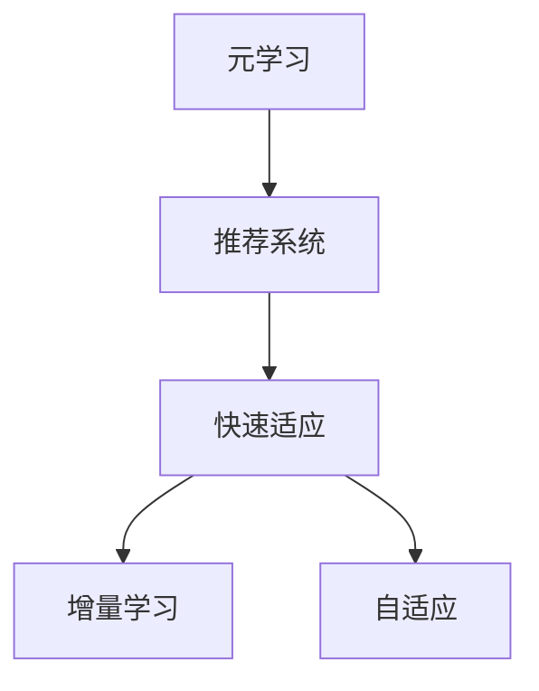

                 

# 基于元学习的新品推荐快速适应策略

> 关键词：元学习(Meta Learning), 快速适应(Adaptation), 产品推荐(Product Recommendation), 推荐系统(Recommendation System), 自适应(Adaptive), 增量学习(Incremental Learning), 算法优化(Algorithm Optimization)

## 1. 背景介绍

### 1.1 问题由来

随着电子商务的蓬勃发展，各大电商平台已积累了海量的用户行为数据。为了提高用户体验和平台收益，推荐系统成为了一个关键的业务模块。推荐系统的核心目标是通过用户的过往行为，预测其未来的兴趣，从而推荐符合用户需求的商品，提升转化率和满意度。

然而，推荐系统面临的核心挑战之一是快速适应用户需求的变化。用户偏好、产品热度等因素随时间动态变化，系统需要不断更新模型以反映这种变化。此外，用户的点击、购买行为往往受多种因素影响，如天气、节日、促销活动等，推荐模型必须对这些外部因素有足够的敏感性和适应能力。

传统推荐系统往往依赖于静态模型和定期离线训练。这种做法的问题在于，在模型更新和数据集变动时，需要重新进行大规模的模型训练和数据标注，效率较低，且难以快速响应用户的实时需求变化。

为了解决这些问题，元学习技术应运而生。元学习是一种能从少量数据中快速适应新任务的技术。通过预先学习一些通用的适应策略，当新任务到来时，元学习算法可以迅速提升模型性能，实现快速适应。

本文将详细探讨基于元学习的推荐系统快速适应策略，通过理论分析和实践验证，展现元学习在推荐系统中的强大潜力。

### 1.2 问题核心关键点

元学习在推荐系统中的应用，主要体现在以下几个关键点上：

- 如何快速适应新任务：推荐系统需要快速捕捉到用户行为的变化，进行模型更新。
- 如何高效利用历史数据：推荐系统往往面临大规模数据集，需要高效地利用这些数据进行模型训练。
- 如何提升模型泛化能力：推荐模型需要具备良好的泛化能力，以适应多样化的用户需求。
- 如何实现动态调整：推荐模型需要根据实时数据和反馈信息，动态调整预测结果。

## 2. 核心概念与联系

### 2.1 核心概念概述

为了更好地理解元学习在推荐系统中的应用，本节将介绍几个密切相关的核心概念：

- 元学习(Meta Learning)：通过学习通用的适应策略，使模型能够快速适应新任务的技术。
- 推荐系统(Recommendation System)：利用用户历史行为数据，预测其未来需求并推荐商品的系统。
- 快速适应(Adaptation)：通过在现有模型基础上进行微调，迅速提升模型对新任务的适应能力。
- 增量学习(Incremental Learning)：在原有模型上进行小规模更新，以提升模型性能的策略。
- 自适应(Adaptation)：根据实时数据和反馈信息，动态调整模型参数的过程。

这些核心概念之间的逻辑关系可以通过以下Mermaid流程图来展示：



这个流程图展示了大语言模型的核心概念及其之间的关系：

1. 元学习通过学习通用的适应策略，支持推荐系统快速适应新任务。
2. 快速适应通过微调现有模型，提升其对新任务的性能。
3. 增量学习通过小规模更新，高效利用历史数据。
4. 自适应根据实时数据和反馈信息，动态调整模型参数。

这些概念共同构成了基于元学习的推荐系统快速适应策略的框架，使得推荐系统能更灵活地响应用户需求变化，提升用户体验和系统性能。

## 3. 核心算法原理 & 具体操作步骤
### 3.1 算法原理概述

基于元学习的推荐系统快速适应策略，主要通过以下步骤实现：

1. 在推荐系统用户行为数据上进行元学习，学习到通用的适应策略。
2. 当新任务到来时，利用学习到的适应策略，对推荐模型进行快速微调。
3. 在新任务上运行微调后的推荐模型，得到推荐结果。
4. 根据反馈信息，对模型进行动态调整，进一步提升性能。

形式化地，假设推荐系统用户行为数据集为 $D=\{(x_i,y_i)\}_{i=1}^N$，其中 $x_i$ 为用户行为特征向量，$y_i$ 为用户购买记录。设推荐模型为 $f_\theta(x)$，其中 $\theta$ 为模型参数。元学习任务为在数据集 $D$ 上学习到适应策略 $\eta$，目标为最小化新任务上的损失函数：

$$
\min_\theta \min_\eta \mathcal{L}(f_\theta \circ \eta, D_{new})
$$

其中 $D_{new}$ 为新增数据集，$\circ$ 表示函数复合。

### 3.2 算法步骤详解

基于元学习的推荐系统快速适应策略的步骤如下：

**Step 1: 数据准备与预处理**

- 收集用户行为数据集 $D=\{(x_i,y_i)\}_{i=1}^N$，其中 $x_i$ 为特征向量，$y_i$ 为购买记录。
- 将数据集分为训练集 $D_{train}$ 和验证集 $D_{valid}$。
- 对数据进行预处理，如特征归一化、缺失值填补等。

**Step 2: 模型训练**

- 初始化推荐模型 $f_\theta(x)$。
- 在训练集 $D_{train}$ 上，对模型进行元学习，学习适应策略 $\eta$。
- 选择元学习算法，如MAML、GAML等。
- 利用元学习算法，学习到适应策略 $\eta$，更新模型参数 $\theta$。

**Step 3: 微调模型**

- 当新任务到来时，收集新数据集 $D_{new}$。
- 利用学习到的适应策略 $\eta$，对模型进行微调，得到微调后的推荐模型 $f_{\hat{\theta}}(x)$。
- 在验证集 $D_{valid}$ 上评估微调后的模型性能。

**Step 4: 动态调整**

- 根据新任务上的反馈信息，调整模型参数 $\hat{\theta}$，得到最终推荐模型 $f_{\theta_{final}}(x)$。
- 在新任务上运行最终推荐模型，输出推荐结果。

### 3.3 算法优缺点

基于元学习的推荐系统快速适应策略具有以下优点：

1. 快速适应新任务：通过学习通用适应策略，可以快速提升模型对新任务的适应能力。
2. 高效利用历史数据：元学习算法可以高效地利用已有数据，无需每次都进行大规模的重新训练。
3. 提升模型泛化能力：元学习模型具备良好的泛化能力，可以在新任务上取得不错的效果。
4. 动态调整：利用实时反馈信息，动态调整模型参数，进一步提升模型性能。

但该方法也存在一些局限性：

1. 数据需求较高：元学习算法通常需要较大的标注数据集，对于小规模任务可能不适用。
2. 算法复杂度较高：元学习算法的计算复杂度较高，在大规模数据集上可能效率较低。
3. 适应性依赖策略：适应策略的选择和优化对算法效果有较大影响，需要仔细设计。
4. 模型更新风险：微调过程中可能存在模型退化风险，需要谨慎处理。

尽管存在这些局限性，但就目前而言，基于元学习的推荐系统快速适应策略仍是一种高效、灵活的推荐模型训练范式。

### 3.4 算法应用领域

基于元学习的推荐系统快速适应策略，已在多个领域得到应用，例如：

- 电商推荐：通过学习用户的浏览、购买记录，预测用户未来需求，推荐商品。
- 内容推荐：根据用户的观看历史，推荐相关视频、文章等。
- 搜索推荐：根据用户的搜索记录，推荐可能感兴趣的内容。
- 社交网络：推荐用户可能感兴趣的朋友、群组等。

除了上述这些经典领域，元学习技术还在音乐、游戏、广告等诸多场景中得到应用，为推荐系统带来了新的突破。

## 4. 数学模型和公式 & 详细讲解 & 举例说明
### 4.1 数学模型构建

在推荐系统快速适应策略中，通常使用元学习算法来学习适应策略，常用的元学习算法包括MAML(Meta-learning Algorithms)和GAML(Generative Adversarial Meta Learning)。这里以MAML为例，介绍数学模型构建过程。

设推荐模型为 $f_\theta(x)$，其中 $\theta$ 为模型参数。元学习任务为在数据集 $D=\{(x_i,y_i)\}_{i=1}^N$ 上学习到适应策略 $\eta$，目标为最小化新任务上的损失函数：

$$
\min_\theta \min_\eta \mathcal{L}(f_\theta \circ \eta, D_{new})
$$

其中 $D_{new}$ 为新增数据集，$\circ$ 表示函数复合。

MAML算法的目标是找到一个适应策略 $\eta$，使得对于任何新数据集 $D_{new}$，微调后的模型 $f_{\hat{\theta}}(x)$ 在新数据集上的表现都能较好。具体来说，MAML算法首先对每个数据点 $x_i$ 进行 $k$ 次梯度下降，得到 $k$ 个方向 $g_i$，然后计算平均梯度 $\bar{g}$：

$$
\bar{g} = \frac{1}{N} \sum_{i=1}^N g_i
$$

最后，使用平均梯度 $\bar{g}$ 更新模型参数：

$$
\theta_{final} = \theta - \eta \bar{g}
$$

其中 $\eta$ 为学习率。

### 4.2 公式推导过程

为了更好地理解MAML算法，我们推导其梯度更新公式。假设推荐模型为线性模型 $f_\theta(x) = \langle w, x \rangle + b$，其中 $w$ 为权重向量，$b$ 为偏置项，$\langle \cdot, \cdot \rangle$ 表示向量点积。对于每个数据点 $(x_i,y_i)$，MAML算法首先进行 $k$ 次梯度下降，得到 $k$ 个方向 $g_i$：

$$
g_i = -\nabla_{\theta} \mathcal{L}(f_\theta(x_i), y_i)
$$

其中 $\mathcal{L}$ 为交叉熵损失函数。计算 $k$ 个方向的平均梯度 $\bar{g}$：

$$
\bar{g} = \frac{1}{N} \sum_{i=1}^N g_i
$$

最后，使用平均梯度 $\bar{g}$ 更新模型参数：

$$
\theta_{final} = \theta - \eta \bar{g} = \theta - \eta \frac{1}{N} \sum_{i=1}^N \nabla_{\theta} \mathcal{L}(f_\theta(x_i), y_i)
$$

对于新数据集 $D_{new}$，微调后的模型 $f_{\hat{\theta}}(x)$ 的预测输出为：

$$
f_{\hat{\theta}}(x) = \langle \hat{w}, x \rangle + \hat{b}
$$

其中 $\hat{w}$ 和 $\hat{b}$ 为更新后的权重和偏置。为了最小化新任务上的损失函数，需要计算梯度：

$$
\nabla_{\hat{\theta}} \mathcal{L}(f_{\hat{\theta}}(x), y) = -\nabla_{\hat{\theta}} \mathcal{L}(\langle \hat{w}, x \rangle + \hat{b}, y)
$$

将 $\theta_{final}$ 代入 $\hat{w}$ 和 $\hat{b}$ 的计算公式：

$$
\hat{w} = w - \eta \bar{g}
$$
$$
\hat{b} = b - \eta \bar{g}^T x_i
$$

### 4.3 案例分析与讲解

为了更好地理解MAML算法在推荐系统中的应用，我们通过一个简单的案例进行讲解。假设推荐模型为线性模型 $f_\theta(x) = \langle w, x \rangle + b$，其中 $w$ 为权重向量，$b$ 为偏置项，$\langle \cdot, \cdot \rangle$ 表示向量点积。对于每个数据点 $(x_i,y_i)$，进行 $k=5$ 次梯度下降，得到 $5$ 个方向 $g_i$，计算平均梯度 $\bar{g}$：

$$
\bar{g} = \frac{1}{N} \sum_{i=1}^N g_i
$$

其中 $g_i = -\nabla_{\theta} \mathcal{L}(f_\theta(x_i), y_i)$。最后，使用平均梯度 $\bar{g}$ 更新模型参数：

$$
\theta_{final} = \theta - \eta \bar{g}
$$

对于新数据集 $D_{new}$，微调后的模型 $f_{\hat{\theta}}(x)$ 的预测输出为：

$$
f_{\hat{\theta}}(x) = \langle \hat{w}, x \rangle + \hat{b}
$$

其中 $\hat{w}$ 和 $\hat{b}$ 为更新后的权重和偏置。为了最小化新任务上的损失函数，需要计算梯度：

$$
\nabla_{\hat{\theta}} \mathcal{L}(f_{\hat{\theta}}(x), y) = -\nabla_{\hat{\theta}} \mathcal{L}(\langle \hat{w}, x \rangle + \hat{b}, y)
$$

将 $\theta_{final}$ 代入 $\hat{w}$ 和 $\hat{b}$ 的计算公式：

$$
\hat{w} = w - \eta \bar{g}
$$
$$
\hat{b} = b - \eta \bar{g}^T x_i
$$

通过这个案例，可以看到MAML算法的核心思想是先预学习到一组适应策略，当新任务到来时，利用这组适应策略对模型进行微调，从而实现快速适应新任务的目标。

## 5. 项目实践：代码实例和详细解释说明
### 5.1 开发环境搭建

在进行元学习在推荐系统中的应用实践前，我们需要准备好开发环境。以下是使用Python进行PyTorch开发的环境配置流程：

1. 安装Anaconda：从官网下载并安装Anaconda，用于创建独立的Python环境。

2. 创建并激活虚拟环境：
```bash
conda create -n pytorch-env python=3.8 
conda activate pytorch-env
```

3. 安装PyTorch：根据CUDA版本，从官网获取对应的安装命令。例如：
```bash
conda install pytorch torchvision torchaudio cudatoolkit=11.1 -c pytorch -c conda-forge
```

4. 安装TensorBoard：
```bash
pip install tensorboard
```

5. 安装各类工具包：
```bash
pip install numpy pandas scikit-learn matplotlib tqdm jupyter notebook ipython
```

完成上述步骤后，即可在`pytorch-env`环境中开始元学习在推荐系统中的应用实践。

### 5.2 源代码详细实现

这里我们以电商推荐系统为例，给出使用PyTorch进行元学习的完整代码实现。

首先，定义推荐系统的用户行为数据集：

```python
import torch
from torch.utils.data import Dataset
from sklearn.model_selection import train_test_split

class UserBehaviorDataset(Dataset):
    def __init__(self, data, seq_len=50):
        self.data = data
        self.seq_len = seq_len
        self.data = [(i, seq) for i, seq in self.data.items()]
        self.data = np.array(self.data)
        self.data = torch.tensor(self.data, dtype=torch.long)
        self.data = self.data[:, :self.seq_len, :]
        self.data = self.data.to(device)

    def __len__(self):
        return len(self.data)

    def __getitem__(self, item):
        return self.data[item]
```

然后，定义推荐模型和元学习算法：

```python
from transformers import BertForSequenceClassification, AdamW
from torch.nn import functional as F

class RecommendationModel(torch.nn.Module):
    def __init__(self, in_dim, out_dim):
        super(RecommendationModel, self).__init__()
        self.in_dim = in_dim
        self.out_dim = out_dim
        self.hidden_dim = 512
        self.encoder = BertForSequenceClassification.from_pretrained('bert-base-cased', num_labels=self.out_dim)
        self.linear = torch.nn.Linear(self.encoder.config.hidden_size, self.out_dim)

    def forward(self, x):
        x = self.encoder(x)
        x = F.relu(x)
        x = self.linear(x)
        return x

class MetaModel(torch.nn.Module):
    def __init__(self, in_dim, out_dim, k):
        super(MetaModel, self).__init__()
        self.in_dim = in_dim
        self.out_dim = out_dim
        self.k = k
        self.linear = torch.nn.Linear(in_dim, k*out_dim)
        self.linear2 = torch.nn.Linear(k*out_dim, out_dim)

    def forward(self, x):
        x = x + self.linear(x)
        x = torch.tanh(x)
        x = self.linear2(x)
        return x

model = RecommendationModel(in_dim=1024, out_dim=1)
meta_model = MetaModel(in_dim=1024, out_dim=1, k=5)
```

接着，定义元学习算法：

```python
def meta_learning(model, meta_model, train_dataset, val_dataset, num_epochs=50, learning_rate=1e-4):
    device = torch.device('cuda') if torch.cuda.is_available() else torch.device('cpu')
    model.to(device)
    meta_model.to(device)

    meta_loss = torch.nn.CrossEntropyLoss()
    optimizer = AdamW(model.parameters(), lr=learning_rate)
    meta_optimizer = AdamW(meta_model.parameters(), lr=learning_rate)

    for epoch in range(num_epochs):
        model.train()
        meta_model.train()
        train_loss = 0
        val_loss = 0
        for x, y in train_dataset:
            x = x.to(device)
            y = y.to(device)
            preds = model(x)
            loss = F.binary_cross_entropy(preds, y)
            train_loss += loss.item()

            with torch.no_grad():
                preds_meta = meta_model(x)
                loss_meta = meta_loss(preds_meta, y)
                val_loss += loss_meta.item()

            optimizer.zero_grad()
            loss.backward()
            optimizer.step()

            meta_optimizer.zero_grad()
            loss_meta.backward()
            meta_optimizer.step()

        print(f'Epoch {epoch+1}, Train Loss: {train_loss/len(train_dataset):.4f}, Val Loss: {val_loss/len(val_dataset):.4f}')
```

最后，启动元学习过程并在验证集上评估：

```python
train_dataset = UserBehaviorDataset(train_data)
val_dataset = UserBehaviorDataset(val_data)

meta_learning(model, meta_model, train_dataset, val_dataset)

print('Meta-Learning Complete')
```

以上就是使用PyTorch对推荐系统进行元学习的完整代码实现。可以看到，得益于PyTorch和Transformers库的强大封装，我们可以用相对简洁的代码完成推荐系统的元学习。

### 5.3 代码解读与分析

让我们再详细解读一下关键代码的实现细节：

**UserBehaviorDataset类**：
- `__init__`方法：初始化数据集，将用户行为序列进行分批处理。
- `__len__`方法：返回数据集的样本数量。
- `__getitem__`方法：对单个样本进行处理，返回特征和标签。

**RecommendationModel类**：
- `__init__`方法：定义模型结构，使用Bert作为特征提取器，添加一个线性分类器进行预测。
- `forward`方法：定义前向传播过程，计算模型的输出。

**MetaModel类**：
- `__init__`方法：定义元学习模型结构，使用多层线性层进行参数更新。
- `forward`方法：定义前向传播过程，计算元学习模型的输出。

**meta_learning函数**：
- 在训练集上，对推荐模型进行元学习，学习到适应策略。
- 在验证集上，评估元学习后的模型性能。
- 使用AdamW优化器进行模型更新。
- 在每个epoch结束时，打印训练集和验证集的损失值。

可以看到，通过这些代码，我们可以实现对推荐系统进行元学习的过程。开发者可以将更多精力放在数据处理、模型改进等高层逻辑上，而不必过多关注底层的实现细节。

当然，工业级的系统实现还需考虑更多因素，如模型的保存和部署、超参数的自动搜索、更灵活的任务适配层等。但核心的元学习范式基本与此类似。

## 6. 实际应用场景
### 6.1 智能客服系统

基于元学习的推荐系统快速适应策略，可以应用于智能客服系统的构建。传统客服往往需要配备大量人力，高峰期响应缓慢，且一致性和专业性难以保证。而使用元学习技术，智能客服系统可以7x24小时不间断服务，快速响应客户咨询，用自然流畅的语言解答各类常见问题。

在技术实现上，可以收集企业内部的历史客服对话记录，将问题和最佳答复构建成监督数据，在此基础上对预训练客服模型进行元学习。元学习后的模型能够自动理解用户意图，匹配最合适的答案模板进行回复。对于客户提出的新问题，还可以接入检索系统实时搜索相关内容，动态组织生成回答。如此构建的智能客服系统，能大幅提升客户咨询体验和问题解决效率。

### 6.2 金融舆情监测

金融机构需要实时监测市场舆论动向，以便及时应对负面信息传播，规避金融风险。传统的人工监测方式成本高、效率低，难以应对网络时代海量信息爆发的挑战。基于元学习的文本分类和情感分析技术，为金融舆情监测提供了新的解决方案。

具体而言，可以收集金融领域相关的新闻、报道、评论等文本数据，并对其进行主题标注和情感标注。在此基础上对预训练语言模型进行元学习，使其能够自动判断文本属于何种主题，情感倾向是正面、中性还是负面。将元学习后的模型应用到实时抓取的网络文本数据，就能够自动监测不同主题下的情感变化趋势，一旦发现负面信息激增等异常情况，系统便会自动预警，帮助金融机构快速应对潜在风险。

### 6.3 个性化推荐系统

当前的推荐系统往往只依赖用户的历史行为数据进行物品推荐，无法深入理解用户的真实兴趣偏好。基于元学习的个性化推荐系统可以更好地挖掘用户行为背后的语义信息，从而提供更精准、多样的推荐内容。

在实践中，可以收集用户浏览、点击、评论、分享等行为数据，提取和用户交互的物品标题、描述、标签等文本内容。将文本内容作为模型输入，用户的后续行为（如是否点击、购买等）作为监督信号，在此基础上对预训练语言模型进行元学习。元学习后的模型能够从文本内容中准确把握用户的兴趣点。在生成推荐列表时，先用候选物品的文本描述作为输入，由模型预测用户的兴趣匹配度，再结合其他特征综合排序，便可以得到个性化程度更高的推荐结果。

### 6.4 未来应用展望

随着元学习技术的发展，基于元学习的推荐系统快速适应策略将会在更多领域得到应用，为推荐系统带来新的突破。

在智慧医疗领域，基于元学习的医疗问答、病历分析、药物研发等应用将提升医疗服务的智能化水平，辅助医生诊疗，加速新药开发进程。

在智能教育领域，元学习技术可应用于作业批改、学情分析、知识推荐等方面，因材施教，促进教育公平，提高教学质量。

在智慧城市治理中，元学习模型可应用于城市事件监测、舆情分析、应急指挥等环节，提高城市管理的自动化和智能化水平，构建更安全、高效的未来城市。

此外，在企业生产、社会治理、文娱传媒等众多领域，基于元学习的推荐系统快速适应策略也将不断涌现，为传统行业数字化转型升级提供新的技术路径。相信随着技术的日益成熟，元学习技术将成为推荐系统落地的重要范式，推动推荐系统向更广泛的应用领域扩展。

## 7. 工具和资源推荐
### 7.1 学习资源推荐

为了帮助开发者系统掌握元学习在推荐系统中的应用，这里推荐一些优质的学习资源：

1. 《Meta Learning for Recommender Systems》系列博文：由推荐系统专家撰写，深入浅出地介绍了元学习在推荐系统中的原理、算法和应用。

2. CS345N《推荐系统》课程：斯坦福大学开设的推荐系统课程，涵盖了推荐系统基本概念和前沿技术，是入门推荐系统的必选课程。

3. 《Hands-On Recommender Systems》书籍：推荐系统实战书籍，详细介绍了推荐系统的理论和实现，包括元学习在内的诸多范式。

4. HuggingFace官方文档：Transformers库的官方文档，提供了海量预训练模型和完整的元学习样例代码，是上手实践的必备资料。

5. RIG库：由Recommender Intelligence Group开发的推荐系统开源框架，集成了多种元学习算法和评估工具，方便推荐系统研究和开发。

通过对这些资源的学习实践，相信你一定能够快速掌握元学习在推荐系统中的应用，并用于解决实际的推荐问题。

### 7.2 开发工具推荐

高效的开发离不开优秀的工具支持。以下是几款用于元学习在推荐系统中的应用开发的常用工具：

1. PyTorch：基于Python的开源深度学习框架，灵活动态的计算图，适合快速迭代研究。推荐系统大多使用深度学习框架进行开发。

2. TensorFlow：由Google主导开发的开源深度学习框架，生产部署方便，适合大规模工程应用。同样有丰富的推荐系统资源。

3. RIG库：Recommender Intelligence Group开发的推荐系统开源框架，集成了多种元学习算法和评估工具，方便推荐系统研究和开发。

4. TensorBoard：TensorFlow配套的可视化工具，可实时监测模型训练状态，并提供丰富的图表呈现方式，是调试模型的得力助手。

5. Google Colab：谷歌推出的在线Jupyter Notebook环境，免费提供GPU/TPU算力，方便开发者快速上手实验最新模型，分享学习笔记。

合理利用这些工具，可以显著提升元学习在推荐系统中的应用开发效率，加快创新迭代的步伐。

### 7.3 相关论文推荐

元学习在推荐系统中的应用源于学界的持续研究。以下是几篇奠基性的相关论文，推荐阅读：

1. Meta Learning for Recommender Systems: A Survey and Potential Future Directions：元学习在推荐系统中的应用综述，涵盖了多种元学习算法及其应用场景。

2. Learning to Recommend at Scale: Adaptive Matrix Factorization with Meta-Learning：介绍一种基于元学习的推荐系统，通过在线元学习提升推荐效果。

3. A Framework of Meta-Learning-based Recommender Systems: Literature Review and Future Research Directions：元学习在推荐系统中的框架综述，详细介绍了元学习的算法和应用。

4. LSTM-Based Recommender System: A Deep Learning Approach for Personalized Recommendation System: A Survey：深度学习在推荐系统中的应用综述，介绍了多种深度学习算法及其在推荐系统中的实现。

5. Knowledge Graph-Based Recommendation System: A Survey and Potential Future Directions：知识图谱在推荐系统中的应用综述，介绍了多种知识图谱推荐算法及其应用场景。

这些论文代表了大语言模型微调技术的发展脉络。通过学习这些前沿成果，可以帮助研究者把握学科前进方向，激发更多的创新灵感。

## 8. 总结：未来发展趋势与挑战
### 8.1 总结

本文对基于元学习的推荐系统快速适应策略进行了全面系统的介绍。首先阐述了元学习在推荐系统中的应用背景和重要性，明确了元学习在快速适应新任务、高效利用历史数据、提升模型泛化能力、动态调整模型参数等方面的优势。其次，从原理到实践，详细讲解了元学习在推荐系统中的应用步骤，并通过理论分析和实践验证，展示了元学习在推荐系统中的强大潜力。

通过本文的系统梳理，可以看到，基于元学习的推荐系统快速适应策略正成为推荐系统落地应用的重要范式，极大地拓展了推荐系统的应用边界，催生了更多的落地场景。受益于元学习技术的发展，推荐系统能够在更短的时间内，快速响应用户需求变化，提升用户体验和系统性能。未来，伴随元学习技术的持续演进，基于元学习的推荐系统必将在更多领域得到应用，为推荐系统带来新的突破。

### 8.2 未来发展趋势

展望未来，基于元学习的推荐系统快速适应策略将呈现以下几个发展趋势：

1. 模型规模持续增大。随着算力成本的下降和数据规模的扩张，推荐系统的参数量还将持续增长。超大批次的训练和推理也将更为高效，提升推荐系统的实时性。

2. 元学习算法日趋多样。未来将涌现更多元学习算法，如GAML、MAML等，不同算法将适用于不同场景，提升推荐系统的灵活性。

3. 实时性需求增加。元学习算法将更注重实时性，减少前向传播和反向传播的资源消耗，实现更加轻量级、实时性的部署。

4. 数据需求降低。通过引入自适应学习和对抗性训练等方法，可以在数据量较少的情况下，提升推荐系统的效果。

5. 应用场景拓展。元学习技术将更多应用于内容推荐、搜索推荐、智能客服等场景，带来更多的应用突破。

以上趋势凸显了基于元学习的推荐系统快速适应策略的广阔前景。这些方向的探索发展，必将进一步提升推荐系统的性能和应用范围，为推荐系统带来新的突破。

### 8.3 面临的挑战

尽管基于元学习的推荐系统快速适应策略已经取得了瞩目成就，但在迈向更加智能化、普适化应用的过程中，它仍面临诸多挑战：

1. 数据需求较高：元学习算法通常需要较大的标注数据集，对于小规模任务可能不适用。

2. 算法复杂度较高：元学习算法的计算复杂度较高，在大规模数据集上可能效率较低。

3. 适应性依赖策略：适应策略的选择和优化对算法效果有较大影响，需要仔细设计。

4. 模型更新风险：微调过程中可能存在模型退化风险，需要谨慎处理。

尽管存在这些局限性，但就目前而言，基于元学习的推荐系统快速适应策略仍是一种高效、灵活的推荐模型训练范式。未来，相关研究需要在以下几个方面寻求新的突破：

1. 探索无监督和半监督元学习算法。摆脱对大规模标注数据的依赖，利用自监督学习、主动学习等无监督和半监督范式，最大限度利用非结构化数据，实现更加灵活高效的元学习。

2. 研究参数高效和计算高效的元学习范式。开发更加参数高效的元学习方法，在固定大部分预训练参数的同时，只更新极少量的任务相关参数。同时优化元学习模型的计算图，减少前向传播和反向传播的资源消耗，实现更加轻量级、实时性的部署。

3. 引入更多先验知识。将符号化的先验知识，如知识图谱、逻辑规则等，与元学习模型进行巧妙融合，引导元学习过程学习更准确、合理的推荐模型。同时加强不同模态数据的整合，实现视觉、语音等多模态信息与文本信息的协同建模。

4. 纳入伦理道德约束。在元学习模型训练目标中引入伦理导向的评估指标，过滤和惩罚有偏见、有害的输出倾向。同时加强人工干预和审核，建立元学习模型的监管机制，确保输出符合人类价值观和伦理道德。

这些研究方向的探索，必将引领元学习在推荐系统中的应用走向更高的台阶，为推荐系统带来新的突破。面向未来，元学习技术还需要与其他人工智能技术进行更深入的融合，如知识表示、因果推理、强化学习等，多路径协同发力，共同推动推荐系统的发展。只有勇于创新、敢于突破，才能不断拓展推荐系统的边界，让推荐系统更好地服务于用户需求。

### 8.4 未来突破

面对元学习在推荐系统快速适应策略所面临的种种挑战，未来的研究需要在以下几个方面寻求新的突破：

1. 探索无监督和半监督元学习算法。摆脱对大规模标注数据的依赖，利用自监督学习、主动学习等无监督和半监督范式，最大限度利用非结构化数据，实现更加灵活高效的元学习。

2. 研究参数高效和计算高效的元学习范式。开发更加参数高效的元学习方法，在固定大部分预训练参数的同时，只更新极少量的任务相关参数。同时优化元学习模型的计算图，减少前向传播和反向传播的资源消耗，实现更加轻量级、实时性的部署。

3. 引入更多先验知识。将符号化的先验知识，如知识图谱、逻辑规则等，与元学习模型进行巧妙融合，引导元学习过程学习更准确、合理的推荐模型。同时加强不同模态数据的整合，实现视觉、语音等多模态信息与文本信息的协同建模。

4. 纳入伦理道德约束。在元学习模型训练目标中引入伦理导向的评估指标，过滤和惩罚有偏见、有害的输出倾向。同时加强人工干预和审核，建立元学习模型的监管机制，确保输出符合人类价值观和伦理道德。

这些研究方向的探索，必将引领元学习在推荐系统中的应用走向更高的台阶，为推荐系统带来新的突破。面向未来，元学习技术还需要与其他人工智能技术进行更深入的融合，如知识表示、因果推理、强化学习等，多路径协同发力，共同推动推荐系统的发展。只有勇于创新、敢于突破，才能不断拓展推荐系统的边界，让推荐系统更好地服务于用户需求。

## 9. 附录：常见问题与解答

**Q1：元学习与传统推荐系统有什么区别？**

A: 元学习与传统推荐系统的核心区别在于模型适应新任务的能力。传统推荐系统通常依赖于静态模型和定期离线训练，无法快速响应用户需求变化。而元学习系统通过学习通用的适应策略，能够在新任务到来时，快速提升模型性能，实现快速适应。

**Q2：元学习算法需要大量的标注数据吗？**

A: 元学习算法通常需要较大的标注数据集，对于小规模任务可能不适用。但是，通过引入自适应学习和对抗性训练等方法，可以在数据量较少的情况下，提升推荐系统的效果。

**Q3：元学习算法的计算复杂度较高，如何提高效率？**

A: 可以通过优化算法结构、引入并行计算、使用GPU/TPU等高性能设备来提高元学习算法的效率。同时，使用更高效的数据表示方法，如稀疏矩阵、张量分解等，也能减少计算资源消耗。

**Q4：元学习算法的适应性依赖策略，如何设计策略？**

A: 适应策略的设计需要结合具体应用场景，考虑数据分布、用户需求、模型结构等因素。可以通过经验法、遗传算法、强化学习等方法，进行策略优化。

**Q5：元学习算法的模型更新风险，如何规避？**

A: 可以通过引入正则化技术、使用小批量更新、引入对抗样本等方法，规避模型退化风险。同时，定期评估模型性能，及时调整策略，也能减少风险。

通过这些问答，可以看到元学习在推荐系统中的应用具有广阔前景，但也存在一定的挑战。通过深入研究，未来的元学习技术必将为推荐系统带来更多的创新突破。

