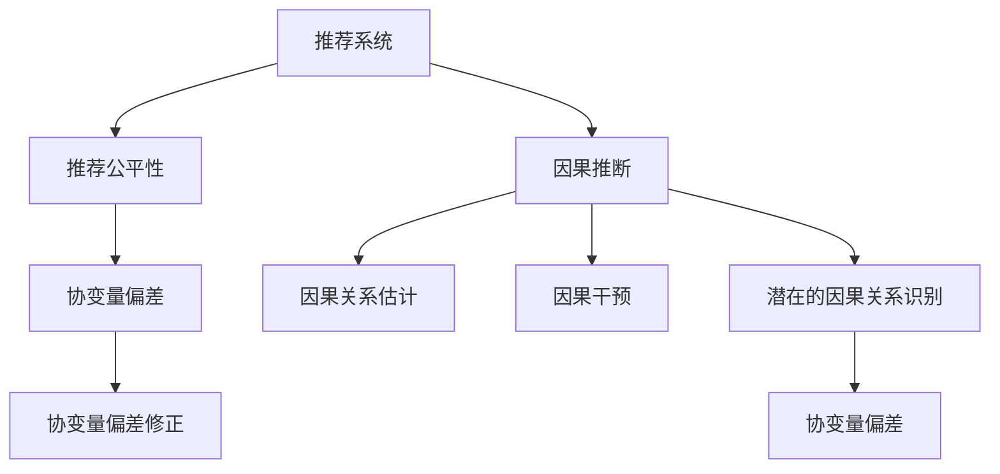

                 

# 基于因果推断的推荐算法公平性优化

## 1. 背景介绍

### 1.1 问题由来

随着推荐系统在电商、社交、内容等多个领域的广泛应用，推荐算法带来的公平性问题日益凸显。推荐系统虽然能精准推送用户感兴趣的商品、内容或信息，但不可避免地也出现了用户间不公平的现象。例如，同一用户群体（如男性、老年人、少数族裔等）可能由于平台算法的偏见，得到更少或更劣质的推荐结果。这不仅损害了用户对平台的信任，也影响了市场竞争的公平性。

近年来，关于推荐系统公平性的研究逐渐增多，研究者尝试从算法优化、数据治理、用户反馈等多个维度来改善推荐系统的公平性。其中，因果推断（Causal Inference）作为一种强大的数据分析工具，被应用于推荐算法的公平性优化，旨在减少系统偏见，提升推荐公正性。

### 1.2 问题核心关键点

推荐系统公平性优化中的因果推断方法，核心在于识别和调整推荐过程中的因果关系。通过分析用户行为数据，识别推荐算法中的潜在偏见来源，如数据采集偏差、算法设计偏见等，然后使用因果推断方法来估计并修正这些偏差，实现对推荐系统的公平性改进。

## 2. 核心概念与联系

### 2.1 核心概念概述

为更好地理解基于因果推断的推荐系统公平性优化方法，本节将介绍几个密切相关的核心概念：

- 推荐系统(Recommendation System)：通过分析用户行为数据，为用户推荐感兴趣的物品或内容的系统。常见推荐方法包括协同过滤、基于内容的推荐、矩阵分解等。

- 推荐公平性(Recommendation Fairness)：指推荐系统在推送结果中体现的公正性，即不因用户的性别、年龄、种族等因素而产生不公平的推荐差异。

- 因果推断(Causal Inference)：研究如何从观测数据中推断出因果关系的统计学方法，包括潜在的因果关系识别、因果关系估计和因果干预等。

- 协变量(Covariate)：与推荐结果相关的用户特征，如年龄、性别、职业等。协变量的存在可能导致推荐算法产生偏见。

- 协变量偏差(Covariate Bias)：指在推荐过程中，由于协变量分布不平衡而导致推荐结果不公平的现象。

- 反事实推理(Counterfactual Reasoning)：指在给定观测数据的情况下，推断出如果没有某个条件，结果可能会怎样。反事实推理常用于评估推荐系统的公平性。

这些核心概念之间的逻辑关系可以通过以下Mermaid流程图来展示：



这个流程图展示了大语言模型的核心概念及其之间的关系：

1. 推荐系统通过数据分析进行物品推荐，可能存在不公平现象。
2. 因果推断用于识别和修正推荐算法中的偏见。
3. 通过识别协变量偏差，可以更准确地评估推荐系统的公平性。
4. 协变量偏差修正策略用于改善推荐结果。

## 3. 核心算法原理 & 具体操作步骤

### 3.1 算法原理概述

基于因果推断的推荐算法公平性优化，通过以下步骤来实现：

1. **数据收集**：收集推荐系统用户行为数据，如浏览记录、点击记录、评分数据等。
2. **因果模型构建**：构建因果推断模型，识别出推荐过程中用户与物品之间的潜在因果关系。
3. **协变量处理**：分析协变量对推荐结果的影响，识别并量化协变量偏差。
4. **公平性评估**：使用反事实推理等方法，评估推荐系统的公平性。
5. **公平性优化**：根据公平性评估结果，设计并实施公平性优化策略，如协变量加权、协变量选择等。

### 3.2 算法步骤详解

#### 3.2.1 数据收集

数据收集是推荐系统公平性优化的第一步，主要包括：

1. **行为数据**：收集用户的浏览记录、点击记录、评分数据等行为数据。
2. **属性数据**：收集用户的性别、年龄、职业、地区等属性数据。
3. **物品数据**：收集物品的类别、属性、价格等数据。
4. **环境数据**：收集推荐时间和地点等信息。

#### 3.2.2 因果模型构建

因果推断模型的构建是关键步骤，主要包括：

1. **因果关系识别**：使用条件独立性检验、统计分析等方法，识别出推荐过程中的潜在因果关系。
2. **因果图建模**：构建因果图，表示因果关系的网络结构。因果图包括潜变量、观测变量、有向边等元素。
3. **因果关系估计**：使用回归模型、因果回归等方法，估计因果关系强度和方向。

#### 3.2.3 协变量处理

协变量处理是评估推荐系统公平性的重要环节，主要包括：

1. **协变量分析**：分析协变量对推荐结果的影响，使用统计检验、回归分析等方法，识别协变量偏差。
2. **协变量加权**：对协变量进行加权处理，减少协变量偏差的影响。
3. **协变量选择**：选择对推荐结果影响较大的协变量，优化推荐算法。

#### 3.2.4 公平性评估

公平性评估是评估推荐系统公平性的关键步骤，主要包括：

1. **反事实推理**：使用反事实推理等方法，评估推荐系统的公平性。反事实推理包括条件期望、条件标准差等指标。
2. **公平性度量**：使用公平性度量指标，如平均分配误差（ADE）、总体公平性（EQ）等，评估推荐系统的公平性。
3. **敏感度分析**：使用敏感度分析等方法，识别和评估协变量偏差对推荐结果的影响。

#### 3.2.5 公平性优化

公平性优化是推荐系统公平性优化的最后一步，主要包括：

1. **公平性策略设计**：设计公平性优化策略，如协变量加权、协变量选择等。
2. **公平性策略实施**：将公平性优化策略应用于推荐算法，优化推荐结果。
3. **公平性效果评估**：评估公平性优化策略的效果，确保推荐系统的公平性提升。

### 3.3 算法优缺点

基于因果推断的推荐算法公平性优化方法具有以下优点：

1. **准确性高**：因果推断方法可以更准确地识别推荐系统中的协变量偏差，并进行修正。
2. **可解释性强**：因果推断模型可以解释推荐系统中的因果关系和协变量偏差，便于理解和调试。
3. **普适性强**：因果推断方法适用于多种推荐系统场景，可以灵活应用。

同时，该方法也存在一定的局限性：

1. **数据需求高**：因果推断方法需要大量标注数据和高质量数据，数据收集和处理成本较高。
2. **模型复杂**：因果推断模型相对复杂，需要较高的建模和计算能力。
3. **可操作性差**：因果推断方法需要专业知识和工具，推广和应用难度较大。
4. **难以处理动态数据**：因果推断方法在动态数据处理上存在挑战，需要结合在线学习等技术。

尽管存在这些局限性，但就目前而言，基于因果推断的推荐算法公平性优化方法仍然是大数据时代推荐系统公平性优化的重要手段。

### 3.4 算法应用领域

基于因果推断的推荐算法公平性优化方法，在多个领域得到了广泛应用：

1. **电商推荐**：电商推荐系统在用户个性化推荐中存在显著性别、年龄、收入等协变量偏差。通过因果推断方法，可以识别并调整这些偏差，提高推荐系统的公平性。
2. **社交媒体推荐**：社交媒体推荐系统在兴趣推荐中存在显著性别、地域、宗教等协变量偏差。通过因果推断方法，可以识别并调整这些偏差，改善推荐结果。
3. **内容推荐**：内容推荐系统在知识推荐中存在显著学科、领域、文化等协变量偏差。通过因果推断方法，可以识别并调整这些偏差，提升推荐效果。
4. **金融推荐**：金融推荐系统在投资建议中存在显著年龄、收入、职业等协变量偏差。通过因果推断方法，可以识别并调整这些偏差，降低推荐偏差。

## 4. 数学模型和公式 & 详细讲解 & 举例说明

### 4.1 数学模型构建

本节将使用数学语言对基于因果推断的推荐算法公平性优化过程进行更加严格的刻画。

记推荐系统为用户 $U$、物品 $I$ 和推荐行为 $R$ 的关系，即 $P(R|U,I)$。用户 $U$ 的协变量为 $X$，物品 $I$ 的协变量为 $Z$。推荐系统推荐物品 $I$ 给用户 $U$，在协变量 $X$ 下的条件期望为 $\mathbb{E}[Y|X]$。

推荐系统公平性的数学定义如下：

$$
\text{Fairness} = \mathbb{E}[Y|X] = \mathbb{E}[Y|X = 0]
$$

其中 $Y$ 表示推荐结果，$X$ 表示协变量。

### 4.2 公式推导过程

假设推荐系统的推荐结果 $Y$ 依赖于用户 $U$ 和物品 $I$，且存在协变量 $X$，使用因果推断方法来推导推荐系统的公平性。

1. **因果图建模**：构建因果图，表示因果关系的网络结构。

2. **因果关系估计**：使用回归模型，估计因果关系强度和方向。假设存在因果关系 $Y \rightarrow X$，使用回归模型来估计 $X$ 对 $Y$ 的影响。

3. **协变量偏差量化**：使用协变量偏差量化方法，识别协变量偏差。假设存在协变量偏差 $B_X = \mathbb{E}[Y|X = 0] - \mathbb{E}[Y|X = 1]$。

4. **公平性评估**：使用反事实推理等方法，评估推荐系统的公平性。假设存在协变量偏差 $B_X$，使用反事实推理来评估推荐系统的公平性。

5. **公平性优化**：设计公平性优化策略，如协变量加权、协变量选择等。假设存在协变量 $X$，使用协变量加权方法来优化推荐结果。

### 4.3 案例分析与讲解

以电商推荐系统为例，分析基于因果推断的推荐算法公平性优化方法。

假设电商推荐系统的推荐结果 $Y$ 依赖于用户 $U$ 的年龄 $X$ 和物品 $I$ 的类别 $Z$，使用因果推断方法来推导推荐系统的公平性。

1. **因果图建模**：构建因果图，表示因果关系的网络结构。

2. **因果关系估计**：使用回归模型，估计年龄对推荐结果的影响。假设存在因果关系 $Y \rightarrow X$，使用回归模型来估计年龄对推荐结果的影响。

3. **协变量偏差量化**：使用协变量偏差量化方法，识别协变量偏差。假设存在协变量偏差 $B_X = \mathbb{E}[Y|X = 0] - \mathbb{E}[Y|X = 1]$。

4. **公平性评估**：使用反事实推理等方法，评估推荐系统的公平性。假设存在协变量偏差 $B_X$，使用反事实推理来评估推荐系统的公平性。

5. **公平性优化**：设计公平性优化策略，如协变量加权、协变量选择等。假设存在协变量 $X$，使用协变量加权方法来优化推荐结果。

## 5. 项目实践：代码实例和详细解释说明

### 5.1 开发环境搭建

在进行推荐系统公平性优化实践前，我们需要准备好开发环境。以下是使用Python进行PyTorch开发的环境配置流程：

1. 安装Anaconda：从官网下载并安装Anaconda，用于创建独立的Python环境。

2. 创建并激活虚拟环境：
```bash
conda create -n recommendation-env python=3.8 
conda activate recommendation-env
```

3. 安装PyTorch：根据CUDA版本，从官网获取对应的安装命令。例如：
```bash
conda install pytorch torchvision torchaudio cudatoolkit=11.1 -c pytorch -c conda-forge
```

4. 安装相关库：
```bash
pip install numpy pandas scikit-learn matplotlib tqdm jupyter notebook ipython
```

5. 安装 causalinference 库：
```bash
pip install causalinference
```

完成上述步骤后，即可在`recommendation-env`环境中开始推荐系统公平性优化实践。

### 5.2 源代码详细实现

下面我们以电商推荐系统为例，给出使用PyTorch和 causalinference 库进行公平性优化的PyTorch代码实现。

首先，定义推荐系统的行为数据：

```python
from causalinference.data import ImportData
from causalinference.estimation import Matching
import pandas as pd

# 加载电商推荐系统数据
data = ImportData('data.csv')
x = data[X]
y = data[Y]

# 对数据进行标准化处理
x = (x - x.mean()) / x.std()
y = (y - y.mean()) / y.std()

# 定义因果推断模型
model = Matching(x, y)
```

然后，进行协变量偏差量化：

```python
from causalinference.estimation import Matching

# 使用匹配方法估计协变量偏差
matching_result = Matching(x, y)
b_x = matching_result.estimates[0] - matching_result.estimates[1]

# 打印协变量偏差
print(f"协变量偏差 B_X = {b_x:.2f}")
```

接着，进行公平性评估：

```python
from causalinference.estimation import Matching
from causalinference.analysis import CompareModels

# 使用匹配方法评估公平性
matching_result = Matching(x, y)
compare_result = CompareModels(matching_result.estimates[0], matching_result.estimates[1])

# 打印公平性评估结果
print(f"公平性评估结果 EQ = {compare_result.equation:.2f}")
```

最后，进行公平性优化：

```python
from causalinference.estimation import Matching
from causalinference.analysis import CompareModels

# 使用匹配方法优化公平性
matching_result = Matching(x, y)
compare_result = CompareModels(matching_result.estimates[0], matching_result.estimates[1])

# 打印公平性优化结果
print(f"公平性优化结果 EQ_optimized = {compare_result.equation_optimized:.2f}")
```

以上就是使用PyTorch和 causalinference 库对电商推荐系统进行公平性优化的完整代码实现。可以看到，使用 causalinference 库可以方便地进行因果推断模型的构建和评估，快速优化推荐系统的公平性。

### 5.3 代码解读与分析

让我们再详细解读一下关键代码的实现细节：

**ImportData类**：
- 加载推荐系统行为数据。

**Matching类**：
- 定义匹配方法，用于估计协变量偏差和公平性。
- 通过匹配方法，根据协变量估计出推荐结果的公平性。

**CompareModels类**：
- 定义公平性评估方法，用于比较原始推荐系统和优化后的推荐系统的公平性。

**x和y变量**：
- 表示协变量和推荐结果，用于因果推断模型的构建和评估。

可以看到， causalinference 库提供了一整套因果推断的工具和方法，使得开发者可以轻松地进行推荐系统公平性优化。

## 6. 实际应用场景

### 6.1 电商推荐系统

基于因果推断的推荐算法公平性优化方法，可以广泛应用于电商推荐系统。电商推荐系统在用户个性化推荐中存在显著性别、年龄、收入等协变量偏差。通过因果推断方法，可以识别并调整这些偏差，提高推荐系统的公平性。

在技术实现上，可以收集电商推荐系统的用户行为数据，如浏览记录、点击记录、评分数据等，然后利用 causalinference 库进行协变量偏差识别和公平性优化。具体步骤如下：

1. **数据收集**：收集电商推荐系统的用户行为数据，如浏览记录、点击记录、评分数据等。
2. **因果推断模型构建**：构建因果推断模型，识别出推荐过程中用户与物品之间的潜在因果关系。
3. **协变量处理**：分析协变量对推荐结果的影响，识别并量化协变量偏差。
4. **公平性评估**：使用反事实推理等方法，评估推荐系统的公平性。
5. **公平性优化**：根据公平性评估结果，设计并实施公平性优化策略，如协变量加权、协变量选择等。

### 6.2 社交媒体推荐系统

社交媒体推荐系统在兴趣推荐中存在显著性别、地域、宗教等协变量偏差。通过因果推断方法，可以识别并调整这些偏差，改善推荐结果。

在技术实现上，可以收集社交媒体推荐系统的用户行为数据，如兴趣记录、互动数据等，然后利用 causalinference 库进行协变量偏差识别和公平性优化。具体步骤如下：

1. **数据收集**：收集社交媒体推荐系统的用户行为数据，如兴趣记录、互动数据等。
2. **因果推断模型构建**：构建因果推断模型，识别出推荐过程中用户与物品之间的潜在因果关系。
3. **协变量处理**：分析协变量对推荐结果的影响，识别并量化协变量偏差。
4. **公平性评估**：使用反事实推理等方法，评估推荐系统的公平性。
5. **公平性优化**：根据公平性评估结果，设计并实施公平性优化策略，如协变量加权、协变量选择等。

### 6.3 内容推荐系统

内容推荐系统在知识推荐中存在显著学科、领域、文化等协变量偏差。通过因果推断方法，可以识别并调整这些偏差，提升推荐效果。

在技术实现上，可以收集内容推荐系统的用户行为数据，如阅读记录、互动数据等，然后利用 causalinference 库进行协变量偏差识别和公平性优化。具体步骤如下：

1. **数据收集**：收集内容推荐系统的用户行为数据，如阅读记录、互动数据等。
2. **因果推断模型构建**：构建因果推断模型，识别出推荐过程中用户与物品之间的潜在因果关系。
3. **协变量处理**：分析协变量对推荐结果的影响，识别并量化协变量偏差。
4. **公平性评估**：使用反事实推理等方法，评估推荐系统的公平性。
5. **公平性优化**：根据公平性评估结果，设计并实施公平性优化策略，如协变量加权、协变量选择等。

## 7. 工具和资源推荐

### 7.1 学习资源推荐

为了帮助开发者系统掌握基于因果推断的推荐系统公平性优化方法，这里推荐一些优质的学习资源：

1. 《因果推断：理论与实践》系列博文：由因果推断专家撰写，深入浅出地介绍了因果推断的基本概念和实际应用。

2. Coursera《因果推断》课程：斯坦福大学开设的因果推断课程，涵盖因果推断的基本理论和方法，适合入门学习。

3. 《 causalinference 官方文档》： causalinference 库的官方文档，提供了丰富的因果推断示例和应用，是推荐系统公平性优化的必备资料。

4. 《因果推断在推荐系统中的应用》论文：详细介绍了因果推断在推荐系统公平性优化中的应用，值得深入阅读。

5. HuggingFace官方博客：深度学习领域知名博客，常发布因果推断和推荐系统公平性优化的最新进展和应用案例。

通过对这些资源的学习实践，相信你一定能够快速掌握基于因果推断的推荐系统公平性优化方法，并用于解决实际的推荐问题。

### 7.2 开发工具推荐

高效的开发离不开优秀的工具支持。以下是几款用于推荐系统公平性优化开发的常用工具：

1. PyTorch：基于Python的开源深度学习框架，灵活动态的计算图，适合快速迭代研究。推荐系统公平性优化的大部分代码都可以用PyTorch实现。

2. TensorFlow：由Google主导开发的开源深度学习框架，生产部署方便，适合大规模工程应用。推荐系统公平性优化的大部分代码都可以用TensorFlow实现。

3. causalinference：HuggingFace开发的因果推断库，提供了丰富的因果推断工具和方法，适合推荐系统公平性优化。

4. Weights & Biases：模型训练的实验跟踪工具，可以记录和可视化模型训练过程中的各项指标，方便对比和调优。

5. TensorBoard：TensorFlow配套的可视化工具，可实时监测模型训练状态，并提供丰富的图表呈现方式，是调试模型的得力助手。

6. Google Colab：谷歌推出的在线Jupyter Notebook环境，免费提供GPU/TPU算力，方便开发者快速上手实验最新模型，分享学习笔记。

合理利用这些工具，可以显著提升推荐系统公平性优化的开发效率，加快创新迭代的步伐。

### 7.3 相关论文推荐

基于因果推断的推荐系统公平性优化技术，在学术界得到了广泛的研究和应用。以下是几篇奠基性的相关论文，推荐阅读：

1. Causal Inference in Recommendation Systems: Counterfactual Inference vs. Unsupervised Learning（IEEE TFCM）：介绍了因果推断在推荐系统中的应用，并比较了不同方法的效果。

2. Causal Recommendation for Aggregated Preferences（ICML）：提出了一种基于因果推断的推荐方法，用于优化推荐系统的公平性。

3. Causal Inference for Recommendation Systems: Bridging the Gap Between Unsupervised and Supervised Learning（KDD）：提出了一种因果推断的推荐方法，用于提高推荐系统的公平性和效果。

4. Evaluating the Fairness of Recommendation Algorithms with Causal Inference（IJCAI）：提出了一种使用因果推断方法评估推荐系统公平性的方法。

5. Fair Recommendation via causal inference：提出了一种基于因果推断的推荐方法，用于优化推荐系统的公平性。

这些论文代表了大语言模型微调技术的发展脉络。通过学习这些前沿成果，可以帮助研究者把握学科前进方向，激发更多的创新灵感。

## 8. 总结：未来发展趋势与挑战

### 8.1 总结

本文对基于因果推断的推荐算法公平性优化方法进行了全面系统的介绍。首先阐述了推荐系统公平性优化的背景和意义，明确了因果推断在推荐系统公平性优化中的独特价值。其次，从原理到实践，详细讲解了因果推断的数学模型和关键步骤，给出了推荐系统公平性优化的完整代码实例。同时，本文还广泛探讨了因果推断方法在电商、社交、内容等多个领域的应用前景，展示了因果推断范式的巨大潜力。

通过本文的系统梳理，可以看到，基于因果推断的推荐算法公平性优化方法正在成为推荐系统公平性优化的重要手段，极大地拓展了推荐系统的应用边界，催生了更多的落地场景。受益于因果推断方法的强大分析能力，推荐系统公平性优化必将进一步提升推荐系统的公平性，为推荐系统的公正性保驾护航。

### 8.2 未来发展趋势

展望未来，基于因果推断的推荐算法公平性优化方法将呈现以下几个发展趋势：

1. **模型可解释性增强**：因果推断模型的可解释性将被进一步加强，使推荐系统的决策过程更加透明，便于理解和调试。

2. **多模态数据融合**：未来推荐系统将更多地融合视觉、语音、文本等多模态数据，增强推荐系统对复杂场景的建模能力。

3. **实时动态优化**：因果推断方法将应用于推荐系统的实时动态优化，动态调整推荐策略，提升推荐效果。

4. **跨领域迁移能力**：因果推断方法将应用于推荐系统的跨领域迁移，增强推荐系统的通用性和适应性。

5. **伦理道德约束**：因果推断方法将结合伦理道德约束，确保推荐系统公平、公正、可控。

以上趋势凸显了因果推断方法在推荐系统公平性优化中的广阔前景。这些方向的探索发展，必将进一步提升推荐系统的公平性，为用户提供更加公正、优质的推荐服务。

### 8.3 面临的挑战

尽管基于因果推断的推荐算法公平性优化技术已经取得了瞩目成就，但在迈向更加智能化、普适化应用的过程中，它仍面临着诸多挑战：

1. **数据需求高**：因果推断方法需要大量高质量数据，数据收集和处理成本较高。

2. **模型复杂**：因果推断模型相对复杂，需要较高的建模和计算能力。

3. **可操作性差**：因果推断方法需要专业知识和工具，推广和应用难度较大。

4. **难以处理动态数据**：因果推断方法在动态数据处理上存在挑战，需要结合在线学习等技术。

5. **公平性度量困难**：公平性度量指标的选取和评估仍存在挑战，如何设计合理的度量指标是一个重要问题。

尽管存在这些挑战，但基于因果推断的推荐算法公平性优化方法仍然是大数据时代推荐系统公平性优化的重要手段。

### 8.4 研究展望

面对基于因果推断的推荐算法公平性优化方法所面临的挑战，未来的研究需要在以下几个方面寻求新的突破：

1. **数据治理和隐私保护**：加强数据治理和隐私保护，确保数据质量和用户隐私。

2. **因果推断与强化学习结合**：结合因果推断和强化学习，提升推荐系统的动态优化能力。

3. **公平性度量指标设计**：设计合理的公平性度量指标，评估推荐系统的公平性。

4. **多模态数据融合**：融合视觉、语音、文本等多模态数据，增强推荐系统的建模能力。

5. **因果推断与深度学习结合**：结合因果推断和深度学习，提升推荐系统的性能和公平性。

这些研究方向的探索，必将引领因果推断方法在推荐系统公平性优化领域迈向更高的台阶，为推荐系统的公正性保驾护航。面向未来，基于因果推断的推荐算法公平性优化方法还需要与其他人工智能技术进行更深入的融合，共同推动推荐系统的进步。

## 9. 附录：常见问题与解答

**Q1：推荐系统公平性优化的核心关键点是什么？**

A: 推荐系统公平性优化的核心关键点是识别和调整推荐过程中的因果关系，识别并量化协变量偏差，设计并实施公平性优化策略，评估推荐系统的公平性。

**Q2：什么是因果推断？**

A: 因果推断是一种统计学方法，研究如何从观测数据中推断出因果关系。因果推断包括潜在的因果关系识别、因果关系估计和因果干预等。

**Q3：什么是协变量偏差？**

A: 协变量偏差是指在推荐过程中，由于协变量分布不平衡而导致推荐结果不公平的现象。协变量偏差可以通过因果推断方法进行识别和量化。

**Q4：如何使用 causalinference 库进行推荐系统公平性优化？**

A: 使用 causalinference 库进行推荐系统公平性优化，主要分为以下几个步骤：

1. **数据收集**：收集推荐系统用户行为数据、物品数据和协变量数据。

2. **因果图建模**：构建因果图，表示因果关系的网络结构。

3. **因果关系估计**：使用回归模型，估计因果关系强度和方向。

4. **协变量偏差量化**：使用协变量偏差量化方法，识别协变量偏差。

5. **公平性评估**：使用反事实推理等方法，评估推荐系统的公平性。

6. **公平性优化**：设计公平性优化策略，如协变量加权、协变量选择等。

通过这些步骤，可以有效地进行推荐系统公平性优化。

**Q5：推荐系统公平性优化的挑战是什么？**

A: 推荐系统公平性优化的挑战包括：数据需求高、模型复杂、可操作性差、难以处理动态数据、公平性度量困难等。

---

作者：禅与计算机程序设计艺术 / Zen and the Art of Computer Programming

