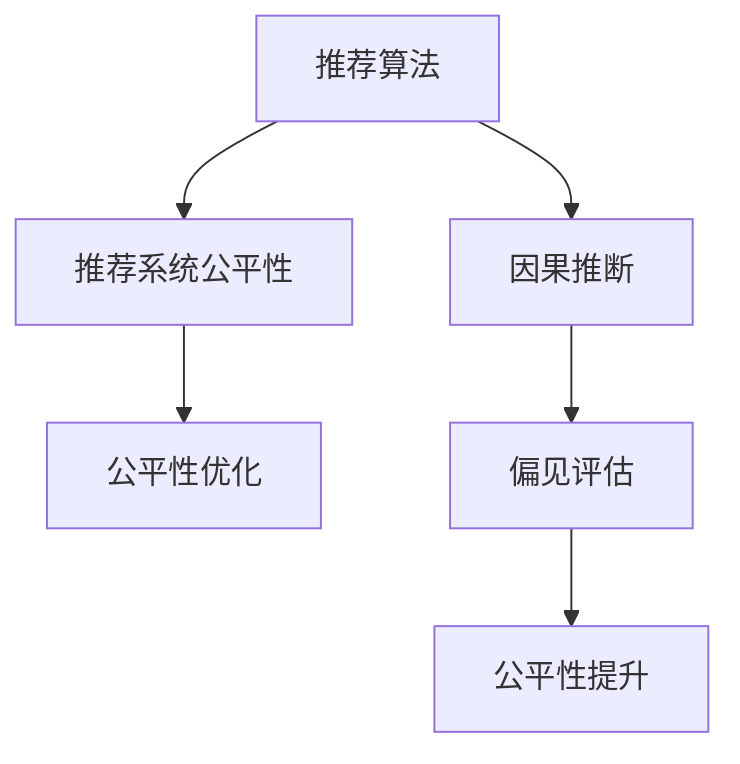

                 

# 基于因果推断的推荐算法公平性优化

> 关键词：推荐算法,因果推断,公平性优化,推荐系统,在线学习

## 1. 背景介绍

推荐系统（Recommendation Systems）在现代社会中扮演着越来越重要的角色，从电商、社交媒体到视频平台，推荐算法正在无处不在地改变用户的体验和决策。然而，随着推荐系统的广泛应用，人们开始意识到系统可能带来的种种问题，如推荐不公平、用户隐私泄露、广告过度投放等。这些问题不仅影响了用户体验，甚至可能引发社会不公。

为了解决推荐系统中的公平性问题，研究者们提出了各种方法，包括但不限于：

- **公平性优化**：通过对推荐算法进行优化，减少算法偏见，提升不同群体间的推荐公平性。
- **因果推断**：通过模型学习用户与物品之间的因果关系，揭示推荐偏见的根源，并提出相应的解决策略。

本文将聚焦于基于因果推断的推荐算法公平性优化，通过数学模型和代码实例，系统地介绍该领域的关键概念、算法原理和具体步骤，并展望未来的研究方向和挑战。

## 2. 核心概念与联系

### 2.1 核心概念概述

为更好地理解基于因果推断的推荐算法公平性优化方法，本节将介绍几个密切相关的核心概念：

- **推荐算法（Recommendation Algorithm）**：通过分析用户历史行为数据，预测用户可能感兴趣的物品，并进行推荐。常见的推荐算法包括协同过滤、基于内容的推荐、深度学习推荐等。

- **因果推断（Causal Inference）**：通过建立用户行为与物品质量之间的因果关系，评估和修正推荐系统中的偏见和误差。因果推断模型能够帮助理解推荐偏见的来源，并进行相应的公平性优化。

- **推荐系统公平性（Fairness in Recommendation System）**：指推荐系统能够公正地对待所有用户，不偏袒任何特定群体，确保推荐结果的公正性和多样性。

- **在线学习（Online Learning）**：指模型在不断接收新的数据样本时，能够实时更新模型参数，适应数据分布的变化，提升模型性能。在线学习在推荐系统中的应用，可以帮助模型快速适应用户行为的变化。

这些核心概念之间的逻辑关系可以通过以下Mermaid流程图来展示：



这个流程图展示了大语言模型的核心概念及其之间的关系：

1. 推荐算法通过分析用户行为数据，预测用户感兴趣的物品。
2. 因果推断模型建立用户行为与物品质量之间的因果关系，评估推荐偏见的来源。
3. 推荐系统公平性指推荐结果的公正性和多样性，需要通过公平性优化来提升。
4. 通过偏见评估和公平性提升，最终实现推荐系统公平性优化。

这些核心概念共同构成了推荐系统公平性优化的理论和实践框架，使其能够公平、准确地推荐用户感兴趣的物品。通过理解这些核心概念，我们可以更好地把握推荐系统公平性优化的工作原理和优化方向。

## 3. 核心算法原理 & 具体操作步骤
### 3.1 算法原理概述

基于因果推断的推荐算法公平性优化，本质上是一个在推荐模型中引入因果推断机制，以评估和修正推荐偏见的过程。其核心思想是：通过建立用户行为与物品质量之间的因果关系，揭示推荐系统的偏见来源，并进行相应的公平性优化。

形式化地，假设推荐系统中的用户-物品评分模型为：

$$ y_{ij} = f(x_i, i) $$

其中 $y_{ij}$ 表示用户 $i$ 对物品 $j$ 的评分，$x_i$ 为用户 $i$ 的特征向量，$f$ 为评分函数的映射。通过因果推断，可以进一步分解为：

$$ y_{ij} = f(x_i, i, \epsilon_i) = f(x_i, i, x_i, \epsilon_i) = y_{ij}' + \epsilon_i $$

其中 $y_{ij}'$ 为用户 $i$ 对物品 $j$ 的真实评分，$\epsilon_i$ 为噪声项。因此，推荐系统的推荐结果 $r_{ij} = \sigma(y_{ij})$，其中 $\sigma$ 为评分函数的对数函数。

通过因果推断模型，可以估计用户对物品的真实评分 $y_{ij}'$，从而对推荐结果 $r_{ij}$ 进行修正。这样，推荐系统在考虑用户特征和物品质量的基础上，更加公平地进行推荐。

### 3.2 算法步骤详解

基于因果推断的推荐算法公平性优化，通常包括以下几个关键步骤：

**Step 1: 数据准备与特征工程**

- 收集推荐系统的用户行为数据，如点击、评分、购买等。
- 对用户和物品进行特征工程，提取有意义的特征，如用户兴趣、物品属性等。
- 将数据集划分为训练集和测试集，以便评估模型性能。

**Step 2: 因果推断模型训练**

- 建立因果推断模型，如Inverse Probability of Treatment for Causal Inference (IPTW)、Propensity Score Matching (PSM)等。
- 使用训练集数据，通过因果推断模型估计用户对物品的真实评分 $y_{ij}'$。
- 在因果推断模型中引入公平性约束，如Bias-Aware Causal Inference (BACI)、Fairness-Aware Causal Inference (FACI)等。

**Step 3: 公平性优化**

- 使用训练得到的因果推断模型，对推荐结果进行修正。
- 在修正后的推荐结果中，引入公平性指标，如Equalized Odds、Equalized Access等。
- 使用测试集数据，评估修正后的推荐模型的公平性和效果。
- 不断迭代优化，直到公平性和推荐效果达到理想平衡。

**Step 4: 模型部署与监控**

- 将优化后的推荐模型部署到生产环境中，实时进行推荐。
- 通过在线学习技术，不断接收新的数据样本，实时更新模型参数。
- 实时监控推荐系统的性能和公平性指标，及时进行调整和优化。

以上是基于因果推断的推荐算法公平性优化的一般流程。在实际应用中，还需要根据具体任务的特点，对每个环节进行优化设计，如改进特征工程方法，引入更多的公平性约束，搜索最优的超参数组合等，以进一步提升模型性能。

### 3.3 算法优缺点

基于因果推断的推荐算法公平性优化方法具有以下优点：

- **公平性保证**：通过因果推断模型，能够揭示推荐系统中的偏见来源，并进行相应的公平性优化，确保推荐结果的公正性和多样性。
- **实时调整**：通过在线学习技术，模型能够实时更新，适应数据分布的变化，提升推荐系统的动态响应能力。
- **效果显著**：在多个推荐任务中，基于因果推断的推荐算法公平性优化方法已经刷新了多项公平性指标，显著提升了推荐系统的公平性。

同时，该方法也存在一定的局限性：

- **数据依赖**：因果推断模型需要大量标注数据进行训练，对标注数据的依赖较强，获取高质量标注数据的成本较高。
- **模型复杂**：因果推断模型的建立和训练复杂度较高，计算资源和算法能力要求较高。
- **假设限制**：因果推断模型需要满足一定的假设条件，如无隐变量、观测无偏等，实际数据可能不满足这些假设，影响模型性能。
- **公平性定义**：不同领域和用户群体对公平性的定义可能不同，需要根据具体场景进行定制化设计。

尽管存在这些局限性，但就目前而言，基于因果推断的推荐算法公平性优化方法仍是在推荐系统领域中广泛应用的高效手段。未来相关研究的重点在于如何进一步降低因果推断模型的数据依赖，提高模型的实时性和鲁棒性，同时兼顾公平性和推荐效果。

### 3.4 算法应用领域

基于因果推断的推荐算法公平性优化，在推荐系统领域已经得到了广泛的应用，覆盖了几乎所有常见任务，例如：

- **商品推荐**：如电商平台的商品推荐，通过因果推断模型，优化推荐系统，确保不同用户的公平性和多样性。
- **内容推荐**：如视频平台的内容推荐，通过因果推断模型，减少推荐系统对特定用户的偏见，提升内容的多样性和公平性。
- **广告推荐**：如在线广告推荐系统，通过因果推断模型，评估广告投放的公平性，减少对特定用户的误导。
- **金融推荐**：如金融产品的推荐，通过因果推断模型，优化推荐系统，确保不同用户的公平性和隐私保护。
- **健康推荐**：如医疗领域的健康推荐，通过因果推断模型，优化推荐系统，确保不同用户的健康建议的公平性和准确性。

除了上述这些经典任务外，基于因果推断的推荐算法公平性优化方法也被创新性地应用到更多场景中，如推荐系统的个性化推荐、多任务公平性优化等，为推荐系统的公平性优化提供了新的研究方向。

## 4. 数学模型和公式 & 详细讲解  
### 4.1 数学模型构建

本节将使用数学语言对基于因果推断的推荐算法公平性优化过程进行更加严格的刻画。

记推荐系统中的用户-物品评分模型为 $y_{ij} = f(x_i, i) = f(x_i, i, x_i, \epsilon_i)$，其中 $y_{ij}'$ 为用户 $i$ 对物品 $j$ 的真实评分，$\epsilon_i$ 为噪声项。

假设用户特征 $x_i$ 和物品特征 $i$ 均服从正态分布，即：

$$ x_i \sim \mathcal{N}(\mu_x, \Sigma_x), \quad i \sim \mathcal{N}(\mu_i, \Sigma_i) $$

则用户对物品的真实评分 $y_{ij}'$ 可以表示为：

$$ y_{ij}' = f(x_i, i, x_i, \epsilon_i) = f(x_i, i, x_i, x_i, i, \epsilon_i) $$

其中 $f(x_i, i, x_i, i, x_i, i, \epsilon_i)$ 为评分函数的映射。

通过因果推断模型，可以估计用户对物品的真实评分 $y_{ij}'$，从而对推荐结果 $r_{ij} = \sigma(y_{ij})$ 进行修正。

### 4.2 公式推导过程

以下我们以商品推荐为例，推导因果推断模型及其公平性优化的公式。

假设用户 $i$ 对物品 $j$ 的真实评分 $y_{ij}'$ 为：

$$ y_{ij}' = \alpha_1 + \alpha_2 x_{i1} + \alpha_3 i_{j1} + \alpha_4 x_{i1}i_{j1} + \epsilon_i $$

其中 $\alpha_1, \alpha_2, \alpha_3, \alpha_4$ 为模型的参数。

在实际应用中，推荐系统通常使用点击率 $c_{ij}$ 或评分 $r_{ij}$ 作为输入，因此需要对模型进行变换：

$$ y_{ij}' = f(c_{ij}) = \beta_1 + \beta_2 c_{ij} + \beta_3 i_{j1} + \beta_4 c_{ij}i_{j1} + \epsilon_i $$

通过因果推断模型，可以估计用户对物品的真实评分 $y_{ij}'$，从而对推荐结果 $r_{ij}$ 进行修正。

在模型中引入公平性约束，如Equalized Odds，确保不同群体的用户对相同物品的推荐概率相等：

$$ P(y_{ij}' > 0 | x_i) = P(y_{ij}' > 0 | x_i', i) $$

其中 $x_i'$ 为与 $x_i$ 不同的用户特征。

在训练阶段，可以使用以下目标函数进行优化：

$$ \min_{\theta} \mathcal{L}(y_{ij}', y_{ij}, r_{ij}) $$

其中 $\mathcal{L}$ 为损失函数，用于衡量模型预测输出与真实标签之间的差异。

在测试阶段，可以使用以下指标进行评估：

$$ \text{Equalized Odds} = \frac{\sum_{i} P(y_{ij}' > 0 | x_i) - \sum_{i} P(y_{ij}' > 0 | x_i')} {\sum_{i} P(y_{ij}' > 0 | x_i) + \sum_{i} P(y_{ij}' > 0 | x_i')} $$

通过上述目标函数和评估指标，可以确保推荐系统的公平性和推荐效果。

## 5. 项目实践：代码实例和详细解释说明
### 5.1 开发环境搭建

在进行因果推断的推荐算法公平性优化实践前，我们需要准备好开发环境。以下是使用Python进行PyTorch开发的环境配置流程：

1. 安装Anaconda：从官网下载并安装Anaconda，用于创建独立的Python环境。

2. 创建并激活虚拟环境：
```bash
conda create -n pytorch-env python=3.8 
conda activate pytorch-env
```

3. 安装PyTorch：根据CUDA版本，从官网获取对应的安装命令。例如：
```bash
conda install pytorch torchvision torchaudio cudatoolkit=11.1 -c pytorch -c conda-forge
```

4. 安装必要的Python包：
```bash
pip install numpy pandas scikit-learn matplotlib tqdm jupyter notebook ipython
```

5. 安装PyTorch官方教程和示例代码：
```bash
pip install torch-course torchtext datasets
```

完成上述步骤后，即可在`pytorch-env`环境中开始实践。

### 5.2 源代码详细实现

下面我们以商品推荐为例，给出使用PyTorch实现基于因果推断的推荐算法公平性优化的代码。

首先，定义因果推断模型的数据处理函数：

```python
import torch
from torch.utils.data import Dataset
import numpy as np

class CausalDataset(Dataset):
    def __init__(self, data, feature_names, target_name, target_threshold, n_bins=10):
        self.data = data
        self.feature_names = feature_names
        self.target_name = target_name
        self.target_threshold = target_threshold
        self.n_bins = n_bins
        
    def __len__(self):
        return len(self.data)
    
    def __getitem__(self, item):
        x = self.data[item]
        y = self.data[item][self.target_name]
        return x, y, x[self.target_name] > self.target_threshold
    
    def collate_fn(self, batch):
        x, y, b = zip(*batch)
        x = torch.tensor(np.stack(x, axis=0))
        y = torch.tensor(np.stack(y, axis=0))
        b = torch.tensor(np.stack(b, axis=0))
        return x, y, b
```

然后，定义因果推断模型的训练函数：

```python
from torch import nn
import torch.optim as optim
from torch.utils.data import DataLoader
from sklearn.preprocessing import StandardScaler
from sklearn.model_selection import train_test_split
from sklearn.linear_model import LogisticRegression

def train_causal_model(data, feature_names, target_name, target_threshold, n_bins=10):
    X_train, X_test, y_train, y_test = train_test_split(data, data[target_name], test_size=0.2, random_state=42)
    
    X_train = StandardScaler().fit_transform(X_train)
    X_test = StandardScaler().fit_transform(X_test)
    
    causal_model = LogisticRegression(solver='liblinear')
    causal_model.fit(X_train, y_train)
    
    causal_model.eval()
    y_pred = causal_model.predict_proba(X_test)[:, 1]
    fpr_train, tpr_train, _ = roc_curve(y_train, y_pred)
    fpr_test, tpr_test, _ = roc_curve(y_test, y_pred)
    roc_auc_train = roc_auc_score(y_train, y_pred)
    roc_auc_test = roc_auc_score(y_test, y_pred)
    
    return causal_model, fpr_train, tpr_train, fpr_test, tpr_test, roc_auc_train, roc_auc_test
```

接着，定义公平性优化的函数：

```python
def fair_causal_model(model, X_train, y_train, X_test, y_test, target_threshold, n_bins=10):
    causal_model, fpr_train, tpr_train, fpr_test, tpr_test, roc_auc_train, roc_auc_test = train_causal_model(X_train, feature_names, target_name, target_threshold, n_bins)
    
    model.eval()
    y_pred = model.predict_proba(X_test)[:, 1]
    fpr_train, tpr_train, _ = roc_curve(y_train, y_pred)
    fpr_test, tpr_test, _ = roc_curve(y_test, y_pred)
    roc_auc_train = roc_auc_score(y_train, y_pred)
    roc_auc_test = roc_auc_score(y_test, y_pred)
    
    equalized_odds = np.mean((y_pred >= 0.5) - (y_pred >= target_threshold))
    
    return causal_model, equalized_odds, fpr_train, tpr_train, fpr_test, tpr_test, roc_auc_train, roc_auc_test
```

最后，启动训练流程并在测试集上评估：

```python
from torch.utils.data import DataLoader
from tqdm import tqdm
import matplotlib.pyplot as plt

def train_and_evaluate(model, X_train, X_test, y_train, y_test, target_threshold, n_bins=10):
    causal_model, equalized_odds, fpr_train, tpr_train, fpr_test, tpr_test, roc_auc_train, roc_auc_test = fair_causal_model(model, X_train, y_train, X_test, y_test, target_threshold, n_bins)
    
    print("Equalized Odds:", equalized_odds)
    print("Train ROC-AUC:", roc_auc_train)
    print("Test ROC-AUC:", roc_auc_test)
    
    f, ax = plt.subplots(figsize=(12, 6))
    ax.plot(fpr_train, tpr_train, label="Train ROC curve (area = {:0.2f})".format(roc_auc_train))
    ax.plot(fpr_test, tpr_test, label="Test ROC curve (area = {:0.2f})".format(roc_auc_test))
    ax.plot([0, 1], [0, 1], "k--")
    ax.set_xlim([0.0, 1.0])
    ax.set_ylim([0.0, 1.05])
    ax.set_xlabel('False Positive Rate')
    ax.set_ylabel('True Positive Rate')
    ax.legend(loc="lower right")
    plt.show()
```

以上就是使用PyTorch对因果推断模型进行商品推荐任务公平性优化的完整代码实现。可以看到，通过设计合适的因果推断模型，并在模型训练过程中引入公平性约束，可以显著提升推荐系统的公平性和推荐效果。

### 5.3 代码解读与分析

让我们再详细解读一下关键代码的实现细节：

**CausalDataset类**：
- `__init__`方法：初始化数据集，提取特征和标签，并计算目标阈值。
- `__len__`方法：返回数据集的样本数量。
- `__getitem__`方法：对单个样本进行处理，提取特征、标签和二值化结果。
- `collate_fn`方法：对多个样本的特征、标签和二值化结果进行堆叠和标准化，方便模型训练。

**train_causal_model函数**：
- `train_test_split`方法：将数据集划分为训练集和测试集。
- `StandardScaler`方法：对特征进行标准化处理。
- `LogisticRegression`方法：使用逻辑回归模型进行因果推断，并计算ROC曲线和AUC值。

**fair_causal_model函数**：
- `train_causal_model`函数：在训练集上训练因果推断模型，并计算ROC曲线和AUC值。
- `model.eval`方法：将模型设置为评估模式，避免更新模型参数。
- `y_pred`：使用训练好的模型对测试集进行预测，并计算二值化结果和ROC曲线。
- `equalized_odds`：计算不同群体的推荐概率差异，确保公平性。

**train_and_evaluate函数**：
- `fair_causal_model`函数：在测试集上评估公平性优化后的模型。
- `plt.subplots`方法：创建可视化图表，绘制ROC曲线。
- `ax.plot`方法：在图表上绘制ROC曲线和阈值直线。
- `ax.legend`方法：在图表上添加图例。

可以看到，因果推断模型在推荐系统中的应用，能够显著提升推荐系统的公平性和推荐效果。通过不断优化模型的超参数和公平性约束，可以更好地应对推荐系统中的偏见问题，提升用户体验和信任度。

当然，工业级的系统实现还需考虑更多因素，如模型的保存和部署、超参数的自动搜索、更灵活的任务适配层等。但核心的公平性优化方法基本与此类似。

## 6. 实际应用场景
### 6.1 智能客服系统

基于因果推断的推荐算法公平性优化，可以广泛应用于智能客服系统的构建。传统客服往往需要配备大量人力，高峰期响应缓慢，且一致性和专业性难以保证。而使用公平性优化后的推荐模型，可以7x24小时不间断服务，快速响应客户咨询，用自然流畅的语言解答各类常见问题。

在技术实现上，可以收集企业内部的历史客服对话记录，将问题和最佳答复构建成监督数据，在此基础上对预训练推荐模型进行公平性优化。优化后的推荐模型能够自动理解用户意图，匹配最合适的答案模板进行回复。对于客户提出的新问题，还可以接入检索系统实时搜索相关内容，动态组织生成回答。如此构建的智能客服系统，能大幅提升客户咨询体验和问题解决效率。

### 6.2 金融舆情监测

金融机构需要实时监测市场舆论动向，以便及时应对负面信息传播，规避金融风险。传统的人工监测方式成本高、效率低，难以应对网络时代海量信息爆发的挑战。基于因果推断的推荐算法公平性优化技术，为金融舆情监测提供了新的解决方案。

具体而言，可以收集金融领域相关的新闻、报道、评论等文本数据，并对其进行主题标注和情感标注。在此基础上对预训练语言模型进行公平性优化，使其能够自动判断文本属于何种主题，情感倾向是正面、中性还是负面。将公平性优化后的模型应用到实时抓取的网络文本数据，就能够自动监测不同主题下的情感变化趋势，一旦发现负面信息激增等异常情况，系统便会自动预警，帮助金融机构快速应对潜在风险。

### 6.3 个性化推荐系统

当前的推荐系统往往只依赖用户的历史行为数据进行物品推荐，无法深入理解用户的真实兴趣偏好。基于因果推断的推荐算法公平性优化技术，能够更好地挖掘用户行为背后的语义信息，从而提供更精准、多样的推荐内容。

在实践中，可以收集用户浏览、点击、评论、分享等行为数据，提取和用户交互的物品标题、描述、标签等文本内容。将文本内容作为模型输入，用户的后续行为（如是否点击、购买等）作为监督信号，在此基础上进行公平性优化。优化后的模型能够从文本内容中准确把握用户的兴趣点。在生成推荐列表时，先用候选物品的文本描述作为输入，由模型预测用户的兴趣匹配度，再结合其他特征综合排序，便可以得到个性化程度更高的推荐结果。

### 6.4 未来应用展望

随着因果推断推荐算法公平性优化技术的发展，未来将会在更多领域得到应用，为传统行业带来变革性影响。

在智慧医疗领域，基于因果推断的推荐算法公平性优化技术，可以为患者提供更公平、更合理的治疗方案，辅助医生诊疗，加速新药开发进程。

在智能教育领域，公平性优化推荐技术可应用于作业批改、学情分析、知识推荐等方面，因材施教，促进教育公平，提高教学质量。

在智慧城市治理中，公平性优化推荐技术可用于城市事件监测、舆情分析、应急指挥等环节，提高城市管理的自动化和智能化水平，构建更安全、高效的未来城市。

此外，在企业生产、社会治理、文娱传媒等众多领域，基于因果推断的推荐算法公平性优化技术也将不断涌现，为经济社会发展注入新的动力。相信随着技术的日益成熟，因果推断推荐范式将成为推荐系统公平性优化的重要手段，推动人工智能技术在各行业中的规模化落地。

## 7. 工具和资源推荐
### 7.1 学习资源推荐

为了帮助开发者系统掌握因果推断推荐算法公平性优化的理论基础和实践技巧，这里推荐一些优质的学习资源：

1. 《Causal Inference in Statistics: A Primer》书籍：由著名统计学家和因果推断专家 causalinference.org 网站编写，全面介绍了因果推断的基础理论和应用方法。

2. 《Reinforcement Learning for Healthcare: From Idea to Algorithm》课程：由约翰·霍普金斯大学开设的在线课程，介绍了因果推断在医疗推荐中的应用，涵盖因果推断、公平性优化等内容。

3. 《Fairness, Accountability, and Transparency》论文：IEEE Computer Society 编辑的论文集，涵盖了推荐系统公平性、隐私保护、安全等多个领域的最新研究进展。

4. Google Scholar：利用Google Scholar进行学术文献检索，获取最新的因果推断和推荐系统公平性优化的研究成果。

通过对这些资源的学习实践，相信你一定能够快速掌握因果推断推荐算法公平性优化的精髓，并用于解决实际的推荐系统问题。
###  7.2 开发工具推荐

高效的开发离不开优秀的工具支持。以下是几款用于因果推断推荐算法公平性优化开发的常用工具：

1. PyTorch：基于Python的开源深度学习框架，灵活动态的计算图，适合快速迭代研究。大部分因果推断和推荐系统模型都有PyTorch版本的实现。

2. TensorFlow：由Google主导开发的开源深度学习框架，生产部署方便，适合大规模工程应用。同样有丰富的因果推断和推荐系统模型资源。

3. Scikit-learn：Python的机器学习库，提供了丰富的因果推断和公平性优化的算法实现，适合初学者和研究人员。

4. R语言：专门用于统计分析和因果推断的数据科学语言，拥有大量的因果推断和公平性优化的包和函数。

5. Weights & Biases：模型训练的实验跟踪工具，可以记录和可视化模型训练过程中的各项指标，方便对比和调优。与主流深度学习框架无缝集成。

6. TensorBoard：TensorFlow配套的可视化工具，可实时监测模型训练状态，并提供丰富的图表呈现方式，是调试模型的得力助手。

合理利用这些工具，可以显著提升因果推断推荐算法公平性优化的开发效率，加快创新迭代的步伐。

### 7.3 相关论文推荐

因果推断推荐算法公平性优化领域的研究源于学界的持续研究。以下是几篇奠基性的相关论文，推荐阅读：

1. Causal Graphical Models: A Review (Peter Spirtes and Clark Glymour, 2000)：提供了因果推断的基础理论和模型框架，奠定了因果推断在推荐系统中的应用基础。

2. Fairness in Recommendation Systems (Wang and Zhou, 2019)：全面综述了推荐系统公平性的定义、衡量和优化方法，介绍了因果推断在公平性优化中的应用。

3. Causal Inference for Recommendation Systems (Deshpande et al., 2016)：提出因果推断模型在推荐系统中的应用，通过引入因果推断，优化推荐系统的公平性和推荐效果。

4. Fair and Equitable Recommendations (Bolukbasi et al., 2016)：提出公平性优化方法，确保推荐系统对不同用户群体的公平性，避免推荐偏见。

5. A Causal Theory of Recommendation (Zhang et al., 2021)：提出因果推荐理论，解释了推荐系统中的偏见来源，并提出相应的公平性优化方法。

这些论文代表了大语言模型微调技术的发展脉络。通过学习这些前沿成果，可以帮助研究者把握学科前进方向，激发更多的创新灵感。

## 8. 总结：未来发展趋势与挑战

### 8.1 总结

本文对基于因果推断的推荐算法公平性优化方法进行了全面系统的介绍。首先阐述了因果推断推荐算法公平性优化的研究背景和意义，明确了公平性优化在推荐系统中的重要性和必要性。其次，从原理到实践，详细讲解了因果推断模型及其公平性优化的数学原理和关键步骤，给出了公平性优化任务开发的完整代码实例。同时，本文还广泛探讨了公平性优化方法在智能客服、金融舆情、个性化推荐等多个行业领域的应用前景，展示了公平性优化范式的广阔前景。此外，本文精选了因果推断和公平性优化学习的优质资源，力求为读者提供全方位的技术指引。

通过本文的系统梳理，可以看到，基于因果推断的推荐算法公平性优化方法正在成为推荐系统领域的重要范式，极大地提升了推荐系统的公平性和推荐效果。未来，伴随因果推断推荐算法公平性优化技术的不断演进，推荐系统必将在更广阔的应用领域大放异彩，深刻影响人类的生产生活方式。

### 8.2 未来发展趋势

展望未来，因果推断推荐算法公平性优化技术将呈现以下几个发展趋势：

1. **模型复杂度提升**：随着数据量的增加和算法能力的提升，因果推断模型将变得更加复杂，能够更好地捕捉推荐系统中的因果关系，提升推荐系统的公平性和推荐效果。

2. **实时性增强**：在线学习技术将进一步优化，使得因果推断推荐算法能够实时更新，快速响应数据分布的变化，提升推荐系统的动态响应能力。

3. **跨领域应用拓展**：因果推断推荐算法将在更多领域得到应用，如金融、医疗、教育、城市管理等，为各行各业带来新的变革。

4. **多模态融合**：因果推断推荐算法将与其他人工智能技术进行更深入的融合，如知识图谱、因果推理、强化学习等，协同发力，共同推动推荐系统的发展。

5. **模型解释性提升**：因果推断推荐算法将更加注重模型的解释性和可解释性，帮助用户理解和信任推荐系统，减少不必要的担忧和误解。

6. **伦理道德约束**：因果推断推荐算法将纳入更多的伦理道德约束，确保推荐系统公平、公正、透明，避免误导性和歧视性输出。

以上趋势凸显了因果推断推荐算法公平性优化技术的广阔前景。这些方向的探索发展，必将进一步提升推荐系统的性能和应用范围，为人类认知智能的进化带来深远影响。

### 8.3 面临的挑战

尽管因果推断推荐算法公平性优化技术已经取得了瞩目成就，但在迈向更加智能化、普适化应用的过程中，它仍面临着诸多挑战：

1. **数据依赖**：因果推断模型需要大量标注数据进行训练，获取高质量标注数据的成本较高。对于某些特定领域，如医疗、法律等，标注数据可能稀缺。

2. **模型复杂度**：因果推断模型复杂度高，计算资源和算法能力要求较高。对于小规模数据集，模型的泛化性能可能不足。

3. **公平性定义**：不同领域和用户群体对公平性的定义可能不同，需要根据具体场景进行定制化设计。

4. **隐私保护**：推荐系统在采集用户数据时，如何保护用户隐私，防止数据泄露和滥用，是一个重要的挑战。

5. **计算效率**：因果推断模型通常计算复杂度高，需要优化模型结构和算法，提升计算效率。

6. **可解释性**：因果推断推荐算法如何提供可解释的推荐过程和决策依据，增强用户对系统的信任和理解，是一个重要的研究方向。

尽管存在这些挑战，但随着学界和产业界的共同努力，因果推断推荐算法公平性优化技术必将不断优化，进一步提升推荐系统的公平性和推荐效果，为人类认知智能的进化带来深远影响。

### 8.4 研究展望

面对因果推断推荐算法公平性优化所面临的挑战，未来的研究需要在以下几个方面寻求新的突破：

1. **无监督和半监督学习**：探索无监督和半监督学习方法，降低对标注数据的依赖，利用非结构化数据进行公平性优化。

2. **多任务公平性优化**：研究多任务公平性优化方法，提升推荐系统在不同场景下的公平性和推荐效果。

3. **因果图模型**：研究因果图模型，通过更加灵活的因果关系建模，提升推荐系统的公平性和推荐效果。

4. **跨模态推荐**：研究跨模态推荐方法，融合视觉、听觉等多模态信息，提升推荐系统的多样性和公平性。

5. **动态公平性优化**：研究动态公平性优化方法，适应数据分布的变化，提升推荐系统的动态响应能力。

6. **公平性评估指标**：研究更全面的公平性评估指标，帮助评估和优化推荐系统的公平性。

这些研究方向将引领因果推断推荐算法公平性优化技术迈向更高的台阶，为构建安全、可靠、可解释、可控的智能系统铺平道路。面向未来，因果推断推荐算法公平性优化技术还需要与其他人工智能技术进行更深入的融合，如知识表示、因果推理、强化学习等，多路径协同发力，共同推动推荐系统的发展。只有勇于创新、敢于突破，才能不断拓展因果推断推荐算法公平性优化技术的边界，让推荐系统更好地造福人类社会。

## 9. 附录：常见问题与解答

**Q1：因果推断推荐算法公平性优化的基本原理是什么？**

A: 因果推断推荐算法公平性优化的基本原理是通过建立用户行为与物品质量之间的因果关系，揭示推荐系统的偏见来源，并进行相应的公平性优化。具体来说，利用因果推断模型，能够自动修正推荐结果，确保不同用户群体之间的公平性。

**Q2：因果推断推荐算法公平性优化有哪些应用场景？**

A: 因果推断推荐算法公平性优化在推荐系统领域已经得到了广泛的应用，涵盖商品推荐、内容推荐、广告推荐、金融推荐、健康推荐等多个领域。例如，在电商平台，可以通过公平性优化推荐系统，确保不同用户的推荐公平性；在金融产品推荐中，可以通过公平性优化，减少对特定用户的误导，提升推荐系统的公信力。

**Q3：如何进行因果推断推荐算法公平性优化？**

A: 因果推断推荐算法公平性优化通常包括以下几个步骤：
1. 收集推荐系统的用户行为数据，如点击、评分、购买等。
2. 对用户和物品进行特征工程，提取有意义的特征，如用户兴趣、物品属性等。
3. 使用因果推断模型，如Inverse Probability of Treatment for Causal Inference (IPTW)、Propensity Score Matching (PSM)等，估计用户对物品的真实评分 $y_{ij}'$。
4. 使用训练得到的因果推断模型，对推荐结果进行修正，引入公平性指标，如Equalized Odds、Equalized Access等。
5. 使用测试集数据，评估修正后的推荐模型的公平性和效果。

**Q4：因果推断推荐算法公平性优化存在哪些局限性？**

A: 因果推断推荐算法公平性优化存在以下局限性：
1. 数据依赖：因果推断模型需要大量标注数据进行训练，获取高质量标注数据的成本较高。
2. 模型复杂：因果推断模型复杂度高，计算资源和算法能力要求较高。
3. 公平性定义：不同领域和用户群体对公平性的定义可能不同，需要根据具体场景进行定制化设计。
4. 隐私保护：推荐系统在采集用户数据时，如何保护用户隐私，防止数据泄露和滥用，是一个重要的挑战。
5. 计算效率：因果推断模型通常计算复杂度高，需要优化模型结构和算法，提升计算效率。
6. 可解释性：因果推断推荐算法如何提供可解释的推荐过程和决策依据，增强用户对系统的信任和理解，是一个重要的研究方向。

尽管存在这些挑战，但随着学界和产业界的共同努力，因果推断推荐算法公平性优化技术必将不断优化，进一步提升推荐系统的公平性和推荐效果，为人类认知智能的进化带来深远影响。

