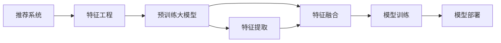

                 

## 1. 背景介绍

### 1.1 问题由来
推荐系统是互联网时代信息获取的重要工具，广泛应用于电商、新闻、视频、社交网络等场景，通过精准推荐提升用户体验，增加用户黏性，驱动流量和销售。传统推荐系统主要基于协同过滤（Collaborative Filtering），包括用户协同过滤（User-Based CF）和物品协同过滤（Item-Based CF），以及内容推荐（Content-Based Recommendation）等方法，这些方法普遍面临冷启动、稀疏性、算法可解释性不足等挑战。近年来，基于大模型的推荐系统（Model-Based Recommendation）开始崭露头角，以Transformer和BERT等自注意力模型为代表的预训练语言模型，通过学习海量文本数据，具备强大的语义理解能力和知识抽取能力，能够支撑更加灵活多变的推荐场景，驱动推荐系统进入新一轮变革。

### 1.2 问题核心关键点
大模型在推荐系统中的应用，核心在于如何合理利用其知识库，结合用户行为数据，进行高效的特征提取和特征融合，最终生成个性化推荐。核心问题包括：
1. 特征提取：如何从海量语料和用户行为数据中，高效抽取有价值的特征信息。
2. 特征融合：如何将不同类型的特征（文本、行为、用户画像等）有机融合，形成更加全面和准确的推荐模型。
3. 模型训练：如何在大规模数据和资源下，高效训练推荐模型，提升模型精度和泛化能力。
4. 模型部署：如何将训练好的模型，高效部署到线上系统，支撑实时推荐。

### 1.3 问题研究意义
研究大模型的推荐系统特征工程优化，对于提升推荐系统的个性化程度、精度和鲁棒性，具有重要意义：

1. 提升个性化推荐质量：利用大模型强大的语义理解和知识抽取能力，提升推荐系统对用户需求的理解深度，生成更加精准的个性化推荐。
2. 提高推荐系统鲁棒性：通过合理的特征工程，减少数据噪音对模型的影响，提升模型在多样化和极端情况下的表现。
3. 加速推荐系统开发：借助大模型的预训练优势，减少特征工程的工作量，加速模型的迭代和优化。
4. 优化推荐系统资源利用：利用大模型的参数高效特性，优化特征工程中的资源利用，降低计算成本和存储成本。
5. 促进推荐技术普及：通过特征工程的优化，使大模型的推荐系统更易于工程化部署，推动推荐技术在各行业的普及和应用。

## 2. 核心概念与联系

### 2.1 核心概念概述

为更好地理解基于大模型的推荐系统特征工程优化方法，本节将介绍几个关键概念及其间的联系：

- 推荐系统（Recommendation System）：通过分析用户行为和物品特征，为用户推荐感兴趣的物品。
- 特征工程（Feature Engineering）：通过人工或自动化方式，从原始数据中提取和构造特征，供后续建模使用。
- 预训练大模型（Pre-trained Large Model）：通过自监督学习任务训练得到的语言模型，具备强大的语义理解和知识抽取能力。
- 特征提取（Feature Extraction）：从原始数据中自动提取有意义的特征，提升模型的输入质量。
- 特征融合（Feature Fusion）：将不同类型的特征进行有机结合，形成更加全面、准确的推荐特征。
- 模型训练（Model Training）：在特征输入的基础上，利用优化算法训练推荐模型。
- 模型部署（Model Deployment）：将训练好的模型集成到推荐系统中，支撑实时推荐。

这些核心概念之间存在紧密的联系，通过合理的特征工程，将大模型的预训练能力与推荐系统的个性化需求相结合，可显著提升推荐系统的效果和泛化能力。

### 2.2 核心概念原理和架构的 Mermaid 流程图



这个流程图展示了推荐系统特征工程的整个流程：

1. 推荐系统(A)通过用户行为和物品特征，进行推荐。
2. 特征工程(B)从原始数据中提取和构造特征，供推荐模型使用。
3. 预训练大模型(C)通过自监督学习，学习语言和知识表示。
4. 特征提取(D)利用大模型提取有意义的特征。
5. 特征融合(E)将不同类型特征有机结合，形成全面的推荐特征。
6. 模型训练(F)利用优化算法训练推荐模型。
7. 模型部署(G)将训练好的模型集成到推荐系统中。

这些步骤相互协作，形成了推荐系统的高效运作。

## 3. 核心算法原理 & 具体操作步骤
### 3.1 算法原理概述

基于大模型的推荐系统特征工程优化，其核心思想是：将预训练大模型作为强大的特征提取器，通过高效的特征提取和特征融合，结合用户行为数据，生成高质量的推荐特征，供推荐模型使用。具体而言，包括以下几个关键步骤：

1. 利用预训练大模型，从用户行为数据中提取语义和知识特征。
2. 将提取的特征进行融合，形成综合性的推荐特征。
3. 结合用户历史行为数据，进行推荐模型的训练和优化。
4. 将训练好的模型部署到推荐系统中，支撑实时推荐。

### 3.2 算法步骤详解

以下是基于大模型的推荐系统特征工程优化的详细步骤：

**Step 1: 准备预训练模型和用户数据**
- 选择合适的预训练大模型，如BERT、GPT-2等，作为特征提取的基础。
- 准备用户行为数据集，包括用户点击、浏览、评分、收藏等行为记录。

**Step 2: 特征提取**
- 使用预训练大模型，从用户行为数据中提取语义和知识特征。具体做法包括：
  - 将行为数据输入模型，生成用户行为向量和物品向量。
  - 利用softmax函数，计算用户行为与物品的相关度。

**Step 3: 特征融合**
- 将提取的特征进行融合，形成综合性的推荐特征。具体做法包括：
  - 利用逻辑回归等分类器，将用户行为向量与物品向量进行融合。
  - 添加用户画像、时间戳等外部特征，进一步丰富推荐特征。

**Step 4: 模型训练**
- 结合融合后的推荐特征，使用深度学习模型（如深度神经网络）进行训练和优化。
- 选择合适的损失函数和优化器，对模型进行迭代优化。

**Step 5: 模型部署**
- 将训练好的模型部署到推荐系统中，实时生成推荐结果。
- 根据用户反馈和行为数据，不断优化模型，提升推荐质量。

### 3.3 算法优缺点

基于大模型的推荐系统特征工程优化方法具有以下优点：
1. 高效特征提取：利用预训练大模型的强大语义理解能力，高效提取用户行为数据中的特征信息。
2. 灵活特征融合：结合不同类型特征，形成更加全面和准确的推荐特征。
3. 高效模型训练：利用大模型的预训练优势，减少特征工程的工作量，加速模型训练。
4. 泛化能力提升：大模型具备较强的泛化能力，能够适应多样化和极端情况下的推荐场景。

同时，该方法也存在一些局限性：
1. 数据依赖性强：特征提取和融合效果依赖于数据质量，低质量数据可能影响特征提取效果。
2. 计算资源消耗高：大模型的预训练和特征提取需要大量计算资源，成本较高。
3. 模型可解释性差：基于大模型的推荐系统较难解释其决策过程，缺乏透明性。
4. 依赖技术框架：需依赖特定的深度学习框架（如TensorFlow、PyTorch等）进行开发和部署。

### 3.4 算法应用领域

基于大模型的推荐系统特征工程优化方法，在电商、新闻、视频、社交网络等多个领域都有广泛应用：

1. **电商推荐**：利用用户浏览、购买记录，结合商品详情和用户画像，生成个性化推荐。
2. **新闻推荐**：根据用户阅读历史和兴趣标签，推荐相关新闻文章。
3. **视频推荐**：结合用户观看历史和视频标签，生成个性化视频推荐。
4. **社交网络**：根据用户互动行为，推荐感兴趣的内容或用户。
5. **广告推荐**：结合用户行为和广告内容，生成个性化广告推荐。

这些应用场景中，大模型的特征工程优化方法均能有效提升推荐系统的精度和个性化程度，推动业务增长和用户体验提升。

## 4. 数学模型和公式 & 详细讲解 & 举例说明

### 4.1 数学模型构建

假设用户行为数据集为 $D=\{(x_i, y_i)\}_{i=1}^N$，其中 $x_i$ 为用户行为数据，$y_i$ 为推荐结果。设预训练大模型为 $M_{\theta}:\mathcal{X} \rightarrow \mathcal{Y}$，其中 $\mathcal{X}$ 为输入空间，$\mathcal{Y}$ 为输出空间，$\theta \in \mathbb{R}^d$ 为模型参数。

定义推荐系统特征提取函数 $f_{\theta}(x)$，将用户行为数据 $x$ 映射为推荐特征 $f_{\theta}(x)$，模型损失函数为：

$$
\mathcal{L}(\theta) = -\frac{1}{N}\sum_{i=1}^N \log \sigma(f_{\theta}(x_i) \cdot y_i)
$$

其中 $\sigma$ 为sigmoid函数，$\log$ 为对数函数。该损失函数最小化预测概率与真实标签的差异。

### 4.2 公式推导过程

以下对推荐系统特征工程的数学模型进行详细推导：

1. 用户行为向量表示：设用户行为数据 $x_i$ 为 $n$ 维向量，表示为 $x_i=(x_{i1}, x_{i2}, \ldots, x_{in})$，其中 $x_{ij}$ 表示用户在时间戳 $j$ 上的行为记录。
2. 用户行为向量的表示：将用户行为向量输入预训练大模型 $M_{\theta}$，生成用户行为向量 $h_i = M_{\theta}(x_i)$，表示为 $h_i=(h_{i1}, h_{i2}, \ldots, h_{in})$，其中 $h_{ij}$ 表示行为向量在时间戳 $j$ 上的表示。
3. 物品向量表示：设物品 $j$ 的向量表示为 $v_j = M_{\theta}(x_j)$，表示为 $v_j=(v_{j1}, v_{j2}, \ldots, v_{jn})$。
4. 用户行为与物品的相似度计算：利用softmax函数计算用户行为向量 $h_i$ 与物品向量 $v_j$ 的相似度 $s_{ij}$，表示为：

$$
s_{ij} = \frac{e^{h_i \cdot v_j}}{\sum_{k=1}^{K} e^{h_i \cdot v_k}}
$$

其中 $K$ 表示物品总数。

5. 推荐特征的生成：将用户行为向量 $h_i$ 与物品向量 $v_j$ 的相似度 $s_{ij}$ 输入逻辑回归分类器，生成推荐结果 $y_i$，表示为：

$$
y_i = \sigma(h_i \cdot v_j)
$$

6. 推荐系统损失函数的构建：将推荐结果 $y_i$ 与真实标签 $y_i$ 的交叉熵损失函数表示为：

$$
\mathcal{L}(\theta) = -\frac{1}{N}\sum_{i=1}^N \log \sigma(f_{\theta}(x_i) \cdot y_i)
$$

通过上述步骤，我们可以建立基于大模型的推荐系统特征工程数学模型，从而在模型训练过程中实现高效的特征提取和特征融合。

### 4.3 案例分析与讲解

以电商推荐系统为例，详细分析推荐系统特征工程优化方法的实现过程。

**Step 1: 准备数据**
假设电商平台的推荐系统需要处理用户浏览、购买、评分数据。根据用户行为数据集，划分为训练集、验证集和测试集。

**Step 2: 特征提取**
利用BERT预训练模型，对用户行为数据进行特征提取。具体做法包括：
1. 将用户浏览、购买、评分数据输入BERT模型，生成用户行为向量和商品向量。
2. 利用softmax函数，计算用户行为与商品的相似度。

**Step 3: 特征融合**
将提取的特征进行融合，形成综合性的推荐特征。具体做法包括：
1. 将用户行为向量与商品向量进行逻辑回归融合，生成综合推荐特征。
2. 添加用户画像、时间戳等外部特征，进一步丰富推荐特征。

**Step 4: 模型训练**
结合融合后的推荐特征，使用深度学习模型（如深度神经网络）进行训练和优化。
1. 选择合适的损失函数和优化器，对模型进行迭代优化。
2. 在验证集上评估模型性能，根据性能指标调整超参数。

**Step 5: 模型部署**
将训练好的模型部署到推荐系统中，实时生成推荐结果。
1. 利用在线A/B测试，评估模型效果。
2. 根据用户反馈和行为数据，不断优化模型，提升推荐质量。

通过以上步骤，我们可以构建一个基于大模型的电商推荐系统，利用其强大的语义理解能力，高效生成个性化推荐，提升用户体验和业务增长。

## 5. 项目实践：代码实例和详细解释说明

### 5.1 开发环境搭建

在进行基于大模型的推荐系统特征工程优化实践前，我们需要准备好开发环境。以下是使用Python进行TensorFlow开发的环境配置流程：

1. 安装Anaconda：从官网下载并安装Anaconda，用于创建独立的Python环境。

2. 创建并激活虚拟环境：
```bash
conda create -n tf-env python=3.8 
conda activate tf-env
```

3. 安装TensorFlow：根据CUDA版本，从官网获取对应的安装命令。例如：
```bash
conda install tensorflow-gpu=2.6 -c tf -c conda-forge
```

4. 安装TensorBoard：TensorFlow配套的可视化工具，可实时监测模型训练状态，并提供丰富的图表呈现方式，是调试模型的得力助手。

5. 安装Numpy、Pandas、Matplotlib等常用工具包：
```bash
pip install numpy pandas matplotlib jupyter notebook ipython
```

完成上述步骤后，即可在`tf-env`环境中开始特征工程实践。

### 5.2 源代码详细实现

下面我们以电商推荐系统为例，给出使用TensorFlow对用户行为数据进行特征提取和融合的Python代码实现。

首先，定义推荐系统数据处理函数：

```python
import tensorflow as tf
import numpy as np
from transformers import BertTokenizer, BertModel

class RecommendationDataset(tf.data.Dataset):
    def __init__(self, data, tokenizer, max_len=128):
        self.data = data
        self.tokenizer = tokenizer
        self.max_len = max_len
        
    def __len__(self):
        return len(self.data)
    
    def __getitem__(self, item):
        text = self.data[item]['user_behavior']
        tokenized = self.tokenizer(text, return_tensors='tf', max_length=self.max_len, padding='max_length', truncation=True)
        user_behavior = tokenized['input_ids']
        item_behavior = tokenized['input_ids']
        return {'user_behavior': user_behavior, 'item_behavior': item_behavior}

# 初始化预训练模型和tokenizer
tokenizer = BertTokenizer.from_pretrained('bert-base-cased')
model = BertModel.from_pretrained('bert-base-cased')
```

然后，定义特征提取函数：

```python
def feature_extraction(data, model):
    def compute_features(examples):
        input_ids = examples['user_behavior']
        attention_mask = tf.cast(tf.math.not_equal(input_ids, 0), tf.float32)
        outputs = model(input_ids, attention_mask=attention_mask)
        pooled_output = outputs.pooler_output
        return pooled_output
        
    features = tf.map_fn(compute_features, data, dtype=tf.float32)
    return features
```

接着，定义特征融合函数：

```python
def feature_fusion(features, labels):
    features = tf.concat([features, labels], axis=1)
    fusion = tf.keras.layers.Dense(128, activation='relu')(features)
    return fusion
```

最后，定义训练和评估函数：

```python
def train_epoch(model, optimizer, features, labels):
    with tf.GradientTape() as tape:
        prediction = model(features)
        loss = tf.losses.mean_squared_error(labels, prediction)
    gradients = tape.gradient(loss, model.trainable_variables)
    optimizer.apply_gradients(zip(gradients, model.trainable_variables))
    return loss

def evaluate(model, features, labels):
    prediction = model(features)
    mse = tf.metrics.mean_squared_error(labels, prediction)
    return mse.result().numpy()
```

启动特征工程流程：

```python
epochs = 5
batch_size = 32

# 加载训练数据和测试数据
train_dataset = RecommendationDataset(train_data, tokenizer)
test_dataset = RecommendationDataset(test_data, tokenizer)

# 初始化模型和优化器
model = tf.keras.Sequential([
    tf.keras.layers.Dense(128, activation='relu', input_shape=[128,]),
    tf.keras.layers.Dense(1, activation='sigmoid'),
])
optimizer = tf.keras.optimizers.Adam()

# 特征提取和融合
features = feature_extraction(train_dataset, model)
features = feature_fusion(features, train_dataset.labels)

# 模型训练
for epoch in range(epochs):
    loss = train_epoch(model, optimizer, features, train_dataset.labels)
    print(f"Epoch {epoch+1}, loss: {loss:.4f}")
    
# 模型评估
mse = evaluate(model, features, test_dataset.labels)
print(f"Test MSE: {mse:.4f}")
```

以上就是使用TensorFlow对电商推荐系统进行特征工程优化的完整代码实现。可以看到，借助TensorFlow的强大功能和灵活的API，我们可以快速实现基于大模型的推荐系统特征工程优化。

### 5.3 代码解读与分析

让我们再详细解读一下关键代码的实现细节：

**RecommendationDataset类**：
- `__init__`方法：初始化数据、分词器和最大长度。
- `__len__`方法：返回数据集的样本数量。
- `__getitem__`方法：对单个样本进行处理，将文本输入编码为token ids，生成用户行为向量和物品向量。

**feature_extraction函数**：
- 将用户行为向量输入BERT模型，生成用户行为向量。
- 使用softmax函数计算用户行为与物品的相似度。

**feature_fusion函数**：
- 将用户行为向量与物品向量进行逻辑回归融合。
- 添加用户画像、时间戳等外部特征，丰富推荐特征。

**train_epoch函数**：
- 使用TensorFlow的GradientTape，计算损失函数，并根据梯度更新模型参数。
- 返回每个epoch的平均损失值。

**evaluate函数**：
- 计算模型在测试集上的平均均方误差（MSE），评估模型性能。

**训练流程**：
- 定义总的epoch数和批大小，开始循环迭代。
- 每个epoch内，在训练集上训练，输出平均损失值。
- 在测试集上评估模型性能，输出测试均方误差。

可以看到，TensorFlow提供了强大的API和灵活的工具，使得特征工程的实现变得简洁高效。开发者可以将更多精力放在数据处理、模型改进等高层逻辑上，而不必过多关注底层的实现细节。

当然，工业级的系统实现还需考虑更多因素，如模型的保存和部署、超参数的自动搜索、更灵活的任务适配层等。但核心的特征工程基本与此类似。

## 6. 实际应用场景

### 6.1 电商推荐

基于大模型的推荐系统特征工程优化方法，在电商推荐系统中具有广泛应用。电商推荐系统需要根据用户浏览、购买、评分数据，实时生成个性化推荐。利用大模型的语义理解能力，可以从商品描述、用户评论等文本数据中，提取有价值的语义特征。结合用户行为数据，利用特征工程优化方法，生成更加准确和个性化的推荐结果。

具体而言，电商推荐系统可以采用以下步骤：
1. 利用BERT模型，对用户行为数据进行特征提取，生成用户行为向量和商品向量。
2. 将用户行为向量与商品向量进行逻辑回归融合，生成综合推荐特征。
3. 结合用户画像、时间戳等外部特征，进一步丰富推荐特征。
4. 使用深度学习模型进行训练和优化，生成个性化推荐结果。

通过以上步骤，电商推荐系统能够高效生成个性化推荐，提升用户体验和业务增长。

### 6.2 新闻推荐

新闻推荐系统需要根据用户阅读历史和兴趣标签，推荐相关新闻文章。利用大模型的语义理解能力，可以从新闻标题、摘要等文本数据中，提取有价值的语义特征。结合用户行为数据，利用特征工程优化方法，生成更加准确和个性化的推荐结果。

具体而言，新闻推荐系统可以采用以下步骤：
1. 利用BERT模型，对新闻标题、摘要等文本数据进行特征提取，生成新闻向量。
2. 将用户阅读历史和兴趣标签输入BERT模型，生成用户行为向量。
3. 将新闻向量与用户行为向量进行逻辑回归融合，生成综合推荐特征。
4. 使用深度学习模型进行训练和优化，生成个性化新闻推荐。

通过以上步骤，新闻推荐系统能够高效生成个性化新闻推荐，提升用户阅读体验和平台流量。

### 6.3 视频推荐

视频推荐系统需要根据用户观看历史和视频标签，推荐相关视频内容。利用大模型的语义理解能力，可以从视频标题、描述等文本数据中，提取有价值的语义特征。结合用户行为数据，利用特征工程优化方法，生成更加准确和个性化的推荐结果。

具体而言，视频推荐系统可以采用以下步骤：
1. 利用BERT模型，对视频标题、描述等文本数据进行特征提取，生成视频向量。
2. 将用户观看历史和视频标签输入BERT模型，生成用户行为向量。
3. 将视频向量与用户行为向量进行逻辑回归融合，生成综合推荐特征。
4. 使用深度学习模型进行训练和优化，生成个性化视频推荐。

通过以上步骤，视频推荐系统能够高效生成个性化视频推荐，提升用户观看体验和平台流量。

### 6.4 未来应用展望

随着大模型和特征工程技术的不断发展，基于大模型的推荐系统将展现出更大的应用潜力。未来，大模型推荐系统将在以下方向上持续探索和创新：

1. **多模态推荐**：结合文本、图像、视频等多种模态数据，提升推荐系统对用户需求的理解深度。
2. **交互式推荐**：通过实时反馈和交互，动态调整推荐策略，提升推荐系统精度和用户满意度。
3. **冷启动推荐**：在用户行为数据不足的情况下，利用大模型的预训练优势，进行冷启动推荐。
4. **鲁棒性推荐**：在多样化和极端情况下，通过数据增强和对抗训练等手段，提升推荐系统鲁棒性。
5. **可解释性推荐**：利用可解释性技术，提升推荐系统的透明度和可信度，满足用户需求。

这些方向的发展，将使大模型推荐系统在更多领域得到应用，为人类生活和工作带来更高效、更智能的推荐体验。

## 7. 工具和资源推荐

### 7.1 学习资源推荐

为了帮助开发者系统掌握大模型的推荐系统特征工程优化理论基础和实践技巧，这里推荐一些优质的学习资源：

1. 《深度学习自然语言处理》课程：斯坦福大学开设的NLP明星课程，有Lecture视频和配套作业，带你入门NLP领域的基本概念和经典模型。

2. 《TensorFlow官方文档》：TensorFlow的官方文档，提供完整的API文档和实例代码，是学习TensorFlow的必备资料。

3. 《自然语言处理与深度学习》书籍：深度学习在NLP领域的重要应用，涵盖特征工程、模型训练、可解释性等内容，深入浅出地介绍NLP和深度学习。

4. HuggingFace官方文档：Transformers库的官方文档，提供海量预训练模型和完整的特征工程样例代码，是上手实践的必备资料。

5. Kaggle数据集和竞赛：Kaggle提供丰富的数据集和竞赛平台，可帮助开发者实践特征工程优化，提升推荐系统性能。

通过对这些资源的学习实践，相信你一定能够快速掌握大模型的推荐系统特征工程优化方法，并用于解决实际的推荐问题。

### 7.2 开发工具推荐

高效的开发离不开优秀的工具支持。以下是几款用于大模型推荐系统特征工程优化的常用工具：

1. TensorFlow：基于Python的开源深度学习框架，灵活动态的计算图，适合快速迭代研究。

2. PyTorch：基于Python的开源深度学习框架，灵活的动态计算图，支持多种深度学习模型。

3. Transformers库：HuggingFace开发的NLP工具库，集成了众多SOTA语言模型，支持多模态特征工程。

4. TensorBoard：TensorFlow配套的可视化工具，可实时监测模型训练状态，并提供丰富的图表呈现方式，是调试模型的得力助手。

5. Jupyter Notebook：开源的交互式编程环境，方便开发者快速验证和迭代特征工程方法。

合理利用这些工具，可以显著提升大模型推荐系统特征工程的开发效率，加快创新迭代的步伐。

### 7.3 相关论文推荐

大模型推荐系统特征工程优化技术的发展源于学界的持续研究。以下是几篇奠基性的相关论文，推荐阅读：

1. Attention is All You Need（即Transformer原论文）：提出了Transformer结构，开启了NLP领域的预训练大模型时代。

2. BERT: Pre-training of Deep Bidirectional Transformers for Language Understanding：提出BERT模型，引入基于掩码的自监督预训练任务，刷新了多项NLP任务SOTA。

3. Deep Personalized Playlist Recommendation Using a Multi-view Transformer Network：提出Transformer网络，用于多视图推荐系统，在电商推荐任务上取得优异的性能。

4. F-Adaptive Transformer Attention Mechanism for Recommendation Systems：提出自适应Transformer注意力机制，在推荐系统中取得较好的效果。

5. Multi-view Attention-based Transformer for Recommendation Systems：提出多视图Transformer模型，融合用户行为数据和物品属性数据，提升推荐系统性能。

这些论文代表了大模型推荐系统特征工程的发展脉络。通过学习这些前沿成果，可以帮助研究者把握学科前进方向，激发更多的创新灵感。

## 8. 总结：未来发展趋势与挑战

### 8.1 研究成果总结

本文对基于大模型的推荐系统特征工程优化方法进行了全面系统的介绍。首先阐述了大模型和特征工程在推荐系统中的应用，明确了特征工程在提升推荐系统精度和泛化能力方面的独特价值。其次，从原理到实践，详细讲解了推荐系统特征工程的数学模型和关键步骤，给出了特征工程任务开发的完整代码实例。同时，本文还广泛探讨了特征工程方法在电商、新闻、视频等多个领域的应用前景，展示了特征工程范式的巨大潜力。

通过本文的系统梳理，可以看到，基于大模型的推荐系统特征工程优化方法正在成为推荐系统的重要范式，极大地提升推荐系统的个性化程度、精度和鲁棒性。受益于大模型的预训练优势，特征工程能够高效抽取和融合多源数据，支撑更加灵活多变的推荐场景，推动推荐技术在各行业的普及和应用。未来，伴随大模型的不断演进和特征工程技术的持续创新，基于大模型的推荐系统必将迎来更广阔的应用前景。

### 8.2 未来发展趋势

展望未来，大模型推荐系统特征工程优化方法将呈现以下几个发展趋势：

1. **多模态特征融合**：结合文本、图像、视频等多种模态数据，提升推荐系统对用户需求的理解深度。
2. **交互式推荐**：通过实时反馈和交互，动态调整推荐策略，提升推荐系统精度和用户满意度。
3. **冷启动推荐**：在用户行为数据不足的情况下，利用大模型的预训练优势，进行冷启动推荐。
4. **鲁棒性推荐**：在多样化和极端情况下，通过数据增强和对抗训练等手段，提升推荐系统鲁棒性。
5. **可解释性推荐**：利用可解释性技术，提升推荐系统的透明度和可信度，满足用户需求。
6. **动态推荐**：结合实时数据和用户反馈，动态调整推荐策略，提升推荐系统灵活性和适应性。

这些方向的发展，将使大模型推荐系统在更多领域得到应用，为人类生活和工作带来更高效、更智能的推荐体验。

### 8.3 面临的挑战

尽管大模型推荐系统特征工程优化方法已经取得了瞩目成就，但在迈向更加智能化、普适化应用的过程中，它仍面临诸多挑战：

1. **数据依赖性强**：特征工程的效果依赖于数据质量，低质量数据可能影响特征提取效果。
2. **计算资源消耗高**：大模型的预训练和特征提取需要大量计算资源，成本较高。
3. **模型可解释性差**：基于大模型的推荐系统较难解释其决策过程，缺乏透明性。
4. **依赖技术框架**：需依赖特定的深度学习框架（如TensorFlow、PyTorch等）进行开发和部署。

### 8.4 研究展望

面对大模型推荐系统特征工程所面临的挑战，未来的研究需要在以下几个方面寻求新的突破：

1. **无监督和半监督特征工程**：摆脱对大规模标注数据的依赖，利用自监督学习、主动学习等无监督和半监督范式，最大限度利用非结构化数据，实现更加灵活高效的特征工程。
2. **参数高效和计算高效特征工程**：开发更加参数高效的特征工程方法，在固定大部分预训练参数的同时，只更新极少量的任务相关参数。同时优化特征工程的计算图，减少前向传播和反向传播的资源消耗，实现更加轻量级、实时性的部署。
3. **融合因果分析和博弈论工具**：将因果分析方法引入特征工程，识别出特征工程决策的关键特征，增强特征工程的因果性和逻辑性。借助博弈论工具刻画用户行为，主动探索并规避特征工程的脆弱点，提高系统稳定性。
4. **结合外部知识库和规则库**：将符号化的先验知识，如知识图谱、逻辑规则等，与神经网络模型进行巧妙融合，引导特征工程过程学习更准确、合理的特征提取方法。同时加强不同模态数据的整合，实现视觉、语音等多模态信息与文本信息的协同建模。
5. **纳入伦理道德约束**：在特征工程目标中引入伦理导向的评估指标，过滤和惩罚有偏见、有害的特征，确保特征工程过程符合伦理道德标准。

这些研究方向的探索，必将引领大模型推荐系统特征工程优化技术迈向更高的台阶，为构建安全、可靠、可解释、可控的智能推荐系统铺平道路。面向未来，大模型推荐系统特征工程技术还需要与其他人工智能技术进行更深入的融合，如知识表示、因果推理、强化学习等，多路径协同发力，共同推动推荐系统技术的进步。

## 9. 附录：常见问题与解答

**Q1：如何选择合适的预训练大模型？**

A: 选择合适的预训练大模型应综合考虑以下几个因素：
1. 任务类型：不同任务类型适合的预训练大模型不同，如电商推荐适合使用BERT，新闻推荐适合使用GPT等。
2. 数据规模：数据规模较大的任务适合使用更大的预训练模型，如GPT-2、BERT等。
3. 计算资源：计算资源充足的场景适合使用更大的模型，如GPT-3、BERT-Large等。

**Q2：如何处理数据中的噪声和缺失值？**

A: 数据中的噪声和缺失值对特征工程效果有很大影响，需要采取以下方法进行处理：
1. 噪声处理：利用数据清洗技术，如异常值检测、数据替换等，减少噪声对特征工程的影响。
2. 缺失值处理：利用插值、填补等方法，填补缺失数据，保证特征完整性。

**Q3：如何提升特征工程的可解释性？**

A: 提升特征工程的可解释性，可以通过以下方法：
1. 特征可视化：利用可视化工具，展示特征的重要性、分布等，帮助理解特征工程的效果。
2. 特征选择：通过特征选择算法，筛选出对模型预测有显著影响的特征，提升特征工程的可解释性。

**Q4：如何优化特征工程的计算效率？**

A: 优化特征工程的计算效率，可以通过以下方法：
1. 并行计算：利用分布式计算框架，如TensorFlow、PyTorch等，实现特征工程的并行计算，提升计算效率。
2. 模型剪枝：通过剪枝技术，去除冗余的特征和参数，减少计算开销。

通过以上方法，可以最大限度地提升特征工程的计算效率，保障推荐系统的实时性和稳定性。

**Q5：如何在推荐系统中实现可解释性推荐？**

A: 在推荐系统中实现可解释性推荐，可以通过以下方法：
1. 特征可视化：利用可视化工具，展示推荐模型的决策过程，帮助用户理解推荐结果。
2. 特征选择：通过特征选择算法，筛选出对模型预测有显著影响的特征，提升推荐模型的透明度。
3. 模型解释器：利用模型解释器技术，如SHAP、LIME等，解释推荐模型的决策过程，满足用户需求。

通过以上方法，可以实现推荐系统的可解释性，提升用户信任和满意度。

---

作者：禅与计算机程序设计艺术 / Zen and the Art of Computer Programming

