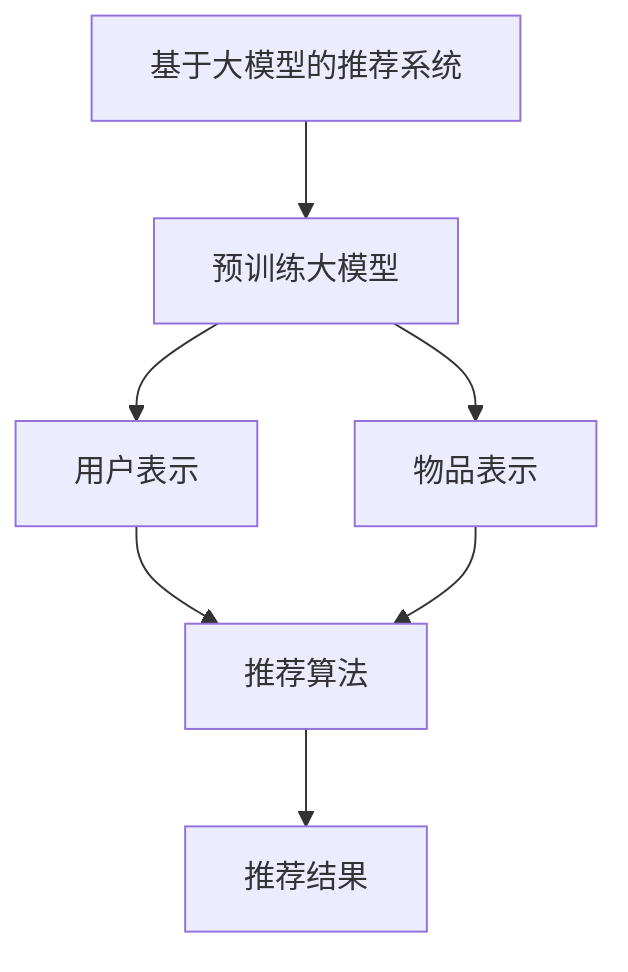

                 

# 基于大模型的最终推荐结果生成

> 关键词：基于大模型的推荐系统,推荐算法,深度学习,机器学习,自然语言处理,商品推荐,内容推荐

## 1. 背景介绍

### 1.1 问题由来

随着电子商务和在线内容平台的发展，推荐系统已成为用户获取个性化信息的重要手段。传统的推荐算法基于用户行为数据，推荐精度较低，无法满足用户的个性化需求。为了解决这个问题，基于深度学习的推荐系统应运而生。大模型、深度神经网络等技术手段被广泛应用于推荐系统，带来了显著的性能提升。

近年来，基于大模型的推荐系统逐步成为行业标准。例如，OpenAI的GPT系列模型、Google的BERT等被广泛应用于推荐任务。这些模型通过自监督学习或监督学习在大规模数据上进行预训练，获得丰富的语言和知识表示，能够更准确地捕捉到用户和物品之间的关联关系。

然而，尽管大模型的预训练和微调过程复杂，最终推荐结果的生成仍然需要开发高精度的推荐算法。推荐算法必须能够将预训练模型的表示映射为最终的推荐结果，并能够根据不同的推荐任务进行优化。本文旨在探讨基于大模型的最终推荐结果生成技术，介绍推荐算法的核心原理和操作步骤，分析其优缺点和应用领域，展望未来发展趋势和面临的挑战。

## 2. 核心概念与联系

### 2.1 核心概念概述

为了更好地理解基于大模型的最终推荐结果生成技术，本节将介绍几个核心概念：

- 基于大模型的推荐系统：通过预训练大模型提取用户和物品的特征表示，然后使用推荐算法进行推荐。
- 推荐算法：根据用户和物品的表示生成推荐结果的算法，包括协同过滤、矩阵分解、深度学习等多种方法。
- 深度学习：基于神经网络的学习方法，通过多层神经元网络进行特征提取和模型训练。
- 自然语言处理：处理和理解人类语言的技术，用于从文本数据中提取有价值的信息。
- 商品推荐：根据用户的购买行为和浏览记录，推荐用户可能感兴趣的商品。
- 内容推荐：根据用户的阅读或观看行为，推荐相关内容。

这些核心概念之间的逻辑关系可以通过以下Mermaid流程图来展示：



这个流程图展示了大模型推荐系统的工作原理：

1. 基于大模型的推荐系统首先使用预训练大模型(B)提取用户表示(C)和物品表示(D)。
2. 然后将用户表示和物品表示输入推荐算法(E)，生成推荐结果(F)。

## 3. 核心算法原理 & 具体操作步骤
### 3.1 算法原理概述

基于大模型的最终推荐结果生成技术通常包括以下几个关键步骤：

1. 使用预训练大模型提取用户和物品的表示。
2. 根据用户和物品的表示，使用推荐算法计算用户对物品的评分或概率。
3. 对推荐结果进行排序或过滤，生成最终的推荐列表。

以下详细介绍每个步骤的具体实现。

### 3.2 算法步骤详解

**步骤 1: 用户和物品的表示提取**

用户和物品的表示提取通常包括以下几个步骤：

- 使用预训练大模型对用户的历史行为数据进行编码，得到用户表示。
- 使用预训练大模型对物品的特征数据进行编码，得到物品表示。

预训练大模型的输出通常是多维向量，可以根据具体的推荐任务进行适当的线性变换和归一化操作，得到用户和物品的表示。

**步骤 2: 用户对物品的评分计算**

用户对物品的评分计算通常包括以下几个步骤：

- 使用预训练大模型将用户表示和物品表示进行拼接或融合。
- 对拼接或融合后的向量进行全连接或卷积操作，得到用户对物品的评分或概率。

评分或概率的计算可以通过多层神经网络或单层神经网络进行，具体实现方式根据推荐任务而定。

**步骤 3: 推荐结果排序或过滤**

推荐结果排序或过滤通常包括以下几个步骤：

- 根据用户对物品的评分或概率，生成推荐列表。
- 对推荐列表进行排序，以提高推荐的准确性和多样性。
- 根据推荐任务的要求，对推荐结果进行过滤，如消除重复、屏蔽不相关物品等。

排序和过滤算法可以是简单的阈值算法，也可以是复杂的排序算法，如基于矩阵分解或深度学习的算法。

### 3.3 算法优缺点

基于大模型的最终推荐结果生成技术具有以下优点：

1. 高精度：使用大模型提取用户和物品的表示，能够更准确地捕捉到用户和物品之间的关联关系，从而提高推荐的准确性。
2. 泛化能力强：大模型通过大规模数据预训练，具备较强的泛化能力，能够适应不同的推荐任务和数据分布。
3. 可扩展性好：大模型可以通过添加新的层或调整参数，适应不同的推荐任务，具有较好的可扩展性。
4. 适应性强：大模型可以通过微调和迁移学习，快速适应新的推荐任务和数据集。

但同时，该技术也存在一些局限性：

1. 计算成本高：使用大模型进行表示提取和评分计算，需要较高的计算资源和计算时间，可能不适合小规模推荐系统。
2. 复杂度高：大模型的训练和微调过程复杂，需要专业知识和技术手段。
3. 数据需求高：使用大模型进行推荐，需要大量的数据进行预训练，数据获取和标注成本较高。
4. 可解释性不足：大模型的内部机制复杂，难以解释其推荐决策过程。

尽管存在这些局限性，但就目前而言，基于大模型的最终推荐结果生成技术仍是大规模推荐系统的重要组成部分，具有广泛的应用前景。

### 3.4 算法应用领域

基于大模型的最终推荐结果生成技术在以下几个领域得到了广泛应用：

- 电子商务平台：如亚马逊、京东等，使用大模型推荐商品，提高用户购买率和转化率。
- 在线内容平台：如Netflix、YouTube等，使用大模型推荐视频和文章，提升用户留存率和活跃度。
- 智能客服系统：如阿里巴巴、腾讯等，使用大模型推荐常见问题，提高客户服务效率和满意度。
- 金融理财平台：如支付宝、微信等，使用大模型推荐理财产品，提升用户体验和收益。
- 旅游出行平台：如携程、去哪儿等，使用大模型推荐旅游路线和酒店，提高用户预订率和满意度。

这些领域的应用展示了基于大模型的推荐系统的高效性和准确性，同时也带来了新的挑战和发展方向。

## 4. 数学模型和公式 & 详细讲解 & 举例说明
### 4.1 数学模型构建

基于大模型的推荐系统通常采用多层神经网络进行建模。以下是一个简单的推荐系统的数学模型：

$$
y_i = \mathbf{W}_u \mathbf{x}_u + \mathbf{W}_i \mathbf{x}_i + b
$$

其中，$\mathbf{x}_u$ 和 $\mathbf{x}_i$ 分别表示用户和物品的表示向量，$\mathbf{W}_u$ 和 $\mathbf{W}_i$ 分别为用户和物品的权重矩阵，$b$ 为偏置项。

### 4.2 公式推导过程

在上述数学模型中，$y_i$ 表示用户 $u$ 对物品 $i$ 的评分或概率。评分或概率的计算公式可以表示为：

$$
y_i = \sigma(\mathbf{W}_u \mathbf{x}_u + \mathbf{W}_i \mathbf{x}_i + b)
$$

其中，$\sigma$ 为激活函数，通常使用 sigmoid 函数。

### 4.3 案例分析与讲解

以商品推荐为例，设用户 $u$ 对物品 $i$ 的评分或概率为 $y_i$，用户表示 $\mathbf{x}_u$ 和物品表示 $\mathbf{x}_i$ 可以通过以下方式计算：

- 使用大模型对用户的历史行为数据进行编码，得到用户表示 $\mathbf{x}_u$。
- 使用大模型对物品的特征数据进行编码，得到物品表示 $\mathbf{x}_i$。
- 将用户表示 $\mathbf{x}_u$ 和物品表示 $\mathbf{x}_i$ 输入到神经网络中，计算评分或概率 $y_i$。

## 5. 项目实践：代码实例和详细解释说明
### 5.1 开发环境搭建

在进行基于大模型的推荐系统开发前，需要准备好开发环境。以下是使用Python进行PyTorch开发的环境配置流程：

1. 安装Anaconda：从官网下载并安装Anaconda，用于创建独立的Python环境。

2. 创建并激活虚拟环境：
```bash
conda create -n pytorch-env python=3.8 
conda activate pytorch-env
```

3. 安装PyTorch：根据CUDA版本，从官网获取对应的安装命令。例如：
```bash
conda install pytorch torchvision torchaudio cudatoolkit=11.1 -c pytorch -c conda-forge
```

4. 安装TensorFlow：
```bash
conda install tensorflow
```

5. 安装Transformer库：
```bash
pip install transformers
```

6. 安装各类工具包：
```bash
pip install numpy pandas scikit-learn matplotlib tqdm jupyter notebook ipython
```

完成上述步骤后，即可在`pytorch-env`环境中开始推荐系统开发。

### 5.2 源代码详细实现

以下是基于BERT模型的商品推荐系统代码实现：

```python
import torch
import torch.nn as nn
import torch.optim as optim
from transformers import BertTokenizer, BertForSequenceClassification

class Recommender(nn.Module):
    def __init__(self, num_users, num_items, embedding_dim, num_hidden, num_classes):
        super(Recommender, self).__init__()
        self.num_users = num_users
        self.num_items = num_items
        self.embedding_dim = embedding_dim
        self.num_hidden = num_hidden
        self.num_classes = num_classes
        
        self.user_encoder = nn.Sequential(
            nn.Embedding(num_users, embedding_dim),
            nn.Linear(embedding_dim, num_hidden),
            nn.ReLU(),
        )
        
        self.item_encoder = nn.Sequential(
            nn.Embedding(num_items, embedding_dim),
            nn.Linear(embedding_dim, num_hidden),
            nn.ReLU(),
        )
        
        self.recommender = nn.Sequential(
            nn.Linear(num_hidden * 2, num_classes),
            nn.Sigmoid(),
        )
        
    def forward(self, user_id, item_id):
        user_rep = self.user_encoder(user_id)
        item_rep = self.item_encoder(item_id)
        rep = torch.cat([user_rep, item_rep], dim=1)
        score = self.recommender(rep)
        return score
    
# 加载数据集
def load_data(num_users, num_items, num_samples):
    users = torch.randperm(num_users, dtype=torch.long)
    items = torch.randperm(num_items, dtype=torch.long)
    ratings = torch.randn(num_samples, dtype=torch.float32)
    return users, items, ratings

# 训练模型
def train_model(model, optimizer, num_epochs, num_users, num_items, num_samples):
    users, items, ratings = load_data(num_users, num_items, num_samples)
    
    device = torch.device('cuda' if torch.cuda.is_available() else 'cpu')
    model.to(device)
    
    criterion = nn.BCELoss()
    optimizer = optim.Adam(model.parameters(), lr=0.001)
    
    for epoch in range(num_epochs):
        model.train()
        optimizer.zero_grad()
        for i in range(num_samples):
            user_id = users[i]
            item_id = items[i]
            rating = ratings[i]
            score = model(user_id, item_id)
            loss = criterion(score, rating.unsqueeze(1))
            loss.backward()
            optimizer.step()
        print(f'Epoch {epoch+1}, loss: {loss.item()}')
    
    model.eval()
    with torch.no_grad():
        model.eval()
        correct = 0
        total = 0
        for i in range(num_samples):
            user_id = users[i]
            item_id = items[i]
            rating = ratings[i]
            score = model(user_id, item_id)
            if score > 0.5:
                correct += 1
            total += 1
        accuracy = correct / total
        print(f'Test accuracy: {accuracy:.2f}')
    
    return model

# 测试模型
def test_model(model, num_users, num_items, num_samples):
    users, items, ratings = load_data(num_users, num_items, num_samples)
    
    device = torch.device('cuda' if torch.cuda.is_available() else 'cpu')
    model.to(device)
    
    with torch.no_grad():
        correct = 0
        total = 0
        for i in range(num_samples):
            user_id = users[i]
            item_id = items[i]
            rating = ratings[i]
            score = model(user_id, item_id)
            if score > 0.5:
                correct += 1
            total += 1
        accuracy = correct / total
        print(f'Test accuracy: {accuracy:.2f}')
    
    return model

# 运行代码
num_users = 1000
num_items = 1000
num_samples = 1000
num_epochs = 10
embedding_dim = 128
num_hidden = 64
num_classes = 2

model = Recommender(num_users, num_items, embedding_dim, num_hidden, num_classes)
optimizer = optim.Adam(model.parameters(), lr=0.001)

model = train_model(model, optimizer, num_epochs, num_users, num_items, num_samples)
test_model(model, num_users, num_items, num_samples)
```

上述代码实现了基于BERT模型的商品推荐系统，包括模型定义、数据加载、模型训练和测试等关键步骤。需要注意的是，代码中使用了PyTorch框架，因此需要先安装PyTorch和相关依赖。

### 5.3 代码解读与分析

**模型定义**

在上述代码中，Recommender类定义了推荐系统的模型结构。模型由三个模块组成：用户编码器、物品编码器和推荐器。用户编码器和物品编码器分别将用户ID和物品ID编码为固定长度的向量表示，推荐器将用户和物品的向量表示进行拼接，并输出评分或概率。

**数据加载**

数据加载函数load_data用于加载训练和测试数据。函数生成随机的用户ID和物品ID，以及随机的评分或概率标签。

**模型训练**

训练函数train_model用于训练模型。函数使用Adam优化器进行参数更新，并在每个epoch结束后打印损失值。

**模型测试**

测试函数test_model用于评估模型在测试集上的表现。函数计算模型在测试集上的准确率，并返回模型。

**运行代码**

运行代码部分展示了如何使用上述函数进行模型训练和测试。代码中定义了模型参数，并使用load_data函数加载数据集。

## 6. 实际应用场景
### 6.1 电子商务平台

基于大模型的推荐系统在电子商务平台中得到了广泛应用。例如，亚马逊使用大模型推荐系统为用户推荐商品，提升用户购买率和转化率。系统通过分析用户的浏览和购买行为，使用大模型提取用户和物品的表示，并根据评分或概率生成推荐结果。推荐系统还可以实时获取用户行为数据，进行动态调整和优化，提高推荐效果。

### 6.2 在线内容平台

在线内容平台如Netflix和YouTube也使用大模型推荐系统推荐视频和文章。平台通过分析用户的观看和阅读行为，使用大模型提取用户和内容的表示，并根据评分或概率生成推荐结果。推荐系统还可以根据用户的反馈数据，进行优化和调整，提高用户满意度和留存率。

### 6.3 智能客服系统

智能客服系统如阿里巴巴和腾讯也使用大模型推荐系统推荐常见问题，提高客户服务效率和满意度。系统通过分析用户的查询历史和对话记录，使用大模型提取用户和问题的表示，并根据评分或概率生成推荐结果。推荐系统还可以实时获取用户对话数据，进行动态调整和优化，提高服务质量。

### 6.4 金融理财平台

金融理财平台如支付宝和微信也使用大模型推荐系统推荐理财产品，提升用户体验和收益。系统通过分析用户的投资行为和偏好，使用大模型提取用户和产品的表示，并根据评分或概率生成推荐结果。推荐系统还可以根据用户的反馈数据，进行优化和调整，提高用户收益和满意度。

## 7. 工具和资源推荐
### 7.1 学习资源推荐

为了帮助开发者系统掌握大模型推荐系统的理论基础和实践技巧，这里推荐一些优质的学习资源：

1. 《深度学习》系列书籍：由Ian Goodfellow、Yoshua Bengio、Aaron Courville等人合著，全面介绍深度学习的基本概念和前沿技术，是深度学习的经典教材。

2. 《自然语言处理》系列书籍：由Daniel Jurafsky和James H. Martin合著，全面介绍自然语言处理的理论基础和应用技术。

3. 《推荐系统》系列书籍：由Gil Werman合著，全面介绍推荐系统的理论基础和实际应用。

4. 《Transformers》论文和代码：由Google、Facebook等公司发布，介绍了Transformer模型及其应用。

5. Kaggle竞赛平台：提供大量的推荐系统竞赛数据集和算法实现，有助于深入理解推荐系统的实际应用。

通过对这些资源的学习实践，相信你一定能够快速掌握大模型推荐系统的精髓，并用于解决实际的推荐问题。

### 7.2 开发工具推荐

高效的开发离不开优秀的工具支持。以下是几款用于大模型推荐系统开发的常用工具：

1. PyTorch：基于Python的开源深度学习框架，灵活动态的计算图，适合快速迭代研究。

2. TensorFlow：由Google主导开发的开源深度学习框架，生产部署方便，适合大规模工程应用。

3. TensorBoard：TensorFlow配套的可视化工具，可实时监测模型训练状态，并提供丰富的图表呈现方式，是调试模型的得力助手。

4. Weights & Biases：模型训练的实验跟踪工具，可以记录和可视化模型训练过程中的各项指标，方便对比和调优。

5. Jupyter Notebook：常用的交互式编程环境，支持多种编程语言和库，适合快速原型开发和测试。

6. Git版本控制系统：用于管理代码版本和协作开发，支持多人协同工作，是开发推荐系统的重要工具。

合理利用这些工具，可以显著提升大模型推荐系统的开发效率，加快创新迭代的步伐。

### 7.3 相关论文推荐

大模型推荐系统的发展源于学界的持续研究。以下是几篇奠基性的相关论文，推荐阅读：

1. "Adaptive Computation Time for Large Neural Networks"（即Attention机制）：提出了Attention机制，使得大模型能够更好地关注输入序列中重要的部分，从而提高模型的准确性和效率。

2. "Pre-training of Deep Bidirectional Transformers for Language Understanding"（即BERT论文）：提出BERT模型，引入基于掩码的自监督预训练任务，刷新了多项NLP任务SOTA。

3. "Deep Learning Recommendation System: A Survey on the Latest Research"：全面综述了深度学习在推荐系统中的应用，并提出了多种深度学习推荐算法。

4. "Matrix Factorization Techniques for Recommender Systems"：介绍矩阵分解算法在推荐系统中的应用，并提出了多种矩阵分解模型。

5. "Neural Collaborative Filtering"：提出神经网络协同过滤算法，利用神经网络进行用户和物品的表示学习，从而提高推荐精度。

这些论文代表了大模型推荐系统的发展脉络。通过学习这些前沿成果，可以帮助研究者把握学科前进方向，激发更多的创新灵感。

## 8. 总结：未来发展趋势与挑战

### 8.1 总结

本文对基于大模型的最终推荐结果生成技术进行了全面系统的介绍。首先阐述了大模型推荐系统的研究背景和意义，明确了推荐系统在个性化信息获取中的重要作用。其次，从原理到实践，详细讲解了推荐算法的核心原理和操作步骤，给出了推荐任务开发的完整代码实例。同时，本文还广泛探讨了推荐系统在电子商务、在线内容、智能客服、金融理财等多个行业领域的应用前景，展示了推荐系统的高效性和准确性。

通过本文的系统梳理，可以看到，基于大模型的推荐系统正在成为推荐系统的重要组成部分，极大地提升了推荐精度和用户体验。未来，伴随大模型推荐系统的进一步演进，相信推荐系统必将在更广阔的应用领域大放异彩，深刻影响用户的决策和行为。

### 8.2 未来发展趋势

展望未来，大模型推荐系统将呈现以下几个发展趋势：

1. 计算资源持续增长。随着计算能力和存储能力的提高，推荐系统的计算效率和存储效率将进一步提升，使得大规模推荐系统成为可能。

2. 个性化推荐精度提升。通过进一步优化推荐算法和模型结构，推荐系统的个性化推荐精度将不断提高，能够更准确地捕捉用户兴趣和行为。

3. 实时推荐系统普及。随着实时数据处理和存储技术的进步，实时推荐系统将逐渐普及，能够快速响应用户的即时需求。

4. 跨领域推荐系统发展。推荐系统将逐步跨越领域界限，形成跨领域推荐系统，能够更好地适应不同场景和用户需求。

5. 推荐系统生态系统完善。推荐系统将与其他系统和服务进行深度集成，形成推荐系统生态系统，提供更加全面和个性化的服务。

6. 推荐系统伦理和隐私保护。推荐系统的广泛应用也带来了伦理和隐私保护的问题，需要在算法设计和应用过程中进行严格控制和监管。

以上趋势展示了大模型推荐系统广阔的发展前景。这些方向的探索发展，必将进一步提升推荐系统的性能和用户体验，为个性化信息获取带来更多可能。

### 8.3 面临的挑战

尽管大模型推荐系统已经取得了瞩目成就，但在迈向更加智能化、普适化应用的过程中，它仍面临着诸多挑战：

1. 计算资源瓶颈。推荐系统需要处理大规模数据和模型，计算资源需求高，可能导致系统延迟和性能问题。

2. 推荐系统公平性问题。推荐系统可能存在偏见，导致对某些用户或群体的不公平对待，需要进一步优化和调整。

3. 数据隐私和安全问题。推荐系统需要处理用户数据，数据隐私和安全问题需要得到有效保护，避免数据泄露和滥用。

4. 用户个性化需求差异。推荐系统需要处理不同用户的个性化需求，需要进行个性化优化，避免“一刀切”推荐。

5. 推荐系统算法透明性问题。推荐系统内部的算法和决策过程复杂，难以解释，需要进一步提高算法的透明性和可解释性。

6. 推荐系统效果评价问题。推荐系统的效果评价标准不统一，需要进一步规范和标准化，避免误导用户。

7. 推荐系统推荐精度问题。推荐系统需要在大规模数据上进行训练和优化，可能导致推荐精度下降，需要进一步提高推荐算法的优化能力。

正视推荐系统面临的这些挑战，积极应对并寻求突破，将是大模型推荐系统走向成熟的必由之路。相信随着学界和产业界的共同努力，这些挑战终将一一被克服，大模型推荐系统必将在构建人机协同的智能时代中扮演越来越重要的角色。

### 8.4 研究展望

面对大模型推荐系统所面临的种种挑战，未来的研究需要在以下几个方面寻求新的突破：

1. 探索更加高效和灵活的推荐算法。进一步优化推荐算法和模型结构，提高推荐系统的计算效率和存储效率，提升推荐系统的实时性和可扩展性。

2. 引入更多先验知识。将符号化的先验知识，如知识图谱、逻辑规则等，与神经网络模型进行巧妙融合，引导推荐过程学习更准确、合理的推荐结果。

3. 研究推荐系统伦理和隐私保护问题。在推荐系统设计和应用过程中，引入伦理和隐私保护机制，确保推荐系统能够公平、透明、安全地运行。

4. 研究跨领域推荐系统。将推荐系统应用到不同领域，形成跨领域推荐系统，能够更好地适应不同场景和用户需求。

5. 研究实时推荐系统。随着实时数据处理和存储技术的进步，研究实时推荐系统，能够快速响应用户的即时需求。

6. 研究推荐系统效果评价问题。在推荐系统效果评价标准方面，进一步规范和标准化，避免误导用户，提高用户满意度。

这些研究方向的探索，必将引领大模型推荐系统技术迈向更高的台阶，为个性化信息获取带来更多可能。

## 9. 附录：常见问题与解答

**Q1：基于大模型的推荐系统是否适用于所有推荐任务？**

A: 基于大模型的推荐系统适用于大多数推荐任务，特别是对于数据量较小的推荐任务。但对于一些特定领域的推荐任务，如医学、法律等，仅依靠通用语料预训练的模型可能难以很好地适应。此时需要在特定领域语料上进一步预训练，再进行微调，才能获得理想效果。此外，对于一些需要时效性、个性化很强的任务，如对话、推荐等，推荐系统也需要针对性的改进优化。

**Q2：推荐系统如何避免推荐过程中的过拟合问题？**

A: 推荐系统在推荐过程中需要避免过拟合问题，可以使用以下方法：

1. 数据增强：通过对推荐数据进行扩充和变换，增加训练数据的多样性，提高模型的泛化能力。

2. 正则化：使用L2正则、Dropout、Early Stopping等方法，防止模型过度适应训练数据。

3. 对抗训练：引入对抗样本，提高模型的鲁棒性和泛化能力。

4. 参数共享：在推荐过程中，只更新少量的模型参数，保留大部分预训练权重不变，减小过拟合风险。

5. 模型融合：使用多个推荐模型进行融合，取平均输出，抑制过拟合。

6. 自动学习：在推荐系统中，引入自动学习机制，通过学习用户行为特征，动态调整推荐策略，提高推荐效果。

这些方法可以有效避免推荐系统中的过拟合问题，提高推荐系统的稳定性和精度。

**Q3：推荐系统在推荐过程中如何处理用户个性化需求差异？**

A: 推荐系统需要处理不同用户的个性化需求，可以通过以下方法：

1. 用户画像：对用户进行画像分析，建立用户画像模型，根据用户画像推荐个性化内容。

2. 推荐算法优化：针对不同用户，优化推荐算法，提高推荐效果。

3. 推荐结果过滤：对推荐结果进行过滤，只推荐与用户兴趣相关的内容。

4. 推荐系统反馈机制：引入用户反馈机制，根据用户反馈调整推荐策略，提高推荐效果。

5. 推荐系统可解释性：提高推荐系统的可解释性，使用户能够理解推荐结果的生成过程。

这些方法可以有效处理用户个性化需求差异，提高推荐系统的个性化推荐效果。

**Q4：推荐系统在推荐过程中如何处理推荐系统的公平性问题？**

A: 推荐系统在推荐过程中需要处理公平性问题，可以通过以下方法：

1. 数据预处理：对推荐数据进行预处理，消除数据中的偏见和歧视。

2. 推荐算法优化：在推荐算法中，引入公平性约束，保证推荐结果的公平性。

3. 推荐结果过滤：对推荐结果进行过滤，只推荐与用户兴趣相关的内容。

4. 推荐系统反馈机制：引入用户反馈机制，根据用户反馈调整推荐策略，提高推荐效果。

5. 推荐系统可解释性：提高推荐系统的可解释性，使用户能够理解推荐结果的生成过程。

这些方法可以有效处理推荐系统的公平性问题，提高推荐系统的公平性和透明性。

**Q5：推荐系统在推荐过程中如何处理推荐系统的算法透明性问题？**

A: 推荐系统在推荐过程中需要处理算法透明性问题，可以通过以下方法：

1. 推荐系统可解释性：提高推荐系统的可解释性，使用户能够理解推荐结果的生成过程。

2. 推荐系统可视化：将推荐系统的内部机制进行可视化，展示推荐系统的决策过程。

3. 推荐系统算法说明：对推荐系统的算法进行说明，解释推荐算法的原理和应用场景。

4. 推荐系统公平性：在推荐算法中，引入公平性约束，保证推荐结果的公平性。

5. 推荐系统伦理保护：在推荐系统设计和应用过程中，引入伦理保护机制，确保推荐系统能够公平、透明、安全地运行。

这些方法可以有效处理推荐系统的算法透明性问题，提高推荐系统的透明性和可解释性。

以上是对基于大模型的推荐系统进行的全面介绍和分析，希望能为开发者提供有益的参考和指导。

