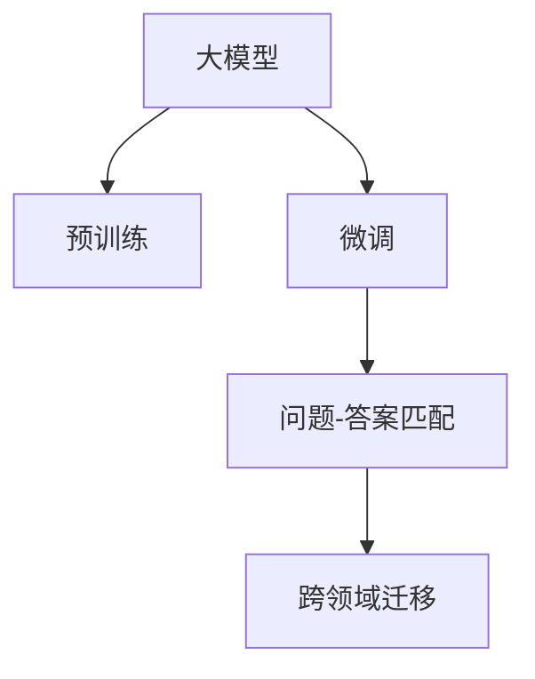

                 

# 基于大模型的电商平台智能客服

## 1. 背景介绍

### 1.1 问题由来
随着电子商务的迅猛发展，电商平台上的客户咨询量日益增加，人工客服难以应对。传统客服系统依赖于大量客服人员，存在人力成本高、响应时间长、服务质量不稳定等问题。为提升客服效率和用户满意度，各大电商平台纷纷引入智能客服系统。

智能客服系统利用自然语言处理(NLP)技术，通过理解客户问题并给出自动回复，实现全天候自动化服务。其核心在于构建高效、准确的问答系统，为用户提供快速、准确的解答。大模型技术在问答系统构建中的应用，尤其值得关注。

### 1.2 问题核心关键点
大模型技术在智能客服系统中的应用，通过预训练语言模型进行微调，使模型能够在特定领域内快速适应。主要解决的核心问题包括：
- 如何构建高效的问题-答案匹配模型？
- 如何在保持模型的通用性的同时，提升其对特定领域问题的理解能力？
- 如何通过微调提升模型的准确率和鲁棒性？
- 如何降低模型对标注数据的需求，提高模型在少量样本情况下的效果？

### 1.3 问题研究意义
大模型技术在智能客服中的应用，具有以下几方面的意义：
1. 降低人工客服成本。智能客服系统可以24小时不间断运行，节省人力成本，降低运营成本。
2. 提升服务效率和质量。大模型可以自动理解客户意图，快速响应客户咨询，提升服务响应速度和质量。
3. 扩大服务范围。大模型可以处理复杂多变的问题，涵盖常见问题和长尾问题，提升客服系统的服务能力。
4. 提供数据分析支持。智能客服系统可以记录和分析用户行为，提供客户画像、热点话题等信息，为电商平台运营提供数据支持。

## 2. 核心概念与联系

### 2.1 核心概念概述
- **大模型(Large Model)**：指预训练模型，如BERT、GPT-3等，这些模型在大量无标签文本数据上预训练，学习到丰富的语言知识。
- **微调(Fine-tuning)**：指在预训练模型的基础上，通过下游任务的数据进行有监督训练，优化模型在该任务上的性能。
- **问题-答案匹配(Matching)**：指将客户输入的自然语言问题与预训练模型匹配，获取最符合语义的答案。
- **跨领域迁移(Cross-domain Transfer)**：指在特定领域内，利用大模型在通用领域的知识进行微调，提升模型对领域内任务的适应性。

这些核心概念之间存在密切联系，共同构成了智能客服系统的技术基础。通过微调大模型，可以使其在不同领域内具备更强的适应性，从而提供高效、准确的客户服务。

### 2.2 核心概念原理和架构的 Mermaid 流程图


这个流程图展示了核心概念之间的逻辑关系：

1. 大模型通过预训练获得通用的语言表示能力。
2. 在特定领域内，通过微调优化模型，提升其在领域内的表现。
3. 微调后的模型通过问题-答案匹配，自动解答客户咨询。
4. 模型在特定领域内的迁移学习，使模型具备更强的泛化能力。

## 3. 核心算法原理 & 具体操作步骤

### 3.1 算法原理概述
智能客服系统的核心算法是问题-答案匹配，主要包括以下步骤：
1. **问题编码**：将客户问题转化为模型可以理解的形式，如输入编码。
2. **答案生成**：利用微调后的模型，对问题进行推理，生成答案。
3. **答案解码**：将模型生成的答案转化为自然语言，提供给客户。

具体而言，问题-答案匹配可以分为以下几个阶段：
1. **预训练模型选择**：选择合适的预训练模型，如BERT、GPT-3等，进行微调。
2. **任务适配**：设计问题-答案匹配的损失函数，如交叉熵损失等，适配特定领域的任务。
3. **微调训练**：使用客户咨询数据进行有监督训练，优化模型参数。
4. **模型评估**：在验证集和测试集上评估模型性能，调整超参数。
5. **部署应用**：将训练好的模型部署到线上，实现自动客服功能。

### 3.2 算法步骤详解
以下是智能客服系统中问题-答案匹配的详细算法步骤：

**Step 1: 准备数据集**
- 收集客户咨询数据，包括问题和对应的答案。
- 将数据划分为训练集、验证集和测试集。
- 对数据进行预处理，如分词、标准化等。

**Step 2: 模型选择与初始化**
- 选择预训练模型，如BERT、GPT-3等，作为初始化参数。
- 将模型架构和参数进行加载。

**Step 3: 任务适配层设计**
- 设计问题-答案匹配的损失函数，如交叉熵损失。
- 在模型顶层添加任务适配层，如线性分类器。

**Step 4: 微调训练**
- 使用训练集数据进行有监督训练。
- 设置合适的学习率、批大小、迭代轮数等超参数。
- 使用验证集进行模型评估，调整超参数。

**Step 5: 模型评估**
- 在测试集上评估模型性能，计算准确率、召回率等指标。
- 根据测试结果调整模型参数。

**Step 6: 模型部署**
- 将训练好的模型部署到线上服务器。
- 设计接口，供用户通过API调用。
- 实现实时问答功能，提供客户服务。

### 3.3 算法优缺点
**优点：**
- 高效性：大模型能够快速适应特定领域，提升服务效率。
- 通用性：预训练模型在通用领域的知识可以迁移应用到特定领域。
- 可扩展性：模型可以动态更新，适应不断变化的用户需求。

**缺点：**
- 依赖标注数据：微调效果依赖于标注数据的质量和数量。
- 模型复杂度高：预训练模型参数量大，资源占用高。
- 需要持续维护：模型需要定期更新，以保持性能和准确率。

### 3.4 算法应用领域
智能客服系统中的问题-答案匹配算法，已广泛应用于多个领域：
- **电商客服**：处理用户购买咨询、退换货、物流查询等。
- **金融客服**：解答用户关于理财产品、贷款、保险等方面的咨询。
- **医疗客服**：提供健康咨询、预约挂号、药品查询等服务。
- **旅游客服**：解决用户关于预订、行程安排、景点介绍等方面的问题。

## 4. 数学模型和公式 & 详细讲解 & 举例说明

### 4.1 数学模型构建
问题-答案匹配模型可以表示为：
$$ y = M(x) $$
其中 $x$ 为输入（客户问题），$y$ 为输出（自动回复），$M$ 为微调后的模型。

模型的输入编码为 $x \in \mathcal{X}$，其中 $\mathcal{X}$ 为输入空间。输出解码为 $y \in \mathcal{Y}$，其中 $\mathcal{Y}$ 为输出空间。模型 $M$ 为微调后的语言模型，参数为 $\theta$。

### 4.2 公式推导过程
假定问题-答案匹配模型的训练集为 $D=\{(x_i,y_i)\}_{i=1}^N$，其中 $x_i \in \mathcal{X}$，$y_i \in \mathcal{Y}$。定义模型 $M_{\theta}$ 在输入 $x_i$ 上的预测输出为 $M_{\theta}(x_i) \in \mathcal{Y}$。

问题-答案匹配的损失函数 $\ell$ 可以表示为：
$$ \ell(y_i, M_{\theta}(x_i)) = -\log \text{Prob}(M_{\theta}(x_i), y_i) $$
其中 $\text{Prob}(M_{\theta}(x_i), y_i)$ 为模型在输入 $x_i$ 上预测输出 $y_i$ 的概率。

### 4.3 案例分析与讲解
以电商平台客服系统为例，问题-答案匹配模型的训练过程如下：
1. **输入编码**：将客户问题 $x_i$ 转换为模型可以理解的编码向量 $x_i^{enc}$。
2. **模型前向传播**：使用微调后的模型 $M_{\theta}$ 对输入 $x_i^{enc}$ 进行前向传播，得到预测输出 $y_i^{pred}$。
3. **损失计算**：计算预测输出 $y_i^{pred}$ 和真实答案 $y_i$ 之间的交叉熵损失。
4. **参数更新**：使用反向传播算法更新模型参数 $\theta$，最小化损失函数 $\ell$。

具体代码实现如下：

```python
import torch
from transformers import BertForQuestionAnswering, BertTokenizer

model = BertForQuestionAnswering.from_pretrained('bert-base-uncased')
tokenizer = BertTokenizer.from_pretrained('bert-base-uncased')

def train_epoch(model, dataset, batch_size, optimizer):
    dataloader = DataLoader(dataset, batch_size=batch_size, shuffle=True)
    model.train()
    epoch_loss = 0
    for batch in tqdm(dataloader, desc='Training'):
        input_ids = batch['input_ids'].to(device)
        attention_mask = batch['attention_mask'].to(device)
        labels = batch['labels'].to(device)
        model.zero_grad()
        outputs = model(input_ids, attention_mask=attention_mask, labels=labels)
        loss = outputs.loss
        epoch_loss += loss.item()
        loss.backward()
        optimizer.step()
    return epoch_loss / len(dataloader)

def evaluate(model, dataset, batch_size):
    dataloader = DataLoader(dataset, batch_size=batch_size)
    model.eval()
    preds, labels = [], []
    with torch.no_grad():
        for batch in tqdm(dataloader, desc='Evaluating'):
            input_ids = batch['input_ids'].to(device)
            attention_mask = batch['attention_mask'].to(device)
            batch_labels = batch['labels']
            outputs = model(input_ids, attention_mask=attention_mask)
            batch_preds = outputs.logits.argmax(dim=2).to('cpu').tolist()
            batch_labels = batch_labels.to('cpu').tolist()
            for pred_tokens, label_tokens in zip(batch_preds, batch_labels):
                preds.append(pred_tokens[:len(label_tokens)])
                labels.append(label_tokens)
    print(classification_report(labels, preds))
```

通过上述代码，可以看出，问题-答案匹配模型的训练过程主要由输入编码、模型前向传播、损失计算和参数更新等步骤组成。模型通过大量标注数据进行训练，逐步优化参数，提升对问题-答案匹配任务的适应性。

## 5. 项目实践：代码实例和详细解释说明

### 5.1 开发环境搭建
为了实现智能客服系统，需要搭建一套完整的开发环境，主要包括以下几个步骤：
1. **环境准备**：安装Python、PyTorch、Transformers等必要库。
2. **数据准备**：收集和标注客户咨询数据，划分为训练集、验证集和测试集。
3. **模型选择**：选择合适的预训练模型，如BERT、GPT-3等。

**具体步骤如下：**

**Step 1: 环境准备**
```bash
pip install torch transformers
```

**Step 2: 数据准备**
收集电商平台客服咨询数据，进行预处理和标注，生成训练集、验证集和测试集。

**Step 3: 模型选择**
选择预训练模型，如BERT、GPT-3等。

### 5.2 源代码详细实现
智能客服系统的核心代码如下：

```python
import torch
from transformers import BertForQuestionAnswering, BertTokenizer

model = BertForQuestionAnswering.from_pretrained('bert-base-uncased')
tokenizer = BertTokenizer.from_pretrained('bert-base-uncased')

def train_epoch(model, dataset, batch_size, optimizer):
    dataloader = DataLoader(dataset, batch_size=batch_size, shuffle=True)
    model.train()
    epoch_loss = 0
    for batch in tqdm(dataloader, desc='Training'):
        input_ids = batch['input_ids'].to(device)
        attention_mask = batch['attention_mask'].to(device)
        labels = batch['labels'].to(device)
        model.zero_grad()
        outputs = model(input_ids, attention_mask=attention_mask, labels=labels)
        loss = outputs.loss
        epoch_loss += loss.item()
        loss.backward()
        optimizer.step()
    return epoch_loss / len(dataloader)

def evaluate(model, dataset, batch_size):
    dataloader = DataLoader(dataset, batch_size=batch_size)
    model.eval()
    preds, labels = [], []
    with torch.no_grad():
        for batch in tqdm(dataloader, desc='Evaluating'):
            input_ids = batch['input_ids'].to(device)
            attention_mask = batch['attention_mask'].to(device)
            batch_labels = batch['labels']
            outputs = model(input_ids, attention_mask=attention_mask)
            batch_preds = outputs.logits.argmax(dim=2).to('cpu').tolist()
            batch_labels = batch_labels.to('cpu').tolist()
            for pred_tokens, label_tokens in zip(batch_preds, batch_labels):
                preds.append(pred_tokens[:len(label_tokens)])
                labels.append(label_tokens)
    print(classification_report(labels, preds))

# 训练模型
device = torch.device('cuda') if torch.cuda.is_available() else torch.device('cpu')
model.to(device)
optimizer = AdamW(model.parameters(), lr=2e-5)

# 加载数据
train_dataset = ...
dev_dataset = ...
test_dataset = ...

# 训练
for epoch in range(epochs):
    loss = train_epoch(model, train_dataset, batch_size, optimizer)
    print(f"Epoch {epoch+1}, train loss: {loss:.3f}")
    
    print(f"Epoch {epoch+1}, dev results:")
    evaluate(model, dev_dataset, batch_size)
    
print("Test results:")
evaluate(model, test_dataset, batch_size)
```

### 5.3 代码解读与分析
智能客服系统的核心代码主要由训练和评估两部分组成。训练过程中，使用AdamW优化器进行参数更新，计算交叉熵损失，进行梯度下降。评估过程中，使用准确率、召回率等指标对模型性能进行评估。代码中使用BertForQuestionAnswering作为预训练模型，使用BertTokenizer进行编码处理，确保输入编码的正确性。

## 6. 实际应用场景

### 6.1 智能客服系统应用

智能客服系统是电商平台的重要组成部分，能够大幅提升客户体验和运营效率。智能客服系统可以自动解答常见问题，快速响应客户咨询，提升服务质量和效率。具体应用场景如下：
1. **商品咨询**：用户询问商品信息、价格、优惠等，智能客服系统自动提供相关信息。
2. **物流查询**：用户查询订单物流信息，智能客服系统提供实时物流状态和预计送达时间。
3. **退换货处理**：用户提出退换货申请，智能客服系统自动解答退换货流程和注意事项。
4. **投诉反馈**：用户反馈商品质量问题，智能客服系统自动记录并上报，处理后续投诉。

### 6.2 未来应用展望

未来，智能客服系统将进一步提升其智能化水平，具体应用场景如下：
1. **多语言支持**：智能客服系统支持多种语言，提供多语言客服服务。
2. **情感分析**：智能客服系统能够识别用户情绪，提供针对性的服务和建议。
3. **个性化推荐**：智能客服系统根据用户历史行为和偏好，提供个性化商品推荐。
4. **知识库更新**：智能客服系统能够实时更新知识库，提供最新信息。
5. **自动化质检**：智能客服系统能够对客服对话进行质检，自动生成质检报告。

## 7. 工具和资源推荐

### 7.1 学习资源推荐
为了帮助开发者系统掌握智能客服系统中的大模型微调技术，推荐以下学习资源：
1. **《自然语言处理入门与实践》**：介绍了自然语言处理的基本概念和常见任务，适合初学者入门。
2. **《深度学习与自然语言处理》**：由斯坦福大学教授讲授，深入浅出地介绍了自然语言处理的原理和技术。
3. **Transformers官方文档**：详细介绍了BERT、GPT等预训练模型的使用方法，适合实践操作。
4. **GitHub开源项目**：众多NLP任务的开源项目，提供了丰富的代码示例和资源，适合参考学习。

### 7.2 开发工具推荐
智能客服系统中的大模型微调技术开发，需要借助一些强大的工具，推荐如下：
1. **PyTorch**：灵活动态的计算图，适合快速迭代研究。
2. **TensorFlow**：生产部署方便，适合大规模工程应用。
3. **Transformers库**：提供了丰富的预训练模型和微调样例代码，适合开发和部署。
4. **Jupyter Notebook**：在线代码编辑器，支持交互式代码调试和数据可视化。
5. **GitHub**：代码托管平台，支持协作开发和版本控制。

### 7.3 相关论文推荐
智能客服系统中的大模型微调技术，涉及自然语言处理、深度学习等多个领域，推荐以下相关论文：
1. **Attention is All You Need**：介绍Transformer结构，为预训练语言模型奠定了基础。
2. **BERT: Pre-training of Deep Bidirectional Transformers for Language Understanding**：提出BERT模型，推动了预训练语言模型的发展。
3. **Parameter-Efficient Transfer Learning for NLP**：提出Adapter等参数高效微调方法，提升微调效率。
4. **AdaLoRA: Adaptive Low-Rank Adaptation for Parameter-Efficient Fine-Tuning**：提出AdaLoRA方法，优化微调过程。
5. **Prefix-Tuning: Optimizing Continuous Prompts for Generation**：引入连续型Prompt，提高微调效果。

## 8. 总结：未来发展趋势与挑战

### 8.1 研究成果总结
智能客服系统中的大模型微调技术，在电商平台中取得了显著的成效，提升客服效率和客户满意度。主要研究成果包括：
1. **高效的问题-答案匹配**：利用预训练语言模型，实现快速、准确的问题-答案匹配。
2. **跨领域迁移学习**：在特定领域内，利用通用领域的知识进行微调，提升模型适应性。
3. **参数高效微调**：优化模型结构，减少参数量，提升推理效率。

### 8.2 未来发展趋势
未来智能客服系统中的大模型微调技术，将呈现以下发展趋势：
1. **模型规模增大**：预训练模型规模将进一步增大，提升模型的泛化能力和适应性。
2. **多语言支持**：智能客服系统将支持多种语言，提供多语言客服服务。
3. **情感分析**：智能客服系统将具备情感识别能力，提供个性化服务。
4. **跨模态融合**：结合文本、语音、图像等多种模态信息，提升客服系统的智能化水平。
5. **知识图谱融合**：将知识图谱与自然语言处理技术结合，提供更丰富的信息服务。

### 8.3 面临的挑战
智能客服系统中的大模型微调技术，仍面临以下挑战：
1. **标注数据依赖**：微调效果依赖于标注数据的质量和数量，获取高质量标注数据成本较高。
2. **过拟合问题**：模型在特定领域内容易出现过拟合，需要采取数据增强、正则化等措施。
3. **推理效率低**：大模型推理速度慢，需要优化模型结构，提升推理效率。
4. **可解释性不足**：模型输出缺乏可解释性，需要引入因果分析和博弈论工具。
5. **安全性问题**：模型可能学习到有害信息，需要引入伦理道德约束。

### 8.4 研究展望
未来智能客服系统中的大模型微调技术，需要在以下几个方面进行探索：
1. **无监督和半监督微调**：摆脱对标注数据的依赖，利用自监督学习、主动学习等方法进行微调。
2. **参数高效微调**：开发更多参数高效微调方法，如LoRA、AdaLoRA等，优化微调过程。
3. **因果分析与博弈论**：引入因果分析和博弈论工具，增强模型的可解释性和鲁棒性。
4. **跨模态融合**：结合视觉、语音、图像等多种模态信息，提升客服系统的智能化水平。
5. **知识图谱融合**：将知识图谱与自然语言处理技术结合，提供更丰富的信息服务。

## 9. 附录：常见问题与解答

### Q1: 智能客服系统中的问题-答案匹配算法如何选择预训练模型？

A: 选择预训练模型时，需要考虑模型规模、性能、领域适应性等因素。常见的选择包括BERT、GPT-3等，具体选择可以根据任务需求和资源条件进行调整。

### Q2: 如何优化智能客服系统中的微调过程？

A: 优化微调过程，主要从数据增强、正则化、模型结构优化等方面入手：
1. 数据增强：通过回译、近义替换等方式扩充训练集，提升模型泛化能力。
2. 正则化：使用L2正则、Dropout等方法，避免模型过拟合。
3. 模型结构优化：采用AdaLoRA、LoRA等参数高效微调方法，减少参数量，提升推理效率。

### Q3: 智能客服系统中的大模型微调技术如何应对标注数据不足的问题？

A: 应对标注数据不足的问题，主要通过以下方法：
1. 数据增强：通过回译、近义替换等方式扩充训练集。
2. 自监督学习：利用自监督学习任务，如语言建模，提升模型泛化能力。
3. 无监督和半监督学习：利用无监督和半监督学习技术，降低对标注数据的依赖。

### Q4: 智能客服系统中的大模型微调技术如何提升模型推理效率？

A: 提升模型推理效率，主要通过以下方法：
1. 参数高效微调：只更新少量参数，减少推理计算量。
2. 模型裁剪和量化：减少模型参数量，提升推理速度。
3. 模型并行化：利用分布式计算，加速推理过程。

通过上述方法，可以有效地提升智能客服系统中的大模型微调技术，提升系统性能和用户体验。

---

作者：禅与计算机程序设计艺术 / Zen and the Art of Computer Programming

