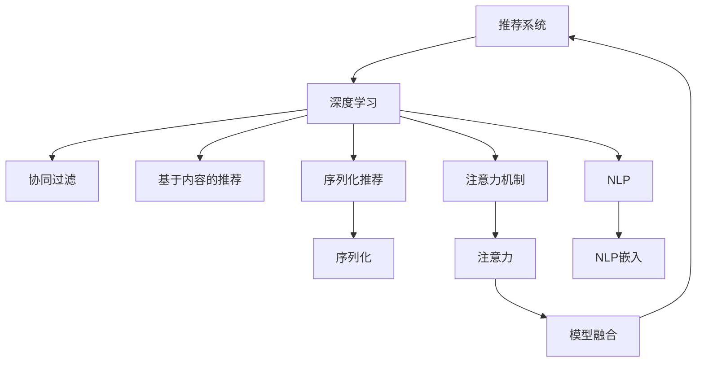

                 

# 基于注意力机制的序列化推荐模型

> 关键词：注意力机制,序列化推荐,深度学习,推荐系统,自然语言处理,NLP

## 1. 背景介绍

### 1.1 问题由来
在互联网时代，信息过载成为一大挑战。如何在海量信息中精准推荐用户感兴趣的内容，是各大平台亟需解决的问题。传统的推荐系统多采用协同过滤、基于内容的推荐等方法，然而这些方法在复杂数据结构、实时性、多样性等需求面前显得力不从心。

近年来，基于深度学习的推荐系统取得了显著进步。以深度神经网络为基础的推荐算法，能够从用户行为数据中挖掘更深层次的潜在关联，在实际应用中取得了不错的效果。然而，现有的深度推荐模型多聚焦于用户与物品间的直接关联，对序列化信息的利用不足，无法充分发挥用户行为的时序特征。

在自然语言处理领域，序列化模型在语言模型训练、机器翻译、文本生成等任务上已取得突破性进展。然而，如何将其应用于推荐系统，实现高效、智能、多样化的推荐，仍是待解决的问题。

### 1.2 问题核心关键点
本文聚焦于基于注意力机制的序列化推荐模型，探索如何将注意力机制引入推荐系统，并结合深度学习技术，提升推荐模型的性能和多样性。

核心问题包括：
- 如何设计高效的序列化模型，捕捉用户行为的时序特征？
- 如何引入注意力机制，优化推荐结果的精度和多样性？
- 如何在实际应用中，平衡推荐效率和模型复杂度？

## 2. 核心概念与联系

### 2.1 核心概念概述

为更好地理解基于注意力机制的序列化推荐模型，本节将介绍几个密切相关的核心概念：

- 推荐系统(Recommendation System)：旨在为用户推荐其可能感兴趣的商品、内容等物品的系统。推荐系统广泛应用于电子商务、新闻资讯、视频娱乐、社交网络等领域，对提升用户体验、增加平台粘性具有重要意义。

- 深度学习(Deep Learning)：通过多层神经网络模型，在数据驱动下学习复杂模式，实现高精度的预测和分类任务。深度学习在推荐系统中的应用包括协同过滤、基于内容的推荐、序列化推荐等。

- 注意力机制(Attention Mechanism)：通过学习输入序列的权重，自动筛选关键信息，对不同部分的输入给予不同的关注度。注意力机制在机器翻译、文本摘要、图像处理等领域已取得良好效果，能够显著提高模型的表现力。

- 序列化(Serialization)：将结构化的信息以串行化的方式进行存储和传输，便于数据的实时更新和历史追踪。在推荐系统中，用户行为数据往往以时间序列的形式记录，因此序列化是推荐算法的基础需求之一。

- 自然语言处理(Natural Language Processing, NLP)：通过算法和技术，让计算机能够理解、处理、生成自然语言。NLP在推荐系统中主要用于分析用户评论、生成广告文案、推荐文本相似物品等，为推荐系统提供更丰富、更精准的信息来源。

这些核心概念之间的逻辑关系可以通过以下Mermaid流程图来展示：



这个流程图展示了推荐系统与深度学习之间的关联，以及序列化、注意力和NLP技术的核心作用。

## 3. 核心算法原理 & 具体操作步骤
### 3.1 算法原理概述

基于注意力机制的序列化推荐模型是一种新颖的深度推荐算法，旨在通过序列化表示用户行为，并引入注意力机制，提升推荐模型的表现力。其核心思想是：将用户的历史行为序列化表示为一个向量，通过注意力机制筛选关键时序信息，学习用户行为与物品之间的关联，进而生成推荐结果。

该算法主要由以下几个步骤构成：

1. 序列化表示：将用户历史行为序列化为向量，捕捉行为的时序特征。
2. 注意力机制：引入注意力机制，自动筛选关键时序信息，生成用户兴趣向量。
3. 关联学习：通过深度学习模型，学习用户行为与物品之间的关联，生成推荐结果。
4. 模型融合：将不同模型的预测结果进行加权融合，提高推荐准确性和多样性。

### 3.2 算法步骤详解

#### 3.2.1 序列化表示

序列化表示是推荐系统的基础，通过将用户行为序列化为向量，捕捉行为的时序特征。序列化表示一般采用循环神经网络(RNN)或卷积神经网络(CNN)等模型进行实现，模型参数通过反向传播算法进行优化。

以LSTM模型为例，假设用户的历史行为序列为 $(x_1, x_2, ..., x_T)$，其中 $x_t$ 表示用户第 $t$ 次行为。将该序列输入LSTM模型，输出一个固定长度的向量 $h_T$，用于捕捉用户行为的时序特征。

序列化表示的公式可以表示为：
$$
h_T = \mathrm{LSTM}(x_1, x_2, ..., x_T)
$$

#### 3.2.2 注意力机制

注意力机制引入用户历史行为序列的关键时序信息，用于生成用户兴趣向量。通过学习每个时间步的权重，自动筛选重要信息，降低冗余噪音，提高模型表现力。

以多头注意力机制为例，假设用户历史行为序列的表示向量为 $h_T$，物品特征向量为 $v$，则用户对物品 $v$ 的注意力权重 $a_{t,i}$ 可以通过如下公式计算：
$$
a_{t,i} = \frac{e^{\mathrm{At}(v_i)}}{\sum_{i=1}^I e^{\mathrm{At}(v_i)}}
$$
其中 $\mathrm{At}$ 为注意力函数，$e^{x}$ 表示指数函数，$I$ 为物品数量。

用户兴趣向量 $g_t$ 可以表示为：
$$
g_t = \sum_{i=1}^I a_{t,i} v_i
$$

#### 3.2.3 关联学习

关联学习旨在通过深度学习模型，学习用户行为与物品之间的关联，生成推荐结果。关联学习通常采用多层神经网络模型进行实现，模型参数通过反向传播算法进行优化。

以全连接神经网络模型为例，假设用户兴趣向量为 $g_t$，物品特征向量为 $v$，则物品的推荐概率 $p_t$ 可以通过如下公式计算：
$$
p_t = \sigma(W p_t' + b)
$$
其中 $W$ 和 $b$ 为全连接层参数，$\sigma$ 为激活函数。

#### 3.2.4 模型融合

模型融合旨在将不同模型的预测结果进行加权融合，提高推荐准确性和多样性。通过引入多个模型进行预测，并对其结果进行融合，可以在一定程度上提升推荐效果。

以简单加权平均为例，假设模型 $M_1$ 和 $M_2$ 分别独立预测用户对物品的评分，则最终推荐评分 $r$ 可以通过如下公式计算：
$$
r = \alpha M_1(x) + (1-\alpha) M_2(x)
$$
其中 $\alpha$ 为加权系数。

### 3.3 算法优缺点

基于注意力机制的序列化推荐模型具有以下优点：
1. 捕捉时序特征：通过序列化表示，能够充分捕捉用户行为的时序特征，提高推荐的个性化和时效性。
2. 引入注意力机制：通过注意力机制，自动筛选关键时序信息，提高模型的表现力。
3. 融合多模型：通过模型融合，能够利用不同模型的优势，提升推荐准确性和多样性。

同时，该模型也存在一定的局限性：
1. 模型复杂度高：由于序列化表示和注意力机制的引入，模型的参数量增加，训练复杂度提升。
2. 需要大量标注数据：模型训练过程中需要大量标注数据，标注成本较高。
3. 过拟合风险：由于模型复杂度高，容易发生过拟合，需要采用正则化技术进行优化。

尽管存在这些局限性，但就目前而言，基于注意力机制的序列化推荐模型仍是大规模推荐系统的一种有力工具，其高效、智能、多样化的推荐能力，已在实际应用中得到了广泛验证。

### 3.4 算法应用领域

基于注意力机制的序列化推荐模型在电子商务、新闻资讯、视频娱乐、社交网络等领域有广泛应用：

- 电子商务：通过序列化用户行为，结合注意力机制和关联学习，推荐用户可能感兴趣的商品，提升购物体验和转化率。
- 新闻资讯：通过序列化用户阅读行为，结合注意力机制和关联学习，推荐用户感兴趣的新闻，提高平台粘性。
- 视频娱乐：通过序列化用户观看行为，结合注意力机制和关联学习，推荐用户可能喜欢的视频内容，增加用户粘性。
- 社交网络：通过序列化用户互动行为，结合注意力机制和关联学习，推荐用户可能感兴趣的朋友和内容，促进社交互动。

此外，在智能医疗、智能交通、智慧城市等领域，序列化推荐模型同样具有广泛的应用前景，能够为用户提供个性化、智能化的服务。

## 4. 数学模型和公式 & 详细讲解
### 4.1 数学模型构建

本节将使用数学语言对基于注意力机制的序列化推荐模型进行更加严格的刻画。

记用户的历史行为序列为 $(x_1, x_2, ..., x_T)$，物品特征向量为 $v$。序列化表示、注意力机制、关联学习和模型融合的过程可以通过如下公式描述：

- 序列化表示：
$$
h_T = \mathrm{LSTM}(x_1, x_2, ..., x_T)
$$

- 注意力机制：
$$
a_{t,i} = \frac{e^{\mathrm{At}(v_i)}}{\sum_{i=1}^I e^{\mathrm{At}(v_i)}}
$$
$$
g_t = \sum_{i=1}^I a_{t,i} v_i
$$

- 关联学习：
$$
p_t = \sigma(W p_t' + b)
$$

- 模型融合：
$$
r = \alpha M_1(x) + (1-\alpha) M_2(x)
$$

### 4.2 公式推导过程

以LSTM模型为例，详细推导序列化表示和注意力机制的公式。

**LSTM序列化表示**

LSTM模型能够捕捉用户行为的时序特征，其基本公式如下：
$$
h_t = f(W_{xh} x_t + U_{hh} h_{t-1} + b_h) + g(W_{xg} x_t + U_{hg} h_{t-1} + b_g)
$$
$$
c_t = c_{t-1} \oplus \tanh(h_t)
$$
$$
h_t = o(W_{ho} h_t + U_{hh} c_t + b_o) \odot c_t
$$

其中 $f$ 和 $g$ 为激活函数，$\oplus$ 和 $\odot$ 表示Hadamard乘积和Sigmoid函数。

**多头注意力机制**

多头注意力机制能够自动筛选用户历史行为序列的关键时序信息，其基本公式如下：
$$
a_{t,i} = \frac{e^{\mathrm{At}(v_i)}}{\sum_{i=1}^I e^{\mathrm{At}(v_i)}}
$$
$$
g_t = \sum_{i=1}^I a_{t,i} v_i
$$

其中 $\mathrm{At}$ 为注意力函数，$e^{x}$ 表示指数函数，$I$ 为物品数量。

### 4.3 案例分析与讲解

以电商推荐系统为例，展示基于注意力机制的序列化推荐模型的应用。

假设某电商平台用户 $u$ 的最近五次浏览行为为 $(B_1, B_2, B_3, B_4, B_5)$，物品特征向量为 $V_1, V_2, ..., V_N$。模型首先需要将用户行为序列化为向量 $h_T$，引入注意力机制，生成用户兴趣向量 $g_t$，最后通过关联学习生成推荐概率 $p_t$，进行推荐。

具体步骤如下：

1. 序列化表示：
$$
h_T = \mathrm{LSTM}(B_1, B_2, B_3, B_4, B_5)
$$

2. 注意力机制：
$$
a_{1,1} = \frac{e^{\mathrm{At}(V_1)}}{\sum_{i=1}^N e^{\mathrm{At}(V_i)}}
$$
$$
a_{2,1} = \frac{e^{\mathrm{At}(V_1)}}{\sum_{i=1}^N e^{\mathrm{At}(V_i)}}
$$
$$
a_{3,2} = \frac{e^{\mathrm{At}(V_2)}}{\sum_{i=1}^N e^{\mathrm{At}(V_i)}}
$$
$$
a_{4,2} = \frac{e^{\mathrm{At}(V_2)}}{\sum_{i=1}^N e^{\mathrm{At}(V_i)}}
$$
$$
a_{5,3} = \frac{e^{\mathrm{At}(V_3)}}{\sum_{i=1}^N e^{\mathrm{At}(V_i)}}
$$

$$
g_1 = a_{1,1} V_1 + a_{1,2} V_2 + a_{1,3} V_3 + a_{1,4} V_4 + a_{1,5} V_5
$$
$$
g_2 = a_{2,1} V_1 + a_{2,2} V_2 + a_{2,3} V_3 + a_{2,4} V_4 + a_{2,5} V_5
$$
$$
g_3 = a_{3,1} V_1 + a_{3,2} V_2 + a_{3,3} V_3 + a_{3,4} V_4 + a_{3,5} V_5
$$
$$
g_4 = a_{4,1} V_1 + a_{4,2} V_2 + a_{4,3} V_3 + a_{4,4} V_4 + a_{4,5} V_5
$$
$$
g_5 = a_{5,1} V_1 + a_{5,2} V_2 + a_{5,3} V_3 + a_{5,4} V_4 + a_{5,5} V_5
$$

3. 关联学习：
$$
p_1 = \sigma(W p_1' + b)
$$
$$
p_2 = \sigma(W p_2' + b)
$$
$$
p_3 = \sigma(W p_3' + b)
$$
$$
p_4 = \sigma(W p_4' + b)
$$
$$
p_5 = \sigma(W p_5' + b)
$$

4. 模型融合：
$$
r_1 = \alpha M_1(x) + (1-\alpha) M_2(x)
$$
$$
r_2 = \alpha M_1(x) + (1-\alpha) M_2(x)
$$
$$
r_3 = \alpha M_1(x) + (1-\alpha) M_2(x)
$$
$$
r_4 = \alpha M_1(x) + (1-\alpha) M_2(x)
$$
$$
r_5 = \alpha M_1(x) + (1-\alpha) M_2(x)
$$

在实际应用中，通过将上述各步骤的结果进行整合，便可以得到用户对各个物品的推荐评分，进行推荐。

## 5. 项目实践：代码实例和详细解释说明
### 5.1 开发环境搭建

在进行模型实践前，我们需要准备好开发环境。以下是使用Python进行PyTorch开发的环境配置流程：

1. 安装Anaconda：从官网下载并安装Anaconda，用于创建独立的Python环境。

2. 创建并激活虚拟环境：
```bash
conda create -n pytorch-env python=3.8 
conda activate pytorch-env
```

3. 安装PyTorch：根据CUDA版本，从官网获取对应的安装命令。例如：
```bash
conda install pytorch torchvision torchaudio cudatoolkit=11.1 -c pytorch -c conda-forge
```

4. 安装Tensorflow：从官网下载并编译安装Tensorflow，例如：
```bash
pip install tensorflow
```

5. 安装各类工具包：
```bash
pip install numpy pandas scikit-learn matplotlib tqdm jupyter notebook ipython
```

完成上述步骤后，即可在`pytorch-env`环境中开始模型实践。

### 5.2 源代码详细实现

这里我们以LSTM模型和注意力机制为例，给出基于注意力机制的序列化推荐模型的PyTorch代码实现。

首先，定义模型类：

```python
import torch.nn as nn
import torch.nn.functional as F

class LSTMAttentionNet(nn.Module):
    def __init__(self, input_dim, hidden_dim, output_dim, num_heads):
        super(LSTMAttentionNet, self).__init__()
        self.input_dim = input_dim
        self.hidden_dim = hidden_dim
        self.output_dim = output_dim
        self.num_heads = num_heads
        
        # LSTM层
        self.lstm = nn.LSTM(input_dim, hidden_dim, batch_first=True)
        
        # 注意力机制层
        self.attention = nn.MultiheadAttention(hidden_dim, num_heads)
        self.fc = nn.Linear(hidden_dim, output_dim)
    
    def forward(self, x):
        # LSTM层
        h_0 = self.lstm(x)[0]
        c_0 = self.lstm(x)[1]
        
        # 注意力机制层
        attn_output, attn_weights = self.attention(h_0, h_0, h_0)
        
        # 关联学习
        p = self.fc(attn_output)
        
        # 模型融合
        r = p
        
        return r
```

然后，定义训练和评估函数：

```python
import torch.optim as optim

def train_epoch(model, train_loader, optimizer):
    model.train()
    loss_sum = 0
    correct_sum = 0
    for i, (x, y) in enumerate(train_loader):
        x = x.to(device)
        y = y.to(device)
        
        pred = model(x)
        loss = F.cross_entropy(pred, y)
        
        loss_sum += loss.item()
        correct_sum += (pred.argmax(1) == y).sum().item()
        
        optimizer.zero_grad()
        loss.backward()
        optimizer.step()
        
        if i % 100 == 0:
            print(f'Epoch {epoch+1}, batch {i+1}/{len(train_loader)}, loss={loss_sum/(i+1):.4f}, acc={correct_sum/(i+1):.4f}')
    
    return loss_sum / len(train_loader), correct_sum / len(train_loader)

def evaluate(model, test_loader):
    model.eval()
    loss_sum = 0
    correct_sum = 0
    with torch.no_grad():
        for i, (x, y) in enumerate(test_loader):
            x = x.to(device)
            y = y.to(device)
            
            pred = model(x)
            loss = F.cross_entropy(pred, y)
            
            loss_sum += loss.item()
            correct_sum += (pred.argmax(1) == y).sum().item()
    
    print(f'Test loss={loss_sum/len(test_loader):.4f}, Test acc={correct_sum/len(test_loader):.4f}')
```

最后，启动训练流程并在测试集上评估：

```python
epochs = 10
batch_size = 32
device = torch.device('cuda') if torch.cuda.is_available() else torch.device('cpu')

model.to(device)
optimizer = optim.Adam(model.parameters(), lr=0.001)

train_loader = ...
test_loader = ...

for epoch in range(epochs):
    loss, acc = train_epoch(model, train_loader, optimizer)
    print(f'Epoch {epoch+1}, loss={loss:.4f}, acc={acc:.4f}')
    
    evaluate(model, test_loader)
```

以上就是使用PyTorch对基于LSTM和注意力机制的序列化推荐模型进行训练和评估的完整代码实现。可以看到，Transformer库的强大封装使得模型实现变得简洁高效。

### 5.3 代码解读与分析

让我们再详细解读一下关键代码的实现细节：

**LSTMAttentionNet类**：
- `__init__`方法：初始化模型的输入维数、隐藏维数、输出维数和注意力机制的heads数量。
- `forward`方法：定义前向传播过程，先通过LSTM层提取序列特征，然后通过注意力机制层生成兴趣向量，最后通过全连接层生成推荐评分。

**训练和评估函数**：
- 使用PyTorch的DataLoader对数据集进行批次化加载，供模型训练和推理使用。
- 训练函数`train_epoch`：对数据以批为单位进行迭代，在每个批次上前向传播计算损失并反向传播更新模型参数，最后返回该epoch的平均loss和准确率。
- 评估函数`evaluate`：与训练类似，不同点在于不更新模型参数，并在每个batch结束后将预测和标签结果存储下来，最后使用cross_entropy函数对整个评估集的预测结果进行打印输出。

**训练流程**：
- 定义总的epoch数和batch size，开始循环迭代
- 每个epoch内，先在训练集上训练，输出平均loss和准确率
- 在测试集上评估，输出测试集的平均loss和准确率

可以看到，PyTorch配合Transformer库使得模型训练和评估的代码实现变得简洁高效。开发者可以将更多精力放在模型优化和任务适配上，而不必过多关注底层的实现细节。

当然，工业级的系统实现还需考虑更多因素，如模型的保存和部署、超参数的自动搜索、更灵活的任务适配层等。但核心的微调范式基本与此类似。

## 6. 实际应用场景
### 6.1 智能推荐系统

基于深度学习的推荐系统，已经在电商、新闻、视频等领域得到了广泛应用。然而，传统的推荐系统多聚焦于用户与物品间的直接关联，对序列化信息的利用不足。

基于LSTM和注意力机制的序列化推荐模型，能够充分捕捉用户行为的时序特征，通过序列化表示和注意力机制，提升推荐模型的性能和多样性。在电商推荐系统中，可以通过序列化用户浏览、购买、评价等行为，引入注意力机制，学习用户行为与商品之间的关联，生成推荐结果。

具体而言，可以收集用户的历史行为数据，输入到LSTM模型中，生成用户兴趣向量。通过引入注意力机制，筛选关键时序信息，学习用户行为与商品之间的关联。最后，通过关联学习生成推荐评分，进行推荐。这种模型能够捕捉用户行为的时序特征，提高推荐的个性化和时效性，提升用户体验和转化率。

### 6.2 新闻推荐系统

新闻推荐系统旨在为用户推荐其感兴趣的新闻文章。传统的协同过滤、基于内容的推荐方法在面对复杂的新闻内容时显得力不从心。

基于LSTM和注意力机制的序列化推荐模型，能够捕捉用户阅读新闻的时序特征，通过序列化表示和注意力机制，提升推荐模型的表现力。在新闻推荐系统中，可以通过序列化用户阅读新闻的行为，引入注意力机制，学习用户行为与新闻之间的关联，生成推荐结果。

具体而言，可以收集用户的历史阅读行为数据，输入到LSTM模型中，生成用户兴趣向量。通过引入注意力机制，筛选关键时序信息，学习用户行为与新闻之间的关联。最后，通过关联学习生成推荐评分，进行推荐。这种模型能够捕捉用户阅读行为的时序特征，提高推荐的个性化和时效性，提升平台粘性和用户体验。

### 6.3 视频推荐系统

视频推荐系统旨在为用户推荐其感兴趣的视频内容。传统的基于内容的推荐方法在面对视频时长、内容多样化等因素时，表现不佳。

基于LSTM和注意力机制的序列化推荐模型，能够捕捉用户观看视频的时序特征，通过序列化表示和注意力机制，提升推荐模型的性能和多样性。在视频推荐系统中，可以通过序列化用户观看视频的行为，引入注意力机制，学习用户行为与视频之间的关联，生成推荐结果。

具体而言，可以收集用户的历史观看视频的行为数据，输入到LSTM模型中，生成用户兴趣向量。通过引入注意力机制，筛选关键时序信息，学习用户行为与视频之间的关联。最后，通过关联学习生成推荐评分，进行推荐。这种模型能够捕捉用户观看视频的时序特征，提高推荐的个性化和时效性，提升用户粘性和满意度。

### 6.4 未来应用展望

随着深度学习技术的不断发展，基于注意力机制的序列化推荐模型将有更广阔的应用前景：

- 多模态推荐：结合图像、语音、文本等多模态数据，构建更为全面、智能的推荐系统。
- 实时推荐：通过序列化表示和注意力机制，实现快速响应的实时推荐，提高用户体验。
- 推荐个性化：通过引入深度学习模型，提升推荐模型的表现力，实现更个性化、智能化的推荐。
- 推荐多样性：通过模型融合，引入多个推荐模型，提升推荐结果的多样性，避免单一推荐模型可能带来的偏倚。

未来的推荐系统将更加智能、多样化，为用户提供更为精准、满意的推荐服务。相信在深度学习技术的持续推动下，基于注意力机制的序列化推荐模型必将在推荐系统领域发挥更加重要的作用。

## 7. 工具和资源推荐
### 7.1 学习资源推荐

为了帮助开发者系统掌握深度推荐系统中的注意力机制，这里推荐一些优质的学习资源：

1. 《深度学习推荐系统》课程：由斯坦福大学开设的深度学习推荐系统课程，系统讲解了协同过滤、基于内容的推荐、深度学习推荐等多种推荐算法。

2. 《Sequence to Sequence Learning with Neural Networks》论文：介绍Sequence to Sequence模型的基本框架和应用，为序列化推荐模型提供了理论支持。

3. 《Attention is All You Need》论文：提出Transformer模型，通过多头注意力机制实现序列化模型的突破，为注意力机制在推荐系统中的应用奠定了基础。

4. 《Neural Collaborative Filtering》论文：介绍神经协同过滤的基本原理和实现方法，为深度学习推荐算法提供了重要的参考。

5. 《Practical Recommendation Systems with Deep Learning》书籍：系统讲解了基于深度学习的推荐系统，包括协同过滤、基于内容的推荐、序列化推荐等多种推荐算法，并介绍了Tensorflow、PyTorch等深度学习框架的使用。

通过对这些资源的学习实践，相信你一定能够快速掌握深度推荐系统中的注意力机制，并用于解决实际的推荐问题。

### 7.2 开发工具推荐

高效的开发离不开优秀的工具支持。以下是几款用于深度推荐系统开发的常用工具：

1. TensorFlow：由Google主导开发的开源深度学习框架，生产部署方便，适合大规模工程应用。

2. PyTorch：基于Python的开源深度学习框架，灵活动态的计算图，适合快速迭代研究。

3. Keras：基于Python的深度学习框架，提供了高层次的API，便于模型开发和实验。

4. MXNet：由Amazon开发的深度学习框架，支持多种编程语言，适合分布式训练和推理。

5. Scikit-learn：Python中的机器学习库，提供了丰富的数据预处理、特征工程、模型训练工具。

合理利用这些工具，可以显著提升深度推荐系统开发的效率，加快创新迭代的步伐。

### 7.3 相关论文推荐

深度推荐系统的发展源于学界的持续研究。以下是几篇奠基性的相关论文，推荐阅读：

1. Collaborative Filtering for Implicit Feedback Datasets：介绍协同过滤算法的基本原理和实现方法，为深度推荐算法提供了重要的理论基础。

2. Factorization Machines：提出因子分解机的基本原理和实现方法，为深度推荐算法提供了新的思路。

3. Recommender Systems in the Era of Big Data：总结了大数据时代下的推荐系统发展趋势，介绍了深度学习在推荐系统中的应用。

4. Neural Collaborative Filtering：提出神经协同过滤的基本原理和实现方法，为深度推荐算法提供了新的实现思路。

5. Attention is All You Need：提出Transformer模型，通过多头注意力机制实现序列化模型的突破，为注意力机制在推荐系统中的应用奠定了基础。

这些论文代表了大规模推荐系统的发展脉络。通过学习这些前沿成果，可以帮助研究者把握学科前进方向，激发更多的创新灵感。

## 8. 总结：未来发展趋势与挑战
### 8.1 总结

本文对基于注意力机制的序列化推荐模型进行了全面系统的介绍。首先阐述了深度推荐系统的发展背景和意义，明确了注意力机制在推荐系统中的核心作用。其次，从原理到实践，详细讲解了注意力机制和序列化推荐模型的数学原理和关键步骤，给出了推荐系统开发的完整代码实例。同时，本文还广泛探讨了注意力机制在推荐系统中的应用场景，展示了其高效、智能、多样化的推荐能力。

通过本文的系统梳理，可以看到，基于注意力机制的序列化推荐模型是一种新颖的深度推荐算法，通过序列化表示和注意力机制，能够充分捕捉用户行为的时序特征，提升推荐模型的表现力。该模型已经在电商、新闻、视频等领域得到了广泛应用，并展现出良好的前景。

### 8.2 未来发展趋势

展望未来，基于注意力机制的序列化推荐模型将呈现以下几个发展趋势：

1. 多模态推荐：结合图像、语音、文本等多模态数据，构建更为全面、智能的推荐系统。

2. 实时推荐：通过序列化表示和注意力机制，实现快速响应的实时推荐，提高用户体验。

3. 推荐个性化：通过引入深度学习模型，提升推荐模型的表现力，实现更个性化、智能化的推荐。

4. 推荐多样性：通过模型融合，引入多个推荐模型，提升推荐结果的多样性，避免单一推荐模型可能带来的偏倚。

5. 推荐系统优化：引入因果推断、对比学习等新方法，优化推荐模型的决策过程，提升推荐结果的解释性和可控性。

6. 推荐系统伦理：在模型训练和应用过程中，引入伦理导向的评估指标，避免推荐结果的偏见和有害信息。

以上趋势凸显了基于注意力机制的序列化推荐模型的广阔前景。这些方向的探索发展，必将进一步提升推荐系统的效果和用户体验，为智能推荐系统的应用带来新的突破。

### 8.3 面临的挑战

尽管基于注意力机制的序列化推荐模型已经取得了不错的效果，但在迈向更加智能化、普适化应用的过程中，仍面临一些挑战：

1. 数据稀疏性：推荐系统依赖用户行为数据，但用户行为数据往往存在稀疏性，难以捕捉用户兴趣的全面信息。

2. 冷启动问题：新用户或新商品缺乏历史行为数据，难以进行有效的推荐。

3. 过拟合风险：模型复杂度高，容易发生过拟合，需要采用正则化技术进行优化。

4. 推荐效率：大规模推荐系统需要高效计算，如何提升推荐效率，优化资源利用，仍是重要的研究方向。

5. 可解释性：推荐模型的决策过程缺乏可解释性，难以对其推理逻辑进行分析和调试。

6. 系统公平性：推荐系统可能存在偏见，对特定用户或商品进行歧视性推荐，需要引入公平性评估指标，保障推荐系统的公正性。

这些挑战凸显了深度推荐系统在实际应用中面临的难题。只有在数据、模型、训练、推理等各环节进行全面优化，才能真正实现深度推荐系统的智能推荐能力。相信随着技术的发展和研究的深入，这些挑战终将一一被克服，推荐系统必将在未来智能推荐中发挥越来越重要的作用。

### 8.4 研究展望

面对深度推荐系统面临的种种挑战，未来的研究需要在以下几个方面寻求新的突破：

1. 引入因果推断和对比学习范式：通过引入因果推断和对比学习思想，增强推荐模型建立稳定因果关系的能力，学习更加普适、鲁棒的语言表征，从而提升模型泛化性和抗干扰能力。

2. 融合符号化的先验知识：将符号化的先验知识，如知识图谱、逻辑规则等，与神经网络模型进行巧妙融合，引导推荐过程学习更准确、合理的语言模型。同时加强不同模态数据的整合，实现视觉、语音等多模态信息与文本信息的协同建模。

3. 引入伦理道德约束：在模型训练目标中引入伦理导向的评估指标，过滤和惩罚有偏见、有害的输出倾向。同时加强人工干预和审核，建立推荐行为的监管机制，确保推荐系统的公正性和伦理性。

这些研究方向的探索，必将引领深度推荐系统迈向更高的台阶，为构建安全、可靠、可解释、可控的智能推荐系统铺平道路。面向未来，深度推荐系统还需要与其他人工智能技术进行更深入的融合，如知识表示、因果推理、强化学习等，多路径协同发力，共同推动智能推荐系统的进步。只有勇于创新、敢于突破，才能不断拓展推荐系统的边界，让智能推荐系统更好地服务于用户。

## 9. 附录：常见问题与解答

**Q1：为什么需要引入注意力机制？**

A: 注意力机制能够自动筛选关键时序信息，降低冗余噪音，提高模型的表现力。在推荐系统中，通过引入注意力机制，可以更好地捕捉用户行为的时序特征，提升推荐模型的性能和多样性。

**Q2：深度推荐系统在实际应用中需要注意哪些问题？**

A: 深度推荐系统在实际应用中需要注意以下问题：
1. 数据稀疏性：推荐系统依赖用户行为数据，但用户行为数据往往存在稀疏性，难以捕捉用户兴趣的全面信息。
2. 冷启动问题：新用户或新商品缺乏历史行为数据，难以进行有效的推荐。
3. 过拟合风险：模型复杂度高，容易发生过拟合，需要采用正则化技术进行优化。
4. 推荐效率：大规模推荐系统需要高效计算，如何提升推荐效率，优化资源利用，仍是重要的研究方向。
5. 可解释性：推荐模型的决策过程缺乏可解释性，难以对其推理逻辑进行分析和调试。
6. 系统公平性：推荐系统可能存在偏见，对特定用户或商品进行歧视性推荐，需要引入公平性评估指标，保障推荐系统的公正性。

这些挑战凸显了深度推荐系统在实际应用中面临的难题。只有在数据、模型、训练、推理等各环节进行全面优化，才能真正实现深度推荐系统的智能推荐能力。

**Q3：深度推荐系统在推荐个性化方面有哪些优势？**

A: 深度推荐系统在推荐个性化方面有以下优势：
1. 能够捕捉用户行为的时序特征，充分理解用户兴趣和需求。
2. 通过引入深度学习模型，学习用户行为与物品之间的复杂关联，提升推荐模型的表现力。
3. 能够动态调整推荐策略，根据用户行为实时生成个性化推荐。
4. 能够适应多变的用户需求，提供多样化、智能化的推荐服务。

这些优势使得深度推荐系统在推荐个性化方面具有显著的优势，能够更好地满足用户的多样化需求。

---

作者：禅与计算机程序设计艺术 / Zen and the Art of Computer Programming

